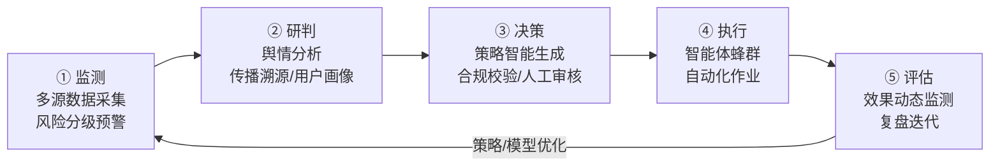
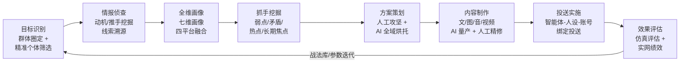
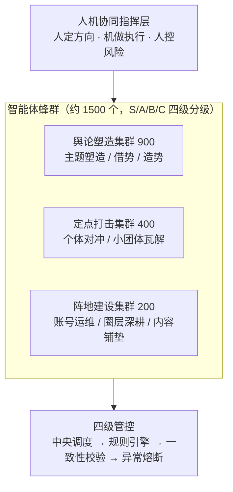
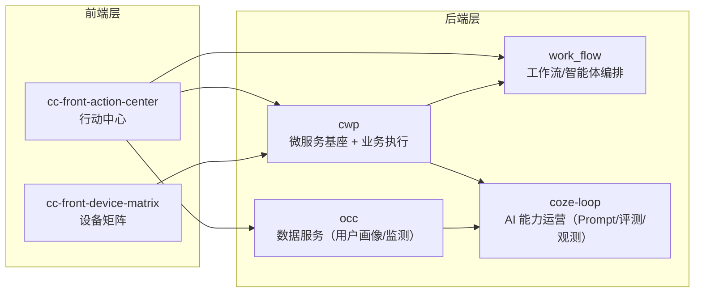
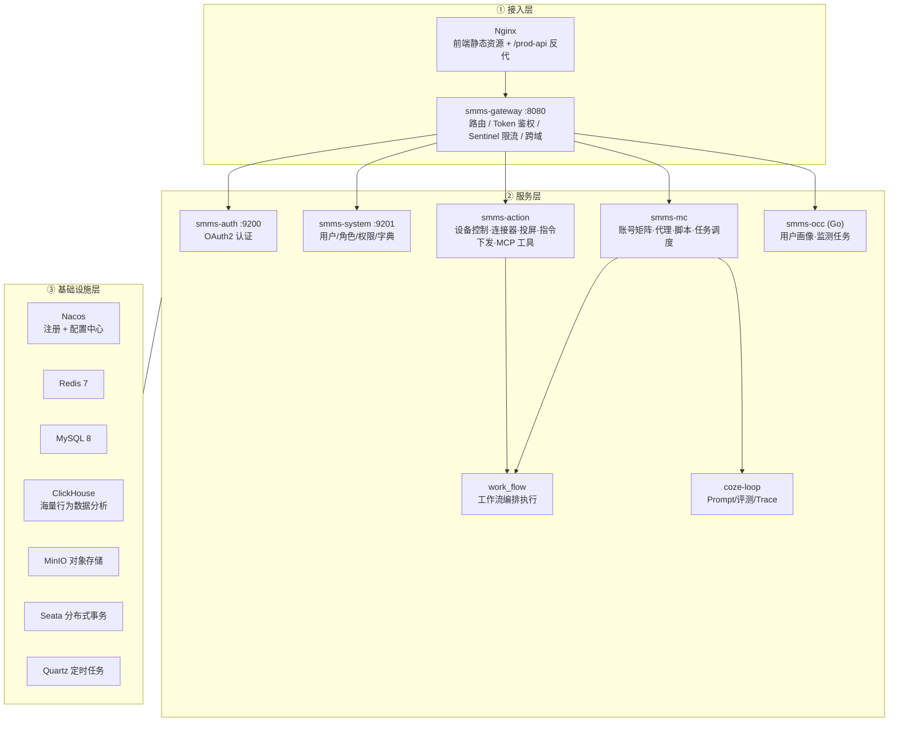
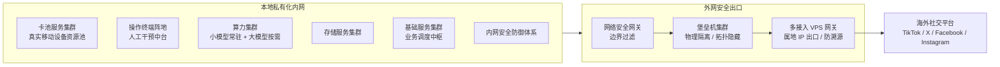
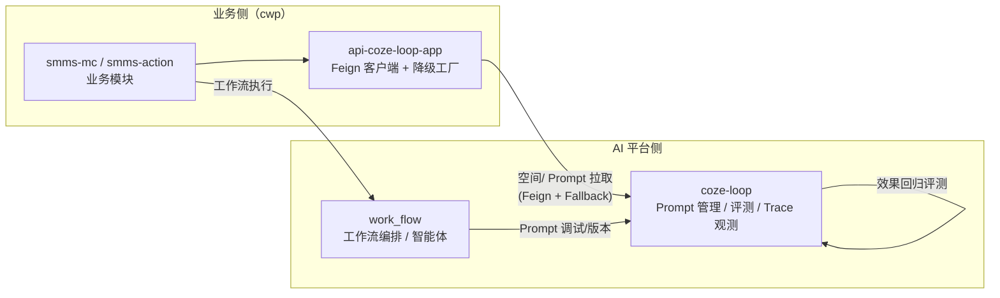
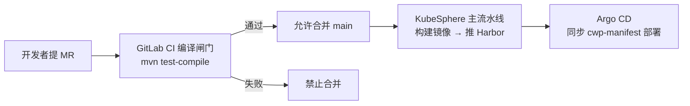
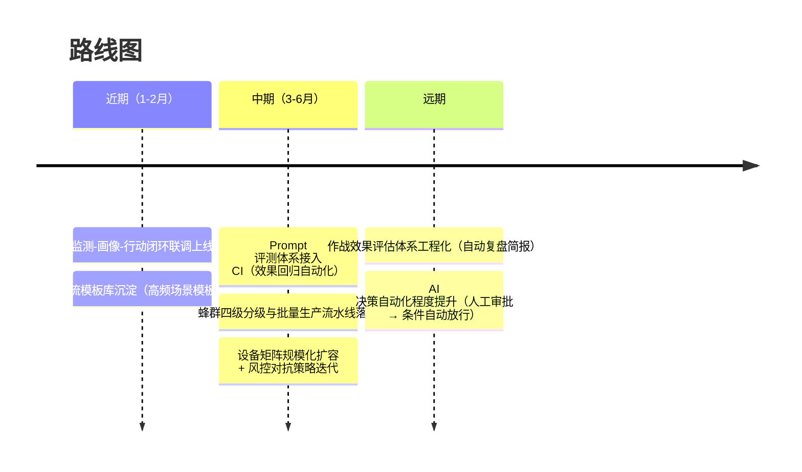

# 智能社媒行动平台 · 项目工作汇报

> 用法：每个 `---` 为一页幻灯片；图表为 Mermaid，可粘贴到 Marp、Obsidian、Typora 等工具渲染。
> 标注 `【待填】` 的地方需要替换成真实数据后再汇报。
> 理论依据：《一体化认知作战平台总体设计》（东南亚方向），见第 5–9 页。

---

## 第 1 页 · 封面

# 智能社媒行动平台
### 监测 → 画像 → 决策 → 行动的自动化闭环

- 汇报人：【待填】
- 日期：【待填】
- 核心价值：一套系统覆盖社媒监测、用户画像、AI 决策、设备矩阵执行四个环节。数据汇总、内容编写、多设备操作过去靠人工，现在由系统发现线索、AI 生成决策、设备自动执行。

---

## 第 2 页 · 目录

1. 背景与问题
2. 目标与成功指标
3. 总体设计（理论支撑）：业务闭环与子系统划分
4. 认知作战方法论与智能体蜂群体系
5. 解决方案总览：六个系统的分工
6. 技术架构与部署架构
7. 核心链路演示（Happy Path）
8. 工程效能与交付保障
9. 风险与应对
10. 下一步规划

---

## 第 3 页 · 背景与问题

当前业务有四个断点：

| 痛点 | 现状 | 业务影响 |
|------|------|----------|
| 数据割裂 | 社媒数据散落在各平台，靠人工汇总 | 发现线索慢，错过处置窗口 |
| 画像缺失 | 对目标用户缺乏结构化画像 | 行动缺依据，转化率低 |
| 决策靠人 | 内容策略、话术靠人工经验编写 | 质量不稳定，无法规模化 |
| 执行靠手 | 多账号、多设备操作靠人工逐个执行 | 人力成本高，易触发平台风控 |

> 数据支撑：【待填：如"人工操作单账号日均 X 条，目标 Y 条"等业务数据】

---

## 第 4 页 · 目标与成功指标

| 目标 | 指标 | 当前 | 目标值 |
|------|------|------|--------|
| 监测自动化 | 监测任务覆盖平台数（TikTok/X/Facebook/Instagram） | 【待填】 | 【待填】 |
| 画像规模化 | 日均画像处理量 | 【待填】 | 【待填】 |
| 决策 AI 化 | Prompt/工作流复用率 | 【待填】 | 【待填】 |
| 执行无人化 | 单任务人工介入时长 | 【待填】 | 降低 X% |
| 交付工程化 | MR 编译问题拦截率 | 0%（合并后才发现） | 100% 前置拦截 |

> 向老板汇报时重点讲第 1、4 行（业务 ROI）；向技术评审讲第 5 行（工程质量）。

---

## 第 5 页 · 总体设计：五环业务闭环

平台按"监测、研判、决策、执行、评估"五环运转，评估结果回流驱动下一轮：



- 监测：面向 TikTok、X、Facebook、Instagram 四大平台分级采集，日常天级增量、敏感期小时级轮询
- 研判：话题筛选、立场分类（敌/我/中立）、传播溯源、目标画像
- 决策：策略由 AI 生成，人工审核定稿，高危动作强制人工确认
- 执行：智能体蜂群按战术剧本协同作业，设备矩阵承载真实动作
- 评估：传播、互动、情绪、目标、风控五个维度量化复盘

---

## 第 6 页 · 四大子系统与代码仓库映射

设计文档划分四个子系统，每个都有对应工程实现：

| 子系统（设计文档） | 职责 | 工程实现（代码仓库） |
|--------------------|------|----------------------|
| 数据采集与管理 | 多源采集、治理存储、画像分析 | **occ**：监测任务、用户画像、ClickHouse 分析存储 |
| 智能体蜂群 | 账号培育、分层人机协同、集群调度 | **work_flow**（编排）+ **cwp smms-mc**（账号矩阵/代理/脚本/任务） |
| 认知作战（策略与内容） | 策略生成、Prompt 管理、效果评测 | **coze-loop**（Prompt/评测/观测）+ work_flow |
| 行动执行与设备承载 | 指令下发、设备控制、投送动作 | **cwp smms-action** + **cc-front-device-matrix** |
| 作业中台（操作终端阵地） | 监控看板、任务编排、人工干预 | **cc-front-action-center** |
| 保密与权限管控 | 权限可控、操作留痕、全程可追溯 | **cwp 基座**：gateway 鉴权 / auth / system 权限体系 |

> 这页是"理论 → 工程"的桥：评审问"设计和代码什么关系"，用这页回答。

---

## 第 7 页 · 认知作战方法论（八步流程）



- 目标分两级："群体"目标靠话题语义关联批量圈定，"精准"目标按社交活跃、信息敏感、情感极端、社交密度、位置关键五个维度打分筛选
- 画像七维：基础信息、通联方式、关系拓扑、性格特征、兴趣爱好、关注领域、发文内容特征
- 抓手五类：目标弱点、内部矛盾、外部矛盾、热点事件、长期焦点

---

## 第 8 页 · 智能体蜂群体系



- 分级建设：S 级精英人工打造，A 级半自动微调，B/C 级模板化流水线批量生成，控制单兵成本
- 柔性复用：静默期全员做阵地建设，舆情战时按主职战法执行，按事件规模动态调配
- 战术剧本标准化：造势引导、围点打援、深耕培育三类剧本，动作时序和节奏参数化
- 熔断四级：个体、批次、集群、系统，异常逐级暂停，保障作业可控

---

## 第 9 页 · 效果评估体系（两层）

| 层级 | 评估对象 | 核心指标 | 落地形式 |
|------|----------|----------|----------|
| 仿真评估（内部） | 宏观态势 + 微观个体 | 热度演进、情绪走势、个体立场时序、关系推演 | 复盘报告、画像时序库 |
| 实网绩效（中短期） | 单轮投送效果 | 负面占比变化、互动量、目标反应（删帖/停更/改口）、账号存活率 | 72h/168h 观测窗口自动复盘简报 |
| 实网绩效（长期） | 舆论生态改变 | 负面叙事衰减、线下事件发生率、账号矩阵存活率与粉丝增长 | 月度/季度趋势研判 |

评估结论回流战法库与 Prompt 库，下一轮作战的剧本、节奏参数、内容模板随之更新。

---

## 第 10 页 · 解决方案总览

六个系统组成一个闭环：



- **行动中心**：业务人员的工作台（监测、画像、任务编排）
- **设备矩阵**：终端设备与资源的管控台
- **cwp**：网关、认证、权限，加行动执行与账号矩阵业务
- **occ**：社媒数据的存储与分析（用户画像、监测任务）
- **work_flow**：AI 工作流编排引擎，可视化编排业务逻辑
- **coze-loop**：Prompt 开发、效果评测、链路观测

---

## 第 11 页 · 系统分工一览

| 系统 | 定位 | 技术栈 | 仓库形态 |
|------|------|--------|----------|
| cwp | 微服务基座 + 行动执行（设备控制、账号矩阵） | Spring Cloud Alibaba / Java 17 / Nacos / Sentinel / Seata | 多模块 Maven 仓库 |
| occ | 数据服务：用户画像、监测任务、文件 | Go / Gin / ClickHouse / GORM(MySQL) / MinIO | 单体 Go 服务（注册进 Nacos） |
| work_flow | 工作流与智能体编排引擎 | Go / DDD 微服务（基于 Coze Studio 二次开发） | 单体仓库 |
| coze-loop | AI 能力运营：Prompt 开发、评测、Trace 观测 | Go / 单体仓库（Rush 管理） | 单体仓库 |
| cc-front-action-center | 行动中心前端 | Vue 3.5 / TypeScript / shadcn-vue / vue-flow | 独立仓库 |
| cc-front-device-matrix | 设备矩阵前端 | Vue 3.5 / TypeScript / shadcn-vue | 独立仓库 |

关键设计取舍：AI 平台（coze-loop、work_flow）与业务系统（cwp、occ）解耦。AI 平台独立演进，业务侧通过 API 消费 AI 能力，两侧发版互不影响。

---

## 第 12 页 · 技术架构（分层视图）

本页主题：系统如何分层，数据往哪流。



---

## 第 13 页 · 部署架构（内网集群 + 外网出口）

按设计文档，系统采用本地私有化内网加多层隔离外网出口：



- 设备（卡池集群）承载采集与作业动作，异常设备自动下线隔离、转入养护池
- 推理全部在内网算力闭环完成，数据不出内网
- 外网作业经网关、堡垒机、VPS 三层转发，以属地 IP 出口，规避异地登录风控

---

## 第 14 页 · 关键设计：AI 能力与业务解耦

本页主题：业务系统如何消费 AI 能力。



- 业务侧只依赖 `api-coze-loop-app` 一个 Feign 客户端。AI 平台升级时业务代码不用改。
- 远程调用都带 Fallback 降级工厂。AI 平台故障时业务返回降级结果，不中断。
- Prompt 的编写、调试、版本、评测收敛在 coze-loop。每次修改有评测数据可查。

---

## 第 15 页 · 核心链路演示（Happy Path）

演示走核心价值路径：从发现目标到自动化行动。对应方法论的目标识别 → 画像 → 策划 → 投送 → 评估五步。异常路径（设备掉线、AI 平台降级、风控拦截）见附录 B，或口头补充。

```mermaid
sequenceDiagram
    participant U as 业务人员
    participant AC as 行动中心前端
    participant OCC as occ 数据服务
    participant LOOP as coze-loop
    participant FLOW as work_flow
    participant CWP as cwp (action/mc)
    participant D as 设备矩阵

    U->>AC: 创建监测任务
    AC->>OCC: 下发任务（ClickHouse 分析）
    OCC-->>AC: 目标用户画像结果
    U->>AC: 编排行动工作流（vue-flow 画布）
    AC->>FLOW: 发布工作流
    FLOW->>LOOP: 调用已评测的 Prompt
    U->>AC: 启动任务
    AC->>CWP: 下发执行指令
    CWP->>D: 账号矩阵 + 设备控制执行
    D-->>CWP: 执行结果回传
    CWP->>LOOP: 上报 Trace（执行过程可观测）
    AC-->>U: 任务报告 + 效果数据
```

---

## 第 16 页 · 工程效能与交付保障

两条流水线，职责分离：



- 编译问题在 MR 阶段拦截：闸门不过，GitLab 禁用合并按钮（Pipelines must succeed）。
- 合并进 main 后自动构建镜像、推 Harbor、Argo CD 部署，不用人工打包发版。
- 代码生成器提效：建表后生成后端代码和前端页面，新业务模块开发从【待填：X 天】降到【待填：Y 小时】。

---

## 第 17 页 · 风险与应对

| 风险 | 影响 | 应对 | 责任人 |
|------|------|------|--------|
| coze-loop / work_flow 为开源二开，上游升级合并成本高 | AI 平台能力滞后 | 锁定版本基线，按需 cherry-pick；改动集中在扩展点 | 【待填】 |
| AI 平台故障导致业务中断 | 行动链路不可用 | Feign Fallback 降级 + 业务侧缓存 Prompt 快照 | 【待填】 |
| 多账号自动化触发平台风控 | 账号封禁、设备封禁 | 代理池 + 设备指纹隔离 + 任务频控 + 四级熔断 | 【待填】 |
| ClickHouse 数据量增长超预期 | 查询变慢、存储成本上升 | 分区 + TTL 策略，冷热数据分层 | 【待填】 |
| 涉密业务的数据与操作泄露 | 安全事故、外部溯源 | 权限分级 + 操作留痕审计 + 内网闭环推理 + 堡垒机隔离出口 | 【待填】 |
| 前端双仓库组件重复建设 | 维护成本翻倍 | 沉淀公共组件库，统一 shadcn-vue 基线 | 【待填】 |

---

## 第 18 页 · 下一步规划



---

## 第 19 页 · 结束页

# 谢谢，请提问

总结：设计上有五环闭环和八步方法论，工程上六个系统已各就各位。下一步是规模化运行验证，补齐效果度量数据。

---

## 附录 A · 端口与服务清单（备查）

| 服务 | 端口 | 说明 |
|------|------|------|
| smms-gateway | 8080 | API 网关统一入口 |
| smms-auth | 9200 | OAuth2 认证中心 |
| smms-system | 9201 | 系统管理 |
| smms-file | 9300 | 文件存储（MinIO） |
| smms-gen | 9202 | 代码生成器 |
| smms-job | 9203 | Quartz 定时任务 |
| smms-monitor | 9100 | Spring Boot Admin 监控 |
| smms-occ | 8080(Go) | 用户画像/监测任务数据服务 |
| cc-front-device-matrix | NodePort 30082 | 设备矩阵前端 |

## 附录 B · 异常路径说明（口头补充）

1. 设备掉线：指令下发失败 → 任务自动重试 N 次 → 标记设备离线并告警
2. AI 平台不可用：Feign Fallback 返回降级结果 → 业务侧使用最近一次成功的 Prompt 快照
3. 风控拦截：账号触发验证 → 自动切换代理/设备 → 该账号进入冷却池

## 附录 C · 理论文档要点索引（备查）

汇报时被追问设计细节，可回到设计文档对应章节：

| PPT 页 | 设计文档章节 |
|--------|--------------|
| 第 5 页 五环闭环 | 总体设计 / 系统架构（图 1-1、1-2） |
| 第 6 页 子系统映射 | 总体设计 / 系统架构 |
| 第 7 页 八步方法论 | 认知作战子系统（目标识别→效果评估） |
| 第 8 页 蜂群体系 | 行动方案策划 / AI 智能体行动策略 |
| 第 9 页 效果评估 | 作战效果评估（仿真 + 实网绩效） |
| 第 13 页 部署架构 | 总体设计 / 系统部署（图 1-3） |
