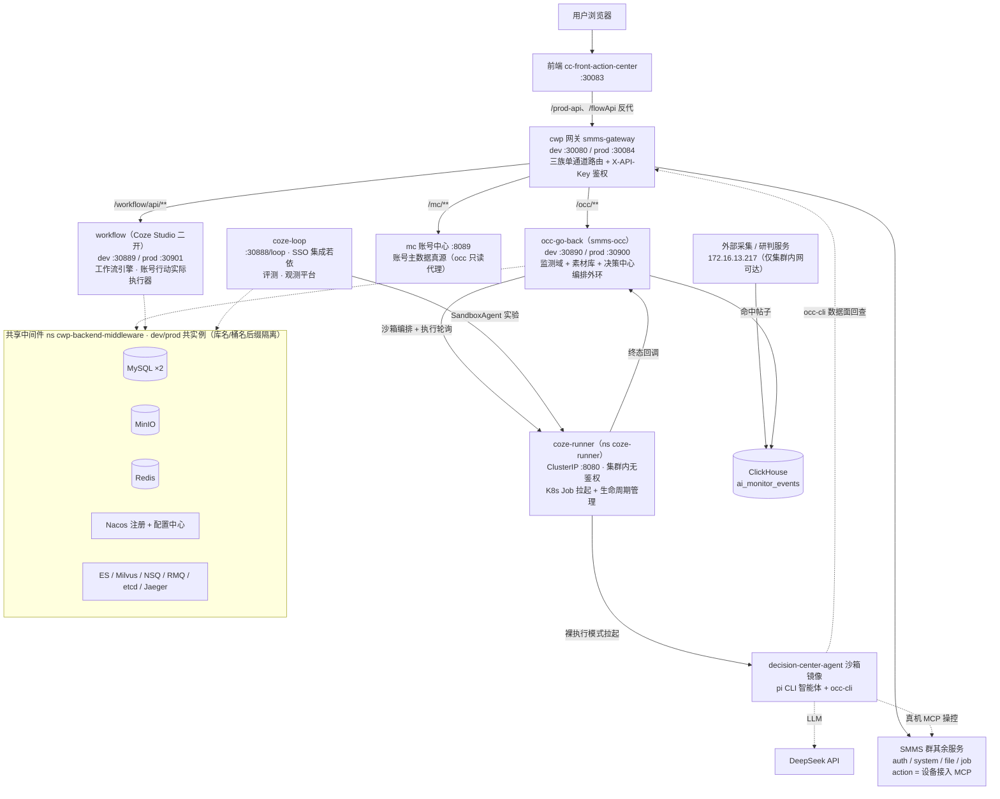

## 目录

1. [项目基本信息](#1-项目基本信息)
2. [生态整体逻辑](#2-生态整体逻辑)
3. [系统清单总表](#3-系统清单总表)
4. [各系统详述](#4-各系统详述)
5. [CI/CD 总览与维护](#5-cicd-总览与维护)
6. [交接在途事项](#6-交接在途事项)
7. [附录 A occ 本地联调速查](#附录-a-occ-本地联调速查)
8. [附录 B 跨仓文档索引](#附录-b-跨仓文档索引)

---

## 1. 项目基本信息

生态一共八个自研或二开的系统，加一套共享中间件，再加两块外部服务。它们互相不直连，对外访问一律走 cwp 网关 30080 这一个入口，配置一律从 Nacos 拿，中间件 dev 和 prod 共用实例，靠库名和桶名加后缀隔离数据。这三条记住，后面所有部署行为都能对上号。

### 1.1 代码仓库清单

| 仓库                                       | 系统                                                          | 负责人        |
| ---------------------------------------- | ----------------------------------------------------------- | ---------- |
| `cognitive-warfare-program/occ-go-back`  | occ 后端主服务（Go，服务名 smms-occ）                                  | 石建国/郝宇     |
| `zhangyanjie/cc-front-action-center`     | 前端（Vue3）                                                    | 张艳杰        |
| `LYX/work_flow`                          | workflow 工作流引擎（Coze Studio 二开）                              | 李应许        |
| `cognitive-warfare-program/cwp`          | SMMS Spring Cloud 微服务群（网关/认证/mc/设备接入等）                      | 皮理豪、杨志、王振宇 |
| `cognitive-warfare-program/cwp-manifest` | cwp 群 + 前端的部署清单仓                                            | 石建国        |
| `cognitive-warfare-program/coze-loop`    | Coze Loop 平台（评测/观测，二开部署）                                    | 石建国        |
| `cognitive-warfare-program/coze-runner`  | 智能体容器执行服务                                                   | 石建国        |
| `cognitive-warfare-program/occ-manifest` | occ/workflow/coze-loop 三服务部署清单 + nacos 模板 + 中间件清单           | 石建国        |
| `earendil-works/pi`（GitHub 开源）           | pi-coding-agent + pi-memory（沙箱内 agent CLI，npm 依赖引入，不直接维护源码） | 石建国        |


### 1.2 访问地址总表

集群入口节点 `10.254.1.3`，另一个节点 `10.1.1.30` 的 NodePort 等价可达。

**应用/控制面入口**

| 地址 | 用途 |
|---|---|
| `http://10.254.1.3:30083` | 前端页面（occ 全部页面入口） |
| `http://10.254.1.3:30080` | cwp 网关 dev，全部后端 API 总入口。三族路由 `/occ/**`、`/workflow/api/**`、`/mc/**`，X-API-Key 鉴权 |
| `10.254.1.3:30084` | cwp 网关 prod（smms-gateway-external-prod） |
| `10.254.1.3:30890 / 30900` | occ 后端 dev / prod 直连 NodePort |
| `10.254.1.3:30889 / 30901` | workflow dev / prod NodePort |
| `http://10.254.1.3:30888/loop/` | coze-loop 控制台 dev（SSO 登录/验证码经 `/prod-api` 反代 smms-gateway），API 32491，prod 30902/30903 |
| `10.254.1.3:30002` | Harbor 镜像库（HTTP registry，客户端需 insecure 配置） |
| `10.254.1.3:30848` | Nacos 控制台（另有 30850/31848） |
| `10.254.1.3:30880` | KubeSphere |

**中间件（NodePort，dev/prod 共实例、后缀隔离数据）**

| 地址 | 说明 |
|---|---|
| `31306` | MySQL（coze-loop 系，occ/opencoze/cozeloop 三族库，root / cozeloop-mysql） |
| `30306` | MySQL（smms 系，smms-config/smms-cloud） |
| `31900` | MinIO（root / cozeloop-minio，bucket occ/opencoze/cozeloop 各 dev/prod） |
| `31090` | ClickHouse（default / cozeloop-clickhouse）。⚠️ occ-go-back 根 `config.yaml` 写 31823，交接时核对现行 NodePort |
| `30379` | Redis |
| `31200 / 31201` | Elasticsearch / Milvus（wf-* 系，workflow 自用） |
| `30686` | Jaeger UI |

**外部服务**

| 地址 | 用途 |
|---|---|
| `http://172.16.13.217:31665(6)` | 外部采集/研判服务（monitor/start），仅集群内网可达，本地联调须走 occ-go-back `scripts/local-analysis-relay.sh` 中继（郝宇负责） |
| `http://172.16.13.217:30910` | 媒体服务（mediaBaseUrl），郝宇负责 |
| `https://api.deepseek.com/v1` | 沙箱智能体 LLM（DeepSeek） |

### 1.3 K8s 命名空间地图

| 命名空间 | 内容 | 部署方式 |
|---|---|---|
| `cwp-occ-backend-dev` / `cwp-occ-backend-prod` | occ / workflow / coze-loop 双环境（ArgoCD 应用 cwp-occ-backend-{dev,prod}） | ArgoCD 自动 |
| `cwp` | SMMS Spring Cloud 微服务群（网关、mc、smms-action 等） | ArgoCD（cwp-manifest） |
| `cwp-frontend-dev` / `cwp-frontend-prod` | 前端 | ArgoCD（cwp-manifest） |
| `cwp-backend-middleware` | 全部共享中间件 | 手动部署，不经 ArgoCD，`kubectl apply -k` |
| `coze-runner` | 智能体容器执行服务 | 流水线直接 apply，无 ArgoCD |
图文指导：


流水线页面，通过jenkins实现流水线功能，目前每一个代码中都有jenkins文件。


这个是持续部署页面


### 1.4 账号与凭证

| 凭证 | 值 / 位置 | 用途 |
|---|---|---|
| cwp 网关 API key | `sk-USr8nAvlH8moydBil0yVe98ITa5JjY2NdXTv6N9z8Z4`（occ `config.yaml` decisionConfig，2026-09-07 换过，旧 key 已失效） | 网关鉴权（X-API-Key 单头），occ-cli / 容器访问 workflow 与 mc |
| DeepSeek API key | occ `config.yaml` 的 decisionConfig.modelApiKey | 沙箱内 LLM |
| 中间件 root | `cozeloop-mysql` / `cozeloop-minio` / `cozeloop-clickhouse`（见 config.yaml） | MySQL/MinIO/CH |
| Harbor `robot$occ+occ-ci` | KubeSphere 凭证 `harbor-occ` | occ / work_flow 流水线推镜像 |
| Harbor `robot$kubesphere-devops` | KubeSphere 凭证 `harbor-credentiala` | 前端 / cwp / coze-loop 流水线推镜像 |
| Harbor `robot$coze-runner-push` | KubeSphere 凭证 `harbor-coze-runner` | coze-runner 流水线推镜像 |
| GitLab 凭证 `gitlab-cc-front` | sjg 个人账号（用户名加 access token，basic-auth） | occ / work_flow / coze-loop / coze-runner 流水线拉源码，交接必换，见 §6.1 |
| GitLab 凭证 `gitlab-cwp` / `gitlab-cwp-manifest` | cwp 流水线源码/清单仓 | cwp CI |
| `k3s-kubeconfig` | KubeSphere 凭证（kubeconfig 类型） | coze-runner 流水线直接部署 |
| mc 测试账号清单 | 交接人本地备忘 | 本地联调账号解析 |
| KubeSphere / Jenkins / ArgoCD / Nacos / GitLab 个人账号、coze-loop 平台 PAT | 待补，当面移交 | 控制台/平台 |

---

## 2. 生态整体逻辑

### 2.1 系统关系图



### 2.2 业务主线（数据流）

1. **监测**。外部采集/研判服务持续采集，命中帖子落 ClickHouse 的 `ai_monitor_events` 表，occ-go-back 在上面提供监测项目、任务、事件分析、重点帖和图表，前端呈现。
2. **决策**。occ 决策中心会话绑定四类资源，监测事件、素材项目、工作流、会话账号组。occ 调 coze-runner 拉起 agent 沙箱，容器里的 pi 智能体经 occ-cli 走网关回查数据，起草编排方案、补填参数，会话状态持久化到 MinIO 和 MySQL。
3. **执行**。方案批准后物化成台账行（账号×工作流），occ 外环在行级计划窗内随机取定执行点定时派发，经网关调 workflow 执行，动作最后落在 mc 管理的真实账号上。
4. **留痕**。台账行执行成功单向投影成行动记录（action_record），人工 Excel 导入是第二来源，两者一起支撑复盘。
5. **评测观测**。coze-loop 承担 prompt 开发、智能体评测和 Trace 观测，沙箱实验经 coze-runner 跑。

有一条原则贯穿整套设计，智能体只起草、不执行。执行的提交、状态跟踪、回调接收、定时派发全在 occ 的编排外环，数据面访问一律走网关单通道，这是票 31 定的口径，配置里不存在直连 occ、flowApi 或 mc 的地址键。

### 2.3 环境与数据隔离

三个环境。本地开发 NodePort 直连、用无后缀库名，dev 在 ns cwp-occ-backend-dev，prod 在 cwp-occ-backend-prod。

dev 和 prod 共用一套中间件实例，数据隔离靠库名、bucket、索引名加 `-dev` 或 `-prod` 后缀，再加 Nacos namespace（tenant dev/prod）。建库建桶不用手工做，occ-manifest 的 `init/` 下有幂等 Job 挂着 ArgoCD Sync Hook，每次同步自动执行，dev 和 prod 两套一次建齐。

有两个已知共享面心里要有数。Redis 是 db0 共享，应用侧靠 key 前缀隔离。ES、Milvus、NSQ、etcd 按名字共存，只有 workflow 和 coze-loop 用。

---

## 3. 系统清单总表

| # | 系统 | 仓库 | 技术栈 | 部署 | 作用 | 负责人 |
|---|---|---|---|---|---|---|
| 1 | occ-go-back（smms-occ） | occ-go-back | Go 1.25 / Gin / GORM | ns cwp-occ-backend-{dev,prod}，NodePort 30890 dev / 30900 prod | 业务主体，监测域、素材库、决策中心编排外环 | 石建国 |
| 2 | cc-front-action-center | cc-front-action-center | Vue3 / Vite / pnpm / nginx | ns cwp-frontend-{dev,prod}，NodePort 30083 | 全部前端页面 | zyj |
| 3 | workflow | LYX/work_flow | Coze Studio 二开（Go + React） | ns cwp-occ-backend-{dev,prod}，NodePort 30889 dev / 30901 prod | 工作流引擎，账号行动的实际执行器 | LYX |
| 4 | cwp 网关（smms-gateway） | cwp | Spring Cloud Gateway | ns cwp，NodePort 30080 dev / 30084 prod | 全后端 API 总入口、鉴权、限流 | Java 团队 |
| 5 | mc（smms-modules-mc） | cwp | Spring Boot（端口 8089） | ns cwp | 账号主数据真源 | Java 团队 |
| 6 | smms-action 等其余 SMMS 模块 | cwp | Spring Cloud | ns cwp | 认证、系统管理、文件、任务调度、设备接入 MCP | Java 团队 |
| 7 | coze-loop | coze-loop | Go + Rush 前端（单镜像） | ns cwp-occ-backend-{dev,prod}，NodePort 30888 挂 /loop | 评测观测平台 + 沙箱实验 | sjg |
| 8 | coze-runner | coze-runner | Go | ns coze-runner，ClusterIP 8080 | 批量智能体容器执行 | sjg |
| 9 | 共享中间件群 | occ-manifest `middleware/` | MySQL/CH/MinIO/Redis/ES/Milvus/NSQ/RMQ/etcd/Nacos/Jaeger | ns cwp-backend-middleware | 全生态的数据和配置都落在这一层 | 待补 |
| 10 | 外部采集/研判 | 集群外 172.16.13.217 | 无 | 无 | 命中帖子数据源、监测启动、媒体服务 | 郝宇 |
| 11 | decision-center-agent 镜像 | occ-go-back `image/` | node22 + pi + occ-cli | Harbor `cwp/decision-center-agent` | 沙箱智能体运行时，手动构建，见 §5.3 | 石建国 |

---

## 4. 各系统详述

### 4.1 occ-go-back

你接手以后，九成时间会花在这个仓库。业务上监测、素材、策略处置、决策中心的全部后端都在这里，技术上是 Go 单体，`initialize/` 装配，`api/` 承接 handler（decision_* 和 monitor_* 文件名前缀分域），`service/` 是业务逻辑，跨服务事务编排在 strategy_domain 和 disposal_domain，`model/` 按域拆成 decision 和 monitor 两个子包。有三个容易漏掉的子资产，`cmd/occ-cli` 是沙箱里智能体用的命令行，`image/` 是沙箱镜像本身，`clickhouseparser/` 是 ClickHouse 查询解析，单独可测。

配置分三层。本地开发读仓库根目录的 config.yaml，NodePort 直连中间件。集群里启动先从 Nacos 拉 `smms-occ-{env}.yaml`，整段覆盖 mysql、clickhouse、minio 三块，拉不到就直接退出，不做静默回退，这个行为是有意的，怕的是配置失效了还在跑。模板唯一来源在 occ-manifest 的 `nacos/templates/`，用 `seed.sh` 发布，`DECISION_*`、`OCC_MINIO_*` 这些 env 可以覆盖单次运行。服务自注册 Nacos，名字 smms-occ，dev 固定 ClusterIP 10.43.200.200，prod 是 .201，由 overlay 注入。

数据落在三处。MySQL `occ-mysql-{dev,prod}` 是业务真源，ClickHouse `ai_filter-dev` 存命中帖、只读，MinIO `occ-minio-{dev,prod}` 存素材（key 格式 `{fileType}/{date}/{proj}/{uuid}-{name}`）和 pi 会话文件。

对外接口统一挂 `/userProfile` 前缀，返回统一信封 code/msg/data/total/page/size。runner 的终态回调在 `/userProfile/decision/runner/callback`，occ-cli 的数据面接口带任务级白名单。合并前跑 `make test`，这是唯一硬门禁，不依赖外部服务，SQLite 替身加 occ-cli 进程边界测试，全绿才走。想连真库，`TEST_MYSQL_DSN` 指一次性测试库（会建表会 DROP，别指向共享 dev 库），CH 集成测试用 `CH_TEST_ADDR`，不设就跳过。

### 4.2 cc-front-action-center

全部业务页面在这，监测、素材、决策中心、策略库、复盘。Vue 3.5 加 Shadcn Vue Admin，Vite 加 pnpm。有个历史坑要记着，`vue-tsc` 门偶发卡死，验证用 `vite build`。生产构建在 dockerfile 的 node22 阶段里完成，`.env.production` 构建时现场生成，不入库。

部署形态是 nginx 托管 SPA，`/prod-api` 和 `/flowApi` 反代到后端网关，NodePort 30083。本地联调 `DECISION_API_TARGET=http://127.0.0.1:8080 pnpm dev`，指向本机后端。仓里的 `DEPLOYMENT.md` 是部署加运维 FAQ，里面 ArgoCD 应用和命名空间的描述跟 Jenkinsfile 注释有新旧两版口径，拿不准时以流水线实际参数为准。负责人 zyj，仓在他个人名下。

### 4.3 workflow（work_flow）

Coze Studio 开源版二开，部署名 workflow。在决策中心里它是台账行动作的实际执行器，同时也是一个独立的智能体和工作流可视化开发平台，模型管理、插件、知识库、提示词都有。Go 后端加 React 前端，本生态把它部署成单个 backend 镜像，里面含 sandbox runner 和 `.env.dev` 兜底。

它靠 nacos-registrar sidecar 注册进 Nacos，env `NACOS_NS` 区分环境。数据用 MySQL `opencoze-{dev,prod}` 和 MinIO 桶 `opencoze-{dev,prod}`，自用中间件是 wf-elasticsearch、wf-milvus、nsq、etcd（31200/31201）。配置走 `workflow-{env}.cfg`，白名单键覆盖镜像内 .env.dev。

occ 对它的访问全经网关 `/workflow/api/**`，查工作流元数据、查参数 schema、发起执行、查状态。工作流空间不用显式配，occ 的 `decisionConfig.workflowSpaceId` 留空就按网关 key 自动解析个人空间，每个 key 的属主空间不同。负责人 LYX，也是个人仓。

### 4.4 cwp / SMMS 微服务群

Java 这边的 Spring Cloud Alibaba 微服务群，网关、认证、账号中心和设备接入都由它提供，前端 `/prod-api` 反代的源头也是它。栈是 Spring Boot 3.5 加 Spring Cloud 4.3 加 Spring Cloud Alibaba，Nacos 注册配置，Sentinel 限流，Seata 分布式事务，OAuth2 加 Redis Token，MyBatis-Plus，Quartz，MinIO。

| 服务 | 端口 | 作用 |
|---|---|---|
| smms-gateway | 8080 | API 网关，路由转发、Token 鉴权、Sentinel 限流、跨域 |
| smms-auth | 9200 | 认证中心，OAuth2 登录、Token 签发校验、图形验证码 |
| smms-system | 9201 | 系统管理，用户/角色/菜单/部门/字典/日志 |
| smms-file | 9300 | 文件存储，上传删除防盗链，本地盘或 MinIO |
| smms-gen | 9202 | 代码生成器 |
| smms-job | 9203 | Quartz 定时任务 |
| smms-monitor（smms-visual） | 9100 | Spring Boot Admin 服务监控 |
| smms-modules-mc | 8089 | 账号中心 mc，行动平台账号主数据真源，occ 经网关只读代理、不做本地副本，账号分组配置由 occ 维护 |
| smms-action | 无 | 设备接入，MCP 端点加 startDebug/stopDebug 签发设备级 MCP_DEVICE_TOKEN，供 coze-runner 真机执行。README 微服务表里没列它，交接后建议补上文档 |
| test-a | 9205 | 业务测试模块 |

两个服务跟 occ 打交道最多。mc 是账号主数据真源，补行和 Excel 导入按平台加用户名在 mc 全量已发布账号里解析，组只作上下文。smms-action 管真机，设备占用和释放走它的 startDebug/stopDebug，token 签发后塞进执行 env。

数据在 smms-mysql（30306），`smms-config` 是 Nacos 配置库、全部微服务配置都在里面，`smms-cloud` 是业务库，另有 Seata 库。SQL 种子在 cwp 仓的 `sql-20260725/`。部署在 ns cwp，cwp-manifest 加 ArgoCD，流水线一次构建 7 个镜像。负责人是 Java 团队。

### 4.5 coze-loop

Coze Loop 开源版二开部署，管 prompt 开发（Playground 和版本管理）、评测（评测集、评估器、实验）和观测（Trace 全过程可视化），沙箱智能体实验的评测宿主也是它。Go 1.24 以上后端加 Rush 管的前端，打成单个镜像，后端加前端静态资源加 nginx 一体。

控制台在 `http://10.254.1.3:30888/loop/`。它接了若依 SSO，前端构建期 `PUBLIC_BASE=/loop`，console API `/loop/api/**` 和登录验证码 `/prod-api/**` 都反代 smms-gateway，清单 env 里的 COZE_LOOP_API_UPSTREAM 和 RUOYI_GATEWAY_UPSTREAM 管这两个上游。数据用 MySQL `cozeloop-mysql-{dev,prod}`、ClickHouse `cozeloop-clickhouse-{dev,prod}`、MinIO 桶 `cozeloop-minio-{dev,prod}`。配置在 entrypoint 启动时从 Nacos 拉 `cozeloop-{env}.cfg`，export 成 `COZE_LOOP_*`，拉不到就退出，kill-switch 是 `COZE_LOOP_NACOS_CONFIG_ENABLED=false`。

它跟 coze-runner 的关系是，实验执行提交给 runner，走 DEFAULT_IMAGE 等于 pi-shim 那条路，平台 PAT 注入，执行日志按 log_callback 契约回灌，L1 ingest 已上线。负责人 sjg。

### 4.6 coze-runner

这个服务管容器的生老病死。occ 或 coze-loop 把镜像、命令和 env 交给它，它拉一个 K8s Job 出来管到终态，把结果回传。Task 是共享并发配额的批次单元（concurrency 1 到 64），Execution 是一次容器运行，状态机从 queued 到 running 再落到 succeeded、failed、canceled 三个终态。超时靠 Job 的 activeDeadlineSeconds 强杀，上限 3600 秒，Job 结束后 10 分钟 TTL 自动回收。日志每执行一份，1MB 截断保尾，保留 24 小时，配了 `LOG_ARCHIVE_URL` 会回落 ClickHouse 存 30 天。

API 在 8080 端口，集群内没有鉴权，安全边界就是集群内可达，所以不要把它对外暴露。常用的几个接口，`POST /v1/tasks` 建任务，`POST /v1/tasks/{id}/executions` 提交执行，`GET /v1/executions/{id}` 轮询状态，`GET /v1/executions/{id}/logs` 按 since_seq 游标增量读日志，`GET /v1/executions/{id}/events` 是 SSE 实时事件流，转发容器的 thinking、text、tool_call 和 turn_end。

设备接入这条要注意。提交时带 `needs_device: true` 就必须在 env 里给 `MCP_SERVER_URL`（smms-action 的端点）和 `MCP_DEVICE_TOKEN`，缺一个直接 400。runner 自己对设备零调度，占用和释放都归提交方管。

配置三级优先，Nacos（`coze-runner-<ns>.cfg`，15 秒热更）高于进程 env 高于代码默认。本地开发 `RUNTIME=fake go run .`，默认不注册 Nacos，防笔记本 IP 混进服务发现。occ 联调要 `kubectl port-forward -n coze-runner svc/coze-runner 18080:8080`，这条连接容易断，断了重连。occ 对它用裸执行模式，显式传 image，不注入平台凭证，不经 shim，终态回调 occ。负责人 sjg，设计文档和 ADR 在 coze-loop 仓的 `.scratch/coze-runner/`。

### 4.7 共享中间件群

全生态的数据和配置都落在这一层，ns `cwp-backend-middleware`。分三堆，`wf-*` 是 elasticsearch、etcd、milvus、nsq，workflow 自用；`shared/` 是 coze-loop 系的 mysql、redis、clickhouse、minio、rmq、faas；`cwp/` 是 smms-mysql、redis、nacos、jaeger，其中 Nacos 的数据存在 smms-mysql 的 smms-config 库里。

这一层是全生态唯一手动部署的部分，不经 ArgoCD。清单变更后跑 occ-manifest 仓的 `bash scripts/apply-middleware.sh`。有状态组件跨命名空间迁移前先做 PV 平移，步骤 occ-manifest README 写得细，reclaimPolicy 改 Retain、删旧 PVC、改 PV 的 claimRef、新 ns 预建同名 PVC，迁移前先 mysqldump 把 smms-mysql 和 coze-loop-mysql 全库备出来。

运维上记住两条。prod 和 dev 共实例，prod 库不要做实验性写入。全生态的配置真源是 Nacos，四族 dataId 模板都在 occ-manifest 的 `nacos/templates/`。负责人待补。

### 4.8 外部服务

采集研判在 172.16.13.217，monitor/start 触发采集（31665/31666，dev 和本地两套 NodePort 见各 config），30910 是媒体服务。这些地址只有集群内网可达，办公网直连 172.16.13.x 会碰到一个坑，网关只代答 TCP 握手不转发数据，ping 正常但业务必然超时，本地联调要走 occ-go-back 的 `scripts/local-analysis-relay.sh`，路径是本机 31666 经 kubectl port-forward 到 workflow Pod 的 nacos-registrar 容器，用 busybox nc 中继过去。负责人郝宇。

DeepSeek 是沙箱智能体的 LLM，occ `decisionConfig.model*` 里配的 `deepseek-v4-flash-vision-exp`，窗口 1M、输出上限 384K（下发的 modelMaxTokens 是 32768）。key 在提交 execution 时走白名单直通进容器 env，不落库不落日志，进程 env `DECISION_MODEL_*` 可覆盖。

### 4.9 部署清单仓

GitOps 靠两个清单仓撑着。occ-manifest 管后端三服务，`apps/{occ, workflow, coze-loop}` 是应用基座，dev 默认值、prod overlay 覆盖；`overlays/{dev, prod}` 是 ArgoCD 入口；`init/` 是幂等初始化 Job 加 SQL 和 ES 模板；`nacos/templates/` 是四族 dataId 模板加 seed.sh，配置的唯一来源；`argocd/` 是 Application 定义，引导时手工 apply 过。cwp-manifest 管 cwp 群和前端，`overlays/{smms,frontend}-{dev,prod}`，同一套模式。

维护上只有一条铁律，改配置先改模板再 seed，不要手改 Nacos 控制台，手改会和模板漂移。另外这两个仓有流水线自动写入（镜像 tag 加 conf 同步），人工提交时注意别撞上，流水线 push 失败会 pull --rebase 重试。occ-manifest 负责人 sjg，cwp-manifest 也是 sjg。

---

## 5. CI/CD 总览与维护

先讲一遍改动怎么变成跑在集群里的服务。以 occ 为例，你把代码合进 main，流水线几分钟内轮询到，拉源码，先做纯文档检查，全部是 *.md 或 docs/ 的提交直接 ABORTED 跳过。过了检查就 podman 构建（go 静态编译在多阶段 Dockerfile 里完成），推 Harbor，然后 clone occ-manifest，把 overlays 对应环境的镜像 tag 改成新值推回去。ArgoCD 盯着清单仓，tag 一变就把新镜像滚动进集群，init Job 顺带幂等跑一遍，dev 和 prod 两套库桶一次建齐。镜像本身不分环境，中间件配置全靠 Nacos 按 namespace 给，所以同一个镜像 tag 在 dev 和 prod 都能用。

### 5.1 流水线矩阵

全生态七条自动流水线加一条手动构建。

| # | 源码仓 | 触发 | 构建产物 | Harbor | 清单仓 | 部署 |
|---|---|---|---|---|---|---|
| ① | occ-go-back | 轮询 main（dev）/手动 prod | go 静态编译镜像 | `occ/occ-go-back` | occ-manifest + 同步 `apps/occ/conf/config.yaml` | ArgoCD cwp-occ-backend-{dev,prod} |
| ② | work_flow | 同上 | backend 单镜像（Go+sandbox runner+.env.dev） | `occ/workflow` | occ-manifest + 同步 `init/workflow/`（schema/ES 模板） | 同上 |
| ③ | coze-loop | 同上 | 单镜像（Go+Rush 前端+nginx） | `occ/coze-loop` | occ-manifest + 同步 `apps/coze-loop/conf/`、`init/cozeloop/` | 同上 |
| ④ | coze-runner | 轮询 master（dev）/手动 prod | 多阶段镜像（内含 go test） | `cwp/coze-runner` | 无，用源码仓 `deploy/overlays` | 流水线 `kubectl apply -k`（凭证 k3s-kubeconfig） |
| ⑤ | cwp | main 合并 | mvn 构建 + 7 镜像 | `cwp/*` | cwp-manifest（overlays/smms-{dev,prod}） | ArgoCD 到 ns cwp |
| ⑥ | cc-front-action-center | main 合并 | node22 内 pnpm build 后打 nginx 镜像 | `cwp/cc-front-action-center` | cwp-manifest（overlays/frontend-{dev,prod}） | ArgoCD 到 ns cwp-frontend-{dev,prod} |
| ⑦ | occ-go-back `image/`（agent 镜像） | 手动跑 `./image/build.sh` | node22+pi+occ-cli 镜像 | `cwp/decision-center-agent:<pi版本>-<迭代>` | 无，改 Nacos agentImage 生效 | coze-runner 按 occ 配置拉起 |

公共约定有几条。全部跑在 KubeSphere DevOps（Jenkins，agent label `maven`，podman 构建）。Harbor 是 HTTP registry，构建时要写 insecure 配置。`DEPLOY_ENV` 参数 dev 是默认，发 prod 必须手动 Build with Parameters 选 prod。纯文档提交自动跳过。

### 5.2 各流水线差异

①到③是后端三件套，流程一致，差别只在各自往 occ-manifest 同步的东西，occ 带 `apps/occ/conf/config.yaml`，workflow 带 `init/workflow/` 的 schema 和 ES 模板，coze-loop 带 `apps/coze-loop/conf/` 和 `init/cozeloop/`。

④ coze-runner 是唯一的例外，它没有清单仓也没有活跃的 ArgoCD Application，部署阶段直接 `kubectl apply -k` 源码仓的 deploy/overlays，凭证是 KubeSphere 里的 k3s-kubeconfig。哪天要把清单演进成 GitOps，把部署阶段换成清单仓提交就行。

⑤ cwp 是 mvn 构建后 copy jar 到各自 dockerfile 打 7 个镜像。⑥ 前端的构建在镜像内完成，agent 只需要 base 容器的 podman，`.env.production` 构建时生成。

### 5.3 decision-center-agent 镜像（手动）

```bash
./image/build.sh                     # 构建+推送 10.254.1.3:30002/cwp/decision-center-agent:<pi版本>-<迭代>
ITER=2 ./image/build.sh              # 同 tag 修复迭代（runner Pod PullAlways，重推即生效）
PI_VERSION=x ITER=1 ./image/build.sh # 升级 pi 版本（tag 随之变，升级走回归）
```

tag 等于 pi-coding-agent 版本加迭代号，pi 版本钉死在 tag 上，升级走回归，`image/smoke/` 里有端到端冒烟脚本，覆盖 echo 模式、agent 模式、审批挂起和会话持久化。

发布路径要记牢，推了镜像不等于生效。生效靠改 occ 配置里的 `decisionConfig.agentImage`，配置真源是 occ-manifest 的 `nacos/templates/smms-occ-{env}.yaml`，seed 发布后重启 occ。现在就欠着这样一件事，最新镜像 0.84.1-32 已经推到 Harbor，根 config.yaml 写着 -31，deploy/config.yaml 写着 -29，Nacos 还没改，接手后第一件事就是把三处改成同一个 tag。Harbor 凭证用 `docker login`，不要写进任何文件。

### 5.4 Nacos 配置维护

四族 dataId 分别是 occ 的 `smms-occ-{env}.yaml`、workflow 的 `workflow-{env}.cfg`、coze-loop 的 `cozeloop-{env}.cfg`、coze-runner 的 `coze-runner-<ns>.cfg`（15 秒热更），cwp 走 Spring 原生多文件。

改配置的流程固定三步，改 occ-manifest `nacos/templates/` 里的模板，跑 `nacos/seed.sh` 发布，重启对应服务（coze-runner 不用重启，它热更）。occ 侧改中间件地址、网关地址、模型、agent 镜像都在这条路里改，仓库内的 config.yaml 只是本地开发兜底，改它不影响集群。

### 5.5 发布 prod 检查单

1. dev 环境验证通过，ArgoCD 应用 cwp-occ-backend-dev 状态 Healthy；
2. 对应流水线手动 Build with Parameters 选 prod（cwp 网关 prod 走 smms-gateway-external-prod 30084）；
3. 观察 ArgoCD prod 应用同步，coze-runner 没有 ArgoCD，看流水线 apply 日志；
4. 改动涉及 agent 镜像或中间件地址时，同步改 `nacos/templates/*-prod.*` 并 seed；
5. prod 数据只靠后缀隔离，prod 库不做实验性写入。

### 5.6 日常维护与已知坑

| 事项 | 说明 |
|---|---|
| `make test` 全绿 | occ-go-back 合并前唯一硬门禁 |
| Jenkinsfile 头注释过时 | `hjdz/hjdz-manifest` 是历史命名，实际命名空间见 §1.3 |
| ClickHouse 端口 | 根 config.yaml 写 31823，manifest README 写 31090，需核对 |
| agentImage tag 漂移 | -32 待进 Nacos，见 §5.3 |
| 凭证 `gitlab-cc-front` 是个人账号 | 交接必换，否则四条 CI 全断 |
| coze-runner port-forward | 本地联调必开且易断（18080 转 8080） |
| 分析服务中继 | 办公网直连 172.16.13.x 必超时，用 `scripts/local-analysis-relay.sh` |
| 网关 key 失效表现 | 报“API Key 无效或已禁用”，换 key 后对 occ、workflow、mc 三族路由冒烟 |
| 中间件变更 | 不经 ArgoCD，手动 apply，有状态先 PV 平移加 mysqldump 兜底 |
| smms-action 无文档 | README 微服务表未列（设备接入 MCP），建议补 |
| Nacos 手改漂移 | 一切配置改动走模板加 seed，勿控制台直改 |

---

## 6. 交接在途事项

1. **个人凭证移交**。`gitlab-cc-front` 是 sjg 的个人账号，被 occ、work_flow、coze-loop、coze-runner 四条流水线共用，要换成服务账号，否则交接人账号一停，这四条 CI 全断。
2. **agent 镜像 tag 改一致**。0.84.1-32 已推 Harbor，Nacos 未改，见 §5.3。
3. **未提交代码**。occ-go-back 工作区有素材重命名覆盖 bug 的修复和测试（`service/file_rename_test.go` 及对应改动），没提交，确认后提交或丢弃。
4. **个人仓归属**。前端在 zhangyanjie 名下，工作流在 LYX 名下，转组的事宜待办。
5. **进行中需求**。决策中心编排向导改版还在改，计划分组的口径没钉死。ADR 0009 相关功能的本地联调和镜像验证没做完。
6. **待补信息**。KubeSphere、Jenkins、ArgoCD、Nacos、GitLab 的控制台地址与账号，coze-loop 平台 PAT，中间件负责人，mc 测试账号清单的文件位置，ClickHouse 现行 NodePort。
7. **Issue 面板**。occ-go-back 的 GitLab issues 用 glab CLI 管理，五标签分诊（needs-triage / needs-info / ready-for-agent / ready-for-human / wontfix），接手后先过一遍 open issues。

---

## 附录 A occ 本地联调速查

本地联调只有 Telepresence 一条路。

```bash
# 1. 截流：集群 occ 服务 8080 → 本机 8080
telepresence intercept occ -n cwp-occ-backend-dev

# 2. 本机跑完整后端（MinIO 内网地址用 env 覆盖走集群 DNS）
OCC_MINIO_DOMAIN=coze-loop-minio.cwp-backend-middleware.svc.cluster.local \
OCC_MINIO_PORT=9000 go run .

# 3.（决策中心沙箱联调才需要）coze-runner port-forward
kubectl port-forward -n coze-runner svc/coze-runner 18080:8080

# 4.（调采集启动才需要）分析服务中继
eval "$(scripts/local-analysis-relay.sh env)"   # 然后同终端 go run .

# 5. 前端
cd cc-front-action-center && DECISION_API_TARGET=http://127.0.0.1:8080 pnpm dev
```

coze-runner 本地用 `RUNTIME=fake go run .`，不注册 Nacos。occ 测试用 `make test`，连真库见 §4.1。

## 附录 B 跨仓文档索引

| 系统 | 关键文档 |
|---|---|
| occ-go-back | `CONTEXT.md`（术语表）、`docs/adr/0001-0011`、`docs/decision-center/`、`docs/requirements.md`、`AGENTS.md`、`image/README.md` |
| occ-manifest | `README.md`，环境隔离、NodePort 分配、中间件运维都在里面，运维第一读物 |
| cwp | `README.md`、`开发文档.md`（模块开发流程）、`sql-20260725/`、`docs/deployment.md`（见仓库） |
| coze-runner | `README.md`（API、运行、调用指南），设计文档与 ADR 在 coze-loop 仓 `.scratch/coze-runner/`、`docs/adr/0004-0006` |
| coze-loop | `README.cn.md`、`ARCHITECTURE.md`、`CONTEXT.md`、`docs/guidance/ruoyi-sso-integration.md`（SSO 集成拓扑） |
| work_flow | `README.zh_CN.md`（Coze Studio 上游文档）、`docs/` |
| cc-front-action-center | `DEPLOYMENT.md`（部署加 FAQ，注意新旧口径）、`CONTEXT.md`、`AGENTS.md` |
