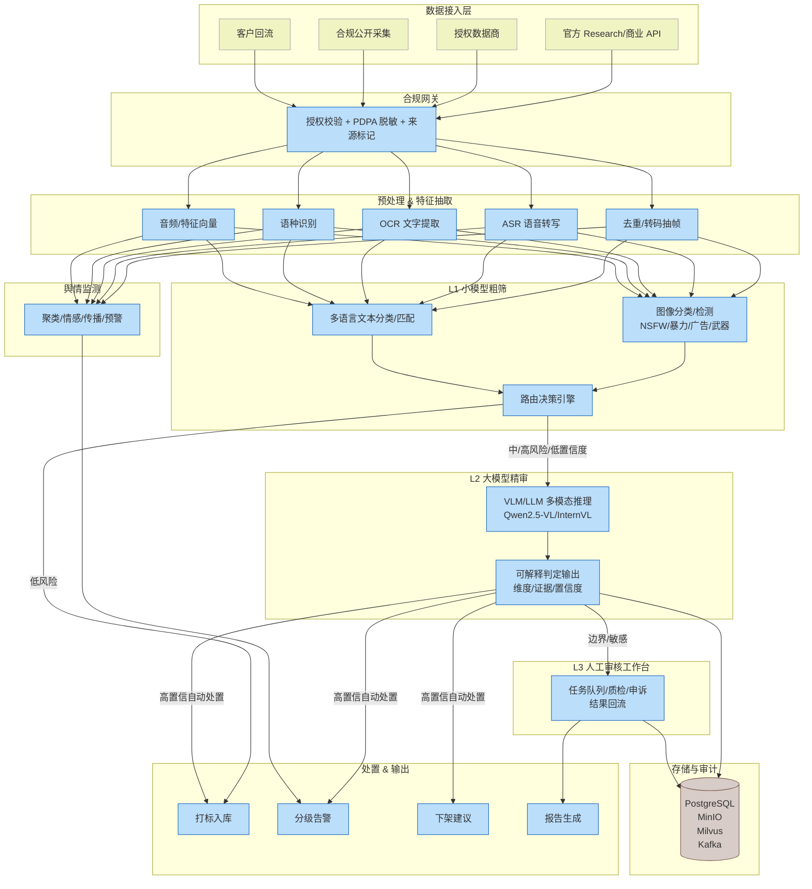

**user**: 你能看到什么能容
[Context: Notes: 系统设计/内容审核/TikTok 内容审核系统设计方案.md]
[Timestamp: 2026/06/15 14:28:42]

**ai**: 我能看到的是你当前打开的笔记 **[[TikTok 内容审核系统设计方案]]**，这是一份针对马来西亚地区、私有化部署的内容审核系统技术设计文档，主要内容包括：

- **总体架构**：三级漏斗结构（L1 小模型粗筛 → L2 大模型精审 → L3 人工审核）
- **数据接入层**：混合数据源（官方 API、数据商、公开采集、客户回流）及合规网关
- **预处理 & 特征抽取**：FFmpeg 抽帧、ASR 转写、OCR、去重等
- **L1 小模型粗筛层**：NSFW/暴力/广告/多语言文本分类等，目标拦截 85%+
- **L2 大模型精审层**：私有化 VLM/LLM 深度判定，输出结构化可解释结果
- **审核维度**：政治/王室/种族/宗教（3R）、未成年人保护、色情低俗、暴恐等，按 P0–P2 分级
- **舆情监测子系统**：事件聚类、情感分析、传播分析、预警
- **处置 & 输出层**：打标、告警、下架建议、报告生成、审计日志
- **人工审核工作台**：任务队列、质检、数据回流闭环优化
- **数据存储与审计追溯**：PostgreSQL + MinIO + Milvus + Kafka，月级存储周期
- **部署与算力规划**：Kubernetes 编排，GPU 按 L1/L2 分配，分钟级时效
- **闭环迭代机制**与**关键风险缓解**

你可以针对任何模块让我深入展开、补充细节、质疑设计，或者进行修改。需要我做什么？
[Timestamp: 2026/06/15 14:28:55]

**user**: 修改马来西亚为某地区
[Context: Notes: 系统设计/内容审核/TikTok 内容审核系统设计方案.md]
[Timestamp: 2026/06/15 14:29:02]

**ai**: 根据你打开的 **[[TikTok 内容审核系统设计方案]]**，我来画一个系统架构总览的 Mermaid 流程图，覆盖三级漏斗及核心模块：

**图例说明**：
- 数据从左上方四路汇入，经合规网关后进入预处理与特征抽取。
- 特征同时供给 **L1 粗筛**（以及舆情监测）。L1 路由决策后低风险直接入库，高风险/不确定送 **L2 精审**。
- L2 输出结构化判定，高置信的自动处置，边界/敏感转 **L3 人工**，人工结果回流优化模型。
- 所有操作均记录审计日志，存储支持按月追溯。

如果你希望调整样式、加上具体组件名称（如 Kafka、vLLM），或者拆分更细的流程图（比如单独画 L2 提示工程或人工工作台界面），我可以继续改。
[Timestamp: 2026/06/15 14:39:03]