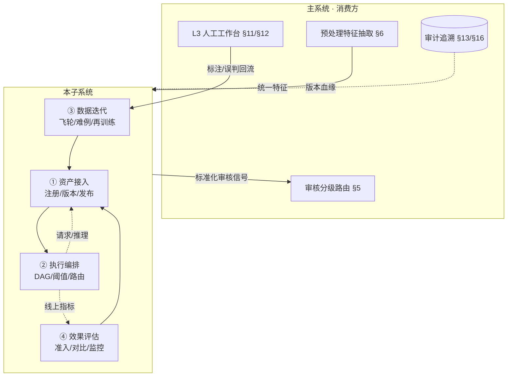
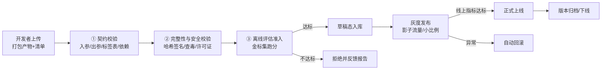
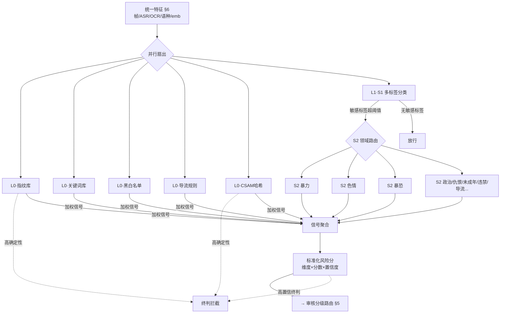
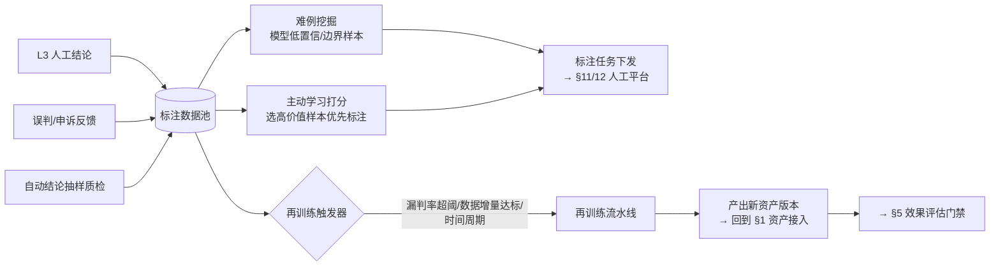

# 模型与规则编排子系统设计方案

> 从《TikTok 内容审核系统设计方案》§7（L0 规则层）、§8（L1 小模型）抽离并扩展，
> 管理范围覆盖 **L0 规则库 + L1 小模型 + L2 大模型/智能体** 的全链路 MLOps 子系统。
> 四大职责：**资产接入 · 执行编排 · 数据迭代 · 效果评估**。

---

## 0. 子系统定位与边界

本子系统是审核大脑的"工厂与调度中心"——它不直接判内容，而是负责**把模型与规则从"原始素材"变成"线上可执行的审核能力"，并让这些能力持续进化**。

| 职责 | 一句话定位 | 主要产出 |
|------|-----------|---------|
| 资产接入（导入上传） | 模型 / 规则 / 词库的注册、版本、发布 | 可被编排调用的"资产" |
| 执行编排（审核顺序） | 决定 L0/L1/L2 怎么串、谁先谁后、阈值路由 | 可视化 DAG + 运行引擎 |
| 数据迭代（数据飞轮） | 标注回流、难例挖掘、再训练触发 | 持续进化的资产新版本 |
| 效果评估 | 资产准入 / 版本对比 / 线上监控 | 评估报告 + 发布门禁 |

**与主系统的边界**：
- 本子系统**不负责**数据采集、合规网关、预处理特征抽取（§6）、用户/视频分级（§3/§4）、人工工作台（§11/§12）、处置输出（§15）、审计存储（§16）。
- 本子系统**消费**预处理层的统一特征（帧/ASR/OCR/语种/embedding），**产出**标准化审核信号给审核分级路由（§5），**接收**人工结论与误判反馈作为迭代原料（§14）。



**核心抽象**——把规则库、小模型、大模型统一抽象为**「资产（Asset）」**：
- 每个资产有 `asset_id / type / version / 入参契约 / 出参契约 / 阈值 / 状态（draft/gray/online/archived）`。
- 三类资产共用同一套**注册 → 评估 → 灰度 → 上线 → 监控 → 迭代**的生命周期，差异只在"上传产物"与"推理方式"。

---

## 1. 资产接入与生命周期管理（导入上传）

### 1.1 统一资产类型

| 资产类型 | 上传产物 | 推理方式 | 典型代表 |
|---------|---------|---------|---------|
| **L0 规则资产** | 词库（Aho-Corasick 词典）、指纹库（MD5/pHash/向量）、正则、OPA 规则 DSL、黑白名单 | 确定性匹配，无 GPU | CSAM 哈希库、违禁词库、导流正则 |
| **L1 小模型资产** | 权重文件（`.pt/.safetensors/.onnx`）、配置（输入尺寸/类别表）、标签映射表 | GPU 批处理，数十毫秒 | S1 多标签分类、S2 各领域精判模型 |
| **L2 大模型/智能体资产** | 基座模型权重 + LoRA 适配器 / 工具集配置 / Prompt 模板 / 检索库快照 | vLLM/SGLang 高并发推理 | Qwen2.5-VL 智能体、专项 LLM |

### 1.2 资产上传流程



### 1.3 资产清单（Asset Manifest）规范

每个资产必须随包提交 YAML 清单，作为后续编排、评估、追溯的唯一契约来源：

```yaml
asset_id: l1.s2.violence.convnext-v3
type: l1_small_model
version: 3.2.0
base_model: ConvNeXt-Tiny
task: frame_classification            # frame_cls / detection / text_cls / multimodal_cls
input_contract:
  frames: {shape: [224,224,3], fps: 1}
  reuse_features_from: §6.vit_emb     # 复用预处理特征，避免重复抽取
output_contract:
  schema: {dimension: str, score: float, confidence: float}
  labels: [violence]
thresholds: {safe: 0.3, dispute: 0.7, violation: 0.7}
dimensions_served: [暴力血腥]          # 对齐 §10 维度
dependencies: [§6.vit_emb]
eval:
  golden_set: gs-violence-v2
  expected: {recall: ">=0.92", precision: ">=0.90"}
owner: team-safety
changelog: "新增持械近景样本，修复冷兵器漏判"
```

> 清单里的 `thresholds / eval / dimensions_served` 直接被 §3 执行编排与 §5 效果评估复用，保证"上传一次、全链路可用"。

### 1.4 版本治理

- **语义化版本**：`MAJOR.MINOR.PATCH`——标签表变化 / 输出契约破坏 → MAJOR；权重再训练 → MINOR；热修/Prompt 调整 → PATCH。
- **血缘追溯**：每个资产版本记录训练数据集快照、基座版本、上游依赖（与 §16 审计打通，监管可查"某条内容由哪个版本的哪个模型判的"）。
- **回滚**：任意线上版本可一键回退到上一稳定版，灰度异常自动回滚。
- **选型**：MLflow（实验跟踪 + 模型注册表）+ DVC（数据/权重版本）+ MinIO（产物对象存储）。

---

## 2. 执行编排引擎（审核执行顺序）

### 2.1 编排对象：把四级漏斗变成可配置 DAG

主架构里 L0→L1→L2 是"概念顺序"，本子系统把它落地为**可视化、可热加载、可灰度**的执行图：



**编排要点**：
- **L0 五库并行执行**，各自独立打分；只有高确定性命中（CSAM、确认违规指纹）才**短路终判**，其余只输出加权信号，避免误杀。
- **L1 两级**：S1 粗筛（多标签 Top-N）→ 命中敏感标签才触发对应 S2 精判，S2 之间按命中的维度**按需调用**，不命中不跑，省算力。
- **L1 S2 复用 §6 预处理特征**（已在清单 `reuse_features_from` 声明），不重复抽取。
- **L0 与 L1 并行**，结果在 `信号聚合` 节点合并，统一输出 `维度 × 分数 × 置信度`，进入 §5 审核分级路由决定是否上送 L2。

### 2.2 编排配置（可视化 + 热加载）

| 配置项 | 说明 | 示例 |
|--------|------|------|
| DAG 拓扑 | 节点、并行/串行、扇出/扇入 | 上图 |
| 节点绑定 | 每个节点绑定一个**资产版本** | S2暴力 → `l1.s2.violence@3.2.0` |
| 阈值策略 | 触发下一级 / 终判 / 路由的阈值 | S1 敏感标签 > 0.3 触发 S2 |
| 短路规则 | 哪些命中可直接终判 | CSAM / 确认违规指纹 |
| 降级策略 | 高峰期关停哪些非必要节点 | V4 长尾内容跳过 S2 全量 |

- **可视化编排**：拖拽式画布，运维/算法可调拓扑，**保存即版本化**（编排配置本身也是资产）。
- **热加载 + 灰度**：新编排先以影子模式跑（不影响线上结论），对比指标后再切流。
- **DSL 存档**：编排导出为声明式 YAML 入库，可 diff、可回滚、可审计。

### 2.3 与 L2 的衔接

L2 智能体的"工具调用"本质上也是对本子系统资产的调用（查规则库命中详情、调专项检测模型复核），因此：
- L2 智能体在编排图中既是**被路由调用的节点**（由 §5 决定上送），又是**调用其他资产的编排者**（Agent 内部工具链）。
- 本子系统为 L2 提供**统一的资产调用 SDK**，保证 Agent 调到的规则/模型与 L0/L1 线上版本一致，避免"Agent 用旧词库、线上用新词库"的版本漂移。

---

## 3. 数据迭代优化（数据飞轮）

### 3.1 数据闭环

对齐主系统 §14 回馈线路，本子系统负责把"反馈"变成"新版本"：



### 3.2 难例挖掘与主动学习

- **难例池**：自动收集低置信度（0.3~0.7 灰区）、L1 与 L2 结论冲突、人工改判、申诉翻案的样本，作为高价值训练/评估素材。
- **主动学习**：对未标注池用不确定性 + 多样性采样，挑出"模型最该学的"样本下发标注，降低标注成本。
- **冷启动与长尾**：对新维度（如新出现的变体话术）、低资源语种（淡米尔语方言）定向加权采样。

### 3.3 再训练触发器

| 触发条件 | 目标资产 | 说明 |
|---------|---------|------|
| 某维度漏判率连续 N 天超阈 | L1 对应 S2 / L0 词库 | 挽回明显回归 |
| 新增难例增量 ≥ 阈值 | L1 S2 / S1 | 数据驱动的周期升级 |
| 申诉翻案样本积累 | L2 智能体 few-shot / LoRA | 修正边界判断 |
| 关键词变体爆发（舆情联动） | L0 关键词库 | 应急词库更新 |
| 定时（如月度） | 全量 | 周期性回归测试与刷新 |

- 触发后自动拉起训练流水线，产出新版本**自动进入 §1 评估门禁**，不达标不上线——迭代是受控的，不是放任的。

### 3.4 数据治理

- **标注一致性**：双人标注 + 一致性校验（Cohen's κ），低一致样本进仲裁。
- **数据集版本化**（DVC）：每个训练数据集有快照 ID，与模型版本双向可追溯（满足监管"模型基于哪些数据"的追溯要求）。
- **PII 脱敏**：标注池数据沿用合规网关脱敏结果，标注员看不到原始 PII。

---

## 4. 效果评估

评估是资产能否上线的**门禁**，也是线上持续运行的**健康度仪表盘**。分三层。

### 4.1 三层评估

| 层级 | 时机 | 目的 | 金标/数据 |
|------|------|------|----------|
| **① 资产准入评估**（离线） | 新版本上传后 | 是否允许进入灰度 | 维度金标集（黄金集） |
| **② 版本对比评估**（灰度） | 灰度发布期间 | 新版 vs 现网版，能否切流 | 影子流量 / 小比例真实流量 |
| **③ 线上效果监控**（在线） | 资产上线后持续 | 发现回归、触发迭代 | 抽样质检 + 人工结论回流 |

### 4.2 核心指标（按维度 × 资产）

| 指标 | 定义 | 门禁方向 |
|------|------|---------|
| 召回率（漏判率倒数） | 人工确判违规中被识别的比例 | P0 维度 ≥ 0.95，其余按维度定 |
| 精确率（误判率倒数） | 被判违规中确为违规的比例 | 控误杀，影响用户体验 |
| 准确率 | 抽检金标一致率 | 投毒质检实时监控 |
| 置信度-正确性校准 | 高置信是否真高准确 | 校准曲线 ECE |
| 单条延迟 / 吞吐 | 毫秒级成本与 SLA | L1 ≤ 数十 ms，L2 按 SLA |
| GPU 成本 / 千条 | 算力经济性 | L2 成本是主控点 |
| Cohen's κ | 标注/审核一致性 | 数据质量护栏 |

> **P0 维度（3R / 未成年 / 色情 / 暴恐）召回是硬门禁**：召回不达标，**禁止灰度**，与 §10 优先级、§11 强制人工策略一致。

### 4.3 金标集管理

- 每个审核维度维护一份**黄金集（Golden Set）**，含确认答案的标注样本，覆盖正负、边界、多语种、对抗变体。
- 黄金集本身也版本化，定期由高级审核员/法务复核刷新，并**反向用作投毒质检样本**注入 §12.2。
- 黄金集是不同资产版本之间**可比的标尺**——版本 A 与版本 B 必须在同一黄金集上跑分。

### 4.4 评估报告与门禁

- 每次评估产出**结构化报告**：维度 × 指标矩阵、与上一版本的 diff、回归用例、误判样例可视化、通过/未通过结论。
- 门禁策略可配置：`召回 ≥ 阈值 AND 精确率不下降 > X% AND 无 P0 回归` → 自动放行进入灰度；否则人工评审。
- 评估报告与资产版本一同归档，构成监管可追溯的一部分（与 §13 审计链路打通：能解释"为什么这个版本被允许上线"）。

---

## 5. 子系统部署与运维

| 组件 | 选型 | 说明 |
|------|------|------|
| 模型注册表 | MLflow Model Registry | 资产元数据、版本、状态机 |
| 数据/权重版本 | DVC + MinIO | 训练数据快照、权重对象存储 |
| 编排引擎 | 自研 DAG + Temporal | 可视化编排 + 可靠执行 + 重试 |
| 评估服务 | 自研 + MLflow Metrics | 离线批量评估 + 在线指标聚合 |
| 标注数据池 | PostgreSQL + MinIO | 结构化标注 + 原始证据 |
| 在线指标 | ClickHouse + Grafana | 维度/版本/时效多维下钻 |

- **编排引擎与推理集群分离**：编排是 CPU 控制面，推理是 GPU 数据面，独立扩缩容（对齐 §17）。
- **降级**：高峰期编排引擎按降级策略（§2.2）关停非必要 L1 S2 节点、L2 降级为小模型 + 提高人工抽检。
- **灰度切流**：按内容维度 / 用户等级 / 视频等级分片灰度，可定向验证（如先在淡米尔语内容上灰度新仇恨模型）。

---

## 6. 关键风险与缓解

| 风险 | 缓解 |
|------|------|
| 版本漂移（L2 Agent 调到旧资产） | 统一资产调用 SDK，资产版本由编排引擎统一注入，禁止硬编码 |
| 灰度事故（新模型线上误杀） | 影子模式先行 + 自动回滚 + P0 维度召回硬门禁 |
| 标注质量污染迭代 | 双人标注 + κ 校验 + 投毒质检 + 黄金集复核 |
| 评估过拟合黄金集 | 黄金集定期刷新 + 线上抽样监控作为第二道标尺 |
| 多语种评估盲区 | 每个语种独立金标子集，低资源语种定向补样 |
| 训练数据合规（PII/授权） | 标注池沿用合规网关脱敏，数据集版本可追溯授权来源 |
| 大模型迭代成本失控 | L2 优先 few-shot/Prompt 迭代，LoRA 微调次之，全参最后；评估门禁卡 ROI |

---

## 附：与主系统文档的映射

| 本子系统章节 | 主系统对应 |
|-------------|-----------|
| §1 资产接入（L0/L1/L2） | 主 §7 L0 规则层、§8 L1 小模型、§9.1 L2 选型 |
| §2 执行编排 | 主 §1 总体架构（L0→L1→L2 流水线）、§5 审核分级路由（衔接点） |
| §3 数据迭代 | 主 §14 回馈线路（深化） |
| §4 效果评估 | 主 §12.2 投毒质检、§13 审计追溯（数据来源） |
| §5 部署运维 | 主 §17 部署与算力（子集） |
```
