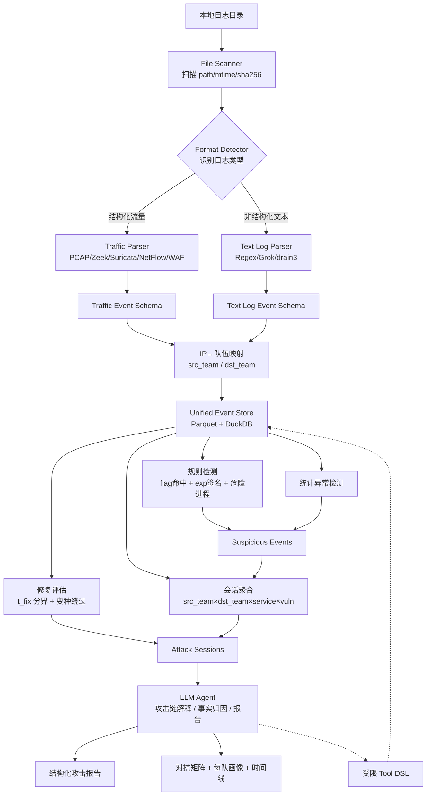
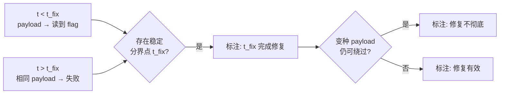
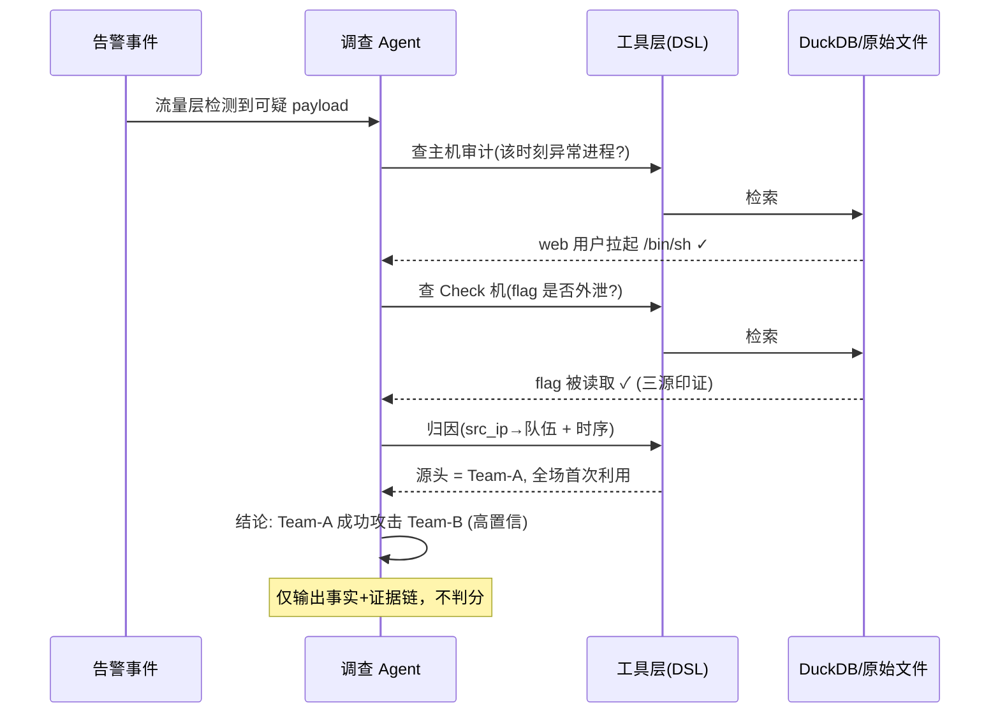
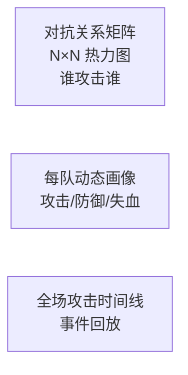
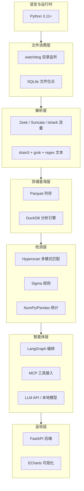

# 基于智能体的 AWDP 攻击日志分析系统设计方案 v1.3

> **场景定位**：AWDP（Attack With Defense Practice）竞赛主办方的**上帝视角**分析系统。
>
> **核心职责**：仅做**威胁检测 + 溯源取证**（攻击识别、攻击链还原、修复评估、事实归因、证据留存、态势呈现），**不做判分/裁决**。判分由下游裁判/计分系统依据本系统输出的事实结果自行完成。
>
> **数据来源**：日志已由外部系统采集并落盘到本地目录，本系统不负责采集。数据分两类：
>
> 1. **结构化流量数据**：PCAP、Zeek、Suricata `eve.json`、NetFlow/IPFIX、WAF/HTTP 流量日志等。
> 2. **非结构化文本日志**：syslog、auth.log、应用日志、中间件日志、靶机审计日志等。
>
> **关键前提**：本系统由主办方掌控全场数据，是数据所有者，**不做脱敏**。真实 IP、真实队伍、原始 payload 全程明文流转，以保证归因精度。安全边界由系统访问权限控制，而非数据脱敏。

---

## 二、核心设计原则

### 2.1 本地做确定性处理，LLM 做解释性推理

| 模块        | 主要职责                              | 是否允许 LLM 参与 |
| ----------- | ------------------------------------- | ----------------- |
| 文件扫描    | 发现文件、记录指纹、判断增量          | 否                |
| 日志解析    | 结构化解析、正则解析、模板聚类        | 默认否            |
| 字段归一化  | 映射到统一字段模型                    | 否                |
| IP→队伍映射 | 把 IP 翻译成 src_team/dst_team        | 否                |
| 规则检测    | flag命中、exp签名、危险进程、统计异常 | 否                |
| 修复评估    | t_fix 分界、变种绕过验证              | 否（可选辅助）    |
| 会话聚合    | 按 源队/目标队/服务/漏洞/时间窗聚合   | 否                |
| 攻击链解释  | 结合证据解释攻击行为                  | 是                |
| 事实归因    | 还原是哪支队发起                      | 是                |
| 报告生成    | 生成结构化分析报告                    | 是                |

### 2.2 LLM 只看收敛后的信号

原始日志（GB 级、万级 EPS）经本地解析、过滤、聚合后，LLM 只处理**聚合后的攻击会话 + 少量证据片段**，需要细节时通过受限工具按 `raw_ptr` 回查原始数据，绝不全量投喂。


### 2.3 结构化流量为主，非结构化日志为辅

```text
结构化流量 → 行为检测 → 会话聚合 → 攻击链/修复判断
非结构化日志 → 上下文补强 → 证据验证
LLM Agent → 解释、事实归因、报告生成
```

### 2.4 只检测溯源，不判分

```text
本系统终点 = 事实结果（发生了什么 / 是谁干的 / 证据在哪）
判分 = 下游裁判/计分系统的事，本系统不参与
```

---

## 三、整体架构 v1.3



---

## 四、目录结构设计

```text
awdp-log-analyzer/
├── logs/
│   └── raw/                         # 外部方式放入的原始日志
│       ├── traffic/                 # 结构化流量
│       │   ├── pcap/
│       │   ├── zeek/
│       │   ├── suricata/
│       │   ├── netflow/
│       │   └── waf/
│       └── text_logs/               # 非结构化文本日志
│           ├── host_audit/          # 靶机审计 auditd/sysmon
│           ├── ssh/
│           ├── application/
│           └── checker/             # Check 机判定结果
│
├── config/
│   ├── log_types.yaml               # 日志类型定义
│   ├── parser_rules.yaml            # regex/grok/parser 规则
│   ├── schema_mapping.yaml          # 字段映射规则
│   ├── team_map.yaml                # IP/网段 → 队伍 映射表（核心）
│   ├── flag_format.yaml             # flag 正则格式定义
│   ├── exp_signatures.yaml          # 攻击 payload / webshell 特征
│   ├── detection_rules.yaml         # 自定义检测规则
│   └── llm.yaml                     # LLM 配置
│
├── registry/
│   └── file_registry.db             # 文件指纹、解析状态、位点
│
├── data/
│   ├── parsed/                      # Parquet 分区数据
│   ├── failed_parse/                # 解析失败样本
│   ├── suspicious/                  # 可疑事件
│   ├── sessions/                    # 攻击会话
│   ├── repairs/                     # 修复评估结果
│   └── reports/                     # 报告输出
│
├── parsers/
│   ├── traffic/
│   │   ├── pcap_parser.py
│   │   ├── zeek_parser.py
│   │   ├── suricata_parser.py
│   │   ├── netflow_parser.py
│   │   └── waf_parser.py
│   ├── text/
│   │   ├── regex_parser.py
│   │   ├── grok_parser.py
│   │   ├── drain_parser.py
│   │   └── checker_parser.py
│   └── parser_registry.py
│
├── pipeline/
│   ├── scan.py                      # 文件扫描
│   ├── classify.py                  # 格式识别
│   ├── parse.py                     # 解析分流
│   ├── normalize.py                 # 字段归一化
│   ├── team_mapping.py              # IP→队伍映射
│   ├── detect.py                    # 规则/统计检测（含flag命中）
│   ├── repair_eval.py               # 修复评估
│   ├── cluster.py                   # 会话聚合
│   └── analyze.py                   # LLM 分析
│
├── tools/
│   ├── log_query.py                 # 安全查询 DSL 编译器
│   ├── session_query.py             # 会话查询
│   ├── team_profile.py              # 队伍画像
│   ├── evidence_lookup.py           # 证据回查（按 raw_ptr）
│   └── correlation.py               # 跨日志关联
│
├── agents/
│   ├── investigator.py              # 攻击行为解释
│   ├── attributor.py                # 事实归因
│   └── reporter.py                  # 报告生成
│
├── core/
│   ├── schema.py
│   ├── cache.py
│   ├── budget.py
│   ├── audit.py
│   └── security.py                  # 访问权限控制（非脱敏）
│
├── tests/
└── main.py
```

---

## 五、Layer 1：本地文件识别与归一化

### 5.1 文件扫描与位点

```sql
CREATE TABLE IF NOT EXISTS file_registry (
    id INTEGER PRIMARY KEY AUTOINCREMENT,
    path TEXT UNIQUE,
    inode INTEGER,                   -- 防 rename/切割
    size INTEGER,
    mtime INTEGER,
    sha256 TEXT,
    offset INTEGER,                  -- 断点续读位点
    log_category TEXT,               -- traffic / text_logs
    log_type TEXT,
    format TEXT,
    parse_status TEXT,
    parser_name TEXT,
    parsed_output_path TEXT,
    first_seen_at TEXT,
    last_seen_at TEXT
);
```

### 5.2 完成信号约定（必须与上游敲定）

上游正在写的文件不可半路读取。三选一约定：

```text
1. 原子 rename：写时 xxx.log.tmp，写完 rename 成 xxx.log（最推荐）
2. 标记文件：写完生成同名 .done / .ok
3. 滚动约定：出现下一个文件即代表上一个已写完
```

### 5.3 日志类型识别

```python
def detect_format(file_path: str) -> dict:
    if exists_meta(file_path):
        return load_meta(file_path)

    suffix = get_suffix(file_path)
    sample = read_first_lines(file_path, n=100)

    if suffix in [".pcap", ".pcapng"]:
        return {"mode": "traffic", "format": "pcap", "parser": "pcap_parser"}
    if looks_like_zeek(sample):
        return {"mode": "traffic", "format": "zeek", "parser": "zeek_parser"}
    if looks_like_suricata_eve(sample):
        return {"mode": "traffic", "format": "suricata_eve", "parser": "suricata_parser"}
    if looks_like_netflow(sample):
        return {"mode": "traffic", "format": "netflow", "parser": "netflow_parser"}
    if looks_like_checker(sample):
        return {"mode": "text", "format": "checker", "parser": "checker_parser"}
    if looks_like_syslog(sample):
        return {"mode": "text", "format": "syslog", "parser": "regex_parser"}
    return {"mode": "text", "format": "unknown_text", "parser": "drain_parser"}
```

---

## 六、结构化流量处理链路

### 6.1 PCAP 预处理

PCAP 不直接进 LLM，也不作主分析数据，先转协议级结构化日志：

```text
PCAP → Zeek / Suricata / tshark → conn/http/dns/ssl/eve.json
     → Traffic Event Schema → Parquet + DuckDB
```

| 工具     | 适用场景                                     |
| -------- | -------------------------------------------- |
| Zeek     | 协议级行为分析（连接/HTTP/DNS/TLS/文件传输） |
| Suricata | IDS 告警、规则检测、eve.json                 |
| tshark   | 临时字段抽取、样本验证                       |

### 6.2 Zeek / Suricata 字段映射

```yaml
zeek_conn:
  ts: timestamp
  id.orig_h: src_ip
  id.orig_p: src_port
  id.resp_h: dst_ip
  id.resp_p: dst_port
  proto: protocol
  service: app_protocol
  orig_bytes: bytes_out
  resp_bytes: bytes_in
  conn_state: conn_state

suricata_eve:
  timestamp: timestamp
  src_ip: src_ip
  dest_ip: dst_ip
  dest_port: dst_port
  event_type: event_type
  alert.signature: rule_name
  alert.signature_id: rule_id
  http.url: url
  http.http_method: http_method
  http.http_user_agent: user_agent
```

---

## 七、非结构化文本日志处理链路

非结构化日志作上下文补强与证据验证。处理优先级：

```text
1. 已知格式 regex / grok 解析
2. drain3 模板聚类
3. 少量样本辅助生成候选 parser
4. 无法解析保留 raw_message，进 failed_parse 样本池
```

解析状态：

```text
parsed              完整解析
partially_parsed    部分字段成功
template_only       仅模板聚类
failed              解析失败
```

> 重点：靶机审计日志（auditd/sysmon）是判定「getshell」的关键源，进程拉起、敏感文件访问需精确解析，**不走 drain3 模板聚类**，避免关键进程参数被聚没。

---

## 八、统一事件模型（AWDP 特化）

### 8.1 Base Event Schema

```yaml
base_event:
  event_id: string
  timestamp: datetime            # 已 NTP 对齐
  source_file: string
  raw_ptr: string                # 文件路径 + 偏移，供证据回查
  category: string
  log_type: string
  parser_name: string
  parse_status: string
  raw_message: string
  # === AWDP 特化字段 ===
  src_team: string               # 由 src_ip 映射，攻击方
  dst_team: string               # 由 dst_ip 映射，防守方
  service: string                # 被攻击服务/靶机
  vuln: string                   # 漏洞点标识
  attack_stage: string           # recon/exploit/getshell/read_flag
```

### 8.2 Traffic Event Schema

```yaml
traffic_event:
  src_ip: string
  src_port: int
  dst_ip: string
  dst_port: int
  protocol: string
  app_protocol: string
  bytes_in: int
  bytes_out: int
  http_method: string
  url: string
  host: string
  user_agent: string
  status_code: int
  request_body: string           # 用于 exp 特征匹配
  response_body: string          # 用于 flag 命中检测
  flag_hit: bool                 # 响应是否含 flag
  rule_id: string
  rule_name: string
```

### 8.3 Text Log Event Schema

```yaml
text_log_event:
  host: string
  username: string
  process_name: string
  process_cmdline: string        # 用于 getshell 判定
  service: string
  event_action: string
  event_outcome: string
  message: string
```

---

## 九、IP→队伍映射（一等公民）

归因的基础，错则全错。

```yaml
# team_map.yaml
teams:
  - team: "Team-A"
    cidr: ["10.0.1.0/24"]
  - team: "Team-B"
    cidr: ["10.0.2.0/24"]
  - team: "Checker"
    cidr: ["10.0.99.0/24"]       # Check 机网段，单独标识
```

```python
def map_team(ip: str, team_map) -> str:
    for entry in team_map:
        if ip_in_cidr(ip, entry["cidr"]):
            return entry["team"]
    return "UNKNOWN"
```

> 每条事件归一化后立即映射 `src_team / dst_team`。Check 机流量单独标识，从攻击检测中排除。

---

## 十、检测与降维设计

### 10.1 flag 命中检测（强信号，需多源印证）

```yaml
# flag_format.yaml
flag_regex: "flag\\{[0-9a-zA-Z_\\-]{8,64}\\}"
```

响应体命中 flag 正则是攻击成功的强证据，但需结合 Check 机判定多源印证，避免旧 flag/示例 flag 误判。

### 10.2 攻击 payload / webshell 签名

| 信号类型         | 判定方式                                      | 攻击阶段  |
| ---------------- | --------------------------------------------- | --------- |
| 注入/RCE payload | 请求体匹配 exp 特征（SQLi/命令注入/反序列化） | exploit   |
| webshell 流量    | 蚁剑/冰蝎/哥斯拉指纹                          | getshell  |
| 危险进程         | 主机日志命中 `/bin/sh`、`nc`、外联            | getshell  |
| 敏感文件访问     | 命中 `/flag`、web 目录写入                    | read_flag |

实现用预编译正则 + 多模式匹配（Hyperscan/Aho-Corasick），规则热加载。

### 10.3 端口扫描 / 横向检测（DuckDB）

```sql
SELECT src_team, dst_team,
       COUNT(DISTINCT dst_port) AS unique_ports,
       COUNT(*) AS conn_count
FROM traffic_events
WHERE timestamp BETWEEN ? AND ?
GROUP BY src_team, dst_team
HAVING unique_ports > 50 OR conn_count > 500;
```

### 10.4 可疑事件池

```json
{
  "event_id": "evt_001",
  "timestamp": "2026-06-08T01:13:11Z",
  "src_team": "Team-A",
  "dst_team": "Team-B",
  "service": "web-shop",
  "vuln": "deserialization",
  "attack_stage": "exploit",
  "flag_hit": false,
  "rule_id": "WEB_DESER_001",
  "raw_ptr": "traffic/suricata/part-001.parquet:row_12345"
}
```

---

## 十一、修复评估（AWDP 灵魂能力）

判定每队对每个漏洞的修复状态、时间、是否彻底。仅做**事实标注**，不判分。

### 11.1 修复时间分界点 t_fix

```text
对每个 (漏洞点 V, 防守队 T)：
  在时间线上找分界点 t_fix，使：
    t < t_fix：针对 V 的 payload → 读到 flag（成功）
    t > t_fix：相同 payload → 失败/被拦截/报错
  若存在稳定 t_fix → 标注 T 在 t_fix 完成 V 的修复
```



### 11.2 修复评估输出

```json
{
  "team": "Team-B",
  "vuln": "deserialization",
  "service": "web-shop",
  "repair_status": "bypassed",
  "t_fix": "2026-06-08T02:15:00Z",
  "bypass_payload_ptr": "traffic/.../part-099.parquet:row_777",
  "exposure_window_sec": 4500
}
```

---

## 十二、会话聚合设计

### 12.1 攻击会话键（AWDP 特化）

```text
src_team + dst_team + service + vuln + time_window
```

> 开赛初期 `vuln` 可能尚未识别（非预期解），允许 `vuln=unknown` 兜底聚合，后续回填。

### 12.2 跨数据源关联（多源印证，降误判）

```text
流量层：检测到 payload          ┐
主机层：web 用户拉起 /bin/sh     ├→ 三源同窗命中 = 高置信真实攻陷
Check层：flag 被标记外泄          ┘   仅命中流量层 = 低置信（可能仅扫描尝试）
```

### 12.3 攻击会话摘要

```json
{
  "session_id": "sess_20260608_001",
  "src_team": "Team-A",
  "dst_team": "Team-B",
  "service": "web-shop",
  "vuln": "deserialization",
  "time_range": ["2026-06-08T01:12:00Z", "2026-06-08T01:28:00Z"],
  "kill_chain": ["recon", "exploit", "getshell", "read_flag"],
  "success": true,
  "first_exploit": true,
  "evidence_sources": ["traffic", "host_audit", "checker"],
  "confidence": 0.95,
  "sample_evidence": [
    {
      "timestamp": "2026-06-08T01:13:11Z",
      "source": "suricata_eve",
      "message": "Possible Deserialization Attempt",
      "raw_ptr": "traffic/suricata/part-001.parquet:row_12345"
    }
  ],
  "related_host_logs": [
    {
      "source": "auditd",
      "message": "web user spawned /bin/sh",
      "raw_ptr": "text_logs/host_audit/part-003.parquet:row_8821"
    }
  ]
}
```

---

## 十三、LLM Agent 设计

### 13.1 Agent 职责（全为事实判断，无裁决）

LLM 输入聚合后的攻击会话，不接触原始日志。

| Agent        | 职责                                    |
| ------------ | --------------------------------------- |
| Investigator | 解释攻击会话、判定是否真实成功          |
| Attributor   | 事实归因（是哪支队发起），识别跳板/重放 |
| Reporter     | 生成攻击链叙事 + 证据链报告             |

LLM **不负责**：采集、全量解析、直接读 GB 日志、直接执行 SQL、判分。

### 13.2 ReAct 递归调查范式



### 13.3 Agent 红线

| 红线           | 措施                                                         |
| -------------- | ------------------------------------------------------------ |
| 防 Prompt 注入 | payload/HTTP 字段进入 Agent 前强制转义隔离（payload 里可能藏针对 LLM 的注入文本） |
| 防幻觉         | IP/时间/flag/队伍等事实字段只取自结构化数据，禁止模型自由发挥 |
| 可回查         | 每个结论必须凭 raw_ptr 回溯原始证据                          |
| 可审计         | 每步「思考-行动-观察」全程留痕                               |
| max_iterations | 默认 ≤ 3，复杂多跳攻击链可按 incident 复杂度动态放宽；证据不足时输出低置信报告并说明缺失证据 |

---

## 十四、安全 Tool Calling 设计

### 14.1 禁止 LLM 直接写 SQL

不允许 `WHERE {query}` 拼接，防止注入、全表扫描、查询成本失控、Prompt Injection 诱导危险查询。

### 14.2 受限查询 DSL

LLM 只能提交 DSL，由本地工具编译为参数化 DuckDB 查询：

```json
{
  "dataset": "traffic_events",
  "fields": ["timestamp", "src_team", "dst_team", "dst_port", "vuln", "flag_hit"],
  "filters": [
    {"field": "src_team", "op": "eq", "value": "Team-A"},
    {"field": "vuln", "op": "eq", "value": "deserialization"}
  ],
  "time_range": ["2026-06-08T00:00:00Z", "2026-06-08T02:00:00Z"],
  "limit": 50
}
```

本地工具负责：字段白名单校验、操作符白名单、limit 上限、时间范围上限、编译为参数化查询、审计记录。

---

## 十五、成本控制

### 15.1 置信度分流（核心降本）

```text
聚合攻击会话
  ├─ 高置信(多源印证+阶段完整) → 规则直接出事实，不调 LLM
  └─ 模糊/归因可疑              → 升级 LLM 递归调查
```

### 15.2 预算硬控制

```python
class BudgetController:
    def __init__(self, max_usd: float):
        self.max_usd = max_usd
        self.spent_usd = 0.0

    def check(self, in_tokens, out_tokens, price):
        cost = in_tokens * price.input_per_token + out_tokens * price.output_per_token
        if self.spent_usd + cost > self.max_usd:
            raise RuntimeError("LLM budget exceeded")
        self.spent_usd += cost
```

---

## 十六、呈现层与交付物

### 16.1 每队动态画像（事实维度，无评分）

| 维度       | 含义                                               | 数据来源         |
| ---------- | -------------------------------------------------- | ---------------- |
| 攻击活动   | 打了哪些队、用什么 payload、是否成功、是否首次利用 | 流量 + flag 命中 |
| 防御活动   | 修复了哪些漏洞、t_fix、是否被绕过                  | 修复评估         |
| 被攻击情况 | 被哪些队打穿、暴露时长                             | 攻击链归因       |
| 服务状态   | 服务存活情况                                       | Check 机         |

### 16.2 三大可视化



### 16.3 交付给下游的事件清单

```json
{
  "incident_id": "INC-20260608-001",
  "src_team": "Team-A",
  "dst_team": "Team-B",
  "service": "web-shop",
  "vuln": "deserialization",
  "kill_chain": ["recon", "exploit", "getshell", "read_flag"],
  "success": true,
  "first_exploit": true,
  "repair_status": "bypassed",
  "evidence_sources": ["traffic", "host_audit", "checker"],
  "confidence": 0.95,
  "ts_start": "2026-06-08T01:12:00Z",
  "ts_end": "2026-06-08T01:28:00Z",
  "raw_ptrs": [
    "traffic/suricata/part-001.parquet:row_12345",
    "text_logs/host_audit/part-003.parquet:row_8821"
  ],
  "metadata": {
    "analyzed_at": "2026-06-08T10:00:00+08:00",
    "scored": false
  }
}
```

> 下游裁判/计分系统据此自行判分，本系统不参与。

---

## 十七、主要风险与控制措施

| 风险              | 说明                            | 控制措施                             |
| ----------------- | ------------------------------- | ------------------------------------ |
| IP→队伍映射错误   | 归因全错的根源                  | 维护准确 team_map，UNKNOWN 单独告警  |
| 时钟不一致        | 攻击链时间线错乱                | 全源 NTP 对齐 + 按已知事件做偏移校准 |
| flag 正则误报     | 攻击成功判定核心信号            | 精确正则，多源印证（Check 机）       |
| 读到残缺记录      | 上游文件写入中被读              | 完成信号约定（rename/.done）         |
| LLM 幻觉          | 过度推断攻击链                  | 强制 raw_ptr，无证据降置信度         |
| Prompt 注入       | payload 中藏针对 LLM 的注入文本 | 进 Agent 前强制转义隔离              |
| SQL 注入/工具滥用 | LLM 生成危险查询                | 受限 DSL、字段白名单、limit          |
| 成本失控          | 多轮工具调用                    | 置信度分流、BudgetController、缓存   |
| 误报较高          | 流量异常不等于攻击              | 跨数据源印证 + 证据链验证            |

---

## 十八、MVP 开发路线

**确定性流水线优先，LLM 分析其次。**

### Week 1：本地解析、归一化、队伍映射

| Day  | 任务                                                         |
| ---- | ------------------------------------------------------------ |
| 1    | 文件扫描、file_registry、sha256/inode/offset 增量机制、完成信号识别 |
| 2    | 结构化流量识别：PCAP/Zeek/Suricata/NetFlow 目录识别          |
| 3    | Zeek/Suricata 解析 + Traffic Event Schema 映射               |
| 4    | 非结构化日志 regex 解析 + 靶机审计日志解析                   |
| 5    | **IP→队伍映射（team_map）** + Parquet 落盘 + DuckDB          |
| 6    | failed_parse 样本池 + drain3 模板聚类                        |
| 7    | **flag 命中检测 + exp 签名库**                               |

### Week 2：检测、修复评估、聚合、报告

| Day  | 任务                                                        |
| ---- | ----------------------------------------------------------- |
| 8    | 流量检测规则：扫描、横向、Web 攻击、危险进程                |
| 9    | **修复评估：t_fix 分界 + 变种绕过**                         |
| 10   | **攻击会话聚合：src_team×dst_team×service×vuln + 多源印证** |
| 11   | Investigator + Attributor Agent 分析 session                |
| 12   | Reporter Agent + 对抗矩阵/每队画像/时间线                   |
| 13   | 证据引用、受限 DSL、预算控制                                |
| 14   | 整体联调、测试调优                                          |

---

## 十九、最终结论

本方案定位明确为：

```text
AWDP 竞赛主办方的 N 队对抗威胁检测与溯源取证系统。
仅做检测溯源，不做判分；主办方掌控全场数据，不做脱敏。
```

主链路：

```text
本地目录日志
 → 文件识别（断点续读 + 完成信号）
 → 结构化流量 / 非结构化日志分流解析
 → 统一事件模型 + IP→队伍映射
 → Parquet + DuckDB
 → flag命中/exp检测 + 修复评估 + 会话聚合（多源印证）
 → LLM Agent 解释/事实归因/报告
 → 对抗矩阵 + 每队画像 + 时间线 + 事件清单（供下游判分）
```

实施优先级：

```text
第一优先级：文件识别、解析、归一化、IP→队伍映射、Parquet/DuckDB
第二优先级：flag命中、exp检测、修复评估、会话聚合（多源印证）
第三优先级：受限 Tool DSL、LLM 报告
第四优先级：对抗矩阵、每队画像、多 Agent 编排
```

先构建稳定的本地确定性分析基座，再逐步引入 LLM Agent 做解释、归因与报告生成。

## 附录：技术栈清单

> 选型原则：**确定性处理用成熟开源组件，单机/小集群优先，LLM 只做解释层**。AWDP 一场比赛通常是有限时长、有限队伍的离线/准实时分析，**不盲目上重型分布式集群**。

---

### 一、技术栈总览



---

### 二、分层选型明细

#### 1. 语言与运行时

| 组件     | 选型                      | 说明                          |
| -------- | ------------------------- | ----------------------------- |
| 主语言   | **Python 3.11+**          | 生态完整，解析/数据/AI 库齐全 |
| 包管理   | **uv / Poetry**           | 依赖锁定，环境可复现          |
| 性能热点 | **Rust / C 扩展（可选）** | 仅在解析/匹配成为瓶颈时下沉   |

#### 2. 文件消费层

| 组件     | 选型                         | 说明                                    |
| -------- | ---------------------------- | --------------------------------------- |
| 目录监听 | **watchdog**（inotify 封装） | 增量发现新文件；大目录可退化为轮询      |
| 位点存储 | **SQLite**                   | file_registry，记录 inode/offset/sha256 |
| 流式读取 | **Python 迭代器 / mmap**     | 大文件逐块读，内存恒定                  |
| 完成信号 | **rename / .done 标记**      | 与上游约定，防读残缺                    |

#### 3. 解析层

| 数据类型      | 组件                           | 说明                     |
| ------------- | ------------------------------ | ------------------------ |
| PCAP → 结构化 | **Zeek**（首选）/ **Suricata** | 协议级行为日志、IDS 告警 |
| 临时抽包      | **tshark / pyshark**           | 样本验证、字段调试       |
| 流量日志读取  | **Suricata eve.json (JSONL)**  | 直接按 event_type 分流   |
| 文本模板聚类  | **drain3**                     | 未知格式日志自动聚类     |
| 文本规则解析  | **grok（pygrok）/ 原生 regex** | syslog/auth/应用日志     |
| 高性能正则    | **google-re2 / regex**         | 防 ReDoS，稳定线性匹配   |

#### 4. 存储与查询层

| 组件        | 选型                 | 说明                                  |
| ----------- | -------------------- | ------------------------------------- |
| 列存格式    | **Apache Parquet**   | 高压缩、列裁剪、按日期/类型分区       |
| 分析引擎    | **DuckDB**           | 嵌入式 OLAP，单机直查 Parquet，零运维 |
| 内存计算    | **Polars / PyArrow** | 大表处理比 Pandas 快、省内存          |
| 元数据/位点 | **SQLite**           | 文件注册表、解析状态                  |

> **DuckDB vs ClickHouse**：单机离线分析、队伍规模有限 → **DuckDB 足够且零运维**。仅当需要持续准实时高 EPS 写入、多人并发查询大盘时，才升级 **ClickHouse**。

#### 5. 检测层

| 能力           | 组件                                | 说明                               |
| -------------- | ----------------------------------- | ---------------------------------- |
| 多模式签名匹配 | **Hyperscan**（首选）/ Aho-Corasick | flag/exp/webshell 特征，单条微秒级 |
| 通用检测规则   | **Sigma + pySigma**                 | 规则即配置，可热加载               |
| 统计/异常检测  | **NumPy / Pandas / SciPy**          | 频次、熵、周期性 beacon            |
| 图关联（可选） | **NetworkX**                        | 横向移动、对抗关系图               |

#### 6. 智能体层

| 能力             | 选型                                    | 说明                              |
| ---------------- | --------------------------------------- | --------------------------------- |
| Agent 编排       | **LangGraph**（首选）/ AutoGen / CrewAI | 多 Agent + ReAct 循环 + 状态机    |
| 工具协议         | **MCP（Model Context Protocol）**       | 标准化封装 DuckDB 查询、证据回查  |
| 受限查询         | **自研 DSL 编译器**                     | LLM 不写 SQL，DSL → 参数化 DuckDB |
| 大模型（云）     | **Claude / GPT 系列 API**               | 复杂归因、报告生成                |
| 大模型（本地）   | **Qwen / Llama + vLLM / Ollama**        | 数据不出网、降本，私有部署        |
| 高频分类         | **小模型 / 规则**                       | 简单判定不上大模型                |
| 向量记忆（可选） | **Chroma / Qdrant**                     | 历史攻击模式检索                  |
| 预算控制         | **自研 BudgetController + tiktoken**    | token 计量与熔断                  |

#### 7. 呈现层

| 能力         | 选型                                    | 说明                             |
| ------------ | --------------------------------------- | -------------------------------- |
| 后端 API     | **FastAPI**                             | 查询接口、报告导出               |
| 可视化       | **Apache ECharts**                      | 对抗矩阵热力图、时间线、画像雷达 |
| 大盘（可选） | **Grafana**                             | 实时态势监控面板                 |
| 报告导出     | **Jinja2 + Markdown / WeasyPrint(PDF)** | 结构化报告生成                   |

#### 8. 工程与运维

| 能力     | 选型                        | 说明                          |
| -------- | --------------------------- | ----------------------------- |
| 任务调度 | **APScheduler / Prefect**   | 批处理流水线编排              |
| 配置管理 | **YAML + Pydantic**         | schema/规则/team_map 配置校验 |
| 容器化   | **Docker / Docker Compose** | 一键部署                      |
| 日志监控 | **structlog / loguru**      | 系统自身运行日志              |
| 测试     | **pytest**                  | 解析器、检测规则单测          |

---

### 三、准实时增强（可选）

若需从批处理升级为准实时态势，补充流式组件：

| 能力     | 选型                 | 说明                        |
| -------- | -------------------- | --------------------------- |
| 消息缓冲 | **Redpanda / Kafka** | 文件事件削峰                |
| 流式计算 | **Faust / Bytewax**  | Python 原生流处理，窗口关联 |
| 实时存储 | **ClickHouse**       | 替代 DuckDB 承接高频写入    |

> 建议**首版用批处理（DuckDB）跑通**，验证检测准确率后再决定是否上流式，避免过早引入复杂度。

---

### 四、推荐最小可行组合（MVP）

```text
Python 3.11
 + watchdog + SQLite            (文件消费)
 + Zeek/Suricata + drain3       (解析)
 + Parquet + DuckDB + Polars    (存储查询)
 + Hyperscan + Sigma            (检测)
 + LangGraph + MCP + 本地/云LLM (智能体)
 + FastAPI + ECharts            (呈现)
```

**特点**：纯单机、零分布式运维、开源为主、可在一台中高配服务器跑通全流程。