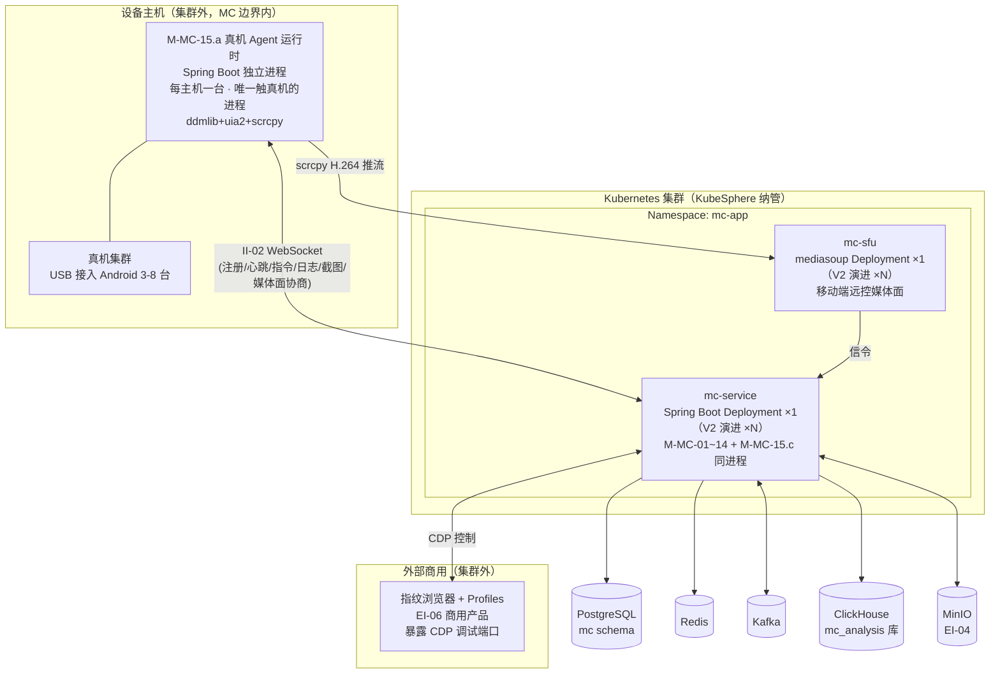
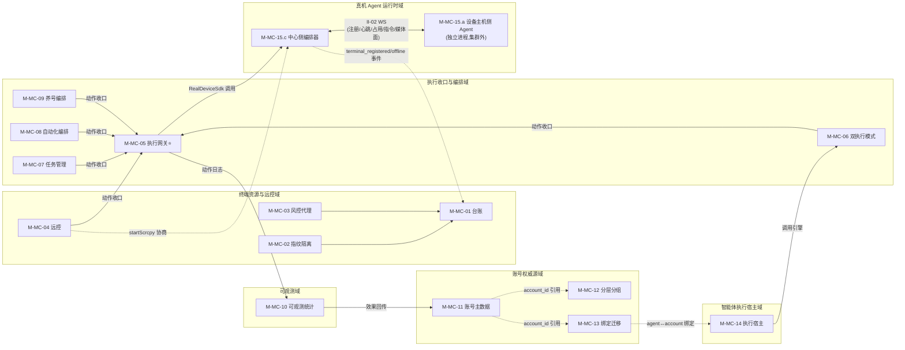
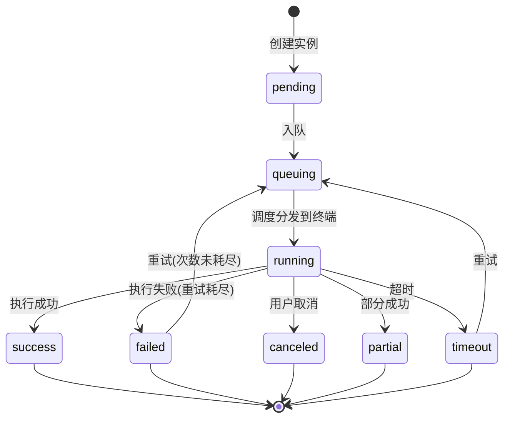
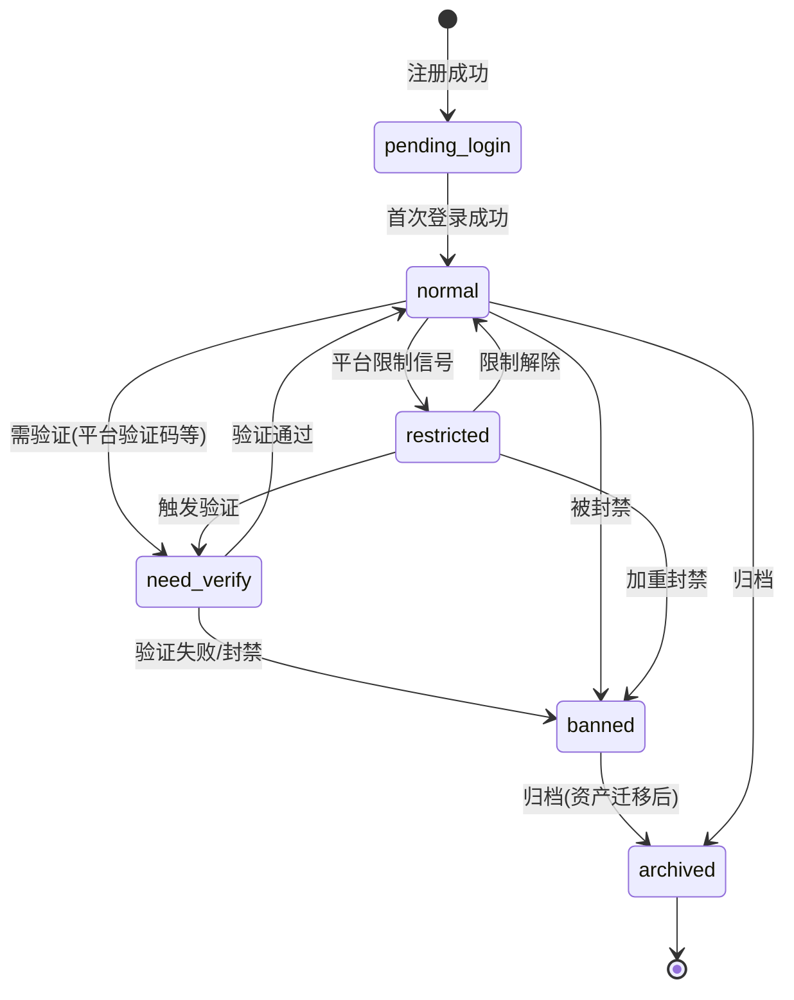

# 软件详细设计说明 - MC 子系统

| 项目 | 内容 |
| --- | --- |
| 项目名称 | 认知行动平台（v1.0） |
| 文档版本 | V1.3 |
| 密级 | 内部使用 |
| 编制 | 石建国 |
| 编制日期 | 2026-07-20 |

---

## 1 引言

### 1.1 标识

本文件为「认知行动平台」（以下简称"系统"或"平台"）多设备矩阵自动化群控子系统（MC，软部件标识 M-MC-00）的软件详细设计说明（SDD）。它是《软件需求规格说明-MC子系统》V3.8 功能需求 R-MC-001 ~ R-MC-014（共 14 项）与《软件概要设计说明》V2.6 模块 M-MC-01 ~ M-MC-14（共 14 模块 / 63 功能点）的详细设计下沉，描述 MC 子系统各模块的内部结构、类与接口、数据结构、算法、状态机与部署单元，作为编码实现与单元测试的依据。

### 1.2 系统概述

多设备矩阵自动化群控子系统（MC）是系统的**统一自动化执行引擎与多终端执行网关**，承担四类职责：

1. **执行终端统一管理**：管理移动端（真机 / 云手机 / ARM 板卡 / 虚拟化真机）与桌面端（指纹浏览器 Profile）两类执行终端的接入、台账、身份隔离（指纹固化）、风控分级与代理绑定，提供远程控制。
2. **动作统一收口**：以**统一执行网关（M-MC-05）**作为所有执行终端动作的**唯一出口**，对动作鉴权、记录、熔断，保证动作可观测、可审计、可熔断、不裸奔（CON-07 动作收口）。提供脚本模式与智能体模式双执行引擎（CON-08 双执行模式、CON-10 推理与执行分离）。
3. **账号资源平台级权威源**：唯一维护社交媒体账号主数据（凭据加密、平台、生命周期、风险评估、账号分类），经事件总线向 DC / SWM / OCC 分发 `account_id`；维护智能体账号分层分组、作业生命周期、`agent_id↔account_id` 绑定与封号资产迁移（CON-11 权威源唯一）。
4. **智能体执行宿主**：接收并持存 SWM 同步来的提示词包（以 `agent_id` 为标识），任务执行时由 `agent-runtime` 运行（场景适配、动态调用提示词、读记忆、调 IRS 推理），并在执行前校验行为风格一致性。

MC 采用「**单一微服务（mc-service）+ 独立媒体面（mc-sfu）+ 设备端 Agent**」三边界形态：

- **mc-service**：Java/Spring Boot 单一微服务，是 MC 的"大脑"，承担调度、收口、编排、账号权威、可观测、agent-runtime 等全部服务端逻辑。14 个模块为 mc-service 同进程内的 Java 包划分，不拆独立 Pod（遵循全平台"一子系统一微服务、内部不拆分"原则，与 OM / COM 一致）。
- **mc-sfu**：自建开源 WebRTC SFU（mediasoup），独立部署单元，承担移动端远程控制的**媒体面**（RTP 实时画面流转发）。与 mc-service 经信令交互，媒体流不经 mc-service。拆分原因：媒体面与控制面的运行时形态（UDP/RTP、伸缩模型、资源占用）与 Java 服务差异巨大，合并部署会拖累网关稳定性，故独立。
- **移动端 Agent**：设备端程序，经 II-02 与 mc-service 长连接，接收指令、回传日志与截图、推送远控画面。Agent 不在本文件主要篇幅内（属设备端程序设计），本文件仅定义其与 mc-service 的接口契约（II-02）。
- **桌面端指纹浏览器（EI-06）**：外部商用产品（非自研），由其创建 / 配置 / 启动浏览器 Profile 并固化渲染层指纹（20+ 维度），暴露 CDP 调试端口供 mc-service 控制。指纹生成与固化由商用产品负责（CON-12），MC 不自研指纹引擎。

MC 子系统由 14 个模块组成（与 14 项功能需求 1:1 对应，共 63 功能点）：

| 模块           | 标识      | 对应需求     | 功能点数 |
| ------------ | ------- | -------- | ---- |
| 执行终端接入与台账    | M-MC-01 | R-MC-001 | 4    |
| 终端身份与环境隔离    | M-MC-02 | R-MC-002 | 3    |
| 终端风控分级与代理绑定  | M-MC-03 | R-MC-003 | 4    |
| 远程控制         | M-MC-04 | R-MC-004 | 4    |
| 统一执行网关（核心）   | M-MC-05 | R-MC-005 | 5    |
| 双执行模式与执行目标   | M-MC-06 | R-MC-006 | 3    |
| 任务管理         | M-MC-07 | R-MC-007 | 5    |
| 自动化编排能力      | M-MC-08 | R-MC-008 | 4    |
| 账号操作编排与养号    | M-MC-09 | R-MC-009 | 4    |
| 可观测性与作业统计复盘  | M-MC-10 | R-MC-010 | 9    |
| 账号主数据管理（权威源） | M-MC-11 | R-MC-011 | 6    |
| 智能体账号分层分组    | M-MC-12 | R-MC-012 | 2    |
| 智能体账号绑定与资产迁移 | M-MC-13 | R-MC-013 | 5    |
| 智能体执行宿主与同步   | M-MC-14 | R-MC-014 | 5    |

> 设计阶段对两条 SRS 概念边界做了强制切分（详见 §5）：① `agent-runtime` 子模块的归属——R-MC-014 负责**持存 / 校验 / OCC 节点来源**等静态资产，R-MC-006 负责**运行时引擎**动态执行，`agent-runtime` 命名只出现在 R-MC-006 引擎职责内，014 调用引擎；② 绑定关系**单一物理存储**——R-MC-003（终端↔代理）、R-MC-009（账号↔终端↔代理）、R-MC-013（agent↔account↔终端↔代理 四元）共一张绑定表，三需求各自引用其不同侧面，不各存各的。

### 1.3 文档概述

本文件章节安排如下：第 2 章引用文件；第 3 章总体设计，给出 MC 技术栈、部署单元、模块间调用关系与数据流；第 4 章数据结构设计，给出核心数据模型与存储表结构；第 5 章按域分组（终端资源与远控 / 执行收口与编排 / 可观测与统计复盘 / 账号权威源 / 智能体执行宿主）给出各模块详细设计（类 / 接口 / 算法 / 状态机）；第 6 章接口详细设计；第 7 章错误处理与可靠性设计；第 8 章部署与运维设计。需求追溯以《软件需求跟踪矩阵.xlsx》为唯一权威源，本文件第 9 章仅做概要引用。

### 1.4 术语和缩略语

沿用《软件需求规格说明-总册》第 1.4 节术语与缩略语，本文件补充以下技术术语：

| 术语 | 说明 |
| --- | --- |
| 执行终端 | 承载作业动作的物理或虚拟运行体，分移动端（真机 / 云手机 / ARM 板卡 / 虚拟化真机）与桌面端（指纹浏览器 Profile）两类 |
| 执行网关 | 统一执行网关（M-MC-05），所有执行终端动作的唯一收口，对动作鉴权 / 记录 / 熔断 |
| 控制通道 | 网关落地动作的底层通道：移动端采用 ADB 与无障碍服务（Android AccessibilityService），桌面端 Profile 采用 CDP（Chrome DevTools Protocol） |
| Profile | 指纹浏览器中的浏览器实例分身，一 Profile 对应一套固化指纹与一个账号身份 |
| 指纹固化 | 使终端长期呈现一致的、像真人的设备身份（移动端硬件/软件指纹、桌面端 Canvas/WebGL/字体/时区/Audio/UA 等 20+ 维渲染层指纹），降低被风控识别为异常的概率 |
| 行动单元 | `agent_id : account_id : 终端 : 代理 IP = 1 : 1 : 1 : 1` 的四元绑定关系；移动端"一设备一账号一 IP"，桌面端"一 Profile 一账号一 IP" |
| agent-runtime | MC 内运行智能体的运行时子模块，承担运行时场景适配、动态调用提示词、读 SWM 记忆、调 IRS 推理产出动作指令；与执行网关逻辑隔离（推理不经网关，动作经网关） |
| CDP | Chrome DevTools Protocol，Chrome 系浏览器自带的远程调试协议，mc-service 经它远程控制指纹浏览器 Profile（点击 / 输入 / 截图 / 页面注入） |
| ADB | Android Debug Bridge，安卓官方远程调试工具，mc-service 经 II-02 下发指令到 Agent，由 Agent 执行 ADB 操作 |
| 无障碍服务 | Android AccessibilityService，原为残障辅助功能，可模拟人点击屏幕 UI 元素，是控制安卓 UI 的标准手段之一 |
| SFU | Selective Forwarding Unit，WebRTC 选择性转发单元，mc-sfu 基于 mediasoup 实现，转发移动端远控画面流 |
| 推理执行分离 | 智能体模式下视觉推理由 agent-runtime 直连 IRS 完成（不经执行网关），推理产出的动作指令再经执行网关落地（CON-10） |
| 权威源 | 平台级主数据的唯一维护方，使用方仅引用标识不复制主数据（CON-11）；账号主数据由 MC 唯一维护 |

---

## 2 引用文件

| 文件 | 说明 |
| --- | --- |
| 《软件需求规格说明-MC子系统》V3.8 | MC 功能需求 R-MC-001 ~ R-MC-014、非功能需求（NR-S / NR-C / NR-P / NR-R / NR-M）、外部接口 EI-02/03/04/05/06、内部接口 II-01/01a/02/03/07/08/10/11/14 的直接输入 |
| 《软件概要设计说明》V2.6 | MC 模块划分 M-MC-01 ~ M-MC-14（§4.2，V2.6 起 M-MC-06/14 补 agent-runtime 归属）、§5 接口设计、§6 数据清单（DR-01/02M/04/05/07/08 归 MC）、约束 CON-07/08/09/10/11/12/13/14 |
| 《软件概要设计-架构图.md》V1.4 | MC 模块架构图与模块内功能架构图（§2），63 功能点权威依据 |
| 《软件概要设计-模块功能拆分-v2.xlsx》 | MC 14 模块 63 功能点的权威依据 |
| 《软件需求跟踪矩阵.xlsx》 | MC 需求双向追溯唯一权威源 |
| 《软件详细设计说明-OM子系统.md》V1.0 | Java/Spring Boot 同栈微服务的形态参照、PostgreSQL/Redis/Kafka 复用约定、§5 四段式模块设计模式参照 |
| 《软件详细设计说明-COM子系统.md》V1.0 | com-auth-lib 本地验签 + org_id 注入的鉴权约定、凭据加密边界（COM 维护人登录密码用 BCrypt 不可逆，MC 维护机器人账号凭据用 AES-256-GCM 可逆）参照 |
| 《软件详细设计说明-DC子系统.md》V1.2 | 复用 PostgreSQL/Redis/Kafka/ClickHouse/MinIO 实例、多面部署架构（§8.1）参照依据 |
| 《多设备矩阵自动化运营系统开发方案 V1.1》 | MC 子系统的早期设计与阶段规划（合规导向，位于上级目录） |

---

## 3 总体设计

### 3.1 技术选型

MC 子系统技术栈遵循全平台「**管控 / 业务微服务统一 Java（Spring Boot）；数据采集与分析用 Python；两者经 Kafka/REST 解耦**」原则（DC 整体归 Python 为采集域特例）。MC 与 OM / COM 同为 Java / Spring Boot 栈。真机 Agent 主机进程（M-MC-15.a）同为 Java / Spring Boot 栈（独立部署单元），远控媒体面 mc-sfu 为 Node.js，二者为运行时形态特例（非业务微服务）。

| 维度 | 选型 | 说明 |
| --- | --- | --- |
| 微服务语言/框架 | **Java 17 + Spring Boot 3.x** | mc-service 单一微服务，**15 模块**（M-MC-01~14 + M-MC-15.c）同进程 Java 包；Spring Security + com-auth-lib 鉴权 |
| 远控媒体面 | **mediasoup（Node.js，自建开源 WebRTC SFU）** | mc-sfu 独立部署单元，转发移动端远控 RTP 画面流；私有化部署，不依赖外部公有云 SFU（CON-06） |
| **真机 Agent 主机进程（M-MC-15.a）** | **Java 17 + Spring Boot 3.x**（独立部署单元，借鉴 sonic-agent，Apache 2.0） | 每个插真机的 Linux/Mac 主机一台的独立进程，唯一触碰真机的进程（CON-15）；承载 ddmlib（ADB 通道）+ sonic-driver-core（uia2 无障碍通道）+ scrcpy 客户端（画面源），经 II-02 WS 与 mc-service 通信 |
| 浏览器控制 | **CDP（Chrome DevTools Protocol）** | 经 EI-06 商用指纹浏览器暴露的 CDP 调试端口控制桌面端 Profile |
| 移动端控制 | **ADB（ddmlib）+ Android 无障碍服务（uiautomator2-server）+ scrcpy** | 经 II-02 下发到 M-MC-15.a，由 Agent 执行 ADB（install / pressKey / reboot / screenshot）、无障碍（find / click / sendKeys / swipe）、scrcpy（H.264 画面源） |
| 脚本沙箱 | **GraalVM 多语言沙箱（JS 为主）** | R-MC-008 第三阶段脚本开发与调试的运行时；JVM 内嵌、同进程、资源限制 + API 白名单隔离；支持 JS/Python polyglot；越权访问拦截（NR-S-05） |
| 微服务治理 | **KubeSphere 微服务治理**（Spring Cloud Kubernetes） | 服务注册 / 发现 / 配置复用 KubeSphere，不另起注册中心，与 OM / COM 一致 |
| 元数据库 | **PostgreSQL**（复用 DC 实例，独立 schema `mc`） | 终端台账、账号主数据（凭据加密）、任务 / 实例、脚本 / 工作流、绑定关系、审计日志（OLTP 事务） |
| 缓存与队列 | **Redis**（复用 DC 实例） | 任务优先级队列（ZSet，NR-P-04 入队到分发 ≤2s）、终端在线状态、分布式锁、养号会话、限流计数 |
| 业务数据总线 | **Kafka**（复用 DC 集群） | II-01a 账号状态变更事件、II-11 动作日志上报 OM、任务分发、II-14 提示词包同步 |
| 分析数据仓 | **ClickHouse**（复用集群，独立库 `mc_analysis`） | 动作明细（高频）+ 作业统计多维聚合（完成率 / 触达 / 互动 / 账号健康度，R-MC-010）；与 OM 各存一份，单一采集点（网关）一次采集、两处消费 |
| 对象存储 | **MinIO（EI-04）** | 截图 / 录屏、脚本文件、内容素材临时链接上传下载 |
| 凭据加密 | **AES-256-GCM 字段级加密** | 账号密码 / cookie / token 需可逆解密（要用于登录），密钥经 K8s Secret 注入；区别于 COM 人登录密码的 BCrypt 不可逆哈希（NR-S-03） |
| 容器编排 | **Kubernetes（KubeSphere 纳管）** | mc-service / mc-sfu Pod 化部署 |

### 3.2 部署单元

MC 部署为「**一微服务 + 一媒体面 + 真机 Agent 主机（集群外，独立进程）+ 商用指纹浏览器（集群外）**」四边界。当前版本 mc-service **单副本**、mc-sfu **单副本**（V2 演进多副本 HA，对应 NR-R-01/04 的 V2 目标）。**15 模块**中，M-MC-01~14 为 mc-service 同进程内的 Java 包（不拆独立 Pod）；**M-MC-15 双形态**——中心侧 Agent 编排器是 mc-service 同进程 Java 包（M-MC-15.c），设备主机侧 Agent 运行时是独立部署单元（M-MC-15.a，每个插设备的 Linux/Mac 主机一台的 Java 进程，借鉴 SonicCloudOrg/sonic-agent，Apache 2.0）。



各部署单元职责：

| 部署单元 | 实现 | 对应模块 | 副本 |
| --- | --- | --- | --- |
| mc-service | Spring Boot 单一微服务（M-MC-01~14 + M-MC-15.c 中心侧编排器，共 15 模块同进程） | M-MC-01 ~ M-MC-15.c | ×1（V2 演进 ×N） |
| mc-sfu | mediasoup 自建 SFU | M-MC-04 远程控制（媒体面转发） | ×1（V2 演进 ×N） |
| **真机 Agent 主机**（M-MC-15.a） | Spring Boot 独立进程（借鉴 sonic-agent，Apache 2.0） | **M-MC-15 真机 Agent 运行时与编排（设备主机侧形态）** | 随设备主机规模（MVP 单主机） |
| 指纹浏览器（EI-06） | 外部商用产品 | M-MC-01 Profile 创建 / M-MC-02 指纹固化 / M-MC-05 通道（桌面端落地执行） | 外部 |

> PostgreSQL / Redis / Kafka / ClickHouse / MinIO 由 DC 部署或为 KubeSphere 基础设施，MC 仅消费（独立 schema `mc`、独立 ClickHouse 库 `mc_analysis`、独立 Redis Key 前缀 `mc:`、独立 Kafka topic 前缀 `mc-`）。

### 3.3 模块间调用关系

mc-service 内部 15 模块同进程调用（M-MC-01~14 + M-MC-15.c 中心侧编排器），M-MC-15.a 设备主机侧 Agent 经 II-02 WS 跨进程通信，分五类协作关系：



**五类协作关系**：

1. **动作收口流（核心）**：M-MC-07 / 08 / 06 / 09 / 04 / 14 → M-MC-05（执行网关）→ **按 terminal_type 路由**：真机动作 → M-MC-15.c（中心侧编排器）→ II-02 → M-MC-15.a（设备主机侧 Agent）→ ADB / 无障碍 / scrcpy 落地。所有产出动作的模块只调 `ExecutionGateway.submit()`，不直接碰 M-MC-15。
2. **Agent 生命周期与台账联动**：M-MC-15.c 持 II-02 WS endpoint，全权管 Agent 注册 / 心跳 / 占用锁 / 媒体面协商；**设备上下线事件**（`terminal_registered` / `terminal_offline`）推 M-MC-01 写台账 + 更新在线状态（M-MC-01 回归纯台账持有方，不再持 endpoint）。
3. **远控媒体面分工**：M-MC-04（mc-sfu）持 WebRTC 转发与远控体验；**画面源**（scrcpy server 启动 + H.264 产出）归 M-MC-15.a，经 `startScrcpy` 协商后 Agent 直接推流到 mc-sfu 端口（不经 mc-service 转发，避免 server 成瓶颈）。
4. **账号权威源分发**：M-MC-11 维护账号主数据 → event bus `account.status.changed` → DC / SWM / OCC；M-MC-12 分层分组、M-MC-13 绑定与迁移引用 `account_id`；M-MC-13 的 `agent_id↔account_id` 绑定供 M-MC-14 引用。
5. **可观测闭环**：M-MC-05 动作日志（单一采集点）→ M-MC-10（统计复盘）→ OCC（效果评估）；Agent 自身日志经 II-02 回传 M-MC-15.c → M-MC-10。

### 3.4 数据流设计

MC 数据流分五类：

1. **终端接入与控制流**：真机 Agent（M-MC-15.a，设备主机侧独立进程）启动 → 经 II-02 WS 连 M-MC-15.c（中心侧编排器）→ agentKey 鉴权 + 设备清单上报（`deviceDetail`）→ M-MC-15.c 发 `terminal_registered` 事件给 M-MC-01 写台账 → Agent 周期心跳（`heartBeat`）→ M-MC-15.c 判在线掉线、推 `terminal_offline` 给 M-MC-01 更新台账状态。桌面端 Profile 经商用产品 API（EI-06）创建 / 启动 → 返回 CDP 端口 → M-MC-01 记台账。控制时：mc-service → 经 M-MC-15.c → II-02 → M-MC-15.a → ADB / 无障碍（真机）；或 mc-service → CDP 直连（EI-06 桌面端）。
2. **动作执行流（核心）**：任务调度（M-MC-07）/ 编排（M-MC-08）/ 养号（M-MC-09）/ 智能体（M-MC-06 引擎 + M-MC-14 宿主）产出动作指令 → **执行网关（M-MC-05）** 鉴权 → 记录 → 熔断检测 → 路由到控制通道 → 落地到终端 → 回传执行结果 → 动作日志入 ClickHouse + 发 Kafka II-11 给 OM。
3. **账号权威流**：账号运营人员注册账号（M-MC-11）→ 凭据 AES 加密入 PG → 验证探测 / 状态流转 → 状态变更发 `account.status.changed`（II-01a，Kafka）→ DC / SWM / OCC 订阅响应（停止任务等）。使用方经 II-01 引用 `account_id`。
4. **智能体执行流**：SWM 经 II-14 同步提示词包（`agent_id` 为主键）→ M-MC-14 持存 → 任务执行前行为风格一致性校验 → agent-runtime 读 SWM 记忆 + 调 IRS 推理（II-08，不经网关）→ 产出动作指令 → 经执行网关落地。
5. **可观测与统计流**：执行网关动作日志 → M-MC-10 写 ClickHouse `mc_analysis` → 多维统计（完成率 / 触达 / 互动 / 健康度）→ 任务复盘归因 → 效果数据回调回传 OCC（II-10）；同时动作日志经 Kafka II-11 上报 OM。

---

## 4 数据结构设计

MC 数据按存储介质分层：元数据（PostgreSQL `mc` schema）、缓存与队列（Redis）、消息总线（Kafka）、分析仓（ClickHouse `mc_analysis` 库）、对象存储（MinIO）。各存储的归属模块与 DR 编号对照见《概要设计》§6.2（DR-01 终端 / 02M 账号主数据 / 04 任务 / 05 脚本工作流 / 07 审计风险 / 08 代理指纹归 MC）。

### 4.1 元数据库（PostgreSQL `mc` schema）

#### 4.1.1 执行终端表 `mc_terminal`（M-MC-01，DR-01）

```sql
CREATE TABLE mc.mc_terminal (
    terminal_id      UUID PRIMARY KEY,
    terminal_type    VARCHAR(16) NOT NULL,        -- mobile_real/mobile_cloud/mobile_arm/mobile_virt/profile
    device_model     VARCHAR(128),                -- 设备型号(移动端) / 内核版本(桌面端Profile)
    agent_version    VARCHAR(32),                 -- Agent版本(移动端)
    cdp_endpoint     VARCHAR(128),                -- CDP调试端点(桌面端Profile,EI-06返回)
    group_id         UUID,                        -- 所属终端分组(MC自维护)
    tags             JSONB,                       -- 标签集合
    status           VARCHAR(16) NOT NULL,        -- online/offline/isolated
    risk_level       VARCHAR(16),                 -- 风控分级(M-MC-03): high/mid_high/mid/low
    org_id           UUID NOT NULL,               -- 所属组织(COM数据隔离)
    created_at       TIMESTAMPTZ NOT NULL DEFAULT now(),
    updated_at       TIMESTAMPTZ NOT NULL DEFAULT now()
);
CREATE INDEX idx_mc_terminal_group ON mc.mc_terminal(group_id);
CREATE INDEX idx_mc_terminal_status ON mc.mc_terminal(status, risk_level);
CREATE INDEX idx_mc_terminal_org ON mc.mc_terminal(org_id);
```

> V1.1（terminal_type 分类说明）：`terminal_type` 取值分移动端（`mobile_real`/`mobile_cloud`/`mobile_arm`/`mobile_virt`）与浏览器（`profile`）两类载体。任务与编排兼容两类载体——编排器（MC-15）/ 脚本 IDE（MC-16）经"载体切换控件"区分移动端 ADB / 无障碍通道与桌面端 CDP 通道，网关（M-MC-05）按 `terminal_type` 路由到对应**设备类型 SDK**（真机/云手机/ARM/虚拟化真机/Profile 五类，见 §5.2.1）。

#### 4.1.2 终端分组表 `mc_terminal_group`（M-MC-01 F-MC-01-03）

```sql
CREATE TABLE mc.mc_terminal_group (
    group_id    UUID PRIMARY KEY,
    group_name  VARCHAR(128) NOT NULL,
    parent_id   UUID,                             -- 支持树形分组
    org_id      UUID NOT NULL,
    created_at  TIMESTAMPTZ NOT NULL DEFAULT now(),
    FOREIGN KEY (parent_id) REFERENCES mc.mc_terminal_group(group_id)
);
```

#### 4.1.3 指纹配置表 `mc_fingerprint`（M-MC-02，DR-08）

```sql
CREATE TABLE mc.mc_fingerprint (
    terminal_id     UUID PRIMARY KEY REFERENCES mc.mc_terminal(terminal_id),
    fp_type         VARCHAR(16) NOT NULL,         -- mobile_hardware/mobile_software/profile_render
    fp_template     JSONB NOT NULL,               -- 指纹模板(桌面端20+维:Canvas/WebGL/字体/时区/Audio/UA...)
    fix_status      VARCHAR(16) NOT NULL,         -- pending/fixed (固化由EI-06商用产品完成)
    updated_at      TIMESTAMPTZ NOT NULL DEFAULT now()
);
```

> 桌面端 Profile 指纹固化由 EI-06 商用产品完成（CON-12），MC 仅存模板与固化状态记录，不执行指纹生成。

#### 4.1.4 代理绑定表 `mc_proxy`（M-MC-03，DR-08）

```sql
CREATE TABLE mc.mc_proxy (
    proxy_id     UUID PRIMARY KEY,
    proxy_ip     VARCHAR(64) NOT NULL,
    proxy_port   INT NOT NULL,
    region       VARCHAR(32),
    status       VARCHAR(16) NOT NULL,            -- available/bound/invalid
    terminal_id  UUID,                            -- 当前固定绑定的终端(一终端一IP)
    bound_at     TIMESTAMPTZ,
    org_id       UUID NOT NULL,
    created_at   TIMESTAMPTZ NOT NULL DEFAULT now(),
    UNIQUE(terminal_id)                           -- 一终端一IP:一个终端只能绑一个代理
);
```

#### 4.1.5 账号主数据表 `mc_account`（M-MC-11，DR-02M，★ 权威源）

```sql
CREATE TABLE mc.mc_account (
    account_id      UUID PRIMARY KEY,
    platform        VARCHAR(16) NOT NULL,         -- tiktok/facebook/instagram/youtube/x/...
    username        VARCHAR(128) NOT NULL,
    credential_enc  BYTEA NOT NULL,               -- 凭据AES-256-GCM加密(密码/cookie/token,可逆解密用于登录)
    account_class   VARCHAR(16) NOT NULL,         -- crawler(爬虫,桌面端Profile) / combat(认知行动,移动端)
    lifecycle_state VARCHAR(16) NOT NULL,         -- 生命周期(六态): pending_login/normal/restricted/need_verify/banned/archived
    risk_score      INT,                          -- 风险评估分
    org_id          UUID NOT NULL,
    created_at      TIMESTAMPTZ NOT NULL DEFAULT now(),
    updated_at      TIMESTAMPTZ NOT NULL DEFAULT now(),
    UNIQUE(platform, username)
);
CREATE INDEX idx_mc_account_state ON mc.mc_account(lifecycle_state, account_class);
CREATE INDEX idx_mc_account_org ON mc.mc_account(org_id);
```

#### 4.1.6 ★ 四元绑定关系表 `mc_binding`（R-MC-003 / 009 / 013 单一物理存储）

**设计要点**：R-MC-003（终端↔代理）、R-MC-009（账号↔终端↔代理）、R-MC-013（agent↔account↔终端↔代理 四元）共这一张表，三需求各自引用其不同侧面，**不各存各的**。一张记录即一个行动单元（`1:1:1:1`）。

```sql
CREATE TABLE mc.mc_binding (
    binding_id   UUID PRIMARY KEY,
    agent_id     UUID,                            -- 智能体标识(SWM分配,II-14同步;爬虫账号可空)
    account_id   UUID NOT NULL REFERENCES mc.mc_account(account_id),
    terminal_id  UUID NOT NULL REFERENCES mc.mc_terminal(terminal_id),
    proxy_id     UUID NOT NULL REFERENCES mc.mc_proxy(proxy_id),
    is_primary   BOOLEAN NOT NULL DEFAULT true,   -- 是否主绑定(账号迁移时切换)
    status       VARCHAR(16) NOT NULL,            -- active/released/migrated
    bound_at     TIMESTAMPTZ NOT NULL DEFAULT now(),
    released_at  TIMESTAMPTZ,
    org_id       UUID NOT NULL
);
-- 部分唯一索引实现"一设备一账号一 IP / 一 Profile 一账号一 IP,未解绑前不可再绑"(CON-13)
CREATE UNIQUE INDEX uk_mc_binding_account_active
    ON mc.mc_binding(account_id) WHERE (is_primary = true AND status = 'active');  -- 一账号同时只能有一个活动主绑定
CREATE UNIQUE INDEX uk_mc_binding_terminal_active
    ON mc.mc_binding(terminal_id) WHERE (is_primary = true AND status = 'active'); -- 一终端同时只能有一个活动主账号
CREATE INDEX idx_mc_binding_agent ON mc.mc_binding(agent_id) WHERE (status = 'active');
CREATE INDEX idx_mc_binding_account ON mc.mc_binding(account_id, status);
```

> 约束实现"一设备一账号一 IP / 一 Profile 一账号一 IP，未解绑前不可再绑"（CON-13）：唯一索引保证一终端同时只能有一个 active 主账号、一账号同时只能有一个 active 主绑定。账号被封（lifecycle_state=banned）触发解绑（status=released），释放后终端可再绑新账号。

#### 4.1.7 智能体账号分层分组表 `mc_agent_group`（M-MC-12 F-MC-12-01）

```sql
CREATE TABLE mc.mc_agent_group (
    group_id    UUID PRIMARY KEY,
    group_name  VARCHAR(128) NOT NULL,
    dim_target  VARCHAR(64),                      -- 维度:业务目标
    dim_platform VARCHAR(16),                     -- 维度:平台
    dim_region  VARCHAR(32),                      -- 维度:地区
    dim_risk    VARCHAR(16),                      -- 维度:风险等级
    parent_id   UUID,
    org_id      UUID NOT NULL,
    FOREIGN KEY (parent_id) REFERENCES mc.mc_agent_group(group_id)
);

CREATE TABLE mc.mc_agent_group_member (
    group_id    UUID NOT NULL REFERENCES mc.mc_agent_group(group_id),
    agent_id    UUID NOT NULL,
    joined_at   TIMESTAMPTZ NOT NULL DEFAULT now(),
    PRIMARY KEY (group_id, agent_id)
);
```

#### 4.1.8 任务与实例表 `mc_task` / `mc_task_instance`（M-MC-07，DR-04）

```sql
CREATE TABLE mc.mc_task (
    task_id      UUID PRIMARY KEY,
    task_name    VARCHAR(128),
    task_type    VARCHAR(32) NOT NULL,            -- install/distribute/publish/screenshot/collect/script/inspect/check 八类
    target_type  VARCHAR(16) NOT NULL,            -- terminal/group
    target_ref   UUID NOT NULL,                   -- terminal_id 或 group_id
    params       JSONB,                           -- 任务参数
    priority     INT NOT NULL DEFAULT 5,          -- 优先级(1高~9低,ZSet score)
    exec_mode    VARCHAR(16),                     -- script/agent(执行模式,见M-MC-06)
    max_retry    INT NOT NULL DEFAULT 3,
    timeout_sec  INT NOT NULL DEFAULT 600,
    cron_expr    VARCHAR(64),                     -- 计划任务Cron(空=立即)
    max_concurrency INT NOT NULL DEFAULT 1,
    org_id       UUID NOT NULL,
    created_by   UUID,
    created_at   TIMESTAMPTZ NOT NULL DEFAULT now()
);

CREATE TABLE mc.mc_task_instance (
    instance_id  UUID PRIMARY KEY,
    task_id      UUID NOT NULL REFERENCES mc.mc_task(task_id),
    terminal_id  UUID NOT NULL REFERENCES mc.mc_terminal(terminal_id),
    status       VARCHAR(16) NOT NULL,            -- 八态: pending/queuing/running/success/failed/canceled/timeout/partial
    retry_count  INT NOT NULL DEFAULT 0,
    queued_at    TIMESTAMPTZ,
    started_at   TIMESTAMPTZ,
    finished_at  TIMESTAMPTZ,
    result       JSONB,
    org_id       UUID NOT NULL,
    created_at   TIMESTAMPTZ NOT NULL DEFAULT now()
);
CREATE INDEX idx_mc_task_instance_status ON mc.mc_task_instance(status, queued_at);
CREATE INDEX idx_mc_task_instance_task ON mc.mc_task_instance(task_id);
```

#### 4.1.9 脚本与工作流表 `mc_script` / `mc_workflow`（M-MC-08，DR-05）

```sql
CREATE TABLE mc.mc_script (
    script_id    UUID PRIMARY KEY,
    script_name  VARCHAR(128) NOT NULL,
    lang         VARCHAR(16) NOT NULL DEFAULT 'js',  -- js/python(GraalVM polyglot)
    version      INT NOT NULL,
    code_ref     VARCHAR(256) NOT NULL,           -- MinIO对象键(脚本文件)
    status       VARCHAR(16) NOT NULL,            -- draft/published
    org_id       UUID NOT NULL,
    created_by   UUID,
    created_at   TIMESTAMPTZ NOT NULL DEFAULT now(),
    UNIQUE(script_name, version)
);

CREATE TABLE mc.mc_workflow (
    workflow_id  UUID PRIMARY KEY,
    wf_name      VARCHAR(128) NOT NULL,
    definition   JSONB NOT NULL,                  -- 可视化工作流节点定义(开始/设备选择/启动App/等待/点击/输入/滑动/截图/上传/条件/循环/HTTP/日志/审批/结束)
    version      INT NOT NULL,
    org_id       UUID NOT NULL,
    created_at   TIMESTAMPTZ NOT NULL DEFAULT now()
);
```

#### 4.1.10 智能体定义持存表 `mc_agent_def`（M-MC-14，DR-09 子集）

```sql
CREATE TABLE mc.mc_agent_def (
    agent_id      UUID PRIMARY KEY,               -- SWM分配,II-14同步,稳定逻辑标识
    prompt_pack   JSONB NOT NULL,                 -- 提示词包(提示词/作业策略;V1.2起废除独立persona_tags,行为风格一致性基于提示词内容校验)
    version       INT NOT NULL,                   -- 版本号(更新升版)
    synced_at     TIMESTAMPTZ NOT NULL DEFAULT now(),
    org_id        UUID NOT NULL
);
```

#### 4.1.11 动作审计与风险事件表 `mc_audit_log`（M-MC-10，DR-07）

```sql
CREATE TABLE mc.mc_audit_log (
    log_id        BIGSERIAL PRIMARY KEY,
    occurred_at   TIMESTAMPTZ NOT NULL DEFAULT now(),
    actor_type    VARCHAR(16) NOT NULL,           -- user/system
    actor_id      UUID,                           -- 用户ID或系统标识
    action        VARCHAR(64) NOT NULL,           -- terminal_op/account_op/task_op/binding_op/...
    target_type   VARCHAR(32),                    -- terminal/account/task/binding
    target_id     UUID,
    result        VARCHAR(16) NOT NULL,           -- success/denied/failed
    detail        TEXT,
    org_id        UUID NOT NULL,
    client_ip     VARCHAR(64)
);
CREATE INDEX idx_mc_audit_time ON mc.mc_audit_log(occurred_at);
CREATE INDEX idx_mc_audit_actor ON mc.mc_audit_log(actor_id, occurred_at);
```

### 4.2 缓存与队列（Redis）

| Redis Key 模式 | 类型 | 用途 | TTL |
| --- | --- | --- | --- |
| `mc:task:queue:{org_id}` | ZSet | 任务优先级队列（score=优先级，NR-P-04 入队到分发 ≤2s） | 无（消费即移除） |
| `mc:terminal:online` | Hash | 终端在线状态（field=terminal_id，value=最后心跳时间） | 心跳周期 ×3 |
| `mc:lock:binding:{account_id}` | STRING | 绑定操作分布式锁（防并发冲突） | 10s |
| `mc:lock:account:{account_id}` | STRING | 账号状态流转锁（R-MC-012 加锁） | 10s |
| `mc:nurture:session:{account_id}` | Hash | 养号会话状态（当前行为 / 上次动作时间） | 会话周期 |
| `mc:rate:gateway:{terminal_id}` | STRING（计数） | 单终端动作限流（异常频率熔断检测） | 滑动窗口 60s |
| `mc:perm:{role_id}` | SET | 角色权限点缓存（com-auth-lib 读） | 1h |

### 4.3 消息总线（Kafka Topic）

| Topic | 方向 | 内容 | 生产方 | 消费方 |
| --- | --- | --- | --- | --- |
| `mc-account-status` | MC → 事件总线 | `account.status.changed` 事件（II-01a） | M-MC-11 | DC / SWM / OCC |
| `mc-action-log` | MC → OM | 动作日志（II-11 全量上报 OM） | M-MC-05 | OM |
| `mc-task-dispatch` | mc-service 内 | 任务实例分发（按 terminal_id 分区） | M-MC-07 | Agent（经 II-02） |
| `mc-agent-def-sync` | SWM → MC | 提示词包同步（II-14，agent_id 为主键） | SWM | M-MC-14 |
| `mc-business-metric` | MC → OM | 业务指标上报（II-04） | M-MC-10 | OM |

### 4.4 分析数据仓（ClickHouse `mc_analysis` 库）

```sql
-- 动作明细(高频,M-MC-05产生,M-MC-10统计)
CREATE TABLE mc_analysis.mc_action_log (
    log_id        UInt64,
    occurred_at   DateTime,
    org_id        UUID,
    terminal_id   UUID,
    account_id    UUID,
    agent_id      Nullable(UUID),
    action_type   String,                         -- click/input/install/publish/...
    channel       String,                         -- adb/accessibility/cdp
    result        String,                         -- success/failed
    duration_ms   UInt32,
    breaker_hit   UInt8                           -- 是否触发熔断
) ENGINE = MergeTree()
PARTITION BY toYYYYMMDD(occurred_at)
ORDER BY (org_id, occurred_at, terminal_id)
TTL occurred_at + INTERVAL 6 MONTH;

-- 作业统计多维聚合(M-MC-10 F-MC-10-05~07,按天rollup)
-- 存分子/分母计数(SummingMergeTree 正确求和),比率在查询时计算(sum(num)/sum(den))
CREATE TABLE mc_analysis.mc_stat_daily (
    stat_date     Date,
    org_id        UUID,
    task_type     String,
    task_total    UInt32,                        -- 任务总数(分母,完成率)
    task_success  UInt32,                        -- 任务成功数(分子,完成率)
    content_total UInt32,                        -- 投放内容总数(分母,触达率)
    content_reach UInt32,                        -- 触达数(分子,触达率)
    interact_total UInt32,                       -- 互动基数(分母,互动率)
    interact_done  UInt32,                       -- 互动完成数(分子,互动率)
    health_sum    Float32,                       -- 账号健康度累加值(配合 health_cnt 求均值)
    health_cnt    UInt32
) ENGINE = SummingMergeTree()
PARTITION BY toYYYYMM(stat_date)
ORDER BY (stat_date, org_id, task_type)
TTL stat_date + INTERVAL 24 MONTH;
-- 查询示例: SELECT task_success / NULLIF(task_total, 0) AS completion_rate ...
```

> **MC↔OM 数据边界**：执行网关（M-MC-05）是动作日志的**唯一采集点**——一次采集，写入 MC 的 ClickHouse `mc_analysis`（供 M-MC-10 作业统计）**同时**发 Kafka `mc-action-log`（II-11）→ OM 落 `om_analysis`（供 OM 运维检索 / 告警）。即"一次采集、两处消费、两个物理库"，满足 R-MC-010「不重复采集原始动作数据」（只有一个生产者=网关），又守住 MC / OM 各自所有权边界。

### 4.5 对象存储（MinIO / EI-04）

| 对象键前缀 | 用途 | 归属模块 |
| --- | --- | --- |
| `mc/screenshot/{terminal_id}/{date}/` | 截图（批量操作 / 远控 / 任务执行） | M-MC-01 / 04 / 10 |
| `mc/recording/{terminal_id}/{date}/` | 录屏（远控回看） | M-MC-04 |
| `mc/script/{script_id}/v{version}/` | 脚本文件 | M-MC-08 |
| `mc/content/{content_id}/` | 内容素材临时链接 | M-MC-09 |

---

## 5 模块详细设计

按域分组组织（与 SRS 用户需求分节对齐），每域给域概述 + 域内各模块四段式（类图 → 关键类 → 算法 / 状态机 → 设计要点）。

### 5.1 终端资源与远控域

本域职责：管理执行终端的接入台账、身份隔离（指纹固化）、风控分级与代理绑定、远程控制。本域模块为执行收口域提供"终端资源池"，动作落地时按 `terminal_type` 路由到对应终端。

#### 5.1.1 M-MC-01 执行终端台账（R-MC-001，4 功能点）

**职责**：维护移动端（真机 / 云手机 / ARM 板卡 / 虚拟化真机）与桌面端（指纹浏览器 Profile）的**台账数据库与状态查询**——终端元数据 CRUD、分组标签、批量操作编排、REST 查询。**V1.3（V3.10）边界调整**：原"接入注册 + 心跳判定在线"语义经 CON-15 划归 **M-MC-15**（M-MC-15.c 持 II-02 WS endpoint，全权管 Agent 生命周期）；M-MC-01 回归**纯台账持有方**——订阅 M-MC-15.c 的 `terminal_registered` / `terminal_offline` 事件写库与更新状态，不再持 WS endpoint、不再主动判定在线。桌面端 Profile 的创建 / 启动（调 EI-06）仍归 M-MC-01。

**类图**：

```mermaid
classDiagram
    class TerminalRegistry {
        +register_profile(profile_req) terminal_id   %% 桌面端Profile创建(调EI-06)
        +on_terminal_registered(event)               %% 订阅M-MC-15.c事件 → 写台账
        +on_terminal_offline(event)                  %% 订阅M-MC-15.c事件 → 更新状态
        +get(terminal_id) Terminal
        +list_by_group(group_id) list[Terminal]
    }
    class TerminalMonitor {
        +get_status(terminal_id) TerminalStatus      %% 只读查询(状态由M-MC-15.c推)
    }
    class BatchOperator {
        +batch_op(terminal_ids[], op) BatchResult    %% 转发经M-MC-05→M-MC-15落地
    }
    class ProfileClient {
        +create_profile(req) ProfileInfo
        +start_profile(profile_id) cdp_endpoint
        %% EI-06 商用产品客户端
    }
    class TerminalRepo {
        +save(t Terminal)
        +update_status(id, status)
    }
    class TerminalRegistry ..> ProfileClient : Profile创建
    class TerminalRegistry ..> TerminalRepo : 台账写库
    class TerminalRegistry ..> M15C : 订阅上下线事件
    class BatchOperator ..> TerminalRepo : 批量查询
```

**关键类说明**：
- **TerminalRegistry**：终端台账门面。桌面端 Profile 经 `ProfileClient` 调 EI-06 创建 / 启动 → 返回 CDP 端点 → 记台账；移动端终端通过订阅 M-MC-15.c 的注册事件写入台账（不再自己接 Agent 注册）。
- **TerminalMonitor**：只读状态查询；在线状态由 M-MC-15.c 心跳判定后推送，本类仅对外暴露查询接口（Redis `mc:terminal:online`）。
- **BatchOperator**：批量操作（移动端安装 / 卸载 App、重启、截图；桌面端 Profile 创建 / 启动 / 关闭、截图），**动作经 M-MC-05 网关 → M-MC-15 → Agent 落地**（M-MC-01 不直接发指令给 Agent）；文件经 MinIO（EI-04）临时链接上传下载。
- **ProfileClient**：EI-06 商用指纹浏览器 API 客户端，封装 Profile 创建 / 启动 / 关闭 / 画面预览请求。

**设计要点**：M-MC-01 与 M-MC-15 是**事件驱动边界**——M-MC-15.c 是设备上下线事件的生产者，M-MC-01 是消费者；M-MC-01 不持 WS endpoint，与 Agent 无直接连接。桌面端 Profile 创建后由商用产品返回 CDP 端点，供 M-MC-05 的 **Profile SDK**（CDP 通道）使用。终端指标异常（过热 / 存储满 / 内存超限）时隔离（status=`isolated`）并停止派发任务（V1.2 由 M-MC-15 上报指标触发，V1.3 MVP 暂不做自动隔离）。

#### 5.1.2 M-MC-02 终端身份与环境隔离（R-MC-002，3 功能点）

**职责**：通过指纹固化使终端长期呈现一致的、像真人的设备身份；对终端间环境（指纹 / 网络 / 账号 / Cookie 缓存）相互隔离，避免关联被一锅端。

**类图**：

```mermaid
classDiagram
    class FingerprintManager {
        +apply_template(terminal_id, template)    %% 下发指纹模板
        +verify(terminal_id) bool                 %% 指纹校验
    }
    class EnvironmentIsolator {
        +isolate(profile_id_a, profile_id_b)      %% Profile间Cookie/LocalStorage/缓存隔离
        +check_isolation(terminal_id) bool
    }
    class ProfileClient {
        +apply_fingerprint(profile_id, template)  %% 由商用产品生成并固化渲染层指纹
    }
    class FingerprintRepo {
        +save(fp Fingerprint)
    }
    class FingerprintManager ..> ProfileClient : 指纹固化(EI-06)
    class FingerprintManager ..> FingerprintRepo : 模板存库
```

**关键类说明**：
- **FingerprintManager**：指纹管理。桌面端 Profile 调 `ProfileClient.apply_fingerprint()` 由 EI-06 商用产品生成并固化一套渲染层指纹（Canvas / WebGL / 字体 / 时区 / Audio / UA 等 20+ 维，CON-12 指纹生成固化由商用产品负责）；移动端管理硬件 / 软件指纹配置。指纹校验失败或配置冲突时拒绝启动并告警。
- **EnvironmentIsolator**：环境隔离。保证浏览器 Profile 间的 Cookie / LocalStorage / 缓存相互独立隔离，移动端账号 / 网络隔离。

**设计要点**：一 Profile 对应一套固化指纹与一个账号身份；指纹模板存 `mc_fingerprint.fp_template`（JSONB），固化状态由商用产品回填。

> V1.1（ADR-002）：前端管理页 MC-04 已删（指纹固化由 EI-06 商用产品承载、风控为系统底层能力），本模块设计保留为后端能力。

#### 5.1.3 M-MC-03 终端风控分级与代理绑定（R-MC-003，4 功能点）

**职责**：按指纹真实度对终端风控分级；识别平台风控信号并主动规避；为每个终端分配独立固定代理 IP（一终端一 IP），代理失效时才切换。

**类图**：

```mermaid
classDiagram
    class RiskGrader {
        +grade(terminal_id) risk_level            %% 按指纹真实度分级
        +select_for_nurture(group_id) terminal_id %% 养号优先选高真实度
    }
    class RiskSignalDetector {
        +detect(terminal_id, signals) RiskAction  %% 风控信号识别
        +degrade(terminal_id)                     %% 持续触发降级/暂停
    }
    class ProxyBinder {
        +assign(terminal_id) proxy_id             %% 分配固定代理(一终端一IP)
        +rebind_on_fail(terminal_id)              %% 代理失效切换并重新固定
    }
    class ProxyRepo {
        +find_available() Proxy
        +bind(proxy_id, terminal_id)
    }
    class ProxyBinder ..> ProxyRepo : 代理分配
    class RiskGrader ..> RiskSignalDetector : 降级联动
```

**关键类说明**：
- **RiskGrader**：风控分级。真机与 ARM 板卡=高真实度，虚拟化真机=中高，云手机=中，浏览器 Profile=中。养号等风控敏感场景优先选用高真实度终端（CON-09）。
- **RiskSignalDetector**：风控信号识别与规避（覆盖移动端与桌面端），持续触发时降级或暂停该终端任务。
- **ProxyBinder**：代理固定绑定。为终端分配独立代理 IP（EI-02），默认随终端固定不变，仅在该 IP 失效（被封禁 / 不可用）时切换到新代理并重新固定绑定。绑定关系写 `mc_proxy`（`terminal_id` 唯一）。

**设计要点**：代理绑定是四元行动单元的网络层侧面，写入 §4.1.4 `mc_proxy` 与 §4.1.6 `mc_binding` 的 `proxy_id` 字段。

> V1.1（ADR-002）：前端管理页 MC-04 已删（风控为系统底层能力、无独立管理页），本模块设计保留为后端能力。

#### 5.1.4 M-MC-04 远程控制（R-MC-004，4 功能点）

**职责**：对单台及多台执行终端提供低延迟实时画面预览与输入控制，支持多终端宫格同屏监控。移动端走 WebRTC 通道（mc-sfu），桌面端走 EI-06 商用产品画面预览接口。

**类图**：

```mermaid
classDiagram
    class RemoteControlService {
        +open_session(terminal_id, user_id) Session   %% 建立远控会话
        +route_input(session_id, input_event)         %% 路由鼠标键盘事件
        +close_session(session_id)
    }
    class MobileMediaBridge {
        +setup_sfu(terminal_id) sdp_offer             %% 经mc-sfu建立WebRTC
        +teardown(terminal_id)
    }
    class DesktopPreviewClient {
        +get_preview_stream(profile_id) stream        %% EI-06 商用产品画面预览流
    }
    class InputTranslator {
        +to_touch(event)TouchEvent                    %% 鼠标键盘→移动端触摸/返回/Home/多任务
        +to_cdp(event)CDPEvent                        %% 鼠标键盘→CDP页面点击/键盘输入
    }
    class GridMonitor {
        +compose_grid(terminal_ids[]) stream          %% 低码率宫格同屏
    }
    class RemoteControlService ..> MobileMediaBridge : 移动端建流
    class RemoteControlService ..> DesktopPreviewClient : 桌面端取流
    class RemoteControlService ..> InputTranslator : 事件翻译
    class RemoteControlService ..> GridMonitor : 宫格监控
```

**关键类说明**：
- **RemoteControlService**：远控会话门面。建会话（鉴权）→ 取画面流 → 路由输入事件 → 关闭。
- **MobileMediaBridge**：移动端经 mc-sfu 建立 WebRTC 通道（信令经 mc-service，RTP 媒体流经 mc-sfu 转发，不经 mc-service）。
- **DesktopPreviewClient**：桌面端 Profile 经 EI-06 商用产品 API 取画面预览流；商用 API 不可用时降级为截图轮询。
- **InputTranslator**：鼠标键盘事件映射为终端事件（移动端触摸 / 点击 / 滑动 / 输入 / 返回键 / Home 键 / 多任务键；桌面端 CDP 页面点击 / 键盘输入）。
- **GridMonitor**：多终端宫格低码率同屏监控。

**设计要点**：远控通道与任务执行通道相互分离（CON-07），远控不经执行网关（远控是人工直接操作，非作业动作收口范畴）。单终端端到端延迟 ≤300ms（NR-P-01/05）。WebRTC 断流 / 商用 API 中断自动重连或降级；弱网自动降帧；输入事件丢失补传；剪贴板操作端与终端双向同步。

---

### 5.2 执行收口与编排域（核心）

本域职责：以统一执行网关（M-MC-05）为唯一收口，提供脚本 / 智能体双执行引擎，承载任务调度、自动化编排、养号。**本域是 MC 的核心枢纽**。

> **★ agent-runtime 归属边界（设计强制切分）**：R-MC-006（双执行模式）与 R-MC-014（智能体执行宿主）在 SRS 中都提到 `agent-runtime`，边界未切清。本设计强制规定：**`agent-runtime` 作为运行时引擎只归属 M-MC-06**，承担"场景适配 → 读记忆 → 调 IRS 推理 → 产出动作指令"；**M-MC-014 负责 agent 静态资产**（提示词包持存、行为风格一致性校验、作为 OCC 节点来源），任务执行时由 M-MC-014 触发 M-MC-06 的 agent-runtime 引擎执行。`agent-runtime` 命名只出现在 M-MC-06，M-MC-014 调用引擎而非自带引擎。

#### 5.2.1 M-MC-05 统一执行网关（R-MC-005，5 功能点，⭐ 核心）

**职责**：作为所有执行终端动作的**唯一收口**，对动作鉴权（校验来源与目标合法性）、记录（写动作日志并全量上报 OM）、熔断（检测风控信号或异常频率时停止后续动作）、通道适配（移动端 ADB / 无障碍、桌面端 CDP）。保证动作不裸奔。

**类图**：

```mermaid
classDiagram
    class ExecutionGateway {
        +submit(action) ActionResult            %% ★ 唯一动作入口
        +batch_submit(actions[]) list
    }
    class ActionAuthorizer {
        +authorize(action) AuthResult           %% 校验来源与目标合法性
    }
    class ActionRecorder {
        +record(action, result)                 %% 写动作日志
        +report_to_om(action_log)               %% 全量上报OM(II-11)
    }
    class CircuitBreaker {
        +check(terminal_id) bool                %% 熔断检测(风控信号/异常频率)
        +trip(terminal_id, reason)              %% 触发熔断
    }
    class DeviceChannelRouter {
        +route(action) DeviceSdk                %% 按 terminal_type 路由到设备SDK
    }
    class DeviceSdk {
        <<interface>>
        +click(terminal_id, params) Result
        +input(terminal_id, params) Result
        +screenshot(terminal_id) Result
        +install(terminal_id, pkg_ref) Result
        +execute(action) Result                 %% ★ 向网关提供的统一服务接口
    }
    class RealDeviceSdk {
        %% 真机 mobile_real: USB/TCP ADB + 无障碍
    }
    class CloudPhoneSdk {
        %% 云手机 mobile_cloud: 厂商API + ADB
    }
    class ArmBoardSdk {
        %% ARM板卡 mobile_arm: 网络ADB + 无障碍
    }
    class VirtualDeviceSdk {
        %% 虚拟化真机 mobile_virt: ADB + 无障碍
    }
    class ProfileSdk {
        %% 指纹浏览器Profile profile: CDP直连EI-06(无设备端Agent)
    }
    class ExecutionGateway ..> ActionAuthorizer
    class ExecutionGateway ..> ActionRecorder
    class ExecutionGateway ..> CircuitBreaker
    class ExecutionGateway ..> DeviceChannelRouter
    class DeviceChannelRouter ..> DeviceSdk
    class DeviceSdk <|-- RealDeviceSdk
    class DeviceSdk <|-- CloudPhoneSdk
    class DeviceSdk <|-- ArmBoardSdk
    class DeviceSdk <|-- VirtualDeviceSdk
    class DeviceSdk <|-- ProfileSdk
```

> **V1.3（V3.10，真机通道 SDK 实现下沉 M-MC-15）**：M-MC-05 的通道适配由原「`ChannelAdapter` 接口 + ADB/无障碍/CDP 三 Adapter（策略模式）」演化为「**DeviceSdk 接口 + DeviceChannelRouter 路由（M-MC-05 持）+ 设备类型 SDK 实现（独立模块）**」的接口/实现分离：
> - **M-MC-05（本模块）只持接口层**——`DeviceSdk` 统一接口（`click` / `input` / `screenshot` / `install` / `execute`）+ `DeviceChannelRouter` 按 `terminal_type` 路由。对应功能点 **F-MC-05-05（V1.3 收缩为接口与路由薄层，3 人天）**。
> - **真机 SDK 实现（`RealDeviceSdk`）下沉新模块 M-MC-15**——M-MC-15.c 中心侧编排器是 `RealDeviceSdk` 的实现方，内部经 II-02 WS 把动作送到 M-MC-15.a 设备主机侧 Agent 执行（ADB / 无障碍 / scrcpy）。
> - **其余 4 个 SDK**（云手机 `CloudPhoneSdk` / ARM `ArmBoardSdk` / 虚拟化真机 `VirtualDeviceSdk` / 桌面端 Profile `ProfileSdk`）**留 V1.2**——其中 ProfileSdk 是 CDP 直连 EI-06 的同进程实现（无设备端 Agent），其余 3 个移动端 SDK 同样经 M-MC-15 落地。
> - 动作路径：调用方 → `ExecutionGateway.submit()` → 鉴权 / 记录 / 熔断 → `DeviceChannelRouter.route(terminal_type)` → `DeviceSdk` 实现方（真机 → M-MC-15.c → II-02 → M-MC-15.a → ADB/无障碍）。
>
> **接口/实现分离的好处**：M-MC-05 的"统一动作收口"语义保持稳定（CON-07 不破），真机通道的复杂度（ddmlib / uia2 / scrcpy / 占用锁 / 媒体面协商）封装在 M-MC-15 内，网关面向 `DeviceSdk` 抽象编程，未来增加 iOS / 云手机 / ARM 等实现不影响网关。

**关键类说明**：
- **ExecutionGateway**：网关门面，提供唯一的 `submit(action)` 入口。所有动作（脚本 / 智能体 / 养号 / 远控外的作业）都经此入口。流程：鉴权 → 熔断检测 → 路由通道 → 落地 → 记录。
- **ActionAuthorizer**：动作鉴权，校验动作来源（调用方权限）与目标终端合法性（账号 / 终端是否归属同 org、是否在绑定关系内）。
- **ActionRecorder**：动作记录，写动作日志到 ClickHouse `mc_analysis.mc_action_log`（供 M-MC-10 统计）**同时**发 Kafka `mc-action-log`（II-11 全量上报 OM）。
- **CircuitBreaker**：熔断。检测风控信号或单终端异常频率（Redis `mc:rate:gateway:{terminal_id}` 滑动窗口计数），触发熔断后该终端后续动作停止并告警。
- **DeviceChannelRouter + DeviceSdk 设备 SDK 包族**：通道适配。网关下挂**多个设备类型 SDK 包**（独立 jar 依赖，同进程，非独立服务），每个包适配一种 `terminal_type`，向网关提供统一服务接口 `DeviceSdk`（`click` / `input` / `screenshot` / `install` / `execute`），把协议细节全屏蔽。`DeviceChannelRouter` 按 `terminal_type` 路由到对应 SDK，控制通道对上层透明。五个设备 SDK：
    - **`RealDeviceSdk`**（真机 `mobile_real`）：USB/TCP ADB + 无障碍；**V1.3（V3.10）实现下沉 M-MC-15**——M-MC-15.c 中心侧编排器作为 `RealDeviceSdk` 实现方，动作经 II-02 下发 M-MC-15.a 设备主机侧 Agent 执行。
    - **`CloudPhoneSdk`**（云手机 `mobile_cloud`）：厂商 HTTP API + ADB；同样经 II-02 落地。
    - **`ArmBoardSdk`**（ARM 板卡 `mobile_arm`）：网络 ADB + 无障碍；经 II-02 落地。
    - **`VirtualDeviceSdk`**（虚拟化真机 `mobile_virt`）：ADB + 无障碍；经 II-02 落地。
    - **`ProfileSdk`**（指纹浏览器 Profile `profile`）：封装 CDP 协议直连 EI-06 调试端口，**无设备端 Agent**（指纹浏览器本身承担"Agent"角色）。
  > **共享底层协议库**：移动端 4 个 SDK（真机/云手机/ARM/虚拟化真机）组合使用 ADB + 无障碍，**共用一份底层协议库**（`common-adb-protocol` / `common-accessibility-protocol` + `agent-transport-sdk` 封 II-02 长连接），避免协议封装重复；各自只封装设备类型差异（传输方式、厂商 API 适配）。SDK 来源混合（自研 / 开源库 / 厂商提供），可独立演进。

**动作执行算法（F-MC-05-01~05）**：

```
ExecutionGateway.submit(action):
    # 1. 鉴权
    auth = authorizer.authorize(action)
    if not auth.ok:
        recorder.record(action, result=denied, reason=auth.reason)
        raise AuthError(auth.reason)

    # 2. 熔断检测
    if breaker.check(action.terminal_id) == TRIPPED:
        recorder.record(action, result=denied, reason="terminal_breaking")
        raise CircuitOpenError("终端已熔断")

    # 3. 限流计数(异常频率检测)
    rate = redis.incr(mc:rate:gateway:{action.terminal_id})
    if rate > MAX_RATE:
        breaker.trip(action.terminal_id, "异常频率")
        raise CircuitOpenError("异常频率熔断")

    # 4. 通道路由与落地
    sdk = router.route(action.terminal_type)        # 5类设备SDK(真机/云手机/ARM/虚拟化真机/Profile)
    result = sdk.execute(action)

    # 5. 记录与上报(单一采集点,两处消费)
    recorder.record(action, result)                 # 写ClickHouse mc_analysis
    recorder.report_to_om(action_log)               # 发Kafka mc-action-log(II-11)

    return result
```

**设计要点**：
- 网关是 MC 全系统的唯一动作出口，所有模块（M-MC-06 / 07 / 08 / 09 / 14）产出动作都调 `ExecutionGateway.submit()`，禁止绕过（CON-07）。
- **限流与过载保护**：网关过载时按优先级限流（NR-P）。
- **终端掉线 / CDP 断开**：挂起任务待恢复续接。

#### 5.2.2 M-MC-06 双执行模式与执行目标（R-MC-006，3 功能点）

**职责**：提供脚本模式与智能体模式两种执行引擎，覆盖移动端与桌面端，支持群控 / 养号 / 内容投放三类执行目标。**★ 含 agent-runtime 运行时引擎**。

**类图**：

```mermaid
classDiagram
    class ExecutionEngine {
        <<interface>>
        +execute(job) JobResult
    }
    class ScriptEngine {
        +execute(job)                              %% 脚本模式:固定流程驱动
    }
    class AgentRuntime {
        +execute(job)                              %% ★ 智能体模式运行时引擎
        -adapt_scene(prompt_pack, scene)           %% 场景适配
        -load_memory(agent_id)                     %% 读SWM记忆(REST)
        -call_irs(prompt, screenshot) actions      %% 调IRS推理(II-08,不经网关)
    }
    class ExecutionTargetExecutor {
        +run_swarm(job)                            %% 群控:多终端同步控制
        +run_nurture(job)                          %% 养号(节奏由M-MC-09内置)
        +run_publish(job)                          %% 内容投放
    }
    class ExecutionEngine <|-- ScriptEngine
    class ExecutionEngine <|-- AgentRuntime
    class AgentRuntime ..> ExecutionGateway : 动作经网关落地
    class ScriptEngine ..> ExecutionGateway : 动作经网关落地
    class ExecutionTargetExecutor ..> ExecutionEngine : 选择引擎
```

**关键类说明**：
- **ExecutionEngine**（接口）：执行引擎抽象，两类实现。
- **ScriptEngine**：脚本模式执行引擎，按预先编写的固定流程驱动终端动作，适用于流程确定 / 高频 / 批量作业。
- **AgentRuntime**（★ 运行时引擎，归属本模块）：智能体模式运行时引擎。执行流程：场景适配（按提示词包作业策略选用模板）→ 读 SWM 记忆服务（REST，R-SWM-002，记忆服务不可用降级无记忆运行）→ 调 IRS 本地大模型视觉推理与规划（II-08，**不经执行网关**）→ 产出动作指令 → **经 `ExecutionGateway.submit()` 落地**（CON-10 推理执行分离：推理旁路、动作收口）。
- **ExecutionTargetExecutor**：三类执行目标（群控 / 养号 / 内容投放），内部选择引擎（脚本 / 智能体）。

**智能体模式执行算法（F-MC-06-02，★ 推理执行分离）**：

```
AgentRuntime.execute(job):
    # job 含 agent_id, account_id, terminal_id, 目标
    def_pack = agent_def_repo.get(job.agent_id)          # 持存的提示词包(M-MC-14)
    prompt = adapt_scene(def_pack, current_scene)        # 场景适配

    try:
        memory = swm_memory_client.load(job.agent_id)    # 读SWM记忆(REST)
    except MemoryServiceUnavailable:
        audit_log(action="memory_degraded")
        memory = NONE                                     # 降级无记忆运行

    screenshot = capture(job.terminal_id)                # 经网关截图
    actions = irs_client.infer(                          # 调IRS推理(II-08,不经网关)
        prompt=prompt, memory=memory, screenshot=screenshot)
    if actions is None:
        return degrade_to_script_or_human(job)           # 推理失败降级

    # ★ 动作指令经执行网关落地(推理旁路、动作收口)
    results = []
    for act in actions:
        r = execution_gateway.submit(act)                # 经M-MC-05收口
        results.append(r)
    return JobResult(results)
```

**设计要点**：
- `AgentRuntime` 与 `ExecutionGateway` 逻辑隔离：agent-runtime 调 IRS（REST，不经网关）拿动作，再经 `ExecutionGateway.submit()` 落地（靠调用边界而非物理隔离实现 CON-10）。
- 智能体推理失败时降级为脚本模式或人工介入。
- 养号的拟人化节奏由 M-MC-09 内置（见 §5.2.5），不在本模块。

#### 5.2.3 M-MC-07 任务管理（R-MC-007，5 功能点）

**职责**：把操作意图转换为设备可执行的任务并调度，支撑排队 / 分发 / 重试 / 定时。

**类图**：

```mermaid
classDiagram
    class TaskService {
        +create(task_def) task_id                %% 创建任务
        +cancel(task_id)
        +get_status(instance_id) TaskStatus
    }
    class TaskScheduler {
        +instantiate(task) instance              %% 选设备/组→生成实例→入队
        +dispatch()                              %% 消费ZSet→分发(≤2s, NR-P-04)
    }
    class TaskStateMachine {
        +transition(instance, event) new_state   %% 八态流转
    }
    class CronPlanner {
        +schedule(task, cron_expr)               %% 计划任务(一次性/每日/每周/Cron)
    }
    class RetryHandler {
        +on_failure(instance)                    %% 按配置重试
    }
    class TaskService ..> TaskScheduler
    class TaskScheduler ..> TaskStateMachine
    class TaskScheduler ..> RetryHandler
```

**任务状态机（F-MC-07-03，八态）**：



**关键类说明**：
- **TaskService**：任务创建 / 取消 / 状态查询门面。
- **TaskScheduler**：实例化调度。按任务定义选设备 / 设备组 → 生成实例 → 写 Redis ZSet `mc:task:queue:{org_id}`（score=优先级）→ dispatcher 消费 → 按 `terminal_id` 分发到 Kafka `mc-task-dispatch` → Agent 消费执行（II-02）。入队到分发 ≤2s（NR-P-04）。
- **TaskStateMachine**：八态流转（待执行 / 排队中 / 执行中 / 成功 / 失败 / 已取消 / 超时 / 部分成功）。
- **CronPlanner**：计划任务（一次性 / 每日 / 每周 / 自定义 Cron + 最大并发 + 优先级）。
- **RetryHandler**：失败按配置重试（次数与超时可配）。

**设计要点**：八种任务类型（App 安装启动 / 文件分发 / 内容发布 / 截图 / 数据采集 / 自动化脚本 / 设备巡检 / 账号状态检查）；队列积压按优先级调度并告警。

#### 5.2.4 M-MC-08 自动化编排能力（R-MC-008，4 功能点）

**职责**：提供三阶段递进式自动化编排（模板任务 → 可视化工作流 → 脚本开发调试），针对 TikTok / Facebook 等平台实现模拟点击自动化。产出动作均经执行网关落地。

**类图**：

```mermaid
classDiagram
    class TemplateTaskLib {
        +list_templates() list[Template]         %% 第一阶段:模板任务
        +instantiate(tpl_id, target) Job
    }
    class WorkflowEngine {
        +execute(workflow_id, target)            %% 第二阶段:可视化工作流编排
        -run_node(node)                          %% 节点:开始/设备选择/启动App/等待/点击/输入/滑动/截图/上传/条件/循环/HTTP/日志/审批/结束
    }
    class ScriptSandbox {
        +run(script_id, target) ScriptResult     %% 第三阶段:脚本开发调试(GraalVM沙箱)
        +debug(script_id, device) DebugSession
    }
    class SimulatedClickExecutor {
        +click(platform, element)                %% TikTok/Facebook模拟点击
    }
    class ExecutionGateway {
        +submit(action)                          %% 所有动作经网关落地
    }
    class TemplateTaskLib ..> ExecutionGateway
    class WorkflowEngine ..> ExecutionGateway
    class ScriptSandbox ..> ExecutionGateway
    class SimulatedClickExecutor ..> ExecutionGateway
```

**关键类说明**：
- **TemplateTaskLib**：第一阶段模板化任务（打开 App / 等待页面 / 点击 / 输入文本 / 上传文件 / 截图 / 返回 / 滑动 / 关闭 App / 设备巡检 / App 状态检测）。
- **WorkflowEngine**：第二阶段可视化工作流编排（15 类节点）。
- **ScriptSandbox**：第三阶段脚本开发调试，GraalVM 多语言沙箱（JS 为主），提供编辑 / 调试设备 / 执行日志 / 截图回放 / 版本管理。**脚本通过受限 API 白名单操作终端（点击 / 输入 / 截图 / 等待等），所有动作仍经 `ExecutionGateway.submit()` 落地**，沙箱拦截越权文件 / 网络访问（NR-S-05）。
- **SimulatedClickExecutor**：TikTok / Facebook 平台模拟点击自动化。

**设计要点**：三阶段产出动作均经执行网关落地，不直接操作设备；脚本越权访问敏感路径时沙箱拦截；调试设备掉线时暂停调试。

#### 5.2.5 M-MC-09 账号操作编排与养号（R-MC-009，4 功能点）

**职责**：承载养号、账号-终端-代理绑定自动化、登录状态维护等可自动化账号操作的执行编排，**内置养号拟人化节奏策略**。认知行动账号经移动端 ADB / 无障碍养号、爬虫账号经桌面端 CDP 养护。

**类图**：

```mermaid
classDiagram
    class NurtureOrchestrator {
        +plan_nurture(account_id) NurturePlan    %% 编排养号任务
        +execute_nurture(plan)                   %% 经网关落地
    }
    class HumanizationEngine {
        +inject_rhythm(action_stream)            %% ★ 内置拟人化节奏
        +random_browse_stay_interact()           %% 随机浏览/停留/互动
        +scatter_timing()                        %% 打散时间间隔与频率
    }
    class BindingAutomator {
        +bind(account, terminal, proxy)          %% 账号-终端-代理绑定自动化
        +unbind_on_status_change(account_id)     %% 账号状态变更解绑
    }
    class LoginStateTracker {
        +record(account_id, terminal_id, state)  %% 登录状态及变化
    }
    class PersonaStrategyRepo {
        +get(strategy_id) PersonaStrategy        %% 拟人化节奏策略(可配置)
    }
    class NurtureOrchestrator ..> HumanizationEngine
    class NurtureOrchestrator ..> ExecutionGateway : 养号动作经网关
    class HumanizationEngine ..> PersonaStrategyRepo
```

**关键类说明**：
- **NurtureOrchestrator**：养号编排门面。编排养号动作（发帖 / 关注 / 浏览等拟人化行为）→ 经 `HumanizationEngine` 注入节奏 → 经 `ExecutionGateway.submit()` 落地。认知行动账号经 ADB / 无障碍、爬虫账号经 CDP（由网关 ChannelRouter 路由）。
- **HumanizationEngine**（★ 拟人化节奏内置）：策略模式，从 `PersonaStrategyRepo` 读节奏策略（浏览 / 停留 / 互动的概率分布、时间打散区间），运行时注入随机延时与行为。策略可配置不改代码（NR-M-02）。**养号节奏不再依赖蜂群智能体子系统**（CON 历史变更：拟人化从 SWM 迁至 MC）。
- **BindingAutomator**：账号-终端-代理绑定自动化，写 §4.1.6 `mc_binding`（单一存储）。差异化绑定规则（CON-13）：移动端"一设备一账号一 IP"、桌面端"一 Profile 一账号一 IP"，已绑定未解绑前不可再绑（唯一索引保证）。账号状态变更（封禁 / 受限）时停止该账号养号并解绑。
- **LoginStateTracker**：记录账号在终端上的登录状态及变化。

**设计要点**：账号被封禁 / 受限时停止养号并解绑（联动 `mc_binding.status=released`）；养号触发平台验证时暂停并告警；账号登录失败记录原因并标记。

> V1.1（ADR-005）：养号监控页 MC-11、节奏策略页 MC-12 已删（养号 / 拟人是模板与编排的结果，能力以模板形态并入 M-MC-08 编排体系），本模块设计保留为后端能力，留阶段二评估。

---

### 5.3 可观测与统计复盘域

#### 5.3.1 M-MC-10 可观测性与作业统计复盘（R-MC-010，9 功能点）

**职责**：满足集群控制对可观测性的硬性要求，使终端 / 账号 / 任务的每个动作可知可追溯，支撑记录 / 回传 / 告警 / 审计，并在此基础上完成蜂群作业的多维统计与任务复盘、效果数据回调回传上游（OCC）。动作留痕与作业统计复盘统一收口于本模块，**避免原始动作数据在多子系统间重复采集**。

**类图**：

```mermaid
classDiagram
    class ActionTracer {
        +trace(action, result)                   %% 动作留痕(时间/终端/账号/结果)
    }
    class TaskLogCollector {
        +collect_from_agent(terminal_id, logs, screenshots)  %% II-02任务日志截图回传
    }
    class AlertNotifier {
        +on_anomaly(event)                       %% 异常告警(掉线/失败/账号异常)
    }
    class AuditLogger {
        +log(actor, action, target, result)      %% 审计日志(谁何时对哪终端/账号做了什么)
    }
    class JobStatistician {
        +compute_completion_rate()               %% F-MC-10-05 任务完成率
        +compute_reach_interact()                %% F-MC-10-06 内容触达与互动统计
        +compute_health()                        %% F-MC-10-07 账号健康度
    }
    class TaskReviewer {
        +attribute_failure(task_id)              %% F-MC-10-08 任务复盘归因
    }
    class EffectCallbackPublisher {
        +callback_to_occ(effect_data)            %% F-MC-10-09 效果回传OCC(II-10)
    }
    class ActionTracer ..> ClickHouseClient : 写mc_action_log
    class JobStatistician ..> ClickHouseClient : 读mc_action_log聚合
    class AuditLogger ..> AuditLogRepo : 写mc_audit_log
```

**关键类说明**：
- **ActionTracer**：动作留痕，记录时间 / 终端 / 账号 / 结果四要素，写 ClickHouse `mc_action_log`。数据源为 M-MC-05 执行网关（单一采集点）。
- **TaskLogCollector**：经 II-02 回传 Agent 任务执行日志与关键步骤截图，存 MinIO。
- **AlertNotifier**：异常事件（终端掉线 / 任务失败 / 账号异常）触发告警通知；告警通道失效降级本地记录。
- **AuditLogger**：审计日志，记录用户与系统操作（谁 / 何时 / 对哪终端或账号 / 做了什么），写 `mc_audit_log`；写入失败阻塞相关操作保证不丢审计。
- **JobStatistician**：作业多维统计（任务完成率 / 内容触达率 / 互动率 / 账号健康度四项基础指标），基于本模块同源 ClickHouse 数据聚合，不重复采集；数据源缺失时标注统计不完整。
- **TaskReviewer**：任务复盘归因，对失败任务 / 异常账号 / 低效作业归因分析；归因无解标记待人工分析。
- **EffectCallbackPublisher**：效果数据经回调回传 OCC（II-10）；回调失败暂存重试。

**可靠性设计**：日志上报失败本地暂存待重试，不丢动作记录；MC↔OM 上报（II-11）失败 OM 侧有本地暂存补传。

---

### 5.4 账号权威源域

本域职责：MC 作为账号资源平台级权威源，唯一维护账号主数据与生命周期，管理智能体账号分层分组、绑定与封号资产迁移。

> **★ 绑定关系单一物理存储（设计强制切分）**：R-MC-003（终端↔代理）、R-MC-009（账号↔终端↔代理）、R-MC-013（agent↔account↔终端↔代理 四元）共 §4.1.6 `mc_binding` 一张表，三需求各自引用不同侧面：R-MC-003 看网络层（terminal_id+proxy_id），R-MC-009 看账号绑定（account_id+terminal_id+proxy_id），R-MC-013 看 agent 链接（agent_id+account_id+terminal_id+proxy_id 四元）。不各存各的，避免三处数据失同步。

#### 5.4.1 M-MC-11 账号主数据管理（R-MC-011，6 功能点，★ 权威源）

**职责**：作为账号资源平台级权威源，唯一维护社交媒体账号主数据（注册 / 凭据加密 / 验证 / 风险评估 / 生命周期 / 账号分类），经事件总线向 DC / SWM / OCC 分发 `account_id`。

**类图**：

```mermaid
classDiagram
    class AccountService {
        +register(req) account_id                %% 注册入口(凭据AES加密)
        +get(account_id) AccountMaster           %% II-01账号服务(使用方引用)
        +verify(account_id) RiskResult           %% 验证探测
    }
    class CredentialVault {
        +encrypt(plain) bytes                    %% AES-256-GCM加密
        +decrypt(cipher) plain                   %% 可逆解密(登录用)
    }
    class RegistrationOrchestrator {
        +orchestrate(platform, method) account_id %% 注册流程编排(邮箱/接码EI-03/虚拟号)
        +rollback(account_id, reason)            %% 注册失败回滚
    }
    class LifecycleManager {
        +transition(account_id, event) new_state %% 六态状态机
    }
    class StatusChangeEventPublisher {
        +publish(account_id, new_state)          %% II-01a account.status.changed(Kafka)
    }
    class AccountService ..> CredentialVault
    class AccountService ..> RegistrationOrchestrator
    class AccountService ..> LifecycleManager
    class LifecycleManager ..> StatusChangeEventPublisher
    class RegistrationOrchestrator ..> ExecutionGateway : 注册/验证动作落地(经网关)
```

**账号生命周期状态机（F-MC-11-05，六态）**：



**关键类说明**：
- **AccountService**：账号服务门面，提供 II-01 账号查询 / 变更接口（使用方引用 `account_id`，不复制主数据）。
- **CredentialVault**：凭据加密。AES-256-GCM 字段级加密（密码 / cookie / token），密钥经 K8s Secret 注入，可逆解密用于登录（区别于 COM 人登录密码 BCrypt 不可逆哈希，NR-S-03）。注册 / 验证动作落地经执行网关（爬虫账号经 CDP、认知行动账号经 ADB / 无障碍）。
- **RegistrationOrchestrator**：注册流程编排，支持邮箱 / 手机号接码（EI-03）/ 虚拟号注册；接码 / 验证失败回滚并记录。
- **LifecycleManager**：六态生命周期状态机（待登录 / 正常 / 受限 / 需验证 / 封禁 / 归档）。
- **StatusChangeEventPublisher**：状态变更发 `account.status.changed`（II-01a，Kafka `mc-account-status`），使用方订阅响应（停止任务 / 停止养号 / 休眠智能体 / 移除目标），保证被封账号全网即时失效。

**设计要点**：使用方（DC / SWM / OCC）不复制主数据，仅引用 `account_id`（CON-11）；账号服务接口不可用时使用方降级为本地缓存只读并告警；事件广播失败重试。

> V1.1（ADR-002）：账号注册页 MC-07 已删（注册由后端服务承担入口、前端无独立页面），本模块设计保留为后端能力，留阶段二评估。

#### 5.4.2 M-MC-12 智能体账号分层分组（R-MC-012，2 功能点）

**职责**：对智能体账号按业务目标 / 平台 / 地区 / 风险等级等维度分层分组，管理作业生命周期。

> **设计要点（作业生命周期边界）**：SRS 中 R-MC-011（账号生命周期六态）与 R-MC-012（作业生命周期六态）都有"受限 / 封禁"，存在因果歧义。本设计明确：**R-MC-011 的账号生命周期是权威状态源**（账号在平台上的死活）；**R-MC-012 的作业生命周期是基于账号状态 + 是否分派行动任务的派生视图**（账号在行动里用没用），不独立维护状态机，由查询时实时派生。

**类图**：

```mermaid
classDiagram
    class AgentGroupService {
        +create_group(dim) group_id              %% 分层分组(目标/平台/地区/风险)
        +assign(agent_id, group_id)
        +list_groups(filter) list[Group]
    }
    class JobLifecycleView {
        +derive(agent_id) JobState               %% 派生作业生命周期(实时计算,不存状态)
    }
    class LifecycleTransition {
        +manual_transition(agent_id, target)     %% 人工流转(待激活/活跃/休眠/受限/封禁/回收)
    }
    class AccountService {
        +get_lifecycle(account_id)               %% 引用R-MC-011权威状态
    }
    class JobLifecycleView ..> AccountService : 读账号权威状态
```

**关键类说明**：
- **AgentGroupService**：分层分组管理，按业务目标 / 平台 / 地区 / 风险等级维度建组（树形），分配 agent。
- **JobLifecycleView**：作业生命周期**派生视图**。六态（待激活 / 活跃 / 休眠 / 受限 / 封禁 / 回收）由"账号生命周期（R-MC-011 权威）+ 是否分派行动任务 + 当前是否在作业中"实时派生，不独立维护状态表，避免与 R-MC-011 双源失同步。
- **LifecycleTransition**：支持人工流转（如手动休眠 / 激活），底层联动账号状态与任务分派。

**设计要点**：分组调整失败回滚；作业生命周期流转冲突按账号标识加锁（Redis `mc:lock:account:{account_id}`）。

#### 5.4.3 M-MC-13 智能体账号绑定与资产迁移（R-MC-013，5 功能点）

**职责**：维护 `agent_id↔account_id` 1:1 绑定（叠加四元行动单元）；账号封禁后支持人工发起资产迁移，将原 agent 的提示词版本 / 记忆整体继承到新账号，延续行为连贯。

**类图**：

```mermaid
classDiagram
    class AgentBindingService {
        +bind(agent_id, account_id)              %% agent↔account 1:1绑定
        +get_quad(agent_id) QuadBinding          %% 四元行动单元(查mc_binding单一存储)
    }
    class AssetMigrationService {
        +migrate(source_agent_id, target_account_id) MigrationResult  %% 封号资产迁移
        -extract_assets(agent_id) Assets         %% 抽取提示词/记忆
        -validate_target(account_id) bool        %% 目标账号校验
        -inherit_write(target, assets)           %% 继承写入+绑定切换
    }
    class SwmMemoryClient {
        +extract_memory(agent_id) Memory         %% 抽取记忆(REST,调SWM)
    }
    class AgentBindingService ..> BindingRepo : 写mc_binding
    class AssetMigrationService ..> SwmMemoryClient
    class AssetMigrationService ..> AgentDefRepo : 提示词包继承
```

**关键类说明**：
- **AgentBindingService**：`agent_id↔account_id` 1:1 绑定维护，写 §4.1.6 `mc_binding`。四元行动单元（agent↔account↔terminal↔proxy）查询直接读 `mc_binding` 单一存储，不另存。
- **AssetMigrationService**：封号资产迁移。流程：抽取原 agent 资产（提示词版本 / 经 SWM 记忆服务抽记忆）→ 校验目标账号（须新注册且未绑定 agent、满足账号-终端绑定规则）→ 继承写入（新绑定激活、旧 agent↔旧账号解绑并休眠）。迁移由人工触发、内容整体继承，保证行为连贯、避免误迁。

**设计要点**：
- `agent_id` 由 SWM 分配并以 II-14 同步至 MC（见 §5.5）；绑定冲突（目标账号已绑其他 agent）拒绝并提示；目标账号不满足绑定规则拒绝并提示。
- 多使用方并发变更扩展属性按账号标识加锁（Redis `mc:lock:binding:{account_id}`）。

---

### 5.5 智能体执行宿主域

#### 5.5.1 M-MC-14 智能体执行宿主与同步（R-MC-014，5 功能点）

**职责**：作为智能体执行宿主，接收并持存 SWM 同步来的提示词包（`agent_id` 为主键），任务执行前校验行为风格一致性（最后一道闸），任务执行时**调用 M-MC-06 的 agent-runtime 引擎**运行，并作为 OCC 行动编排的智能体节点来源。

> **★ agent-runtime 归属（与 M-MC-006 的边界）**：本模块**不含运行时引擎**。运行时引擎 `agent-runtime` 归属 M-MC-06（§5.2.2），本模块负责 agent 静态资产（持存 / 校验 / OCC 节点来源），任务执行时调用 M-MC-06 的 `AgentRuntime.execute()`。

**类图**：

```mermaid
classDiagram
    class AgentDefStore {
        +receive(prompt_pack)                    %% II-14接收SWM同步,以agent_id持存
        +get(agent_id) AgentDef                  %% 取最新版本
        +update_on_new_version(agent_id, pack)   %% 更新升版本
    }
    class BehaviorConsistencyChecker {
        +check(account_id, agent_id) CheckResult %% ★ 行为风格一致性校验(最后一道闸)
    }
    class AgentNodeSource {
        +resolve(agent_id) AgentNodeInfo         %% 作为OCC编排智能体节点来源
    }
    class AgentRuntime {
        %% M-MC-06 的引擎,本模块调用
        +execute(job)
    }
    class QuadBindingResolver {
        +resolve(agent_id) QuadBinding           %% 四元绑定(读mc_binding)
    }
    class AgentDefStore ..> AgentDefRepo : 写mc_agent_def
    class BehaviorConsistencyChecker ..> AgentDefStore
    class BehaviorConsistencyChecker ..> BindingRepo : 读account绑定提示词
```

**关键类说明**：
- **AgentDefStore**：提示词包持存。经 II-14（Kafka `mc-agent-def-sync`）接收 SWM 同步的提示词包（`agent_id` / 提示词 / 作业策略 / 版本），以 `agent_id` 为主键存 `mc_agent_def`。同一 `agent_id` 重新同步升版本号，取最新版本执行（SWM 同步失败保留上一可用版本并告警）。
- **BehaviorConsistencyChecker**（★ 最后一道闸）：任务执行前校验"当前 `account_id` 绑定的提示词"与"`agent_id` 提示词包中的提示词"行为风格是否一致（本地比对，提示词均在 MC 本地：account 侧提示词随 `mc_binding`、agent 侧提示词随 `mc_agent_def`），一致方可调用 M-MC-06 引擎执行，不一致**拒绝执行 + 告警 + 审计**。
- **AgentNodeSource**：作为 OCC 行动编排的智能体节点来源，OCC 以 `agent_id` 引用 MC 持存的提示词包（II-10）。
- **QuadBindingResolver**：四元绑定解析，读 `mc_binding` 单一存储。

**智能体执行宿主时序（F-MC-14-01~05）**：

```
[OCC 编排引用 agent_id 触发执行]
  1. AgentDefStore.get(agent_id)            # 取最新提示词包
     若缺失 -> 降级脚本模式或人工介入
  2. BehaviorConsistencyChecker.check(account_id, agent_id)
     读 mc_account 提示词 vs mc_agent_def.prompt_pack
     不一致 -> 拒绝执行 + audit_log(behavior_mismatch) + 告警
  3. QuadBindingResolver.resolve(agent_id)  # 四元绑定缺失/冲突 -> 挂起并提示
  4. agentRuntime.execute(job)              # ★ 调用M-MC-06引擎(推理旁路、动作收口)
  5. AgentNodeSource.resolve(agent_id)      # 作为OCC节点来源
```

**设计要点**：
- 行为风格一致性收口于执行宿主，作为最后一道闸（CON-10 推理执行分离的延伸：不仅推理与执行分离，执行前还要校验人格一致）。
- `agent-runtime` 调用边界：本模块 → `AgentRuntime.execute()`（M-MC-06），引擎内部调 IRS（不经网关）+ 经 `ExecutionGateway.submit()` 落地动作。

### 5.6 真机 Agent 运行时域（V1.3 / V3.10 新增）

本域职责：承载**真机 Agent 运行时与编排**——M-MC-15 一个模块两形态（设备主机侧 Agent 运行时 + 中心侧 Agent 编排器），是 MC 唯一触碰真机的执行终端，借鉴 SonicCloudOrg（已 archived，Apache 2.0 可 fork 自维护）。本域为 V1.3（V3.10）新增，落地 CON-15（Agent 独立部署单元）。

> **★ 为什么单独立域（V3.10 设计决策）**：原 F-MC-05-05「设备策略适配（10 人天）」把整套真机通道（ddmlib / uia2 / scrcpy / 占用锁 / 媒体面 / Agent 生命周期）当一个"策略实现"塞在 M-MC-05 下，Agent 内部设计长期是空白。V1.3 把真机通道炸开为独立模块 M-MC-15，原因：(1) **Agent 是独立部署单元**（CON-15），物理上与 mc-service 分离，单独立模块反映这一事实；(2) **职责单一**——M-MC-15 全权管"Agent 进程 + 真机落地"，M-MC-05 回归"动作收口"本职，M-MC-01 回归"台账"本职；(3) **借鉴 Sonic 架构**——sonic-agent + TransportServer 一体两面是 Sonic 的核心设计，M-MC-15 双形态对齐这一架构。

#### 5.6.1 M-MC-15 真机 Agent 运行时与编排（R-MC-015，6 功能点，V1.3 新增⭐）

**职责**：作为所有真机动作的**物理落地单元**和 Agent 连接的生命周期管理者。双形态：
- **M-MC-15.c 中心侧编排器**（mc-service 同进程 Java 包）：持 II-02 WebSocket endpoint，全权管 Agent 注册 / 心跳 / 占用锁 / 媒体面协商；作为 `RealDeviceSdk` 的实现方接收 M-MC-05 网关下发的动作，经 II-02 路由到对应 Agent。同时是设备上下线事件的生产者（推 M-MC-01 写台账）。
- **M-MC-15.a 设备主机侧 Agent 运行时**（**独立部署单元**，每个插设备的 Linux/Mac 主机一台的 Spring Boot 进程）：是 MC 体系内**唯一触碰真机的进程**。承载 ddmlib（ADB 通道）、uiautomator2-server 客户端（无障碍通道）、scrcpy 客户端（远控画面源）。Agent 启动时读配置文件里的 `agentKey` 与 udId 清单，连出 mc-service 注册，之后常驻等待指令。

**类图**（M-MC-15.c 中心侧编排器）：

```mermaid
classDiagram
    class AgentTransportServer {
        +on_open(session, agentKey)                %% WS endpoint: /agent/{agentKey}
        +on_message(session, msg)                  %% 按 msg 字段分发
        +on_close(session)
        +send(agent_id, msg)                       %% 下发消息到 Agent
    }
    class AgentRegistry {
        +auth(agentKey, version, capabilities) AuthResult
        +register(agent_id, session)
        +unregister(agent_id)
        +is_online(agent_id) bool
    }
    class SessionMap {
        %% agentId → WebSocket Session 路由表
        +get(agent_id) Session
        +put(agent_id, session)
    }
    class HeartbeatMonitor {
        +on_heartbeat(agent_id, ts)
        +check_timeout()                           %% 周期扫描,90s超时判掉线
    }
    class DeviceLockManager {
        +occupy(ud_id, token, session_type) bool   %% 内存锁(MVP 单副本)
        +release(ud_id, token)
        +is_locked(ud_id) bool
    }
    class RealDeviceSdkImpl {
        +click(terminal_id, params) Result         %% 实现 M-MC-05 的 DeviceSdk 接口
        +input(terminal_id, params) Result
        +screenshot(terminal_id) Result
        +install(terminal_id, pkg_ref) Result
        +execute(action) Result                    %% 经 II-02 下发 Agent
    }
    class TerminalEventPublisher {
        +publish_registered(terminal_info)         %% 推 M-MC-01 写台账
        +publish_offline(terminal_id)
    }
    class MediaNegotiator {
        +start_scrcpy(ud_id, sfu_port)             %% 协商 Agent → mc-sfu 推流
        +stop_scrcpy(ud_id)
    }
    class AgentTransportServer ..> AgentRegistry
    class AgentTransportServer ..> SessionMap
    class AgentTransportServer ..> HeartbeatMonitor
    class RealDeviceSdkImpl ..> AgentTransportServer : runAction 下发
    class RealDeviceSdkImpl ..> DeviceLockManager : 动作前占用检查
    class RealDeviceSdkImpl ..> MediaNegotiator : 远控时启 scrcpy
    class HeartbeatMonitor ..> TerminalEventPublisher : 超时推 offline
    class AgentRegistry ..> TerminalEventPublisher : 注册推 registered
```

**类图**（M-MC-15.a 设备主机侧 Agent 运行时）：

```mermaid
classDiagram
    class AgentClient {
        +connect(agentKey, server_url)             %% WebSocket 出站连接
        +send(msg)                                 %% 发消息给中心
        +on_message(msg)                           %% 按 msg 分发到各 Handler
        +reconnect()                               %% 指数退避重连
    }
    class AdbBridge {
        +execute(ud_id, adb_cmd) Result            %% ddmlib 封装
        +install(ud_id, apk_path)
        +press_key(ud_id, key_code)
        +reboot(ud_id)
        +screenshot(ud_id) bytes
    }
    class Uia2Driver {
        +find(ud_id, locator) Element              %% sonic-driver-core 封装
        +click(ud_id, element_or_xy)
        +send_keys(ud_id, element, text)
        +swipe(ud_id, start_xy, end_xy)
    }
    class ScrcpyClient {
        +start(ud_id, sfu_host, sfu_port)          %% 启动 scrcpy server + 推流
        +stop(ud_id)
    }
    class ConfigLoader {
        +load_agent_key() string                   %% 配置文件读
        +load_device_list() list[udId]             %% 配置文件写死的设备清单(MVP)
    }
    class AgentClient ..> ConfigLoader : 启动加载
    class AgentClient ..> AdbBridge : runAction(install/pressKey/...)
    class AgentClient ..> Uia2Driver : runAction(tap/input/swipe/...)
    class AgentClient ..> ScrcpyClient : startScrcpy
```

**关键类说明（M-MC-15.c）**：
- **AgentTransportServer**：II-02 WS endpoint 的服务端实现（Spring `@ServerEndpoint` 或 Spring WebSocket `Handler`），路径 `/agent/{agentKey}`。所有 Agent 消息在此按 `msg` 字段分发。
- **AgentRegistry / SessionMap**：Agent 路由表（`agentId → Session`），对应 Sonic 的 `BytesTool.agentSessionMap`。注册成功后建立映射，断线时清理。
- **HeartbeatMonitor**：周期扫描（默认 30s 一次），90s 内未收到 `heartBeat` 的 Agent 判掉线，关 session、推 `terminal_offline` 事件给 M-MC-01。
- **DeviceLockManager**：设备占用锁（MVP 内存实现，单 mc-service 副本）。同一台设备同时只让一个会话用（远控 / 自动化互斥）。V1.2 演进 Redis 分布式锁。
- **RealDeviceSdkImpl**：实现 M-MC-05 的 `DeviceSdk` 接口（真机 `mobile_real` 终端类型）。`execute(action)` 把动作封装为 `runAction` 消息，按 `agentId` 经 `AgentTransportServer.send()` 下发。**动作路径**：M-MC-05 → RealDeviceSdkImpl → AgentTransportServer → II-02 → M-MC-15.a → AdbBridge / Uia2Driver。
- **TerminalEventPublisher**：设备上下线事件生产者，推 Spring 事件总线或 Kafka `mc-terminal-event`，M-MC-01 订阅写台账。
- **MediaNegotiator**：远控媒体面协商。M-MC-04 mc-sfu 需要某设备画面时，调本类 → `startScrcpy` 消息下发 Agent → Agent 把 H.264 推到 mc-sfu 指定端口。

**关键类说明（M-MC-15.a）**：
- **AgentClient**：WebSocket 客户端（出站连接），启动时连 mc-service，鉴权后常驻。断线指数退避重连（1s/2s/5s/10s/30s 封顶）。
- **AdbBridge**：ddmlib（`com.android.tools.ddmlib`）封装，对应 Sonic `AndroidDeviceBridgeTool`。提供 install / pressKey / reboot / screenshot 等系统级动作（不做交互式 shell 终端）。
- **Uia2Driver**：基于 `io.github.soniccloudorg:sonic-driver-core`（Maven jar，Apache 2.0）封装 uiautomator2-server 协议，对应 Sonic `AndroidStepHandler`。提供 find / click / send_keys / swipe 四类动作（断言类步骤全砍）。uia2 协议本身是 Appium 体系、稳定，jar 不再更新风险可接受。
- **ScrcpyClient**：scrcpy 客户端，**抄 Sonic** `ScrcpyInputSocketThread` / `ScrcpyOutputSocketThread` 两个类（Apache 2.0），启动 scrcpy server 后把 H.264 流推到 mc-sfu 指定端口。
- **ConfigLoader**：从配置文件读 `agentKey` 和设备清单（udId 列表）。MVP 不做热插拔，演示前拔插设备要重启 Agent。

**Agent 启动与鉴权算法（F-MC-15-01）**：

```
Agent 启动:
    cfg = ConfigLoader.load()                       # agentKey, server_url, device_list
    session = AgentClient.connect(cfg.server_url + "/agent/" + cfg.agentKey)
    AgentClient.send({
        msg: "auth",
        agentKey: cfg.agentKey,
        version: AGENT_VERSION,
        capabilities: ["adb", "uia2", "scrcpy"]
    })
    # 等待 authResult
    auth = AgentClient.recv()
    if not auth.ok:
        log.error(auth.rejectReason); exit(1)
    agent_id = auth.agentId
    # 一次性上报设备清单(MVP 无热插拔)
    for ud_id in cfg.device_list:
        info = AdbBridge.get_device_detail(ud_id)
        AgentClient.send({msg: "deviceDetail", udId: ud_id, platform: "android",
                          model: info.model, androidVersion: info.version,
                          battery: info.battery})
    # 启动心跳循环
    schedule_every(30s, () -> AgentClient.send({msg: "heartBeat", agentId: agent_id, ...}))
```

**动作执行算法（F-MC-15-04/05，M-MC-05 → M-MC-15.c → M-MC-15.a）**：

```
# 中心侧 M-MC-15.c: RealDeviceSdkImpl.execute(action)
def execute(action):
    # 1. 占用检查(自动化任务自己已 occupy,这里只校验)
    if not DeviceLockManager.is_locked_by(action.udId, action.token):
        return Result(ok=False, error="device not occupied by this session")

    # 2. 找 Agent session
    agent_id = TerminalRepo.get_agent_of(action.udId)
    session = SessionMap.get(agent_id)
    if session is None:
        return Result(ok=False, error="agent offline")

    # 3. 经 II-02 下发 runAction
    actionId = uuid()
    AgentTransportServer.send(agent_id, {
        msg: "runAction",
        udId: action.udId,
        actionType: action.action_type,             # tap/input/swipe/find 走 uia2; install/pressKey/reboot/screenshot 走 ADB
        params: action.params,
        actionId: actionId
    })

    # 4. 等待 actionResult(带超时,默认 30s)
    result = wait_for_action_result(actionId, timeout=30s)
    return result

# 设备侧 M-MC-15.a: AgentClient.on_message
def on_message(msg):
    if msg.msg == "runAction":
        try:
            if msg.actionType in ["tap", "input", "swipe", "find", "sendKeys"]:
                result = Uia2Driver.dispatch(msg.udId, msg.actionType, msg.params)
            else:  # install, pressKey, reboot, screenshot
                result = AdbBridge.dispatch(msg.udId, msg.actionType, msg.params)
            AgentClient.send({msg: "actionResult", actionId: msg.actionId, ok: True, result: result})
        except Exception as e:
            AgentClient.send({msg: "actionResult", actionId: msg.actionId, ok: False, error: str(e)})
```

**远控媒体面算法（F-MC-15-06，M-MC-04 → M-MC-15.c → M-MC-15.a → mc-sfu）**：

```
# M-MC-04 mc-sfu 收到浏览器打开远控请求
def open_remote(udId):
    token = DeviceLockManager.occupy(udId, session_type="remote")
    if token is None:
        return Error("device locked by other session")
    sfu_port = mc_sfu.allocate_port()
    M_MC_15c.MediaNegotiator.start_scrcpy(udId, sfu_port)
    return WebRTC_offer(sfu_port)

# M-MC-15.c: MediaNegotiator.start_scrcpy
def start_scrcpy(udId, sfu_port):
    agent_id = TerminalRepo.get_agent_of(udId)
    AgentTransportServer.send(agent_id, {
        msg: "startScrcpy", udId: udId, streamPort: sfu_port
    })
    # 等 scrcpyReady

# M-MC-15.a: AgentClient.on_message("startScrcpy")
def on_start_scrcpy(msg):
    ScrcpyClient.start(msg.udId, mc_sfu_host, msg.streamPort)  # H.264 → mc-sfu
    AgentClient.send({msg: "scrcpyReady", udId: msg.udId, ok: True})
```

**设备占用锁状态机（F-MC-15-03）**：

```
状态: FREE → LOCKED(remote) → FREE
状态: FREE → LOCKED(task) → FREE
# MVP: 远控和自动化互斥(不区分优先级)
# 转换:
#   occupy(token, type): FREE → LOCKED(type), 返回 token
#                        LOCKED → 拒绝(返回 failReason="locked")
#   release(token):      LOCKED → FREE
# 超时:                  LOCKED → FREE(会话断开自动释放)
```

**设计要点**：

- **唯一触真机进程**（CON-15）：mc-service 不直接调 ADB / uia2 / scrcpy，所有真机操作经 II-02 由 M-MC-15.a 落地。这样 mc-service 重启不影响设备连接、Agent 可横向扩展到多主机（V1.2 演进）。
- **Agent 是独立部署单元**（CON-15）：每个插设备的 Linux/Mac 主机一台 Spring Boot 进程，与 mc-service 经 WebSocket 通信。MVP 单主机跑一台 Agent + mc-service 就够，V1.2 多主机扩展不改架构。
- **接口 / 实现分离**：M-MC-05 持 `DeviceSdk` 接口（F-MC-05-05 薄层，3 人天），M-MC-15.c 持 `RealDeviceSdkImpl`（V1.3 新增）。未来 ProfileSdk（CDP 直连 EI-06）留 M-MC-05 同进程实现，云手机 / ARM / 虚拟化真机 SDK 留 V1.2 经 M-MC-15 同模式落地。
- **借鉴 Sonic 的稳定性**：scrcpy 集成（`ScrcpyInputSocketThread` / `OutputSocketThread`）、ddmlib 用法、uia2 协议封装都直接抄 Sonic（Apache 2.0），Sonic 跑了几年成熟度高；archived 风险靠 fork 自维护对冲。
- **MVP 砍掉的能力**（V1.2 补）：iOS 设备控制（WDA + sib，需 Mac + Xcode）、设备热插拔（ddmlib `AndroidDeviceStatusListener`）、设备保护（温升 / 低电 / 存储满自动隔离）、远程升级（Agent OTA）、Groovy 扩展脚本（本平台有 GraalVM JS + agent-runtime 两引擎，不需要第三引擎）。
- **与 M-MC-01 的边界**：M-MC-15.c 是设备上下线事件生产者，M-MC-01 是消费者（写台账 + 查询）。M-MC-01 不持 WS endpoint、不判定在线状态、不发指令给 Agent，回归纯台账持有方。
- **与 M-MC-04 的边界**：M-MC-04 / mc-sfu 持 WebRTC 远控体验（画面转发、宫格、键鼠映射），**画面源**（scrcpy server 启动 + H.264 产出）归 M-MC-15.a。Agent → mc-sfu 端口直推，不经 mc-service WS 转发（避免 server 成视频瓶颈）。

---

## 6 接口详细设计

### 6.1 外部接口（MC 侧对接）

MC 对接的外部接口（EI）均为商用或基础设施服务：

| 编号 | 接口 | 对接方 | 用途 | 归属模块 |
| --- | --- | --- | --- | --- |
| EI-02 | 代理 IP 服务 | 代理服务商 | 代理 IP 分配与固定绑定、失效切换 | M-MC-03 |
| EI-03 | 接码与虚拟号服务 | 接码平台 | 账号注册（邮箱 / 手机接码 / 虚拟号） | M-MC-11 |
| EI-04 | 对象存储 | MinIO | 截图 / 录屏 / 脚本文件 / 内容素材上传下载 | M-MC-01/04/08/09 |
| EI-05 | 本地大模型推理 | IRS | 智能体视觉推理与动作规划（**不经执行网关**，CON-10） | M-MC-06 |
| EI-06 | 指纹浏览器服务 | 商用指纹浏览器产品 | Profile 创建 / 启动 / 关闭、指纹固化、桌面端画面预览 | M-MC-01/02/04 |

### 6.2 内部接口（MC 侧实现）

#### 6.2.1 II-01 账号服务接口（M-MC-11，MC 为提供方）

| 路径 | 方法 | 功能 | 鉴权 |
| --- | --- | --- | --- |
| `/api/v1/accounts/{account_id}` | GET | 查询账号主数据（使用方引用） | `@RequirePermission` |
| `/api/v1/accounts` | GET | 账号列表（分页，按 org_id 隔离） | `mc:view` |

```json
// GET /api/v1/accounts/{account_id}
{
  "account_id": "...",
  "platform": "tiktok",
  "username": "...",
  "account_class": "combat",
  "lifecycle_state": "normal",
  "risk_score": 12,
  "org_id": "..."
}
```

> 凭据 `credential_enc` 不在查询响应中返回（仅内部登录时经 `CredentialVault.decrypt` 使用）。使用方不复制主数据，仅引用 `account_id`。

#### 6.2.2 II-01a 账号状态变更事件（M-MC-11，MC 为生产方）

经 Kafka topic `mc-account-status` 广播：

```json
{
  "event": "account.status.changed",
  "account_id": "...",
  "platform": "tiktok",
  "old_state": "normal",
  "new_state": "banned",
  "reason": "平台封禁",
  "occurred_at": "2026-07-14T10:00:00Z"
}
```

消费方（DC / SWM / OCC）订阅后立即响应（停止任务 / 停止养号 / 休眠智能体 / 移除目标）。

#### 6.2.3 II-02 Agent 长连接协议（M-MC-15 ↔ 真机 Agent，★ V1.3 / V3.10 提供方调整）

**V1.3（V3.10）变更**：II-02 的提供方由原「M-MC-01/05 ↔ 移动端 Agent」调整为「**M-MC-15 ↔ 真机 Agent（M-MC-15.a）**」。M-MC-15.c 中心侧编排器持 WebSocket endpoint（`ws://{mc-service}/agent/{agentKey}`），全权管 Agent 生命周期（注册 / 心跳 / 占用锁）、控制动作下发、日志 / 截图回传、远控媒体面协商。M-MC-01 不再持 endpoint（改订阅 M-MC-15.c 的设备上下线事件维护台账），M-MC-05 不直接连 Agent（动作经 M-MC-15.c 编排）。物理上**一根 WebSocket 承载所有消息类型**（鉴权一次、断线重连一次），消息靠 `msg` 字段区分——对齐 SonicCloudOrg 的 `TransportServer` 设计（Apache 2.0 借鉴）。

**传输**：WebSocket 文本帧（JSON over WS，MVP 不引入 protobuf）；二进制帧仅用于截图回传（可选，亦可 base64 嵌文本）。Agent 主动连出（出站连接，穿越 NAT 友好），鉴权用 path 参数 `agentKey`（配置文件读，不做密钥轮换）。

**MVP 消息字典（V1.3 核心，对应 6 个功能点 F-MC-15-01~06）**：

| `msg` 类型 | 方向 | 对应功能点 | 时机 | 关键字段 |
| --- | --- | --- | --- | --- |
| `auth` | Agent → Server | F-MC-15-01 | 连接建立后首次 | `agentKey`, `version`, `capabilities` |
| `authResult` | Server → Agent | F-MC-15-01 | 鉴权回应 | `ok`, `agentId`, `rejectReason` |
| `deviceDetail` | Agent → Server | F-MC-15-01 | 注册成功后一次性上报 | `udId`, `platform`, `model`, `androidVersion`, `battery`（MVP 无热插拔，清单在 Agent 配置文件写死） |
| `heartBeat` | Agent → Server | F-MC-15-02 | 周期（默认 30s） | `agentId`, `timestamp`, `deviceCount` |
| `heartBeatAck` | Server → Agent | F-MC-15-02 | 心跳回应 | `serverTime` |
| `occupy` | Server → Agent | F-MC-15-03 | 远控 / 任务占用设备 | `udId`, `token`, `sessionType`（`remote` / `task`） |
| `occupyResult` | Agent → Server | F-MC-15-03 | 占用回应 | `ok`, `failReason`（`locked` / `offline`） |
| `release` | Server → Agent | F-MC-15-03 | 释放占用 | `udId`, `token` |
| `runAction` | Server → Agent | F-MC-15-04/05 | 执行 ADB / 无障碍动作 | `udId`, `actionType`（`tap` / `input` / `swipe` / `find` / `sendKeys` 走 uia2；`install` / `pressKey` / `reboot` / `screenshot` 走 ADB），`params`, `actionId` |
| `actionResult` | Agent → Server | F-MC-15-04/05 | 动作结果 | `actionId`, `ok`, `result`（截图 base64 / 输出文本）, `error` |
| `startScrcpy` | Server → Agent | F-MC-15-06 | 启动远控画面源 | `udId`, `streamPort`（mc-sfu 指定端口） |
| `scrcpyReady` | Agent → Server | F-MC-15-06 | scrcpy 就绪 | `udId`, `ok`, `videoPort` |
| `agentLog` | Agent → Server | F-MC-15-02（顺带） | Agent 自身日志 | `level`, `message`, `timestamp` |

**关键设计点**：

1. **`runAction` 统一封装 ADB + 无障碍**（不拆 `runAdb` / `runUia2` 两条）——`actionType` 字段区分走哪条通道。**对 M-MC-05 网关透明**：网关只 submit 动作（II-07），不关心走 ADB 还是 uia2；通道选择在 Agent 内部按 `actionType` 分发（F-MC-15-04 ADB 控制器 / F-MC-15-05 无障碍控制器）。
2. **`deviceDetail` 只在注册时上报一次**——MVP 不做热插拔（F-MC-15-03 砍掉改手动配置），演示前拔插设备要重启 Agent。V1.2 加 `devicePlugIn` / `devicePlugOut` 消息做热插拔。
3. **媒体面 Agent → mc-sfu 端口直推**——`startScrcpy` 让 Agent 把 H.264 推到 mc-sfu 指定端口，**不经 mc-service WS 转发**（避免 server 成视频瓶颈，对齐 Sonic 媒体面设计）。要求 Agent 与 mc-sfu 网络可达（同 k8s 集群或同主机）。WebRTC 转 RTP → 浏览器由 M-MC-04 / mc-sfu 承担。
4. **占用锁简单互斥**——MVP 内存锁（单 mc-service 副本，`ConcurrentHashMap<udId, token>`），同一台设备同时只让一个会话用（远控 / 自动化互斥），不做优先级抢占。V1.2 演进 Redis 分布式锁支持多副本。
5. **超时与重连**——心跳超时默认 90s（3 个周期）判掉线，M-MC-15.c 关闭 WS、推 `terminal_offline` 给 M-MC-01；Agent 端指数退避重连（1s / 2s / 5s / 10s / 30s 封顶）。重连后重新走 `auth` + `deviceDetail`。

**V1.2 待补充消息**（MVP 不实现，预留）：`battery`（设备保护 F-MC-15-09 原 03/09 砍掉）、`settings`（配置下发）、`upgrade`（远程升级，砍掉）、`reboot`（设备重启）、`findSteps` / `generateStep`（Sonic 零代码步骤生成，本平台不做）。

#### 6.2.4 II-03 远控画面传输（M-MC-04，MC 为提供方）

- **移动端**：Agent → mc-sfu（RTP / WebRTC）→ 操作端（WebRTC 客户端），信令经 mc-service。
- **桌面端**：mc-service → EI-06 商用产品画面预览接口 → 操作端。

#### 6.2.5 II-07 执行网关动作接口（M-MC-05，MC 为提供方，★ 核心）

| 路径 | 方法 | 功能 | 鉴权 |
| --- | --- | --- | --- |
| `/api/v1/gateway/actions` | POST | 提交动作（唯一收口入口） | 鉴权（来源 + 目标合法性） |
| `/api/v1/gateway/actions/batch` | POST | 批量提交动作 | 鉴权 |

```json
// POST /api/v1/gateway/actions
{
  "action_type": "click",
  "terminal_id": "...",
  "account_id": "...",
  "agent_id": "...",
  "terminal_type": "mobile_real",
  "params": { "x": 120, "y": 340 },
  "source": "script_engine"
}
// 响应
{ "result": "success", "duration_ms": 230, "log_id": "..." }
```

#### 6.2.6 II-08 本地大模型推理调用（M-MC-06 agent-runtime → IRS）

agent-runtime 经 REST 调 IRS（**不经执行网关**，CON-10）：

```json
// POST {irs_endpoint}/v1/infer
{
  "agent_id": "...",
  "prompt": "...",
  "memory": {...},
  "screenshot_ref": "minio://mc/screenshot/.../xxx.png"
}
// 响应
{ "actions": [ { "action_type": "click", "params": {...} }, ... ] }
```

#### 6.2.7 II-10 行动编排下发与执行回传（M-MC-04/10 ↔ OCC）

| 方向 | 内容 |
| --- | --- |
| OCC → MC | 行动编排流程下发（智能体节点 / 脚本节点，以 `agent_id` 引用） |
| MC → OCC | 效果数据回调回传（触达 / 互动 / 完成率，供 OCC 效果评估闭环） |

#### 6.2.8 II-11 执行网关日志上报（M-MC-05 → OM）

经 Kafka topic `mc-action-log` 全量上报动作日志与熔断记录给 OM。

#### 6.2.9 II-14 智能体定义同步（SWM → M-MC-14）

经 Kafka topic `mc-agent-def-sync`，`agent_id` 为主键同步提示词包：

```json
{
  "agent_id": "...",
  "prompt_pack": { "prompts": [...], "strategy": {...} },
  "version": 3,
  "synced_at": "2026-07-14T10:00:00Z"
}
```

MC 持存后回同步确认与持存版本号。

---

## 7 错误处理与可靠性设计

### 7.1 可靠性总体策略（NR-R 可用性）

| 故障点 | 处理 |
| --- | --- |
| mc-service 故障 | 当前版本单副本（V2 演进 ×N HA，NR-R-01/04）；已下发任务在 Agent 侧继续执行，网关恢复后回传结果；账号服务不可用时使用方降级本地缓存只读并告警 |
| mc-sfu 故障 | 移动端远控不可用，降级为截图轮询；任务执行通道（经网关）不受影响（远控与任务执行通道分离，CON-07） |
| PostgreSQL 故障 | 台账 / 账号主数据 / 任务管理不可用；已签发 JWT 令牌在各子系统经 com-auth-lib 本地验签照常工作；Redis 任务队列与 ClickHouse 动作日志继续工作 |
| Redis 故障 | 任务队列降级（Kafka 直接分发）、限流计数降级（本地令牌桶）、分布式锁降级（DB 行锁） |
| ClickHouse 故障 | 动作明细写入降级暂存 Kafka / 本地文件待重试；作业统计标注不完整 |
| EI-06 商用指纹浏览器故障 | 桌面端 Profile 创建 / 启动 / 控制不可用；移动端不受影响；桌面端远控降级截图轮询 |
| IRS 推理失败 | 智能体模式降级为脚本模式或人工介入；记忆服务不可用降级无记忆运行并告警 |
| SWM 同步失败 | 保留上一可用提示词包并告警；提示词包缺失降级脚本模式 |
| 终端掉线 / CDP 断开 | 挂起任务待恢复续接；终端指标异常隔离并停止派发 |
| 行为风格一致性校验不通过 | 拒绝执行 + 告警 + 审计（安全优先，fail-closed） |

### 7.2 动作收口与熔断（NR-S/NR-F）

- **动作不裸奔**：所有动作经 `ExecutionGateway.submit()`，鉴权 → 熔断 → 路由 → 记录，禁止绕过（CON-07）。
- **熔断**：检测风控信号或单终端异常频率（Redis 滑动窗口），触发熔断后该终端后续动作停止并告警。
- **越权审计**：所有权限拒绝（403）、鉴权失败、行为风格不一致、熔断触发记 `mc_audit_log`（NR-S-06 可追溯）。

### 7.3 幂等性

- 动作提交幂等（`action_id` 去重）。
- 账号注册以 `(platform, username)` 唯一幂等。
- 绑定操作以 `(account_id, is_primary, status)` 唯一索引保证幂等。
- 账号状态变更事件消费方按 `account_id + occurred_at` 幂等。
- 审计日志与动作日志追加写，天然幂等。
- 资产迁移以迁移任务 ID 幂等（重复触发不重复继承）。

### 7.4 数据安全（NR-S）

- **账号凭据**：AES-256-GCM 字段级加密，密钥经 K8s Secret 注入，可逆解密仅用于登录（NR-S-03）。
- **传输安全**：mc-service / mc-sfu 全程 HTTPS/TLS；II-02 Agent 长连接 TLS。
- **权限**：com-auth-lib 本地验签 + org_id 行级隔离 + `@RequirePermission` 注解决策（NR-S-01）。
- **脚本沙箱**：GraalVM 资源限制 + API 白名单，越权文件 / 网络访问拦截（NR-S-05）。

---

## 8 部署与运维设计

### 8.1 K8s 部署架构（KubeSphere 纳管）

MC 部署于与 DC / OM / COM 同一 Kubernetes 集群，由 KubeSphere 纳管，复用 DC 的 PostgreSQL / Redis / Kafka / ClickHouse / MinIO。

```mermaid
flowchart TB
    subgraph KS["KubeSphere 管理面（PaaS）"]
        KSUI["控制台<br/>应用负载 / 监控告警"]
    end

    subgraph K8S["Kubernetes 集群"]
        KS -.纳管.-> K8S

        subgraph MC_NS["Namespace: mc-app"]
            MCS["mc-service<br/>Spring Boot Deployment ×1<br/>（V2 演进 ×N）<br/>M-MC-01~14 同进程"]
            SFU["mc-sfu<br/>mediasoup Deployment ×1<br/>（V2 演进 ×N）<br/>移动端远控媒体面"]
        end

        subgraph SRC_NS["各子系统 Namespace"]
            SS["dc-service / om-service / com-service /<br/>swm-service / occ-service<br/>（II-01/01a/10/14 经 Kafka/REST 交互）"]
        end

        subgraph DC_DATA["Namespace: dc-data（复用 DC 数据组件）"]
            PG[("PostgreSQL<br/>mc schema")]
            RD[("Redis")]
            KF[("Kafka")]
            CH[("ClickHouse<br/>mc_analysis 库")]
            MN[("MinIO")]
        end
    end

    subgraph DEV["设备端（集群外）"]
        AGENT["移动端 Agent<br/>真机/云手机/ARM板卡/虚拟化真机"]
    end

    subgraph EXT["外部商用（集群外）"]
        FB["指纹浏览器 + Profiles<br/>EI-06"]
        IRS["IRS 本地大模型<br/>EI-05"]
        EI02["代理IP服务 EI-02"]
        EI03["接码服务 EI-03"]
    end

    FE["前端"]
    FE & SS -->|"II-01/06 REST"| MCS
    AGENT <-->|"II-02"| MCS
    AGENT -->|"RTP"| SFU
    SFU <-->|"信令"| MCS
    MCS <-->|"CDP EI-06"| FB
    MCS -->|"II-08 EI-05(不经网关)"| IRS
    MCS --> EI02 & EI03
    MCS --> PG & RD & CH & MN
    MCS <--> KF
```

#### 8.1.1 部署清单

| 资源 | 类型 | 副本 | 说明 |
| --- | --- | --- | --- |
| mc-service | Deployment | ×1（V2 演进 ×N） | Spring Boot 单一微服务，M-MC-01~14 + M-MC-15.c 共 15 模块同进程 |
| mc-service Service | Service | - | ClusterIP，供前端 / 各子系统访问 |
| mc-sfu | Deployment | ×1（V2 演进 ×N） | mediasoup WebRTC SFU，移动端远控媒体面 |
| mc-sfu Service | Service | - | ClusterIP + UDP（RTP 端口范围） |
| mc-config | ConfigMap | - | WebRTC 信令配置、Kafka topic、限流阈值、拟人化策略默认值、Cron 调度参数 |
| mc-secret | Secret | - | 账号凭据 AES 密钥、JWT 密钥（与 com-auth-lib 一致）、PG/Redis 连接凭据（NR-S-03 加密） |
| **mc-agent（M-MC-15.a）** | **设备主机进程**（非 K8s 资源） | 随设备主机规模（MVP 单主机） | Spring Boot 独立进程，部署在插真机的 Linux/Mac 主机上，经 II-02 WS 连 mc-service。**唯一触碰真机的进程**（CON-15） |

> PostgreSQL / Redis / Kafka / ClickHouse / MinIO 由 DC 部署或为 KubeSphere 基础设施，MC 仅消费（独立 schema / 库 / Key 前缀 / topic 前缀）。

### 8.2 配置化（NR-M-02）

- 拟人化节奏策略（`mc_persona_strategy`）存 DB，可经管理接口调整，不需改代码。
- 任务优先级、重试次数、超时、Cron、最大并发经 ConfigMap / DB 配置，不硬编码。
- 限流阈值、熔断阈值、风控分级规则经 ConfigMap 配置。
- WebRTC 信令参数、Kafka topic 名经 ConfigMap 配置。

### 8.3 可观测（NR-M-03/04）

- mc-service / mc-sfu 自身日志经 stdout 由 FluentBit 采集入 OpenSearch（OM 自观测）。
- mc-service 暴露 `/metrics`（任务吞吐、动作延迟、熔断次数、终端在线数、账号状态分布），由 Prometheus 采集。
- 动作日志全量写 ClickHouse `mc_analysis` + 发 Kafka II-11 上报 OM。
- 关键安全事件（鉴权失败、行为风格不一致、熔断、资产迁移）入 `mc_audit_log`，可供 OM 审计看板查询。

---

## 9 需求追溯（概要引用）

MC 子系统需求双向追溯的明细以《软件需求跟踪矩阵.xlsx》（RTM，GJB 438C）为唯一权威源。本文件设计对 15 项需求的覆盖概要如下：

| 需求 | 模块 | 设计章节 |
| --- | --- | --- |
| R-MC-001 执行终端接入与管理 | M-MC-01 / F-MC-01-01~04 | §5.1.1 |
| R-MC-002 终端身份与环境隔离 | M-MC-02 / F-MC-02-01~03 | §5.1.2 |
| R-MC-003 终端风控分级与代理绑定 | M-MC-03 / F-MC-03-01~04 | §5.1.3 |
| R-MC-004 远程控制 | M-MC-04 / F-MC-04-01~04 | §5.1.4 |
| R-MC-005 统一执行网关 | M-MC-05 / F-MC-05-01~05 | §5.2.1 |
| R-MC-006 双执行模式与执行目标 | M-MC-06 / F-MC-06-01~03 | §5.2.2 |
| R-MC-007 任务管理 | M-MC-07 / F-MC-07-01~05 | §5.2.3 |
| R-MC-008 自动化编排能力 | M-MC-08 / F-MC-08-01~04 | §5.2.4 |
| R-MC-009 账号操作编排与养号 | M-MC-09 / F-MC-09-01~04 | §5.2.5 |
| R-MC-010 可观测性与作业统计复盘 | M-MC-10 / F-MC-10-01~09 | §5.3.1 |
| R-MC-011 账号主数据管理 | M-MC-11 / F-MC-11-01~06 | §5.4.1 |
| R-MC-012 智能体账号分层分组 | M-MC-12 / F-MC-12-01~02 | §5.4.2 |
| R-MC-013 智能体账号绑定与资产迁移 | M-MC-13 / F-MC-13-01~05 | §5.4.3 |
| R-MC-014 智能体执行宿主与同步 | M-MC-14 / F-MC-14-01~05 | §5.5.1 |
| R-MC-015 真机 Agent 运行时与编排（V1.3 新增） | M-MC-15 / F-MC-15-01~06 | §5.6.1 |

非功能需求覆盖：NR-S-01（§7.4 鉴权）、NR-S-03（§4.1.5 凭据 AES 加密、§7.4）、NR-S-05（§5.2.4 脚本沙箱、§7.4）、NR-S-06（§4.1.11 审计日志、§5.3.1 越权审计）、NR-C-01（com-auth-lib org_id 隔离）、NR-P-01/05（§5.1.4 远控延迟 ≤300ms）、NR-P-04（§5.2.3 任务入队到分发 ≤2s）、NR-R-01/04（§3.2 当前单副本，V2 演进多副本）。约束覆盖：CON-06（§3.1 私有化 mediasoup / GraalVM 不依赖外部公有云）、CON-07（§5.2.1 动作收口）、CON-08（§5.2.2 双执行模式）、CON-09（§5.1.3 风控分级选用）、CON-10（§5.2.2 推理执行分离）、CON-11（§5.4.1 账号权威源）、CON-12（§5.1.2 指纹固化由 EI-06 商用产品负责）、CON-13（§4.1.6 绑定规则、§5.2.5 差异化绑定）、**CON-15（§5.6.1 Agent 独立部署单元，V1.3 / V3.10 新增）**。CON-14 为智能体域特例（coze-loop Go 旁挂于 SWM），不直接约束 MC。

---

## 10 待后续补充事项

1. **mc-sfu 多副本与负载均衡**：当前单副本，V2 演进多副本时的 SFU 集群协调（媒体流亲和性、跨节点转发）待细化。
2. **WebRTC 穿透与 NAT**：跨网络（Agent 在公网 / 内网混合）环境下的 ICE / TURN 配置待补充。
3. **脚本沙箱资源配额**：GraalVM 沙箱的 CPU / 内存 / 执行时长配额与超熔断阈值待细化。
4. **拟人化节奏策略库**：默认拟人化策略（各平台各行为的节奏参数）待运营积累后补充。
5. **账号凭据密钥轮换**：AES 密钥轮换流程（新旧密钥并存期、数据重加密）待细化。
6. **资产迁移的并发与冲突**：多运营人员并发发起针对重叠 agent 的迁移时的冲突仲裁规则待补充。
7. **OM 与 MC 动作日志口径对账**：`mc_analysis` 与 `om_analysis` 两份动作日志的统计口径对账机制（防止两数对不上）待补充。
