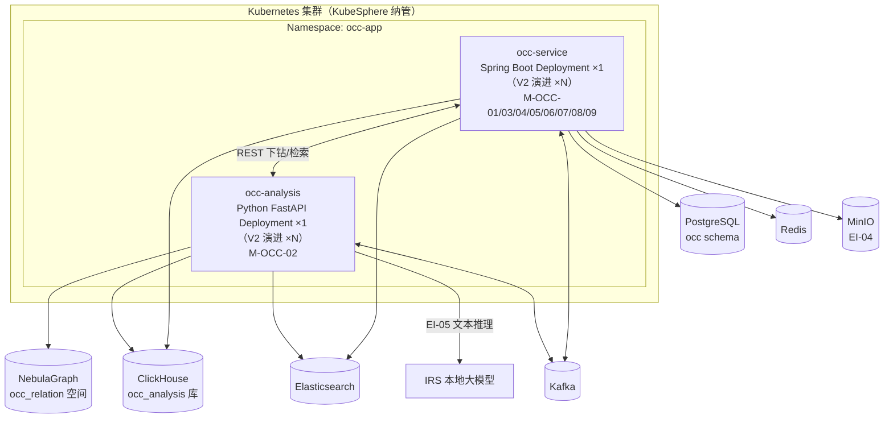
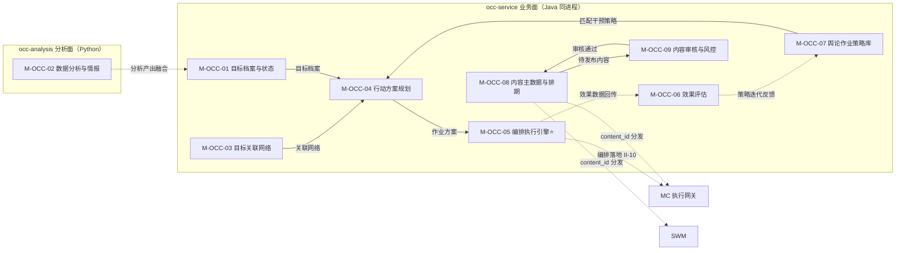
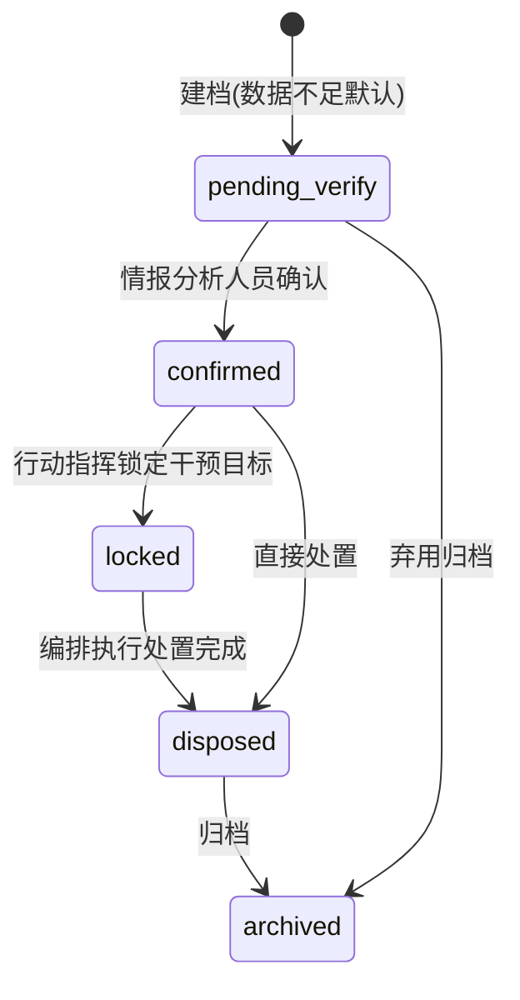
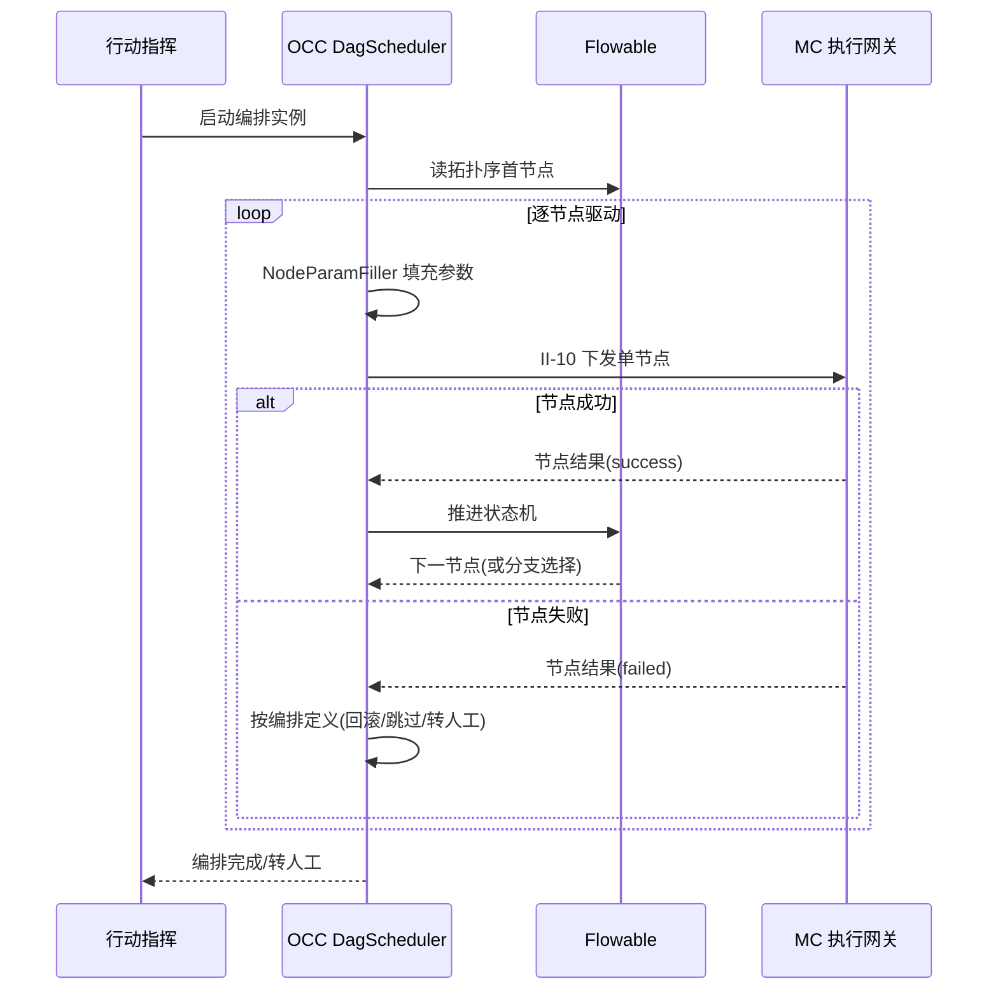
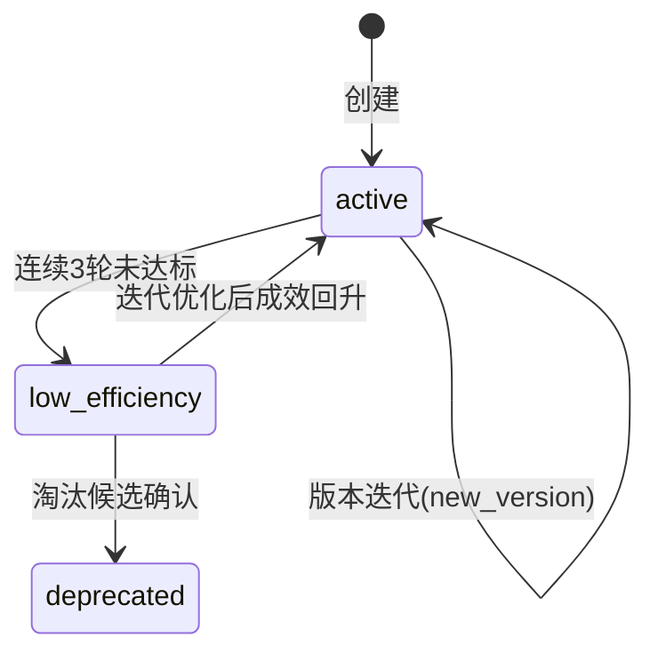

# 软件详细设计说明 - OCC 子系统

| 项目 | 内容 |
| --- | --- |
| 项目名称 | 认知行动平台（v1.0） |
| 文档版本 | V1.1 |
| 密级 | 内部使用 |
| 编制 | 石建国 |
| 编制日期 | 2026-07-17 |

---

## 1 引言

### 1.1 标识

本文件为「认知行动平台」（以下简称"系统"或"平台"）舆情行动业务子系统（OCC，软部件标识 M-OCC-00）的软件详细设计说明（SDD）。它是《软件需求规格说明-OCC子系统》V3.9 功能需求 R-OCC-001 ~ R-OCC-009（共 9 项）与《软件概要设计说明》V2.6 模块 M-OCC-01 ~ M-OCC-09（共 9 模块 / 31 功能点）的详细设计下沉，描述 OCC 子系统各模块的内部结构、类与接口、数据结构、算法、状态机与部署单元，作为编码实现与单元测试的依据。

### 1.2 系统概述

舆情行动业务子系统（OCC）是系统的**行动指挥大脑与内容资源权威源**，构建「目标识别 → 数据分析与情报 → 行动编排 → 效果评估」行动闭环，并承担内容资源的统一管理（作为内容主数据唯一权威源，CON-11）。基于 DC 采集的原始舆情 / 传播数据（经 II-13）与 IRS 推理能力，在本子系统内完成数据分析与情报研判（V3.3 起由 DC 移入）。

OCC 承担四类职责：

1. **情报研判**：对 DC 采集与 ETL 加工的数据（经 II-13）分析，提供群体到个体下钻筛选（自研规则树 + 轻量评分模型）、关系图谱与图查询、实体检索与全维度档案、文本智能分析（调 IRS 文本模型 EI-05，不可用回退关键词）。分析产出供目标识别融合，并经 II-15 反向驱动 DC 情报回注（R-DC-007）。
2. **行动指挥**：识别舆情事件目标要素并建档为数据对象（目标档案 / 状态生命周期 / 多维信息融合 / 变更事件）；根据目标档案的干预切入点匹配策略、生成作业方案；以 Flowable BPMN 将作业方案编排为执行流程（DAG），逐节点下发 MC 统一执行网关落地（CON-07 动作收口），OCC 持编排图状态、可中途改编排或转人工。
3. **效果闭环**：基于 DC 舆情差值与 MC 作业执行数据（不重复采集，经 occ_analysis 分析仓聚合）完成单轮成效统计、舆论走势修正、策略迭代反馈、作业复盘与中短期 / 长期效果评估，反馈策略库迭代优化。
4. **内容资源权威源**：唯一维护内容主数据（素材入库 / 分类 / 审核 / 发布排期），向 SWM / MC 主动分发 `content_id`；使用方只维护平台适配版本等扩展数据并引用标识，变更经 `content.changed`（II-12a）事件通知（CON-11 权威源唯一）。

OCC 采用「**一 Java 业务微服务（occ-service）+ 一 Python 分析面（occ-analysis）**」双边界形态：

- **occ-service**：Java / Spring Boot 单一微服务，承载 M-OCC-01 / 03 / 04 / 05 / 06 / 07 / 08 / 09 八个业务模块（同进程 Java 包划分，遵循全平台"一子系统一微服务、内部不拆分"原则，与 OM / COM 一致）。承担目标档案、关联网络、方案规划、编排执行引擎、效果评估、策略库、内容主数据与审核等全部业务逻辑。
- **occ-analysis**：Python 服务，承载 M-OCC-02 数据分析与情报（V3.3 由 DC 移入，与其母体 DC 同属 Python 采集 / 分析域）。承担群体下钻（规则树 + sklearn 评分模型）、关系图谱与图查询编排、实体检索与档案装配、文本智能分析（调 IRS）。与 occ-service 经 REST（下钻 / 检索请求）与 Kafka（II-13 流入 / II-15 回注）解耦。

> 拆分依据：统一技术栈原则第 7 条「管控 / 业务微服务统一用 Java；数据采集与分析用 Python」。M-OCC-02 带硬指标（召回率 ≥ 70%、准确率 ≥ 80%、F1 ≥ 0.75）与 ML 设施（sklearn），属分析域而非业务管控域，故 Python 单独承载，与 MC（mc-service + agent-runtime + mc-sfu）、SWM（coze-loop + Java 主服务）异构先例一致。

OCC 子系统由 9 个模块组成（共 31 功能点）：

| 模块 | 标识 | 对应需求 | 功能点数 | 承载 |
| --- | --- | --- | --- | --- |
| 目标档案与状态管理 | M-OCC-01 | R-OCC-001 | 5 | occ-service |
| 数据分析与情报 | M-OCC-02 | R-OCC-002~005 | 4 | occ-analysis |
| 目标关联网络 | M-OCC-03 | R-OCC-001 | 2 | occ-service |
| 行动方案规划 | M-OCC-04 | R-OCC-006 | 2 | occ-service |
| 编排执行引擎 | M-OCC-05 | R-OCC-006 | 3 | occ-service |
| 效果评估 | M-OCC-06 | R-OCC-007 | 5 | occ-service |
| 舆论作业策略库 | M-OCC-07 | R-OCC-008 | 4 | occ-service |
| 内容主数据与排期（权威源） | M-OCC-08 | R-OCC-009 | 4 | occ-service |
| 内容审核与敏感词风控 | M-OCC-09 | R-OCC-009 | 2 | occ-service |

### 1.3 文档概述

本文件章节安排如下：第 2 章引用文件；第 3 章总体设计，给出 OCC 技术栈、部署单元、模块间调用关系与数据流；第 4 章数据结构设计，给出核心数据模型与存储表结构（PostgreSQL `occ` schema、ClickHouse `occ_analysis` 库、NebulaGraph `occ_relation` 空间、Redis、Kafka）；第 5 章按部署承载分两域（occ-service 业务面 / occ-analysis 分析面）给出各模块详细设计（类 / 接口 / 算法 / 状态机）；第 6 章接口详细设计；第 7 章错误处理与可靠性设计；第 8 章部署与运维设计；第 9 章需求追溯（概要引用）；第 10 章待后续补充事项。

### 1.4 术语和缩略语

沿用《软件需求规格说明-总册》第 1.4 节术语与缩略语，本文件补充以下技术术语：

| 术语 | 说明 |
| --- | --- |
| 行动闭环 | 「目标识别 → 数据分析与情报 → 行动编排 → 效果评估 → 策略迭代」的循环链路，OCC 是其指挥大脑 |
| 目标档案 | 识别出的舆情事件目标要素建档为一条数据对象（含事件主体、传播源头、核心争议点、干预目标、传播线索、多维画像、切入点与薄弱点），赋予全局唯一 `target_id` |
| 目标状态生命周期 | 目标数据的五态流转：待核实 / 已确认 / 已锁定 / 已处置 / 已归档 |
| 编排流程（图） | 行动作业方案编排成的 DAG，节点为 MC 智能体节点（来源 R-MC-014）与自动化脚本节点，按内容 / 账号 / 时间 / 节奏组织前后序、并行与分支关系 |
| 逐步驱动 | II-10 交互模式：OCC 持编排图状态，调度器按拓扑序逐节点下发 MC 网关 → MC 执行回传 → OCC 推进状态机选下一节点；OCC 可中途改编排或转人工 |
| 评分模型 | M-OCC-02 群体下钻中，对分层规则树过滤后的候选个体用 scikit-learn 轻量分类器（如逻辑回归）打分排序，召回率 / 准确率由 occ-analysis 自控可测 |
| occ_analysis | OCC 独立 ClickHouse 库（复用集群），存经 II-13 抽取的 DC 舆情明细与 MC 作业成效，供效果评估 OLAP 聚合（不重复采集） |
| occ_relation | OCC 独立 NebulaGraph 图空间，存目标关联网络；DC 采集关系数据经 II-13 导入为原料 |
| 权威源 | 平台级主数据的唯一维护方，使用方仅引用标识不复制主数据（CON-11）；账号主数据由 MC 唯一维护，内容主数据由 OCC 唯一维护 |
| 抓手 | 干预切入点与传播薄弱点的统称（本期自动挖掘暂不实现，由人工录入融合进目标档案） |

---

## 2 引用文件

| 文件 | 说明 |
| --- | --- |
| 《软件需求规格说明-OCC子系统》V3.9 | OCC 功能需求 R-OCC-001 ~ R-OCC-009、非功能需求、外部接口 EI-04/05、内部接口 II-01/01a/10/12/12a/13/15 的直接输入 |
| 《软件概要设计说明》V2.6 | OCC 模块划分 M-OCC-01 ~ M-OCC-09（§4.7）、§5 接口设计、§6 数据清单（DR-03M 内容主数据 / 03E 扩展数据 / 11 舆情行动数据归 OCC）、约束 CON-04/06/07/11/13 |
| 《软件概要设计-架构图.md》V1.4 | OCC 模块架构图与模块内功能架构图（§4），31 功能点权威依据 |
| 《软件概要设计-模块功能拆分-v2.xlsx》 | OCC 9 模块 31 功能点的权威依据 |
| 《软件需求跟踪矩阵.xlsx》 | OCC 需求双向追溯唯一权威源 |
| 《软件详细设计说明-MC子系统.md》V1.0 | II-10 行动编排下发与效果回传对端契约（MC 侧 R-MC-005 执行网关收口）、`mc_analysis` 独立库模式参照、动作收口（CON-07）对端实现 |
| 《软件详细设计说明-DC子系统.md》V1.2 | II-13 / II-15 数据契约（DC 侧 ClickHouse `crawl_raw` + NebulaGraph `dc_relation` 经 REST 供 OCC）、复用 PostgreSQL/Redis/Kafka/ClickHouse/MinIO 实例约定 |
| 《软件详细设计说明-SWM子系统.md》V1.0 | II-12 内容服务调用方（SWM 养号文案）、coze-loop 异构集成模式参照 |
| 《软件详细设计说明-OM子系统.md》V1.0 | II-04 日志上报 OM、Java/Spring Boot 同栈微服务形态与四段式模块设计模式参照 |
| 《软件详细设计说明-COM子系统.md》V1.0 | com-auth-lib 本地验签 + org_id 注入鉴权约定参照 |

---

## 3 总体设计

### 3.1 技术选型

OCC 子系统技术栈遵循全平台「**管控 / 业务微服务统一 Java（Spring Boot）；数据采集与分析用 Python；两者经 Kafka/REST 解耦**」原则。occ-service 为 Java / Spring Boot 栈（与 OM / COM / MC mc-service 一致）；occ-analysis 为 Python 栈（与 DC / 其母体一致）。

| 维度 | 选型 | 说明 |
| --- | --- | --- |
| 业务微服务语言 / 框架 | **Java 17 + Spring Boot 3.x** | occ-service 单一微服务，M-OCC-01/03/04/05/06/07/08/09 八模块同进程 Java 包；Spring Security + com-auth-lib 鉴权 |
| 分析面语言 / 框架 | **Python 3.11 + FastAPI** | occ-analysis 单一服务，承载 M-OCC-02；scikit-learn 评分模型、Nebula-Python 图客户端 |
| 工作流引擎 | **Flowable（嵌入式 BPMN）** | M-OCC-05 编排执行引擎，BPMN 流程定义建模 DAG，获成熟状态机 / 网关 / 回退 / 超时；适配层落地 MC 网关 |
| 全文检索 | **Elasticsearch** | M-OCC-02 实体检索（按账号 / 昵称 / 标识检索），检索超时降级返回部分结果 |
| 微服务治理 | **KubeSphere 微服务治理**（Spring Cloud Kubernetes） | 服务注册 / 发现 / 配置复用 KubeSphere，不另起注册中心，与 OM / COM / MC 一致 |
| 元数据库 | **PostgreSQL**（复用 DC 实例，独立 schema `occ`） | 目标档案、关联关系元数据、编排流程定义与实例、策略库、内容主数据、效果评估结果（OLTP 事务） |
| 关系图谱 | **NebulaGraph**（复用集群，独立图空间 `occ_relation`） | 目标关联网络（目标 - 目标关联、关联拓扑、情报标签）；DC 采集关系经 II-13 导入为原料 |
| 分析数据仓 | **ClickHouse**（复用集群，独立库 `occ_analysis`） | 经 II-13 抽取的 DC 舆情明细 + MC 作业成效同步入库，供效果评估 OLAP 聚合（完成率 / 触达 / 互动 / 立场偏移） |
| 缓存与队列 | **Redis**（复用 DC 实例，Key 前缀 `occ:`） | 编排调度队列、内容素材签名 URL 缓存、策略库热点缓存、分布式锁 |
| 业务数据总线 | **Kafka**（复用 DC 集群，topic 前缀 `occ-`） | II-01a 账号状态变更订阅、II-12a content.changed 广播、II-13 数据流入（DC 推送 / OCC 拉取触发）、II-15 情报回注、II-04 日志上报 OM |
| 对象存储 | **MinIO（EI-04）** | 内容素材（图片 / 视频 / 文案）存储，签名 URL 分发 |
| 容器编排 | **Kubernetes（KubeSphere 纳管）** | occ-service / occ-analysis Pod 化部署 |

> PostgreSQL / Redis / Kafka / ClickHouse / MinIO / NebulaGraph 由 DC 部署或为 KubeSphere 基础设施，OCC 仅消费（独立 schema `occ`、独立 ClickHouse 库 `occ_analysis`、独立 NebulaGraph 空间 `occ_relation`、独立 Redis Key 前缀 `occ:`、独立 Kafka topic 前缀 `occ-`）。

### 3.2 部署单元

OCC 部署为「**一 Java 业务微服务 + 一 Python 分析面**」双边界。当前版本 occ-service **单副本**、occ-analysis **单副本**（V2 演进多副本 HA，对应 NR-R-01 的 V2 目标）。



各部署单元职责：

| 部署单元 | 语言 / 形态 | 副本 | 承载模块 | 职责 |
| --- | --- | --- | --- | --- |
| occ-service | Java / Spring Boot 单一微服务（8 模块同进程 Java 包） | ×1（V2 演进 ×N） | M-OCC-01/03/04/05/06/07/08/09 | 业务逻辑：目标档案、关联网络、方案规划、编排引擎（Flowable）、效果评估、策略库、内容主数据与审核 |
| occ-analysis | Python / FastAPI 单一服务 | ×1（V2 演进 ×N） | M-OCC-02 | 数据分析与情报：群体下钻（规则树 + sklearn）、关系图谱与图查询编排、实体检索与档案装配、文本智能分析（调 IRS） |

### 3.3 模块间调用关系

OCC 内部分双部署承载两类协作关系。occ-service 内 8 模块同进程调用；occ-service 与 occ-analysis 跨进程经 REST / Kafka。



**四类协作关系**：

1. **情报研判流**：occ-analysis M-OCC-02 消费 II-13 数据 → 分析产出（目标个体 / 关联实体 / 传播节点 / 文本标签）→ 经 REST 回写融合进 occ-service M-OCC-01 目标档案（M-OCC-01 F-OCC-01-04 多维信息融合）→ 并经 II-15 回注 DC 任务池。
2. **行动指挥流（核心）**：M-OCC-01（目标档案）+ M-OCC-03（关联网络）+ M-OCC-07（匹配策略）→ M-OCC-04（生成作业方案）→ M-OCC-05（编排执行引擎，Flowable BPMN 建模 DAG）→ II-10 逐节点下发 MC 执行网关（CON-07 收口）。
3. **效果闭环流**：M-MC-10 效果数据经 II-10 回传 → M-OCC-06（occ_analysis 仓聚合评估）→ 策略迭代反馈 → M-OCC-07 策略库状态机推进（连续 3 轮未达标 → low_efficiency → 淘汰候选）。
4. **内容管理流（权威源）**：M-OCC-08（入库 / 分类 / 排期 / 主数据）→ M-OCC-09（审核与敏感词）→ 审核通过回 M-OCC-08 → content.changed（II-12a）广播 → SWM / MC 引用 content_id。

### 3.4 数据流设计

OCC 数据流分五类：

1. **情报输入与研判流**：DC 采集 + ETL 加工数据经 II-13（REST，DC 代查 ClickHouse `crawl_raw` + NebulaGraph `dc_relation`）→ occ-analysis M-OCC-02 分析（下钻 / 图谱 / 检索 / 文本）→ 产出经 REST 回写 M-OCC-01 融合目标档案；高价值目标 / 关联实体经 II-15 回注 DC 任务池（R-DC-007），构成「OCC 分析 → DC 采集」反向驱动闭环。
2. **行动编排流（核心）**：目标档案 + 关联网络 + 策略匹配 → 作业方案 → Flowable BPMN 编排为 DAG → II-10 逐步驱动（OCC 持编排图状态，调度器逐节点下发 → MC 网关执行 → 回传节点结果 → OCC 推进状态机选下一节点，可中途改编排 / 转人工）→ 落地动作经 MC 统一执行网关收口（CON-07）。
3. **效果评估流**：DC 舆情差值（经 II-13 抽取入 occ_analysis）+ MC 作业成效（经 II-10 回传同步入 occ_analysis）→ M-OCC-06 SQL 聚合 + 定时批计算（触达率 / 互动率 / 立场情感偏移 / 走势修正）→ 评估结果写 occ PostgreSQL → 策略迭代反馈 M-OCC-07。
4. **内容权威流**：内容运营上传素材 → MinIO（EI-04）存储 + occ PostgreSQL 记主数据 → M-OCC-09 审核与敏感词检测 → 审核通过发布排期 → content.changed（II-12a）广播 → SWM / MC 经 II-12 REST 引用 content_id + 签名 URL，各自维护平台适配版本（DR-03E）。
5. **账号事件流**：MC 账号状态变更经 II-01a（Kafka）→ OCC 订阅响应（被封账号「移除目标」/ 停止编排引用）；OCC 各模块经 II-01 查询 account_id 主数据（使用方，不复制）。

---

## 4 数据结构设计

OCC 数据按存储介质分层：元数据（PostgreSQL `occ` schema）、分析仓（ClickHouse `occ_analysis` 库）、关系图谱（NebulaGraph `occ_relation` 空间）、缓存与队列（Redis）、消息总线（Kafka）、对象存储（MinIO）。各存储归属模块与 DR 编号对照见《概要设计》§6.2（DR-03M 内容主数据 / 03E 扩展数据 / 11 舆情行动数据归 OCC）。

### 4.1 元数据库（PostgreSQL `occ` schema）

#### 4.1.1 目标档案表 `occ_target`（M-OCC-01，DR-11，★ 核心实体）

```sql
CREATE TABLE occ.occ_target (
    target_id       UUID PRIMARY KEY,
    target_name     VARCHAR(256) NOT NULL,              -- 目标名称/事件主体
    event_subject   TEXT,                               -- 事件主体
    spread_source   TEXT,                               -- 传播源头
    core_dispute    TEXT,                               -- 核心争议点
    intervention_obj TEXT,                              -- 干预目标对象
    spread_clue     JSONB,                              -- 传播线索(链路)
    profile_attrs   JSONB,                              -- 多维画像属性(融合M-OCC-02产出)
    entry_point     TEXT,                               -- 干预切入点(本期人工录入)
    weak_point      TEXT,                               -- 薄弱点(本期人工录入)
    status          VARCHAR(16) NOT NULL,               -- 目标状态(五态): pending_verify/confirmed/locked/disposed/archived
    org_id          UUID NOT NULL,                      -- 所属组织(COM数据隔离)
    created_by      UUID,                               -- 创建人(情报分析人员)
    created_at      TIMESTAMPTZ NOT NULL DEFAULT now(),
    updated_at      TIMESTAMPTZ NOT NULL DEFAULT now()
);
CREATE INDEX idx_occ_target_status ON occ.occ_target(status);
CREATE INDEX idx_occ_target_org ON occ.occ_target(org_id);
```

> 目标「即数据对象」：每条建档为一条记录，赋予全局唯一 `target_id`，属性可增改删，状态可流转，变更经事件总线广播 `target.changed`（F-OCC-01-05）。

#### 4.1.2 目标关联关系表 `occ_target_relation`（M-OCC-03，DR-11）

```sql
CREATE TABLE occ.occ_target_relation (
    relation_id   UUID PRIMARY KEY,
    src_target_id UUID NOT NULL REFERENCES occ.occ_target(target_id),
    dst_target_id UUID NOT NULL REFERENCES occ.occ_target(target_id),
    relation_type VARCHAR(32) NOT NULL,                 -- 关联类型(同源/转发/提及/组织关联...)
    confidence    REAL,                                 -- 置信度
    broken        BOOLEAN NOT NULL DEFAULT false,       -- 关联断裂标注断点
    org_id        UUID NOT NULL,
    created_at    TIMESTAMPTZ NOT NULL DEFAULT now()
);
CREATE INDEX idx_occ_target_relation_src ON occ.occ_target_relation(src_target_id);
CREATE INDEX idx_occ_target_relation_dst ON occ.occ_target_relation(dst_target_id);
```

> 关系网络的图结构同步落 NebulaGraph `occ_relation` 空间供图查询；本表为关系元数据与断裂标注的关系型镜像。

#### 4.1.3 编排流程定义表 `occ_proc_def` 与实例表 `occ_proc_inst`（M-OCC-05，DR-11）

```sql
-- Flowable BPMN 流程定义(OCC侧登记,与Flowable ACT_RE_*表对应)
CREATE TABLE occ.occ_proc_def (
    proc_def_id    UUID PRIMARY KEY,
    proc_key       VARCHAR(128) NOT NULL,               -- BPMN process key
    plan_id        UUID,                                -- 来源作业方案(M-OCC-04)
    target_id      UUID REFERENCES occ.occ_target(target_id),
    bpmn_xml       TEXT NOT NULL,                       -- BPMN XML(智能体节点+脚本节点DAG)
    version        INT NOT NULL,
    org_id         UUID NOT NULL,
    created_at     TIMESTAMPTZ NOT NULL DEFAULT now()
);

-- 编排实例(OCC持编排图状态,逐步驱动)
CREATE TABLE occ.occ_proc_inst (
    proc_inst_id   UUID PRIMARY KEY,
    proc_def_id    UUID NOT NULL REFERENCES occ.occ_proc_def(proc_def_id),
    flowable_inst_id VARCHAR(64),                       -- Flowable ACT_RU_EXECUTION对应
    status         VARCHAR(16) NOT NULL,                -- running/paused/completed/rolled_back/manual
    current_node   VARCHAR(64),                         -- 当前节点(拓扑序推进)
    org_id         UUID NOT NULL,
    created_at     TIMESTAMPTZ NOT NULL DEFAULT now(),
    updated_at     TIMESTAMPTZ NOT NULL DEFAULT now()
);
CREATE INDEX idx_occ_proc_inst_status ON occ.occ_proc_inst(status);
```

#### 4.1.4 效果评估结果表 `occ_eval_result`（M-OCC-06，DR-11）

```sql
CREATE TABLE occ.occ_eval_result (
    eval_id         UUID PRIMARY KEY,
    proc_inst_id    UUID REFERENCES occ.occ_proc_inst(proc_inst_id),
    target_id       UUID REFERENCES occ.occ_target(target_id),
    eval_type       VARCHAR(32) NOT NULL,               -- single_round/trend_correct/strategy_feedback/review/mid_short/long_term
    reach_rate      REAL,                               -- 触达率(DC干预前后差值)
    interact_rate   REAL,                               -- 互动率
    stance_shift    REAL,                               -- 立场/情感正向偏移量
    trend_deviation REAL,                               -- 走势修正偏差(人工复核一致率≥80%达标)
    summary         JSONB,                              -- 成效统计/复盘报告结构化摘要
    eval_period     DATERANGE,                          -- 评估周期
    org_id          UUID NOT NULL,
    created_at      TIMESTAMPTZ NOT NULL DEFAULT now()
);
CREATE INDEX idx_occ_eval_target ON occ.occ_eval_result(target_id, eval_type);
```

#### 4.1.5 策略库表 `occ_strategy` 与版本表 `occ_strategy_version`（M-OCC-07，DR-11）

```sql
-- 策略主表
CREATE TABLE occ.occ_strategy (
    strategy_id   UUID PRIMARY KEY,
    name          VARCHAR(128) NOT NULL,
    languages     VARCHAR(64)[] NOT NULL,               -- 多语种
    scenarios     VARCHAR(64)[] NOT NULL,               -- 多场景
    styles        VARCHAR(64)[] NOT NULL,               -- 多风格
    current_ver   INT NOT NULL,                         -- 当前生效版本号
    status        VARCHAR(16) NOT NULL,                 -- active/low_efficiency/deprecated
    fail_streak   INT NOT NULL DEFAULT 0,               -- 连续未达标轮次(达3轮→low_efficiency)
    org_id        UUID NOT NULL,
    created_at    TIMESTAMPTZ NOT NULL DEFAULT now(),
    updated_at    TIMESTAMPTZ NOT NULL DEFAULT now()
);
CREATE INDEX idx_occ_strategy_status ON occ.occ_strategy(status);

-- 策略版本表(版本控制)
CREATE TABLE occ.occ_strategy_version (
    strategy_id   UUID NOT NULL REFERENCES occ.occ_strategy(strategy_id),
    version       INT NOT NULL,
    definition    JSONB NOT NULL,                       -- 策略定义(适用条件/内容模板/节奏)
    change_log    TEXT,                                 -- 迭代变更说明
    created_by    UUID,
    created_at    TIMESTAMPTZ NOT NULL DEFAULT now(),
    PRIMARY KEY (strategy_id, version)
);
```

#### 4.1.6 内容主数据表 `occ_content` 与排期表 `occ_content_schedule`（M-OCC-08，DR-03M，★ 权威源）

```sql
-- 内容主数据(权威源)
CREATE TABLE occ.occ_content (
    content_id    UUID PRIMARY KEY,
    content_type  VARCHAR(16) NOT NULL,                 -- image/video/text
    object_key    VARCHAR(256) NOT NULL,                -- MinIO对象键(EI-04)
    title         VARCHAR(256),
    tags          VARCHAR(64)[],                        -- 素材标签
    platforms     VARCHAR(64)[],                        -- 平台分类与账号适配
    audit_status  VARCHAR(16) NOT NULL,                 -- draft/pending_review/approved/rejected
    source        VARCHAR(64),                          -- 来源
    org_id        UUID NOT NULL,
    created_by    UUID,
    created_at    TIMESTAMPTZ NOT NULL DEFAULT now(),
    updated_at    TIMESTAMPTZ NOT NULL DEFAULT now()
);
CREATE INDEX idx_occ_content_audit ON occ.occ_content(audit_status);
CREATE INDEX idx_occ_content_org ON occ.occ_content(org_id);

-- 发布排期
CREATE TABLE occ.occ_content_schedule (
    schedule_id   UUID PRIMARY KEY,
    content_id    UUID NOT NULL REFERENCES occ.occ_content(content_id),
    account_id    UUID,                                 -- 关联账号(引用MC account_id)
    scheduled_at  TIMESTAMPTZ NOT NULL,                 -- 定时发布时间
    status        VARCHAR(16) NOT NULL,                 -- pending/published/conflict
    org_id        UUID NOT NULL,
    created_at    TIMESTAMPTZ NOT NULL DEFAULT now()
);
CREATE INDEX idx_occ_sched_time ON occ.occ_content_schedule(scheduled_at, status);
```

#### 4.1.7 敏感词库表 `occ_sensitive_word`（M-OCC-09）

```sql
CREATE TABLE occ.occ_sensitive_word (
    word_id     UUID PRIMARY KEY,
    word        VARCHAR(128) NOT NULL,
    category    VARCHAR(32),                             -- 政治/色情/暴恐/广告...
    action      VARCHAR(16) NOT NULL,                   -- block/review(命中拦截或转人工复核)
    org_id      UUID NOT NULL,
    created_at  TIMESTAMPTZ NOT NULL DEFAULT now(),
    UNIQUE(word, org_id)
);
```

### 4.2 分析数据仓（ClickHouse `occ_analysis` 库）

OCC 独立 ClickHouse 库（复用集群，与 DC `crawl_raw` / MC `mc_analysis` 同集群不同库），存经 II-13 抽取的 DC 舆情明细与 MC 作业成效同步数据，供效果评估 OLAP 聚合。**不重复采集**原始数据，仅做抽取入仓供分析。

```sql
-- 舆情明细(从DC经II-13抽取入库,供立场/情感差值与走势分析)
CREATE TABLE occ_analysis.occ_sentiment_detail (
    event_id      String,
    platform      LowCardinality(String),
    account_id    String,
    content_id    String,
    stance        LowCardinality(String),               -- 立场(干预前后差值量化)
    sentiment     Float32,                              -- 情感值
    fetched_at    DateTime64(3),
    ingest_batch  String
) ENGINE = MergeTree()
PARTITION BY (platform, toYYYYMM(fetched_at))
ORDER BY (event_id, account_id, fetched_at)
TTL fetched_at + INTERVAL 18 MONTH;

-- 作业成效(从MC mc_analysis同步入库,供触达率/互动率聚合)
CREATE TABLE occ_analysis.occ_op_effect (
    stat_date     Date,
    proc_inst_id  String,
    org_id        UUID,
    task_type     String,
    content_total UInt32,                               -- 投放内容总数(触达率分母)
    content_reach UInt32,                               -- 触达数(分子)
    interact_total UInt32,                              -- 互动基数(互动率分母)
    interact_done  UInt32                               -- 互动完成数(分子)
) ENGINE = SummingMergeTree()
PARTITION BY toYYYYMM(stat_date)
ORDER BY (stat_date, proc_inst_id, org_id);
```

### 4.3 关系图谱（NebulaGraph `occ_relation` 空间）

OCC 独立图空间（复用集群，与 DC `dc_relation` 同集群不同空间），存目标关联网络。DC 采集关系数据经 II-13 导入为原料，OCC 在其上建模目标关联网络。

```ngql
-- 目标顶点(对应occ_target)
CREATE TAG occ_relation.target(
    target_id string,
    target_name string,
    status string
);

-- 目标关联边(对应occ_target_relation)
CREATE EDGE occ_relation.related(
    relation_type string,
    confidence double,
    broken bool
);
```

> DC 的 `dc_relation` 空间存采集原始关系（关注 / 粉丝 / 互动 / 转发边），为「原料」；OCC 的 `occ_relation` 存目标关联网络（分析建模产物），职责清晰分离。

### 4.4 缓存与队列（Redis）

| Redis Key 模式 | 类型 | 用途 | TTL |
| --- | --- | --- | --- |
| `occ:target:{target_id}` | String | 目标档案热点缓存 | 10min |
| `occ:strategy:active` | ZSet | 生效策略集（按语种 / 场景排序） | 30min |
| `occ:content:url:{content_id}` | String | 内容素材签名 URL 缓存（II-12 返回） | 与签名有效期对齐 |
| `occ:proc:sched:queue` | ZSet | 编排调度队列（逐步驱动待下发节点） | 持久 |
| `occ:lock:{resource}` | String | 分布式锁（目标档案并发修改 / 策略迭代） | 30s |

### 4.5 消息总线（Kafka）

| Topic | 方向 | 内容 | 生产方 | 消费方 |
| --- | --- | --- | --- | --- |
| `occ-target-changed` | 出 | `target.changed` 事件（目标建档 / 属性修改 / 状态流转） | occ-service（M-OCC-01） | 行动编排 / 效果评估订阅 |
| `occ-content-changed` | 出 | `content.changed` 事件（II-12a，内容新增 / 审核状态变更） | occ-service（M-OCC-08） | SWM / MC |
| `occ-intel-feedback` | 出 | II-15 情报回注（目标个体 / 关联实体 / 传播节点 → DC 任务池） | occ-analysis（M-OCC-02） | DC（R-DC-007） |
| `occ-account-status` | 入 | II-01a 账号状态变更（订阅 MC） | MC | occ-service（被封账号移除目标） |
| `occ-data-inflow` | 入 | II-13 数据流入触发（DC 推送通知 / OCC 拉取） | DC | occ-analysis（M-OCC-02） |
| `occ-eval-effect` | 入 | II-10 MC 作业成效回传 | MC（M-MC-10） | occ-service（M-OCC-06 入 occ_analysis） |

### 4.6 对象存储（MinIO / EI-04）

| 对象键前缀 | 用途 | 归属模块 |
| --- | --- | --- |
| `occ/content/{content_id}/` | 内容素材原文件（图片 / 视频 / 文案） | M-OCC-08 |
| `occ/eval/report/{eval_id}/` | 评估复盘报告附件 | M-OCC-06 |

---

## 5 模块详细设计

OCC §5 按部署承载分两域：**5.1 occ-service 业务面**（Java / Spring Boot 同进程，承载 M-OCC-01/03/04/05/06/07/08/09 八模块）；**5.2 occ-analysis 分析面**（Python / FastAPI，承载 M-OCC-02）。每域给域概述，域内各模块按四段式（职责 → 类图 → 关键类说明 → 设计要点，按需附状态机 / 算法 / 时序）展开。

### 5.1 occ-service 业务面

occ-service 为 Java 17 / Spring Boot 3.x 单一微服务，八模块为同进程内 Java 包。鉴权统一经 com-auth-lib 本地验签 + `org_id` 行级隔离（NR-S-01 / NR-C-01），与 OM / COM / MC mc-service 同栈。八模块覆盖行动指挥流（目标档案 → 方案规划 → 编排引擎）、效果闭环流（评估 → 策略迭代）、内容管理流（主数据 → 审核）三类业务逻辑。

#### 5.1.1 M-OCC-01 目标档案与状态管理（R-OCC-001，5 功能点）

**职责**：识别舆情事件目标要素并建档为数据对象，支持建档（`target_id`）、属性增改删、状态生命周期流转、多维信息融合（融合 M-OCC-02 分析产出）、变更事件广播。本期以人工识别录入为主，系统提供数据维护支撑。

**类图**：

```mermaid
classDiagram
    class TargetProfileService {
        +create(req) target_id            %% 建档赋target_id
        +update(target_id, patch)         %% 属性增改删
        +delete(target_id)
        +merge_intel(target_id, intel)    %% 多维信息融合(M-OCC-02产出)
    }
    class TargetStateMachine {
        +transit(target_id, to_status)    %% 五态流转
        +check_lock(target_id) bool       %% 修改冲突加锁
    }
    class TargetEventPublisher {
        +publish_changed(target_id, op)   %% 广播target.changed
    }
    class TargetRepo {
        +save(t Target)
        +get(target_id) Target
        +lock(target_id)
    }
    class TargetProfileService ..> TargetRepo : 档案存库
    class TargetProfileService ..> TargetStateMachine : 状态流转
    class TargetProfileService ..> TargetEventPublisher : 变更广播
```

**关键类说明**：
- **TargetProfileService**：目标档案门面。情报分析人员录入 → 建档赋 `target_id`（F-OCC-01-01）；属性支持新增 / 修改 / 删除（F-OCC-01-02）；`merge_intel()` 融合 occ-analysis M-OCC-02 回写的分析产出（目标个体 / 传播线索 / 多维画像属性，F-OCC-01-04）。
- **TargetStateMachine**：目标状态生命周期（五态，F-OCC-01-03）。属性修改冲突时加锁或转人工裁定。
- **TargetEventPublisher**：变更经 Kafka `occ-target-changed` 广播 `target.changed`（F-OCC-01-05），行动编排 / 效果评估订阅响应。

**目标状态机（F-OCC-01-03，五态）**：



**设计要点**：目标「即数据对象」，非只读识别结果；识别数据不足时建档为 `pending_verify`（待核实）；关联断裂由 M-OCC-03 标注断点；广播失败重试。本期人工识别为主，系统负责存储 / 关联 / 状态 / 通知。

#### 5.1.2 M-OCC-03 目标关联网络（R-OCC-001，2 功能点）

**职责**：目标之间建立关联关系，形成目标关系网络，支持关系网络查询（关联断裂标注断点）。

**类图**：

```mermaid
classDiagram
    class RelationNetworkService {
        +add_relation(src, dst, type) relation_id   %% 目标关联关系建模
        +mark_broken(relation_id)                   %% 关联断裂标注断点
    }
    class GraphQueryService {
        +query_topology(target_id, depth) Network  %% 关系网络查询
        +query_with_labels(target_id) LabeledGraph %% 关联拓扑与情报标签
    }
    class RelationGraphClient {
        +upsert_vertex(target)
        +upsert_edge(src, dst, rel)
        +subgraph(target_id, depth)
    }
    class RelationRepo {
        +save(r Relation)
    }
    class RelationNetworkService ..> RelationGraphClient : 图空间写occ_relation
    class RelationNetworkService ..> RelationRepo : 关系元数据存occ_target_relation
    class GraphQueryService ..> RelationGraphClient : 图查询
```

**关键类说明**：
- **RelationNetworkService**：目标关联关系建模（F-OCC-03-01）。关联关系同步写 NebulaGraph `occ_relation`（图结构）与 `occ_target_relation`（关系型镜像，含断裂标注）。
- **GraphQueryService**：关系网络查询（F-OCC-03-02）。基于实体与关联数据绘制关系图谱，输出关联拓扑与情报标签形成关联网络；查询数据量过大时分页或限流（R-OCC-003 验收）。
- **RelationGraphClient**：Nebula-Python / Java 图客户端封装，操作 `occ_relation` 空间（目标顶点 + related 边）。

**设计要点**：原料数据来源 DC `dc_relation` 经 II-13 导入；OCC `occ_relation` 是分析建模产物，与 DC 原始关系职责分离。关联断裂时 `broken=true` 标注断点（R-OCC-001 异常场景）。

#### 5.1.3 M-OCC-04 行动方案规划（R-OCC-006，2 功能点）

**职责**：根据目标档案中的干预切入点匹配干预策略、生成具体作业方案（内容 / 账号 / 时间 / 节奏）。本期以人工匹配为主，系统提供方案生成支撑。

**类图**：

```mermaid
classDiagram
    class StrategyMatcher {
        +match(target_id) list~Strategy~   %% 干预策略匹配(按切入点)
        +manual_select(target_id, sid)     %% 人工选择(本期主路径)
    }
    class PlanGenerator {
        +generate(target_id, strategy) plan_id  %% 作业方案生成
    }
    class Plan {
        +plan_id
        +target_id
        +strategy_id
        +content_plan     %% 内容(引用content_id)
        +account_plan     %% 账号(引用account_id)
        +time_plan        %% 时间
        +rhythm_plan      %% 节奏
    }
    class StrategyMatcher ..> PlanGenerator : 生成方案
```

**关键类说明**：
- **StrategyMatcher**：干预策略匹配（F-OCC-04-01）。按目标档案 `entry_point`（干预切入点）从 M-OCC-07 策略库匹配；本期以人工匹配为主，匹配失败降级为人工选择（R-OCC-006 异常场景）。
- **PlanGenerator**：作业方案生成（F-OCC-04-02）。输出含内容（引用 `content_id`）、账号（引用 `account_id`）、时间、节奏的具体方案，供 M-OCC-05 编排为执行流程。

**设计要点**：方案只引用资源标识（`content_id` / `account_id`），不复制主数据（CON-11 权威源引用原则）；方案产出后交 M-OCC-05 编排执行引擎。

#### 5.1.4 M-OCC-05 编排执行引擎（R-OCC-006，3 功能点，★ 核心）

**职责**：将作业方案编排为执行流程（DAG），以 MC 中智能体节点（来源 R-MC-014）与自动化脚本节点为编排实体，按内容 / 账号 / 时间 / 节奏组织节点间前后序、并行与分支关系；编排落地由 MC 统一执行网关收口（CON-07）；OCC 持编排图状态，逐步驱动、可中途改编排或转人工。节点类型后续可扩充。

**类图**：

```mermaid
classDiagram
    class OrchestrationEngine {
        +build_dag(plan_id) proc_def_id     %% 编排建模(BPMN DAG)
        +start(proc_def_id) proc_inst_id    %% 启动编排实例
        +adapt_node(node) McAction          %% BPMN节点→MC网关调用
    }
    class DagScheduler {
        +drive_next(proc_inst_id)           %% 逐步驱动:按拓扑序选下一节点
        +on_node_result(proc_inst_id, result)  %% MC回传→推进状态机
        +pause(proc_inst_id) / +resume(proc_inst_id)
        +rollback(proc_inst_id) / +to_manual(proc_inst_id)
    }
    class NodeParamFiller {
        +fill(node, plan) FilledNode        %% 节点参数填充(agent_id/通道/内容账号时间节奏)
    }
    class McGatewayClient {
        +submit_node(action) NodeResult     %% II-10逐节点下发MC网关
    }
    class FlowableAdapter {
        +deploy(bpmn_xml) proc_key          %% 嵌入式Flowable部署流程
        +runtime_info(inst_id) RuntimeInfo  %% 读Flowable运行时状态
    }
    class OrchestrationEngine ..> FlowableAdapter : BPMN建模与运行
    class OrchestrationEngine ..> NodeParamFiller : 参数填充
    class DagScheduler ..> McGatewayClient : II-10逐节点下发
    class DagScheduler ..> FlowableAdapter : 读运行时推进
```

**关键类说明**：
- **OrchestrationEngine**：编排建模（F-OCC-05-01）。将作业方案编排为 BPMN 流程（DAG），节点为智能体节点 + 脚本节点（节点类型后续可扩充）；`build_dag()` 生成 BPMN XML（含节点前后序 / 并行 / 分支关系）。
- **FlowableAdapter**：嵌入式 Flowable BPMN 引擎适配层。负责流程部署（`deploy`）与运行时状态读取（`runtime_info`）；BPMN 的成熟状态机 / 网关 / 回退 / 超时机制由 Flowable 提供，OCC 在其上做节点级适配。
- **NodeParamFiller**：节点参数填充（F-OCC-05-02）。为每个节点填充 `agent_id`（引用 MC 已持存智能体，R-MC-014）、通道（移动端 ADB / 无障碍，桌面端 CDP）、内容（`content_id`）、账号（`account_id`）、时间、节奏。
- **DagScheduler**：编排落地与执行跟踪（F-OCC-05-03）。**逐步驱动**模式：按拓扑序选下一节点 → 经 `McGatewayClient` II-10 下发 → MC 网关执行回传 → `on_node_result()` 推进状态机选下一节点（条件分支 / 并行合并）。支持暂停 / 恢复 / 回滚 / 转人工。
- **McGatewayClient**：II-10 节点级协议客户端，逐节点下发到 MC 统一执行网关（CON-07 收口）。

**逐步驱动时序（F-OCC-05-03）**：



**设计要点**：
- **逐步驱动（非整图下发）**：OCC 持编排图状态（`occ_proc_inst.status / current_node`），是真正的"指挥大脑"，可中途改编排或转人工；II-10 为节点级协议。
- **动作收口**：所有节点动作经 MC 统一执行网关落地（CON-07），认知行动账号养号 / 投放经移动端 ADB / 无障碍通道，爬虫账号相关经桌面端 CDP 通道。
- **智能体节点引用**：智能体节点对应的智能体定义由 SWM 编写同步至 MC 持存（R-MC-014，经 II-14），OCC 编排时引用 MC 中已持存的智能体，不自持存。
- **失败策略**：节点失败按编排定义回滚 / 跳过 / 转人工；落地失败回滚并告警（R-OCC-006 异常场景）；节点资源不足排队或缩减规模。

#### 5.1.5 M-OCC-06 效果评估（R-OCC-007，5 功能点）

**职责**：完成单轮干预成效统计、舆论走势修正、策略迭代反馈、作业复盘，支持中短期与长期效果评估。数据来源 DC 原始数据（经 II-13 由 M-OCC-02 分析得出立场 / 情感 / 观点变化）与 MC 可观测性作业执行数据（R-MC-010），OCC **不自行重复采集**。

**类图**：

```mermaid
classDiagram
    class EffectEvalService {
        +single_round(proc_inst_id) Eval    %% F-OCC-06-01 单轮成效统计
        +trend_correct(target_id) Eval      %% F-OCC-06-02 舆论走势修正评估
        +strategy_feedback(eval_id)         %% F-OCC-06-03 策略迭代反馈
        +review(proc_inst_id) Report        %% F-OCC-06-04 作业复盘
        +mid_short_term(target_id) Eval     %% F-OCC-06-05 中短期评估
        +long_term(target_id) Eval          %% F-OCC-06-05 长期评估
    }
    class EffectAggregator {
        +aggregate_reach(proc_inst_id)      %% 触达率(DC差值)
        +aggregate_interact(proc_inst_id)   %% 互动率(MC作业数据)
        +aggregate_stance(target_id)        %% 立场/情感偏移
    }
    class AnalysisWarehouseClient {
        +query_sentiment(event_id, range)   %% 查occ_analysis.occ_sentiment_detail
        +query_op_effect(proc_inst_id)      %% 查occ_analysis.occ_op_effect
    }
    class EffectEvalService ..> EffectAggregator : SQL聚合
    class EffectAggregator ..> AnalysisWarehouseClient : 读occ_analysis仓
```

**关键类说明**：
- **EffectEvalService**：评估门面，覆盖五个功能点（单轮成效统计 / 走势修正评估 / 策略迭代反馈 / 作业复盘 / 中短期与长期评估）。
- **EffectAggregator**：成效聚合。基于 `occ_analysis` 仓做 SQL 聚合（定时批调度，非流式）：触达率 = 投放触达数 / 投放内容总数（`occ_op_effect`）；互动率 = 互动完成数 / 互动基数；立场 / 情感偏移 = DC 干预前后 `occ_sentiment_detail` 差值。
- **AnalysisWarehouseClient**：occ_analysis 仓查询客户端。数据由 II-13 抽取（DC 明细）与 II-10 回传（MC 成效）同步入库，OCC 不重复采集。

**评估算法（F-OCC-06-01 单轮成效统计）**：

```
输入: proc_inst_id, 评估周期
1. 从 occ_op_effect 按 proc_inst_id 聚合: reach_rate=Σcontent_reach/Σcontent_total, interact_rate=Σinteract_done/Σinteract_total
2. 从 occ_sentiment_detail 按事件取干预前后窗口: stance_shift=后窗正面占比-前窗正面占比
3. 写 occ_eval_result(eval_type=single_round, reach_rate, interact_rate, stance_shift)
输出: 成效统计(触达率/互动率/立场偏移量)
```

**设计要点**：
- **不重复采集**：舆情数据来源于 DC（经 II-13 抽取入 `occ_analysis`），作业执行数据来源于 MC 可观测性（R-MC-010，经 II-10 回传入 `occ_analysis`）。
- **走势修正达标线**：走势修正偏差以人工复核一致率不低于 80% 为达标（R-OCC-007 验收）。
- **异常处理**：DC / MC 数据缺失 → 标注评估不完整；走势修正偏差大 → 提示人工复核；反馈写入失败 → 暂存重试。

#### 5.1.6 M-OCC-07 舆论作业策略库（R-OCC-008，4 功能点）

**职责**：搭建并迭代多语种 / 多场景 / 多风格舆论作业策略库，对策略分类管理与版本控制，根据作业效果反馈迭代优化，支持场景适配与动态调用。

**类图**：

```mermaid
classDiagram
    class StrategyLibraryService {
        +create(req) strategy_id            %% F-OCC-07-01 多语种多场景多风格策略库
        +classify(strategy_id, cat)         %% F-OCC-07-02 分类管理
        +new_version(strategy_id, def) ver  %% F-OCC-07-02 版本控制
        +rollback(strategy_id, ver)
    }
    class StrategyIterator {
        +on_feedback(eval_result)           %% F-OCC-07-03 效果反馈迭代
        +mark_low_efficiency(strategy_id)   %% 连续3轮未达标→low_efficiency
        +deprecate(strategy_id)             %% 淘汰候选→deprecated
    }
    class StrategyResolver {
        +resolve(scenario, lang, style) Strategy  %% F-OCC-07-04 场景适配与动态调用
    }
    class StrategyIterator ..> StrategyLibraryService : 状态机推进
```

**关键类说明**：
- **StrategyLibraryService**：策略库管理（F-OCC-07-01 / 02）。按多语种 / 多场景 / 多风格组织；分类管理与版本控制（`occ_strategy` 主表 + `occ_strategy_version` 版本表，自增 `version`）。
- **StrategyIterator**：效果反馈迭代（F-OCC-07-03）。消费 M-OCC-06 评估结果，连续 3 轮作业成效未达标 → `fail_streak` 累加至 3 → 状态 `active` → `low_efficiency`（标记低效）→ 进入淘汰候选 → `deprecated`。策略有效性以关联作业的效果评估（R-OCC-007）为判定依据。
- **StrategyResolver**：场景适配与动态调用（F-OCC-07-04）。按场景 / 语种 / 风格匹配策略供 M-OCC-04 方案规划调用。

**策略状态机（F-OCC-07-03 迭代）**：



**设计要点**：策略库为 OCC 内部资产，无对外接口（R-OCC-008 关联接口为无），供 M-OCC-04 编排调用；策略冲突人工裁定；版本回滚失败告警；迭代反馈不足暂停该策略迭代。

#### 5.1.7 M-OCC-08 内容主数据与排期（R-OCC-009，4 功能点，★ 权威源）

**职责**：承担内容资源统一管理，作为内容主数据**唯一权威源**（CON-11），管理素材入库 / 分类 / 发布排期，向各使用方主动分发 `content_id`。蜂群智能体（SWM 养号文案）、群控（MC 内容投放）与未来 AI 素材制作为使用方，经引用 `content_id` 获取内容并维护各自平台适配版本（DR-03E）。

> V1.1（ADR-003）：策略与内容组前端页 OCC-14~20 已删（后台行为），M-OCC-08 模块作为内容主数据权威源保留，前端页评估留阶段二。

**类图**：

```mermaid
classDiagram
    class ContentMasterService {
        +ingest(file, meta) content_id      %% F-OCC-08-01 内容主数据维护(入库,content_id全局唯一)
        +update(content_id, patch)
        +get(content_id) Content            %% II-12查询返回content_id+签名URL
    }
    class ContentClassifier {
        +classify(content_id, tags, platforms)  %% F-OCC-08-02 素材分类与平台适配
    }
    class ScheduleService {
        +schedule(content_id, account_id, time)  %% F-OCC-08-03 发布排期(定时触发)
        +detect_conflict(account_id, time)
    }
    class ContentEventPublisher {
        +publish_changed(content_id, op)    %% F-OCC-08-04 content.changed广播(II-12a)
        +distribute_id(content_id)          %% 向使用方主动分发content_id
    }
    class ObjectStorageClient {
        +upload(file) object_key            %% MinIO EI-04
        +sign_url(object_key) url           %% 签名URL(II-12返回)
    }
    class ContentMasterService ..> ObjectStorageClient : 素材存MinIO
    class ContentMasterService ..> ContentEventPublisher : 变更广播
```

**关键类说明**：
- **ContentMasterService**：内容主数据维护（F-OCC-08-01）。`content_id` 为全局唯一引用，贯穿 SWM / MC / 未来 AI 生成；素材原文件存 MinIO（EI-04），元数据（分类 / 审核状态 / 来源）存 `occ_content`（权威源，DR-03M）。
- **ContentClassifier**：素材分类与平台适配（F-OCC-08-02）。支持标签、平台分类与账号适配；**平台适配版本属扩展数据（DR-03E），由 SWM / MC 各自维护**，OCC 只维护主数据。
- **ScheduleService**：发布排期（F-OCC-08-03）。按素材、账号（引用 `account_id`）、时间制定定时发布排期，排期冲突提示调整。
- **ContentEventPublisher**：内容变更事件与分发（F-OCC-08-04）。内容新增或状态变更（含 M-OCC-09 审核通过）经 Kafka `occ-content-changed` 广播 `content.changed`（II-12a）；OCC 作为权威源向使用方主动分发 `content_id`。

**设计要点**：
- **主数据权威**：原始素材、分类、审核状态、来源由 OCC 唯一维护（DR-03M），其它子系统不复制主数据；使用方只维护扩展属性（平台适配版本 / 使用记录，DR-03E）并引用 `content_id`。
- **与 MC 账号主数据同构**（CON-11）：使用方只引用标识、变更经事件通知。审核通过内容才进入可分发状态；`occ_content.audit_status=approved` 后排期与 `content.changed` 生效。

#### 5.1.8 M-OCC-09 内容审核与敏感词风控（R-OCC-009，2 功能点）

**职责**：发布前对内容进行审核与敏感词检测；敏感词命中拦截并标记待人工复核。

**类图**：

```mermaid
classDiagram
    class ContentAuditService {
        +audit(content_id) AuditResult      %% F-OCC-09-01 发布前内容审核
        +approve(content_id) / +reject(content_id)
    }
    class SensitiveWordChecker {
        +check(text) list~Hit~              %% F-OCC-09-02 敏感词检测
        +block(content_id)                  %% 命中拦截
        +mark_review(content_id)            %% 标记待人工复核
    }
    class ContentAuditService ..> SensitiveWordChecker : 敏感词检测
    class ContentAuditService ..> ContentMasterService : 审核结果回写audit_status
```

**关键类说明**：
- **ContentAuditService**：发布前内容审核（F-OCC-09-01）。审核通过回写 `occ_content.audit_status=approved` 触发 M-OCC-08 排期与分发；拒绝回写 `rejected`。
- **SensitiveWordChecker**：敏感词检测与拦截（F-OCC-09-02）。基于 `occ_sensitive_word` 库匹配，命中按 `action` 拦截（`block`）或转人工复核（`review`）。

**设计要点**：敏感词命中 → 拦截并标记待人工复核（R-OCC-009 异常场景）；素材上传失败断点续传；审核与 M-OCC-08 形成「待发布内容 → 审核 → 通过回主数据」闭环。

### 5.2 occ-analysis 分析面

occ-analysis 为 Python 3.11 / FastAPI 单一服务，承载 M-OCC-02 数据分析与情报（V3.3 由 DC 移入）。与 occ-service 经 REST（下钻 / 检索请求）与 Kafka（II-13 流入触发 / II-15 情报回注）解耦。技术栈 Python + scikit-learn（评分模型）+ Nebula-Python（图客户端）+ Elasticsearch（检索）+ 调 IRS（EI-05 文本推理）。

#### 5.2.1 M-OCC-02 数据分析与情报（R-OCC-002~005，4 功能点）

**职责**：对 DC 采集与 ETL 加工的数据（经 II-13）分析，提供群体到个体下钻筛选（自研规则树 + 轻量评分模型，召回 ≥ 70% / 准确 ≥ 80%）、关系图谱与图查询编排、实体检索与全维度档案、文本智能分析（调 IRS 文本模型 EI-05，不可用回退关键词）。分析产出供 M-OCC-01 目标识别融合，并经 II-15 反向驱动 DC 情报回注。

> V1.1（ADR-003）：情报分析组前端页 OCC-02~05 已删（后台行为），M-OCC-02 模块评估留阶段二。

**类图**：

```mermaid
classDiagram
    class DrillDownService {
        +drill(layer_conditions) list~Individual~   %% F-OCC-02-01 群体-个体下钻筛选
    }
    class RuleTreeFilter {
        +apply(candidates, conditions) filtered     %% 分层规则树(人工配置特征条件)
    }
    class ScoringModel {
        +score(filtered) ranked                     %% 轻量评分模型(sklearn逻辑回归)
        +train(dataset) / +evaluate(benchmark) Metric  %% 离线训练+评测(召回/准确率自控)
    }
    class GraphAnalysisService {
        +build_graph(entities, relations)           %% F-OCC-02-02 关系图谱与图查询编排
        +query(entity_id, depth) Topology
    }
    class EntitySearchService {
        +search(account_or_name) list~Entity~       %% F-OCC-02-03 实体检索
        +profile(entity_id) FullProfile             %% 全维度档案(聚合多来源)
    }
    class TextAnalyzer {
        +analyze(text) ClassifyResult               %% F-OCC-02-04 文本智能分析
        +call_irs(text) ClassifyResult              %% 调IRS文本模型(EI-05)
        +fallback_keyword(text) ClassifyResult      %% 模型不可用回退关键词规则匹配
    }
    class IntelFeedbackPublisher {
        +feedback(intel)                            %% II-15 情报回注DC任务池
    }
    class DcDataClient {
        +fetch_via_ii13(query) Dataset              %% 经II-13从DC取原始舆情/传播数据
    }
    class DrillDownService ..> RuleTreeFilter : 规则树过滤
    class DrillDownService ..> ScoringModel : 评分排序
    class GraphAnalysisService ..> DcDataClient : 取DC关系数据
    class EntitySearchService ..> DcDataClient : 取DC档案数据
    class TextAnalyzer ..> DcDataClient : 取关键词库
    class DrillDownService ..> IntelFeedbackPublisher : II-15回注
```

**关键类说明**：
- **DrillDownService**：群体-个体下钻筛选（F-OCC-02-01）。**自研，不调 IRS**：分层规则树（`RuleTreeFilter`，人工配置各层特征条件过滤候选集）→ 轻量评分模型（`ScoringModel`，scikit-learn 逻辑回归打分排序定位目标个体）。召回率 / 准确率由 occ-analysis 自控可测可调（离线 `train()` / `evaluate()`）。
- **ScoringModel**：评分模型。指标责任在 occ-analysis（R-OCC-002 验收：召回 ≥ 70%、准确 ≥ 80%，基准集与门槛在详细设计阶段确定）。算法推理超时或失败降级返回部分结果并告警。
- **GraphAnalysisService**：关系图谱与图查询（F-OCC-02-02）。基于 DC 关系数据（经 II-13 从 NebulaGraph `dc_relation` 导入）绘制关系图谱，编排图查询输出关联拓扑与情报标签；查询数据量过大分页或限流。
- **EntitySearchService**：实体检索与档案（F-OCC-02-03）。按账号 / 昵称 / 标识经 Elasticsearch 检索（检索超时降级返回部分结果）；聚合多来源信息形成全维度档案视图（供 M-OCC-01 融合）。
- **TextAnalyzer**：文本智能分析（F-OCC-02-04）。调 IRS 文本模型（EI-05）做立场 / 情感 / 分类标签，模型不可用回退关键词规则匹配（R-OCC-005）；F1 ≥ 0.75（宏平均，基准集在详细设计阶段确定）。
- **IntelFeedbackPublisher**：II-15 情报回注。分析产出的高价值目标个体 / 关联实体 / 传播节点经 Kafka `occ-intel-feedback` 回注 DC 任务池（R-DC-007），构成「OCC 分析 → DC 采集」反向驱动闭环。
- **DcDataClient**：II-13 数据客户端。经 REST 从 DC 取原始舆情 / 传播 / 关系数据（DC 代查 ClickHouse `crawl_raw` + NebulaGraph `dc_relation`）。

**下钻算法（F-OCC-02-01 群体-个体下钻筛选）**：

```
输入: 群体特征条件(分层筛选条件), 候选群体数据(经II-13从DC取)
1. RuleTreeFilter: 按人工配置的各层特征条件逐层过滤候选集(属性筛选,非图结构)
2. ScoringModel.score: sklearn逻辑回归对过滤后候选打分排序
3. 按阈值取 Top-N 为目标个体集合
4. 异常: 算法推理超时/失败 → 降级返回部分结果并告警
输出: 目标个体集合(召回≥70%, 准确≥80%, occ-analysis自控)
```

**设计要点**：
- **下钻不调 IRS**：规则树 + 评分模型自研，指标自控；IRS 只管文本分析（R-OCC-005），职责清晰，避免下钻判研失控于 IRS。
- **与母体 DC 同构**：V3.3 由 DC 移入，Python 栈与 DC 一致，复用其数据生态；经 II-13 取 DC 数据、经 II-15 回注 DC，构成跨子系统双向闭环。
- **与 occ-service 协作**：分析产出经 REST 回写 M-OCC-01 融合目标档案；occ-service 调 occ-analysis REST 发起下钻 / 检索请求。

---

## 6 接口详细设计

### 6.1 外部接口（OCC 侧对接）

| 编号 | 接口 | 对接方 | 用途 | 归属模块 |
| --- | --- | --- | --- | --- |
| EI-04 | 对象存储接口 | 平台 ↔ MinIO/OSS | 内容素材存储 / 下载 / 签名 URL（R-OCC-009） | M-OCC-08 |
| EI-05 | 本地大模型推理接口 | 平台 ↔ IRS | 文本分类 / 立场 / 情感（R-OCC-005） | M-OCC-02 |

### 6.2 内部接口（OCC 侧实现）

#### 6.2.1 II-01 账号服务（MC → OCC，使用方）

OCC 作为使用方经 II-01 查询 `account_id` 主数据，不复制主数据（CON-11）。REST GET，按 `account_id` / `platform` 查询账号平台 / 生命周期 / 分类，用于编排节点账号参数填充（M-OCC-05）与排期账号关联（M-OCC-08）。

#### 6.2.2 II-01a 账号状态变更（MC → 总线 → OCC）

OCC 订阅 Kafka（`occ-account-status`）消费 `account.status.changed`：被封账号（`banned`）→ M-OCC-01 标注「移除目标」/ M-OCC-05 停止编排引用该账号。消费按 `account_id + occurred_at` 幂等。

#### 6.2.3 II-10 行动编排下发与执行回传（OCC ↔ MC，★ 核心，节点级协议）

逐步驱动模式，OCC 持编排图状态逐节点交互：

| 方向 | 内容 |
| --- | --- |
| OCC → MC（下发） | 单节点执行请求：`{proc_inst_id, node_id, node_type(agent/script), agent_id, channel(adb/accessibility/cdp), content_id, account_id, time, rhythm}` |
| MC → OCC（回传） | 节点结果：`{proc_inst_id, node_id, result(success/failed), reach_count, interact_count, error?}` |
| MC → OCC（成效回传） | 作业成效聚合：M-MC-10 经此回传触达 / 互动数据，OCC 写入 `occ_analysis.occ_op_effect` 供 M-OCC-06 评估 |

REST POST 逐节点下发 + Kafka（`occ-eval-effect`）成效回传。MC 侧由 R-MC-005 统一执行网关收口落地（CON-07）。

#### 6.2.4 II-12 内容服务（OCC → SWM/MC，★ 权威源）

OCC 作为内容权威源，向 SWM（养号文案）、MC（内容投放）提供内容查询与素材获取：

| 路径 | 方法 | 功能 | 鉴权 |
| --- | --- | --- | --- |
| `/occ/content/{content_id}` | GET | 查询内容主数据（返回 `content_id` + 元数据） | com-auth-lib |
| `/occ/content/{content_id}/asset` | GET | 获取素材签名 URL（MinIO，时效性） | com-auth-lib |
| `/occ/content/search` | GET | 按标签 / 平台检索可用内容（`audit_status=approved`） | com-auth-lib |

使用方获取 `content_id` + 签名 URL 后维护各自的平台适配版本（DR-03E），不复制主数据。

#### 6.2.5 II-12a 内容变更事件（OCC → 总线 → SWM/MC）

内容新增或审核状态变更经 Kafka `occ-content-changed` 广播：

```json
{
  "content_id": "...",
  "op": "created/updated/approved",
  "audit_status": "approved",
  "tags": ["..."],
  "platforms": ["tiktok", "facebook"],
  "occurred_at": "2026-07-15T10:00:00Z"
}
```

使用方（SWM / MC）订阅刷新缓存 / 更新平台适配版本。

#### 6.2.6 II-13 分析数据与情报（DC → OCC，数据流入）

DC 经 REST 向 OCC 提供采集与 ETL 加工后的原始舆情 / 传播 / 关系数据（DC 代查 ClickHouse `crawl_raw` + NebulaGraph `dc_relation`）。occ-analysis M-OCC-02 消费此接口数据做下钻 / 图谱 / 检索 / 文本分析。

| 路径（DC 侧提供） | 方法 | 功能 |
| --- | --- | --- |
| `/dc/analysis/sentiment` | GET | 舆情明细查询（按事件 / 目标 / 时间范围） |
| `/dc/analysis/relation` | GET | 关系数据导出（NebulaGraph `dc_relation`） |
| `/dc/analysis/entity` | GET | 实体档案（按账号 / 昵称 / 标识） |

> II-13 输出收窄为原始舆情 / 传播数据；文本分析结果、关系图谱等分析产物现由 OCC 内部产出（V3.3 起不再作为 II-13 输出）。抽取的明细同步入 OCC `occ_analysis.occ_sentiment_detail` 供效果评估。

#### 6.2.7 II-15 情报回注采集（OCC → DC，反向驱动闭环）

occ-analysis M-OCC-02 分析产出的高价值目标个体 / 关联实体 / 传播节点经 Kafka `occ-intel-feedback` 回注 DC 任务池（R-DC-007 / R-DC-003），与 II-13 方向相反，构成「OCC 分析 → DC 采集」跨子系统反向驱动闭环。

#### 6.2.8 内部协同：occ-service ↔ occ-analysis（双部署单元）

| 方向 | 形态 | 内容 |
| --- | --- | --- |
| occ-service → occ-analysis | REST | 下钻请求（`DrillDownService.drill`）、检索请求（`EntitySearchService.search`） |
| occ-analysis → occ-service | REST 回写 | 分析产出融合进 M-OCC-01 目标档案（`merge_intel`） |
| 双向 | Kafka | II-13 流入触发（`occ-data-inflow`）、II-15 回注（`occ-intel-feedback`） |

---

## 7 错误处理与可靠性设计

### 7.1 可靠性总体策略（NR-R 可用性）

| 故障点 | 处理 |
| --- | --- |
| occ-service 故障 | 当前单副本（V2 演进 ×N HA，NR-R-01）；已下发编排由 MC 网关继续执行当前节点，OCC 恢复后接续推进；内容服务不可用时使用方降级本地缓存只读（R-OCC-009）并告警 |
| occ-analysis 故障 | 数据分析与情报（下钻 / 文本分析）暂不可用；M-OCC-01 目标档案的人工识别录入不受影响；编排可继续（本期人工识别为主） |
| PostgreSQL 故障 | 目标档案 / 编排实例 / 策略库 / 内容主数据不可用；已签发 JWT 令牌经 com-auth-lib 本地验签照常；Redis 缓存的目标热点数据短期可读 |
| ClickHouse（occ_analysis）故障 | 效果评估数据缺失 → 标注评估不完整（R-OCC-007）；抽取入仓暂存 Kafka 待重试 |
| NebulaGraph 故障 | 目标关联网络图查询不可用，降级查 `occ_target_relation` 关系型镜像（无拓扑遍历） |
| Elasticsearch 故障 | 实体检索降级查 PostgreSQL 模糊匹配，检索超时降级返回部分结果（R-OCC-004） |
| IRS 推理失败 | 文本智能分析回退关键词规则匹配（R-OCC-005）；下钻（自研）不受影响 |
| DC 经 II-13 不可用 | 数据分析与情报缺数据源，标注研判不完整；编排可基于已有目标档案继续 |
| MC 经 II-10 不可用 | 编排节点下发失败 → 按编排定义回滚 / 跳过 / 转人工；落地失败回滚并告警（R-OCC-006） |

### 7.2 动作收口（CON-07）

- OCC 编排落地的所有节点动作经 MC 统一执行网关（R-MC-005）收口，OCC **不直接操作终端**；认知行动账号养号 / 投放经移动端 ADB / 无障碍通道，爬虫账号相关经桌面端 CDP 通道。
- 智能体节点对应的智能体定义由 MC 持存（R-MC-014），OCC 编排时引用，不自行执行智能体推理（推理与执行分离 CON-10，推理在 MC agent-runtime）。

### 7.3 幂等性

- 编排节点下发幂等（`proc_inst_id + node_id` 去重，重复回传不重复推进）。
- 内容入库以 `(object_key, org_id)` 唯一幂等；排期以 `(content_id, account_id, scheduled_at)` 防重复排期。
- 策略版本以 `(strategy_id, version)` 主键幂等；策略迭代反馈消费按 `(eval_id, strategy_id)` 幂等。
- 账号状态变更消费按 `account_id + occurred_at` 幂等。
- `content.changed` / `target.changed` 事件消费方按 `entity_id + occurred_at` 幂等。
- II-15 情报回注以情报指纹去重，避免重复回注 DC 任务池。

### 7.4 数据安全（NR-S / NR-C）

- **数据隔离**：com-auth-lib 本地验签 + `org_id` 行级隔离（NR-C-01 多组织隔离），所有表含 `org_id` 字段；目标档案 / 内容主数据 / 策略库访问受 RBAC 控制（NR-C-02 最小权限）。
- **传输安全**：occ-service / occ-analysis 全程 HTTPS / TLS。
- **敏感数据**：目标档案含画像 / 切入点等敏感数据，导出审计留痕（NR-C-04）；敏感词库与命中记录受控访问。
- **权限**：`@RequirePermission` 注解决策，按角色（情报分析人员 / 行动指挥 / 策略工程师 / 内容运营 / 审核人员）控制目标建档 / 编排启动 / 策略迭代 / 内容发布审核等动作。

---

## 8 部署与运维设计

### 8.1 K8s 部署架构（KubeSphere 纳管）

OCC 部署于与 DC / OM / COM / MC / SWM 同一 Kubernetes 集群，由 KubeSphere 纳管，复用 DC 的 PostgreSQL / Redis / Kafka / ClickHouse / MinIO / NebulaGraph。

```mermaid
flowchart TB
    subgraph KS["KubeSphere 管理面（PaaS）"]
        KSUI["控制台<br/>应用负载 / 监控告警"]
    end

    subgraph K8S["Kubernetes 集群"]
        KS -.纳管.-> K8S

        subgraph OCC_NS["Namespace: occ-app"]
            OCCHS["occ-service<br/>Spring Boot Deployment ×1<br/>（V2 演进 ×N）<br/>M-OCC-01/03/04/05/06/07/08/09"]
            OCCAN["occ-analysis<br/>Python FastAPI Deployment ×1<br/>（V2 演进 ×N）<br/>M-OCC-02"]
        end

        subgraph SRC_NS["各子系统 Namespace"]
            SS["dc-service / mc-service / swm-service /<br/>com-service / om-service<br/>（II-01/01a/10/12/12a/13/15 交互）"]
        end

        subgraph DC_DATA["Namespace: dc-data（复用 DC 数据组件）"]
            PG[("PostgreSQL<br/>occ schema")]
            NB[("NebulaGraph<br/>occ_relation 空间")]
            CH[("ClickHouse<br/>occ_analysis 库")]
            RD[("Redis")]
            KF[("Kafka")]
            MN[("MinIO<br/>EI-04")]
            ES[("Elasticsearch")]
        end
    end

    subgraph EXT["外部（集群外）"]
        IRS["IRS 本地大模型<br/>EI-05"]
    end

    FE["前端"]
    FE & SS -->|"II-06 管理 REST"| OCCHS
    OCCHS <-->|"REST 下钻/检索"| OCCAN
    OCCHS <-->|"II-10 节点级"| SS
    OCCHS --> PG & RD & CH & MN & ES
    OCCHS <--> KF
    OCCAN --> NB & CH & ES
    OCCAN <--> KF
    OCCAN -->|"EI-05 文本推理(不经网关)"| IRS
```

#### 8.1.1 部署清单

| 资源 | 类型 | 副本 | 说明 |
| --- | --- | --- | --- |
| occ-service | Deployment | ×1（V2 演进 ×N） | Spring Boot 单一微服务，M-OCC-01/03/04/05/06/07/08/09 同进程；内嵌 Flowable BPMN 引擎 |
| occ-service Service | Service | - | ClusterIP，供前端 / 各子系统访问 |
| occ-analysis | Deployment | ×1（V2 演进 ×N） | Python FastAPI 服务，承载 M-OCC-02；含 sklearn 评分模型与离线训练 / 评测设施 |
| occ-analysis Service | Service | - | ClusterIP，供 occ-service REST 调用 |
| occ-config | ConfigMap | - | Flowable 流程参数、Kafka topic、评估批调度 Cron、敏感词库路径、II-13 抽取配置 |
| occ-secret | Secret | - | JWT 密钥（与 com-auth-lib 一致）、PG/Redis/CH/Nebula 连接凭据（NR-S-03 加密） |

> PostgreSQL / Redis / Kafka / ClickHouse / MinIO / NebulaGraph / Elasticsearch 由 DC 部署或为 KubeSphere 基础设施，OCC 仅消费（独立 schema `occ` / 库 `occ_analysis` / 空间 `occ_relation` / Key 前缀 `occ:` / topic 前缀 `occ-`）。

### 8.2 配置化（NR-M-02）

- 下钻分层规则树条件（各层特征）存 DB，可经管理接口调整，不需改代码（本期人工配置为主）。
- 敏感词库（`occ_sensitive_word`）存 DB，运营可维护。
- 效果评估的批调度周期（Cron）、阈值（走势修正 80% 一致率）经 ConfigMap / DB 配置。
- Flowable BPMN 流程定义（编排 DAG 模板）存 `occ_proc_def`，节点类型可扩充（R-OCC-006 后续扩充）。
- Kafka topic 名、II-13 抽取规则经 ConfigMap 配置。

### 8.3 可观测（NR-M-03/04）

- occ-service / occ-analysis 自身日志经 stdout 由 FluentBit 采集入 OpenSearch（OM 自观测）；经 II-04 上报 OM。
- occ-service 暴露 `/metrics`（编排吞吐、节点成功率、评估执行次数、策略库状态分布、内容审核通过率），由 Prometheus 采集。
- 关键安全事件（权限拒绝、敏感词命中拦截、编排转人工、策略淘汰）入审计日志，可供 OM 审计看板查询。
- 评分模型评测指标（召回 / 准确率 / F1）记录入库，便于追溯模型质量。

---

## 9 需求追溯（概要引用）

OCC 子系统需求双向追溯的明细以《软件需求跟踪矩阵.xlsx》（RTM，GJB 438C）为唯一权威源。本文件设计对 9 项需求的覆盖概要如下：

| 需求 | 模块 / 功能点 | 设计章节 |
| --- | --- | --- |
| R-OCC-001 目标识别与维护 | M-OCC-01 / F-OCC-01-01~05、M-OCC-03 / F-OCC-03-01~02 | §5.1.1、§5.1.2 |
| R-OCC-002 群体-个体下钻筛选 | M-OCC-02 / F-OCC-02-01 | §5.2.1 |
| R-OCC-003 关系图谱与图查询 | M-OCC-02 / F-OCC-02-02 | §5.2.1 |
| R-OCC-004 实体检索与档案 | M-OCC-02 / F-OCC-02-03 | §5.2.1 |
| R-OCC-005 文本智能分析 | M-OCC-02 / F-OCC-02-04 | §5.2.1 |
| R-OCC-006 行动编排 | M-OCC-04 / F-OCC-04-01~02、M-OCC-05 / F-OCC-05-01~03 | §5.1.3、§5.1.4 |
| R-OCC-007 效果评估 | M-OCC-06 / F-OCC-06-01~05 | §5.1.5 |
| R-OCC-008 舆论作业策略库 | M-OCC-07 / F-OCC-07-01~04 | §5.1.6 |
| R-OCC-009 内容资源管理 | M-OCC-08 / F-OCC-08-01~04、M-OCC-09 / F-OCC-09-01~02 | §5.1.7、§5.1.8 |

非功能需求覆盖：NR-C-01（§7.4 org_id 行级隔离）、NR-C-02（§7.4 最小权限）、NR-C-04（§7.4 导出审计留痕）、NR-R-01（§3.2 当前单副本，V2 演进多副本）、NR-M-01（§3.2 子系统可独立部署升级）、NR-M-02（§8.2 关键策略可配置）、NR-M-03/04（§8.3 可观测）、NR-F-03（§7.2 编排引用账号受账号异常停止约束）。约束覆盖：CON-04（OCC 行动闭环核心链路优先实现）、CON-06（§3.1 私有化，IRS 本地大模型）、CON-07（§7.2 编排落地经 MC 执行网关收口）、CON-11（§5.1.7 内容主数据权威源、§6.2.4 II-12 使用方引用标识）、CON-13（§7.2 认知行动账号经移动端 ADB / 无障碍通道）。

---

## 10 待后续补充事项

1. **评分模型基准集与门槛**：R-OCC-002 召回 ≥ 70% / 准确 ≥ 80%、R-OCC-005 F1 ≥ 0.75 的基准数据集与门槛值待评测阶段确定并固化入库。
2. **occ_analysis 数据同步机制细化**：DC 明细经 II-13 抽取入 `occ_analysis.occ_sentiment_detail`、MC 成效经 II-10 同步入 `occ_analysis.occ_op_effect` 的增量同步策略（全量 / 增量、频率、一致性校验）待细化。
3. **Flowable BPMN 编排模板库**：当前给出智能体节点 + 脚本节点两类，节点类型后续可扩充（R-OCC-006），扩充后的 BPMN 模板与适配层待补充。
4. **occ-service 多副本 HA**：当前单副本，V2 演进多副本时编排调度器的分布式协调（避免重复驱动同一节点、编排图状态一致性）待细化。
5. **内容平台适配版本（DR-03E）使用方协议**：SWM / MC 各自维护的平台适配版本与主数据 `content_id` 的同步 / 一致性校验机制待与 SWM / MC 详细设计对齐。
6. **长期效果评估的数据积累**：R-OCC-007 长期舆论塑造效果评估所需的长周期观察数据积累策略与统计模型待补充。
7. **策略迭代淘汰的人工复核**：策略连续 3 轮未达标进入淘汰候选后的人工复核与最终废弃流程待细化。
