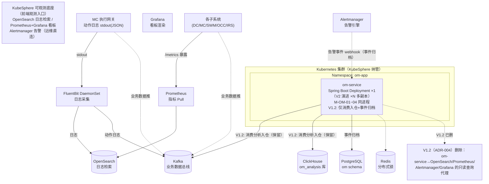
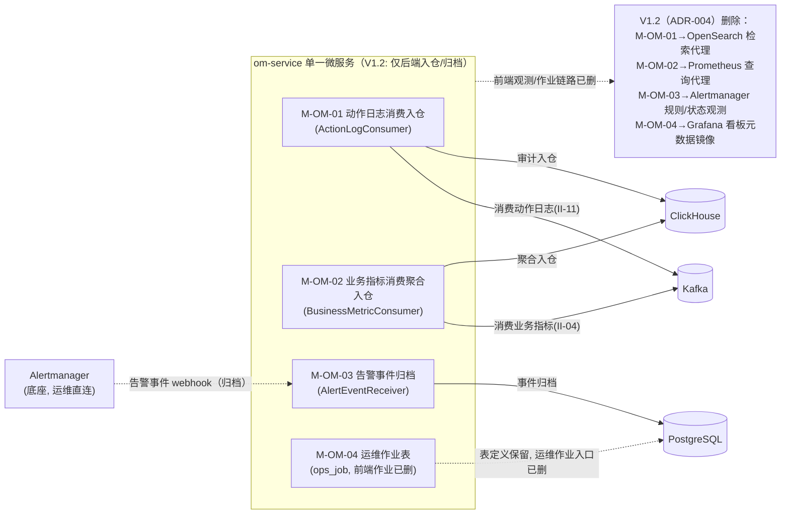
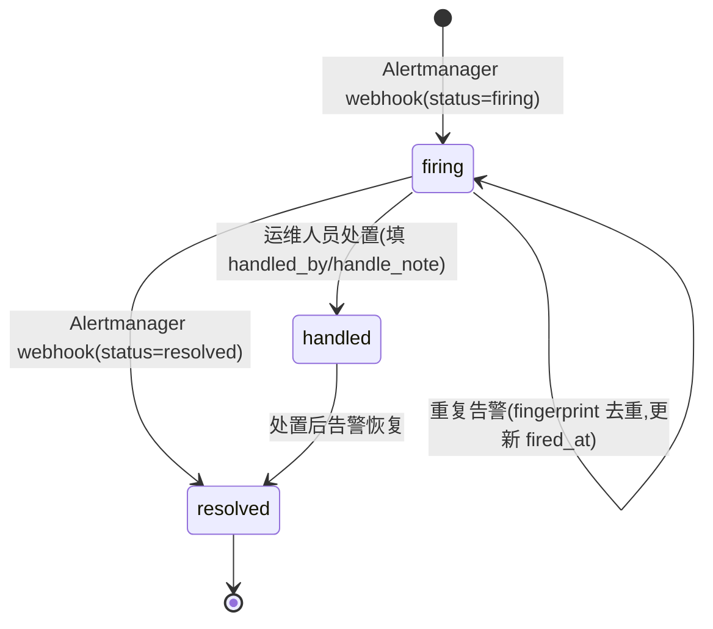

# 软件详细设计说明 - OM 子系统（系统管理，原运维监控）

| 项目 | 内容 |
| --- | --- |
| 项目名称 | 认知行动平台（v1.0） |
| 文档版本 | V1.2 |
| 密级 | 内部使用 |
| 编制 | 石建国 |
| 编制日期 | 2026-07-17 |

---

## 1 引言

### 1.1 标识

本文件为「认知行动平台」（以下简称"系统"或"平台"）系统管理子系统（原运维监控子系统，OM，软部件标识 M-OM-00）的软件详细设计说明（SDD）。它是《软件需求规格说明-OM子系统》V3.9 功能需求 R-OM-001/002 与《软件概要设计说明》V2.4 模块 M-OM-01~04 的详细设计下沉，描述 OM 子系统各模块的内部结构、类与接口、数据结构、算法、状态机与部署单元，作为编码实现与单元测试的依据。

> 版本演进说明（V1.2 / ADR-004，2026-07-17）：原 OM 前端运维监控页（OM-01~05）已删除，平台可观测性交由 KubeSphere 底座原生控制台承担；OM 本体仅保留**后端能力**——消费各子系统经 II-04/II-11 上报的业务日志/指标，分析加工后入 ClickHouse 长期存储（供 MC 等子系统回查）。原与 OM 合用的运维管理控制台中 COM 系统管理（用户/角色/组织/认证，原 OM-06~10）独立为「系统管理」控制台。R-OM-001/002 需求与 M-OM-01~04 模块编号不变（前端观测/运维作业部分的设计章节大幅精简，保留后端入仓逻辑）。

### 1.2 系统概述

> **V1.2 / ADR-004 定位变更**：OM 前端运维监控页（OM-01~05）已删除（ADR-004），可观测性交由 **KubeSphere 底座**（原生控制台：OpenSearch 日志检索 / Prometheus + Grafana 指标看板 / Alertmanager 告警）。本子系统**仅保留后端能力**：消费各子系统经 II-04/II-11 上报的业务日志/指标，分析加工后入 ClickHouse 长期存储（供 MC 等子系统回查）。COM 系统管理（用户/角色/组织/认证，原 OM-06~10）独立为**「系统管理」控制台**。本文件经 V1.2 大幅改写：删除原 M-OM-01~04 的前端观测/查询代理与运维作业部分，保留 Kafka 消费入仓、Alertmanager 事件归档与数据表定义（作为分析入仓存储）。

OM 子系统原定位为基础设施层的运维数据底座（复用 KubeSphere 开源版可观测底座 + 薄分析层），承担「只读观测代理 + 业务数据分析入仓 + 运维作业」三类职责。ADR-004 后，OM 前端观测/查询/运维作业入口全删，**仅保留后端分析入仓职责**：

- **业务数据分析入仓（保留）**：MC 执行网关动作日志（II-11）与各子系统业务指标（II-04）→ FluentBit/采集器 → Kafka → om-service 消费 → 分析加工 → ClickHouse（`om_action_log` 审计明细 / `om_metric_daily` 长期聚合），供 MC（动作审计回查 MC-20 等）等子系统回查。
- **告警事件归档（保留）**：Alertmanager 触发告警 → webhook 回调 om-service → 写 PostgreSQL `alert_event`（告警历史归档）。
- **前端观测/查询代理/运维作业（删除）**：日志检索 UI、指标看板 UI、告警观测 UI、看板元数据镜像、运维作业（巡检/故障定位/容量观测）等前端与作业能力，全部交由 KubeSphere 原生控制台（OpenSearch / Prometheus + Grafana / Alertmanager）承担，OM 不再自研或代理。

OM 是一个**单一微服务**（不内部分拆为独立部署单元），M-OM-01~04 为 Java 包/模块级划分，同进程内调用。OM 与 DC（Python）语言异构，经 Kafka / REST 解耦。

OM 子系统由四个模块组成（对应 2 项功能需求与 8 个功能点），V1.2 后各模块**仅保留后端入仓/归档职责**：

| 模块 | 标识 | 对应需求 | 功能点 | V1.2 保留职责 |
| --- | --- | --- | --- | --- |
| 日志汇聚与检索 | M-OM-01 | R-OM-001（日志） | F-OM-01-01~02 | 动作日志消费入仓（ActionLogConsumer） |
| 指标采集与时序存储 | M-OM-02 | R-OM-001（指标） | F-OM-02-01~02 | 业务指标消费聚合入仓（BusinessMetricConsumer） |
| 告警引擎 | M-OM-03 | R-OM-002（告警） | F-OM-03-01~02 | 告警事件归档（AlertEventReceiver） |
| 运维可视化与作业 | M-OM-04 | R-OM-002（看板+运维） | F-OM-04-01~02 | 前端看板/运维作业已删（仅保留 ops_job 表定义供审计追溯） |

> 说明：V1.2 后 M-OM-01~04 实际职责为「**II-04/II-11 上报接口消费 + 分析入仓/事件归档**」，采集、存储、告警引擎、看板渲染、告警规则配置、运维作业 UI 均由 KubeSphere 底座承担（详见 §3.1、§5）。需求 R-OM-001/002 与模块/功能点编号不变。

### 1.3 文档概述

本文件章节安排如下：第 2 章引用文件；第 3 章总体设计，给出 OM 技术栈、部署单元、模块间调用关系与数据流；第 4 章数据结构设计，给出核心数据模型与存储表结构（**分析入仓存储，V1.2 保留**）；第 5 章按模块给出详细设计（类/接口/算法/状态机，**V1.2 删除前端观测/查询代理与运维作业，仅保留后端消费入仓/事件归档**）；第 6 章接口详细设计（**V1.2 保留 II-04/II-11 上报消费方，删前端服务的 II-06 REST**）；第 7 章错误处理与可靠性设计；第 8 章部署与运维设计。需求追溯以《软件需求跟踪矩阵.xlsx》为唯一权威源，本文件第 9 章仅做概要引用。

### 1.4 术语和缩略语

沿用《软件需求规格说明-总册》第 1.4 节术语与缩略语，本文件补充以下技术术语：

| 术语 | 说明 |
| --- | --- |
| KubeSphere | 开源 PaaS 容器管理平台，本系统统一容器编排与可观测底座；本设计基于其开源版（社区版），不含企业版 Whizard |
| OpenSearch | KubeSphere 4.x 默认日志后端（Elasticsearch 分支），存储容器日志与动作日志，支持全文检索 |
| FluentBit | 轻量级日志采集器，以 DaemonSet 形式采集容器 stdout，输出到 OpenSearch |
| ServiceMonitor / PodMonitor | Prometheus Operator 的 CRD，声明式定义 Prometheus 抓取目标（Service 或 Pod 暴露的 `/metrics`） |
| Alertmanager | Prometheus 生态的告警路由组件，负责告警分组、去重、抑制、静默与多渠道通知 |
| consumer group | Kafka 消费者组机制，同组内消费者分摊分区，天然避免重复消费 |
| 只读观测 | OM 管控面不向下发告警规则/采集配置/看板定义，仅查询展示底座状态；告警规则配置由运维人员经 KubeSphere 控制台操作 |
| 选主 | 多副本场景下经分布式锁竞争 leader，仅 leader 执行定时任务；当前版本单副本无需选主，V2 演进多副本时启用 |
| 系统管理控制台 | 原「运维管理控制台」（OM 运维监控 + COM 系统管理合用）。ADR-004 删 OM 前端后仅剩 COM 系统管理（用户/角色/组织/认证），独立为「系统管理」控制台 |
| 分析入仓 | OM 后端消费 Kafka 业务数据（动作日志/业务指标），分析加工后入 ClickHouse 长期存储的职责，V1.2 起 OM 保留的唯一核心后端能力 |

---

## 2 引用文件

| 文件 | 说明 |
| --- | --- |
| 《软件需求规格说明-OM子系统》V3.9 | OM 功能需求 R-OM-001/002、非功能需求（NR-P-06 日志检索≤3s、NR-M-03/04、NR-F-05）、接口（II-04/II-11）的直接输入；V3.9 加注 ADR-004 说明（前端运维页已删，OM 后端留存） |
| 《ADR-004-删除OM运维监控并独立COM为系统管理控制台》 | 本文件 V1.2 改写的直接依据：删 OM 前端、COM 独立、保留后端入仓 |
| 《软件概要设计说明》V2.4 | OM 模块划分 M-OM-01~04、§4.3 OM 模块组成与关键设计、§3.7 环境部署 |
| 《软件概要设计-架构图.md》 | OM 模块架构图与模块内功能架构图（§5 运维监控子系统） |
| 《软件概要设计-模块功能拆分-v2.xlsx》 | OM 4 模块 8 功能点的权威依据 |
| 《软件需求跟踪矩阵.xlsx》 | OM 需求双向追溯唯一权威源 |
| 《软件详细设计说明-DC子系统.md》V1.2 | DC 部署单元、Kafka 总线、ClickHouse 集群、II-04 上报侧实现的参照依据 |
| 《软件详细设计说明-COM子系统.md》V1.1 | 原 OM-06~10 系统管理页面独立为「系统管理」控制台（COM 承载）的参照依据 |

---

## 3 总体设计

### 3.1 技术选型

OM 子系统技术栈遵循「复用 KubeSphere 开源版可观测底座 + 单一微服务」定位，管控面语言为 **Java + Spring Boot**（与 DC 的 Python/FastAPI 异构，经 Kafka/REST 解耦；异构原因：OM 复用 KubeSphere/JVM 生态且团队 Java 栈成熟）。V1.2（ADR-004）后，前端观测/运维作业入口删除，om-service 仅保留 Kafka 消费入仓与 Alertmanager 事件归档后端能力。

| 维度 | 选型 | 说明 |
| --- | --- | --- |
| 管控面语言/框架 | **Java 17 + Spring Boot 3.x** | OM 单一微服务，V1.2 仅提供 Kafka 消费入仓（ActionLogConsumer/BusinessMetricConsumer）与告警事件归档 webhook |
| 微服务治理 | **KubeSphere 微服务治理**（Spring Cloud Kubernetes） | 服务注册/发现/网关/配置复用 KubeSphere，不另起注册中心 |
| 日志采集 | **FluentBit**（KubeSphere 自带 DaemonSet） | 采集容器 stdout（含 MC 动作日志 JSON 行），输出 OpenSearch 与 Kafka 双路 |
| 日志后端 | **OpenSearch**（KubeSphere 4.x 默认） | 容器日志与动作日志全文检索（NR-P-06，近 7 日 ≤3s） |
| 指标采集 | **Prometheus**（KubeSphere 自带，Pull 模型） | 经 ServiceMonitor/PodMonitor CRD 抓取各子系统 `/metrics` |
| 时序存储 | **Prometheus TSDB**（KubeSphere 自带） | 实时指标存储（短期，默认 ~15 天） |
| 告警引擎 | **Alertmanager**（KubeSphere 自带） | 告警分组/去重/抑制/静默与多渠道通知；OM 不下发规则，仅观测 |
| 看板渲染 | **Grafana**（KubeSphere 内置） | 总览/设备/任务/爬虫/异常多维看板由 Grafana 渲染；OM 只镜像看板元数据 |
| 业务数据总线 | **Kafka**（复用 DC 集群） | 动作日志（II-11）、业务指标（II-04）经采集器推 Kafka，OM 消费 |
| 分析仓 | **ClickHouse**（复用 DC 集群，独立库 `om_analysis`） | 动作审计明细 `om_action_log` + 指标长期聚合 `om_metric_daily` |
| 元数据库 | **PostgreSQL**（复用 DC 实例，独立 schema `om`） | 告警事件归档 `alert_event` + 运维作业记录 `ops_job` + 看板元数据镜像 `dashboard_meta` |
| 分布式锁 | **Redis**（复用 DC 实例） | V2 多副本定时巡检选主（当前单副本不启用） |

### 3.2 部署单元

OM 作为**单一微服务**部署于 K8s（KubeSphere 管理），当前版本**单副本**（V2 演进多副本 HA，对应 NR-R-01/04 的 V2 目标）。M-OM-01~04 为同进程内的 Java 包/模块，不拆独立 Pod。V1.2（ADR-004）后，om-service 删去前端观测/运维作业，仅保留 Kafka 消费入仓与 Alertmanager 事件归档后端能力。



各部署单元职责：

| 部署单元 | 实现 | 对应模块 | 副本 |
| --- | --- | --- | --- |
| om-service | Spring Boot 单一微服务（V1.2：仅消费入仓 + 事件归档后端） | M-OM-01~04（同进程内 Java 包划分） | ×1（V2 演进 ×N） |

> 外部依赖（FluentBit/Prometheus/OpenSearch/Alertmanager/Grafana/Kafka/ClickHouse/PostgreSQL/Redis）均为 KubeSphere 底座或 DC 已有组件，OM 仅消费，不负责其部署运维。V1.2（ADR-004）后，前端日志检索/指标看板/告警观测/运维作业入口由运维人员直连 KubeSphere 原生控制台（OpenSearch / Grafana / Alertmanager）完成，om-service 不再代理。

### 3.3 模块间调用关系

OM 内部 M-OM-01~04 同进程调用。V1.2（ADR-004）后，原 M-OM-01~04 与 OpenSearch/Prometheus/Alertmanager/Grafana 的只读查询/观测代理关系删除，仅保留与 Kafka（消费）、ClickHouse（入仓）、PostgreSQL（事件归档）的交互：



### 3.4 数据流设计

V1.2（ADR-004）后，OM 数据流由原三类收窄为**后端两类**（只读查询流已删，前端入口交 KubeSphere 控制台）：

1. ~~**只读查询流（V1.2 已删）**~~：原运维人员经 om-service REST → M-OM-01 检索 OpenSearch 日志 / M-OM-02 查询 Prometheus 指标 / M-OM-03 观测 Alertmanager 告警 / M-OM-04 查 Grafana 看板。**ADR-004 后删除**，运维人员直连 KubeSphere 原生控制台（OpenSearch / Grafana / Alertmanager）完成观测。
2. **业务数据分析入仓流（保留）**：MC 动作日志（II-11，stdout JSON）与各子系统业务指标（II-04）→ FluentBit/采集器 → Kafka → om-service 消费 → 分析加工 → ClickHouse（`om_action_log` 审计明细 / `om_metric_daily` 长期聚合），供 MC（动作审计回查 MC-20 等）等子系统回查。
3. **告警事件归档流（保留）**：Alertmanager 触发告警 → webhook 回调 om-service → 写 PostgreSQL `alert_event`（告警历史归档与处置追踪）。

---

## 4 数据结构设计

OM 不重复存储原始日志/指标（由 OpenSearch/Prometheus 存储），仅存「OM 自身分析产出 + 管控面元数据」。存储分两层：ClickHouse 分析仓（`om_analysis` 库）与 PostgreSQL 元库（`om` schema）。**V1.2（ADR-004）保留全部数据表定义**，作为后端分析入仓的存储载体（消费 Kafka 业务数据后落库，供 MC 等子系统回查）。

### 4.1 分析仓（ClickHouse `om_analysis` 库）

#### 4.1.1 动作审计明细表 `om_action_log`（M-OM-01 分析入仓，来自 II-11）

来自 MC 执行网关经 FluentBit→Kafka 的结构化动作日志，按时间分区，高压缩列式存储，供审计查询与复盘统计（CON-07 可审计）：

```sql
CREATE TABLE om_analysis.om_action_log (
    event_id        String,           -- 动作事件唯一标识
    occurred_at     DateTime64(3),    -- 动作发生时间
    subsystem       LowCardinality(String),  -- 来源子系统(MC/DC/SWM/OCC/IRS)
    gateway_node    String,           -- 执行网关节点
    action_type     LowCardinality(String),  -- 动作类型(tap/swipe/input/cdp/...)
    terminal_type   LowCardinality(String),  -- 终端类型(mobile_real/cloud_phone/arm/virtual/browser_profile)
    terminal_id     String,           -- 终端标识
    account_id      String,           -- 关联账号标识(引用 MC account_id)
    agent_id        String,           -- 智能体标识(脚本模式为空)
    task_id         String,           -- 关联任务标识
    result          LowCardinality(String),  -- success/failed/blocked
    fuse_flag       UInt8,            -- 是否触发熔断(0/1)
    fuse_reason     String,           -- 熔断原因(风控信号/异常频率/...)
    latency_ms      UInt32,           -- 动作耗时
    extra           String,           -- 扩展字段(JSON)
    ingest_at       DateTime64(3)     -- 入仓时间
) ENGINE = MergeTree
PARTITION BY toYYYYMMDD(occurred_at)
ORDER BY (subsystem, occurred_at, terminal_id)
TTL occurred_at + INTERVAL 12 MONTH;
```

#### 4.1.2 指标长期聚合表 `om_metric_daily`（M-OM-02 分析入仓，来自 II-04）

各子系统业务指标经 Kafka 消费后按天聚合，弥补 Prometheus 短期存储（~15 天）限制，支撑容量观测与长期趋势分析：

```sql
CREATE TABLE om_analysis.om_metric_daily (
    day             Date,             -- 统计日
    subsystem       LowCardinality(String),
    metric_name     LowCardinality(String),  -- device_online_rate/task_success_rate/crawl_throughput/queue_backlog
    label_json      String,           -- 维度标签(platform/account_id/terminal_id 等, JSON)
    value_avg       Float64,          -- 日均值
    value_max       Float64,          -- 日最大
    value_min       Float64,          -- 日最小
    sample_count    UInt64,           -- 采样数
    agg_at          DateTime64(3)     -- 聚合时间
) ENGINE = MergeTree
PARTITION BY toYYYYMM(day)
ORDER BY (subsystem, metric_name, day)
TTL day + INTERVAL 24 MONTH;
```

### 4.2 元数据库（PostgreSQL `om` schema）

#### 4.2.1 告警事件归档表 `alert_event`（M-OM-03，Alertmanager webhook 回调写入）

```sql
CREATE TABLE om.alert_event (
    event_id        UUID PRIMARY KEY,         -- 告警事件标识(Alertmanager fingerprint)
    alert_rule      VARCHAR(256) NOT NULL,    -- 触发的告警规则名
    severity        VARCHAR(16) NOT NULL,     -- critical/warning/info
    status          VARCHAR(16) NOT NULL,     -- firing/resolved
    labels_json     JSONB NOT NULL,           -- 告警标签
    annotations_json JSONB,                   -- 告警注解(摘要/描述)
    fired_at        TIMESTAMPTZ NOT NULL,     -- 触发时间
    resolved_at     TIMESTAMPTZ,              -- 恢复时间
    handled_by      VARCHAR(64),              -- 处置人
    handle_note     TEXT,                     -- 处置备注
    received_at     TIMESTAMPTZ NOT NULL DEFAULT now()  -- OM 接收时间
);
CREATE INDEX idx_alert_event_fired ON om.alert_event(fired_at);
CREATE INDEX idx_alert_event_status ON om.alert_event(status);
```

#### 4.2.2 运维作业记录表 `ops_job`（M-OM-04，om-service 执行运维作业时写入）

> V1.2（ADR-004）说明：M-OM-04 前端运维作业（巡检/故障定位/容量观测）入口已删，OpsJobService/InspectionRunner 不再执行（见 §5.4）。`ops_job` **表定义保留**（供历史作业记录审计追溯与未来恢复入口使用），但 V1.2 起新数据写入停止。

```sql
CREATE TABLE om.ops_job (
    job_id          UUID PRIMARY KEY,
    job_type        VARCHAR(32) NOT NULL,     -- inspection(巡检)/diagnosis(故障定位)/capacity(容量观测)
    triggered_by    VARCHAR(64) NOT NULL,     -- manual/scheduled
    params_json     JSONB,                    -- 作业参数(时间范围/目标/检查项)
    status          VARCHAR(16) NOT NULL,     -- running/succeeded/failed
    result_summary  TEXT,                     -- 结果摘要
    result_detail   JSONB,                    -- 详细结果(检查项/指标快照/异常项)
    started_at      TIMESTAMPTZ NOT NULL DEFAULT now(),
    finished_at     TIMESTAMPTZ
);
CREATE INDEX idx_ops_job_type_time ON om.ops_job(job_type, started_at);
```

#### 4.2.3 看板元数据镜像表 `dashboard_meta`（M-OM-04，定时从 Grafana API 拉取）

> V1.2（ADR-004）说明：M-OM-04 看板元数据镜像（DashboardMetaService）已删，看板渲染/检索交 KubeSphere Grafana 原生控制台。`dashboard_meta` **表定义保留**（仅作历史快照留存，V1.2 起停止定时同步写入）。

```sql
CREATE TABLE om.dashboard_meta (
    dashboard_uid   VARCHAR(64) PRIMARY KEY,  -- Grafana dashboard uid
    title           VARCHAR(256) NOT NULL,
    category        VARCHAR(32),              -- overview/device/task/crawler/anomaly
    grafana_url     VARCHAR(512),             -- Grafana 访问地址
    panel_count     INT,                      -- 面板数
    definition_json JSONB,                    -- 看板定义快照(Grafana API 返回)
    synced_at       TIMESTAMPTZ NOT NULL DEFAULT now()  -- 最近同步时间
);
CREATE INDEX idx_dashboard_meta_category ON om.dashboard_meta(category);
```

### 4.3 Kafka Topic 设计

复用 DC Kafka 集群，OM 消费侧 topic：

| Topic | 方向 | 内容 | 生产方 | 消费方 |
| --- | --- | --- | --- | --- |
| `om-action-log` | 入 | MC 执行网关动作日志（II-11，JSON 行） | FluentBit（采 MC stdout） | om-service（入 CH `om_action_log`） |
| `om-business-metric` | 入 | 各子系统业务指标（II-04，设备在线率/任务成功率/爬虫吞吐量/队列积压） | 各子系统采集器/Metricbeat | om-service（聚合入 CH `om_metric_daily`） |
| `om-alert-event` | 入 | Alertmanager 告警事件（webhook 转 Kafka 可选，或直推 om-service） | Alertmanager | om-service（入 PG `alert_event`） |

> 说明：MC 动作日志经 stdout 由 FluentBit 采集，FluentBit 配置双路 OUTPUT（OpenSearch + Kafka `om-action-log`），实现「检索（OpenSearch）+ 审计入仓（ClickHouse）」双消费（见 §6.2）。

### 4.4 Redis Key 设计

| Redis Key 模式           | 类型                 | 用途                                     |
| ---------------------- | ------------------ | -------------------------------------- |
| `om:lock:ops_leader`   | STRING（NX，TTL 30s） | V2 多副本定时巡检选主锁（当前单副本不启用）                |
| `om:metric:agg:cursor` | HASH               | 指标聚合消费位点（按 metric_name 记录最近聚合窗口，防重复聚合） |

---

## 5 模块详细设计

### 5.1 M-OM-01 日志汇聚与检索模块（R-OM-001 日志）

> V1.2（ADR-004）：原 OpenSearch 检索代理（LogSearchService/OpenSearchClient）与前端日志检索 UI（OM-02/03）已删，日志全文检索（NR-P-06）改由运维人员直连 KubeSphere OpenSearch 原生控制台完成。本模块**仅保留动作日志消费入仓**（ActionLogConsumer）——消费 MC 执行网关经 II-11 上报的动作日志，分析加工后入 ClickHouse `om_action_log`，供 MC 动作审计（MC-20）等子系统回查。

#### 5.1.1 模块组成与类图（V1.2：仅保留消费入仓）

```mermaid
classDiagram
    class ActionLogConsumer {
        +consume(records)  %% 消费 Kafka om-action-log
        +parse_and_validate(raw) ActionLogEvent
        +sink_to_clickhouse(events)
    }
    class ClickHouseSink {
        +batch_insert(table, rows)
    }
    class ActionLogConsumer ..> ClickHouseSink : 审计入仓
    note for ActionLogConsumer "V1.2（ADR-004）删除：LogSearchService（OpenSearch 检索代理）/n+ OpenSearchClient（全文检索/字段检索/上下文）/n+ 前端日志检索 UI（OM-02/03）"
```

#### 5.1.2 关键类说明

- ~~**LogSearchService**（V1.2 已删）~~：原日志检索代理（封装 OpenSearch 查询，提供全文检索 NR-P-06、字段检索、日志上下文），ADR-004 后删除。日志检索改由运维人员直连 KubeSphere OpenSearch 原生控制台。
- **ActionLogConsumer（保留）**：Kafka 消费者。消费 `om-action-log` topic（MC 动作日志，II-11），解析校验 JSON 结构化字段，批量写入 ClickHouse `om_action_log`。消费失败进入重试，耗尽记死信。

#### 5.1.3 动作日志消费算法（保留）

```
consume_loop():
  while running:
    records = kafka.poll(om-action-log, timeout=5s)
    if records.empty: continue
    events = []
    dead = []
    for r in records:
      try:
        event = parse_and_validate(r.value)   # 校验必填字段(occurred_at/action_type/...)
        events.append(event)
      except ParseError:
        dead.append(r)   # 格式错误转死信
    if events:
      clickhouse.batch_insert(om_action_log, events)  # 批量插入
    if dead:
      kafka.send(om-action-log-dlq, dead)   # 死信 topic
    kafka.commit(om-action-log)
```

#### 5.1.4 ~~全文检索性能保障（NR-P-06）~~（V1.2 已删）

> V1.2（ADR-004）：本节原描述 OpenSearch 索引滚动、近 7 日热节点、分页检索等 OM 侧检索性能保障。ADR-004 后 OM 不再代理 OpenSearch 检索，NR-P-06（近 7 日日志检索 ≤3s）由 KubeSphere OpenSearch 底座原生保障，运维人员经 KubeSphere 控制台检索。原 OM 侧保障措施废止。

### 5.2 M-OM-02 指标采集与时序存储模块（R-OM-001 指标）

> V1.2（ADR-004）：原 Prometheus 查询代理（MetricQueryService/PrometheusClient）与前端指标看板 UI（OM-04/05）已删，实时指标查询改由运维人员直连 KubeSphere Prometheus + Grafana 原生控制台完成。本模块**仅保留业务指标消费聚合入仓**（BusinessMetricConsumer）——消费各子系统经 II-04 上报的业务指标，按天聚合后入 ClickHouse `om_metric_daily`，供长期趋势分析与容量观测回查。

#### 5.2.1 模块组成与类图（V1.2：仅保留消费聚合入仓）

```mermaid
classDiagram
    class BusinessMetricConsumer {
        +consume(records)  %% 消费 Kafka om-business-metric
        +aggregate_daily(metric, window) DailyAgg
        +sink_to_clickhouse(agg)
    }
    class ClickHouseSink {
        +batch_insert(table, rows)
    }
    class BusinessMetricConsumer ..> ClickHouseSink : 聚合入仓
    note for BusinessMetricConsumer "V1.2（ADR-004）删除：MetricQueryService（Prometheus 查询代理）/n+ PrometheusClient（即时/范围指标查询）/n+ 前端指标看板 UI（OM-04/05）"
```

#### 5.2.2 关键类说明

- ~~**MetricQueryService**（V1.2 已删）~~：原指标查询代理（封装 Prometheus HTTP API），供 M-OM-04 看板与运维作业查询实时指标，ADR-004 后删除。实时指标查询改由运维人员直连 KubeSphere Prometheus + Grafana。
- **BusinessMetricConsumer（保留）**：Kafka 消费者。消费 `om-business-metric` topic（II-04），按天窗口聚合业务指标（avg/max/min/count），写入 ClickHouse `om_metric_daily`。聚合游标记 Redis 防重复。

#### 5.2.3 指标聚合算法（保留）

```
aggregate_loop():
  while running:
    records = kafka.poll(om-business-metric, timeout=10s)
    if records.empty: continue
    # 按 (subsystem, metric_name, day, label) 分组聚合
    groups = group_by(records, [subsystem, metric_name, to_day(ts), label])
    aggs = []
    for key, samples in groups:
      cursor = redis.hget(om:metric:agg:cursor, key)
      if cursor and key.day <= cursor: continue   # 已聚合跳过
      agg = {avg: mean(samples), max: max(samples), min: min(samples), count: len(samples)}
      aggs.append(agg)
    if aggs:
      clickhouse.batch_insert(om_metric_daily, aggs)
      for key in groups: redis.hset(om:metric:agg:cursor, key, key.day)
    kafka.commit(om-business-metric)
```

#### 5.2.4 业务指标定义（概要）

业务指标由各子系统暴露 `/metrics`（Prometheus exposition format），经采集器推 Kafka。核心指标：

| 指标名 | 来源子系统 | 说明 |
| --- | --- | --- |
| `device_online_rate` | MC | 设备在线率（在线设备数/总设备数） |
| `task_success_rate` | MC/DC | 任务成功率（成功任务数/总任务数） |
| `crawl_throughput` | DC | 爬虫吞吐量（条/分钟） |
| `queue_backlog` | DC/MC | 队列积压（待处理任务数） |

> 各指标的具体 PromQL 与各子系统 `/metrics` 暴露字段清单，待与各子系统对齐后补充（见 §10 待补④）。

### 5.3 M-OM-03 告警引擎模块（R-OM-002 告警）

> V1.2（ADR-004）：原告警只读观测（AlertObservationService/AlertmanagerClient）与前端告警观测 UI（OM-05）已删，告警规则查看、告警状态查看改由运维人员直连 KubeSphere Alertmanager 原生控制台完成。本模块**仅保留告警事件归档**（AlertEventReceiver）——暴露 webhook 端点接收 Alertmanager 告警回调，按 fingerprint 去重写入 PostgreSQL `alert_event`，供告警历史归档与处置追踪。

#### 5.3.1 模块组成与类图（V1.2：仅保留事件归档）

```mermaid
classDiagram
    class AlertEventReceiver {
        +receive_webhook(payload)  %% Alertmanager webhook 回调
        +parse_and_persist(payload)
        +dedup_by_fingerprint(event)
    }
    class AlertEventRepository {
        +save(event)
        +find_by_fingerprint(fp) AlertEvent
        +update_status(fp, status, resolved_at)
    }
    class AlertEventReceiver ..> AlertEventRepository : 事件归档
    note for AlertEventReceiver "V1.2（ADR-004）删除：AlertObservationService（告警规则/状态只读观测）/n+ AlertmanagerClient（Alertmanager API 代理）/n+ 前端告警观测 UI（OM-05）"
```

#### 5.3.2 关键类说明

- ~~**AlertObservationService**（V1.2 已删）~~：原告警只读观测（封装 Alertmanager API 查询规则与告警状态），供 M-OM-04 看板与运维作业展示，ADR-004 后删除。告警规则与状态查看改由运维人员直连 KubeSphere Alertmanager。
- **AlertEventReceiver（保留）**：告警事件归档。暴露 `/api/v1/alerts/webhook` 端点接收 Alertmanager 告警回调，按 fingerprint 去重，写入 PostgreSQL `alert_event`，并更新状态（firing→resolved）。

#### 5.3.3 告警事件归档状态机（保留）



#### 5.3.4 告警规则配置说明（V1.2：观测入口交 KubeSphere）

依据《软件需求规格说明-OM子系统》V3.9 R-OM-002，告警规则（阈值/异常检测）的**配置**由运维人员经 KubeSphere 控制台操作（在 Alertmanager/Prometheus Rule CRD 中定义）。V1.2（ADR-004）后，OM **既不提供配置下发接口，也不提供规则与告警事件的只读观测 UI**——规则查看、告警状态查看均由运维人员直连 KubeSphere Alertmanager 原生控制台完成。OM 仅保留**告警事件归档**（AlertEventReceiver 接收 webhook 落库）。多渠道通知（邮件/IM webhook）由 Alertmanager 原生接收器承担；电话/语音告警渠道当前不支持，入 §10 待补①。

### 5.4 M-OM-04 运维可视化与作业模块（R-OM-002 看板+运维）

> V1.2（ADR-004）：本模块原承担「看板元数据镜像（DashboardMetaService/GrafanaClient）+ 只读运维作业（OpsJobService/InspectionRunner）」，对应前端看板与运维作业入口（OM-01 总览、OM-04 指标看板、运维作业页）。ADR-004 后前端入口全删：看板渲染与检索改由运维人员直连 KubeSphere Grafana 原生控制台；运维作业（巡检/故障定位/容量观测）改由运维人员经 KubeSphere 控制台或对接 Prometheus/Alertmanager 自助完成。**本模块 V1.2 起无运行时类保留**，仅 `ops_job` / `dashboard_meta` 两表定义留存（见 §4.2.2/§4.2.3，供历史记录审计追溯）。

#### 5.4.1 ~~模块组成与类图~~（V1.2 已删）

```mermaid
classDiagram
    note "V1.2（ADR-004）删除全部类：/n- DashboardMetaService（看板元数据镜像，前端看板 UI OM-01/04 已删）/n- GrafanaClient（Grafana API 拉取）/n- OpsJobService（巡检/故障定位/容量观测作业，前端运维作业入口已删）/n- InspectionRunner（巡检执行器）/n- OpsJobRepository（作业记录写库）/n本模块 V1.2 起无运行时类，仅 ops_job/dashboard_meta 表定义留存。"
    class EmptyPlaceholder {
        %% V1.2: 模块前端入口与运行时类全删
    }
```



#### 5.4.2 ~~关键类说明~~（V1.2 已删）

- ~~**DashboardMetaService**（V1.2 已删）~~：原定时从 Grafana API 拉取看板定义快照写入 `dashboard_meta`，供 OM 侧看板检索/引用。ADR-004 后看板渲染与检索交 KubeSphere Grafana 原生控制台，本类删除（`dashboard_meta` 表定义留存，停止定时同步写入）。
- ~~**OpsJobService**（V1.2 已删）~~：原只读运维作业（巡检/故障定位/容量观测），ADR-004 后前端运维作业入口删除，本类删除（`ops_job` 表定义留存，停止新写入）。
- ~~**InspectionRunner**（V1.2 已删）~~：原巡检执行器，随 OpsJobService 一并删除。

#### 5.4.3 ~~运维作业只读边界（严格只读）~~（V1.2 已删）

> V1.2（ADR-004）：本节原描述 M-OM-04 运维操作的只读边界（不执行写运维操作）。ADR-004 后 M-OM-04 运维作业整体删除，该边界不再适用。运维作业改由运维人员经 KubeSphere 控制台自助完成（遵循 CON-07 动作收口，写操作仍由人工经 KubeSphere 或 MC 执行网关落地）。

#### 5.4.4 ~~巡检作业算法~~（V1.2 已删）

> V1.2（ADR-004）：本节原描述 `run_inspection` 巡检作业算法（查 Prometheus 指标、评估阈值、产出报告、触发告警）。ADR-004 后 OpsJobService/InspectionRunner 删除，该算法废止。巡检能力改由运维人员经 KubeSphere Prometheus + Grafana + Alertmanager 自助配置与执行。

### 5.5 ~~看板分类（R-OM-002 多维看板）~~（V1.2 已删）

> V1.2（ADR-004）：本节原按 R-OM-002 五维（总览/设备/任务/爬虫/异常）列出 OM 镜像的 Grafana 看板分类。ADR-004 后看板元数据镜像（DashboardMetaService）删除，看板渲染与分类改由 KubeSphere Grafana 原生控制台承担。原五维看板分类表废止（`dashboard_meta.category` 字段定义留存于 §4.2.3）。

---

## 6 接口详细设计

### 6.1 外部接口（OM 侧无新增外部接口）

OM 不直接对接系统外部（EI），外部社交平台/代理服务等由 DC/MC 对接。OM 消费 KubeSphere 底座组件 API（属平台内部能力，非 GJB 438C 外部接口范畴）。

### 6.2 内部接口（OM 侧实现/消费）

> V1.2（ADR-004）：OM 作为消费方的 II-04（日志与指标上报）、II-11（执行网关日志上报）**保留**——各子系统→OM 上报业务数据，OM 消费分析入仓（供 MC 等子系统回查）。Alertmanager 告警事件 webhook（OM 为接收方）**保留**——用于告警事件归档。原 II-06 OM 管理 REST 接口（日志检索/指标查询/告警观测/看板/运维作业）**全部删除**——这些接口仅服务已删的 OM 前端观测/运维页，ADR-004 后前端入口交 KubeSphere 原生控制台。

#### 6.2.1 II-04 日志与指标上报（OM 为消费方，保留）

SRS 定义的 II-04 为「各子系统 → OM 上报日志与指标」。落地实现采用「**自动采集（Pull/采集）模型**」，数据流向仍为 各子系统→OM，但实现上：

- **日志**：各子系统容器 stdout 由 KubeSphere FluentBit DaemonSet 自动采集入 OpenSearch（OM 配置采集规则，不需各子系统主动推）。V1.2 后 OpenSearch 日志检索入口交 KubeSphere 原生控制台。
- **指标**：各子系统暴露 `/metrics`（Prometheus exposition format），由 Prometheus 经 ServiceMonitor CRD 自动 Pull 抓取（OM 配置 scrape 规则，不需各子系统主动推）。V1.2 后 Prometheus 指标查询入口交 KubeSphere + Grafana 原生控制台。
- **业务数据入仓（保留）**：动作日志（II-11）与业务指标（II-04）经 FluentBit/采集器推 Kafka，**OM 消费分析入 ClickHouse**（保留，供 MC 等子系统回查）。

> 语义澄清：II-04「上报」描述的是数据流向（各子系统→OM），实现可为 Pull/采集模型，不违背需求。V1.2 后 OM 仅保留 Kafka 消费入仓这一消费路径，前端观测入口已删。

#### 6.2.2 II-11 执行网关日志上报（OM 为消费方，保留）

SRS 定义的 II-11 为「MC 执行网关 → OM 全量动作日志 + 熔断记录」。落地实现：

- MC 执行网关将结构化动作日志以 **JSON 行写入 stdout**（含动作类型/终端/账号/结果/熔断标志等字段）。
- FluentBit 采集 stdout，**双路 OUTPUT**：
  - → OpenSearch（供 KubeSphere 控制台全文检索，NR-P-06；V1.2 起检索入口在 KubeSphere 原生控制台）
  - → Kafka `om-action-log`（**供 OM 消费分析入 ClickHouse `om_action_log`**，审计，V1.2 保留）
- MC 侧本地落盘文件 + FluentBit filesystem 缓冲兜底「全量不丢」（CON-07 可审计、R-MC-010 全量留痕）。

动作日志 JSON 结构：

```json
{
  "event_id": "evt_2026_001",
  "occurred_at": "2026-07-13T10:00:00.123Z",
  "subsystem": "MC",
  "gateway_node": "mc-gw-01",
  "action_type": "tap",
  "terminal_type": "cloud_phone",
  "terminal_id": "term_001",
  "account_id": "acc_001",
  "agent_id": "",
  "task_id": "task_001",
  "result": "success",
  "fuse_flag": 0,
  "fuse_reason": "",
  "latency_ms": 120,
  "extra": {}
}
```

#### 6.2.3 Alertmanager 告警事件 webhook（OM 为接收方，保留）

OM 暴露 webhook 端点接收 Alertmanager 告警回调（V1.2 保留，用于告警事件归档，非前端观测）：

- 端点：`POST /api/v1/alerts/webhook`
- 输入：Alertmanager 标准 webhook payload（version/groupKey/status/alerts[]）
- 输出：HTTP 200（接收确认）
- 处理：按 fingerprint 去重，写入 PostgreSQL `alert_event`，更新状态。

#### 6.2.4 ~~OM 管理 REST 接口（II-06，OM 为提供方）~~（V1.2 已删）

> V1.2（ADR-004）：本节原列 OM 向前端/运维提供的只读观测与运维作业 REST 接口（`/api/v1/logs/search` 日志检索、`/api/v1/metrics/query` 指标查询、`/api/v1/alerts/*` 告警观测、`/api/v1/dashboards` 看板、`/api/v1/ops/jobs/*` 运维作业）。这些接口**仅服务已删的 OM 前端观测/运维页（OM-01~05）**，ADR-004 后前端入口交 KubeSphere 原生控制台（OpenSearch / Grafana / Alertmanager），**本组接口全部删除**。OM 侧保留的对外端点仅剩 §6.2.3 的 Alertmanager 告警事件 webhook（归档用，非前端）。

---

## 7 错误处理与可靠性设计

### 7.1 可靠性总体策略（NR-F-05）

OM 采用薄管控面定位，管控面（Spring Boot 单一微服务）与 KubeSphere 底座采集层（FluentBit/Prometheus DaemonSet）进程隔离、部署解耦，OM 管控面故障不影响底座日志/指标采集与实时观测（NR-F-05）。OM 各故障点处理：

| 故障点 | 处理 |
| --- | --- |
| om-service 故障 | 底座采集（FluentBit/Prometheus）继续运行；运维人员直连 KubeSphere/Grafana/OpenSearch 原生界面观测；Kafka 消息保留，service 恢复后续采 |
| Kafka 消费积压 | ClickHouse 入库延迟，但不影响 OpenSearch 检索（双消费，OpenSearch 走 FluentBit 不经 Kafka）；积压超阈值告警 |
| ClickHouse 写入失败 | Kafka 消息保留兜底，CH 恢复后补写；实时观测不受影响（走 Prometheus/OpenSearch） |
| PostgreSQL 写入失败 | Alertmanager webhook 失败重试；作业记录暂存本地文件，恢复后补写 |
| OpenSearch/Prometheus/Alertmanager 故障 | 由 KubeSphere 底座自身可靠性保障（非 OM 职责）；OM 检测到查询失败时降级返回缓存或提示 |

### 7.2 Kafka 消费容错（NR-F-04）

- 消费失败的消息转死信 topic（`om-action-log-dlq`、`om-business-metric-dlq`）。
- 消费者启用幂等（按 event_id 去重，防止重启后重复入仓）。
- 提交位点采用「处理成功后提交」，避免消息丢失。

### 7.3 幂等性

- 动作日志入仓以 `event_id` 幂等（ClickHouse ReplacingMergeTree 按 event_id 去重）。
- 告警事件归档以 `event_id`（Alertmanager fingerprint）幂等，重复 webhook 仅更新状态。
- 指标聚合以 `(day, subsystem, metric_name, label)` 幂等，Redis 游标防重复聚合。

---

## 8 部署与运维设计

### 8.1 K8s 部署架构（KubeSphere 纳管）

#### 8.1.1 部署架构图

OM 部署于与 DC 同一 Kubernetes 集群，由 KubeSphere 纳管，复用 DC 的数据组件与 KubeSphere 可观测底座。V1.2（ADR-004）后，前端观测入口由运维人员经 KubeSphere 管理面（KSUI）直连底座；om-service 仅保留 Kafka 消费入仓与告警事件归档后端。

```mermaid
flowchart TB
    subgraph KS["KubeSphere 管理面（PaaS）"]
        KSUI["控制台<br/>应用负载/监控告警/日志/看板<br/>V1.2: 运维观测前端入口在此"]
    end

    subgraph K8S["Kubernetes 集群"]
        KS -.纳管.-> K8S

        subgraph OM_NS["Namespace: om-app"]
            OM_SVC["om-service<br/>Spring Boot Deployment ×1<br/>（V2 演进 ×N 多副本 HA）<br/>M-OM-01~04 同进程<br/>V1.2: 仅消费入仓+事件归档"]
        end

        subgraph KS_OBS["Namespace: kubesphere-monitoring（底座，复用）"]
            PROM["Prometheus"]
            AM["Alertmanager"]
            GRAF["Grafana"]
        end

        subgraph KS_LOG["Namespace: kubesphere-logging（底座，复用）"]
            FB["FluentBit DaemonSet"]
            OS[("OpenSearch")]
        end

        subgraph DC_DATA["Namespace: dc-data（复用 DC 数据组件）"]
            KF[("Kafka")]
            CH[("ClickHouse<br/>om_analysis 库")]
            PG[("PostgreSQL<br/>om schema")]
            RD[("Redis")]
        end
    end

    subgraph SRC["各子系统"]
        MC["MC 执行网关<br/>动作日志 stdout(JSON)"]
        SS["DC/SWM/OCC/IRS<br/>日志 stdout + /metrics"]
    end

    OPS["运维人员<br/>V1.2: 直连 KubeSphere 控制台"]
    OPS -.->|"日志检索/指标看板/告警观测"| KSUI

    MC -->|"stdout"| FB
    SS -->|"stdout"| FB
    SS -->|"/metrics"| PROM
    SS & MC -.->|"业务数据推"| KF

    FB --> OS
    FB --> KF
    PROM --> AM
    AM -.->|"webhook（事件归档）"| OM_SVC

    OM_SVC -->|"V1.2 保留: 消费入仓+事件归档"| KF & CH & PG
    note3["V1.2（ADR-004）删除：<br/>om-service→OpenSearch/Prometheus/<br/>Alertmanager/Grafana 的只读查询代理"]
    OM_SVC -.->|"V1.2 已删"| note3
```

#### 8.1.2 部署清单

| 资源 | 类型 | 副本 | 说明 |
| --- | --- | --- | --- |
| om-service | Deployment | ×1（V2 演进 ×N） | Spring Boot 单一微服务，M-OM-01~04 同进程（V1.2：仅消费入仓 + 事件归档后端） |
| om-service Service | Service | - | ClusterIP，供 Alertmanager webhook 回调与各子系统回查访问 |
| om-config | ConfigMap | - | OM 配置（KubeSphere 底座地址、Kafka topic、告警 webhook 路径；V1.2 删巡检检查项） |
| om-secret | Secret | - | 底座组件凭据（PG/CH 连接信息，NR-S-03 加密） |

> 外部依赖（Prometheus/Alertmanager/Grafana/FluentBit/OpenSearch/Kafka/ClickHouse/PostgreSQL/Redis）由 KubeSphere 底座或 DC 部署，OM 仅消费。V1.2（ADR-004）后前端观测入口在 KubeSphere 管理面（KSUI），运维人员直连。

### 8.2 配置化（NR-M-02）

- KubeSphere 底座地址（OpenSearch/Prometheus/Alertmanager/Grafana URL）经 ConfigMap 配置，不硬编码。
- Kafka topic 名、消费组、告警 webhook 路径经 ConfigMap 配置（V1.2 删巡检检查项配置）。
- 各子系统 `/metrics` 暴露与 ServiceMonitor 配置由运维人员经 KubeSphere 控制台管理。

### 8.3 可观测（NR-M-03/04）

- om-service 自身日志经 stdout 由 FluentBit 采集入 OpenSearch（OM 自观测）。
- om-service 自身指标（JVM/请求量/消费 lag）暴露 `/metrics`，由 Prometheus 采集。
- 运维仪表盘与告警由 KubeSphere/Grafana/Alertmanager 提供（NR-M-04）。

---

## 9 需求追溯（概要引用）

OM 子系统需求双向追溯的明细以《软件需求跟踪矩阵.xlsx》（RTM，GJB 438C）为唯一权威源。本文件设计对需求的覆盖概要如下：

| 需求 | 模块/功能点 | 设计章节 |
| --- | --- | --- |
| R-OM-001 日志与指标汇聚 | M-OM-01 / F-OM-01-01~02；M-OM-02 / F-OM-02-01~02 | §5.1、§5.2（V1.2：仅后端消费入仓） |
| R-OM-002 告警与运维 | M-OM-03 / F-OM-03-01~02；M-OM-04 / F-OM-04-01~02 | §5.3、§5.4（V1.2：仅事件归档；看板/运维作业已删） |

非功能需求覆盖：NR-P-06（~~§5.1.4~~ 日志检索≤3s，V1.2 起由 KubeSphere OpenSearch 底座原生保障，OM 不再代理检索）、NR-M-03/04（§8.3 全链路日志与仪表盘，V1.2 起仪表盘由 KubeSphere/Grafana 提供）、NR-F-04（§7.2 Kafka 消费容错）、NR-F-05（§7.1 降级，管控面与底座解耦）。NR-R-01/04 为 V2 目标（当前版本单副本，见 §3.2）。约束覆盖：CON-06（§3.1 私有化，复用 KubeSphere 开源版不依赖外部公有云）、CON-07（动作收口，V1.2 后运维作业删除，写操作由人工经 KubeSphere 控制台或 MC 执行网关落地）。

> V1.2（ADR-004）追溯说明：R-OM-001/002 需求与 M-OM-01~04 / F-OM-01~04 编号**全程不变**。需求的前端观测/运维作业部分（日志检索 UI、指标看板 UI、告警观测 UI、运维作业）改由 KubeSphere 底座原生承担，OM 后端仅保留 II-04/II-11 消费入仓与告警事件归档。RTM xlsx 的追溯链不受影响（仍以 R-OM-001/002 → M-OM-01~04 为键）。

---

## 10 待后续补充事项

1. **电话/语音告警渠道**：当前告警通知仅支持 Alertmanager 原生渠道（邮件/IM webhook/通用 webhook），电话/语音告警需自研薄适配器（FastAPI/Spring Boot 调语音网关 API，仅 P0 级告警触发），语音网关供应商待定。
2. **复杂异常检测**：当前告警以 PromQL 阈值表达（阈值告警），复杂异常检测（突变检测/异常序列/趋势预测）待后续基于 ClickHouse 长期数据实现。
3. **多集群统一纳管**：当前基于 KubeSphere 开源版单集群，多集群统一监控告警需企业版 Whizard，待后续评估。
4. **业务指标 metric 字段清单**：各子系统（DC/MC/SWM/OCC/IRS）`/metrics` 暴露的具体字段与 PromQL 定义，待与各子系统对齐后补充（见 §5.2.4）。
5. **Grafana 五类看板模板**：总览/设备/任务/爬虫/异常五类看板的具体 Grafana 面板定义（PromQL/布局），待实施阶段配置。V1.2（ADR-004）后看板分类与元数据镜像（原 §5.5）已删，看板配置改由运维人员在 KubeSphere Grafana 原生控制台直接完成。
6. **V1.2 业务数据下沉（ADR-004 阶段二专项）**：原 OM 承载的业务可观测性（MC 动作审计、DC 采集健康度、IRS 推理调用日志等）计划下沉到各子系统自有页面（如 MC-20 动作审计、MC-19 熔断监控）。各子系统是否新增可观测页、OM 入仓数据（`om_action_log`/`om_metric_daily`）的回查消费方落点，待阶段二逐个子系统评估。
