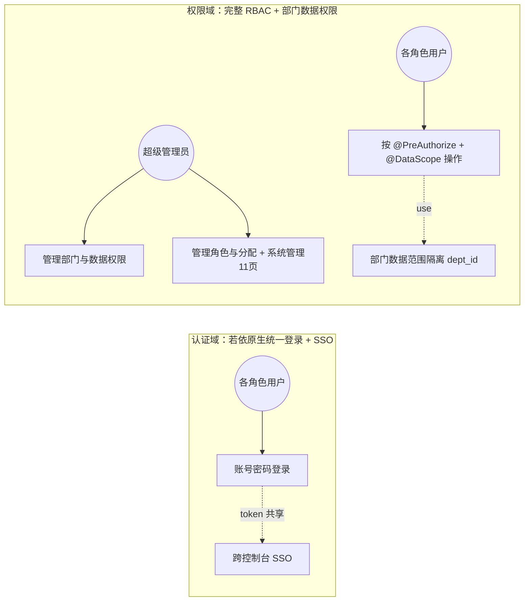
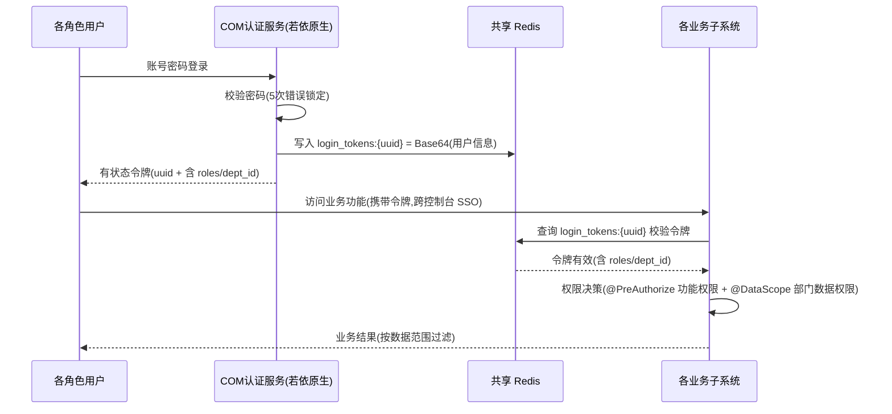

# 软件需求规格说明 - 公共功能（COM）分册

| 项目 | 内容 |
| --- | --- |
| 项目名称 | 认知行动平台（v1.0） |
| 文档版本 | V4.0 |
| 密级 | 内部使用 |
| 编制 | 石建国 |
| 编制日期 | 2026-07-21 |

---

## 1 引言

### 1.1 标识

本文件为「认知行动平台」公共功能（COM，COM（Common））的**软件需求规格说明分册**。它是《软件需求规格说明》总册（V4.2）按子系统拆分的组成部分，承载 公共功能 的全部功能需求（R-COM-001（1 项））。需求编号 `R-COM-NNN` 与总册一致，全程不变，作为需求双向追溯的依据。

### 1.2 文档概述

本分册章节安排：第 1 章引言；第 2 章引用文件；第 3 章 公共功能 功能需求（按子区域给出各 `R-COM-NNN` 需求块）。系统级共性内容（引言概述、术语缩略语、接口 EI/II、数据 DR、非功能 NR、约束 CON、合格性规定、附录）见《软件需求规格说明-总册》。

### 1.3 术语和缩略语

沿用《软件需求规格说明-总册》第 1.4 节术语与缩略语，本分册不再重复。

---

## 2 引用文件

| 文件 | 说明 |
| --- | --- |
| 《软件需求规格说明-总册》V4.2 | 系统级共性需求（引言/术语/接口/数据/非功能/约束/合格性/附录） |
| 《软件需求跟踪矩阵.xlsx》 | 需求双向追溯唯一权威源（`R-COM-NNN` 追溯链） |
| 《软件概要设计说明》V3.1 | COM 子系统功能模块设计（M-COM-NN） |
| 《软件详细设计说明-COM子系统》 | COM 子系统详细设计 |

---

## 3 公共功能（COM）功能需求

> 本节为 公共功能（COM）的全部功能需求，对应 R-COM-001（1 项）。需求编号 `R-COM-NNN` 不变，逐字搬迁自原《软件需求规格说明》。

---

### 用户认证与权限

**用户需求概述**：为各子系统提供统一的用户认证、基于角色的访问控制与部门数据权限管理，按若依（RuoYi-Vue-Plus）原生 `@DataScope` 注解基于部门 `dept_id` 做数据范围隔离，并支持跨控制台 SSO（V4.0 改写——原"组织管理 + 多组织隔离"模型作废，由若依原生部门数据权限替代，CON-16）。

**第①步 目标澄清**（工具：干系人多角度分析 ｜ 产物：子目标清单 ｜ 验收：是否穷举所有干系人的价值诉求）：①各子系统用户能统一登录认证（若依原生 + 有状态令牌 + 共享 Redis 校验）；②按角色做权限控制（若依完整 RBAC：多角色 + 菜单/按钮权限点 + @PreAuthorize）；③按部门 `dept_id` 做数据范围隔离（@DataScope 四级：全部/本部门/本部门及以下/仅本人）；④跨控制台 SSO（MC/OCC/SWM/系统管理 4 控制台令牌共享）。
**第②步 梳理场景**（工具：用例图 ｜ 产物：场景 ｜ 验收：是否穷举所有用户操作）

各角色的操作穷举：

| 角色 | 操作 |
|------|------|
| 超级管理员 | 管理部门与数据权限、管理角色（超级管理员/运营主管/运营人员/脚本开发者/审核人员/只读观察员）、分配用户角色、管理若依原生系统管理控制台 11 页（用户/角色/部门/登录策略/登录日志/菜单/岗位/字典/参数/通知/操作日志） |
| 各角色用户 | 账号密码登录（5 次错误锁定）、跨 4 控制台 SSO、按 @PreAuthorize 功能权限与 @DataScope 数据权限操作业务功能 |

---

**第③步 理清流程**（工具：时序图 ｜ 产物：需求范围 ｜ 验收：是否穷举相关子系统）

---

**第④步 理清流程-异常**（工具：流程图 ｜ 产物：异常场景 ｜ 验收：每个交互点是否都有异常分支）

| 交互点 | 异常分支 | 应对 |
|--------|---------|------|
| 用户 ↔ 认证服务 | 密码连续错误达 5 次 | 锁定账号（需超管解锁） |
| 用户 ↔ 认证服务 | 令牌登出/吊销 | 写入令牌黑名单，后续校验失败 |
| 业务 ↔ Redis | 令牌在共享 Redis 失效（过期/黑名单） | 返回 401，前端跳登录 |
| 业务 ↔ 权限服务 | 越权访问（功能或数据范围） | @PreAuthorize/@DataScope 拦截并审计 |

---

**第⑤步 列出规则**（工具：表格 ｜ 产物：验证点 ｜ 验收：规则是否可测、是否落到具体需求内）

| 规则 | 可测的验证点 | 归属子目标 |
|------|------------|-----------|
| 若依原生账号密码登录 | 用户以账号密码通过若依原生登录认证 | ①统一登录认证 |
| 有状态令牌 + 共享 Redis 校验 | 令牌 uuid 写入共享 Redis `login_tokens:{uuid}`，各子系统查 Redis 校验 | ①统一登录认证 |
| 跨控制台 SSO | 一次登录跨 MC/OCC/SWM/系统管理 4 控制台通用 | ④跨控制台 SSO |
| 完整 RBAC（@PreAuthorize） | 不同角色/不同菜单按钮权限点可见可操作的功能不同 | ②按角色权限控制 |
| 部门数据范围隔离（@DataScope） | 按 dept_id 控制"全部/本部门/本部门及以下/仅本人"四级可见数据 | ③部门数据范围隔离 |
| 5 次密码错误锁定 + 令牌黑名单 | 连续 5 次错误锁定账号；登出/吊销令牌入黑名单 | ①统一登录认证 |
| 系统管理控制台 11 页 | 若依原生 sys_user/sys_role/sys_dept/sys_menu/sys_dict 等 11 页 CRUD 可用 | ②按角色权限控制 |

---

**拆分结论**：一个端到端价值（统一认证与权限），不拆。编号 R-COM-001。四原则自检：足够小✓（认证+RBAC+@DataScope 数据权限单一职责）｜端到端✓（登录→令牌校验→权限决策→数据范围过滤）｜独立性✓（独立）｜可测性✓（登录认证/RBAC/@DataScope/SSO 可验）。

#### R-COM-001 用户认证与权限

**使用角色**：超级管理员（管理部门、角色、数据权限与系统管理 11 页）、各角色用户（登录与操作）。

**前置条件**：用户、角色与部门（sys_dept）数据已初始化；共享 Redis 可用。

**输入**：用户账号与密码、角色与权限配置（菜单/按钮权限点）、部门与成员信息（dept_id）。

**输出**：若依有状态登录令牌（uuid + Base64 用户信息存共享 Redis `login_tokens:{uuid}`，含 user_id/dept_id/roles）、@PreAuthorize + @DataScope 权限决策结果、部门结构。

**业务规则**：

| 规则 | 说明 |
|------|------|
| 若依原生登录认证 | 系统基于若依（RuoYi-Vue-Plus）原生登录（/login 校验 + 签发 /getInfo 取用户信息 /getRouters 取动态菜单），不引入 JWT 无状态令牌、不引入 com-auth-lib 共享验签库（CON-16） |
| 有状态令牌与共享 Redis 校验 | 登录成功下发若依有状态令牌（uuid + Base64 用户信息写入共享 Redis `login_tokens:{uuid}`），各子系统查共享 Redis 校验令牌有效性，不本地验签 |
| 跨控制台 SSO | 令牌跨 MC/OCC/SWM/系统管理 4 控制台共享，前端令牌存 localStorage，跳转控制台免登 |
| 5 次密码错误锁定 + 令牌黑名单 | 连续 5 次密码错误锁定账号（需超管解锁）；登出/吊销令牌写入黑名单，后续校验失败 |
| 完整 RBAC 权限（@PreAuthorize） | 系统基于若依原生完整 RBAC 进行功能权限决策——多角色 + sys_role/sys_role_menu/role_key + 菜单/按钮权限点 + @PreAuthorize 注解；角色包括超级管理员、运营主管、运营人员、脚本开发者、审核人员与只读观察员等 |
| 部门数据权限（@DataScope） | 系统基于若依原生 @DataScope 注解按部门 dept_id 进行数据范围隔离，支持"全部 / 本部门 / 本部门及以下 / 仅本人"四级（替代原多组织/多租户隔离模型，NR-C-01/02） |
| 系统管理控制台 11 页 | 系统管理控制台由若依原生承载 11 页：用户/角色/部门/登录策略/登录日志/菜单/岗位/字典/参数/通知/操作日志（对应 sys_user/sys_role/sys_dept/sys_menu/sys_dict 等表与配套服务） |

**异常场景**：登录密码连续错误达 5 次时锁定账号（需超管解锁）；令牌登出/吊销入黑名单后校验失败；令牌在共享 Redis 失效时返回 401 跳登录；越权访问（功能或数据范围）时由 @PreAuthorize/@DataScope 拦截并审计。

**验收标准**：若依原生登录认证可用，有状态令牌经共享 Redis 校验；跨控制台 SSO 一次登录跨 4 控制台通用；5 次密码错误锁定 + 令牌黑名单生效；完整 RBAC 权限决策可按 @PreAuthorize 角色与菜单/按钮权限点控制；@DataScope 部门数据范围隔离可按 dept_id 实现"全部/本部门/本部门及以下/仅本人"四级；系统管理控制台 11 页 CRUD 可用。

**关联接口**：II-16 COM 认证服务（M-COM-01，若依原生登录 + 有状态令牌签发 + 共享 Redis 校验 + 跨控制台 SSO）、II-17 COM 权限与部门管理（M-COM-02，完整 RBAC @PreAuthorize + @DataScope 部门数据权限 + 系统管理控制台 11 页）；各子系统统一调用。

> 说明：COM 子系统的一项用户需求已按"目标澄清 → 梳理场景 → 理清流程 → 理清流程-异常 → 列出规则"五步分析，并按"足够小、端到端、独立性、可测性"四原则校验，划分为 R-COM-001 共 1 个需求。

