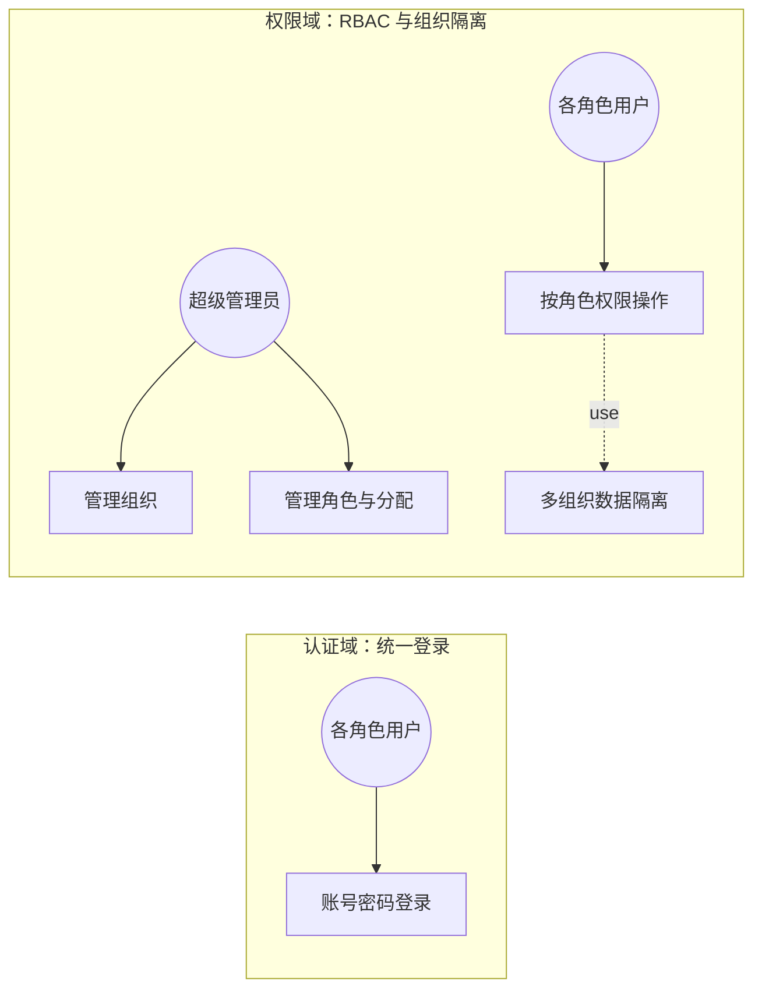
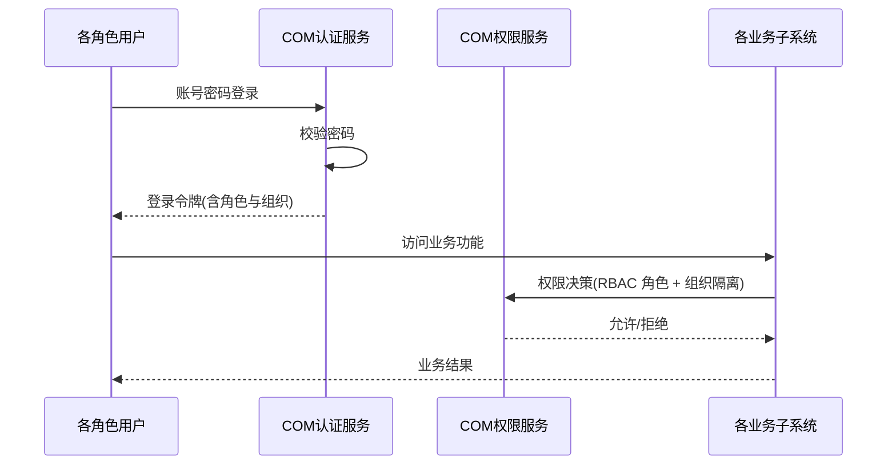

# 软件需求规格说明 - 公共功能（COM）分册

| 项目 | 内容 |
| --- | --- |
| 项目名称 | 认知行动平台（v1.0） |
| 文档版本 | V3.9 |
| 密级 | 内部使用 |
| 编制 | 石建国 |
| 编制日期 | 2026-07-17 |

---

## 1 引言

### 1.1 标识

本文件为「认知行动平台」公共功能（COM，COM（Common））的**软件需求规格说明分册**。它是《软件需求规格说明》总册（V3.9）按子系统拆分的组成部分，承载 公共功能 的全部功能需求（R-COM-001（1 项））。需求编号 `R-COM-NNN` 与总册一致，全程不变，作为需求双向追溯的依据。

### 1.2 文档概述

本分册章节安排：第 1 章引言；第 2 章引用文件；第 3 章 公共功能 功能需求（按子区域给出各 `R-COM-NNN` 需求块）。系统级共性内容（引言概述、术语缩略语、接口 EI/II、数据 DR、非功能 NR、约束 CON、合格性规定、附录）见《软件需求规格说明-总册》。

### 1.3 术语和缩略语

沿用《软件需求规格说明-总册》第 1.4 节术语与缩略语，本分册不再重复。

---

## 2 引用文件

| 文件 | 说明 |
| --- | --- |
| 《软件需求规格说明-总册》V3.9 | 系统级共性需求（引言/术语/接口/数据/非功能/约束/合格性/附录） |
| 《软件需求跟踪矩阵.xlsx》 | 需求双向追溯唯一权威源（`R-COM-NNN` 追溯链） |
| 《软件概要设计说明》V2.7 | COM 子系统功能模块设计（M-COM-NN） |
| 《软件详细设计说明-COM子系统》 | COM 子系统详细设计 |

---

## 3 公共功能（COM）功能需求

> 本节为 公共功能（COM）的全部功能需求，对应 R-COM-001（1 项）。需求编号 `R-COM-NNN` 不变，逐字搬迁自原《软件需求规格说明》。

---

### 用户认证与权限

**用户需求概述**：为各子系统提供统一的用户认证、基于角色的访问控制与组织管理，支持多组织的数据隔离。

**第①步 目标澄清**（工具：干系人多角度分析 ｜ 产物：子目标清单 ｜ 验收：是否穷举所有干系人的价值诉求）：①各子系统用户能统一登录认证；②按角色做权限控制（RBAC）；③多组织/多租户数据隔离。
**第②步 梳理场景**（工具：用例图 ｜ 产物：场景 ｜ 验收：是否穷举所有用户操作）

各角色的操作穷举：

| 角色 | 操作 |
|------|------|
| 超级管理员 | 管理组织、管理角色（超级管理员/运营主管/运营人员/脚本开发者/审核人员/只读观察员）、分配用户角色 |
| 各角色用户 | 账号密码登录、按角色权限操作业务功能 |

---

**第③步 理清流程**（工具：时序图 ｜ 产物：需求范围 ｜ 验收：是否穷举相关子系统）

---

**第④步 理清流程-异常**（工具：流程图 ｜ 产物：异常场景 ｜ 验收：每个交互点是否都有异常分支）

| 交互点 | 异常分支 | 应对 |
|--------|---------|------|
| 用户 ↔ 认证服务 | 密码错误超限 | 锁定账号 |
| 业务 ↔ 权限服务 | 越权访问 | 拦截并审计 |

---

**第⑤步 列出规则**（工具：表格 ｜ 产物：验证点 ｜ 验收：规则是否可测、是否落到具体需求内）

| 规则 | 可测的验证点 | 归属子目标 |
|------|------------|-----------|
| 账号密码登录 | 用户以账号密码通过登录认证 | ①统一登录认证 |
| RBAC 角色（超级管理员/运营主管/运营人员/脚本开发者/审核人员/只读观察员） | 不同角色可见可操作的功能不同 | ②按角色权限控制 |
| 多组织数据隔离 | A 组织用户不可见 B 组织数据 | ③多组织隔离 |
| 密码错误超限锁定 | 连续错误达上限后账号被锁定 | ①统一登录认证 |
| 越权访问拦截审计 | 越权请求被拦截且留有审计记录 | ②按角色权限控制 |

---

**拆分结论**：一个端到端价值（统一认证与权限），不拆。编号 R-COM-001。四原则自检：足够小✓（认证+RBAC+组织隔离单一职责）｜端到端✓（登录→权限决策→数据隔离）｜独立性✓（独立）｜可测性✓（登录认证/RBAC/隔离可验）。

#### R-COM-001 用户认证与权限

**使用角色**：超级管理员（管理组织与角色）、各角色用户（登录与操作）。

**前置条件**：用户与角色数据已初始化。

**输入**：用户账号与密码、角色与权限配置、组织与成员信息。

**输出**：认证令牌、权限决策结果、组织结构。

**业务规则**：

| 规则 | 说明 |
|------|------|
| 登录认证 | 系统进行账号密码登录认证 |
| RBAC 权限 | 系统基于角色的访问控制进行权限决策，角色包括超级管理员、运营主管、运营人员、脚本开发者、审核人员与只读观察员等 |
| 多组织隔离 | 系统对多组织或多租户进行数据隔离 |

**异常场景**：登录密码错误超限时锁定账号；越权访问时拦截并审计。

**验收标准**：登录认证可用；RBAC 权限决策可按角色控制；多组织数据可隔离且禁止跨组织访问。

**关联接口**：II-16 COM 认证服务（M-COM-01）、II-17 COM 权限与组织管理（M-COM-02）；各子系统统一调用。

> 说明：COM 子系统的一项用户需求已按"目标澄清 → 梳理场景 → 理清流程 → 理清流程-异常 → 列出规则"五步分析，并按"足够小、端到端、独立性、可测性"四原则校验，划分为 R-COM-001 共 1 个需求。

