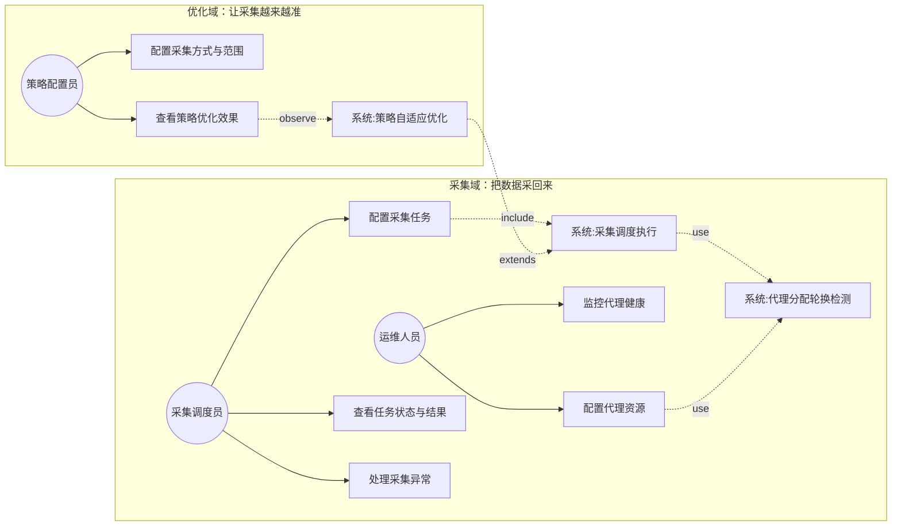
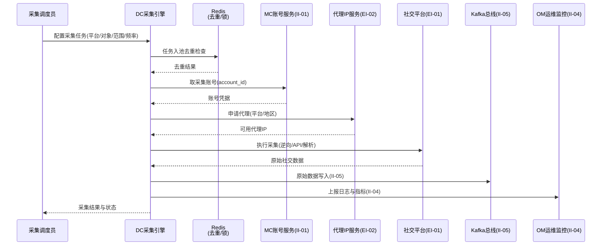
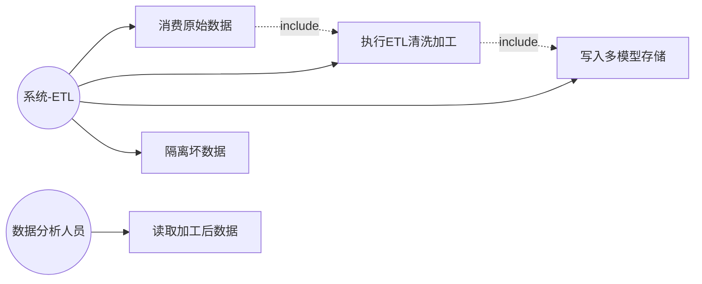
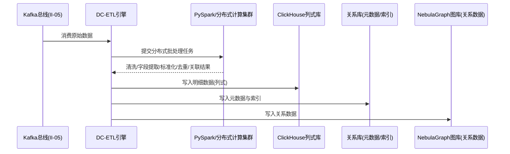
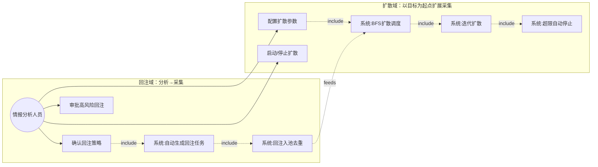
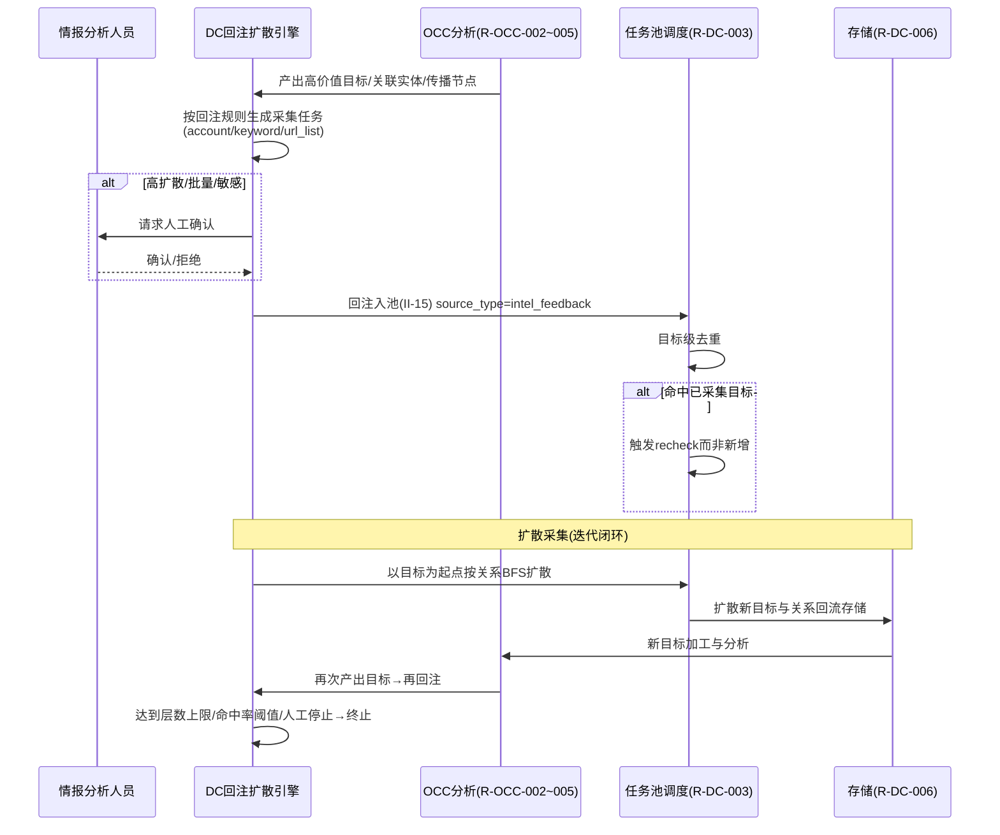

# 软件需求规格说明 - 数据爬取子系统（DC）分册

| 项目 | 内容 |
| --- | --- |
| 项目名称 | 认知作战平台（v1.0） |
| 文档版本 | V3.8 |
| 密级 | 内部使用 |
| 编制 | 石建国 |
| 编制日期 | 2026-07-15 |

---

## 1 引言

### 1.1 标识

本文件为「认知作战平台」数据爬取子系统（DC，DC（Data Crawler））的**软件需求规格说明分册**。它是《软件需求规格说明》总册（V3.8）按子系统拆分的组成部分，承载 数据爬取子系统 的全部功能需求（R-DC-001 ~ R-DC-008（8 项））。需求编号 `R-DC-NNN` 与总册一致，全程不变，作为需求双向追溯的依据。

### 1.2 文档概述

本分册章节安排：第 1 章引言；第 2 章引用文件；第 3 章 数据爬取子系统 功能需求（按子区域给出各 `R-DC-NNN` 需求块）。系统级共性内容（引言概述、术语缩略语、接口 EI/II、数据 DR、非功能 NR、约束 CON、合格性规定、附录）见《软件需求规格说明-总册》。

### 1.3 术语和缩略语

沿用《软件需求规格说明-总册》第 1.4 节术语与缩略语，本分册不再重复。

---

## 2 引用文件

| 文件 | 说明 |
| --- | --- |
| 《软件需求规格说明-总册》V3.8 | 系统级共性需求（引言/术语/接口/数据/非功能/约束/合格性/附录） |
| 《软件需求跟踪矩阵.xlsx》 | 需求双向追溯唯一权威源（`R-DC-NNN` 追溯链） |
| 《软件概要设计说明》V2.7 | DC 子系统功能模块设计（M-DC-NN） |
| 《软件详细设计说明-DC子系统》 | DC 子系统详细设计 |

---

## 3 数据爬取子系统（DC）功能需求

> 本节为 数据爬取子系统（DC）的全部功能需求，对应 R-DC-001 ~ R-DC-008（8 项）。需求编号 `R-DC-NNN` 不变，逐字搬迁自原《软件需求规格说明》。

---

### 社交媒体数据采集

**用户需求概述**：从目标社交平台采集原始数据，覆盖 TikTok、Instagram、Facebook、YouTube、X 等海外社交平台，作为后续分析的数据来源。本需求同时承担采集的执行调度（管理采集任务池、URL 与任务去重、调度队列与配额限流）以及面向海外社交平台的代理网络出口（代理 IP 池按平台与地区分配、定时轮换、可用性检测与失效剔除），保证采集动作稳定、不重复、不失控。爬虫集群的容器化部署与 Kafka、Redis 等基础组件的运行见"运行环境需求"。

以下按"目标澄清 → 梳理场景 → 理清流程 → 列出规则"对用户需求进行分析，分析完成后重新划分需求编号。

---

**第①步 目标澄清**（工具：干系人多角度分析 ｜ 产物：子目标清单 ｜ 验收：是否穷举所有干系人的价值诉求）

从不同干系人/角度分析"为什么要做这个需求"，每个子目标是一个独立的"为什么"：

| 序   | 子目标                                          | 干系人      |
| --- | -------------------------------------------- | -------- |
| 1   | 情报分析人员能拿到所需的海外社媒原始数据，作为后续分析研判（找人、看关系、判立场）的原料 | 数据消费方    |
| 2   | 采集调度员能把数据真正采回来，能配置和管理覆盖各平台的采集任务              | 采集执行方    |
| 3   | 采集过程能持续稳定，不被平台反爬和风控中断（采两三天就全被封则没有意义）         | 稳定性诉求    |
| 4   | 采集不重复、不失控、资源可控，不因无序采浪费代理/账号资源、不触发更大规模风控      | 可控性/成本诉求 |
| 5   | 采集策略能随平台反爬升级自适应优化，长周期内采集有效率不持续下滑             | 长期有效性诉求  |

---

**第②步 梳理场景**（工具：用例图 ｜ 产物：场景 ｜ 验收：是否穷举所有用户操作）

各角色的操作穷举：

| 角色     | 操作                                               |
| ------ | ------------------------------------------------ |
| 采集调度员  | 配置采集任务（平台/对象/范围/频率/采集方式）、查看/管理任务状态、查看采集结果、处理采集异常 |
| 策略配置员  | 配置采集方式与范围、查看/调整采集策略、查看策略优化效果                     |
| 运维人员   | 配置代理资源（VPS 链路）、配置平台与地区代理分配策略、监控代理健康、处理代理失效       |
| 系统（自动） | 执行采集调度、代理分配与轮换、代理可用性检测、策略自优化                     |

---

**第③步 理清流程**（工具：时序图 ｜ 产物：需求范围 ｜ 验收：是否穷举相关子系统）

采集执行的正常流程涉及 6 个子系统/组件，每个都是流程的必要参与者：

注：任务池的另一个任务来源是情报回注（II-15，来自后续"情报驱动闭环采集"需求），它复用同一条调度链路与同一套去重、配额约束。

---

**第④步 理清流程-异常**（工具：流程图 ｜ 产物：异常场景 ｜ 验收：每个交互点是否都有异常分支）

按交互点穷举异常分支，其中前 5 项全部服务于"让采集继续"，是采集域内部的健壮性保障；第 6 项属优化域自身的健壮性问题：

| 交互点 | 异常分支 | 应对 |
|--------|---------|------|
| DC ↔ 社交平台 | 逆向接口失效或改版 | 告警 + 切换备用采集方式 |
| DC ↔ 社交平台 | API 限流 | 按限额退避重试 |
| DC ↔ 代理 | 单个代理失效/检测超时 | 剔除该代理 + 补充新代理 |
| DC ↔ 代理 | 代理全部失效 | 告警 + 暂停受影响采集任务 |
| DC ↔ MC 账号 | 账号被封 | 切换备用账号 |
| DC ↔ 策略优化 | 指标不足或波动过大 | 维持上一稳定策略 + 告警（防抖动） |

---

**第⑤步 列出规则**（工具：表格 ｜ 产物：验证点 ｜ 验收：规则是否可测、是否落到具体需求内）

| 规则                  | 可测的验证点            | 归属子目标  |
| ------------------- | ----------------- | ------ |
| IG 逆向采集推荐/人物/Reels  | 给定 IG 目标，能采到这三类数据 | ①②采到数据 |
| TikTok/FB/X 逆向采集    | 给定目标，能采到数据        | ①②采到数据 |
| 采集用代理 + 维护账号应对限制    | 无代理/账号时采集失败，有则成功  | ③采得稳   |
| 代理按平台地区分配 + 定时轮换    | 代理分配符合策略、按周期轮换    | ③采得稳   |
| 代理可用性检测 + 失效剔除      | 注入失效代理，被剔除且补新     | ③采得稳   |
| 任务池 Redis 去重 + 分布式锁 | 重复任务不入池、并发不冲突     | ④有序可控  |
| 范围/频率/并发配额限流        | 超配额任务被限流          | ④有序可控  |
| 支撑情报回注入池去重（II-15）   | 回注任务经同一去重与配额约束    | ④有序可控  |
| 基于封禁率/成功率/反爬信号主动调策略 | 指标变化后策略优先级/频率被调整  | ⑤越采越准  |
| 指标不足/波动维持稳定 + 告警    | 指标不足时策略不变且告警      | ⑤越采越准  |

---

**拆分结论（含四原则校验）**

五步分析的产物共同指向：子目标 ①②③④ 构成一条端到端价值链——"采集调度员下发任务 → 经账号/代理/去重/限流 → 采到数据进 Kafka → 上报 OM"；子目标 ⑤ 是独立价值——使用角色不同（策略配置员）、验收独立（策略能否基于指标主动调整）、独立性满足（策略优化失效时基本采集仍能运行）。

初步按"采集价值链(①②③④) + 策略优化(⑤)"拆为 2 个需求后，用拆分四原则（足够小、端到端、独立性、可测性）逐一校验，发现采集侧需求在"足够小"上不达标——它把多平台逆向采集、代理池全生命周期、任务调度去重限流、多类异常应对塞进同一个需求，范围与复杂度过大，无法独立交付与验收。

一个端到端价值可拆成多个端到端可用的增量，每个增量都让用户感知到价值提升。据此把采集价值链进一步拆为 3 个端到端增量，连同策略优化共 4 个需求。校验结果如下：

| 需求                 | 足够小                | 端到端                 | 独立性                | 可测性            |
| ------------------ | ------------------ | ------------------- | ------------------ | -------------- |
| R-DC-001 多平台数据采集   | ✅ 聚焦平台×采集方式与基本异常应对 | ✅ 下发任务→采到数据→进 Kafka | ✅ 无依赖（MVP）         | ✅ 各平台可采到数据     |
| R-DC-002 代理 IP 池管理 | ✅ 聚焦代理池全生命周期       | ✅ 配置代理→代理可用且持续健康    | ✅ 建立在 001 之上，可单独交付 | ✅ 代理分配/轮换/剔除可验 |
| R-DC-003 采集任务调度与限流 | ✅ 聚焦任务池/去重/调度/限流   | ✅ 任务入池→有序调度→不重复不失控  | ✅ 建立在 001 之上，可单独交付 | ✅ 去重/配额可验      |
| R-DC-004 采集策略自适应优化 | ✅ 聚焦策略主动调整         | ✅ 看指标→调策略→成功率不退化    | ✅ 建立在 001 之上       | ✅ 策略随指标调整可验    |

依赖关系：R-DC-002、R-DC-003、R-DC-004 均建立在 R-DC-001 之上（R-DC-001 含采集时的基本代理使用与账号使用，R-DC-002 专门管理代理池的分配/轮换/检测/剔除）。三者之间相互独立，可并行推进。

#### R-DC-001 多平台数据采集

**需求目的**：从 TikTok、Instagram、Facebook、YouTube、X 等海外社交平台采集原始社交数据（用户信息、内容、互动数据、关系数据），作为后续分析与情报的数据来源。采集时使用代理 IP 与维护账号应对平台反爬与风控，并把采集到的原始数据经 Kafka 总线流转。

**使用角色**：数据采集调度员（配置与管理采集任务）。

**前置条件**：目标平台采集手段（逆向、模拟点击、官方 API、网页解析）已就绪；代理 IP 与维护账号可用（账号由 MC 账号权威源提供，见 II-01，代理池由 R-DC-002 管理）；爬虫集群与 Kafka 等基础组件已按运行环境需求部署可用。

**输入**：目标平台标识与采集任务（采集对象、范围、频率、使用的采集方式）。

**输出**：采集到的原始社交数据（经 Kafka 总线 II-05 流转）。

**业务规则**：

| 规则     | 说明                                                      |
| ------ | ------------------------------------------------------- |
| 平台采集方式 | Instagram 逆向采集推荐、人物、Reels；TikTok、Facebook 逆向采集；X 逆向采集   |
| 防封手段   | 采集时使用代理 IP 与维护账号，应对平台访问限制（代理来自 R-DC-002 代理池，账号来自 II-01） |

**异常场景**：逆向接口失效或改版时告警并切换备用采集方式；API 限流时按限额退避重试；账号被封时切换备用账号。

**验收标准**：各平台可通过对应采集手段获取数据；采集过程可使用代理与账号应对访问限制；采集异常可告警并切换备选手段。

**关联接口**：EI-01 社交平台交互、II-01 账号服务（入，取采集账号）、II-04 日志指标上报（至 OM）、II-05 Kafka 总线（出）。

#### R-DC-002 代理 IP 池管理

**需求目的**：面向海外社交平台采集提供代理网络出口，管理代理 IP 池的分配、轮换、可用性检测与失效剔除，保证采集出口持续稳定可用、降低单 IP 被风控概率。

**使用角色**：系统运维人员（配置代理资源、监控代理健康）。

**前置条件**：VPS 代理链路对接可用（EI-02）；R-DC-001 采集已运行、对代理有实际使用。

**输入**：代理 IP 与 VPS 代理链路配置、平台与地区代理分配策略。

**输出**：可用代理 IP 列表（供 R-DC-001 采集使用）、代理可用性状态、轮换日志。

**业务规则**：

| 规则       | 说明                      |
| -------- | ----------------------- |
| 按平台与地区分配 | 代理池对接 VPS 链路，按平台与地区分配代理 |
| 定时轮换     | 代理定时轮换，降低单 IP 被风控概率     |
| 可用性检测    | 对代理进行可用性检测              |
| 失效剔除     | 检测失败/超时的代理剔除并补充新代理      |

**异常场景**：代理全部失效时告警并暂停受影响的采集任务；代理检测超时时剔除该代理并补充新代理。

**验收标准**：代理按策略分配、定时轮换并自动剔除失效节点；全部失效可告警并暂停受影响采集任务。

**关联接口**：EI-02 代理 IP 服务、II-04 日志指标上报（至 OM）。

#### R-DC-003 采集任务调度与限流

**需求目的**：对采集任务进行有序调度，保证采得不重复、不丢失、不失控——基于 Redis 实现任务与 URL 去重、调度队列与分布式锁，并对采集范围、频率、并发设配额上限超限自动限流，支撑情报回注入池去重与配额约束（II-15）。

**使用角色**：数据采集调度员（查看与管理任务调度状态与队列）。

**前置条件**：R-DC-001 采集已运行；Redis 基础组件已按运行环境需求部署可用。

**输入**：采集任务（来自 R-DC-001 任务配置与 II-15 情报回注）、采集配额参数（范围/频率/并发上限）。

**输出**：调度指令与去重结果、任务队列状态。

**业务规则**：

| 规则   | 说明                                          |
| ---- | ------------------------------------------- |
| 任务去重 | 维护采集任务池，基于 Redis 实现 URL 与任务去重、调度队列与分布式锁     |
| 配额限流 | 对采集范围、频率、并发设配额上限，超限自动限流                     |
| 回注约束 | 支撑情报回注入池去重与配额约束（II-15），回注任务与常规任务受同一套去重与配额约束 |

**异常场景**：任务队列积压时告警。

**验收标准**：任务调度与去重功能生效且配额限流可对采集范围、频率、并发设上限；情报回注任务经同一去重与配额约束。

**关联接口**：II-05 Kafka 总线（入，消费原始数据协同）、II-15 情报回注采集接口（入，回注任务来源）。

#### R-DC-004 采集策略自适应优化

**需求目的**：基于历史采集指标（封禁率、采集成功率、反爬升级信号、各采集手段的有效率）对采集策略进行主动调整，使采集策略随平台反爬强度变化自适应演进，而非仅被动应对单次异常，保证长周期内采集成功率不退化。

**使用角色**：采集策略配置人员（查看策略优化效果、设定优化边界）。

**前置条件**：R-DC-001 采集已运行并持续产出历史采集指标。

**输入**：历史采集指标（封禁率、采集成功率、反爬升级信号、各采集手段有效率）、优化边界参数。

**输出**：策略调整决策（采集手段优先级排序、请求频率与并发调节、代理与账号选择策略优化）、策略调整记录与效果对比。

**业务规则**：

| 规则 | 说明 |
|------|------|
| 主动优化 | 基于历史采集指标主动调整采集手段优先级排序、请求频率与并发调节、代理与账号选择策略 |
| 自适应演进 | 策略随平台反爬强度变化自适应演进，非仅被动应对单次异常 |
| 稳定保障 | 指标不足或波动过大时维持上一稳定策略并告警，避免策略频繁抖动 |

**异常场景**：策略自优化指标不足或波动过大时维持上一稳定策略并告警，避免策略频繁抖动。

**验收标准**：采集策略可基于历史采集指标进行主动调整；策略调整可在指标不足或波动过大时维持稳定并告警。

**关联接口**：II-04 日志指标上报（至 OM）。

> 说明：DC 子系统的三项用户需求（社交媒体数据采集、数据处理与存储、情报驱动采集与目标扩散）均已按"目标澄清 → 梳理场景 → 理清流程 → 理清流程-异常 → 列出规则"五步分析，并按"足够小、端到端、独立性、可测性"四原则重新划分为 R-DC-001 ~ R-DC-008 共 8 个需求（原「数据分析与情报」R-DC-007~010 已移至 OCC 子系统「目标识别与维护」下，重编号为 R-OCC-002~005；原 R-DC-011/012 情报回注与目标扩散顺延为 R-DC-007/008）。

### 数据处理与存储

**用户需求概述**：对采集到的原始数据进行清洗加工并持久化存储，提供标准的大数据 ETL 链路，完成数据的抽取、转换与加载。处理结果写入 ClickHouse 列式库（明细）、关系库（元数据/索引）与 NebulaGraph 图库（关系数据），供后续分析与检索使用。

---

**第①步 目标澄清**（工具：干系人多角度分析 ｜ 产物：子目标清单 ｜ 验收：是否穷举所有干系人的价值诉求）

| 序 | 子目标 | 干系人 |
|----|--------|--------|
| 1 | 系统能把原始数据清洗成结构化、标准化的干净数据 | 数据生产方（系统自动）|
| 2 | 清洗后的数据能可靠地落入不同的存储（ClickHouse/关系库/NebulaGraph），供下游按需读取 | 数据消费方（分析人员、后续分析需求）|

---

**第②步 梳理场景**（工具：用例图 ｜ 产物：场景 ｜ 验收：是否穷举所有用户操作）

| 角色 | 操作 |
|------|------|
| 系统（自动） | 消费 Kafka 原始数据、执行 ETL 清洗加工、写入多模型存储、隔离坏数据 |
| 数据分析人员 | 查询/读取加工后的结构化数据（本需求中仅作为消费方，具体分析操作见下一需求）|

---

**第③步 理清流程**（工具：时序图 ｜ 产物：需求范围 ｜ 验收：是否穷举相关子系统）

---

**第④步 理清流程-异常**（工具：流程图 ｜ 产物：异常场景 ｜ 验收：每个交互点是否都有异常分支）

| 交互点 | 异常分支 | 应对 |
|--------|---------|------|
| ETL ↔ Spark | 计算节点失败 | 任务自动重试或转移 |
| ETL ↔ 原始数据 | 数据格式异常 | 隔离坏数据并记录 |
| ETL ↔ ClickHouse/关系库 | 写入失败 | 数据进入重试队列 |

---

**第⑤步 列出规则**（工具：表格 ｜ 产物：验证点 ｜ 验收：规则是否可测、是否落到具体需求内）

| 规则 | 可测的验证点 | 归属子目标 |
|------|------------|-----------|
| 分布式批处理（PySpark） | 给定批量原始数据，经分布式计算完成清洗 | ①清洗成干净数据 |
| 清洗内容（字段提取/格式标准化/去重/关联） | 输出数据字段完整、格式统一、无重复 | ①清洗成干净数据 |
| 结果写 ClickHouse 列式库 | 明细数据可从 ClickHouse 读回 | ②落入多存储 |
| 元数据/索引写关系库 | 可按关系库索引检索到对应明细 | ②落入多存储 |
| 关系数据写图库 | 关系数据可在图库中查询 | ②落入多存储 |

---

**拆分结论（含四原则校验）**

子目标 ①（清洗）与 ②（落库）是串行但各自端到端可验收的两个环节：清洗的产物（干净数据）本身可验证（字段/格式/去重是否达标），落库的产物（多模型存储可读）本身也可验证。两者异常分支独立（节点失败重试 vs 写入重试）。校验如下：

| 需求                | 足够小         | 端到端         | 独立性          | 可测性      |
| ----------------- | ----------- | ----------- | ------------ | -------- |
| R-DC-005 数据清洗加工   | ✅ 聚焦 ETL 清洗 | ✅ 原始数据→干净数据 | ✅ 独立         | ✅ 清洗结果可验 |
| R-DC-006 多模型持久化存储 | ✅ 聚焦多存储落库   | ✅ 干净数据→可读存储 | ✅ 建立在 005 之上 | ✅ 各库可读可验 |
|                   |             |             |              |          |

#### R-DC-005 数据清洗加工

**需求目的**：对经 Kafka 总线流入的采集原始数据进行分布式批处理清洗，完成字段提取、格式标准化、去重与关联，产出结构化的干净数据，作为持久化存储与分析的输入。

**使用角色**：系统（自动执行 ETL 流程）。

**前置条件**：PySpark 分布式计算集群可用；R-DC-001 采集已产出原始数据并经 Kafka 总线（II-05）流转。

**输入**：采集到的原始数据（经 Kafka 总线 II-05 消费）。

**输出**：清洗加工后的结构化数据。

**业务规则**：

| 规则 | 说明 |
|------|------|
| 分布式批处理 | 基于 PySpark 进行分布式批处理计算 |
| 清洗内容 | 完成数据清洗、字段提取、格式标准化、去重与关联 |

**异常场景**：计算节点失败时任务自动重试或转移；数据格式异常时隔离坏数据并记录。

**验收标准**：原始数据可经分布式计算完成清洗与标准化；处理过程对节点失败具备重试能力；坏数据被隔离并记录。

**关联接口**：II-05 Kafka 总线（入，消费原始数据）。

#### R-DC-006 多模型持久化存储

**需求目的**：将清洗后的结构化数据按数据特征持久化到不同的存储模型——明细数据入 ClickHouse 列式库、元数据与索引入关系库、关系数据入 NebulaGraph 图库，供后续分析与检索按需读取。

**使用角色**：系统（自动写入）、数据分析人员（消费加工后的数据）。

**前置条件**：R-DC-005 清洗加工已产出结构化数据；ClickHouse、关系型数据库与 NebulaGraph 图库可写入。

**输入**：R-DC-005 产出的清洗加工后结构化数据。

**输出**：持久化于 ClickHouse（明细）、关系库（元数据/索引）、NebulaGraph 图库（关系数据）的可读数据。

**业务规则**：

| 规则 | 说明 |
|------|------|
| 列式存储 | 处理结果写入 ClickHouse 列式数据库 |
| 元数据与索引 | 元数据与索引写入关系型数据库 |
| 关系数据 | 关系数据写入 NebulaGraph 图库 |

**异常场景**：写入 ClickHouse 或关系库失败时数据进入重试队列。

**验收标准**：清洗后结果可正确写入 ClickHouse、关系库与 NebulaGraph 图库；写入失败可进入重试队列重试。

**关联接口**：无外部接口，为 DC 内部存储层。

### 情报驱动采集与目标扩散

**用户需求概述**：打通"分析→采集"反向驱动链路，使 OCC 数据分析与情报（R-OCC-002~005）产出的目标个体、关联实体与传播节点能够自动或经人工确认后回注 DC 采集任务池（经 II-15 接口），并支持以已采集目标为起点按关系（关注/粉丝/互动/转发链/评论链）逐层扩散采集，形成"发现线索→定向扩散采集→锁定目标"的情报驱动闭环。本能力区分两类扩散：DC 侧的"目标扩散采集"（图扩展式爬取，本期实现）与 OCC 侧的"扩散趋势预判"（传播预测分析，见附录"本期暂不实现的 OCC 能力"，本期不做）。

---

**第①步 目标澄清**（工具：干系人多角度分析 ｜ 产物：子目标清单 ｜ 验收：是否穷举所有干系人的价值诉求）

| 序 | 子目标 | 干系人 |
|----|--------|--------|
| 1 | 分析产出的高价值目标能自动回流成采集任务（把"分析→采集"链路打通，让情报驱动采集） | 情报分析人员、系统下游 |
| 2 | 回注的采集不重复采已采过的目标，避免浪费 | 成本/可控性诉求 |
| 3 | 高风险（高扩散/批量/敏感）回注有人把闸，防止采集范围失控 | 情报分析人员、可控性诉求 |
| 4 | 能以已采集目标为起点，按关系逐层扩散采集新目标，把目标网络的边采全 | 情报分析人员 |
| 5 | 扩散可控、可终止，达到上限自动停，不无限蔓延 | 可控性诉求 |

---

**第②步 梳理场景**（工具：用例图 ｜ 产物：场景 ｜ 验收：是否穷举所有用户操作）

| 角色 | 操作 |
|------|------|
| 情报分析人员 | 确认回注策略（自动/人工确认）、审批高风险回注（人工确认闸门）、配置扩散参数（关系类型/层数/去重范围）、启动/停止扩散、查看扩散进度 |
| 系统（自动） | 按规则自动生成回注任务、回注入池去重、触发复查任务、执行 BFS 扩散调度、迭代扩散、达到上限自动停止 |

---

**第③步 理清流程**（工具：时序图 ｜ 产物：需求范围 ｜ 验收：是否穷举相关子系统）

---

**第④步 理清流程-异常**（工具：流程图 ｜ 产物：异常场景 ｜ 验收：每个交互点是否都有异常分支）

| 交互点 | 异常分支 | 应对 |
|--------|---------|------|
| 回注入池去重 | 去重后无新增目标 | 记录并跳过 |
| 人工确认闸门 | 确认超时未响应 | 按默认策略（不入池）处理并记录 |
| 扩散层数/目标数 | 超限或超阈值 | 自动停止并告警 |
| 扩散关系数据 | 缺失或不完整 | 降级为已采集层的部分结果 |

---

**第⑤步 列出规则**（工具：表格 ｜ 产物：验证点 ｜ 验收：规则是否可测、是否落到具体需求内）

| 规则 | 可测的验证点 | 归属子目标 |
|------|------------|-----------|
| 按规则自动生成定向采集任务（account/keyword/url_list） | 分析产出能生成对应类型任务 | ①回注打通 |
| 回注任务携带 source_type=intel_feedback 与来源情报标识 | 任务元数据含来源标识（可审计） | ①回注打通 |
| 回注入池目标级去重 | 重复目标不入池 | ②不重复 |
| 命中已采集触发 recheck 而非新增 | 已采目标触发复查类任务 | ②不重复 |
| 高扩散/批量/敏感回注经人工确认闸门 | 高风险回注未经确认不入池 | ③有人把闸 |
| 以目标为起点按关系类型+层数 BFS 图扩展 | 能扩散采集到新目标 | ④扩散采全 |
| 每层新节点去重后生成新任务 | 扩散新节点不重复采集 | ④扩散采全 |
| 层数/单层节点数/总目标数上限超限停止告警 | 超上限扩散自动停止 | ⑤可控终止 |
| 受 R-DC-003 配额限流约束 | 扩散任务不超配额 | ⑤可控终止 |

---

**拆分结论（含四原则校验）**

本需求含两条流程不同的价值链：① 情报回注（分析产出→生成任务→回注入池→去重，单向驱动，把"分析→采集"打通）；② 目标扩散采集（以已采集目标为起点按关系 BFS 图扩展，经存储→分析→再回注形成迭代闭环）。回注是扩散的前提与触发源（II-15 接口先回注入池，扩散再以目标为起点展开），但两者异常分支独立（回注去重/确认超时 vs 扩散超限/关系缺失），可分别独立交付与验收。校验如下：

| 需求 | 足够小 | 端到端 | 独立性 | 可测性 |
|------|--------|--------|--------|--------|
| R-DC-007 情报回注采集 | ✅ 聚焦回注打通 | ✅ 分析产出→入池任务 | ✅ 独立（单向驱动） | ✅ 回注/去重/闸门可验 |
| R-DC-008 目标扩散采集 | ✅ 聚焦 BFS 扩散闭环 | ✅ 起点→扩散→回流→再回注 | ✅ 建立在 007 之上 | ✅ 扩散/超限/迭代可验 |

> 区分说明：本需求的"目标扩散采集"是 DC 侧图扩展采集（把目标网络的边采全）；OCC 侧的"扩散趋势预判"是传播预测分析（预判传播会怎么扩散），本期不做（见附录）。

#### R-DC-007 情报回注采集

**需求目的**：打通"分析→采集"反向驱动链路，使分析产出的高价值目标个体、关联实体与传播节点能按回注规则自动生成定向采集任务回注任务池，经目标级去重避免重复采集，高风险回注经人工确认闸门，形成可审计的情报驱动采集入口。

**使用角色**：情报分析人员（确认回注策略、审批高风险回注）、系统（自动生成回注任务与去重）。

**前置条件**：OCC 分析结果可读（R-OCC-002~005，经 II-15 接口提供）；R-DC-003 任务池与调度可用。

**输入**：分析产出的目标个体集合与关联实体（来自 OCC 分析 R-OCC-002~005，经 II-15 接口）、回注规则（自动/人工确认、优先级）。

**输出**：回注生成的采集任务（写入 task_pool，携带 source_type=intel_feedback 与来源情报标识）、回注审计记录。

**业务规则**：

| 规则 | 说明 |
|------|------|
| 自动生成回注任务 | 分析产出的高价值目标个体、关联实体、传播节点，按回注规则自动生成定向采集任务（account/keyword/url_list 类型） |
| 可审计标识 | 回注任务携带 source_type=intel_feedback 与来源情报标识，满足情报可审计性 |
| 入池目标级去重 | 回注任务经 R-DC-003 的入池目标级去重，避免对已采集目标重复下发 |
| 命中触发复查 | 命中已采集目标时触发复查类任务（recheck）而非新增采集 |
| 人工确认闸门 | 对高扩散层数、大规模批量或敏感目标的回注，须经情报分析人员确认后方可入池 |

**异常场景**：回注任务入池去重后无新增目标时记录并跳过；人工确认超时未响应时按默认策略（不入池）处理并记录。

**验收标准**：分析产出的目标可回注生成采集任务并写入任务池；回注任务经目标级去重后不重复采集已采集目标；高扩散/批量/敏感回注经人工确认闸门。

**关联接口**：II-15 情报回注采集接口（OCC 分析 R-OCC-002~005 → DC 任务池，跨子系统回注闭环）。

#### R-DC-008 目标扩散采集

**需求目的**：以已采集目标为起点，按指定关系类型（关注/粉丝/互动/转发链/评论链）与扩散层数进行图扩展式采集，每层发现的新节点经去重后生成新采集任务，形成广度优先的目标网络扩展；扩散新目标经存储与分析后可再次触发回注与进一步扩散，直至达到上限或人工停止，形成可控的迭代扩散闭环。

**使用角色**：情报分析人员（配置扩散参数、启动/停止扩散）、系统（自动 BFS 扩散调度与迭代）。

**前置条件**：R-DC-007 情报回注已可入池；R-DC-006 关系数据已入图数据库；R-DC-003 配额限流可用。

**输入**：扩散起点目标与扩散参数（关系类型、层数、去重范围）。

**输出**：扩散采集的新目标与关系数据（回流至 R-DC-006 存储）、扩散审计记录。

**业务规则**：

| 规则 | 说明 |
|------|------|
| 图扩展采集 | 以已采集目标为起点，按指定关系类型（关注/粉丝/互动/转发链/评论链）与扩散层数进行图扩展式采集 |
| 逐层去重 | 每层发现的新节点经去重后生成新采集任务，形成广度优先的目标网络扩展 |
| 迭代扩散闭环 | 扩散采集的新目标经 R-DC-005 加工与 R-DC-006 存储及 OCC 分析（R-OCC-002~005）后，可再次触发回注与进一步扩散 |
| 可控终止 | 直至达到扩散层数上限、去重命中率阈值或人工停止，形成可控的迭代扩散 |
| 配额约束 | 扩散任务受 R-DC-003 配额限流约束，扩散层数、单层节点数、总目标数设上限 |

**异常场景**：扩散层数超限或目标数超阈值时自动停止并告警；扩散关系数据缺失或不完整时降级为已采集层的部分结果。

**验收标准**：以目标为起点可按关系类型与层数扩散采集新目标；扩散采集受配额与层数上限约束，超限自动停止并告警；扩散新目标可回流存储并再次触发回注，形成迭代扩散闭环；以人工抽检方式核验，扩散采集的新目标有效率（经核验确属目标网络有效节点的比例）不低于 80%，噪声率（无效/不相关节点占比）不高于 20%（抽检样本量与门槛在详细设计阶段确定）。

**关联接口**：II-15 情报回注采集接口（迭代回流）、II-05 Kafka 总线（扩散新数据流转）。

