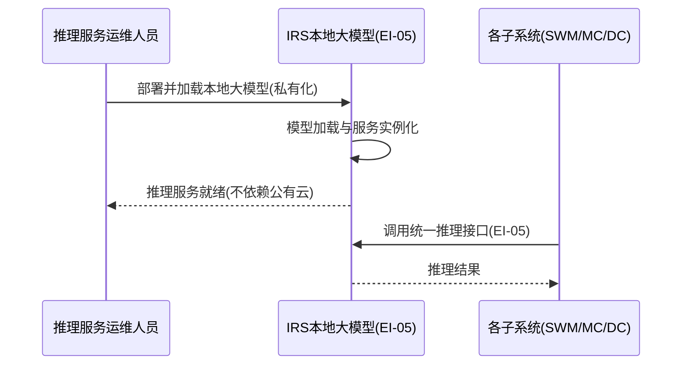

# 软件需求规格说明 - 私有化大模型部署（IRS）分册

| 项目 | 内容 |
| --- | --- |
| 项目名称 | 认知作战平台（v1.0） |
| 文档版本 | V3.8 |
| 密级 | 内部使用 |
| 编制 | 石建国 |
| 编制日期 | 2026-07-15 |

---

## 1 引言

### 1.1 标识

本文件为「认知作战平台」私有化大模型部署（IRS，IRS（Inference Service））的**软件需求规格说明分册**。它是《软件需求规格说明》总册（V3.8）按子系统拆分的组成部分，承载 私有化大模型部署 的全部功能需求（R-IRS-001（1 项））。需求编号 `R-IRS-NNN` 与总册一致，全程不变，作为需求双向追溯的依据。

### 1.2 文档概述

本分册章节安排：第 1 章引言；第 2 章引用文件；第 3 章 私有化大模型部署 功能需求（按子区域给出各 `R-IRS-NNN` 需求块）。系统级共性内容（引言概述、术语缩略语、接口 EI/II、数据 DR、非功能 NR、约束 CON、合格性规定、附录）见《软件需求规格说明-总册》。

### 1.3 术语和缩略语

沿用《软件需求规格说明-总册》第 1.4 节术语与缩略语，本分册不再重复。

---

## 2 引用文件

| 文件 | 说明 |
| --- | --- |
| 《软件需求规格说明-总册》V3.8 | 系统级共性需求（引言/术语/接口/数据/非功能/约束/合格性/附录） |
| 《软件需求跟踪矩阵.xlsx》 | 需求双向追溯唯一权威源（`R-IRS-NNN` 追溯链） |
| 《软件概要设计说明》V2.7 | IRS 子系统功能模块设计（M-IRS-NN） |
| 《软件详细设计说明-IRS子系统》 | IRS 子系统详细设计 |

---

## 3 私有化大模型部署（IRS）功能需求

> 本节为 私有化大模型部署（IRS）的全部功能需求，对应 R-IRS-001（1 项）。需求编号 `R-IRS-NNN` 不变，逐字搬迁自原《软件需求规格说明》。

---


私有化大模型部署是系统的底层推理基础设施（非业务子系统），职责是部署本地大模型并提供推理调用，使全系统的 AI 推理不依赖外部公有云。它向上为舆情作战、蜂群智能体、数据爬取等子系统提供统一的本地大模型推理能力，本身不参与业务编排。

### 本地大模型部署

**用户需求概述**：在私有化环境中部署本地大模型，构建系统的底座推理能力，使全系统的 AI 推理不依赖外部公有云，供各子系统统一调用。

**第①步 目标澄清**（工具：干系人多角度分析 ｜ 产物：子目标清单 ｜ 验收：是否穷举所有干系人的价值诉求）：①大模型能在私有化环境部署并对外提供推理调用；②部署不依赖外部公有云。
**第②步 梳理场景**（工具：用例图 ｜ 产物：场景 ｜ 验收：是否穷举所有用户操作）

各角色的操作穷举：

| 角色 | 操作 |
|------|------|
| 推理服务运维人员 | 部署本地大模型、加载/更新模型、监控推理服务健康 |
| 各子系统 | 通过统一接口调用本地推理（EI-05） |

```mermaid
flowchart LR
  subgraph 部署域["部署域：私有化部署加载"]
    A1((推理服务运维人员))
    UC1[部署本地大模型]
    UC2[加载/更新模型]
    UC3[监控推理服务健康]
    A1 --> UC1 & UC2 & UC3
  end
  subgraph 调用域["调用域：统一推理接口"]
    A2((各子系统))
    UC4[系统:提供统一推理接口(EI-05)]
    UC5[系统:不依赖外部公有云]
    A2 --> UC4
    UC4 -. use .-> UC5
  end
```

---

**第③步 理清流程**（工具：时序图 ｜ 产物：需求范围 ｜ 验收：是否穷举相关子系统）



---

**第④步 理清流程-异常**（工具：流程图 ｜ 产物：异常场景 ｜ 验收：每个交互点是否都有异常分支）

| 交互点 | 异常分支 | 应对 |
|--------|---------|------|
| 运维 ↔ IRS（加载） | 模型加载失败 | 回退至上一可用版本 |
| 运维 ↔ IRS（实例化） | 服务实例化失败 | 告警并重试 |
| 各子系统 ↔ IRS（推理） | 算力不足 | 拒绝请求并排队 |

---

**第⑤步 列出规则**（工具：表格 ｜ 产物：验证点 ｜ 验收：规则是否可测、是否落到具体需求内）

| 规则 | 可测的验证点 | 归属子目标 |
|------|------------|-----------|
| 私有化部署加载 | 大模型可在私有化环境加载并实例化 | ①部署提供推理 |
| 统一推理接口（EI-05） | 各子系统经统一接口调用得到推理结果 | ①部署提供推理 |
| 不依赖公有云 | 部署与推理全程不调用外部公有云 | ②不依赖公有云 |

**拆分结论**：一个端到端价值（底座推理能力），不拆。编号 R-IRS-001。四原则自检：足够小✓（私有化部署+推理接口单一职责）｜端到端✓（部署→加载→推理接口可用）｜独立性✓（独立）｜可测性✓（部署不依赖公有云/接口可调用可验）。

#### R-IRS-001 本地大模型部署

**需求目的**：在私有化环境中部署本地大模型，构建系统的底座推理能力，使全系统的 AI 推理不依赖外部公有云，供各子系统统一调用。

**使用角色**：推理服务运维人员（部署与维护模型）、各子系统（调用本地大模型推理）。

**前置条件**：私有化 GPU 算力环境可用；大模型权重与配置已就位。

**输入**：大模型权重与配置、部署环境资源（算力、显存、网络）。

**输出**：运行中的本地大模型实例及可调用的推理接口。

**业务规则**：

| 规则 | 说明 |
|------|------|
| 私有化部署 | 系统在私有化环境中部署本地大模型，完成模型加载与服务实例化 |
| 统一推理接口 | 系统对外提供统一的推理调用接口，供数据爬取、蜂群智能体、舆情作战等子系统调用 |
| 不依赖公有云 | 部署不依赖外部公有云模型服务 |

**异常场景**：模型加载失败时回退至上一可用版本；服务实例化失败时告警并重试；算力资源不足时拒绝新请求并排队。

**验收标准**：本地大模型可在私有化环境部署并加载实例化；可对外提供推理调用接口；部署不依赖外部公有云。

**关联接口**：EI-05 本地大模型推理接口。

> 说明：IRS 子系统的一项用户需求已按"目标澄清 → 梳理场景 → 理清流程 → 理清流程-异常 → 列出规则"五步分析，并按"足够小、端到端、独立性、可测性"四原则校验，划分为 R-IRS-001 共 1 个需求。

