# 软件需求规格说明 - 多设备矩阵自动化群控子系统（MC）分册

| 项目 | 内容 |
| --- | --- |
| 项目名称 | 认知行动平台（v1.0） |
| 文档版本 | V3.9 |
| 密级 | 内部使用 |
| 编制 | 石建国 |
| 编制日期 | 2026-07-17 |

---

## 1 引言

### 1.1 标识

本文件为「认知行动平台」多设备矩阵自动化群控子系统（MC，MC（Multi-device Control））的**软件需求规格说明分册**。它是《软件需求规格说明》总册（V3.8）按子系统拆分的组成部分，承载 多设备矩阵自动化群控子系统 的全部功能需求（R-MC-001 ~ R-MC-014（14 项））。需求编号 `R-MC-NNN` 与总册一致，全程不变，作为需求双向追溯的依据。

### 1.2 文档概述

本分册章节安排：第 1 章引言；第 2 章引用文件；第 3 章 多设备矩阵自动化群控子系统 功能需求（按子区域给出各 `R-MC-NNN` 需求块）。系统级共性内容（引言概述、术语缩略语、接口 EI/II、数据 DR、非功能 NR、约束 CON、合格性规定、附录）见《软件需求规格说明-总册》。

### 1.3 术语和缩略语

沿用《软件需求规格说明-总册》第 1.4 节术语与缩略语，本分册不再重复。

---

## 2 引用文件

| 文件 | 说明 |
| --- | --- |
| 《软件需求规格说明-总册》V3.8 | 系统级共性需求（引言/术语/接口/数据/非功能/约束/合格性/附录） |
| 《软件需求跟踪矩阵.xlsx》 | 需求双向追溯唯一权威源（`R-MC-NNN` 追溯链） |
| 《软件概要设计说明》V2.7 | MC 子系统功能模块设计（M-MC-NN） |
| 《软件详细设计说明-MC子系统》 | MC 子系统详细设计 |

---

## 3 多设备矩阵自动化群控子系统（MC）功能需求

> 本节为 多设备矩阵自动化群控子系统（MC）的全部功能需求，对应 R-MC-001 ~ R-MC-014（14 项）。需求编号 `R-MC-NNN` 不变，逐字搬迁自原《软件需求规格说明》。

---

本子系统定位为"统一自动化执行引擎与多终端执行网关"，是所有执行终端动作的唯一收口，并承担账号资源管理、智能体执行宿主与运行时 agent-runtime 三项职责。子系统核心职责为：统一管理四类执行终端——移动端（真机、云手机、ARM 板卡、虚拟化真机）与桌面端（指纹浏览器 Profile）的接入、远程控制、指纹与代理隔离；承担账号资源（注册、凭据、验证、风险评估、生命周期、账号分类）的统一维护与共享分发；作为智能体的执行宿主，持存蜂群智能体子系统同步来的提示词包，并由内含的 agent-runtime 子模块在任务执行时运行（场景适配、动态调用提示词、读记忆、调 IRS 推理）；提供脚本模式与智能体模式两种执行引擎；以统一执行网关的形式收口所有落到任何执行终端的动作，保证每一个动作可观测、可审计、可熔断。

本子系统是账号资源的平台级权威源，负责注册、验证、养护策略与生命周期等主数据的维护，并经事件总线向数据爬取（DC）、蜂群智能体（SWM）、舆情行动（OCC）等使用方共享分发账号标识（account_id）。账号按终端类型遵循差异化的绑定规则：真机、云手机、虚拟化真机出于风控要求执行"一设备一账号一 IP"，指纹浏览器 Profile 执行"一 Profile 一账号一 IP"（浏览器实例可多开）。内容资源由舆情行动业务子系统（OCC）统一管理（见 R-OCC-009），本子系统仅作为内容使用方引用内容标识（content_id）进行内容投放。

子系统遵循两条基本原则。其一，动作收口原则：无论动作来自脚本引擎还是智能体引擎，所有执行终端动作（点击、输入、滑动、安装、发布、养号动作等）均经执行网关落地，执行网关负责鉴权、记录、熔断与转发，动作日志全量上报运维监控子系统。其二，推理与执行分离原则：智能体模式下的视觉推理由本子系统的 agent-runtime 子模块调用底层私有化大模型部署（IRS）的本地大模型完成，不经执行网关；推理产出的动作指令再经执行网关落地，从而兼顾推理的低延迟与执行的可观测。agent-runtime 与执行网关逻辑隔离。

### 执行终端与环境管理

**用户需求概述**：统一管理四类执行终端（移动端：真机、云手机、ARM 板卡、虚拟化真机；桌面端：指纹浏览器 Profile）的接入、创建、分组、状态监控、风控分级与基础操作，并管理终端环境与应对平台风控——通过终端指纹管理、风控信号识别、代理分配与环境隔离降低账号与终端被处置的风险，为远控、群控与任务执行提供终端资源池。

---

**第①步 目标澄清**（工具：干系人多角度分析 ｜ 产物：子目标清单 ｜ 验收：是否穷举所有干系人的价值诉求）

| 序 | 子目标 | 干系人 |
|----|--------|--------|
| 1 | 设备运维人员能把移动端设备和浏览器 Profile 注册接入系统、统一管理，并实时掌握终端状态 | 设备运维人员 |
| 2 | 运营人员能对一组终端做批量操作（安装、重启、截图、创建/启停 Profile），提高管理效率 | 运营人员 |
| 3 | 每个终端有可信、稳定、独特的设备身份（指纹固化），像真人，降低被风控识别的概率 | 设备运维人员、风控诉求 |
| 4 | 终端之间环境相互隔离（指纹/网络/账号/Cookie），避免关联被一锅端 | 风控诉求 |
| 5 | 任务调度能按终端风控分级选终端，养号等高敏感场景优先用高真实度终端 | 任务调度 |
| 6 | 系统能识别平台风控信号并主动规避，风控持续时降级该终端，避免账号被处置 | 系统、风控诉求 |
| 7 | 每个终端绑定独立固定代理 IP，保证长期稳定的网络身份，代理失效时才切换 | 风控诉求 |

---

**第②步 梳理场景**（工具：用例图 ｜ 产物：场景 ｜ 验收：是否穷举所有用户操作）

| 角色 | 操作 |
|------|------|
| 设备运维人员 | 注册移动端终端（装 Agent）、创建/配置浏览器 Profile（指纹+代理）、查看终端台账与实时状态、配置指纹、分组与标签 |
| 运营人员 | 批量安装/卸载 App、批量重启、批量截图、批量创建/启停/关闭 Profile |
| 任务调度 | 按风控分级选用终端 |
| 系统（自动） | 采集终端状态与指标心跳、识别风控信号与规避、分配并固定绑定代理 IP、执行环境隔离 |

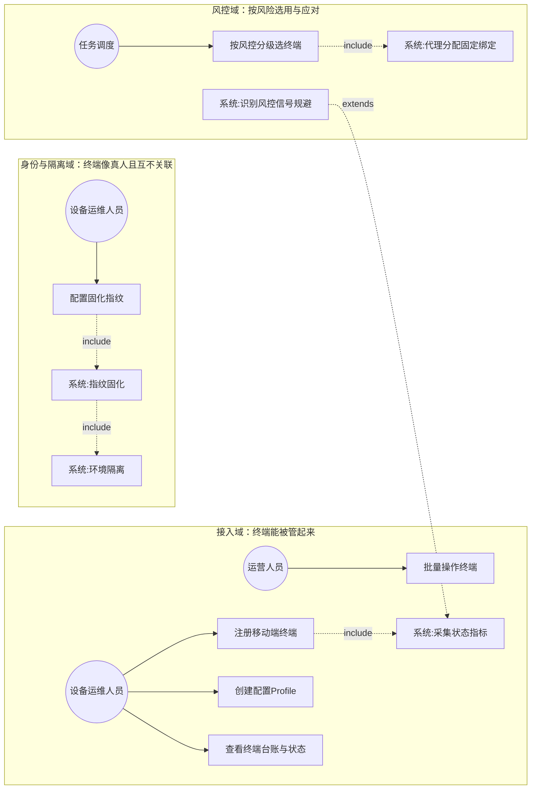

---

**第③步 理清流程**（工具：时序图 ｜ 产物：需求范围 ｜ 验收：是否穷举相关子系统）

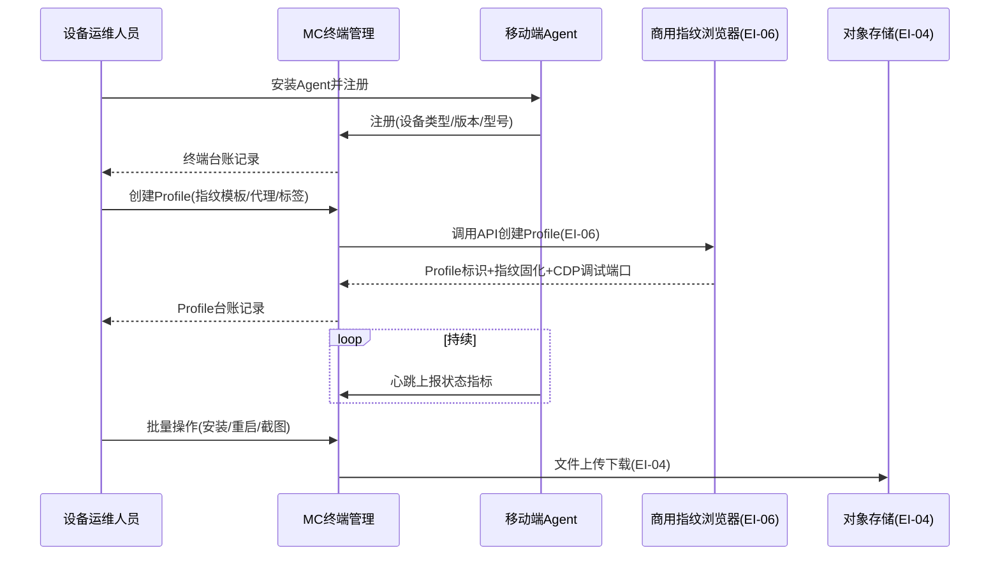

---

**第④步 理清流程-异常**（工具：流程图 ｜ 产物：异常场景 ｜ 验收：每个交互点是否都有异常分支）

| 交互点 | 异常分支 | 应对 |
|--------|---------|------|
| Agent/Profile 连接 | 掉线 | 标记离线并告警 |
| Profile 启动 | 启动失败 | 记录错误码并重试 |
| 指纹配置 | 校验失败或配置冲突 | 拒绝启动并告警提示 |
| 终端指标 | 过热/存储满/内存超限 | 隔离并停止派发任务 |
| 风控信号 | 持续触发 | 降级或暂停该终端任务 |
| 代理 | 失效 | 切换备用代理并重新固定绑定 |
| 批量操作 | 部分失败 | 记录失败项并支持重试 |

---

**第⑤步 列出规则**（工具：表格 ｜ 产物：验证点 ｜ 验收：规则是否可测、是否落到具体需求内）

| 规则 | 可测的验证点 | 归属子目标 |
|------|------------|-----------|
| Agent 注册记录设备类型(真机/云手机/ARM/虚拟化真机) | 注册后台账含设备类型 | ①接入管理 |
| Profile 经商用 API 创建+指纹模板下发+CDP 返回 | Profile 创建后返回标识与调试端口 | ①接入管理 |
| 持续监控在线/离线/电量/CPU/内存/存储/网络 | 状态视图实时可见 | ①接入管理 |
| 批量安装卸载 App/重启/截图/创建启停 Profile | 批量指令可执行返回结果 | ②批量操作 |
| Canvas/WebGL/字体/时区/Audio/UA 等 20+ 维度指纹固化 | Profile 长期呈现一致指纹 | ③可信身份 |
| 移动端硬件与软件指纹可按需配置 | 指纹可配置 | ③可信身份 |
| Profile 间 Cookie/LocalStorage/缓存相互独立隔离 | 不同 Profile 环境互不关联 | ④环境隔离 |
| 终端间指纹/网络/账号环境相互隔离 | 终端间不关联 | ④环境隔离 |
| 按指纹真实度风控分级(真机/ARM 高/虚拟化真机中高/云手机中/Profile 中) | 分级标签正确 | ⑤按分级选终端 |
| 养号优先选用高真实度终端 | 选型符合优先级 | ⑤按分级选终端 |
| 识别平台风控信号并规避 | 风控信号被识别并触发应对 | ⑥风控规避 |
| 风控持续触发时降级或暂停终端任务 | 持续触发后任务被降级 | ⑥风控规避 |
| 每终端分配独立代理 IP 固定绑定(一终端一 IP) | 每终端绑定独立固定代理 | ⑦代理绑定 |
| 代理失效时切换新代理并重新固定绑定 | 失效后自动切换并重新固定 | ⑦代理绑定 |

---

**拆分结论（含四原则校验）**

七个子目标可归为三组端到端价值：①②"终端能被管起来"（接入、台账、状态、批量操作）；③④"终端像真人且互不关联"（指纹固化、环境隔离）；⑤⑥⑦"按风险选用终端并应对风控"（分级选型、风控识别、代理绑定）。三组各自有独立的用户价值与验收点。校验如下：

| 需求 | 足够小 | 端到端 | 独立性 | 可测性 |
|------|--------|--------|--------|--------|
| R-MC-001 执行终端接入与管理 | ✅ 聚焦接入/台账/状态/批量操作 | ✅ 注册终端→可管可用 | ✅ 独立 | ✅ 接入/状态/批量可验 |
| R-MC-002 终端身份与环境隔离 | ✅ 聚焦指纹固化与隔离 | ✅ 配置指纹→终端像真人且互不关联 | ✅ 建立在 001 之上 | ✅ 指纹/隔离可验 |
| R-MC-003 终端风控分级与代理绑定 | ✅ 聚焦分级/风控/代理 | ✅ 分级→选型→风控应对→代理稳定 | ✅ 建立在 001 之上 | ✅ 分级/风控/代理可验 |

#### R-MC-001 执行终端接入与管理

**需求目的**：统一管理四类执行终端（移动端：真机、云手机、ARM 板卡、虚拟化真机；桌面端：指纹浏览器 Profile）的接入注册、台账维护、分组标签、实时状态监控与批量操作，为远控、群控与任务执行提供终端资源池。

**使用角色**：设备运维人员（注册与维护执行终端）、运营人员（批量操作）。

**前置条件**：移动端可安装 Agent 或可被接入；商用指纹浏览器产品已部署且其 API 可用（EI-06）；对象存储可用（EI-04）。

**输入**：移动端执行终端标识与 Agent 信息、浏览器 Profile 创建请求（分组、标签）、分组与标签规则、终端指标心跳、针对终端集合的批量操作指令。

**输出**：执行终端台账（含移动端与桌面端 Profile）、终端分组关系、终端实时状态视图、批量操作执行结果。

**业务规则**：

| 规则         | 说明                                                                                       |
| ---------- | ---------------------------------------------------------------------------------------- |
| 移动端注册      | 移动端 Agent 启动后向服务端注册并建立长连接，系统记录设备类型（真机/云手机/ARM 板卡/虚拟化真机，区分虚拟与实体）、版本、型号、分组与标签              |
| Profile 创建 | 浏览器 Profile 经商用指纹浏览器 API（EI-06）创建与配置，启动后由商用产品返回调试端口（CDP），系统记录 Profile 标识、内核版本、调试端口、分组与标签 |
| 状态监控       | 系统持续采集并监控移动端设备的在线与离线状态、电量、CPU、内存、存储与网络状态，以及浏览器 Profile 的运行状态与资源占用                        |
| 批量操作       | 移动端支持批量安装与卸载 App、批量重启、批量截图；浏览器 Profile 支持批量创建、启动、关闭、批量截图；均可通过对象存储（EI-04）临时链接进行文件上传与下载    |

**异常场景**：移动端 Agent 掉线或浏览器 Profile 掉线时标记离线并告警；Profile 启动失败时记录错误码并重试；终端指标异常（过热、存储满、内存超限）时隔离并停止派发任务；批量操作部分失败时记录失败项并支持重试。

**验收标准**：移动端设备与浏览器 Profile 均可注册接入；执行终端状态与指标可实时监控；移动端与桌面端的批量操作均可执行并返回结果。

**关联接口**：EI-04 对象存储、EI-06 指纹浏览器服务、II-02 Agent 指令与日志、II-04 日志指标上报（至 OM）。

#### R-MC-002 终端身份与环境隔离

**需求目的**：通过终端指纹固化（移动端硬件/软件指纹配置、桌面端 Profile 渲染层指纹固化）使终端长期呈现一致的、像真人的设备身份，降低被风控识别为异常的概率；并对终端间环境（指纹、网络、账号、Cookie/缓存）进行相互隔离，避免关联被一锅端。

**使用角色**：设备运维人员（配置指纹）。

**前置条件**：R-MC-001 执行终端已接入；商用指纹浏览器 API 可用（EI-06）。

**输入**：指纹配置（移动端硬件/软件指纹参数、Profile 指纹模板含 Canvas/WebGL/字体/时区/Audio/UA 等 20+ 维度）、终端环境隔离要求。

**输出**：终端指纹配置、固化后的渲染层指纹、终端环境隔离配置。

**业务规则**：

| 规则 | 说明 |
|------|------|
| 移动端指纹管理 | 系统管理真机、云手机、ARM 板卡、虚拟化真机等移动端设备的硬件与软件指纹，支持按需配置 |
| Profile 指纹固化 | 系统调用商用产品 API（EI-06）下发指纹模板，由商用产品生成并固化一套渲染层指纹（20+ 维度），使该 Profile 长期呈现一致的设备身份；一个 Profile 对应一套固化指纹与一个账号身份 |
| 环境隔离 | 系统对终端间的环境（指纹、网络、账号、Cookie/缓存）进行相互隔离，浏览器 Profile 间的 Cookie、LocalStorage、缓存相互独立隔离 |

**异常场景**：指纹校验失败或配置冲突时拒绝启动并告警提示。

**验收标准**：移动端设备指纹与桌面端浏览器 Profile 指纹均可按需配置（含固化）；终端间环境（指纹/网络/账号/Cookie 缓存）可相互隔离。

**关联接口**：EI-06 指纹浏览器服务。

> V3.9（ADR-002）：前端管理页 MC-04 已删，指纹固化由 EI-06 商用产品承载、风控为系统底层能力，需求保留。

#### R-MC-003 终端风控分级与代理绑定

**需求目的**：按终端指纹真实度对执行终端风控分级，使任务调度能为养号等风控敏感场景优先选用高真实度终端；识别平台风控信号并主动规避，风控持续时降级该终端，避免账号被处置；为每个终端分配独立固定代理 IP，保证长期稳定的网络身份，代理失效时才切换。

**使用角色**：任务调度（按风控分级选用终端）、系统（识别风控、分配与固定绑定代理）。

**前置条件**：R-MC-001 执行终端已接入；风控分级规则与风控信号识别规则已配置；代理资源可用。

**输入**：终端风控分级规则、风控信号、代理分配策略。

**输出**：终端风控分级标签、风控规避策略、代理绑定关系。

**业务规则**：

| 规则 | 说明 |
|------|------|
| 风控分级 | 系统按指纹真实度对执行终端风控分级：真机与 ARM 板卡为高真实度等级，虚拟化真机为中高等级，云手机为中等级，浏览器 Profile 为中等级；养号等风控敏感场景优先选用高真实度等级终端 |
| 风控识别与规避 | 系统识别平台风控信号并采取规避与应对策略，覆盖移动端与桌面端；风控信号持续触发时降级或暂停该终端任务 |
| 代理固定绑定 | 系统为每个执行终端分配独立代理 IP 并固定绑定（一终端一 IP），实现网络环境隔离；代理 IP 默认随终端固定不变，仅在该 IP 失效（被封禁、不可用）时才切换到新代理 IP 并重新固定绑定 |

**异常场景**：风控信号持续触发时降级或暂停该终端任务；代理失效时切换备用代理并重新固定绑定。

**验收标准**：风控分级可按规则打标且养号优先选用高真实度终端；风控信号可识别并触发规避策略；各执行终端可绑定独立代理；代理失效时自动切换并重新固定绑定。

**关联接口**：II-04 日志指标上报（至 OM）。

> V3.9（ADR-002）：前端管理页 MC-04 已删，指纹固化由 EI-06 商用产品承载、风控为系统底层能力，需求保留。

### 远程控制

**用户需求概述**：对单台及多台执行终端提供低延迟的实时画面预览与输入控制，并支持多终端同屏监控，用于人工介入与终端操作。移动端采用 WebRTC 通道，桌面端指纹浏览器 Profile 采用商用指纹浏览器产品的画面预览接口。

---

**第①步 目标澄清**（工具：干系人多角度分析 ｜ 产物：子目标清单 ｜ 验收：是否穷举所有干系人的价值诉求）

| 序 | 子目标 | 干系人 |
|----|--------|--------|
| 1 | 运营人员能实时看到终端画面并操控，用于人工介入 | 运营人员 |
| 2 | 监控人员能同时同屏看多台终端，掌握群控整体状态 | 监控人员 |

---

**第②步 梳理场景**（工具：用例图 ｜ 产物：场景 ｜ 验收：是否穷举所有用户操作）

| 角色 | 操作 |
|------|------|
| 运营人员 | 发起远控、鼠标键盘操控终端、截图录屏、剪贴板同步 |
| 监控人员 | 多终端宫格同屏监控 |

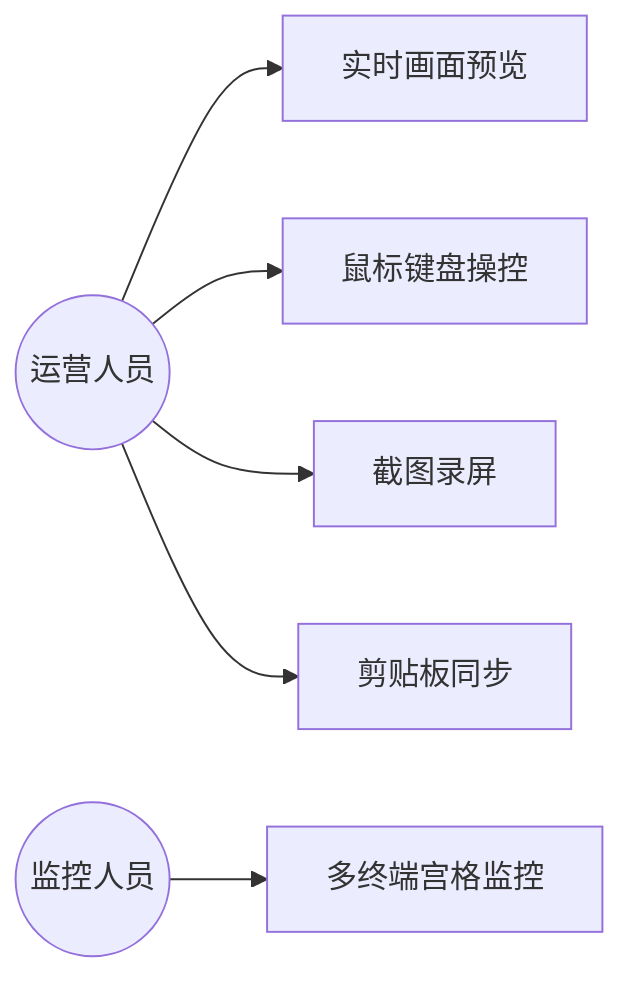

---

**第③步 理清流程**（工具：时序图 ｜ 产物：需求范围 ｜ 验收：是否穷举相关子系统）

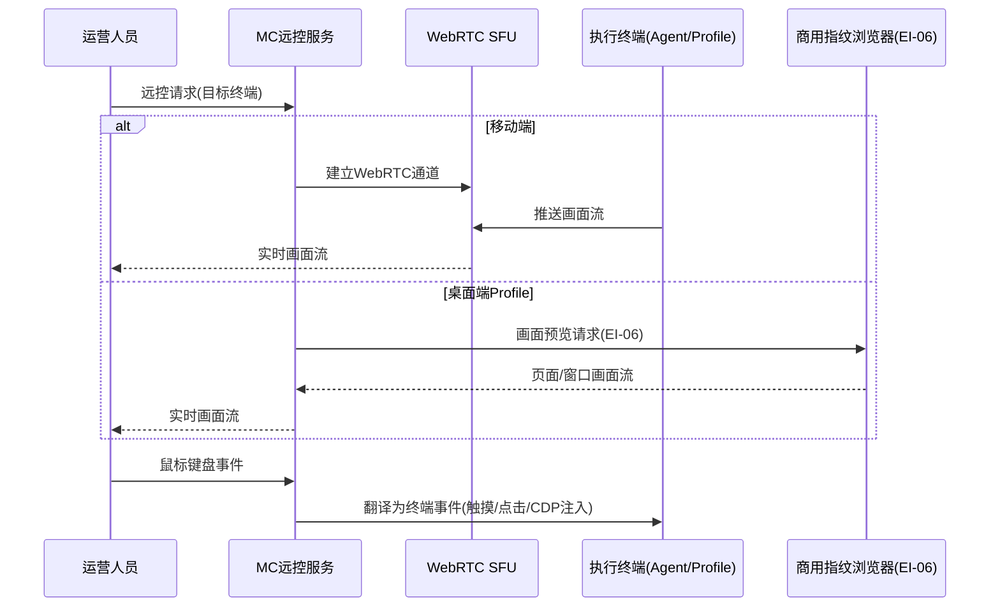

---

**第④步 理清流程-异常**（工具：流程图 ｜ 产物：异常场景 ｜ 验收：每个交互点是否都有异常分支）

| 交互点 | 异常分支 | 应对 |
|--------|---------|------|
| WebRTC/商用 API 画面流 | 断流 | 自动重连或降级 |
| 商用 API | 不可用 | 降级为截图轮询 |
| 输入事件 | 丢失 | 补传 |
| 网络 | 弱网 | 自动降帧保证可用 |

---

**第⑤步 列出规则**（工具：表格 ｜ 产物：验证点 ｜ 验收：规则是否可测、是否落到具体需求内）

| 规则 | 可测的验证点 | 归属子目标 |
|------|------------|-----------|
| 移动端 WebRTC 画面+桌面端商用 API 画面 | 两类终端均能获取画面 | ①远控 |
| 远控通道与任务执行通道分离 | 远控不影响任务执行稳定性 | ①远控 |
| 鼠标键盘映射为终端事件(触摸/返回/Home/多任务/CDP注入) | 操作被正确翻译执行 | ①远控 |
| Agent 采集截图录屏可保存回看 | 截图录屏可存取 | ①远控 |
| 宫格低码率同屏预览多终端 | 多终端可同屏 | ②宫格监控 |
| 剪贴板操作端与终端双向同步 | 剪贴板内容双向同步 | ①远控 |

---

**拆分结论（含四原则校验）**

子目标 ①② 都围绕"实时画面与操控"这一价值，异常分支统一（断流/降级），不拆分，作为一个需求。编号 R-MC-004。

#### R-MC-004 远程控制

**需求目的**：对单台及多台执行终端提供低延迟的实时画面预览与输入控制，并支持多终端同屏监控，用于人工介入与终端操作。移动端采用 WebRTC 通道，桌面端指纹浏览器 Profile 采用商用指纹浏览器产品的画面预览接口。

**使用角色**：运营人员（远程操作终端）、监控人员（宫格监控）。

**前置条件**：目标终端在线且 Agent 正常（移动端）或 Profile 已启动（桌面端）；WebRTC SFU 可用（移动端）；商用指纹浏览器 API 可用且 Profile 已启动（桌面端）；远控权限已授权。

**输入**：远控请求、目标终端标识、操作人员的鼠标与键盘输入事件。

**输出**：终端实时画面流、被翻译并执行的终端事件、截图与录屏文件、多终端宫格预览画面。

**业务规则**：

| 规则 | 说明 |
|------|------|
| 双通道画面 | 移动端屏幕画面基于 WebRTC 传输，桌面端 Profile 经商用产品 API 获取画面预览流；远控通道与任务执行通道相互分离 |
| 事件映射 | 鼠标键盘事件映射为终端触摸、点击、滑动、输入及返回键、Home 键、多任务键（移动端），或经 CDP 注入为页面鼠标点击与键盘输入（桌面端） |
| 截图录屏 | 系统支持由 Agent 采集的截图与录屏，并支持保存与回看 |
| 宫格监控 | 多终端宫格监控以低码率同屏预览多台终端 |
| 剪贴板同步 | 剪贴板在操作端与终端间双向同步 |

**异常场景**：WebRTC 断流或商用 API 画面流中断时自动重连或降级；输入事件丢失时补传；弱网下自动降帧以保证可用性；商用 API 不可用时降级为截图轮询。

**验收标准**：单终端远控端到端延迟不大于 300 毫秒；鼠标键盘事件可正确映射为终端事件；截图录屏可采集保存；多终端宫格可同屏预览；剪贴板可双向同步；桌面端可经商用 API 获取画面预览并注入操作。

**关联接口**：II-03 远控画面传输、EI-06 指纹浏览器服务。

### 执行网关与双执行模式

**用户需求概述**：以统一执行网关作为所有执行终端动作的唯一收口，提供脚本模式与智能体模式两种执行引擎，覆盖移动端与桌面端，支持群控、养号与内容投放三类执行目标。

---

**第①步 目标澄清**（工具：干系人多角度分析 ｜ 产物：子目标清单 ｜ 验收：是否穷举所有干系人的价值诉求）

| 序   | 子目标                              | 干系人     |
| --- | -------------------------------- | ------- |
| 1   | 所有终端动作经统一网关收口，可鉴权、可记录、可熔断（动作不裸奔） | 审计/安全诉求 |
| 2   | 脚本模式能驱动固定流程、高频批量作业               | 任务调度    |
| 3   | 智能体模式能由大模型实时决策驱动复杂作业             | 智能体引擎   |
| 4   | 群控、养号、投放三类执行目标都能经网关闭环落地          | 行动/运营   |

> 分析：①②③④ 均围绕"动作经网关落地执行"这一价值，脚本/智能体是两种执行引擎（如两种车道），群控/养号/投放是三类执行目标（如三类车辆），都是同一网关的不同侧面，不构成可独立交付的端到端价值。作为一个需求。

---

**第②步 梳理场景**（工具：用例图 ｜ 产物：场景 ｜ 验收：是否穷举所有用户操作）

| 角色 | 操作 |
|------|------|
| 任务调度 | 下发作业指令（脚本/智能体）、经网关转发动作到终端 |
| 脚本引擎 | 按固定流程驱动终端动作 |
| 智能体引擎 | 调用 IRS 视觉推理、自主决策动作 |
| 审计与安全 | 查阅动作日志与熔断记录 |

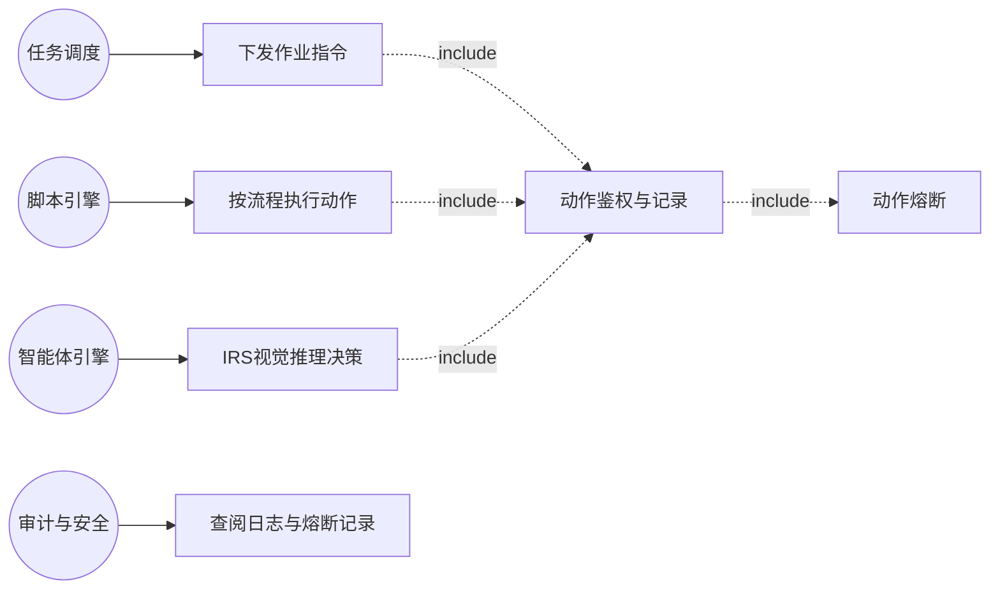

---

**第③步 理清流程**（工具：时序图 ｜ 产物：需求范围 ｜ 验收：是否穷举相关子系统）

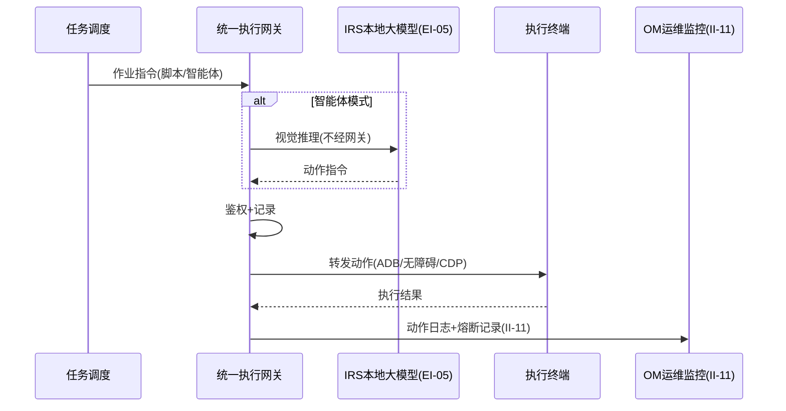

---

**第④步 理清流程-异常**（工具：流程图 ｜ 产物：异常场景 ｜ 验收：每个交互点是否都有异常分支）

| 交互点 | 异常分支 | 应对 |
|--------|---------|------|
| 执行网关 | 过载 | 按优先级限流 |
| 智能体推理 | 失败 | 降级脚本模式或人工介入 |
| 动作 | 触发风控信号 | 熔断并告警 |
| 终端/CDP | 掉线/断开 | 挂起任务待恢复续接 |

---

**第⑤步 列出规则**（工具：表格 ｜ 产物：验证点 ｜ 验收：规则是否可测、是否落到具体需求内）

| 规则 | 可测的验证点 | 归属子目标 |
|------|------------|-----------|
| 动作鉴权（校验来源与目标合法性） | 非法来源动作被拒绝 | ①动作不裸奔 |
| 动作记录（写日志并全量上报 OM） | 动作日志可在 OM 检索 | ①动作不裸奔 |
| 动作熔断（检测风控信号或异常频率时停止） | 风控信号触发后后续动作停止 | ①动作不裸奔 |
| 脚本模式驱动固定流程作业 | 脚本模式可驱动终端 | ②③双执行模式 |
| 智能体模式调用 IRS 实时决策 | 智能体模式可驱动终端 | ②③双执行模式 |
| 推理不经网关、动作指令经网关 | 推理直连 IRS、动作经网关 | ②③双执行模式 |
| 通道适配（移动端 ADB/无障碍、桌面端 CDP） | 两类终端动作可落地 | ②③双执行模式 |
| 群控/养号/投放三类目标 | 三类均可闭环 | ④三类执行目标 |

---

**拆分结论（含四原则校验）**：子目标 ①（动作经网关收口：鉴权/记录/熔断）与 ②③（双执行模式：脚本引擎/智能体引擎）+ ④（三类执行目标）是两组不同的端到端价值——网关的使用角色偏审计/安全（关注动作不裸奔、可观测可熔断），双执行模式的使用角色偏任务调度与引擎（关注作业怎么驱动、目标怎么落地）。两者验收点不同（网关验收鉴权/记录/熔断；双执行模式验收模式驱动与三类目标闭环）。校验如下：

| 需求 | 足够小 | 端到端 | 独立性 | 可测性 |
|------|--------|--------|--------|--------|
| R-MC-005 统一执行网关 | ✅ 聚焦动作收口 | ✅ 动作→鉴权/记录/熔断→转发 | ✅ 独立 | ✅ 鉴权/记录/熔断可验 |
| R-MC-006 双执行模式与执行目标 | ✅ 聚焦双引擎与三类目标 | ✅ 作业指令→模式驱动→三类目标落地 | ✅ 建立在 005 之上 | ✅ 模式/目标可验 |

#### R-MC-005 统一执行网关

**需求目的**：以统一执行网关作为所有执行终端动作的唯一收口，对动作鉴权（校验来源与目标合法性）、记录（写动作日志并全量上报 OM）、熔断（检测风控信号或异常频率时停止后续动作），保证每一个动作可观测、可审计、可熔断，动作不裸奔。

**使用角色**：审计与安全（动作可观测可审计可熔断）、任务调度（动作经网关转发落地）。

**前置条件**：执行网关服务可用；控制通道（移动端 ADB/无障碍、桌面端 CDP）已就绪。

**输入**：动作指令（动作类型、坐标/元素、参数、目标执行终端、账号标识、终端类型）。

**输出**：动作执行结果、动作日志记录、熔断记录。

**业务规则**：

| 规则 | 说明 |
|------|------|
| 动作收口 | 所有执行终端动作（移动端与桌面端）均经统一执行网关落地，禁止绕过 |
| 动作鉴权 | 执行网关对动作鉴权，校验动作来源与目标终端的合法性 |
| 动作记录 | 执行网关对动作记录，写入动作日志并全量上报运维监控子系统（II-11） |
| 动作熔断 | 执行网关对异常动作熔断，在检测到风控信号或异常频率时停止后续动作 |
| 通道适配 | 移动端终端采用 ADB、无障碍服务通道，桌面端 Profile 采用 CDP 通道；控制通道对上层透明 |

**异常场景**：执行网关过载时按优先级限流；动作触发风控信号时熔断并告警；终端掉线或 CDP 连接断开时挂起任务待恢复续接。

**验收标准**：所有执行终端动作均经统一执行网关鉴权、记录、转发，禁止绕过；执行网关可对异常动作熔断；动作日志全量上报 OM；移动端与桌面端控制通道均可适配。

**关联接口**：II-07 执行网关动作接口、II-11 执行网关日志上报（至 OM）。

#### R-MC-006 双执行模式与执行目标

**需求目的**：提供脚本模式与智能体模式两种执行引擎，分别承载固定流程驱动与大模型实时决策驱动的作业，覆盖移动端终端与桌面端浏览器 Profile，并支持群控、养号与内容投放三类执行目标。所有动作经 R-MC-005 统一执行网关落地。

**使用角色**：任务调度（下发作业指令）、智能体引擎（自主决策动作）、脚本引擎（按流程执行动作）。

**前置条件**：R-MC-005 执行网关可用；智能体模式下 IRS 本地大模型可用；目标执行终端与账号已绑定。

**输入**：作业指令（来自脚本模式或智能体模式）、目标执行终端组、内容素材、目标账号与终端。

**输出**：脚本模式执行结果、智能体模式执行结果、养号执行记录、内容投放执行记录。

**业务规则**：

| 规则 | 说明 |
|------|------|
| 脚本模式 | 脚本模式由预先编写的固定流程驱动终端动作，适用于流程确定、高频、批量的作业 |
| 智能体模式 | 智能体模式由 MC 的 agent-runtime 子模块调用 IRS 本地大模型进行视觉推理与规划，自主决策下一步动作，适用于流程复杂、需理解界面、抗界面变化的作业；agent-runtime 承担运行时场景适配、动态调用提示词、调用 IRS 推理，与执行网关逻辑隔离 |
| 推理执行分离 | 智能体模式下的视觉推理由 MC 的 agent-runtime 子模块调用 IRS 完成，不经执行网关；推理产出的动作指令再经执行网关落地 |
| 三类执行目标 | 群控对多台终端同步控制并统一投放内容；养号按拟人化节奏模拟真人行为（认知行动账号经移动端 ADB/无障碍、爬虫账号经桌面端 CDP，拟人化节奏由 R-MC-009 内置）；内容投放下发并发布内容素材到目标账号 |

**异常场景**：智能体推理失败时降级为脚本模式或人工介入。

**验收标准**：脚本模式与智能体模式均可驱动移动端设备与桌面端 Profile 动作；智能体推理调用 IRS 且不经执行网关；三类执行目标（群控、养号、投放）均可闭环。

**关联接口**：II-07 执行网关动作接口、II-08 本地大模型推理调用、EI-05 本地大模型推理。

### 任务管理

**用户需求概述**：把操作意图转换为设备可执行的任务并进行调度，支撑各类作业的排队、分发、重试与定时执行。

---

**第①步 目标澄清**（工具：干系人多角度分析 ｜ 产物：子目标清单 ｜ 验收：是否穷举所有干系人的价值诉求）：①运营人员能把意图变成可执行的任务并交给系统（创建任务）；②任务能排队分发到设备并可靠执行（含重试与定时）。

---

**第②步 梳理场景**（工具：用例图 ｜ 产物：场景 ｜ 验收：是否穷举所有用户操作）

| 角色 | 操作 |
|------|------|
| 运营人员 | 创建任务、查看任务状态、配置计划任务 |
| 系统（自动） | 生成任务实例、入消息队列、调度分发到设备 Agent、状态流转、失败重试 |

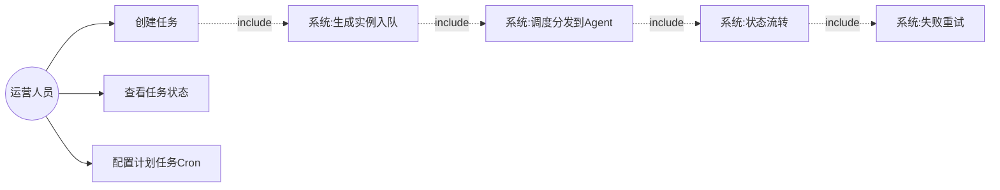

---

**第③步 理清流程**（工具：时序图 ｜ 产物：需求范围 ｜ 验收：是否穷举相关子系统）

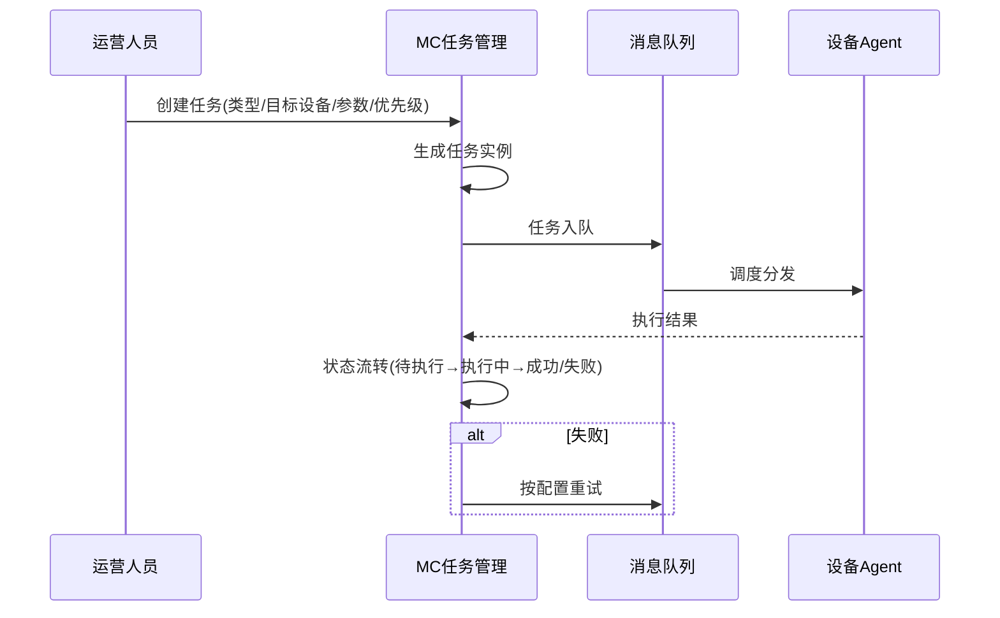

---

**第④步 理清流程-异常**（工具：流程图 ｜ 产物：异常场景 ｜ 验收：每个交互点是否都有异常分支）

| 交互点 | 异常分支 | 应对 |
|--------|---------|------|
| 任务执行 | 失败 | 按配置重试 |
| 任务执行 | 超时 | 标记超时并告警 |
| 消息队列 | 积压 | 按优先级调度并告警 |

---

**第⑤步 列出规则**（工具：表格 ｜ 产物：验证点 ｜ 验收：规则是否可测、是否落到具体需求内）

| 规则 | 可测的验证点 | 归属子目标 |
|------|------------|-----------|
| 实例化调度（选设备/设备组→生成实例→入队→分发） | 任务可创建入队分发 | ①意图转任务 |
| 八种任务类型（安装/分发/发布/截图/采集/脚本/巡检/检查） | 各类型可创建执行 | ①意图转任务 |
| 八种状态流转（待执行/排队/执行中/成功/失败/取消/超时/部分成功） | 状态可正确流转 | ②可靠执行 |
| 失败重试与超时配置 | 失败可重试、超时可配 | ②可靠执行 |
| 计划任务（一次性/每日/每周/Cron+并发+优先级） | 计划任务可定时触发 | ②可靠执行 |

**拆分结论**：两子目标围绕"任务调度执行"这一价值，作为一个需求。编号 R-MC-007。

#### R-MC-007 任务管理

**需求目的**：把操作意图转换为设备可执行的任务并进行调度，支撑各类作业的排队、分发、重试与定时执行。

**使用角色**：运营人员（创建任务）、任务调度（自动分发）、系统（状态流转）。

**前置条件**：消息队列可用；目标设备或设备组已就绪。

**输入**：任务定义（任务类型、目标设备或设备组、参数、优先级）、计划任务的 Cron 表达式、任务状态变更事件。

**输出**：任务实例、任务调度分发结果、任务执行结果、任务最新状态。

**业务规则**：

| 规则 | 说明 |
|------|------|
| 实例化调度 | 系统按任务定义选择设备或设备组，生成任务实例并入消息队列，由调度器分发到设备 Agent 执行 |
| 任务类型 | 包括 App 安装与启动、文件分发、内容发布、截图、数据采集、自动化脚本、设备巡检与账号状态检查 |
| 状态流转 | 任务在待执行、排队中、执行中、成功、失败、已取消、超时、部分成功等状态间流转 |
| 重试与超时 | 系统支持失败重试、重试次数与超时配置 |
| 计划任务 | 支持一次性、每日、每周与自定义 Cron，并支持最大并发数与任务优先级控制 |

**异常场景**：任务执行失败时按配置重试；任务超时时标记超时并告警；队列积压时按优先级调度并告警。

**验收标准**：任务可创建并生成实例入队分发；八种任务状态可正确流转；失败可重试且超时可配置；计划任务可按 Cron 定时触发并支持并发与优先级。

**关联接口**：II-02 Agent 指令与日志、II-04 日志指标上报（至 OM）。

### 自动化管理与编排

**用户需求概述**：提供自动化能力的中枢，覆盖从模板任务到可视化工作流再到脚本开发的递进式自动化编排能力，并承载养号、账号-终端绑定、登录状态维护等可自动化的账号操作执行编排，以及养号拟人化节奏策略（内置）。所有产出动作均经执行网关落地。

---

**第①步 目标澄清**（工具：干系人多角度分析 ｜ 产物：子目标清单 ｜ 验收：是否穷举所有干系人的价值诉求）

| 序 | 子目标 | 干系人 |
|----|--------|--------|
| 1 | 运营/开发者能用模板/工作流/脚本把操作流程编排成可自动执行的自动化能力 | 运营人员、脚本开发者 |
| 2 | 账号运营人员能把账号绑到终端、按拟人化节奏自动养号、维护登录状态 | 账号运营人员 |

---

**第②步 梳理场景**（工具：用例图 ｜ 产物：场景 ｜ 验收：是否穷举所有用户操作）

| 角色 | 操作 |
|------|------|
| 脚本开发者 | 编写调试脚本（编辑/调试/截图回放/版本管理） |
| 运营人员 | 选用模板任务、编排可视化工作流 |
| 账号运营人员 | 绑定账号与终端、配置养号任务 |
| 系统 | 执行编排、自动养号、维护登录状态、响应状态变更 |

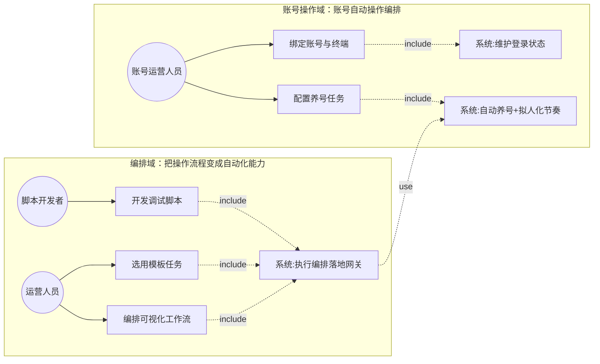

---

**第③步 理清流程**（工具：时序图 ｜ 产物：需求范围 ｜ 验收：是否穷举相关子系统）

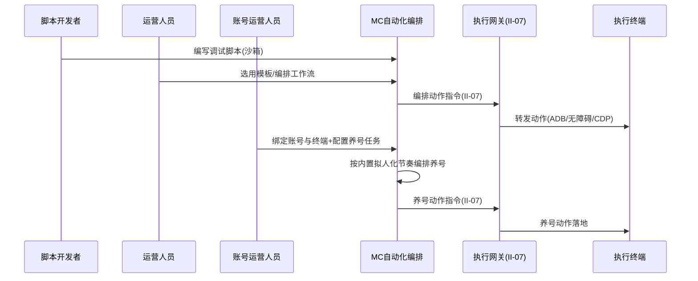

---

**第④步 理清流程-异常**（工具：流程图 ｜ 产物：异常场景 ｜ 验收：每个交互点是否都有异常分支）

| 交互点 | 异常分支 | 应对 |
|--------|---------|------|
| 脚本执行 | 异常 | 捕获错误并记录 |
| 脚本 | 越权访问敏感路径 | 沙箱拦截 |
| 调试设备 | 掉线 | 暂停调试 |
| 账号 | 被封禁/受限 | 停止该账号任务并解绑 |
| 养号 | 触发平台验证 | 暂停并告警 |
| 账号登录 | 失败 | 记录原因并标记 |

---

**第⑤步 列出规则**（工具：表格 ｜ 产物：验证点 ｜ 验收：规则是否可测、是否落到具体需求内）

| 规则 | 可测的验证点 | 归属子目标 |
|------|------------|-----------|
| 三阶段(模板/工作流/脚本开发) | 三阶段均可用 | ①编排 |
| TikTok/Facebook 等平台模拟点击 | 模拟点击可执行 | ①编排 |
| 动作经执行网关落地不直接操作设备 | 动作收口网关 | ①编排 |
| 养号按内置拟人化节奏(随机浏览/停留/互动/打散时间) | 养号节奏拟人化 | ②养号 |
| 认知行动账号经 ADB/无障碍、爬虫账号经 CDP | 两类账号分通道养号 | ②养号 |
| 一设备一账号一 IP / 一 Profile 一账号一 IP（未解绑不可再绑） | 绑定规则正确 | ②绑定 |
| 记录账号在终端登录状态及变化 | 登录状态可记录 | ②登录状态 |
| 账号状态变更时停止养号并解绑 | 变更联动生效 | ②养号 |

---

**拆分结论（含四原则校验）**：子目标 ①（编排能力）与 ②（账号操作编排）是两条价值链——前者面向运营/开发者构建通用自动化能力，后者面向账号运营人员做账号绑定/养号/登录维护。两者角色不同、验收点不同。校验如下：

| 需求 | 足够小 | 端到端 | 独立性 | 可测性 |
|------|--------|--------|--------|--------|
| R-MC-008 自动化编排能力 | ✅ 聚焦三阶段编排 | ✅ 操作流程→可自动执行 | ✅ 独立 | ✅ 三阶段可验 |
| R-MC-009 账号操作编排与养号 | ✅ 聚焦账号绑定/养号/登录 | ✅ 绑定账号→自动养号→状态维护 | ✅ 建立在 008 之上 | ✅ 养号/绑定可验 |

#### R-MC-008 自动化编排能力

**需求目的**：提供自动化能力的中枢，覆盖从模板任务到可视化工作流再到脚本开发的递进式自动化编排能力，支持 ADB、CDP 等多种自动化通道，针对 TikTok、Facebook 等平台实现模拟点击自动化。所有产出动作均经执行网关落地，不直接操作设备。

**使用角色**：脚本开发者（编写与调试脚本）、运营人员（选用模板或工作流）。

**前置条件**：执行网关可用；调试设备已接入；脚本沙箱已配置。

**输入**：模板任务选择、工作流流程定义、脚本代码与调试设备、平台界面与操作序列。

**输出**：模板任务执行结果、工作流执行编排结果、脚本调试结果、模拟点击自动化执行结果。

**业务规则**：

| 规则 | 说明 |
|------|------|
| 模板化任务 | 第一阶段提供模板化任务，包括打开 App、等待页面、点击、输入文本、上传文件、截图、返回、滑动、关闭 App、设备巡检与 App 状态检测 |
| 可视化工作流 | 第二阶段提供可视化工作流编排，节点包括开始、设备选择、启动 App、等待、点击、输入、滑动、截图、文件上传、条件判断、循环、HTTP 请求、日志、审批与结束 |
| 脚本开发调试 | 第三阶段支持脚本开发与调试，提供脚本编辑、调试设备、执行日志、截图回放与版本管理 |
| 模拟点击 | 系统针对 TikTok、Facebook 等平台实现模拟点击自动化 |
| 动作收口 | 本功能编排产出的所有动作指令均经执行网关鉴权、记录与转发，不直接操作设备 |

**异常场景**：脚本执行异常时捕获错误并记录；脚本越权访问敏感路径时沙箱拦截；调试设备掉线时暂停调试。

**验收标准**：三阶段能力（模板、工作流、脚本开发）均可用；编排动作均经执行网关落地且不直接操作设备；模拟点击可在目标平台执行。

**关联接口**：II-07 执行网关动作接口。

#### R-MC-009 账号操作编排与养号

**需求目的**：承载养号、账号-终端-代理绑定、登录状态维护等可自动化的账号操作的执行编排，以及养号拟人化节奏策略（内置）。认知行动账号经移动端 ADB/无障碍通道养号、爬虫账号经桌面端 CDP 通道养护。养号等风控敏感场景可优先采用脚本模式编排。

**使用角色**：账号运营人员（绑定账号与终端、配置养号任务）、系统（执行编排、自动执行养号、维护登录状态、响应状态变更）。

**前置条件**：执行网关可用；账号已在本子系统注册并取得 account_id（见账号资源管理需求）；目标执行终端已注册。

**输入**：账号标识、终端标识、养号任务（发帖、关注、浏览）、账号登录事件、账号绑定请求、拟人化节奏参数。

**输出**：账号与终端的绑定关系记录、登录状态记录、养号执行记录。

**业务规则**：

| 规则 | 说明 |
|------|------|
| 账号-终端-代理绑定 | 真机、云手机、虚拟化真机执行"一设备一账号一 IP"（一个终端仅可绑定一个账号与一个固定代理 IP，已绑定账号未解绑前不可再绑定其他账号）；指纹浏览器 Profile 执行"一 Profile 一账号一 IP"（浏览器实例可多开，每个 Profile 绑定一个账号身份与一个固定代理 IP）；系统据此将认知行动账号绑定到移动端设备、爬虫账号绑定到浏览器 Profile，并联动终端-代理绑定记录 |
| 养号自动化 | 养号动作（发帖、关注、浏览等拟人化行为）由本功能编排并经执行网关落地执行——认知行动账号经 ADB/无障碍通道在移动端执行、爬虫账号经 CDP 通道在浏览器 Profile 执行 |
| 拟人化节奏 | 养号的拟人化节奏由本功能内置（注入随机浏览、停留、互动等行为、打散时间间隔与频率），不再依赖蜂群智能体子系统 |
| 登录状态维护 | 系统记录账号在终端上的登录状态及其变化 |
| 状态变更联动 | 账号状态变更（封禁、受限等）时停止该账号的养号任务并解绑 |

**异常场景**：账号被封禁或受限时停止该账号相关任务并解绑；养号行为触发平台验证时暂停并告警；账号登录失败时记录原因并标记；账号在终端上被封时解绑并告警。

**验收标准**：养号动作可按内置拟人化节奏经执行网关在移动端（ADB/无障碍）与桌面端（CDP）执行；账号-终端-代理绑定规则（一设备一账号一 IP / 一 Profile 一账号一 IP，含未解绑前不可再绑）可正确执行并记录绑定关系；登录状态变化可记录；账号状态变更后可联动停止被封账号任务。

**关联接口**：II-07 执行网关动作接口、II-01a 账号状态变更事件、II-04 日志指标上报（至 OM）。

> V3.9（ADR-005）：养号监控页 MC-11、节奏策略页 MC-12 已删（养号/拟人是模板与编排的结果），养号能力以模板形态保留在 M-MC-08 编排体系。需求留阶段二评估。

### 可观测性与作业统计复盘

**用户需求概述**：满足集群控制对可观测性的硬性要求，使终端、账号、任务的每一个动作都可知、可追溯，支撑记录、回传、告警、审计，并在此基础上完成蜂群作业的数据统计与任务复盘、将投送效果联动回传上游供效果评估闭环使用。

---

**第①步 目标澄清**（工具：干系人多角度分析 ｜ 产物：子目标清单 ｜ 验收：是否穷举所有干系人的价值诉求）：①每个终端动作都可知可追溯（留痕、日志、告警、审计）；②蜂群作业可统计、可复盘、效果可回传上游。

---

**第②步 梳理场景**（工具：用例图 ｜ 产物：场景 ｜ 验收：是否穷举所有用户操作）

| 角色 | 操作 |
|------|------|
| 运维与审计人员 | 检索/查阅动作日志、查阅审计记录（谁何时对哪台终端或账号做了什么）、接收与处理异常告警 |
| 行动指挥与运营人员 | 查看蜂群作业多维统计（任务完成率/内容触达/互动表现/账号健康度）、发起/查看任务复盘归因、查阅效果回传情况 |
| 系统（自动） | 动作留痕（时间/终端/账号/结果）、经 Agent 回传任务日志与截图、异常事件触发告警、用户与系统操作写审计日志、作业多维统计、任务复盘归因、效果数据回调回传 OCC |

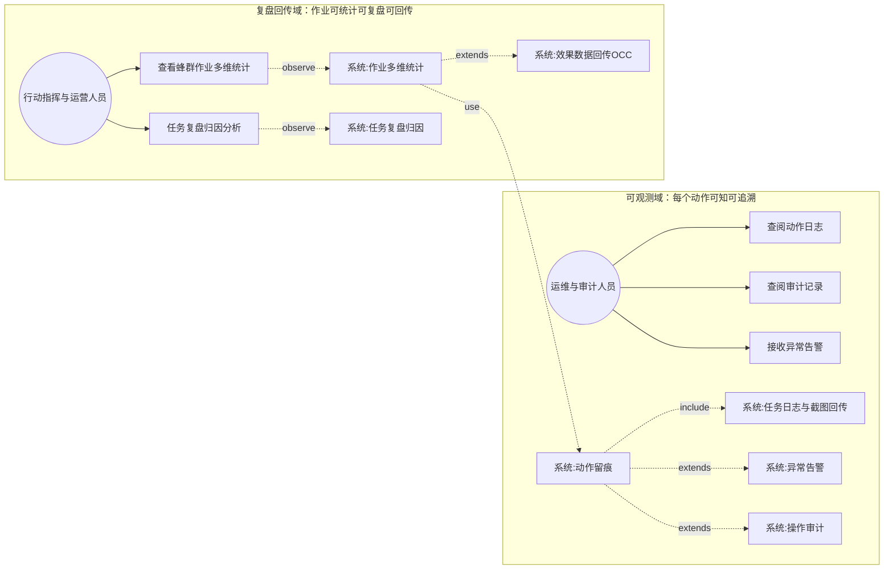

---

**第③步 理清流程**（工具：时序图 ｜ 产物：需求范围 ｜ 验收：是否穷举相关子系统）

正常流程涉及 4 个子系统/组件：终端 Agent（II-02）、统一执行网关（II-07）、运维监控 OM（II-04）、舆情行动 OCC（II-10 效果回传）。可观测性统一收口于 MC，动作留痕是统计复盘与效果回传的同源数据底座（不重复采集）。

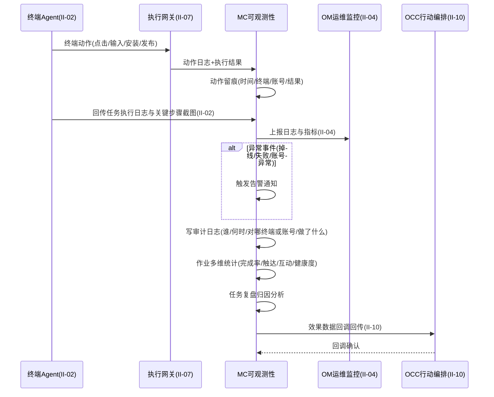

---

**第④步 理清流程-异常**（工具：流程图 ｜ 产物：异常场景 ｜ 验收：每个交互点是否都有异常分支）

| 交互点 | 异常分支 | 应对 |
|--------|---------|------|
| MC ↔ OM（日志上报 II-04） | 上报失败 | 本地暂存待重试，不丢动作记录 |
| MC 告警通道 | 告警通道失效 | 降级为本地记录 |
| 审计日志写入 | 写入失败 | 阻塞相关操作以保证不丢审计 |
| 作业统计数据源 | 数据源缺失 | 标注统计不完整 |
| 任务复盘归因 | 归因无解 | 标记待人工分析 |
| MC ↔ OCC（效果回传 II-10） | 回调上游失败 | 暂存重试 |

---

**第⑤步 列出规则**（工具：表格 ｜ 产物：验证点 ｜ 验收：规则是否可测、是否落到具体需求内）

| 规则 | 可测的验证点 | 归属子目标 |
|------|------------|-----------|
| 动作留痕（记录时间、终端、账号、结果） | 任一终端动作均可在留痕中查到时间/终端/账号/结果四要素 | ①可观测 |
| Agent 回传任务执行日志与关键步骤截图 | 任务执行后日志与截图可在 MC 检索 | ①可观测 |
| 异常事件触发告警通知 | 掉线/失败/账号异常事件触发后可收到告警 | ①可观测 |
| 用户与系统操作记录审计日志 | 任一用户或系统操作可在审计日志追溯 | ①可观测 |
| 作业统计基于本功能同源数据、不重复采集 | 统计数据来源单一可溯、无重复采集 | ②统计复盘 |
| 蜂群作业多维统计（任务完成率/内容触达率/互动率/账号健康度） | 四项基础指标均可产出 | ②统计复盘 |
| 任务复盘对失败任务/异常账号/低效作业归因分析 | 失败任务可产出归因结论 | ②统计复盘 |
| 效果数据经回调联动回传 OCC | 效果数据可在 OCC 侧形成评估闭环 | ②统计复盘 |

---

**拆分结论**：两子目标围绕"可观测与作业数据闭环"这一价值，动作留痕是统计复盘的数据源（同源不重复采集），作为一个需求。编号 R-MC-010。

#### R-MC-010 可观测性与作业统计复盘

**需求目的**：满足集群控制对可观测性的硬性要求，使终端、账号、任务的每一个动作都可知、可追溯，支撑记录、回传、告警、审计，并在此基础上完成蜂群作业的数据统计与任务复盘、将投送效果联动回传上游供效果评估闭环使用。动作留痕与作业统计复盘统一收口于本功能，避免原始动作数据在多个子系统间重复采集。

**使用角色**：运维与审计人员（查阅日志与审计）、行动指挥与运营人员（查阅作业统计与复盘）、系统（自动记录、统计与回传）。

**前置条件**：日志采集与上报通道可用；告警通道已配置；效果回调接口已对接上游（OCC）。

**输入**：终端动作事件、任务执行过程、异常事件、用户与系统的操作、投放内容表现数据。

**输出**：动作日志、任务执行日志与截图、异常告警通知、可追溯的审计记录、蜂群作业统计报表、任务复盘结果、回传上游的效果回调数据。

**业务规则**：

| 规则 | 说明 |
|------|------|
| 动作留痕 | 每一个终端动作（点击、输入、安装、发布等）均留痕，记录时间、终端、账号与结果 |
| 任务日志回传 | Agent 回传任务执行日志与关键步骤截图 |
| 异常告警 | 任务失败、终端掉线、账号异常等异常事件触发告警通知 |
| 审计日志 | 系统对用户与系统操作记录审计日志，记录谁在何时对哪台终端或账号做了什么 |
| 作业统计 | 作业统计复盘基于本功能采集上报的动作日志与任务日志进行，不重复采集原始动作数据；系统对蜂群作业进行多维统计（任务完成率、内容触达、互动表现、账号健康度等） |
| 任务复盘 | 系统支持任务复盘，对失败任务、异常账号、低效作业进行归因分析 |
| 效果回调 | 系统将投送效果数据通过回调机制联动回传至舆情行动子系统（OCC），供效果评估闭环使用 |

**异常场景**：日志上报失败时本地暂存待重试；告警通道失效时降级为本地记录；审计日志写入失败时阻塞相关操作以保证不丢审计；数据源缺失时标注统计不完整；复盘归因无解时标记待人工分析；回调上游失败时暂存重试。

**验收标准**：每个终端动作可留痕并记录时间、终端、账号、结果；任务日志与截图可回传；异常可触发告警；用户与系统操作可审计追溯；蜂群作业可基于本功能数据进行多维统计（统计维度须含：任务完成率、内容触达率、互动率、账号健康度四项基础指标）；失败任务可归因复盘；效果数据可回调回传上游形成闭环。

**关联接口**：II-04 日志指标上报（至 OM）、II-10 行动编排下发与执行回传（效果回传 OCC）。

### 账号资源管理

**用户需求概述**：作为账号资源的平台级权威源，唯一维护社交媒体账号的主数据（注册、凭据、验证、风险评估、生命周期、账号分类），并承担智能体账号的分层分组与作业生命周期管理、账号与智能体定义（agent_id）的 1:N 绑定关系维护（一个智能体可绑多个账号）、账号级记忆与动态提示词实例的 1:1 归属维护、封号账号资产迁移。账号按用途分为两类：爬虫账号以桌面端指纹浏览器 Profile 为执行终端，认知行动账号以移动端设备为执行终端。

---

**第①步 目标澄清**（工具：干系人多角度分析 ｜ 产物：子目标清单 ｜ 验收：是否穷举所有干系人的价值诉求）

| 序 | 子目标 | 干系人 |
|----|--------|--------|
| 1 | 各子系统能拿到统一、权威、加密的账号主数据（注册、凭据、验证、风险、生命周期、分类），全网一致不复制 | 各使用子系统（DC/SWM/OCC）、安全诉求 |
| 2 | 智能体账号能被分层分组管理、按作业生命周期流转，形成可控的账号层级结构 | 账号运营人员、行动指挥 |
| 3 | 智能体（agent_id）能与账号 1:N 绑定（一个智能体绑多个账号），账号级记忆与动态提示词按 account_id 1:1 归属，封号后能将账号资产迁移到新账号延续行为 | 账号运营人员 |

---

**第②步 梳理场景**（工具：用例图 ｜ 产物：场景 ｜ 验收：是否穷举所有用户操作）

| 角色 | 操作 |
|------|------|
| 账号运营人员 | 注册账号、维护账号、配置分层分组、配置 agent↔账号 1:N 绑定、发起封号账号资产迁移 |
| 各使用子系统 | 经账号服务接口引用 account_id |
| 系统 | 自动验证、状态流转、事件广播、维护绑定关系 |

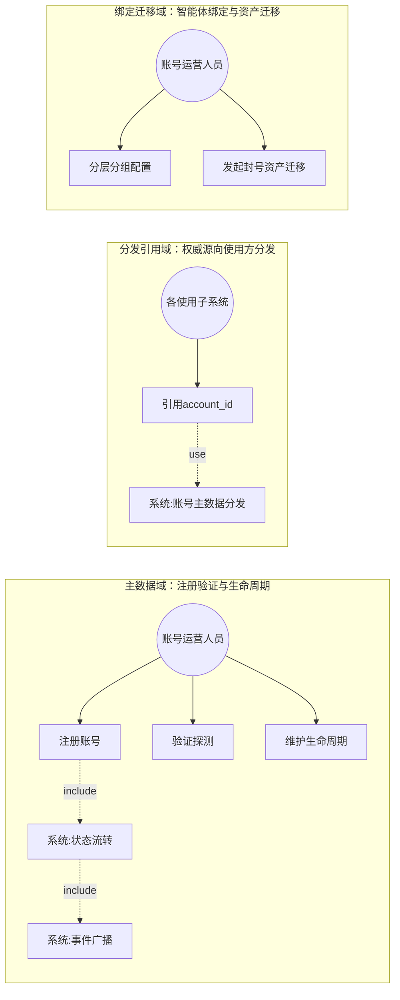

---

**第③步 理清流程**（工具：时序图 ｜ 产物：需求范围 ｜ 验收：是否穷举相关子系统）

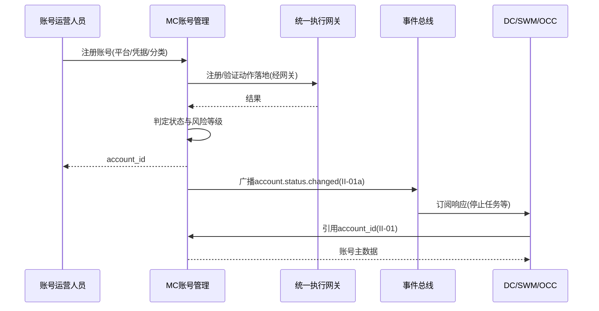

---

**第④步 理清流程-异常**（工具：流程图 ｜ 产物：异常场景 ｜ 验收：每个交互点是否都有异常分支）

| 交互点 | 异常分支 | 应对 |
|--------|---------|------|
| 账号状态 | 被封禁/受限 | 自动标记状态并停止该账号相关任务 |
| 验证探测 | 失败 | 记录异常并重试 |
| 注册流程 | 接码/验证失败 | 回滚并记录 |
| 账号服务接口 | 不可用 | 使用方降级为本地缓存只读并告警 |
| agent_id 绑定 | 冲突（目标账号已绑其他 agent_id） | 拒绝迁移并提示 |

---

**第⑤步 列出规则**（工具：表格 ｜ 产物：验证点 ｜ 验收：规则是否可测、是否落到具体需求内）

| 规则 | 可测的验证点 | 归属子目标 |
|------|------------|-----------|
| 主数据唯一维护+凭据加密+使用方不复制 | 主数据权威且加密 | ①主数据 |
| 注册支持邮箱/手机接码/虚拟号 | 三种注册方式可走通 | ①主数据 |
| 注册/验证动作经执行网关落地 | 动作收口网关 | ①主数据 |
| 验证探测识别封禁/限制/需验证+输出风险等级 | 风险等级可识别 | ①主数据 |
| 生命周期状态流转(待登录/正常/受限/需验证/封禁/归档) | 状态可流转 | ①主数据 |
| 两类分类(爬虫=Profile/认知行动=移动端) | 分类正确归口 | ①主数据 |
| account_id 全局唯一贯穿 DC/MC/SWM/OCC | 全局可引用 | ①主数据 |
| account.status.changed 事件广播全网即时失效 | 事件广播生效 | ①主数据 |
| 按业务目标/平台/地区/风险等级分层分组 | 分层分组可配 | ②分组 |
| 作业生命周期(待激活/活跃/休眠/受限/封禁/回收)可流转 | 状态可流转 | ②分组 |
| agent_id↔account_id 1:N 绑定（一个 agent 绑多个账号），账号级记忆/动态提示词按 account_id 1:1 归属 | 绑定与归属可记录查询 | ③绑定迁移 |
| 封号账号资产迁移(账号级记忆/动态提示词整体迁移到新账号，agent 不变) | 迁移可执行延续行为 | ③绑定迁移 |

---

**拆分结论（含四原则校验）**：三子目标可归为三组端到端价值：①账号主数据权威维护与分发（注册/验证/生命周期/分类/事件）；②智能体账号分层分组与作业生命周期；③智能体-账号绑定与封号资产迁移。三者角色操作与验收点可分离。校验如下：

| 需求 | 足够小 | 端到端 | 独立性 | 可测性 |
|------|--------|--------|--------|--------|
| R-MC-011 账号主数据管理 | ✅ 聚焦主数据与生命周期 | ✅ 注册→验证→状态→事件分发 | ✅ 独立（权威源） | ✅ 注册/验证/状态/事件可验 |
| R-MC-012 智能体账号分层分组 | ✅ 聚焦分组与作业生命周期 | ✅ 分组→作业生命周期流转 | ✅ 建立在 010 之上 | ✅ 分组/生命周期可验 |
| R-MC-013 智能体账号绑定与资产迁移 | ✅ 聚焦绑定与迁移 | ✅ 绑定→封号→资产迁移延续人格 | ✅ 建立在 010/011 之上 | ✅ 绑定/迁移可验 |

#### R-MC-011 账号主数据管理

**需求目的**：作为账号资源的平台级权威源，唯一维护社交媒体账号的主数据（注册、凭据、验证、风险评估、生命周期、账号分类），并经事件总线向 DC、SWM、OCC 等使用方共享分发账号标识（account_id），保证全网账号数据一致、凭据加密、被封账号全网即时失效。

**使用角色**：账号运营人员（注册与维护账号）、各使用子系统（经账号服务接口引用账号）、系统（自动验证、状态流转、事件广播）。

**前置条件**：账号凭据加密存储机制可用；邮箱、手机接码、虚拟号等注册渠道已对接（EI-03）；账号状态规则与事件总线已配置；账号服务接口已就绪。

**输入**：待提交的账号注册信息（平台、账号名、凭据、标签、归属、账号分类）、平台注册方式（邮箱、手机接码、虚拟号）、验证探测请求与回传结果、账号状态变更请求、各使用方的账号引用请求。

**输出**：账号主数据记录、注册成功的账号标识（account_id）、账号可用性与风险评估结果、账号最新生命周期状态、账号服务接口（查询/变更）、account.status.changed 事件。

**业务规则**：

| 规则 | 说明 |
|------|------|
| 主数据权威 | 账号主数据（凭据、平台、全局状态、生命周期、风险评估、账号分类，凭据须加密存储）由本子系统唯一维护，其它子系统（DC/SWM/OCC）不复制主数据，仅引用 account_id |
| 注册入口 | 账号注册由本子系统承担入口与主数据落地，支持邮箱注册、手机号接码注册（EI-03）与虚拟号注册流程；注册/验证落到执行终端的动作由统一执行网关执行（爬虫账号在浏览器 Profile 经 CDP、认知行动账号在移动端经 ADB/无障碍）并回传结果 |
| 验证探测 | 账号验证通过登录探测与状态识别，检测可用性并识别封禁、限制、需验证等风险点，输出风险等级 |
| 生命周期 | 账号生命周期在待登录、正常、受限、需验证、封禁、归档等状态间流转，由本子系统判定与维护 |
| 账号分类 | 爬虫账号以桌面端指纹浏览器 Profile 为执行终端；认知行动账号以移动端设备为执行终端；两类账号的注册、验证与生命周期主数据均由本子系统维护 |
| 全局引用 | account_id 为全局唯一引用，贯穿 DC（采集）、MC（养号执行、分层分组、agent_id 绑定）、SWM（人设）、OCC（目标） |
| 事件广播 | 账号状态变更（封禁、受限等）经事件总线广播 account.status.changed 事件，使用方订阅后立即响应（停止任务、停止养号、休眠智能体、移除目标），保证被封账号全网即时失效 |

**异常场景**：账号被封禁或受限时自动标记状态并停止该账号相关任务；验证探测失败时记录异常并重试；注册流程接码或验证失败时回滚并记录；账号服务接口不可用时使用方降级为本地缓存只读并告警；事件广播失败时重试。

**验收标准**：账号主数据由本子系统唯一维护且使用方不复制；account_id 全局唯一可被各子系统引用；账号注册流程可走通且凭据加密存储不落明文；账号可用性与风险等级可自动识别；账号状态可按生命周期规则流转并经事件全网即时生效；两类分类可分别归口到桌面端与移动端执行终端。

**关联接口**：II-01 账号服务接口、II-01a 账号状态变更事件、EI-03 接码与虚拟号服务、II-07 执行网关动作接口。

> V3.9（ADR-002）：账号注册页 MC-07 已删，需求留阶段二评估。

#### R-MC-012 智能体账号分层分组

**需求目的**：对智能体账号按业务目标、平台、地区、风险等级等维度分层分组，形成可控的账号层级结构，并管理智能体账号的作业生命周期（待激活、活跃、休眠、受限、封禁、回收），支持状态间的自动与人工流转。

**使用角色**：账号运营人员（配置分层分组）、行动指挥人员（管理作业生命周期）、系统（自动流转）。

**前置条件**：R-MC-011 账号主数据已维护；分层分组规则已配置。

**输入**：分层与层级结构定义、智能体账号、作业生命周期变更请求。

**输出**：智能体账号的层级分组结构、账号作业生命周期状态。

**业务规则**：

| 规则 | 说明 |
|------|------|
| 分层分组 | 系统对智能体账号按业务目标、平台、地区、风险等级等维度分层分组，形成可控的账号层级结构 |
| 作业生命周期 | 系统管理智能体账号的作业生命周期（待激活、活跃、休眠、受限、封禁、回收），支持状态间的自动与人工流转 |

**异常场景**：分组调整失败时回滚；作业生命周期流转冲突时按账号标识加锁。

**验收标准**：智能体账号可按多维度分层分组且作业生命周期状态可自动与人工流转。

**关联接口**：II-01 账号服务接口。

#### R-MC-013 智能体账号绑定与资产迁移

**需求目的**：维护智能体定义（agent_id）与账号（account_id）的 1:N 绑定关系（一个智能体可绑定多个账号，复用同一套行为风格与作业策略），账号级记忆与动态提示词实例按 account_id 1:1 归属（每个账号独立）；叠加账号-终端-代理绑定规则（account_id:终端:代理 IP = 1:1:1）形成 agent_id:account_id:终端:代理 IP = 1:N:1:1 的行动关系；并在账号被封禁后支持运营人员发起账号级资产迁移，将该账号的记忆与动态提示词实例迁移到新账号（agent_id 不变，仍绑新账号），保证行为连贯性。

**使用角色**：账号运营人员（配置 agent↔账号绑定、发起封号账号资产迁移）、系统（维护绑定关系）。

**前置条件**：R-MC-011 账号主数据已维护；agent_id 由 SWM 分配并以 II-14 接口（agent_id+account_id 组合主键）同步至本子系统；账号-终端-代理绑定已建立。

**输入**：agent_id↔account_id 绑定关系（来自 SWM 同步，一个 agent_id 可带多个 account_id）、账号资产迁移请求（源 account_id、目标 account_id）。

**输出**：agent_id↔account_id 1:N 绑定关系记录、账号级记忆与动态提示词实例归属（account_id 1:1）、行动关系（agent_id:account_id:终端:代理 IP = 1:N:1:1）、账号资产迁移执行结果。

**业务规则**：

| 规则 | 说明 |
|------|------|
| 1:N 绑定 | 智能体定义（agent_id）与账号（account_id）为 1:N 绑定（一个智能体可绑定多个账号，复用同一套行为风格与作业策略），由本子系统记录并维护 agent_id↔account_id 绑定关系 |
| 账号级记忆与动态提示词 | 记忆与动态提示词实例按 account_id 1:1 归属——同一 agent_id 下的不同账号各自拥有独立的行为记忆与动态提示词实例（账号个性），互不影响；提示词模板（agent_id 共性）由 SWM 维护 |
| 行动关系 | 叠加账号-终端-代理绑定规则（account_id:终端:代理 IP = 1:1:1），移动端形成 agent_id:account_id:终端:代理 IP = 1:N:1:1 的行动关系（agent_id 可复用到多个账号，每个账号各自绑定唯一的终端与固定代理 IP），桌面端每个 Profile 内部同样 1:N:1:1；agent_id 由 SWM 分配并以 II-14（agent_id+account_id 组合主键）同步至本子系统持存 |
| 账号资产迁移 | 账号被封禁后，运营人员可对该账号发起账号级资产迁移——将该账号（源 account_id）的记忆与动态提示词实例整体迁移到一个新注册且未绑定的目标账号（目标 account_id），agent_id 不变（仍绑目标账号），源账号解绑并休眠、目标账号绑定激活并继承资产；目标账号须满足账号-终端绑定规则（移动端须有可用终端或后续绑定）；迁移由人工触发、账号级资产整体继承，保证该智能体在新账号上的行为连贯性、避免误迁 |

**异常场景**：账号资产迁移目标账号已绑定其他 agent_id 或已存在记忆/动态提示词实例时拒绝迁移并提示；资产迁移目标账号不满足账号-终端绑定规则时拒绝并提示；同一 agent_id 下并发绑定/解绑多个账号时按 account_id 加锁。

**验收标准**：agent_id↔account_id 1:N 绑定关系可记录与查询（一个 agent 可绑多个账号）；账号级记忆与动态提示词实例按 account_id 1:1 归属可记录与查询；行动关系（1:N:1:1）可形成；封号账号资产可经人工触发整体迁移到新账号并延续行为连贯性（agent_id 不变）。

**关联接口**：II-01 账号服务接口、II-14 提示词包同步接口。

### 智能体执行宿主与同步

**用户需求概述**：作为智能体的执行宿主，接收并持存 SWM 同步来的提示词包（以 agent_id+account_id 组合为标识，提示词模板按 agent_id 共性、动态提示词实例按 account_id 个性），在任务执行时由 agent-runtime 子模块运行（场景适配、动态调用提示词、按 account_id 读记忆、调 IRS 推理）驱动设备作业，并在执行前校验行为风格一致性，作为最后一道闸。

---

**第①步 目标澄清**（工具：干系人多角度分析 ｜ 产物：子目标清单 ｜ 验收：是否穷举所有干系人的价值诉求）：①MC 能持存 SWM 同步来的提示词包并作为 OCC 编排节点来源；②执行前校验行为风格一致性（最后一道闸）；③执行时由 agent-runtime 运行提示词包、调用 IRS 推理并经网关落地。

---

**第②步 梳理场景**（工具：用例图 ｜ 产物：场景 ｜ 验收：是否穷举所有用户操作）

本需求主体为系统（接收同步/持存/校验/调用），无终端用户直接操作，按三组子目标穷举系统操作：

| 角色 | 操作 |
|------|------|
| 系统（接收同步） | 经 II-14 接收 SWM 同步的提示词包（agent_id+account_id 组合主键/提示词模板/账号级动态提示词实例/人设/策略/版本）、以 agent_id+account_id 组合为主键持存、提示词包更新时取最新版本、记录行动关系（1:N:1:1） |
| 系统（执行前校验） | 任务执行前校验"当前 account_id 动态提示词实例"与"agent_id 提示词模板"行为风格一致性，作为最后一道闸 |
| 系统（执行调用 agent-runtime） | agent-runtime 按 account_id 读记忆+按提示词包场景适配/动态调用+调 IRS 推理产出动作指令、动作经执行网关落地、作为 OCC 编排节点来源（以 agent_id 引用） |

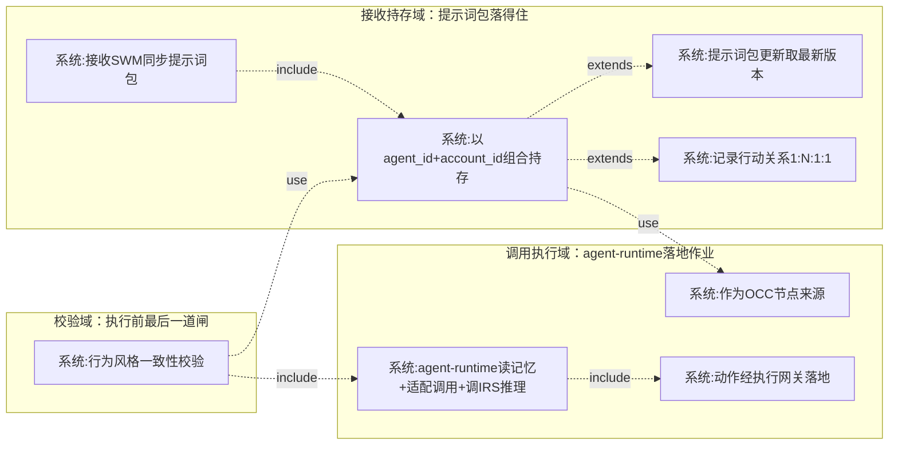

---

**第③步 理清流程**（工具：时序图 ｜ 产物：需求范围 ｜ 验收：是否穷举相关子系统）

正常流程涉及 4 个子系统/组件：蜂群智能体 SWM（II-14 同步提示词包）、私有化大模型 IRS（EI-05/II-08 推理）、统一执行网关（II-07 落地）、舆情行动 OCC（以 agent_id 引用作智能体节点来源）。

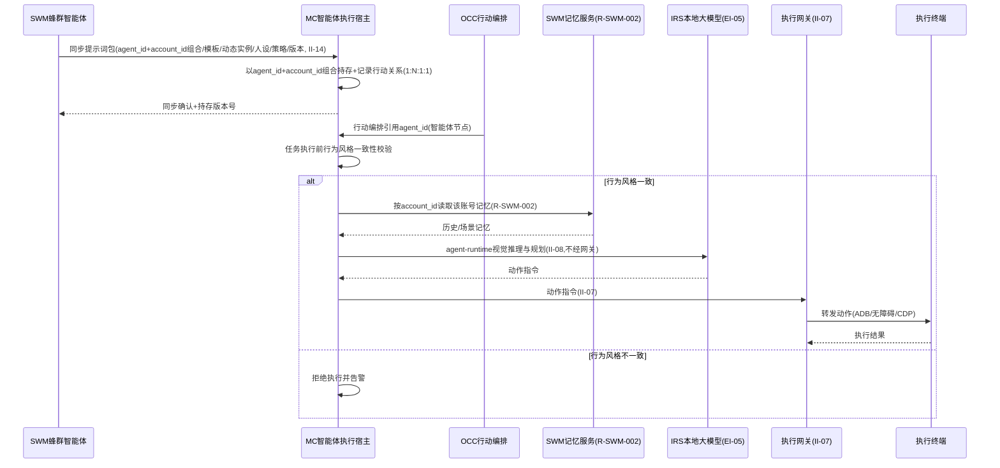

---

**第④步 理清流程-异常**（工具：流程图 ｜ 产物：异常场景 ｜ 验收：每个交互点是否都有异常分支）

| 交互点 | 异常分支 | 应对 |
|--------|---------|------|
| SWM ↔ MC（提示词包同步 II-14） | 同步失败 | 保留上一可用提示词包并告警 |
| MC 提示词包 | 提示词包缺失 | 降级为脚本模式或人工介入 |
| MC ↔ 记忆服务（读记忆） | 记忆服务不可用 | 降级为无记忆运行并告警 |
| MC ↔ IRS（推理 II-08） | 推理失败 | 降级处理 |
| MC 行为风格一致性校验 | 校验不通过（提示词行为风格不一致） | 拒绝执行并告警 |
| 四元绑定关系 | 缺失或冲突 | 挂起任务并提示 |

---

**第⑤步 列出规则**（工具：表格 ｜ 产物：验证点 ｜ 验收：规则是否可测、是否落到具体需求内）

| 规则 | 可测的验证点 | 归属子目标 |
|------|------------|-----------|
| 以 agent_id+account_id 组合为主键持存 SWM 同步的提示词包（模板按 agent_id、动态实例按 account_id） | 给定 agent_id+account_id 可取回持存提示词包 | ①持存提示词包 |
| 记录 agent_id↔account_id↔终端↔代理 IP 行动关系（1:N:1:1） | 行动关系可记录与查询 | ①持存提示词包 |
| 提示词包更新（同一 agent_id 重新同步并升版本）时取最新版本 | 更新后执行使用最新提示词包 | ①持存提示词包 |
| 执行前校验行为风格一致性，不一致拒绝执行并告警 | 注入不一致人设后任务被拒绝且告警 | ②校验（最后一道闸） |
| 执行时 agent-runtime 读记忆+按提示词包运行+调 IRS 推理、动作指令经执行网关落地 | 智能体模式下可驱动终端动作且动作经网关收口 | ③调用执行 |
| 作为 OCC 行动编排智能体节点来源，以 agent_id 引用 | OCC 编排中的智能体节点可引用 MC 持存提示词包 | ①持存提示词包/③调用执行 |

---

**拆分结论**：三子目标围绕"智能体执行宿主"这一价值（持存→校验→调用），作为一条端到端链路，作为一个需求。编号 R-MC-014。

#### R-MC-014 智能体执行宿主与同步

**需求目的**：作为智能体的执行宿主，接收并持存蜂群智能体子系统（SWM）同步来的提示词包（以 agent_id 为标识，含提示词、作业策略），在任务执行时由 MC 的 agent-runtime 子模块运行（场景适配、动态调用提示词、调用 IRS 推理）驱动设备作业，并在执行前校验行为风格一致性。本功能确立"SWM 为提示词生成与记忆中心、MC 为智能体执行宿主（含运行时 agent-runtime）"的分工。

**使用角色**：系统（接收同步、持存、校验、调用）。

**前置条件**：SWM 提示词包同步接口（II-14）可用；执行网关可用；智能体已与账号建立 agent_id↔account_id 1:N 绑定（R-MC-013，一个 agent 可绑多个账号）。

**输入**：来自 SWM 的提示词包（agent_id+account_id 组合主键、提示词模板、账号级动态提示词实例、作业策略）、任务执行请求（含目标 agent_id 与 account_id）。

**输出**：持存的提示词包（按 agent_id+account_id 组合索引）、行动关系（agent_id↔account_id↔终端↔代理 IP = 1:N:1:1）、智能体执行调用结果、行为风格一致性校验结果、执行网关的动作日志。

**业务规则**：

| 规则 | 说明 |
|------|------|
| 提示词包持存 | 本子系统以 agent_id + account_id 组合为主键接收 SWM 同步的提示词包（提示词模板按 agent_id 共性、动态提示词实例按 account_id 个性）并持存，作为任务执行时 agent-runtime 运行智能体的依据 |
| 行动关系记录 | 本子系统记录并维护 agent_id↔account_id↔终端↔代理 IP 的行动关系（与 R-MC-013 的 agent_id↔account_id 1:N 绑定、R-MC-009 的账号-终端绑定、R-MC-003 的终端-代理 IP 绑定联动），形成 agent_id:account_id:终端:代理 IP = 1:N:1:1 行动关系；账号级记忆与动态提示词实例按 account_id 1:1 归属 |
| 行为风格一致性校验 | 智能体模式下任务执行前，本子系统校验"当前 account_id 绑定的动态提示词实例"与"agent_id 提示词模板"行为风格是否一致，一致方可调用 IRS 推理并经执行网关落地动作，不一致则拒绝执行并告警；一致性收口于执行宿主，作为最后一道闸 |
| 执行调用（agent-runtime） | 任务执行时本子系统的 agent-runtime 子模块按提示词包中的提示词模板与作业策略进行场景适配与动态调用，并从 SWM 记忆服务（R-SWM-002）按 account_id 读取该账号的记忆注入（同一 agent_id 下不同账号各自独立记忆），再调用 IRS 本地大模型进行视觉推理与规划，产出的动作指令经执行网关落地；agent-runtime 与执行网关逻辑隔离 |
| 定义更新 | 提示词包更新时（SWM 以同一 agent_id+account_id 组合重新同步并升级版本号）本子系统更新持存版本，保证执行使用最新版本 |
| OCC 节点来源 | 本子系统可作为 OCC 行动编排的执行节点来源——编排中的智能体节点即以 agent_id 引用本子系统持存的提示词包 |

**异常场景**：SWM 同步失败时保留上一可用定义并告警；智能体定义缺失时降级为脚本模式或人工介入；推理调用 IRS 失败时降级处理；行为风格一致性校验不通过时拒绝执行并告警；行动关系缺失或冲突时挂起任务并提示。

**验收标准**：可以 agent_id+account_id 组合接收并持存 SWM 同步的提示词包；行动关系（agent_id↔account_id↔终端↔代理 IP = 1:N:1:1）可记录与查询；任务执行前可校验行为风格一致性且不一致时拒绝执行；任务执行时可由 agent-runtime 按提示词包运行（记忆按 account_id 读取）并经执行网关落地动作；提示词包更新后可使用最新版本执行；可作为 OCC 行动编排的智能体节点来源（以 agent_id 引用）。

**关联接口**：II-08 本地大模型推理调用、II-14 提示词包同步接口、II-07 执行网关动作接口、EI-05 本地大模型推理。

> 说明：MC 子系统的八项用户需求均已按"目标澄清 → 梳理场景 → 理清流程 → 理清流程-异常 → 列出规则"五步分析，并按"足够小、端到端、独立性、可测性"四原则重新划分为 R-MC-001 ~ R-MC-014 共 14 个需求。

