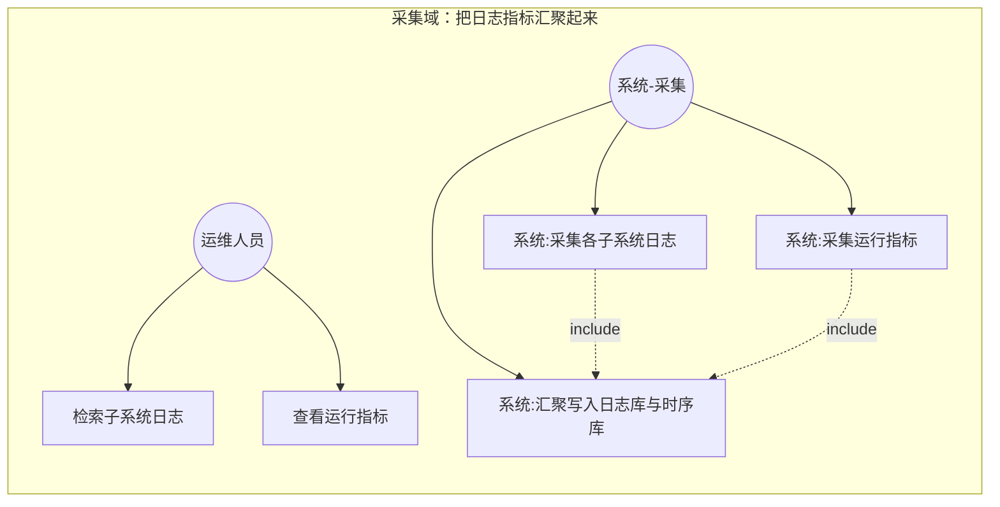
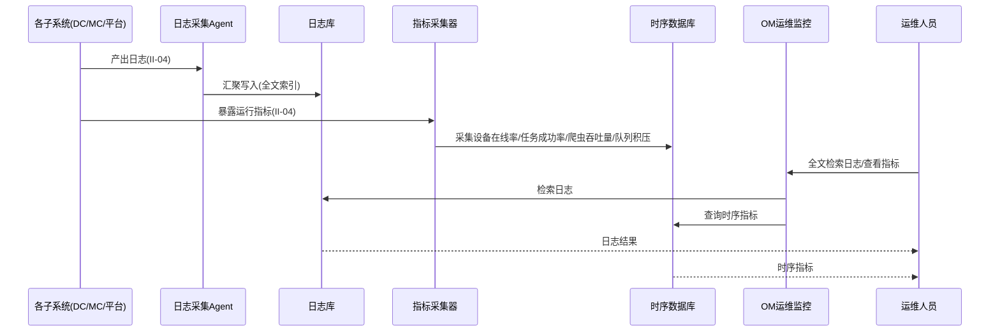
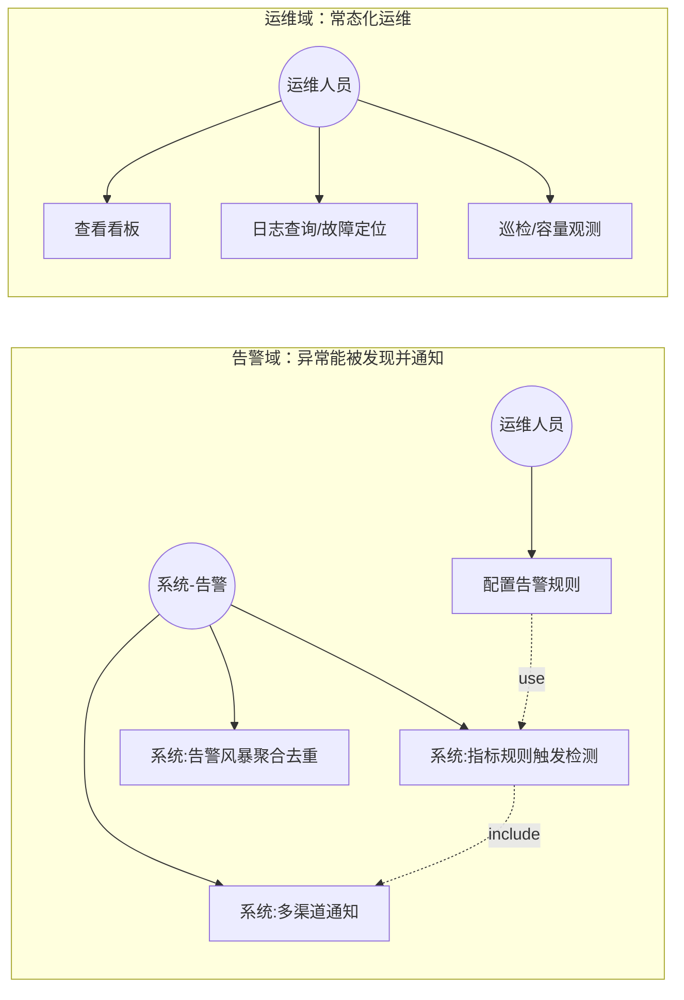
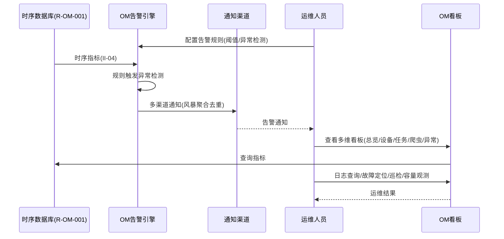

# 软件需求规格说明 - 运维监控子系统（OM）分册

| 项目 | 内容 |
| --- | --- |
| 项目名称 | 认知作战平台（v1.0） |
| 文档版本 | V3.8 |
| 密级 | 内部使用 |
| 编制 | 石建国 |
| 编制日期 | 2026-07-15 |

---

## 1 引言

### 1.1 标识

本文件为「认知作战平台」运维监控子系统（OM，OM（Ops Monitor））的**软件需求规格说明分册**。它是《软件需求规格说明》总册（V3.8）按子系统拆分的组成部分，承载 运维监控子系统 的全部功能需求（R-OM-001 ~ R-OM-002（2 项））。需求编号 `R-OM-NNN` 与总册一致，全程不变，作为需求双向追溯的依据。

### 1.2 文档概述

本分册章节安排：第 1 章引言；第 2 章引用文件；第 3 章 运维监控子系统 功能需求（按子区域给出各 `R-OM-NNN` 需求块）。系统级共性内容（引言概述、术语缩略语、接口 EI/II、数据 DR、非功能 NR、约束 CON、合格性规定、附录）见《软件需求规格说明-总册》。

### 1.3 术语和缩略语

沿用《软件需求规格说明-总册》第 1.4 节术语与缩略语，本分册不再重复。

---

## 2 引用文件

| 文件 | 说明 |
| --- | --- |
| 《软件需求规格说明-总册》V3.8 | 系统级共性需求（引言/术语/接口/数据/非功能/约束/合格性/附录） |
| 《软件需求跟踪矩阵.xlsx》 | 需求双向追溯唯一权威源（`R-OM-NNN` 追溯链） |
| 《软件概要设计说明》V2.7 | OM 子系统功能模块设计（M-OM-NN） |
| 《软件详细设计说明-OM子系统》 | OM 子系统详细设计 |

---

## 3 运维监控子系统（OM）功能需求

> 本节为 运维监控子系统（OM）的全部功能需求，对应 R-OM-001 ~ R-OM-002（2 项）。需求编号 `R-OM-NNN` 不变，逐字搬迁自原《软件需求规格说明》。

---

### 日志与指标汇聚

**用户需求概述**：汇聚数据爬取子系统、群控子系统及平台自身的日志与指标，形成统一的运维数据底座，支撑全系统可观测。

**第①步 目标澄清**（工具：干系人多角度分析 ｜ 产物：子目标清单 ｜ 验收：是否穷举所有干系人的价值诉求）：①运维人员能检索各子系统日志、查看运行指标（可观测底座）；②指标可形成时序数据供告警与分析。
**第②步 梳理场景**（工具：用例图 ｜ 产物：场景 ｜ 验收：是否穷举所有用户操作）

各角色的操作穷举：

| 角色 | 操作 |
|------|------|
| 运维人员 | 检索各子系统日志（全文检索）、查看运行指标 |
| 系统（自动） | 采集各子系统日志与指标、汇聚至日志库与时序库、Agent 本地暂存与补传 |

---

**第③步 理清流程**（工具：时序图 ｜ 产物：需求范围 ｜ 验收：是否穷举相关子系统）

---

**第④步 理清流程-异常**（工具：流程图 ｜ 产物：异常场景 ｜ 验收：每个交互点是否都有异常分支）

| 交互点 | 异常分支 | 应对 |
|--------|---------|------|
| Agent ↔ 各子系统 | Agent 离线 | 本地暂存，恢复后补传 |
| Agent ↔ 日志库 | 采集超时 | 降级采样 |
| 采集器/Agent ↔ 日志库/TSDB | 写入失败 | 进入重试队列重试 |

---

**第⑤步 列出规则**（工具：表格 ｜ 产物：验证点 ｜ 验收：规则是否可测、是否落到具体需求内）

| 规则 | 可测的验证点 | 归属子目标 |
|------|------------|-----------|
| 日志汇聚至统一日志库 | 各子系统日志可统一检索 | ①日志可检索 |
| 日志全文检索 | 给定关键词，近 7 日日志 ≤3s 返回结果 | ①日志可检索 |
| 关键指标采集时序化 | 设备在线率/任务成功率/爬虫吞吐量/队列积压可查时序曲线 | ②指标时序化 |

---

**拆分结论**：一个端到端价值（可观测底座），不拆。编号 R-OM-001。四原则自检：足够小✓（日志汇聚+指标时序化单一职责）｜端到端✓（各子系统日志→统一可检索）｜独立性✓（独立）｜可测性✓（≤3s 检索响应可度量）。

#### R-OM-001 日志与指标汇聚

**需求目的**：汇聚数据爬取子系统、群控子系统及平台自身的日志与指标，形成统一的运维数据底座，支撑全系统可观测。

**使用角色**：运维人员（检索日志与查看指标）、系统（自动采集与汇聚）。

**前置条件**：各子系统日志采集 Agent 与指标采集器已部署；日志库与时序数据库可用。

**输入**：各子系统产生的日志与系统运行指标。

**输出**：统一日志库与时序指标数据。

**业务规则**：

| 规则 | 说明 |
|------|------|
| 日志汇聚检索 | 系统通过日志采集将各子系统日志汇聚至统一日志库，支持全文检索 |
| 指标时序化 | 系统通过指标采集器采集设备在线率、任务成功率、爬虫吞吐量、队列积压等指标，形成时序数据 |

**异常场景**：日志采集 Agent 离线时本地暂存待恢复上报；指标采集超时时降级采样；日志库写入失败时进入重试队列。

**验收标准**：各子系统日志可汇聚至统一日志库并支持全文检索；关键指标可采集为时序数据；近 7 日日志检索响应不大于 3 秒。

**关联接口**：II-04 日志与指标上报接口。

### 告警与运维

**用户需求概述**：基于指标与规则产生告警，并通过仪表盘与运维操作支持常态化运维。

**第①步 目标澄清**（工具：干系人多角度分析 ｜ 产物：子目标清单 ｜ 验收：是否穷举所有干系人的价值诉求）：①指标与规则触发的异常能被及时发现并通知运维人员（告警）；②运维人员能通过看板与运维操作做常态化运维。
**第②步 梳理场景**（工具：用例图 ｜ 产物：场景 ｜ 验收：是否穷举所有用户操作）

各角色的操作穷举：

| 角色 | 操作 |
|------|------|
| 运维人员 | 配置告警规则（阈值/异常检测）、查看看板（总览/设备/任务/爬虫/异常）、执行运维操作（日志查询/故障定位/巡检/容量观测） |
| 系统（自动） | 指标与规则触发异常检测、告警多渠道通知、告警风暴聚合去重 |

---

**第③步 理清流程**（工具：时序图 ｜ 产物：需求范围 ｜ 验收：是否穷举相关子系统）

---

**第④步 理清流程-异常**（工具：流程图 ｜ 产物：异常场景 ｜ 验收：每个交互点是否都有异常分支）

| 交互点 | 异常分支 | 应对 |
|--------|---------|------|
| 告警引擎 ↔ 规则/指标 | 告警风暴 | 聚合去重 |
| 告警引擎 ↔ 通知渠道 | 通知渠道失效 | 降级至备用渠道 |
| 看板 ↔ 时序数据库 | 看板查询超时 | 降级（缓存/抽样展示） |

---

**第⑤步 列出规则**（工具：表格 ｜ 产物：验证点 ｜ 验收：规则是否可测、是否落到具体需求内）

| 规则 | 可测的验证点 | 归属子目标 |
|------|------------|-----------|
| 阈值/异常检测告警 | 指标越阈值或异常时触发告警 | ①异常及时发现通知 |
| 多渠道通知 | 告警可经多渠道送达运维人员 | ①异常及时发现通知 |
| 告警风暴聚合去重 | 短时大量同类告警聚合为一条 | ①异常及时发现通知 |
| 多维看板（总览/设备/任务/爬虫/异常） | 各维度看板可展示对应指标 | ②常态化运维 |
| 运维操作（日志查询/故障定位/巡检/容量观测） | 运维人员可执行各项运维操作 | ②常态化运维 |

---

**拆分结论**：一个端到端价值（常态化运维），不拆。编号 R-OM-002。四原则自检：足够小✓（告警+看板+运维操作单一职责）｜端到端✓（指标→告警通知→看板运维）｜独立性✓（依赖 R-OM-001）｜可测性✓（告警触发/看板展示/运维操作可验）。

#### R-OM-002 告警与运维

**需求目的**：基于指标与规则产生告警，并通过仪表盘与运维操作支持常态化运维。

**使用角色**：运维人员（配置告警规则、查看看板、执行运维操作）。

**前置条件**：时序指标数据可用（R-OM-001）；告警规则与通知渠道已配置。

**输入**：告警规则与指标、运维操作请求。

**输出**：告警事件、可视化看板、运维操作记录。

**业务规则**：

| 规则 | 说明 |
|------|------|
| 告警 | 系统支持阈值告警与异常检测告警，并通过多渠道通知 |
| 可视化看板 | 系统提供总览、设备、任务、爬虫、异常等多维可视化看板 |
| 运维操作 | 系统支持日志查询、故障定位、巡检与容量观测等常态化运维操作 |

**异常场景**：告警风暴时按规则聚合去重；通知渠道失效时降级为备用渠道；看板数据加载超时时降级展示缓存。

**验收标准**：阈值与异常检测告警可触发并多渠道通知；多维看板可可视化展示；日志查询、故障定位、巡检、容量观测等运维操作可执行。

**关联接口**：无（依赖 R-OM-001 时序指标数据）。

> 实现说明（V3.5 补充）：OM 采用「复用 KubeSphere 开源版可观测底座 + 只读观测」定位。告警规则（阈值/异常检测）与通知渠道的**配置**由运维人员经 KubeSphere 控制台操作（在 Alertmanager / Prometheus Rule CRD 中定义）；OM 提供告警规则与告警事件的**只读观测**及告警事件归档，不提供配置下发接口。多渠道通知由 Alertmanager 原生接收器（邮件/IM webhook/通用 webhook）承担。看板由 KubeSphere 内置 Grafana 渲染，OM 镜像看板元数据。详见《软件详细设计说明-OM子系统》。

> 说明：OM 子系统的两项用户需求均已按"目标澄清 → 梳理场景 → 理清流程 → 理清流程-异常 → 列出规则"五步分析，并按"足够小、端到端、独立性、可测性"四原则校验，划分为 R-OM-001 ~ R-OM-002 共 2 个需求。

