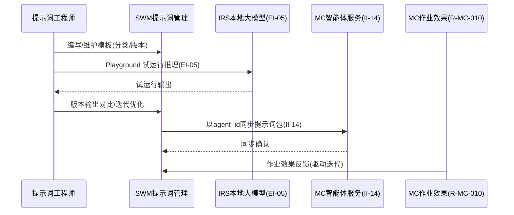
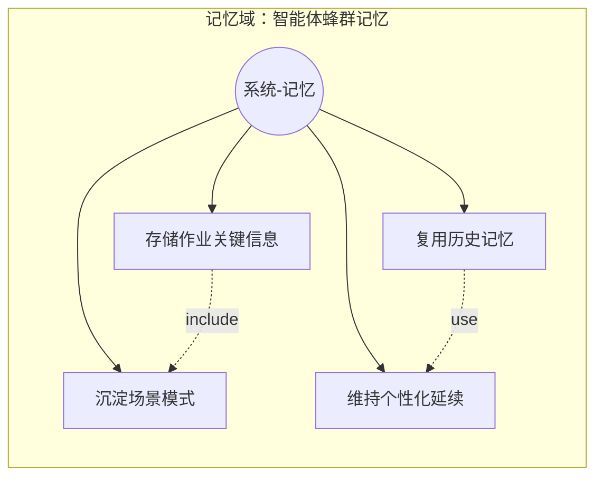
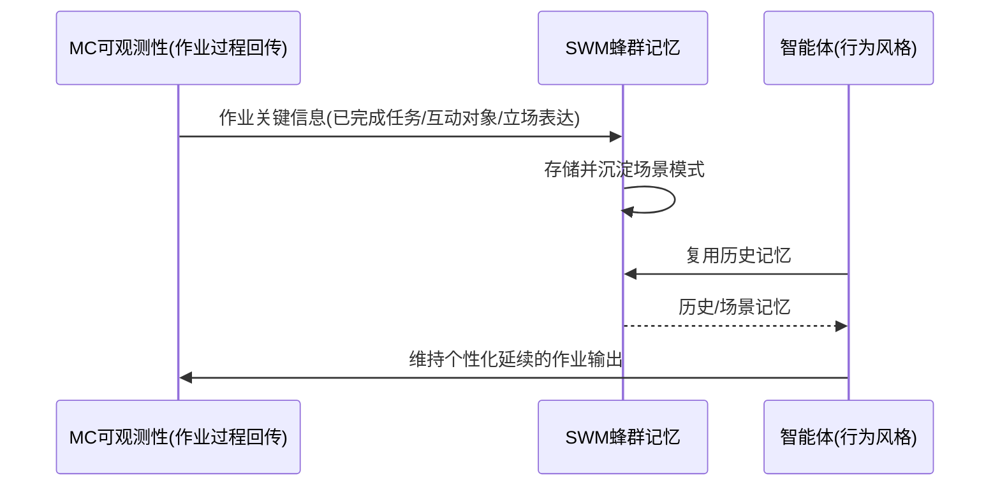
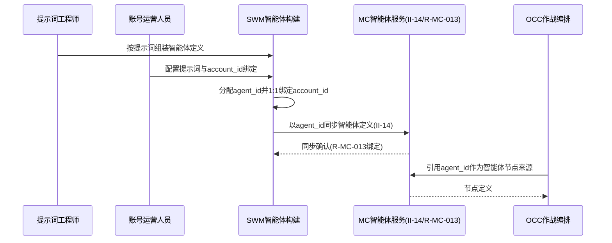
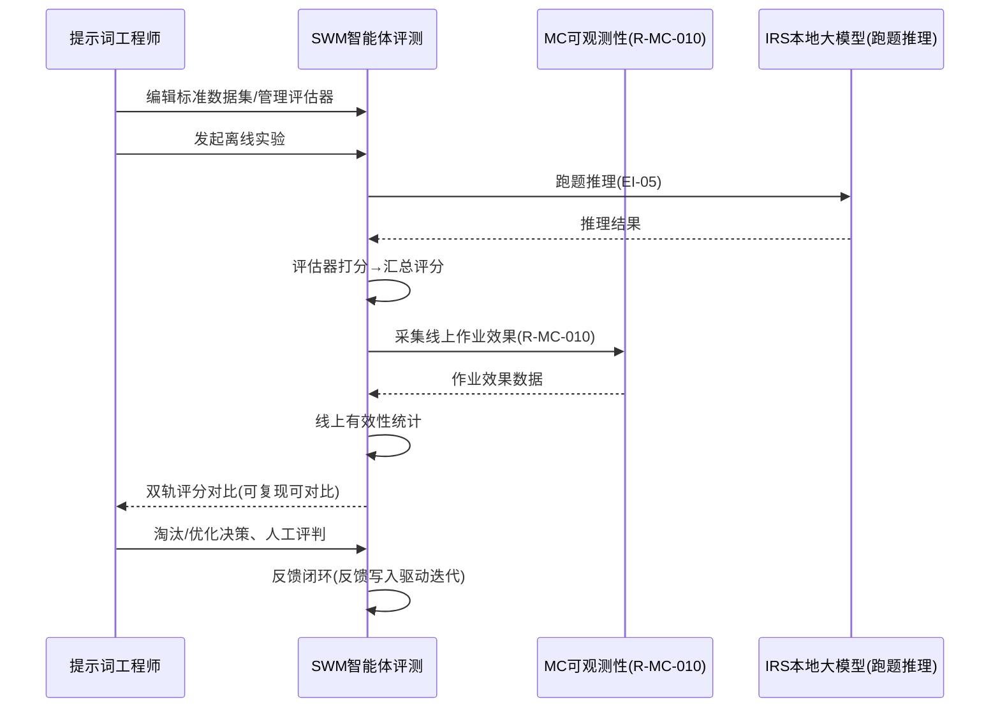
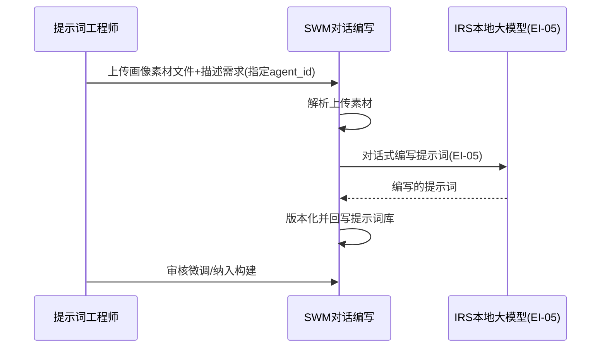

# 软件需求规格说明 - 蜂群智能体子系统（SWM）分册

| 项目 | 内容 |
| --- | --- |
| 项目名称 | 认知作战平台（v1.0） |
| 文档版本 | V3.9 |
| 密级 | 内部使用 |
| 编制 | 石建国 |
| 编制日期 | 2026-07-17 |

---

## 1 引言

### 1.1 标识

本文件为「认知作战平台」蜂群智能体子系统（SWM，SWM（Swarm））的**软件需求规格说明分册**。它是《软件需求规格说明》总册（V3.8）按子系统拆分的组成部分，承载 蜂群智能体子系统 的全部功能需求（R-SWM-001 ~ R-SWM-005（5 项））。需求编号 `R-SWM-NNN` 与总册一致，全程不变，作为需求双向追溯的依据。

### 1.2 文档概述

本分册章节安排：第 1 章引言；第 2 章引用文件；第 3 章 蜂群智能体子系统 功能需求（按子区域给出各 `R-SWM-NNN` 需求块）。系统级共性内容（引言概述、术语缩略语、接口 EI/II、数据 DR、非功能 NR、约束 CON、合格性规定、附录）见《软件需求规格说明-总册》。

### 1.3 术语和缩略语

沿用《软件需求规格说明-总册》第 1.4 节术语与缩略语，本分册不再重复。

---

## 2 引用文件

| 文件 | 说明 |
| --- | --- |
| 《软件需求规格说明-总册》V3.8 | 系统级共性需求（引言/术语/接口/数据/非功能/约束/合格性/附录） |
| 《软件需求跟踪矩阵.xlsx》 | 需求双向追溯唯一权威源（`R-SWM-NNN` 追溯链） |
| 《软件概要设计说明》V2.7 | SWM 子系统功能模块设计（M-SWM-NN） |
| 《软件详细设计说明-SWM子系统》 | SWM 子系统详细设计 |

---

## 3 蜂群智能体子系统（SWM）功能需求

> 本节为 蜂群智能体子系统（SWM）的全部功能需求，对应 R-SWM-001 ~ R-SWM-005（5 项）。需求编号 `R-SWM-NNN` 不变，逐字搬迁自原《软件需求规格说明》。

---


蜂群智能体子系统是执行层的"提示词生成与记忆中心"，核心职责是生成驱动智能体作业的提示词并管理记忆，并将生成的提示词包（提示词、作业策略）同步下发至群控子系统（MC）持存，由 MC 在任务执行时调用。子系统承担提示词管理、记忆管理、智能体构建、提示词生成与智能体评测。账号主数据、智能体账号的分层分组与作业生命周期由 MC 统一维护（账号主数据 R-MC-011、分层分组 R-MC-012）；作业效果统计与复盘由 MC 的可观测性能力（R-MC-010）承担。SWM 与 MC 的分工为：SWM 为提示词生成与记忆中心（生成、评测、编写与同步），MC 为智能体执行宿主（持存、运行时调用与执行，见 R-MC-014）。

> **V3.9 变更（ADR-001）**：废除「人设标签」作为独立数据实体。人设属性（身份/立场/语言风格/兴趣）不再以独立标签形式绑定到 agent_id，而是**直接写进提示词文本**；提示词包结构由（人设标签、提示词、作业策略）调整为（提示词、作业策略）。画像数据仍可作为生成提示词的输入原料（R-SWM-005），但喂入方式由系统经接口拉取改为用户上传。人设一致性校验（M-MC-14）语义调整为「行为风格一致性」。

本子系统不直接操作设备，所有动作均收口于群控子系统的统一执行网关。本子系统将生成的提示词包同步至 MC，MC 在任务执行时据此运行——运行时（场景适配、动态调用提示词、调用 IRS 本地大模型视觉推理）由 MC 内的 agent-runtime 子模块承担，产出的动作指令再经执行网关落地；agent-runtime 与执行网关逻辑隔离，以保持"推理与执行分离"语义（见 CON-10）。养号的拟人化节奏由群控子系统的自动化管理能力（R-MC-009）内置。本子系统也是 OCC 行动编排中智能体节点的供给方之一——OCC 编排 MC 中的智能体节点时，其智能体定义来源于本子系统同步至 MC 的内容。

本子系统的提示词工程（模板库、版本管理、Playground 试运行、版本输出对比）与智能体评测（评测集、评估器、实验）能力，以**魔改 coze-loop 作为 SWM 提示词工程与评测主体内核**（在开源项目 coze-loop 基础上定制开发，UI 层自研并与全平台统一控制台体验对齐）；其余智能体域组件（网关、编排提炼、记忆服务）采用 Java（Spring Boot），与管控/业务微服务统一 Java 栈一致（CON-14，智能体域特例，仿 DC 采集域特例思路）。

### 提示词管理

**用户需求概述**：管理驱动智能体作业的提示词，支持提示词模板库分类、版本管理与迭代优化，并提供 Playground 试运行调试与版本输出对比能力以加速提示词的编写与调优，最终以 agent_id 为标识将完整的提示词包（提示词、作业策略）同步至 MC 持存。

**第①步 目标澄清**（工具：干系人多角度分析 ｜ 产物：子目标清单 ｜ 验收：是否穷举所有干系人的价值诉求）：①提示词工程师能管理提示词模板库（分类/版本/迭代）；②提示词工程师能在 Playground 中试运行调试提示词并对比不同版本的输出；③提示词包能以 agent_id 同步至 MC 持存。
**第②步 梳理场景**（工具：用例图 ｜ 产物：场景 ｜ 验收：是否穷举所有用户操作）

各角色的操作穷举：

| 角色 | 操作 |
|------|------|
| 提示词工程师 | 管理提示词模板库（分类/版本）、Playground 试运行调试、版本输出对比、迭代优化 |
| 系统（自动） | 按 MC 作业效果反馈迭代、以 agent_id 同步提示词包至 MC（II-14） |

```mermaid
flowchart LR
  subgraph 模板域["模板域：提示词模板管理"]
    A1((提示词工程师))
    UC1[管理模板库分类]
    UC2[版本管理]
    UC4[Playground 试运行调试]
    UC5[版本输出对比]
    UC6[迭代优化]
    A1 --> UC1 & UC2 & UC4 & UC5 & UC6
  end
  subgraph 同步域["同步域：提示词包同步"]
    A3((系统-同步))
    UC9[系统:按效果反馈迭代]
    UC10[系统:agent_id同步MC(II-14)]
    A3 --> UC9 & UC10
  end
```

---

**第③步 理清流程**（工具：时序图 ｜ 产物：需求范围 ｜ 验收：是否穷举相关子系统）



---

**第④步 理清流程-异常**（工具：流程图 ｜ 产物：异常场景 ｜ 验收：每个交互点是否都有异常分支）

| 交互点 | 异常分支 | 应对 |
|--------|---------|------|
| SWM（版本管理） | 版本回滚失败 | 告警 |
| 工程师 ↔ IRS（Playground） | 试运行推理失败 | 展示错误并支持重试 |
| 效果 ↔ SWM（反馈迭代） | 反馈数据缺失 | 暂停迭代 |
| SWM ↔ MC（同步） | 同步失败 | 暂存并重试 |

---

**第⑤步 列出规则**（工具：表格 ｜ 产物：验证点 ｜ 验收：规则是否可测、是否落到具体需求内）

| 规则 | 可测的验证点 | 归属子目标 |
|------|------------|-----------|
| 模板库分类 | 模板可按分类组织检索 | ①模板管理 |
| 版本管理 | 模板有版本号，可回溯历史版本 | ①模板管理 |
| Playground 试运行调试/版本输出对比 | 试运行输出可在版本间对比 | ②调试对比 |
| 迭代优化（按 MC 作业效果反馈） | 效果反馈可驱动模板迭代 | ②迭代 |
| 定义同步（以 agent_id 同步 MC，II-14） | 提示词包以 agent_id 同步至 MC | ③定义同步 |

**拆分结论**：三子目标围绕"提示词管理"这一价值，作为一个需求。编号 R-SWM-001。四原则自检：足够小✓（提示词单一职责）｜端到端✓（模板→调试对比→同步）｜独立性✓（独立；运行时场景适配与动态调用移至 MC，见 R-MC-006/014）｜可测性✓（版本/试运行/同步可验）。

#### R-SWM-001 提示词管理

**需求目的**：管理驱动智能体作业的提示词，支持提示词模板库分类、版本管理、Playground 试运行调试、版本输出对比与迭代优化，并以 agent_id 为标识将完整的提示词包（提示词、作业策略）同步至 MC 持存。账号主数据由 MC 统一维护（R-MC-011）。提示词的运行时场景适配与动态调用（按场景选用模板、运行时填充生成指令）归 MC 的 agent-runtime 子模块承担（见 R-MC-006/014），不在本子系统。

**使用角色**：提示词工程师（编写与维护模板、Playground 调试与版本对比）、系统（迭代与同步）。

**前置条件**：提示词模板库已建立；agent_id 已分配；MC 提示词包同步接口（II-14）可用；作业上下文与效果反馈可采集；IRS 本地大模型可用（用于 Playground 试运行推理）。

**输入**：提示词模板、分类规则、适用场景标签、agent_id、作业上下文、效果反馈数据、Playground 调试输入（提示词草稿、测试用例）、待对比的提示词版本。

**输出**：提示词模板库、版本记录（按 agent_id 索引）、Playground 试运行产出与调试记录、版本输出对比结果、迭代优化记录、同步至 MC 的提示词包。

**业务规则**：

| 规则 | 说明 |
|------|------|
| 模板库分类 | 系统建立提示词模板库并按用途、平台、目标进行分类管理 |
| 版本管理 | 系统对提示词进行版本管理，以 agent_id 为主键索引，支持版本对比、回滚与变更记录 |
| Playground 试运行调试 | 系统提供提示词试运行调试工作台：提示词工程师在 Playground 中填入提示词草稿（可指定测试用例、目标平台等上下文）即时调用 IRS 本地大模型推理（经 EI-05，不经执行网关）并查看产出，支持参数调整后反复试跑；试运行不产生真实作业、不同步至 MC、不影响线上提示词包 |
| 版本输出对比 | 系统支持将同一 agent_id 下不同版本的提示词（或草稿与历史版本）并排输入相同测试用例，调用 IRS 推理后并排展示各版本产出，供提示词工程师对比调优效果，辅助版本择优与迭代决策 |
| 迭代优化 | 系统结合作业效果反馈与 Playground/对比调优结果对提示词进行迭代优化，淘汰低效模板 |
| 提示词包同步 | 系统将 agent_id 对应的提示词、作业策略组装为提示词包，经 II-14 接口同步至 MC 持存（见 R-MC-014）；记忆不在提示词包内，由 MC 的 agent-runtime 运行时向 SWM 记忆服务读取；提示词更新时以同一 agent_id 重新同步并升级版本号 |

**异常场景**：版本回滚失败时告警；Playground 试运行推理调用 IRS 失败时展示错误并支持重试，不影响线上提示词包；效果反馈缺失时暂停迭代；同步至 MC 失败时暂存重试。

**验收标准**：提示词模板库可分类管理；版本可按 agent_id 对比回滚；可在 Playground 中填入提示词草稿即时调用 IRS 试运行并查看产出；可将不同版本提示词并排对比输出；可结合反馈与调优结果迭代优化；提示词包可以 agent_id 同步至 MC 持存。

**关联接口**：EI-05 本地大模型推理（Playground 试运行与版本对比推理）、II-14 提示词包同步接口。

### 蜂群记忆管理

**用户需求概述**：实现智能体作业记忆的存储、场景沉淀、历史复用与个性化状态延续，使智能体长期行为符合行为风格且不断演进。

**第①步 目标澄清**（工具：干系人多角度分析 ｜ 产物：子目标清单 ｜ 验收：是否穷举所有干系人的价值诉求）：①智能体能存储作业关键信息并沉淀场景模式；②智能体能复用历史记忆维持个性化延续。
**第②步 梳理场景**（工具：用例图 ｜ 产物：场景 ｜ 验收：是否穷举所有用户操作）

各角色的操作穷举（记忆为系统内部存储，无人工操作）：

| 角色 | 操作 |
|------|------|
| 系统（自动） | 存储作业关键信息、沉淀场景模式、复用历史记忆、维持个性化延续 |



---

**第③步 理清流程**（工具：时序图 ｜ 产物：需求范围 ｜ 验收：是否穷举相关子系统）



---

**第④步 理清流程-异常**（工具：流程图 ｜ 产物：异常场景 ｜ 验收：每个交互点是否都有异常分支）

| 交互点 | 异常分支 | 应对 |
|--------|---------|------|
| MC ↔ 记忆（存储） | 存储失败 | 本地暂存，恢复后补写 |
| 记忆内部（多源写入） | 记忆冲突 | 以最新记忆为准 |
| 智能体 ↔ 记忆（复用） | 复用偏离行为风格 | 纠正回行为风格基线 |

---

**第⑤步 列出规则**（工具：表格 ｜ 产物：验证点 ｜ 验收：规则是否可测、是否落到具体需求内）

| 规则 | 可测的验证点 | 归属子目标 |
|------|------------|-----------|
| 记忆存储 | 作业关键信息可写入记忆并被读回 | ①存储沉淀 |
| 场景沉淀 | 相似作业模式可被归纳沉淀 | ①存储沉淀 |
| 历史复用 | 智能体可复用历史记忆完成作业 | ②复用延续 |
| 个性化延续 | 跨作业维持行为风格一致性（行为风格一致性评分不退化） | ②复用延续 |

**拆分结论**：两子目标围绕"智能体记忆"这一价值，作为一个需求。编号 R-SWM-002。四原则自检：足够小✓（记忆存储/沉淀/复用单一职责）｜端到端✓（作业过程→记忆→复用延续）｜独立性✓（独立）｜可测性✓（行为风格一致性评分提升可度量）。

#### R-SWM-002 蜂群记忆管理

**需求目的**：实现智能体作业记忆的存储、场景沉淀、历史复用与个性化状态延续，使智能体长期行为符合行为风格且不断演进。

**使用角色**：系统（自动存储与复用记忆）。

**前置条件**：记忆存储库可用；智能体已配置提示词。

**输入**：智能体作业过程数据、交互上下文、提示词、历史记忆库。

**输出**：智能体作业记忆库、场景沉淀的模式、历史复用结果、个性化状态延续的智能体画像。

**业务规则**：

| 规则 | 说明 |
|------|------|
| 记忆存储 | 系统对智能体作业过程中的关键信息进行记忆存储，包括已完成任务、互动对象、立场表达等 |
| 场景沉淀 | 系统将重复场景下的经验沉淀为场景记忆，形成可复用的行为模式 |
| 历史复用 | 系统在相似作业中复用历史记忆，提升作业连贯性与效率 |
| 个性化延续 | 系统基于记忆维持智能体的个性化状态延续，使其长期行为符合行为风格且不断演进 |

**异常场景**：记忆存储失败时暂存待重试；记忆冲突时以最新记忆为准；复用记忆偏离行为风格时纠正。

**验收标准**：作业关键信息可记忆存储；重复场景经验可沉淀为模式；相似作业可复用历史记忆；智能体可基于记忆维持个性化延续；启用记忆后智能体的行为风格一致性有效性由评测子系统（R-SWM-004）的 loop 评估器度量，行为风格一致性评分须达到 loop 评估器设定的可用线，且跨轮次作业的行为连贯性不退化。

**关联接口**：无（记忆为 SWM 内部存储）。

### 智能体构建

**用户需求概述**：根据提示词构建可作业的智能体——编写驱动智能体作业的提示词与记忆初值、配置作业策略，形成完整的智能体定义并以 agent_id 为标识，经 II-14 同步至 MC 持存、供 OCC 作战编排引用。

**第①步 目标澄清**（工具：干系人多角度分析 ｜ 产物：子目标清单 ｜ 验收：是否穷举所有干系人的价值诉求）：①构建侧能按提示词组装出完整智能体定义并以 agent_id 标识；②定义能与 account_id 1:1 绑定并同步至 MC、作为 OCC 节点来源。
**第②步 梳理场景**（工具：用例图 ｜ 产物：场景 ｜ 验收：是否穷举所有用户操作）

各角色的操作穷举：

| 角色 | 操作 |
|------|------|
| 提示词工程师 | 按提示词组装智能体定义（提示词/记忆/工具等要素） |
| 账号运营人员 | 配置提示词与 account_id 绑定 |
| 系统（自动） | 分配 agent_id、以 agent_id 同步 MC（II-14）、作为 OCC 节点来源 |

```mermaid
flowchart LR
  subgraph 构建域["构建域：组装智能体定义"]
    A1((提示词工程师))
    A2((账号运营人员))
    UC1[按提示词组装智能体定义]
    UC2[配置提示词与account_id绑定]
    A1 --> UC1
    A2 --> UC2
  end
  subgraph 同步域["同步域：标识绑定与分发"]
    A3((系统-构建))
    UC3[系统:分配agent_id]
    UC4[系统:1:1绑定account_id]
    UC5[系统:agent_id同步MC(II-14)]
    UC6[系统:作为OCC节点来源]
    A3 --> UC3 & UC4 & UC5 & UC6
    UC1 -. use .-> UC3
    UC2 -. use .-> UC4
    UC3 -. include .-> UC5
    UC5 -. extends .-> UC6
  end
```

---

**第③步 理清流程**（工具：时序图 ｜ 产物：需求范围 ｜ 验收：是否穷举相关子系统）



---

**第④步 理清流程-异常**（工具：流程图 ｜ 产物：异常场景 ｜ 验收：每个交互点是否都有异常分支）

| 交互点 | 异常分支 | 应对 |
|--------|---------|------|
| SWM（定义组装） | 定义冲突 | 人工裁定 |
| SWM ↔ MC（1:1 绑定） | 绑定冲突 | 告警 |
| SWM ↔ MC（同步） | 同步失败 | 保留上一可用定义并重试 |

---

**第⑤步 列出规则**（工具：表格 ｜ 产物：验证点 ｜ 验收：规则是否可测、是否落到具体需求内）

| 规则 | 可测的验证点 | 归属子目标 |
|------|------------|-----------|
| 按提示词组装定义 | 组装出的定义四要素完整且可执行 | ①组装定义 |
| agent_id ↔ account_id 1:1 绑定 | 一个 agent_id 唯一对应一个 account_id | ②绑定 |
| 以 agent_id 同步 MC（II-14） | 定义可经 II-14 同步至 MC 持存 | ②同步 MC |
| 作为 OCC 节点来源 | OCC 编排可按 agent_id 引用智能体节点 | ②节点来源 |

**拆分结论**：两子目标围绕"智能体构建"这一价值，作为一个需求。编号 R-SWM-003。四原则自检：足够小✓（定义组装+绑定+同步单一职责）｜端到端✓（提示词→定义→绑定→同步MC）｜独立性✓（独立）｜可测性✓（四要素完整/同步成功率可度量）。

#### R-SWM-003 智能体构建

**需求目的**：根据提示词（人设属性直接写进提示词文本）构建可作业的智能体——配置驱动作业的提示词与作业策略（目标、场景、边界），组装为提示词包（提示词、作业策略）并以 agent_id 为标识，经内部接口 II-14 同步至群控子系统（MC）持存、供舆情作战子系统（OCC）作战编排引用。记忆初值不在提示词包内，由 SWM 记忆服务（R-SWM-002）独立承载。本功能确立"SWM 生成提示词包、MC 持存并运行（agent-runtime）、OCC 编排引用"的分工。

**使用角色**：提示词工程师与账号运营人员（构建与配置）、系统（分配 agent_id 与同步）。

**前置条件**：提示词模板已建立（R-SWM-001）；作业策略规范已制定；MC 账号服务接口与 II-14 可用。

**输入**：提示词、作业策略（目标、场景、边界）、绑定的账号标识（account_id）。

**输出**：提示词包（以 agent_id 为标识）、同步确认与 MC 持存版本号。

**业务规则**：

| 规则 | 说明 |
|------|------|
| agent_id 形态 | agent_id 为稳定的逻辑标识，不随提示词重新生成而变；提示词版本作为 agent_id 下的子属性，每次提示词重新生成升级版本号；agent_id 与 account_id 严格 1:1 绑定，绑定关系记录由 MC 的 R-MC-013 维护，本子系统在构建时引用 account_id |
| 提示词包组装 | 系统按提示词配置提示词与作业策略，组装为提示词包，以全局唯一的 agent_id 为标识；提示词可手动编写或由 R-SWM-005 对话编写生成 |
| 提示词包同步 | 构建完成的提示词包经内部接口 II-14 同步至 MC 持存，作为 MC 的 agent-runtime 子模块在任务执行时运行智能体的依据；同步成功率不低于 99% |
| OCC 节点来源 | 构建出的提示词包是 OCC 作战编排中智能体节点的定义来源（OCC 编排 MC 中已持存的智能体） |

**异常场景**：提示词包内部冲突（提示词与作业策略不一致）时提示人工裁定；与 account_id 绑定冲突时告警；同步失败时保留上一可用提示词包并重试。

**验收标准**：可按提示词构建提示词包并以 agent_id 为标识；提示词包须包含提示词、作业策略两项必填要素，缺一不可构建；agent_id 为稳定逻辑标识、提示词版本可随重生成升级；可与 account_id 严格 1:1 绑定；提示词包可经 II-14 同步至 MC 持存并取得版本号且同步成功率不低于 99%；构建出的智能体可作为 OCC 作战编排的智能体节点来源。

**关联接口**：II-14 提示词包同步接口。

### 智能体评测

**用户需求概述**：对构建出的智能体进行质量评测，采用「线上效果 + 离线数据集」双轨评测范式评估智能体的有效性、稳定性与合规性；离线评测以"评测集 + 评估器 + 实验"三类可管理实体组织，支持评估器复用、实验可追踪与版本对比，淘汰低效定义、迭代优化高价值定义，形成"构建→评测→迭代"的闭环。

**第①步 目标澄清**（工具：干系人多角度分析 ｜ 产物：子目标清单 ｜ 验收：是否穷举所有干系人的价值诉求）：①能基于 MC 作业效果数据评测智能体线上有效性（真实表现）；②能基于标准评测数据集做离线 benchmark 评测（受控可复现可对比）；③能将打分逻辑管理为可复用、可配置、跨实验引用的评估器实体；④能以"实验"为单位追踪每一次评测运行（输入快照、跑题结果、评分），并跨版本对比实验结果；⑤评测结论能反馈驱动迭代。
**第②步 梳理场景**（工具：用例图 ｜ 产物：场景 ｜ 验收：是否穷举所有用户操作）

各角色的操作穷举：

| 角色 | 操作 |
|------|------|
| 提示词工程师 | 编辑标准数据集、管理评估器、发起实验、查看评分汇总、迭代优化、人工评判 |
| 系统（自动） | 采集 MC 线上作业效果、离线跑题推理打分、记录实验、反馈驱动决策 |

```mermaid
flowchart LR
  subgraph 线上域["线上域：线上有效性评测"]
    A1((系统-采集))
    UC1[系统:采集MC作业效果(R-MC-010)]
    UC2[系统:统计线上有效性]
    A1 --> UC1 & UC2
    UC1 -. include .-> UC2
  end
  subgraph 离线域["离线域：标准数据集 benchmark"]
    A2((提示词工程师))
    A3((系统-跑题))
    UC3[编辑标准数据集]
    UC4[系统:IRS跑题推理打分]
    UC5[系统:汇总评分]
    UC6[管理评估器]
    UC7[发起实验/记录实验]
    UC8[人工评判]
    A2 --> UC3 & UC6 & UC7 & UC8
    A3 --> UC4 & UC5
    UC3 -. use .-> UC4
    UC4 -. include .-> UC5
  end
  UC2 -. feedback .-> UC7
```

---

**第③步 理清流程**（工具：时序图 ｜ 产物：需求范围 ｜ 验收：是否穷举相关子系统）



---

**第④步 理清流程-异常**（工具：流程图 ｜ 产物：异常场景 ｜ 验收：每个交互点是否都有异常分支）

| 交互点 | 异常分支 | 应对 |
|--------|---------|------|
| SWM ↔ MC（采集效果） | MC 数据不足 | 标注评测不完整 |
| SWM ↔ IRS（跑题推理） | 跑题 IRS 失败 | 标记失败并支持重跑 |
| SWM（LLM 裁判打分） | 裁判置信度低 | 标记转人工评判 |
| SWM（反馈写入） | 反馈写入失败 | 暂存并重试 |

---

**第⑤步 列出规则**（工具：表格 ｜ 产物：验证点 ｜ 验收：规则是否可测、是否落到具体需求内）

| 规则 | 可测的验证点 | 归属子目标 |
|------|------------|-----------|
| 线上有效性评测 | 基于 MC 作业效果可统计线上有效性指标 | ①线上有效性 |
| 离线数据集评测（录入→跑题→打分→汇总） | 数据集可录入→IRS 跑题→评估器打分→汇总 | ②离线 benchmark |
| 可复现可对比 | 同一数据集/评估器多次实验结果可复现可对比 | ②离线 benchmark |
| 淘汰/优化决策（及格 60/淘汰 40 分） | 评分低于淘汰线被淘汰、高于及格线可上线 | ③决策 |
| 反馈闭环 | 评测结论可反馈驱动智能体迭代 | ③反馈闭环 |

**拆分结论**：五子目标围绕"智能体评测"这一价值（双轨互补印证，离线评测以评测集+评估器+实验三实体组织），作为一个需求。编号 R-SWM-004。四原则自检：足够小✓（双轨评测单一职责）｜端到端✓（线上效果+离线数据集→实验→评分→淘汰/迭代）｜独立性✓（依赖 R-MC-010/IRS）｜可测性✓（及格60/淘汰40分/完成率50%可度量）。

#### R-SWM-004 智能体评测

**需求目的**：对构建出的智能体（R-SWM-003）进行质量评测，采用「线上效果 + 离线数据集」双轨评测范式评估智能体的有效性、稳定性与合规性；离线评测以"评测集、评估器、实验"三类可管理实体组织——评测集承载测试用例，评估器承载可复用的打分逻辑，实验承载一次可追踪、可对比的评测运行，淘汰低效定义、迭代优化高价值定义，形成"构建→评测→迭代"的闭环，使智能体定义随作业实践持续演进。双轨评测互补印证：线上效果反映真实作战表现，离线数据集提供受控、可复现、可对比的质量基准，避免单一维度误判。

**使用角色**：提示词工程师（编辑评测数据集、管理评估器、发起与复盘实验、迭代决策、人工评判）、系统（自动采集线上效果、执行离线跑题评测与打分、记录与持久化实验）。

**前置条件**：智能体已构建（R-SWM-003）；线上有效性评测需智能体已执行过作业且 MC 作业效果数据可获取（R-MC-010）；离线数据集评测需 IRS 本地大模型可用（用于跑题推理）。

**输入**：线上有效性评测输入——智能体作业效果反馈（触达、互动、完成情况，来自 MC 可观测性）；离线数据集评测输入——评测数据集（测试用例集，每条含问题、预期答案、评分标准与所属评分维度）、评估器配置（打分模式与判定参数）、智能体定义（提示词+人设+记忆）、历史实验基线。

**输出**：智能体评测报告（含线上有效性统计与离线数据集得分）、各维度评分（有效性/稳定性/合规性/人设一致性）、实验记录（输入快照、跑题结果、逐题评分与汇总）、跨版本实验对比结果、迭代建议、淘汰/优化决策。

**业务规则**：

| 规则 | 说明 |
|------|------|
| 线上有效性评测 | 系统基于 MC 可观测性（R-MC-010）上报的作业效果数据评测智能体的有效性（触达、互动、任务完成率等），反映真实作战表现 |
| 离线数据集评测 | 系统基于标准评测数据集对智能体进行受控 benchmark 评测，流程为「录入数据集 → 配置评估器 → 发起实验 → 批量跑题 → 对比预期答案打分 → 汇总报告」：数据集录入（每条含问题、预期答案、评分标准、权重与评分维度）、批量跑题（逐题交 IRS 本地大模型推理，不经执行网关）、答案对比与打分（由所选评估器按其打分模式执行）、评分汇总（按维度汇总得分、通过率、人设漂移维度） |
| 评估器管理 | 系统将打分逻辑管理为可独立管理、可复用的"评估器"实体，每个评估器封装一种打分模式及其判定参数（规则匹配的匹配规则与容差、LLM 裁判的裁判提示词与置信度阈值、人工评判的评判表单）；评估器可创建、编辑、版本化并跨实验引用，逐题可指定不同评估器 |
| 实验管理 | 系统将一次评测运行管理为可追踪的"实验"实体：实验绑定被测智能体定义版本、评测集、所用的评估器集合，记录输入快照、逐题跑题结果与评分、各维度汇总得分、运行状态（运行中/完成/失败/部分失败）；实验持久化保存，可查询、可追溯 |
| 可复现可对比 | 离线数据集评测支持以同一数据集对不同版本智能体反复发起实验，对比迭代前后得分变化；实验间可横向对比（同一智能体不同版本、不同智能体同一评测集），作为智能体是否真实提升的客观基准 |
| 评测决策 | 系统对低效定义提出淘汰、对高价值定义提出迭代优化，综合线上效果与离线数据集实验双轨结论形成评测决策 |
| 反馈闭环 | 评测结果反馈至 R-SWM-001（驱动提示词迭代）与 R-SWM-003（驱动智能体定义重建），形成"构建→作业→评测→迭代"闭环 |

**异常场景**：MC 作业效果数据不足时标注线上评测不完整并提示补充；离线跑题推理调用 IRS 失败时该题标记失败并支持重跑，实验状态置为部分失败并支持失败题重跑；LLM 裁判评估器置信度低或评测归因无解时标记待人工分析；评估器配置无效时拒绝运行并提示修正；反馈写入构建侧失败时暂存重试。

**验收标准**：可基于 MC 作业效果数据评测智能体线上有效性；可基于标准评测数据集完成离线跑题、答案对比打分与评分汇总；可创建/编辑/版本化评估器并跨实验引用；可发起实验并持久化记录其输入快照、逐题结果、各维度评分与运行状态；可对同一数据集多次发起实验并横向对比版本演进；可产出各维度评分与迭代/淘汰决策并反馈至 R-SWM-001 与 R-SWM-003 形成闭环。离线评测各维度采用百分制，及格线 60 分、淘汰线 40 分（低于 40 分直接淘汰、40~60 分进入迭代优化、60 分以上为可用），线上有效性评测的任务完成率低于 50% 触发迭代（具体门槛在详细设计阶段按作业类型细化）。

**关联接口**：EI-05 本地大模型推理（离线跑题）、II-10 作战编排下发与执行回传（MC 作业效果数据来源）。

### 对话编写提示词

**用户需求概述**：用户在对话页上传画像素材文件或描述需求，经 IRS 本地大模型对话式辅助编写驱动智能体作业的提示词，降低人工编写成本，编写的提示词纳入版本管理并可作为 R-SWM-003 智能体构建的输入。

**第①步 目标澄清**（工具：干系人多角度分析 ｜ 产物：子目标清单 ｜ 验收：是否穷举所有干系人的价值诉求）：①用户能上传画像素材文件并描述需求作为编写输入；②系统能经 IRS 本地大模型对话式辅助提炼并编写提示词；③编写的提示词可版本化、可回退人工调整、可纳入智能体构建。
**第②步 梳理场景**（工具：用例图 ｜ 产物：场景 ｜ 验收：是否穷举所有用户操作）

各角色的操作穷举：

| 角色 | 操作 |
|------|------|
| 提示词工程师 | 上传画像素材文件、描述需求、与 IRS 对话编写提示词、审核/微调编写结果、纳入版本管理 |
| 系统（自动） | 解析上传素材、调 IRS 对话式编写提示词（EI-05）、版本化、回写提示词库 |

```mermaid
flowchart LR
  subgraph 编写域["编写域：对话编写提示词"]
    A1((提示词工程师))
    A2((系统-编写))
    UC1[工程师:上传画像素材文件]
    UC2[工程师:描述需求]
    UC3[系统:与IRS对话式编写提示词(EI-05)]
    UC4[系统:版本化并回写提示词库]
    UC5[工程师:审核微调]
    A1 --> UC1 & UC2 & UC5
    A2 --> UC3 & UC4
    UC1 -. include .-> UC3
    UC2 -. include .-> UC3
    UC3 -. include .-> UC4
  end
```

---

**第③步 理清流程**（工具：时序图 ｜ 产物：需求范围 ｜ 验收：是否穷举相关子系统）



---

**第④步 理清流程-异常**（工具：流程图 ｜ 产物：异常场景 ｜ 验收：每个交互点是否都有异常分支）

| 交互点 | 异常分支 | 应对 |
|--------|---------|------|
| 工程师 ↔ SWM（上传素材） | 上传素材解析失败 | 提示素材格式不支持并支持重新上传 |
| SWM ↔ IRS（对话编写） | 对话推理失败 | 标记失败并支持重试 |
| 工程师 ↔ SWM（审核） | 编写质量不达标 | 人工微调或重新对话编写 |

---

**第⑤步 列出规则**（工具：表格 ｜ 产物：验证点 ｜ 验收：规则是否可测、是否落到具体需求内）

| 规则 | 可测的验证点 | 归属子目标 |
|------|------------|-----------|
| 素材上传（用户上传画像素材文件） | 用户可上传画像素材文件并描述需求 | ①上传与需求描述 |
| 对话编写（素材+需求→IRS对话→提示词） | 上传素材与需求经 IRS 对话式编写提示词 | ②对话编写 |
| 版本化与纳入构建 | 编写结果可版本化、可回退人工、可纳入 R-SWM-003 构建 | ③版本与构建 |

**拆分结论**：三子目标围绕"对话编写提示词"这一价值，作为一个需求。编号 R-SWM-005。四原则自检：足够小✓（对话编写单一职责）｜端到端✓（上传素材+需求→对话编写→版本化→纳入构建）｜独立性✓（依赖 IRS）｜可测性✓（素材上传/对话编写/版本化可验）。

#### R-SWM-005 对话编写提示词

**需求目的**：用户在对话页上传画像素材文件或描述需求，经 IRS 本地大模型对话式辅助编写驱动智能体作业的提示词，降低人工编写成本。AI 基于上传素材与需求描述提炼生成贴合行为风格的提示词；编写的提示词纳入版本管理并可作为 R-SWM-003 智能体构建的提示词来源。

**使用角色**：提示词工程师（上传素材、描述需求、与 IRS 对话编写、审核与微调）、系统（自动解析素材、调 IRS 对话编写、版本化、回写提示词库）。

**前置条件**：agent_id 已分配；IRS 本地大模型可用（用于对话编写推理）。

**输入**：agent_id、用户上传的画像素材文件、用户描述的需求（自然语言）。

**输出**：编写的提示词、提示词版本记录、回写提示词库的结果。

**业务规则**：

| 规则 | 说明 |
|------|------|
| 素材上传与解析 | 用户在对话页上传画像素材文件并描述需求，系统解析上传素材为可消化的上下文（文本/图像等）；素材仅用于本次对话编写，不复制外部主数据（CON-11） |
| 对话式编写 | 系统将解析后的素材与需求描述作为上下文，经 IRS 本地大模型推理（EI-05，不经执行网关）对话式提炼并编写贴合行为风格的提示词；编写过程不产生真实作业、不同步至 MC |
| 版本化与回写 | 编写的提示词纳入版本管理（以 agent_id 索引），回写至提示词库；可由提示词工程师审核微调后纳入 R-SWM-003 智能体构建 |
| 私有化约束 | 对话编写推理严格调用 IRS 本地大模型，不得接入外部公有云模型（CON-06） |

**异常场景**：上传素材解析失败时提示素材格式不支持并支持重新上传；对话推理调用 IRS 失败时标记失败并支持重试；编写质量不达标时由提示词工程师人工微调或重新对话编写。

**验收标准**：用户可上传画像素材文件并描述需求；系统可解析上传素材并与 IRS 对话式编写提示词；编写结果可版本化并回写提示词库；编写结果可经人工审核微调后纳入 R-SWM-003 智能体构建。

**关联接口**：EI-05 本地大模型推理（对话编写推理）。

> 说明：SWM 子系统的五项用户需求均已按"目标澄清 → 梳理场景 → 理清流程 → 理清流程-异常 → 列出规则"五步分析，并按"足够小、端到端、独立性、可测性"四原则重新划分为 R-SWM-001 ~ R-SWM-005 共 5 个需求（其中 R-SWM-005 为对话编写提示词）。

