# 软件概要设计 - 架构图

| 项目 | 内容 |
| --- | --- |
| 项目名称 | 认知作战平台（v1.0） |
| 文档版本 | V1.1 |
| 密级 | 内部使用 |
| 编制 | 石建国 |
| 编制日期 | 2026-07-13 |

---

## 文档说明

本文件给出各子系统的**模块架构图**与**模块内功能架构图**，作为《软件概要设计说明》第 4 章功能模块设计的图示支撑。

### 图例约定

- **模块架构图**：以二级软部件（`M-XX-NN` 模块）为节点，展示模块间的协同关系。
  - 实线箭头 `-->` 表示**主数据流或控制流**（如任务下发、数据流转、指令落地）。
  - 虚线箭头 `-.->` 表示**反馈调节、事件通知、指标上报**等非主链路的感知/异步关系。
- **功能架构图**：以三级软部件（`F-XX-NN-MM` 功能）为节点，展示模块内各功能的流转与依赖关系。
- 模块/功能编号与《软件概要设计-模块功能拆分.xlsx》一致，对应需求见各图标注。

### 全系统总览

系统采用「基础设施层 → 执行层 → 业务层」三层架构，公共功能（COM）与推理基础设施（IRS）横切各层。五条跨子系统协作主链路支撑完整作战闭环。

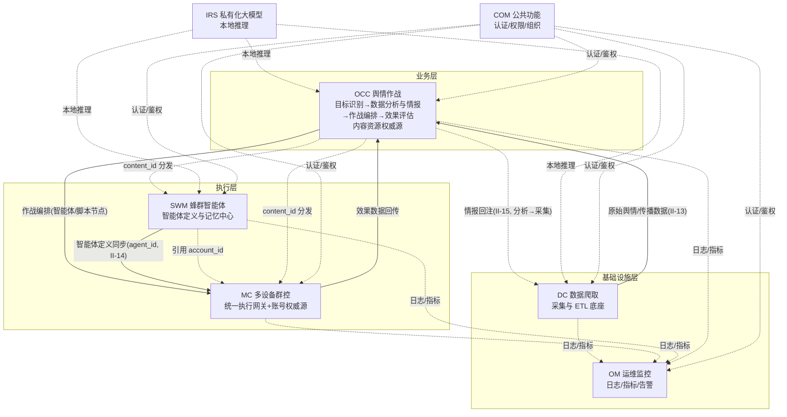

五条协作主链路：
1. **作战指挥链**：DC(采集/ETL)→OCC(数据分析与情报→目标/编排)→MC(执行网关落地)→OCC(效果评估)。
2. **账号生命周期链**：MC(注册/验证/绑定/权威源)→分发 account_id→SWM/MC→MC(状态变更事件)→各方响应。
3. **动作收口链**：所有终端动作→MC 执行网关(鉴权/记录/熔断)→落地→OM。
4. **采集情报闭环**：DC(调度→采集→ETL存储)；OCC(分析)情报回注→DC(扩散采集)，构成跨子系统分析→采集反向闭环。
5. **内容链**：OCC(入库/审核/排期/权威源)→分发 content_id→MC(投放)/SWM(文案)。

---

## 1 数据爬取子系统（M-DC-00）

DC 是基础设施层的数据采集与 ETL 处理底座，采用「任务驱动采集」范式，四个模块以**任务池（M-DC-01）**为枢纽，构成"任务驱动采集流 + 情报驱动反向闭环"两重协作关系。原「数据分析与情报」（V3.3 起移至 OCC 子系统）与「采集监控告警」（系统级监控收口至 OM）已不在 DC 内。

### 1.1 模块架构图

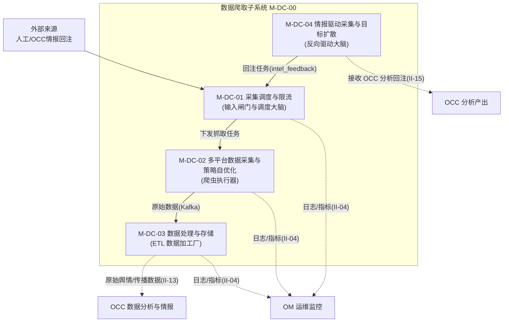

两重协作关系：
- **任务驱动采集流（正向数据流）**：M-DC-01 消费任务池下发抓取任务给 M-DC-02 → M-DC-02 原始数据经 Kafka 流入 M-DC-03 清洗去重持久化 → M-DC-03 加工后的原始舆情/传播数据经 II-13 输出供 OCC 分析。
- **情报驱动反向闭环（R-DC-007/008）**：OCC 数据分析与情报（R-OCC-002~005）产出的高价值目标经 II-15 接口回注 M-DC-04，由 M-DC-04 回注 M-DC-01 任务池并按关系扩散采集，新目标回流 M-DC-03 存储后供 OCC 再次分析，使 DC 从单向采集管道升级为情报驱动闭环。

### 1.2 模块内功能架构图

#### M-DC-01 采集调度与限流（R-DC-003）

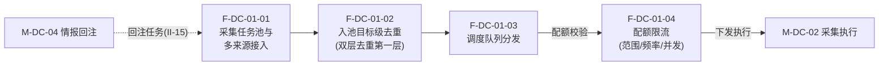

#### M-DC-02 多平台数据采集与策略自优化（R-DC-001,004）

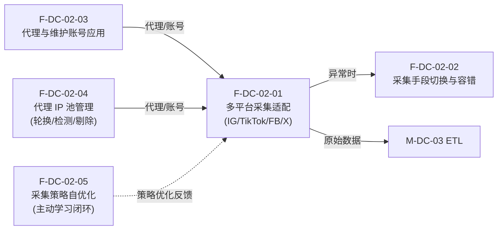

#### M-DC-03 数据处理与存储（R-DC-005,006）

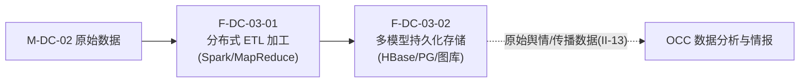

#### M-DC-04 情报驱动采集与目标扩散（R-DC-007,008）

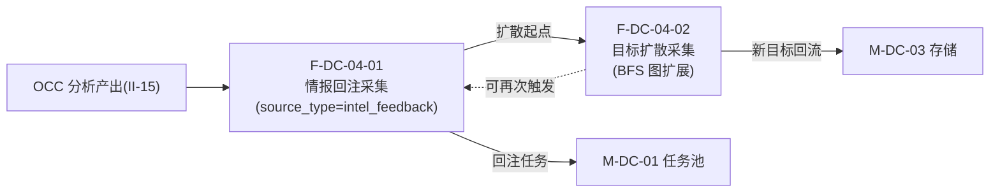

---

## 2 多设备矩阵自动化群控子系统（M-MC-00）

MC 是统一自动化执行引擎与多终端执行网关，十个模块以**执行网关（M-MC-05）**为核心枢纽收口所有终端动作，账号资源（M-MC-09）与智能体宿主（M-MC-10）两项权威职责挂靠其上。

### 2.1 模块架构图

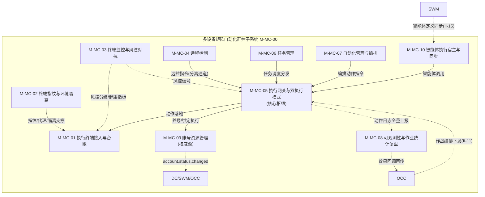

四类协作关系：
- **动作收口流（核心）**：M-MC-06 任务调度、M-MC-07 编排动作、M-MC-04 远控指令、M-MC-10 智能体调用，四类来源的动作**全部经 M-MC-05 执行网关**鉴权/记录/熔断/转发后落地到 M-MC-01 终端。
- **终端资源支撑**：M-MC-01 终端台账是动作落地的目标；M-MC-02 提供指纹/代理/隔离让终端"像真人且互不关联"；M-MC-03 提供风控分级与健康感知支撑终端选型与风险应对。
- **账号权威源分发**：M-MC-09 唯一维护账号主数据，经事件总线广播 account.status.changed，DC/SWM/OCC 订阅响应。
- **可观测闭环**：M-MC-05 动作日志全量上报 M-MC-08，M-MC-08 汇聚后回传统计与效果数据至 OCC。

### 2.2 模块内功能架构图

#### M-MC-01 执行终端接入与台账（R-MC-001 接入）

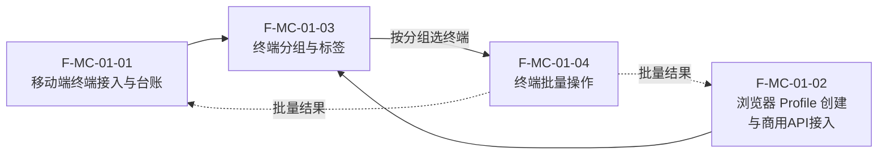

#### M-MC-02 终端指纹与环境隔离（R-MC-001 风控基建）

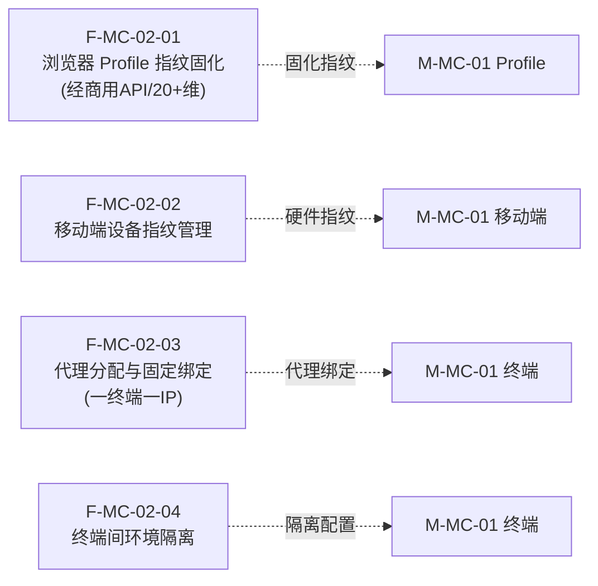

#### M-MC-03 终端监控与风控对抗（R-MC-001 健康感知）

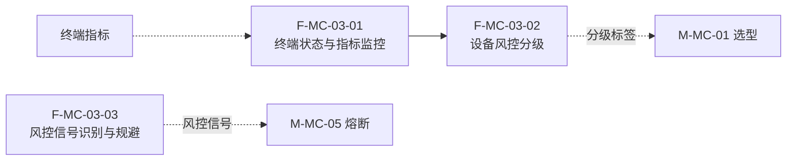

#### M-MC-04 远程控制（R-MC-002）

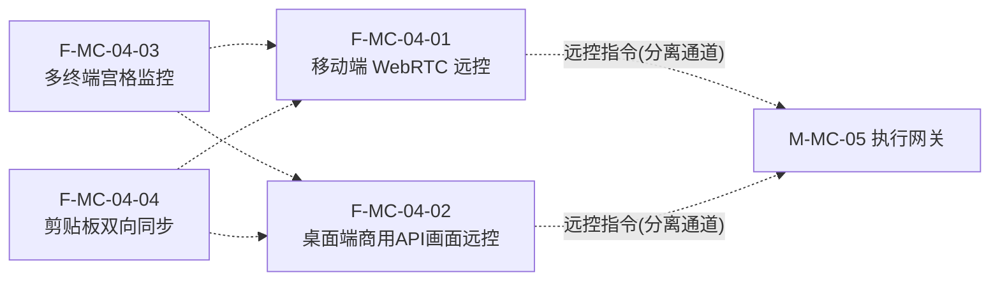

#### M-MC-05 执行网关与双执行模式（R-MC-003 核心）

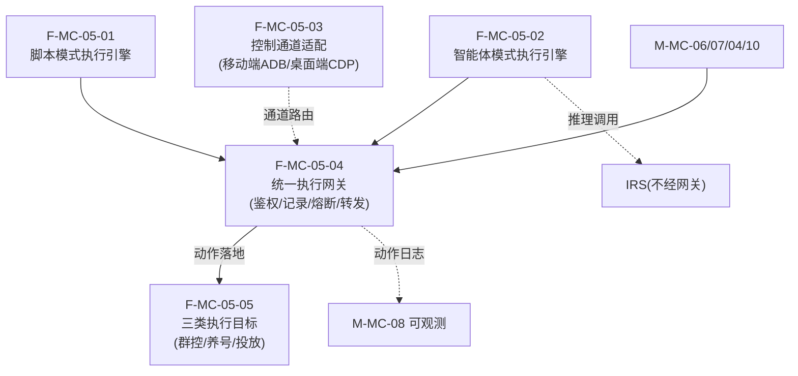

#### M-MC-06 任务管理（R-MC-004）

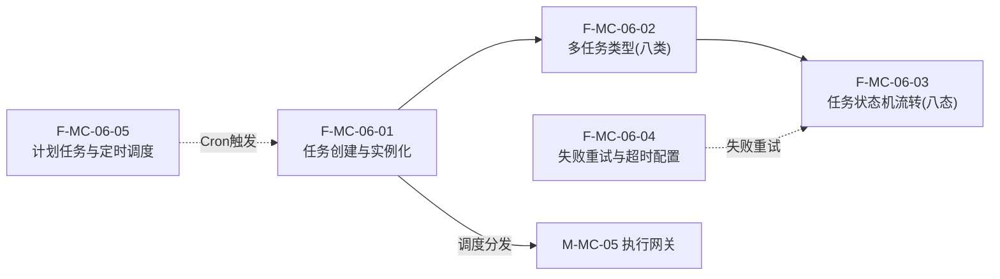

#### M-MC-07 自动化管理与编排（R-MC-005）

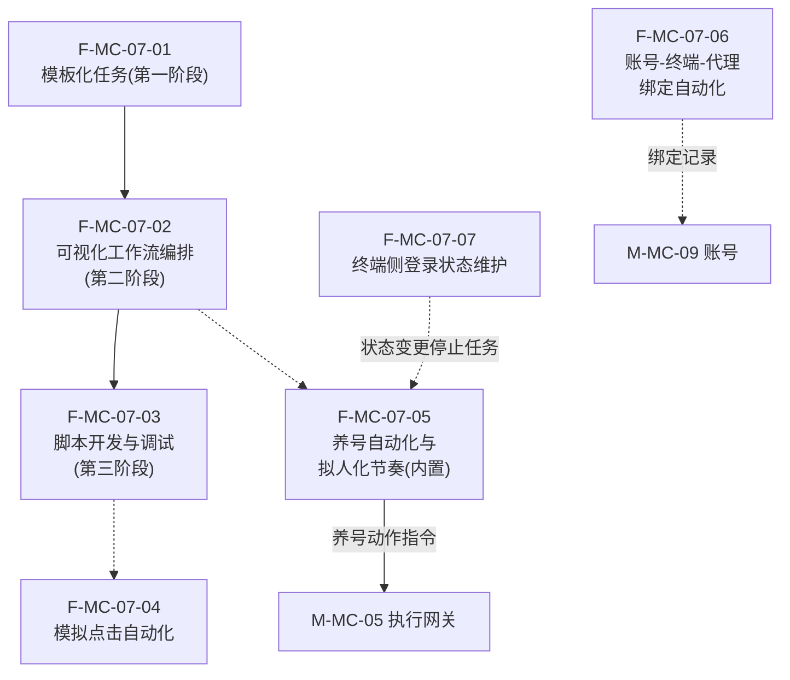

#### M-MC-08 可观测性与作业统计复盘（R-MC-006）

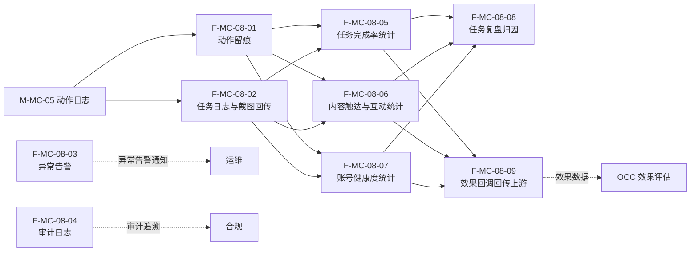

#### M-MC-09 账号资源管理（R-MC-007 权威源）

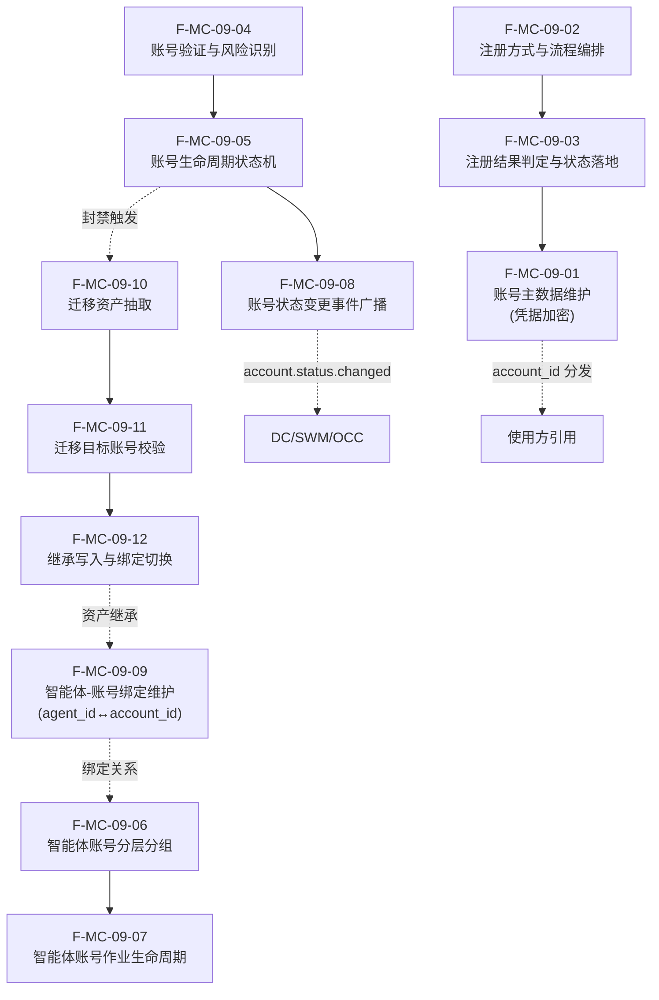

#### M-MC-10 智能体执行宿主与同步（R-MC-008）

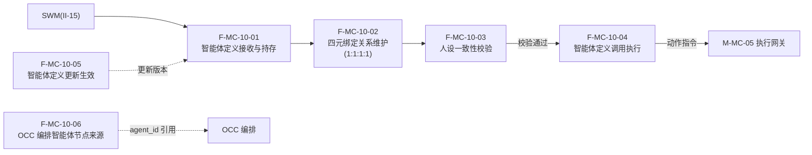

---

## 3 蜂群智能体子系统（M-SWM-00）

SWM 是执行层的「智能体定义与记忆中心」，六个模块构成「人设+提示词资产 → 构建 → 同步下发 → 作业 → 评测迭代」的智能体全生命周期闭环。SWM 不直接操作设备，所有定义经 II-15 同步至 MC 持存。

### 3.1 模块架构图

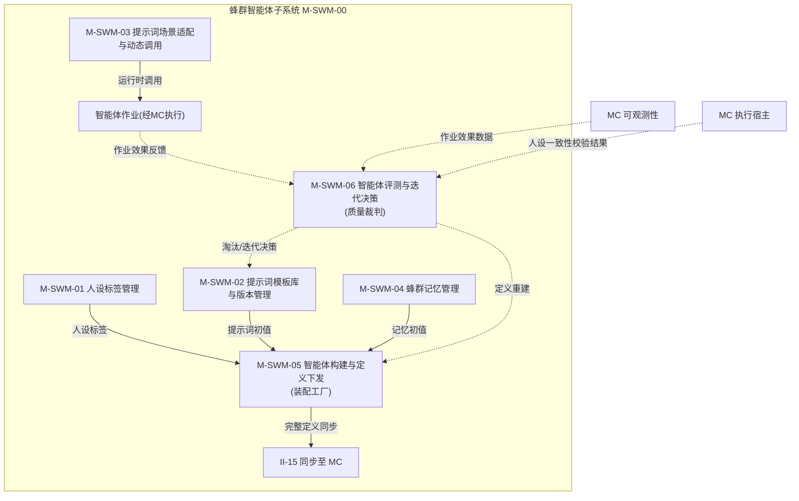

三类协作关系：
- **定义装配流（正向）**：M-SWM-01 人设 + M-SWM-02 提示词 + M-SWM-04 记忆，三者经 M-SWM-05 组装为完整智能体定义并同步下发。
- **运行时调用流**：M-SWM-03 在作业时按场景动态调用提示词生成指令；实际执行经 MC 落地。
- **评测迭代闭环（反馈）**：M-SWM-06 基于 MC 作业效果数据评测智能体，产出淘汰/迭代决策反馈至 M-SWM-02（模板迭代）与 M-SWM-05（定义重建）。

### 3.2 模块内功能架构图

#### M-SWM-01 人设标签管理（R-SWM-001 人设）

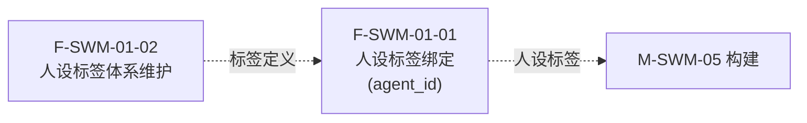

#### M-SWM-02 提示词模板库与版本管理（R-SWM-001 资产）

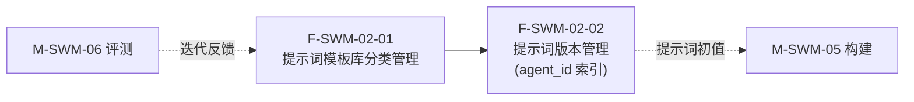

#### M-SWM-03 提示词场景适配与动态调用（R-SWM-001 运行时）

```mermaid
flowchart LR
    F0301["F-SWM-03-01<br/>场景适配<br/>(人设/受众/态势)"]
    F0302["F-SWM-03-02<br/>动态调用与指令生成"]

    F0301 --> F0302
    EXT["M-SWM-02 模板"] -.-> F0301
    F0302 -.->|"作业指令"| EXT2["MC 执行(经网关)"]
```

#### M-SWM-04 蜂群记忆管理（R-SWM-002）

```mermaid
flowchart LR
    F0401["F-SWM-04-01<br/>作业记忆存储"]
    F0402["F-SWM-04-02<br/>场景记忆沉淀"]
    F0403["F-SWM-04-03<br/>历史记忆复用"]
    F0404["F-SWM-04-04<br/>个性化状态延续"]

    F0401 --> F0402 --> F0403 --> F0404
    F0404 -.->|"演进记忆"| F0401
    F0401 -.->|"记忆初值"| EXT["M-SWM-05 构建"]
```

#### M-SWM-05 智能体构建与定义下发（R-SWM-003）

```mermaid
flowchart LR
    F0501["F-SWM-05-01<br/>智能体定义构建<br/>(人设+提示词+记忆+策略)"]
    F0502["F-SWM-05-02<br/>账号绑定引用<br/>(agent_id↔account_id)"]
    F0503["F-SWM-05-03<br/>同步至 MC 持存"]
    F0504["F-SWM-05-04<br/>OCC 智能体节点定义来源"]

    F0501 --> F0502 --> F0503
    F0503 -.-> F0504
    SWM1["M-SWM-01 人设"] & SWM2["M-SWM-02 提示词"] & SWM4["M-SWM-04 记忆"] --> F0501
    F0503 -.->|"II-15"| MC["MC 执行宿主"]
```

#### M-SWM-06 智能体评测与迭代决策（R-SWM-004）

M-SWM-06 采用「线上效果 + 离线数据集」双轨评测。离线数据集评测按流程环节拆为四个功能：F-SWM-06-02 数据集管理 → F-SWM-06-03 批量跑题 → F-SWM-06-04 对比打分 → F-SWM-06-05 汇总报告。线上有效性（F-SWM-06-01）与离线报告（F-SWM-06-05）双轨结论汇入 F-SWM-06-06 做迭代/淘汰决策。

```mermaid
flowchart TB
    F0601["F-SWM-06-01<br/>有效性评测<br/>(线上MC作业效果统计)"]

    subgraph OFFLINE["离线数据集评测流程"]
        direction TB
        F0602["F-SWM-06-02<br/>评测数据集管理<br/>(问题/预期答案/评分标准)"]
        F0603["F-SWM-06-03<br/>批量跑题执行<br/>(调IRS推理收集回答)"]
        F0604["F-SWM-06-04<br/>答案对比与打分<br/>(规则/LLM/人工)"]
        F0605["F-SWM-06-05<br/>评分汇总与报告<br/>(稳定性/合规性/人设一致性)"]
        F0602 --> F0603 --> F0604 --> F0605
    end

    F0606["F-SWM-06-06<br/>迭代/淘汰决策与反馈闭环<br/>(综合线上+离线双轨)"]

    F0601 --> F0606
    F0605 --> F0606
    F0606 -.->|"模板迭代"| EXT["M-SWM-02"]
    F0606 -.->|"定义重建"| EXT2["M-SWM-05"]
    MC1["MC 作业效果"] -.-> F0601
    IRS["IRS 本地推理"] -.->|"跑题推理"| F0603
    ENG["提示词工程师"] -.->|"编辑题集"| F0602
    ENG -.->|"人工评判"| F0604
```

---

## 4 舆情作战业务子系统（M-OCC-00）

OCC 是全链路指挥大脑，九个模块构成「目标识别 → 数据分析与情报 → 作战方案规划 → 编排执行 → 效果评估 → 策略迭代」的作战闭环，并承担内容资源权威源（M-OCC-08/09）。V3.3 起原 DC「数据分析与情报」（R-OCC-002~005）移入本子系统，作为 M-OCC-02。

### 4.1 模块架构图

```mermaid
flowchart TB
    subgraph OCC["舆情作战业务子系统 M-OCC-00"]
        OCC1["M-OCC-01 目标档案与状态管理"]
        OCC2["M-OCC-02 数据分析与情报<br/>(V3.3 由 DC 移入)"]
        OCC3["M-OCC-03 目标关联网络"]
        OCC4["M-OCC-04 作战方案规划<br/>(参谋)"]
        OCC5["M-OCC-05 编排执行引擎"]
        OCC6["M-OCC-06 效果评估"]
        OCC7["M-OCC-07 舆论作业策略库"]
        OCC8["M-OCC-08 内容主数据与排期<br/>(权威源)"]
        OCC9["M-OCC-09 内容审核与敏感词风控"]

        OCC2 -->|"分析产出融合"| OCC1
        OCC1 -->|"目标档案"| OCC4
        OCC3 -->|"关联网络"| OCC4
        OCC7 -->|"匹配干预策略"| OCC4
        OCC4 -->|"作业方案"| OCC5
        OCC5 -->|"编排落地"| MC["MC 执行网关"]
        OCC5 -.->|"效果数据回传"| OCC6
        OCC6 -.->|"策略迭代反馈"| OCC7

        OCC8 -->|"待发布内容"| OCC9
        OCC9 -->|"审核通过"| OCC8
        OCC8 -.->|"content_id 分发"| SWM["SWM"] & MC2["MC"]
    end

    DC["DC 原始舆情/传播数据"] -.->|"II-13"| OCC2
    OCC2 -.->|"分析回注 II-15"| DC2["DC 情报回注"]
    MC3["MC 作业数据"] -.-> OCC6
```

四类协作关系：
- **作战指挥流（正向决策链）**：M-OCC-02 分析产出融合 M-OCC-01 目标 → M-OCC-03 关联网络 → M-OCC-04 方案规划（匹配 M-OCC-07 策略）→ M-OCC-05 编排执行 → MC 落地。
- **效果评估闭环（反馈）**：M-OCC-05 执行效果回传 M-OCC-06 评估 → 反馈 M-OCC-07 策略库迭代。
- **内容管理流（权威源）**：M-OCC-08 主数据与排期 → M-OCC-09 审核风控 → 审核通过后分发 content_id。
- **情报输入与回注闭环**：DC 原始舆情/传播数据经 II-13 输入 M-OCC-02 分析；M-OCC-02 分析产出经 II-15 反向回注 DC 任务池形成采集闭环。

### 4.2 模块内功能架构图

#### M-OCC-01 目标档案与状态管理（R-OCC-001 实体）

```mermaid
flowchart LR
    F0101["F-OCC-01-01<br/>目标建档与标识<br/>(target_id)"]
    F0102["F-OCC-01-02<br/>目标属性维护"]
    F0103["F-OCC-01-03<br/>目标状态生命周期"]
    F0104["F-OCC-01-04<br/>目标多维信息融合"]
    F0105["F-OCC-01-05<br/>目标变更事件广播"]

    F0104 --> F0101
    F0101 --> F0102 --> F0103
    F0103 --> F0105
    F0105 -.->|"target.changed"| EXT["编排/评估"]
    OCC2["M-OCC-02 分析产出"] -.-> F0104
```

#### M-OCC-02 数据分析与情报（R-OCC-002~005，V3.3 由 DC 移入）

```mermaid
flowchart LR
    F0201["F-OCC-02-01<br/>群体-个体下钻筛选"]
    F0202["F-OCC-02-02<br/>关系图谱与图查询"]
    F0203["F-OCC-02-03<br/>实体检索与档案"]
    F0204["F-OCC-02-04<br/>文本智能分析<br/>(立场/情感/观点)"]

    DC["DC 原始数据(II-13)"] --> F0201 & F0202 & F0203 & F0204
    F0201 & F0202 & F0203 -.->|"分析产出"| EXT["M-OCC-01 目标识别"]
    F0204 -.->|"文本分类"| IRS["IRS 文本模型(EI-05)"]
    F0201 & F0202 & F0203 -.->|"情报产出(II-15)"| DC2["DC 情报回注"]
```

#### M-OCC-03 目标关联网络（R-OCC-001 图结构）

```mermaid
flowchart LR
    F0301["F-OCC-03-01<br/>目标关联关系建模"]
    F0302["F-OCC-03-02<br/>关系网络查询"]

    F0301 --> F0302
    EXT["M-OCC-01 目标"] -.-> F0301
    F0302 -.->|"关联网络"| EXT2["M-OCC-04 方案规划"]
```

#### M-OCC-04 作战方案规划（R-OCC-006 决策）

```mermaid
flowchart LR
    F0401["F-OCC-04-01<br/>干预策略匹配"]
    F0402["F-OCC-04-02<br/>作业方案生成<br/>(内容/账号/时间/节奏)"]

    F0401 --> F0402
    EXT["M-OCC-01/03 目标"] --> F0401
    EXT2["M-OCC-07 策略库"] -.-> F0401
    F0402 -->|"作业方案"| EXT3["M-OCC-05 编排执行"]
```

#### M-OCC-05 编排执行引擎（R-OCC-006 建模+运行）

```mermaid
flowchart TB
    F0501["F-OCC-05-01<br/>编排建模<br/>(DAG流程图:智能体节点+脚本节点)"]
    F0502["F-OCC-05-02<br/>节点参数填充<br/>(agent_id/通道/内容账号时间节奏)"]
    F0503["F-OCC-05-03<br/>编排落地与执行跟踪<br/>(回滚/跳过/转人工)"]

    F0501 --> F0502 --> F0503
    EXT["M-OCC-04 方案"] --> F0501
    F0503 -->|"编排落地"| MC["MC 执行网关(II-10)"]
    F0503 -.->|"效果数据"| EXT2["M-OCC-06 评估"]
```

#### M-OCC-06 效果评估（R-OCC-007）

```mermaid
flowchart LR
    F0601["F-OCC-06-01<br/>单轮成效统计"]
    F0602["F-OCC-06-02<br/>舆论走势修正评估"]
    F0603["F-OCC-06-03<br/>策略迭代反馈"]
    F0604["F-OCC-06-04<br/>作业复盘"]
    F0605["F-OCC-06-05<br/>中短期与长期效果评估"]

    DC["DC 舆情数据"] & MC["MC 作业数据"] --> F0601 & F0602
    F0601 --> F0604
    F0602 --> F0605
    F0601 & F0602 --> F0603
    F0603 -.->|"策略迭代"| EXT["M-OCC-07 策略库"]
```

#### M-OCC-07 舆论作业策略库（R-OCC-008）

```mermaid
flowchart LR
    F0701["F-OCC-07-01<br/>多语种多场景多风格策略库"]
    F0702["F-OCC-07-02<br/>策略分类管理与版本控制"]
    F0703["F-OCC-07-03<br/>策略迭代优化"]
    F0704["F-OCC-07-04<br/>策略场景适配与动态调用"]

    F0701 --> F0702
    F0702 --> F0704
    EXT["M-OCC-06 评估反馈"] -.-> F0703
    F0703 -.->|"迭代"| F0701
    F0704 -.->|"匹配策略"| EXT2["M-OCC-04 方案规划"]
```

#### M-OCC-08 内容主数据与排期（R-OCC-009 资产+调度）

```mermaid
flowchart LR
    F0801["F-OCC-08-01<br/>内容主数据维护<br/>(content_id 权威源)"]
    F0802["F-OCC-08-02<br/>素材分类与平台适配"]
    F0803["F-OCC-08-03<br/>发布排期"]
    F0804["F-OCC-08-04<br/>内容变更事件与分发"]

    F0801 --> F0802 --> F0803
    F0801 --> F0804
    EXT["M-OCC-09 审核通过"] -.-> F0801
    F0804 -.->|"content.changed"| SWM["SWM"] & MC["MC"]
```

#### M-OCC-09 内容审核与敏感词风控（R-OCC-009 合规）

```mermaid
flowchart LR
    F0901["F-OCC-09-01<br/>发布前内容审核"]
    F0902["F-OCC-09-02<br/>敏感词检测与拦截"]

    F0901 --> F0902
    EXT["M-OCC-08 待发布内容"] --> F0901
    F0902 -.->|"审核结果"| EXT2["M-OCC-08"]
    F0902 -.->|"命中拦截待复核"| HUMAN["人工复核"]
```

---

## 5 运维监控子系统（M-OM-00）

OM 汇聚全系统日志与指标，形成统一运维数据底座。四个模块按「数据汇聚（日志+指标）→ 告警/可视化/运维」的流水线组织。

### 5.1 模块架构图

```mermaid
flowchart TB
    subgraph OM["运维监控子系统 M-OM-00"]
        OM1["M-OM-01 日志汇聚与检索"]
        OM2["M-OM-02 指标采集与时序存储"]
        OM3["M-OM-03 告警引擎"]
        OM4["M-OM-04 运维可视化与作业"]

        OM1 -.->|"日志数据"| OM4
        OM2 -->|"指标数据"| OM3
        OM2 -.->|"指标数据"| OM4
        OM3 -.->|"告警通知"| OM4
    end

    ALL["各子系统<br/>(DC/MC/SWM/OCC/IRS)"] -.->|"日志(II-04/II-12)"| OM1
    ALL -.->|"指标"| OM2
```

两类协作关系：
- **数据汇聚流**：各子系统日志汇聚至 M-OM-01，指标采集至 M-OM-02，形成统一数据底座。
- **告警与运维消费流**：M-OM-02 指标驱动 M-OM-03 告警引擎；M-OM-01 日志与 M-OM-02 指标共同供 M-OM-04 可视化看板与运维作业消费。

### 5.2 模块内功能架构图

#### M-OM-01 日志汇聚与检索（R-OM-001 日志）

```mermaid
flowchart LR
    F0101["F-OM-01-01<br/>日志采集与汇聚"]
    F0102["F-OM-01-02<br/>全文检索"]

    F0101 --> F0102
    EXT["各子系统日志"] --> F0101
    F0102 -.->|"检索结果"| EXT2["M-OM-04 运维作业"]
```

#### M-OM-02 指标采集与时序存储（R-OM-001 指标）

```mermaid
flowchart LR
    F0201["F-OM-02-01<br/>指标采集"]
    F0202["F-OM-02-02<br/>时序数据存储"]

    F0201 --> F0202
    EXT["各子系统指标"] --> F0201
    F0202 -.->|"时序数据"| EXT2["M-OM-03 告警"] & EXT3["M-OM-04 看板"]
```

#### M-OM-03 告警引擎（R-OM-002 告警）

```mermaid
flowchart LR
    F0301["F-OM-03-01<br/>阈值与异常检测告警"]
    F0302["F-OM-03-02<br/>告警风暴聚合去重"]

    F0301 --> F0302
    EXT["M-OM-02 指标"] --> F0301
    F0302 -.->|"多渠道通知"| NOTIFY["电话/IM/邮件"]
```

#### M-OM-04 运维可视化与作业（R-OM-002 看板+运维）

```mermaid
flowchart LR
    F0401["F-OM-04-01<br/>可视化看板<br/>(总览/设备/任务/爬虫/异常)"]
    F0402["F-OM-04-02<br/>常态化运维操作<br/>(查询/定位/巡检/容量)"]

    EXT["M-OM-01 日志"] & EXT2["M-OM-02 指标"] --> F0401
    F0401 -.-> F0402
```

---

## 6 公共功能（M-COM-00）

COM 为各子系统提供统一认证、权限与组织管理。两个模块按「认证（你是谁）→ 授权（你能访问什么）」的 IAM 经典分工组织。

### 6.1 模块架构图

```mermaid
flowchart LR
    subgraph COM["公共功能 M-COM-00"]
        COM1["M-COM-01 身份认证<br/>(AuthN)"]
        COM2["M-COM-02 权限与组织管理<br/>(AuthZ)"]

        COM1 -->|"认证令牌"| COM2
    end

    USER["用户"] --> COM1
    COM2 -.->|"权限决策/数据隔离"| SUB["各子系统<br/>(DC/MC/SWM/OCC/OM)"]
```

### 6.2 模块内功能架构图

#### M-COM-01 身份认证（R-COM-001 AuthN）

```mermaid
flowchart LR
    F0101["F-COM-01-01<br/>登录认证"]
    F0102["F-COM-01-02<br/>双因素认证"]
    F0103["F-COM-01-03<br/>认证令牌签发"]

    F0101 --> F0102 --> F0103
    F0103 -.->|"令牌"| EXT["M-COM-02 权限决策"]
```

#### M-COM-02 权限与组织管理（R-COM-001 AuthZ）

```mermaid
flowchart LR
    F0201["F-COM-02-01<br/>RBAC 权限决策"]
    F0202["F-COM-02-02<br/>组织与成员管理"]
    F0203["F-COM-02-03<br/>多组织数据隔离"]

    F0202 --> F0201
    F0202 --> F0203
    F0201 -.->|"权限决策"| EXT["各子系统鉴权"]
    F0203 -.->|"数据隔离"| EXT2["各子系统"]
```

---

## 7 私有化大模型部署（M-IRS-00）

IRS 是系统底层推理基础设施（非业务子系统），单一模块提供本地大模型部署与推理调用，使全系统 AI 推理不依赖外部公有云。

### 7.1 模块架构图

```mermaid
flowchart TB
    subgraph IRS["私有化大模型部署 M-IRS-00"]
        IRS1["M-IRS-01 本地大模型部署"]
    end

    IRS1 -.->|"统一推理调用接口(EI-06/II-08)"| DC["DC 文本分析"]
    IRS1 -.->|"统一推理调用接口"| SWM["SWM 智能体推理"]
    IRS1 -.->|"统一推理调用接口"| OCC["OCC 方案/评估"]
```

### 7.2 模块内功能架构图

#### M-IRS-01 本地大模型部署（R-IRS-001）

```mermaid
flowchart LR
    F0101["F-IRS-01-01<br/>私有化部署与模型加载"]
    F0102["F-IRS-01-02<br/>统一推理调用接口"]
    F0103["F-IRS-01-03<br/>部署独立性<br/>(不依赖公有云)"]

    F0101 --> F0102
    F0103 -.->|"约束"| F0101
    F0102 -.->|"推理服务"| EXT["DC/SWM/OCC"]
```

---

## 附：子系统间完整接口协作图

下图汇总所有跨子系统的内部接口（II）与外部接口（EI），展示 37 个模块如何通过接口编织成完整系统。

```mermaid
flowchart TB
    subgraph 各子系统
        DC["DC 数据爬取"]
        MC["MC 多设备群控"]
        SWM["SWM 蜂群智能体"]
        OCC["OCC 舆情作战"]
        OM["OM 运维监控"]
        COM["COM 公共功能"]
        IRS["IRS 私有化大模型"]
    end

    DC <-.->|"II-13 原始舆情/传播数据"| OCC
    OCC <-.->|"II-15 情报回注(分析→采集)"| DC

    MC <-.->|"II-01 账号服务"| DC & SWM & OCC
    MC <-.->|"II-01a account.status.changed"| DC & SWM & OCC
    MC <-.->|"II-10 作战编排下发/效果回传"| OCC
    MC <-.->|"II-14 智能体定义同步"| SWM
    OCC <-.->|"II-12 内容服务"| MC

    OCC <-.->|"II-12a content.changed"| SWM & MC

    IRS <-.->|"II-08/EI-05 本地推理"| MC & SWM & DC & OCC

    DC & MC & SWM & OCC & IRS -.->|"II-04/II-11 日志指标"| OM
    COM -.->|"认证/鉴权"| DC & MC & SWM & OCC & OM

    DC <-.->|"EI-01 社交平台"| EXT1["TikTok/IG/FB/X"]
    MC <-.->|"EI-02 代理IP"| EXT2["VPS代理"]
    MC <-.->|"EI-03 接码虚拟号"| EXT3["接码服务"]
    MC <-.->|"EI-04 对象存储"| EXT4["MinIO/OSS"]
    MC <-.->|"EI-06 指纹浏览器服务"| EXT5["商用指纹浏览器<br/>(Profile管理/指纹/调试端口)"]
```

接口分类说明：
- **平台级资源接口**：II-01 账号服务（MC 权威源）、II-12 内容服务（OCC 权威源），遵循"权威源唯一、使用方引用、变更经事件通知"。
- **数据与情报接口**：II-13 原始舆情/传播数据（DC→OCC，供 R-OCC-002~005 分析）、II-15 情报回注（OCC 分析→DC 任务池，跨子系统反向驱动闭环）。
- **作战执行接口**：II-10 作战编排下发与效果回传（OCC↔MC）、II-14 智能体定义同步（SWM→MC）。
- **推理接口**：II-08/EI-05 本地推理调用（IRS→各子系统，智能体推理不经执行网关）。
- **可观测接口**：II-04/II-11 日志与指标上报（各子系统→OM，II-11 含执行网关动作日志与熔断记录）。
- **外部对接接口**：EI-01 社交平台、EI-02 代理 IP、EI-03 接码虚拟号、EI-04 对象存储、EI-06 指纹浏览器服务（MC 经商用产品 API 管理桌面端 Profile，启动后返回调试端口供 CDP 控制动作）。
