# 软件概要设计说明

| 项目 | 内容 |
| --- | --- |
| 项目名称 | 认知作战平台（v1.0） |
| 文档版本 | V2.0 |
| 密级 | 内部使用 |
| 编制 | 石建国 |
| 编制日期 | 2026-07-07 |

---

## 1 引言

### 1.1 标识

本文件为"认知作战平台"（以下简称"系统"或"平台"）的软件概要设计说明。它是《软件需求规格说明》V2.0 的设计映射，描述系统的总体结构、子系统划分、功能模块、接口、数据、安全与性能设计，作为详细设计与编码实现的依据。

系统由私有化大模型部署（IRS）作为底层推理基础设施，五个业务子系统与一组公共功能构成：数据爬取子系统（DC）、多设备矩阵自动化群控子系统（MC）、运维监控子系统（OM）、蜂群智能体子系统（SWM）、舆情作战业务子系统（OCC），公共功能（COM），以及跨子系统的共享资源域（SR）。

### 1.2 系统概述

平台面向社交媒体，构建"**数据采集 → 分析研判 → 智能体编队 → 编队执行 → 效果评估 → 运维保障**"的完整需求能力闭环。系统按职责分为三层：

- **基础设施层**：私有化大模型部署（IRS）提供本地大模型私有化部署与推理调用，使全系统 AI 推理不依赖外部公有云；数据爬取子系统（DC）负责爬取工程底座与社交媒体数据的采集与分析；运维监控子系统（OM）汇聚全系统日志与指标，完成常态化运维。
- **执行层**：多设备矩阵自动化群控子系统（MC）定位为"设备执行网关与调度引擎"，收口所有落到终端的动作；蜂群智能体子系统（SWM）提供账号人格与作业策略。执行层支持脚本模式与智能体模式两种执行引擎。
- **业务层**：舆情作战业务子系统（OCC）构建"目标识别 → 行动实施 → 效果评估"的作战闭环。公共功能（COM）提供统一认证、权限与组织管理。

账号与内容作为跨子系统共享资源，单列为共享资源域（SR）统一管理，遵循"权威源唯一、使用方引用、变更经事件通知"原则。

### 1.3 文档概述

本文件章节安排如下：第 2 章引用文件；第 3 章软件结构设计，给出总体架构、层次结构、模块划分与数据流/控制流；第 4 章按子系统给出功能模块设计；第 5 章接口概要设计；第 6 章数据概要设计；第 7 章安全设计；第 8 章性能设计；第 9 章需求追踪；第 10 章附录。

需求编号沿用《软件需求规格说明》：功能需求 `FR-XX-NNN`、非功能需求 `NFR-类-N`、外部接口 `EI-NN`、内部接口 `II-NN`、数据 `DR-NN`、约束 `CON-NN`。子系统代号见附录术语表。

本设计遵循 GJB 438C《军用软件开发文档通用要求》，对每个软部件（功能模块）赋予唯一标识编号。模块标识采用 `M-XX-NN`：`M` 表示软部件（Module），`XX` 为子系统代号（DC/MC/OM/COM/SWM/IRS/OCC/SR），`NN` 为模块在该子系统内的两位顺序号，序号与对应功能需求编号末位对齐，以便配置项管理与需求双向追溯。子系统本身作为一级软部件，编号为 `M-XX-00`。

### 1.4 术语和缩略语

沿用《软件需求规格说明》第 1.4 节术语与缩略语，本文件不再重复。关键术语包括：执行网关、执行模式（脚本模式/智能体模式）、控制通道（ADB/无障碍/CDP）、反指纹浏览器、浏览器 Profile、指纹固化、设备风控分级、共享资源、权威源、主数据、扩展数据、事件通知、蜂群、人设标签、抓手、舆情对冲等。

---

## 2 引用文件

| 文件 | 说明 |
| --- | --- |
| 《软件需求规格说明》V2.0 | 本设计的直接输入，提供功能/非功能需求、接口与数据需求 |
| 《多设备矩阵自动化运营系统开发方案 V1.1》 | 设备、远控、账号、内容、任务、脚本等模块的早期设计与阶段规划 |
| 《软件概要设计简述》 | 数据爬取子系统任务驱动采集、监控告警、数据质量的详细设计参考 |

---

## 3 软件结构设计

### 3.1 总体架构

系统采用**分层 + 子系统**架构。底层基础设施向上提供推理、数据与运维能力；中层执行层收口所有设备动作并提供智能体策略；上层业务层指挥作战闭环。所有跨子系统共享的账号与内容资源由共享资源域统一管理，状态变更经事件总线广播。

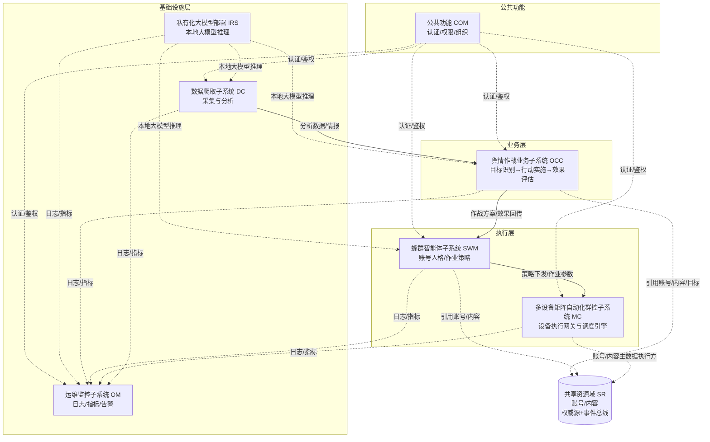

#### 设计原则

系统设计遵循以下源自需求约束（CON-01～CON-11）的核心原则：

1. **动作收口**（CON-07）：所有执行终端动作（无论脚本引擎还是智能体引擎，无论移动端还是桌面端）均经群控执行网关落地，禁止任何子系统或 Agent 绕过，保证可观测、可审计、可熔断。
2. **推理与执行分离**（CON-10）：智能体模式下的视觉推理由 Agent 调用 IRS 本地大模型完成，不经执行网关；推理产出的动作指令再经执行网关落地。
3. **双执行模式**（CON-08）：同时支持脚本模式与智能体模式，共用底层控制通道，均收口于执行网关。
4. **共享资源权威源**：账号/内容主数据由唯一权威源（MC 担任执行方）维护，使用方只引用标识，变更经事件总线通知。
5. **私有化推理**（CON-06）：大模型推理采用私有化部署，不依赖外部公有云。
6. **可观测优先**：各子系统向运维监控子系统上报日志与指标，关键动作全量留痕。

### 3.2 软件层次结构

系统自下而上分为四层，每层只依赖其下层，不反向依赖：

| 层次 | 组成 | 职责 |
| --- | --- | --- |
| 基础设施层 | IRS、DC、OM | 提供私有化推理、数据采集与分析、运维监控底座 |
| 执行层 | MC、SWM | 收口设备动作执行（MC）、提供账号人格与作业策略（SWM） |
| 业务层 | OCC | 作战指挥大脑，目标识别→行动实施→效果评估 |
| 公共与共享 | COM、SR | 跨层认证授权（COM）、跨子系统共享账号/内容（SR） |

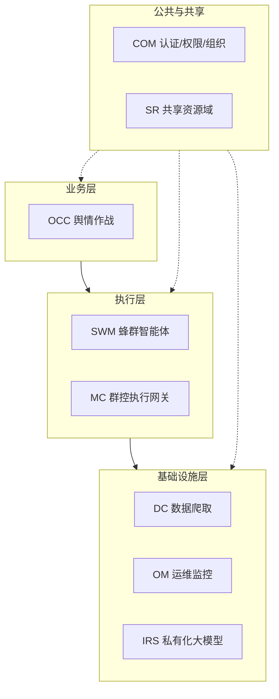

### 3.3 模块划分

系统按子系统划分一级软部件，每个子系统内再按功能需求划分二级软部件（功能模块）。模块划分与功能需求编号一一对应，每个软部件赋予唯一标识编号（`M-XX-NN`），详见第 4 章。软部件清单如下：

| 子系统（一级软部件） | 代号 | 二级软部件（功能模块） |
| --- | --- | --- |
| 数据爬取子系统（M-DC-00） | DC | M-DC-01 爬取工程基础设施、M-DC-02 社交媒体采集、M-DC-03 数据处理存储、M-DC-04 数据分析情报 |
| 多设备矩阵自动化群控子系统（M-MC-00） | MC | M-MC-01 设备管理、M-MC-02 远程控制、M-MC-03 执行网关与双执行模式、M-MC-04 账号维护、M-MC-05 内容管理、M-MC-06 任务管理、M-MC-07 脚本引擎、M-MC-08 可观测性、M-MC-09 环境风控 |
| 运维监控子系统（M-OM-00） | OM | M-OM-01 日志指标汇聚、M-OM-02 告警与运维 |
| 公共功能（M-COM-00） | COM | M-COM-01 用户认证与权限 |
| 蜂群智能体子系统（M-SWM-00） | SWM | M-SWM-01 智能体账号人设、M-SWM-02 任务智能分发、M-SWM-03 行为仿真防伪装、M-SWM-04 作业统计复盘、M-SWM-05 提示词管理、M-SWM-06 记忆管理 |
| 私有化大模型部署（M-IRS-00） | IRS | M-IRS-01 本地大模型部署 |
| 舆情作战业务子系统（M-OCC-00） | OCC | M-OCC-01 目标识别维护、M-OCC-02 行动方案实施、M-OCC-03 效果评估、M-OCC-04 策略库 |
| 共享资源域（M-SR-00） | SR | M-SR-01 账号资源、M-SR-02 内容资源 |

### 3.4 模块间关系

子系统之间存在四类关键协作关系：

**（1）作战指挥链（OCC → SWM → MC）**

舆情作战是全链路指挥大脑：OCC 基于 DC 分析结果与 IRS 推理产出作战方案，经 SWM 调度，最终由 MC 设备矩阵执行落地，效果回传 OCC 评估闭环。

**（2）动作收口（所有动作 → MC 执行网关）**

无论脚本引擎还是智能体引擎，所有终端动作均经 MC 执行网关鉴权、记录、熔断、转发。智能体视觉推理直接调用 IRS，不经网关；推理产出的动作指令再经网关落地。

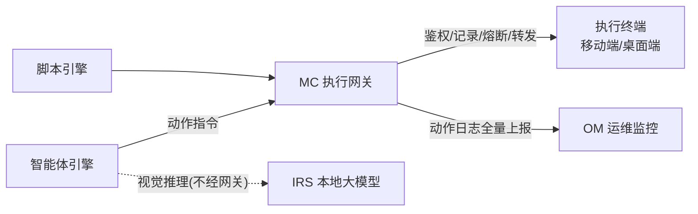

**（3）共享资源协作（SR：权威源 + 事件通知）**

账号主数据由 MC（担任执行方）维护，DC/SWM/OCC 作为使用方只引用 account_id 并维护各自扩展属性。内容主数据同理。状态变更经事件总线广播，使用方订阅响应。

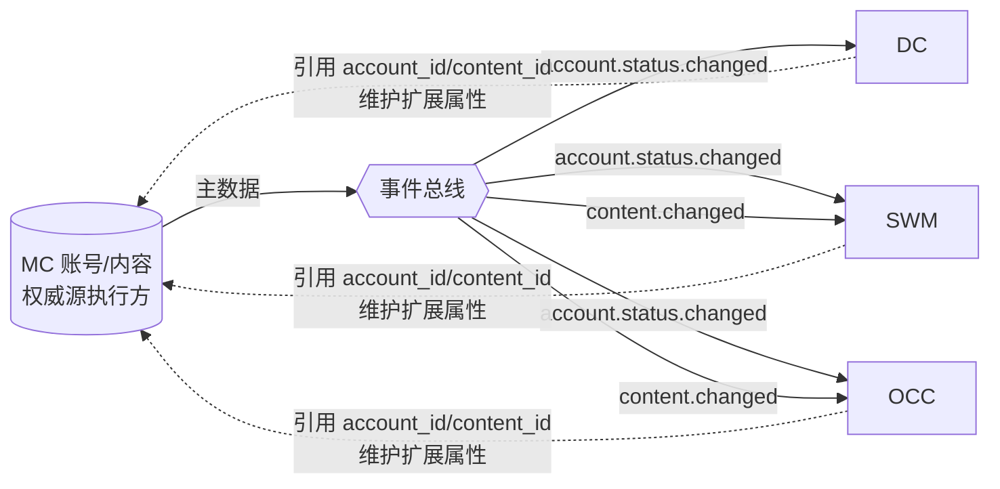

**（4）推理支撑（IRS → DC/SWM/OCC）**

IRS 向上为 DC（文本分析）、SWM（行为决策）、OCC（判别与策略生成）提供统一的本地大模型推理能力，不经外部公有云。

### 3.5 数据流设计

系统主数据流贯穿"采集→分析→作战→执行→评估"闭环：

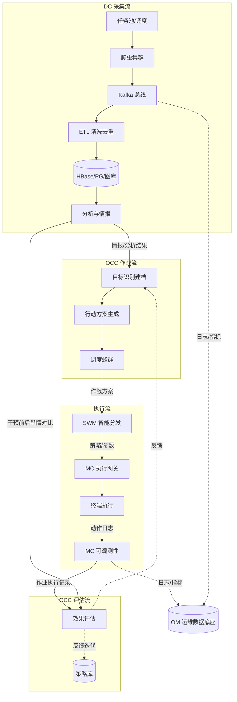

关键数据流要点：
- **采集流**：任务驱动，爬虫消费任务池 → Kafka → ETL（双层去重）→ 多存储（HBase/PG/图库）→ 分析。
- **执行流**：作战方案 → SWM 智能分发 → MC 执行网关 → 终端执行 → 动作日志上报。
- **评估流**：MC 作业执行记录 + DC 舆情对比 → OCC 效果评估 → 反馈策略库与目标，形成闭环。
- **运维流**：各子系统日志与指标汇聚至 OM，形成统一运维数据底座。

### 3.6 控制流设计

系统的控制流围绕"执行网关"这一唯一动作收口展开，并区分脚本模式与智能体模式：

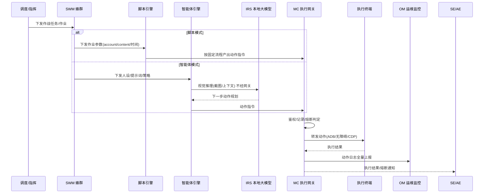

控制流要点：
- **两种模式共用控制通道**：移动端采用 ADB/无障碍服务，桌面端反指纹浏览器采用 CDP，控制通道对上层透明，执行网关按终端类型路由。
- **网关统一控制**：动作经网关鉴权（校验来源与目标终端合法性）、记录（写入动作日志）、熔断（风控信号或异常频率时停止后续动作）、转发。
- **推理旁路**：智能体视觉推理直接调用 IRS 以保证低延迟，不经网关；只有推理产出的动作指令经网关落地。

---

## 4 功能模块设计

本章按子系统给出功能模块设计。每个模块（二级软部件）标注其软部件标识编号与对应的功能需求编号，描述其职责、组成与关键设计。模块划分与《软件需求规格说明》功能需求一一对应。子系统作为一级软部件（M-XX-00），其下二级软部件编号 M-XX-NN 见各小节。

### 4.1 数据爬取子系统（M-DC-00）

数据爬取子系统（软部件标识 M-DC-00）是基础设施层的数据采集与分析底座，采用"任务驱动采集"范式：采集任务由外部（人工/侦察程序/战法库）注入任务池，爬虫作为执行器消费任务、按目标定向抓取。子系统对外提供情报与分析能力供 OCC 使用。

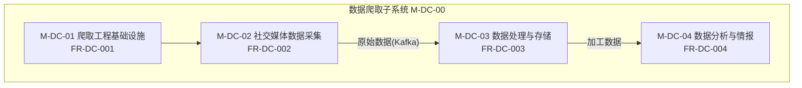

#### 4.1.1 爬取工程基础设施模块（M-DC-01，FR-DC-001）

- **职责**：提供分布式爬取的工程底座——可弹性伸缩的爬虫集群、Kafka 数据流转通道、Redis 任务调度与去重、对接 VPS 代理的代理网络出口。
- **组成**：爬虫集群（K8s 容器化，横向扩缩容与节点自愈）、Kafka 总线（分区分组、回溯消费）、Redis（URL/任务去重、调度队列、分布式锁）、代理 IP 池（按平台/地区分配、定时轮换、可用性检测与失效剔除）。
- **关键设计**：任务驱动调度——外部注入任务池 → 调度中心按优先级消费 → 配额限流（账号/IP 水位）→ 分发爬虫 Pod；爬虫节点故障自动重启或迁移；Kafka 不可用时数据暂存本地待重试。

#### 4.1.2 社交媒体数据采集模块（M-DC-02，FR-DC-002）

- **职责**：从 TikTok、Instagram、Facebook、YouTube、X 等海外社交平台采集原始数据（用户、内容、互动、关系）。
- **组成**：多平台采集适配器，按平台采用不同采集手段——Instagram/TikTok/Facebook/X 采用逆向采集，辅以官方 API、模拟点击、网页解析；采集过程使用代理 IP 与维护账号应对访问限制。
- **关键设计**：采集手段可切换（逆向接口失效或改版时告警并切换备用方式）；API 限流按限额退避重试；账号被封自动切换备用账号。

#### 4.1.3 数据处理与存储模块（M-DC-03，FR-DC-003）

- **职责**：对原始数据清洗加工并持久化，提供标准大数据 ETL 链路。
- **组成**：Spark/MapReduce 分布式批处理（清洗、字段提取、格式标准化、去重、关联）；多存储分发——结构化结果写 HBase，元数据与索引写关系库（PG/MySQL），关系数据写图数据库。
- **关键设计**：双层去重——入池目标级去重（任务池，避免重复下发）+ 入库内容指纹级去重（精确/SimHash/语义三层指纹）；六类质量校验（Schema/时间/内容/数值/平台一致性/异常检测）；脏数据进入隔离区不入主库；全字段血缘（每条数据可回溯到来源任务）。

#### 4.1.4 数据分析与情报模块（M-DC-04，FR-DC-004）

- **职责**：对加工数据进行分析，提供群体到个体的筛选、关系图谱、情报检索、可视化与文本智能分析，支撑目标识别与内容研判。
- **组成**：逐层下钻筛选（AI 算法从群体定位目标个体）、关系图谱绘制与图查询、实体信息多维检索、关联拓扑与情报标签、实体全维度档案、文本分类与筛选（文本模型 + 关键词库）、可视化展示。
- **关键设计**：算法推理超时或失败时降级返回部分结果；图谱查询数据量过大时分页限流；文本模型不可用时回退关键词规则匹配。

### 4.2 多设备矩阵自动化群控子系统（M-MC-00）

MC（软部件标识 M-MC-00）是执行层的"设备执行网关与调度引擎"，所有设备动作的唯一收口。统一管理移动端（真机/云手机/ARM 板卡/模拟器）与桌面端（反指纹浏览器 Profile）两类执行终端，提供脚本模式与智能体模式两种执行引擎。

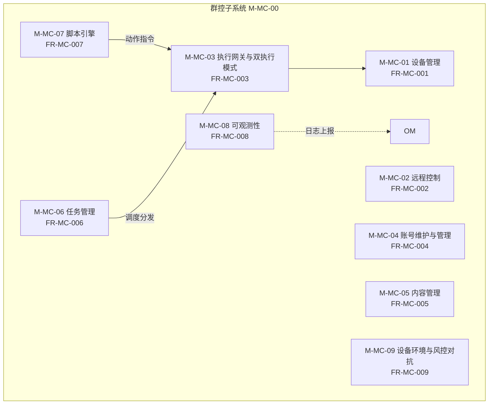

#### 4.2.1 设备管理模块（M-MC-01，FR-MC-001）

- **职责**：统一管理多类型执行终端的接入、分组、状态监控、风控分级与批量操作，提供执行终端资源池。
- **组成**：终端注册（移动端 Agent 长连接注册 / 浏览器 Profile CDP 注册）、设备台账与分组标签、实时状态指标监控（在线离线/电量/CPU/内存/存储/网络）、风控分级（真机与 ARM 板卡=高，云手机与反指纹浏览器=中，模拟器=低）、批量操作（移动端批量安装/重启/截图；浏览器 Profile 批量创建/启动/关闭/截图；对象存储临时链接文件上传下载）。
- **关键设计**：养号等高敏感场景优先选用高真实度终端（CON-09）；终端掉线标记离线并告警；指标异常（过热/存储满/内存超限）时隔离并停止派发任务。

#### 4.2.2 远程控制模块（M-MC-02，FR-MC-002）

- **职责**：对单台及多台设备提供低延迟实时画面预览与输入控制，支持多设备同屏监控。
- **组成**：WebRTC 画面传输（远程控制通道与任务执行通道分离）、输入事件映射（鼠标键盘 → 触摸/点击/滑动/输入/返回/Home/多任务）、截图录屏采集保存回看、多设备宫格监控（低码率同屏）、剪贴板双向同步。
- **关键设计**：WebRTC SFU 单节点并发多路；单设备端到端延迟 ≤ 300ms（NFR-P-01）；断流自动重连或降级；弱网自动降帧。

#### 4.2.3 执行网关与双执行模式模块（M-MC-03，FR-MC-003）⭐ 核心

- **职责**：作为所有执行终端动作的唯一收口，提供脚本模式与智能体模式两种执行引擎，覆盖移动端与桌面端，支撑群控、养号、内容投放三类执行目标。
- **组成**：执行网关（鉴权、记录、熔断、转发）、脚本模式引擎入口、智能体模式引擎入口、控制通道路由（移动端 ADB/无障碍，桌面端 CDP）。
- **关键设计**：
  - **动作收口**（CON-07）：所有动作经网关鉴权（校验来源与目标终端合法性）、记录（写入动作日志并全量上报 OM）、熔断（风控信号或异常频率时停止后续）、转发；
  - **推理执行分离**（CON-10）：智能体视觉推理由 Agent 调用 IRS，不经网关；动作指令再经网关落地；
  - **双模式共用通道**：两种模式按终端类型适配底层控制通道，通道对上层透明；
  - 异常：网关过载按优先级限流；智能体推理失败降级为脚本模式或人工介入；触发风控熔断告警；终端掉线挂起任务待恢复续接；CDP 断开重连。

#### 4.2.4 账号维护与管理模块（M-MC-04，FR-MC-004）

- **职责**：承担账号资源域（SR）的执行方职责，管理账号注册、验证、日常维护、风险评估与生命周期，维护群控侧扩展属性（设备绑定、登录状态、操作记录）。
- **组成**：凭据加密存储、账号验证（登录探测 + 状态识别 + 风险等级输出）、日常维护（拟人化节奏模拟发帖/关注/浏览）、多渠道注册（邮箱/手机接码/虚拟号）、生命周期状态机（待登录/正常/受限/需验证/封禁/归档）、账号设备绑定、登录状态与操作记录。
- **关键设计**：账号主数据由本模块作为 SR 执行方维护（凭据加密不落明文，NFR-S-03）；状态变更经事件总线广播 `account.status.changed`，使用方订阅响应；养号拟人化策略由 SWM 提供，动作执行收口于执行网关。

#### 4.2.5 内容管理模块（M-MC-05，FR-MC-005）

- **职责**：承担内容资源域（SR）权威源执行方职责，管理素材入库、分类、审核与发布排期。
- **组成**：素材分类管理（标签/平台分类/账号适配）、定时发布排期、发布前审核与敏感词检测。
- **关键设计**：内容主数据由本模块作为 SR 权威源执行方维护；内容新增或状态变更经事件总线广播 `content.changed`；素材上传失败断点续传；敏感词命中拦截待人工复核。

#### 4.2.6 任务管理模块（M-MC-06，FR-MC-006）

- **职责**：把操作意图转换为设备可执行任务并调度，支撑排队、分发、重试与定时执行。
- **组成**：任务实例生成与消息队列入队、调度器分发到设备 Agent、八类任务类型（App 安装启动/文件分发/内容发布/截图/数据采集/自动化脚本/设备巡检/账号状态检查）、任务状态机（待执行/排队中/执行中/成功/失败/已取消/超时/部分成功）、失败重试与超时配置、计划任务（一次性/每日/每周/自定义 Cron + 最大并发 + 优先级）。
- **关键设计**：任务从入队到分发 ≤ 2 秒（NFR-P-04）；支持任务优先级与最大并发控制；队列积压按优先级调度并告警。

#### 4.2.7 脚本引擎模块（M-MC-07，FR-MC-007）

- **职责**：提供脚本模式执行引擎，覆盖模板任务→可视化工作流→脚本开发的递进式自动化能力，产出动作指令经执行网关落地。
- **组成**：模板化任务（打开 App/等待/点击/输入/上传/截图/返回/滑动/关闭/巡检/状态检测）、可视化工作流编排（开始/设备选择/启动 App/等待/点击/输入/滑动/截图/上传/条件/循环/HTTP/日志/审批/结束）、脚本开发与调试（编辑/调试设备/执行日志/截图回放/版本管理）、平台模拟点击自动化（TikTok/Facebook 等）。
- **关键设计**：脚本运行于沙箱并配置权限白名单（NFR-S-05），越权访问敏感路径时拦截；脚本动作均经执行网关落地，不直接操作设备；调试设备掉线暂停调试。

#### 4.2.8 可观测性模块（M-MC-08，FR-MC-008）

- **职责**：使设备、账号、任务的每一个动作可知、可追溯，支撑记录、回传、告警与审计。
- **组成**：动作留痕（记录时间/设备/账号/结果）、任务执行日志与关键步骤截图回传、异常告警（任务失败/设备掉线/账号异常）、审计日志（谁在何时对哪台设备或账号做了什么）。
- **关键设计**：执行网关的动作日志与熔断记录一并留痕并全量上报 OM（经 II-12）；日志上报失败本地暂存待重试；审计日志写入失败时阻塞相关操作保证不丢审计。本模块是 SWM 作业统计（FR-SWM-004）与 OCC 效果评估（FR-OCC-003）的原始数据来源。

#### 4.2.9 设备环境与风控对抗模块（M-MC-09，FR-MC-009）

- **职责**：管理移动端与桌面端两类执行终端环境并应对平台风控，通过指纹管理、风控识别、代理分配与环境隔离降低被处置风险。
- **组成**：移动端指纹管理（真机/云手机/板卡硬件与软件指纹）、桌面端浏览器指纹管理（反指纹浏览器 Profile 渲染层 20+ 维度指纹，基于 BotBrowser 定制内核源码级伪装）、指纹固化（Profile 创建时生成并固定）、风控信号识别与规避、独立代理 IP 分配、终端环境相互隔离（指纹/网络/账号/Cookie/缓存；浏览器 Profile 间 Cookie/LocalStorage/缓存独立）。
- **关键设计**：反指纹浏览器基于开源 BotBrowser 定制，采用 Chromium 源码级指纹伪装，控制通道采用 CDP（CON-11）；一个 Profile 对应一套固定指纹与一个账号身份；代理失效切换备用代理。

### 4.3 运维监控子系统（M-OM-00）

OM（软部件标识 M-OM-00）是基础设施层的运维数据底座，汇聚全系统日志与指标，支撑常态化运维。

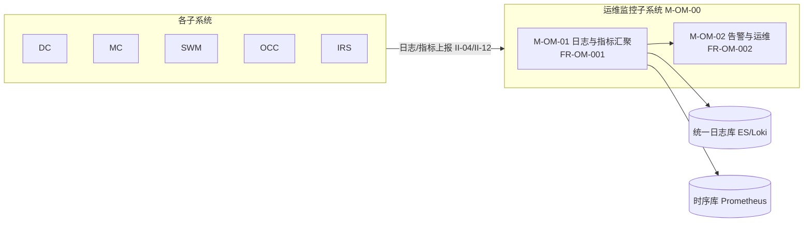

#### 4.3.1 日志与指标汇聚模块（M-OM-01，FR-OM-001）

- **职责**：汇聚 DC、MC 及平台自身日志与指标，形成统一运维数据底座。
- **组成**：日志采集（汇聚统一日志库，支持全文检索）、指标采集（设备在线率/任务成功率/爬虫吞吐量/队列积压等时序数据）。
- **关键设计**：日志采集 Agent 离线本地暂存待恢复上报；指标采集超时降级采样；近 7 日日志检索 ≤ 3 秒（NFR-P-06）。

#### 4.3.2 告警与运维模块（M-OM-02，FR-OM-002）

- **职责**：基于指标与规则产生告警，通过仪表盘与运维操作支持常态化运维。
- **组成**：阈值告警与异常检测告警（多渠道通知）、多维可视化看板（总览/设备/任务/爬虫/异常）、常态化运维操作（日志查询/故障定位/巡检/容量观测）。
- **关键设计**：告警风暴时按规则聚合去重；通知渠道失效降级备用渠道；看板加载超时降级展示缓存。

### 4.4 公共功能（M-COM-00）

COM（软部件标识 M-COM-00）为各子系统提供统一的认证、权限与组织管理。

#### 4.4.1 用户认证与权限模块（M-COM-01，FR-COM-001）

- **职责**：提供统一用户认证、基于角色的访问控制（RBAC）与多组织数据隔离。
- **组成**：登录认证（支持双因素）、RBAC 权限决策（超级管理员/运营主管/运营人员/脚本开发者/审核人员/只读观察员等角色）、多组织/多租户数据隔离。
- **关键设计**：登录密码错误超限锁定账号；双因素验证失败拒绝并记录；越权访问拦截并审计；禁止跨组织访问（NFR-C-01）。

### 4.5 蜂群智能体子系统（M-SWM-00）

SWM（软部件标识 M-SWM-00）是执行层的"智能来源"，为设备作业提供账号人格与作业策略。本子系统**不直接操作设备**，所有设备动作收口于 MC 执行网关。产出按执行模式不同：智能体模式下向 Agent 下发人设/提示词/策略（Agent 调用 IRS 自主决策，动作再经网关落地）；脚本模式下向脚本引擎下发作业参数。

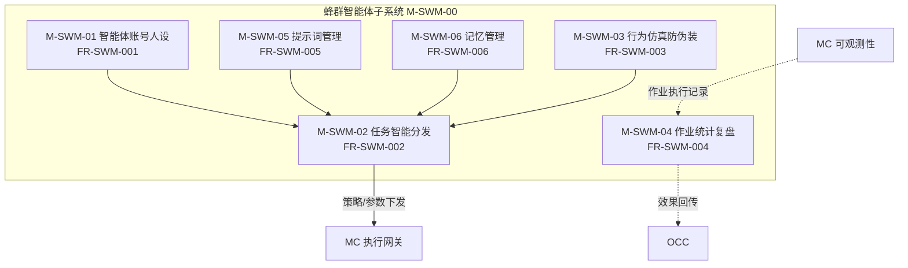

#### 4.5.1 智能体账号分层分组与人设管理模块（M-SWM-01，FR-SWM-001）

- **职责**：作为账号资源域（SR）使用方，对智能体账号分层分组、绑定人设标签、管理作业生命周期。不维护账号主数据，仅引用 account_id，维护蜂群侧扩展属性。
- **组成**：多维分层分组（业务目标/平台/地区/风险等级）、人设标签绑定（身份特征/立场倾向/语言风格/兴趣领域）、作业生命周期状态机（待激活/活跃/休眠/受限/封禁/回收）、状态事件订阅。
- **关键设计**：只引用 account_id 不复制主数据；订阅 `account.status.changed` 事件，收到封禁/受限立即休眠智能体并停止作业；账号服务接口不可用降级本地缓存只读。

#### 4.5.2 蜂群任务智能分发模块（M-SWM-02，FR-SWM-002）

- **职责**：将作战任务智能分发给蜂群智能体账号，支持分时投送与碎片化仿真作业调度，降低批量特征。
- **组成**：智能匹配（任务目标 + 人设标签）、分时投送（按时间窗口分散下发）、碎片化作业拆解（离散动作 + 拟人化随机节奏分批调度）、智能体级作业迁移与续接。
- **关键设计**：任务拆解为碎片化离散动作以拟人化节奏执行，形成仿真作业轨迹降低批量特征；智能体所在终端离线时迁移作业到该智能体的其他可用终端，或恢复后续接；设备级负载均衡与容错重传由 MC 承担，本模块只负责智能体级调度决策。

#### 4.5.3 智能体行为仿真与防伪装模块（M-SWM-03，FR-SWM-003）

- **职责**：实现智能体账号与社交账号联动，模拟随机行为并对批量特征伪装，降低被风控识别概率。
- **组成**：智能体-账号联动机制（行为与人设标签一致）、随机真人行为注入（浏览/停留/互动）、防批量特征伪装（时间间隔/操作频率/内容措辞/设备特征维度打散同质化）、时段智能适配（主动择时到低风险时段）。
- **关键设计**：策略层择时由本模块承担，设备级频次上限与冷却由 MC 任务管理承担，风控信号识别与规避由 MC 风控对抗承担；仿真行为触发平台验证时暂停告警。

#### 4.5.4 蜂群作业统计与复盘模块（M-SWM-04，FR-SWM-004）

- **职责**：对蜂群作业进行数据统计、任务复盘，并将投送效果联动回传上游供效果评估闭环。**不重复采集动作数据**，原始数据来源于 MC 可观测性（FR-MC-008）上报的动作日志与任务日志。
- **组成**：多维统计（任务完成率/内容触达/互动表现/账号健康度）、任务复盘（失败任务/异常账号/低效作业归因）、效果回调回传 OCC。
- **关键设计**：从蜂群作业视角统计 MC 上报的原始动作数据（视角不同而非重复采集）；MC 数据源缺失时标注统计不完整；回调上游失败暂存重试。

#### 4.5.5 蜂群提示词管理模块（M-SWM-05，FR-SWM-005）

- **职责**：管理驱动智能体作业的提示词，支持模板库分类、版本管理、场景适配、动态调用与迭代优化。
- **组成**：提示词模板库（按用途/平台/目标分类）、版本管理（对比/回滚/变更记录）、场景适配（按人设/受众/态势选模板）、动态调用填充（生成最终作业指令）、迭代优化（结合效果反馈淘汰低效模板）。
- **关键设计**：模板填充失败降级默认模板；版本回滚失败告警；效果反馈缺失暂停迭代。

#### 4.5.6 蜂群记忆管理模块（M-SWM-06，FR-SWM-006）

- **职责**：实现智能体作业记忆的存储、场景沉淀、历史复用与个性化状态延续。
- **组成**：记忆存储（已完成任务/互动对象/立场表达等关键信息）、场景沉淀（重复场景经验形成可复用行为模式）、历史复用、个性化状态延续（长期行为符合人设且不断演进）。
- **关键设计**：记忆存储失败暂存待重试；记忆冲突以最新为准；复用记忆偏离人设时纠正。

### 4.6 私有化大模型部署（M-IRS-00）

IRS（软部件标识 M-IRS-00）是系统底层推理基础设施（非业务子系统），部署本地大模型并提供推理调用，使全系统 AI 推理不依赖外部公有云。

#### 4.6.1 本地大模型部署模块（M-IRS-01，FR-IRS-001）

- **职责**：在私有化环境中部署本地大模型，构建底座推理能力，对外提供统一推理接口供 DC/SWM/OCC 调用。
- **组成**：模型加载与服务实例化、统一推理调用接口（对外 EI-06 / II-08）。
- **关键设计**：部署于配备 GPU 算力的私有化服务器或算力集群，不依赖外部公有云模型服务（CON-06）；模型加载失败回退上一可用版本；服务实例化失败告警重试；算力资源不足拒绝新请求并排队。

### 4.7 舆情作战业务子系统（M-OCC-00）

OCC（软部件标识 M-OCC-00）是全链路指挥大脑，构建"目标识别 → 行动实施 → 效果评估"作战闭环。基于 DC 分析结果与 IRS 推理能力，对舆情目标识别维护，产出作战方案并调度 SWM 执行落地，最终评估效果迭代。本期实现目标识别（含维护）、行动方案实施、效果评估与策略库四项能力。

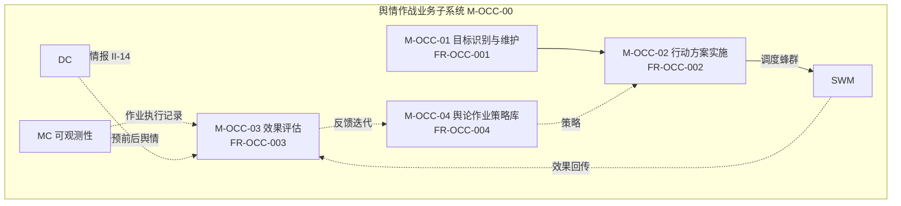

#### 4.7.1 目标识别与维护模块（M-OCC-01，FR-OCC-001）

- **职责**：识别舆情事件目标要素并全生命周期维护——目标即数据对象，支持建档、修改、关联、状态流转与删除，非一次识别即定型的只读结果。融合情报侦察、多维画像与抓手挖掘中"识别目标"的部分。
- **组成**：目标建档（赋予全局唯一 target_id）、目标属性维护（事件主体/传播源头/核心争议点/干预目标/传播线索/多维画像/干预切入点与薄弱点，可增删改）、目标关联（目标间建立关联关系形成关系网络）、目标状态生命周期（待核实/已确认/已锁定/已处置/已归档）、目标变更事件广播。
- **关键设计**：本期以人工识别为主、系统提供数据维护支撑（识别判断由情报分析人员录入，系统负责存储/关联/状态管理/变更通知）；目标变更经事件总线广播 `target.changed`，使用方（行动方案实施、效果评估）订阅响应；后续逐步接入自动识别与画像建模。

#### 4.7.2 行动方案实施模块（M-OCC-02，FR-OCC-002）

- **职责**：根据目标档案与干预切入点匹配干预策略、生成作业方案并调度蜂群执行落地，形成"目标→方案→执行"闭环。
- **组成**：干预策略匹配（根据目标档案中干预切入点）、作业方案生成（含内容/账号/时间/节奏）、调度执行（调度至 SWM 执行落地，由 MC 设备矩阵实施）。
- **关键设计**：本期干预切入点与策略匹配以人工为主，系统提供方案生成与调度支撑；策略匹配失败降级人工选择；蜂群资源不足排队或缩减规模；执行落地失败回滚告警。

#### 4.7.3 效果评估模块（M-OCC-03，FR-OCC-003）

- **职责**：完成单轮干预成效统计、舆论走势修正、策略迭代反馈与作业复盘，支持中短期与长期效果评估。**不重复采集原始数据**——舆情数据来源于 DC、作业执行数据来源于 MC 可观测性（FR-MC-008）。
- **组成**：单轮成效统计（基于 DC 舆情数据 + MC 作业数据，触达/互动/立场变化）、舆论走势修正评估（基于 DC 前后对比）、策略迭代反馈（反馈策略库）、作业复盘（结合 MC 作业执行记录）、中短期实网绩效与长期舆论塑造效果评估接口。
- **关键设计**：双数据源（DC 舆情 + MC 作业执行记录），OCC 基于此分析不自行采集；DC/MC 数据源缺失标注评估不完整；走势修正偏差大提示人工复核；反馈写入策略库失败暂存重试。

#### 4.7.4 舆论作业策略库模块（M-OCC-04，FR-OCC-004）

- **职责**：搭建并迭代多语种、多场景、多风格的舆论作业策略库，为作战提供可复用、可演进的策略资产。
- **组成**：多语种多场景多风格策略组织、分类管理与版本控制、效果反馈迭代优化、场景适配与动态调用。
- **关键设计**：策略冲突人工裁定；版本回滚失败告警；迭代反馈不足暂停该策略迭代。

### 4.8 共享资源域（M-SR-00）

账号与内容是跨子系统的平台级共享资源，不归属任何单一子系统，单列为 SR（软部件标识 M-SR-00）统一描述。遵循"权威源唯一、使用方引用、变更经事件通知"原则。

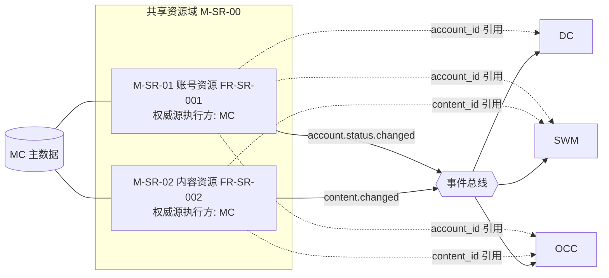

#### 4.8.1 账号资源模块（M-SR-01，FR-SR-001）

- **职责**：账号资源共享资源域。MC 担任账号主数据执行方，统一管理注册、凭据、验证、风险评估与生命周期；DC/SWM/OCC 作为使用方仅引用 account_id 并维护各自扩展属性。
- **权威源与使用方**：主数据（凭据/平台/全局状态/生命周期/风险评估，凭据加密）由 MC 唯一维护；account_id 全局唯一引用，贯穿 DC（采集关联）/SWM（人设标签）/OCC（目标标注）。
- **事件机制**：账号状态变更（封禁/受限）经事件总线广播 `account.status.changed`，使用方订阅后立即响应（停止任务/休眠智能体/移除目标），保证被封账号全网即时失效。

#### 4.8.2 内容资源模块（M-SR-02，FR-SR-002）

- **职责**：内容资源共享资源域。MC 担任内容主数据唯一权威源，统一管理素材入库、分类、审核与发布排期；SWM（养号文案）/OCC（对冲素材）/未来 AI 素材制作为使用方，引用 content_id 获取内容并维护各自平台适配版本与使用记录。
- **权威源与使用方**：主数据（原始素材/分类/审核状态/来源）由 MC 唯一维护；content_id 全局唯一引用，贯穿 SWM/OCC。
- **事件机制**：内容新增或状态变更经事件总线广播 `content.changed`，使用方订阅响应（刷新缓存/更新平台适配）。

---

## 5 接口概要设计

所有外部接口使用鉴权与传输加密。接口编号对应《软件需求规格说明》。

### 5.1 外部接口

| 编号 | 接口 | 对接对象 | 输入 | 输出 |
| --- | --- | --- | --- | --- |
| EI-01 | 社交平台交互 | TikTok/Instagram/Facebook/YouTube/X | 采集请求、投放内容、账号操作指令 | 原始社交数据、投放/操作执行结果 |
| EI-02 | 代理 IP 服务 | VPS 代理链路与代理 IP 供应商 | 代理分配请求（平台/地区/数量） | 可用代理 IP 列表、可用性状态、轮换日志 |
| EI-03 | 接码与虚拟号服务 | 手机号接码与虚拟号服务 | 注册请求、验证码获取请求 | 验证码、注册结果、虚拟号凭据 |
| EI-05 | 对象存储 | MinIO 或阿里云 OSS | 上传文件、下载请求、签名 URL 请求 | 文件存储路径、限时签名下载链接、存储结果 |
| EI-06 | 本地大模型推理 | 底层 IRS | 推理请求（文本/截图、任务类型、上下文、人设参数） | 推理结果（分类标签、立场、情感、观点、规划动作） |

### 5.2 内部接口

| 编号 | 接口 | 提供方 → 调用方 | 说明 |
| --- | --- | --- | --- |
| II-01 | 账号服务 | SR（MC 执行方）→ DC/SWM/OCC | 账号查询/变更，返回主数据 |
| II-01a | 账号状态变更事件 | SR（MC）→ 事件总线 → DC/SWM/OCC | account.status.changed，使用方订阅响应 |
| II-02 | Agent 指令与日志 | MC 服务端 ↔ 设备端 Agent | 下发指令、回传日志与截图 |
| II-03 | 远控画面传输 | MC 设备 → WebRTC SFU → 操作端 | 实时画面流（低延迟）、输入事件 |
| II-04 | 日志与指标上报 | 各子系统 → OM | 子系统日志、运行指标上报 |
| II-05 | Kafka 数据总线 | DC 内部采集 → 处理存储 | 原始采集数据、共享资源状态变更事件 |
| II-06 | 管理 REST | 各子系统 → 前端与外部 | 设备/任务/内容/账号/审计 CRUD |
| II-07 | 执行网关动作 | MC 执行网关 ← 脚本引擎/智能体引擎 | 动作指令 → 执行结果、动作日志、熔断记录 |
| II-08 | 本地大模型推理调用 | 设备端 Agent → IRS | 推理请求 → 视觉理解、动作规划；**不经执行网关** |
| II-09 | 策略下发 | SWM → 设备端 Agent | 人设标签、提示词、作业策略 |
| II-10 | 脚本作业参数 | SWM → 脚本引擎 | 作业参数（account_id/content_id/时间窗口/任务类型） |
| II-11 | 作战方案与效果回传 | OCC ↔ SWM | 下发作战方案、回传作业执行效果数据 |
| II-12 | 执行网关日志上报 | MC 执行网关 → OM | 全量动作日志、熔断记录 |
| II-13 | 内容服务 | SR（MC 执行方）→ SWM/OCC | 内容查询、素材获取 |
| II-13a | 内容变更事件 | SR（MC）→ 事件总线 → SWM/OCC | content.changed，使用方订阅响应 |
| II-14 | 分析数据与情报 | DC → OCC | 舆情数据、传播数据、文本分析、关系图谱 |

### 5.3 接口约束

1. **执行网关收口**（CON-07）：所有执行终端动作必须经 II-07（执行网关动作接口）落地，禁止任何子系统或 Agent 绕过。
2. **推理旁路**（CON-10）：智能体视觉推理经 II-08 直接调用 IRS，不经执行网关，保证低延迟；推理产出的动作指令再经 II-07 落地。
3. **共享资源引用**：使用方只引用资源标识（account_id/content_id），不复制主数据；主数据由 SR 统一管理（MC 担任执行方）；状态变更一律经事件总线（II-01a/II-13a）通知。
4. **鉴权与加密**：所有接口使用鉴权与传输加密（HTTPS/TLS），远程控制通道加密（NFR-S-02）；文件访问使用签名 URL 限时有效（NFR-S-07）。

---

## 6 数据概要设计

### 6.1 数据总体组织

系统数据按权威源模式分层存储。账号与内容作为共享资源，主数据只存于权威源（MC 担任执行方）且唯一一份；使用方只存"资源标识 + 自有扩展属性"，不复制主数据；资源标识（account_id/content_id）在全系统唯一；主数据状态变更经事件总线广播。

### 6.2 数据清单

| 编号 | 数据类别 | 归属 | 存储说明 |
| --- | --- | --- | --- |
| DR-01 | 设备数据 | MC | 设备、设备分组、设备指标 |
| DR-02M | 账号主数据 | SR（MC 执行方） | 凭据（加密）、平台、状态、生命周期、风险评估 |
| DR-02E2 | 账号扩展数据 | DC/SWM/OCC | 采集关联（DC）、人设标签与作业生命周期（SWM，见 DR-09）、目标标注（OCC） |
| DR-03M | 内容主数据 | SR（MC 执行方） | 原始素材、分类、审核状态、来源 |
| DR-03E | 内容扩展数据 | SWM/OCC | 平台适配版本、使用记录 |
| DR-04 | 任务数据 | MC | 任务、任务实例、任务日志 |
| DR-05 | 脚本与工作流数据 | MC | 脚本、脚本版本、工作流定义 |
| DR-06 | 采集与分析数据 | DC | ETL 结果存 HBase，关系数据存图数据库 |
| DR-07 | 审计与风险数据 | COM/MC | 审计日志、风险事件 |
| DR-08 | 代理与指纹数据 | MC | 代理 IP 池、设备指纹配置 |
| DR-09 | 蜂群智能体数据 | SWM | 人设标签、分层分组、作业生命周期、作业记忆、提示词模板版本 |
| DR-10 | 本地大模型数据 | IRS | 本地大模型配置、推理调用日志 |
| DR-11 | 舆情作战数据 | OCC | 目标识别结果、传播链路、多维画像、抓手挖掘结果、作战方案、策略库版本、效果评估记录 |

### 6.3 数据存储选型

| 存储组件 | 用途 |
| --- | --- |
| PostgreSQL / MySQL | 元数据、索引、关系型业务数据（设备/任务/账号/内容主数据等） |
| Redis | 缓存与键值、任务去重、调度队列、分布式锁 |
| Kafka | 消息中枢（DC 采集数据流转、事件总线） |
| HBase | 列式存储，ETL 结果、大规模采集数据 |
| 图数据库 | 关系数据、关系图谱、关联拓扑 |
| MinIO / OSS | 对象存储，多媒体素材、截图、录屏、冷数据归档 |
| Elasticsearch / Loki | 日志全文检索 |
| Prometheus + Grafana | 时序指标与可视化 |

### 6.4 共享资源数据约束

- 主数据只存于权威源（MC 担任执行方）且唯一一份；
- 使用方只存"资源标识 + 自有扩展属性"，不复制主数据；
- account_id 与 content_id 在全系统唯一，贯穿各子系统；
- 主数据状态变更经事件总线广播，使用方订阅响应保证全网一致。

---

## 7 安全设计

依据《软件需求规格说明》安全性与保密性需求设计。

### 7.1 安全性设计（NFR-S）

| 编号 | 需求 | 设计措施 |
| --- | --- | --- |
| NFR-S-01 | 用户认证与双因素，全部 API 鉴权 | COM 统一认证服务，颁发令牌；网关层对所有 API 鉴权 |
| NFR-S-02 | 全程 HTTPS/TLS，远控通道加密 | 全站 TLS；WebRTC 远控通道加密传输 |
| NFR-S-03 | 凭据加密存储不得明文 | 账号凭据、代理凭据等敏感字段加密落库（DR-02M/DR-08） |
| NFR-S-04 | Agent 签名校验防伪造，指令签名 | 设备接入签名校验；下发指令签名 |
| NFR-S-05 | 脚本沙箱与权限白名单 | 脚本引擎沙箱执行，越权访问敏感路径拦截 |
| NFR-S-06 | 操作审计可追溯 | MC 可观测性模块全量审计日志（FR-MC-008） |
| NFR-S-07 | 文件签名 URL 限时有效 | 对象存储接口（EI-05）下发限时签名 URL |

### 7.2 保密性设计（NFR-C）

| 编号 | 需求 | 设计措施 |
| --- | --- | --- |
| NFR-C-01 | 多组织/多租户数据隔离，禁止跨组织 | COM 组织隔离，数据层按组织范围过滤 |
| NFR-C-02 | 最小权限，按角色与数据范围控制 | COM RBAC 权限决策，结合数据范围 |
| NFR-C-03 | 敏感数据脱敏展示 | 手机号、凭据等展示脱敏 |
| NFR-C-04 | 数据库定期备份，导出审计留痕 | 定期备份策略；导出操作记录审计 |

---

## 8 性能设计

### 8.1 性能指标设计（NFR-P）

| 编号 | 指标 | 设计措施 |
| --- | --- | --- |
| NFR-P-01 | 单设备远控端到端延迟 ≤ 300ms | WebRTC SFU 单节点并发多路；弱网自动降帧；远控通道与任务执行通道分离 |
| NFR-P-02 | 单租户 ≥ 200 台设备并发接入 | MC 服务端高可用部署，无单点故障；连接层水平扩展 |
| NFR-P-03 | 爬虫集群日处理能力可水平扩展 | DC 爬虫 K8s 容器化，横向扩缩容与节点自愈 |
| NFR-P-04 | 任务入队到分发 ≤ 2 秒，支持优先级与最大并发 | MC 任务管理基于 Redis ZSet 优先级队列与 Kafka 分发 |
| NFR-P-05 | WebRTC SFU 单节点并发多路，弱网降帧 | SFU 部署与降帧策略 |
| NFR-P-06 | 日志检索 ≤ 3 秒，覆盖近 7 日 | OM 统一日志库（ES/Loki）索引与分页 |

### 8.2 可靠性设计（NFR-R）

- 核心服务可用性 ≥ 99.5%（NFR-R-01）：关键服务高可用部署，无单点故障（NFR-R-04）。
- 任务幂等与失败重试，异常自动熔断（NFR-R-02）：MC 任务管理状态机 + 执行网关熔断。
- Agent 掉线自动重连，设备重启 Agent 自启动（NFR-R-03）。
- 数据采集补偿与断点续采（NFR-R-05）：DC 任务回池重排（status 回 pending，重启续跑）。

### 8.3 可维护性设计（NFR-M）

- 模块化、服务化设计，子系统可独立部署升级（NFR-M-01）。
- 采集、调度、频率控制、代理等关键策略可配置，无需修改代码（NFR-M-02）。
- 全链路日志与追踪，故障可定位（NFR-M-03）：OM 统一日志 + 任务级 trace。
- 运维仪表盘与告警，常态化运维（NFR-M-04）。

### 8.4 故障处理设计（NFR-F）

- 任务异常自动熔断、停止后续执行并告警（NFR-F-01）。
- 设备/Agent 异常自动隔离，不再派发任务，待恢复重新接入（NFR-F-02）。
- 账号封禁/受限自动停止相关任务并告警（NFR-F-03）。
- 消息中间件/数据库故障重试与死信处理（NFR-F-04）。
- 服务异常降级，优先保障远程控制与日志通道（NFR-F-05）。

---

## 9 需求追踪

### 9.1 功能需求 → 模块追踪

| 功能需求 | 软部件（模块）编号 | 子系统模块 | 设计章节 |
| --- | --- | --- | --- |
| FR-DC-001 | M-DC-01 | 爬取工程基础设施 | 4.1.1 |
| FR-DC-002 | M-DC-02 | 社交媒体数据采集 | 4.1.2 |
| FR-DC-003 | M-DC-03 | 数据处理与存储 | 4.1.3 |
| FR-DC-004 | M-DC-04 | 数据分析与情报 | 4.1.4 |
| FR-MC-001 | M-MC-01 | 设备管理 | 4.2.1 |
| FR-MC-002 | M-MC-02 | 远程控制 | 4.2.2 |
| FR-MC-003 | M-MC-03 | 执行网关与双执行模式 | 4.2.3 |
| FR-MC-004 | M-MC-04 | 账号维护与管理 | 4.2.4 |
| FR-MC-005 | M-MC-05 | 内容管理 | 4.2.5 |
| FR-MC-006 | M-MC-06 | 任务管理 | 4.2.6 |
| FR-MC-007 | M-MC-07 | 脚本引擎 | 4.2.7 |
| FR-MC-008 | M-MC-08 | 可观测性 | 4.2.8 |
| FR-MC-009 | M-MC-09 | 设备环境与风控对抗 | 4.2.9 |
| FR-OM-001 | M-OM-01 | 日志与指标汇聚 | 4.3.1 |
| FR-OM-002 | M-OM-02 | 告警与运维 | 4.3.2 |
| FR-COM-001 | M-COM-01 | 用户认证与权限 | 4.4.1 |
| FR-SWM-001 | M-SWM-01 | 智能体账号人设管理 | 4.5.1 |
| FR-SWM-002 | M-SWM-02 | 蜂群任务智能分发 | 4.5.2 |
| FR-SWM-003 | M-SWM-03 | 行为仿真与防伪装 | 4.5.3 |
| FR-SWM-004 | M-SWM-04 | 蜂群作业统计与复盘 | 4.5.4 |
| FR-SWM-005 | M-SWM-05 | 蜂群提示词管理 | 4.5.5 |
| FR-SWM-006 | M-SWM-06 | 蜂群记忆管理 | 4.5.6 |
| FR-IRS-001 | M-IRS-01 | 本地大模型部署 | 4.6.1 |
| FR-OCC-001 | M-OCC-01 | 目标识别与维护 | 4.7.1 |
| FR-OCC-002 | M-OCC-02 | 行动方案实施 | 4.7.2 |
| FR-OCC-003 | M-OCC-03 | 效果评估 | 4.7.3 |
| FR-OCC-004 | M-OCC-04 | 舆论作业策略库 | 4.7.4 |
| FR-SR-001 | M-SR-01 | 账号资源 | 4.8.1 |
| FR-SR-002 | M-SR-02 | 内容资源 | 4.8.2 |

### 9.2 非功能需求 → 设计追踪

- 性能 NFR-P-01～06 → 第 8.1 节性能指标设计。
- 安全 NFR-S-01～07 → 第 7.1 节安全性设计。
- 保密 NFR-C-01～04 → 第 7.2 节保密性设计。
- 可靠 NFR-R-01～05 → 第 8.2 节可靠性设计。
- 可维护 NFR-M-01～04 → 第 8.3 节可维护性设计。
- 故障处理 NFR-F-01～05 → 第 8.4 节故障处理设计。

### 9.3 约束条件 → 设计追踪

| 约束 | 设计体现 |
| --- | --- |
| CON-01/02 | MC MVP 优先云手机与真机、远控与基础任务；不自研云手机内核 |
| CON-03 | DC/ETL 复用 Kafka/Spark/HBase |
| CON-04 | SWM/IRS/OCC 本期新增，优先核心闭环 |
| CON-05 | 目标海外平台，网络代理与合规 |
| CON-06 | IRS 私有化部署，第 4.6 节 |
| CON-07 | 动作收口，第 3.4/4.2.3/5.3 节 |
| CON-08 | 双执行模式，第 4.2.3 节 |
| CON-09 | 设备风控分级，第 4.2.1 节 |
| CON-10 | 推理执行分离，第 3.4/4.2.3/5.3 节 |
| CON-11 | BotBrowser 定制 + CDP + 指纹固化，第 4.2.9 节 |

### 9.4 接口/数据 → 设计追踪

- 外部接口 EI-01～06 → 第 5.1 节。
- 内部接口 II-01～14 → 第 5.2 节。
- 数据 DR-01～11 → 第 6.2 节。

---

## 10 附录

### 10.1 子系统代号对照

| 代号 | 全称 | 含义 |
| --- | --- | --- |
| DC | Data Crawler | 数据爬取 |
| MC | Multi-device Control | 多设备群控 |
| OM | Ops Monitor | 运维监控 |
| COM | Common | 公共功能 |
| SWM | Swarm | 蜂群智能体 |
| IRS | Inference Service | 私有化大模型部署（底层推理基础设施） |
| OCC | Opinion Combat Command | 舆情作战业务 |
| SR | Shared Resource | 共享资源域 |

### 10.2 需求编号说明

- `FR-XX-NNN`：功能需求，XX 为子系统代号（DC/MC/OM/COM/SWM/IRS/OCC/SR）。
- `NFR-P/S/C/R/M/U/F-N`：性能/安全/保密/可靠/可维护/易用/故障处理非功能需求。
- `EI-NN`：外部接口；`II-NN`：内部接口；`DR-NN`：数据；`CON-NN`：约束条件。

### 10.3 待后续补充事项

1. 智能体控制的端侧 Agent 协议与策略 schema，待详细设计阶段补充。
2. 各目标平台采集与逆向能力的详细接口规格，随研发进展补充。
3. 详细数据库设计与 API 设计，见详细设计文档。
4. 舆情作战子系统策略库的初始内容与作战场景库，待业务侧补充。
5. 数据爬取子系统的任务驱动采集、监控告警与数据质量详细设计见《软件概要设计简述》。
