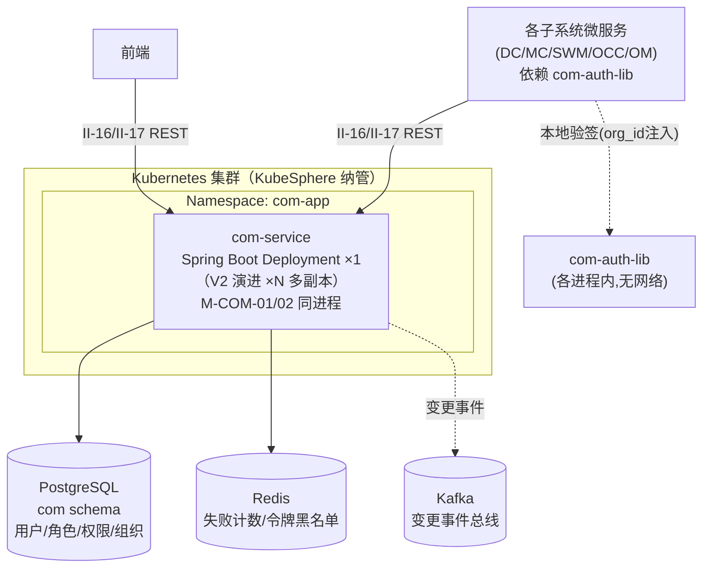
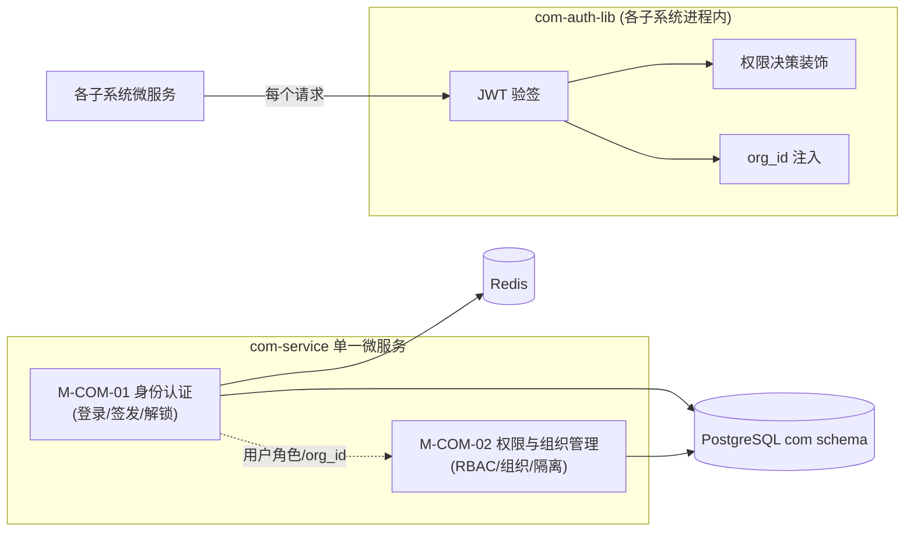
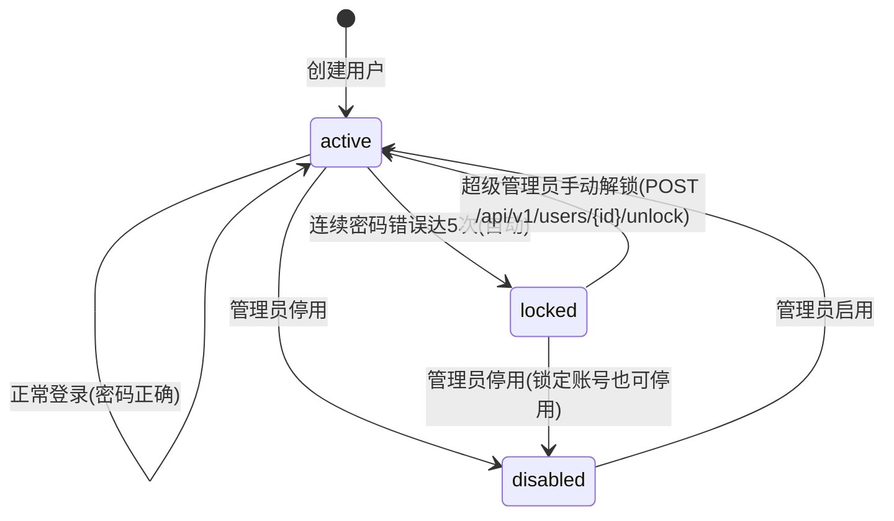

# 软件详细设计说明 - COM 子系统

| 项目 | 内容 |
| --- | --- |
| 项目名称 | 认知作战平台（v1.0） |
| 文档版本 | V1.0 |
| 密级 | 内部使用 |
| 编制 | 石建国 |
| 编制日期 | 2026-07-14 |

---

## 1 引言

### 1.1 标识

本文件为「认知作战平台」（以下简称"系统"或"平台"）公共功能子系统（COM，软部件标识 M-COM-00）的软件详细设计说明（SDD）。它是《软件需求规格说明-COM子系统》V3.8 功能需求 R-COM-001 与《软件概要设计说明》V2.5 模块 M-COM-01/02 的详细设计下沉，描述 COM 子系统各模块的内部结构、类与接口、数据结构、算法、状态机与部署单元，作为编码实现与单元测试的依据。

### 1.2 系统概述

公共功能子系统（COM）是横切各子系统的统一身份与访问管理（IAM）底座，为 DC/MC/SWM/OCC/OM 等各子系统提供统一的用户认证、基于角色的访问控制（RBAC）与组织管理，支持多组织的数据隔离。COM 采用「**单一微服务（com-service） + 共享验签库（com-auth-lib）**」形态：com-service 承担写操作（登录签发、用户/角色/组织 CRUD、账号解锁），com-auth-lib 作为 Java 协议层 SDK 下沉至各子系统本地执行读操作（JWT 验签、org_id 注入、权限装饰），无网络开销。

COM 的认证域只覆盖「**人登录认知作战平台本身**」（6 类操作者角色）；不覆盖 MC（R-MC-011/M-MC-11）维护的「**机器人在目标平台上的作业账号主数据**」（爬虫/智能体账号的凭据、平台、生命周期、风险）。两者是完全独立的身份领域，本文件不涉及后者。

COM 子系统由两个模块组成（对应 1 项功能需求与 5 个功能点）：

| 模块 | 标识 | 对应需求 | 功能点 |
| --- | --- | --- | --- |
| 身份认证 | M-COM-01 | R-COM-001（AuthN） | F-COM-01-01、F-COM-01-03 |
| 权限与组织管理 | M-COM-02 | R-COM-001（AuthZ） | F-COM-02-01、F-COM-02-02、F-COM-02-03 |

> 说明：R-COM-001 原含双因素认证（V3.6 前的功能点 F-COM-01-02），V3.6 起按「简化实现」降级删除，全栈同步移除（详见《版本变动记录》）。功能点编号 F-COM-01-02 随之废止，F-COM-01-03 保留原编号以稳定全文交叉引用（编号缺口在变动记录中登记）。

### 1.3 文档概述

本文件章节安排如下：第 2 章引用文件；第 3 章总体设计，给出 COM 技术栈、部署单元、模块间调用关系与数据流；第 4 章数据结构设计，给出核心数据模型与存储表结构；第 5 章按模块给出详细设计（类/接口/算法/状态机）；第 6 章接口详细设计；第 7 章错误处理与可靠性设计；第 8 章部署与运维设计。需求追溯以《软件需求跟踪矩阵.xlsx》为唯一权威源，本文件第 9 章仅做概要引用。

### 1.4 术语和缩略语

沿用《软件需求规格说明-总册》第 1.4 节术语与缩略语，本文件补充以下技术术语：

| 术语 | 说明 |
| --- | --- |
| IAM | Identity and Access Management，身份与访问管理，涵盖认证（AuthN，你是谁）与授权（AuthZ，你能访问什么）两个经典子问题 |
| JWT | JSON Web Token，无状态的紧凑令牌格式，签发方用密钥签名，验签方本地校验，无需网络回查 |
| AuthN / AuthZ | 认证（Authentication）/ 授权（Authorization），IAM 的两个经典分工 |
| RBAC | Role-Based Access Control，基于角色的访问控制，用户经角色关联权限点，权限决策按角色执行 |
| com-auth-lib | COM 提供的 Java 共享验签库（协议层 SDK），下沉至各子系统本地完成 JWT 验签、org_id 注入、权限校验，无网络调用 |
| org_id | 组织标识，JWT 令牌携带，com-auth-lib 提取后注入请求上下文用于行级数据隔离 |
| 权限点 | RBAC 的最小授权单元，本设计采用「子系统 × 动作（查看/操作/管理）」粒度 |

---

## 2 引用文件

| 文件 | 说明 |
| --- | --- |
| 《软件需求规格说明-COM子系统》V3.8 | COM 功能需求 R-COM-001、非功能需求（NR-S-01 认证与 API 鉴权、NR-C-01/02 组织隔离与最小权限）、接口（II-16/II-17）的直接输入 |
| 《软件概要设计说明》V2.5 | COM 模块划分 M-COM-01/02、§4.4 COM 模块组成、§7.1/§7.2 安全保密设计 |
| 《软件概要设计-架构图.md》V1.3 | COM 模块架构图与模块内功能架构图（§6 公共功能） |
| 《软件概要设计-模块功能拆分-v2.xlsx》 | COM 2 模块 5 功能点的权威依据 |
| 《软件需求跟踪矩阵.xlsx》 | COM 需求双向追溯唯一权威源 |
| 《软件详细设计说明-OM子系统.md》V1.0 | Java/Spring Boot 同栈微服务的形态参照、PostgreSQL/Redis 复用约定 |
| 《软件详细设计说明-DC子系统.md》V1.2 | 复用 PostgreSQL/Redis 实例、Kafka 总线约定的参照依据 |

---

## 3 总体设计

### 3.1 技术选型

COM 子系统技术栈遵循全平台「**管控/业务微服务统一 Java（Spring Boot）；数据采集与分析用 Python；两者经 Kafka/REST 解耦**」原则（DC 整体归 Python 为采集域特例，不算违背）。COM 与 OM 同为 Java/Spring Boot 栈。

| 维度 | 选型 | 说明 |
| --- | --- | --- |
| 微服务语言/框架 | **Java 17 + Spring Boot 3.x** | com-service 单一微服务，提供认证、用户/角色/组织 CRUD、账号解锁 REST 接口 |
| 安全框架 | **Spring Security 6.x + JJWT** | 密码加密（BCrypt）、JWT 签发（HMAC-SHA256）、令牌解析校验 |
| 微服务治理 | **KubeSphere 微服务治理**（Spring Cloud Kubernetes） | 服务注册/发现/配置复用 KubeSphere，不另起注册中心，与 OM 一致 |
| 元数据库 | **PostgreSQL**（复用 DC 实例，独立 schema `com`） | 用户/角色/权限点/组织/成员主数据（OLTP 事务） |
| 缓存与锁定计数 | **Redis**（复用 DC 实例） | 登录失败计数（TTL 自动过期）、令牌黑名单（登出吊销） |
| 共享验签库 | **com-auth-lib**（Java，Maven 依赖） | 各子系统本地引入，JWT 验签 + org_id 注入 + 权限装饰器，无网络调用 |
| 业务数据总线 | **Kafka**（复用 DC 集群） | 用户/组织变更事件广播（可选，供各子系统刷新本地缓存） |
| 容器编排 | **Kubernetes（KubeSphere 纳管）** | com-service Pod 化部署 |

### 3.2 部署单元

COM 部署为「**一个微服务 + 一个共享库**」，当前版本 com-service **单副本**（V2 演进多副本 HA，对应 NR-R-01/04 的 V2 目标）。M-COM-01/02 为 com-service 同进程内的 Java 包/模块，不拆独立 Pod。com-auth-lib 不是部署单元，而是各子系统微服务 Maven 依赖引入的库。



各部署单元职责：

| 部署单元 | 实现 | 对应模块 | 副本 |
| --- | --- | --- | --- |
| com-service | Spring Boot 单一微服务（auth/permission 为同进程 Java 包） | M-COM-01 认证 + M-COM-02 权限组织 | ×1（V2 演进 ×N） |
| com-auth-lib | Java 共享库（各子系统 Maven 依赖引入，进程内） | M-COM-01 验签 + M-COM-02 鉴权（读路径） | 随各子系统 |

> com-auth-lib 不独立部署，由各子系统微服务在构建期以 Maven 依赖引入，运行期作为进程内库执行本地验签。

### 3.3 模块间调用关系

com-service 内部 M-COM-01/02 同进程调用；com-auth-lib 在各子系统进程内执行读操作（验签/鉴权/隔离注入），不经 com-service。



### 3.4 数据流设计

COM 数据流分三类：

1. **登录签发流**：前端/用户 → com-service `POST /api/v1/auth/login`（II-16）→ M-COM-01 校验密码（BCrypt）→ 查 PostgreSQL 取用户角色/org_id → 签发 JWT（含 user_id/org_id/roles）→ 返回令牌。登录失败累计 Redis 计数，达 5 次锁定。
2. **鉴权流（各子系统本地）**：各子系统收到带 JWT 的请求 → com-auth-lib 本地验签（HMAC-SHA256）→ 从令牌提取 org_id 注入请求上下文 → 权限装饰器按角色权限点决策（查看/操作/管理）→ 放行或越权拦截审计。
3. **管理流**：超级管理员 → com-service 用户/角色/组织 CRUD（II-17）→ 写 PostgreSQL → （可选）发 Kafka 变更事件供各子系统刷新缓存。

---

## 4 数据结构设计

COM 元数据存于 PostgreSQL（独立 schema `com`），缓存与计数存 Redis。COM 不产生分析型大数据，不使用 ClickHouse/NebulaGraph。

### 4.1 元数据库（PostgreSQL `com` schema）

#### 4.1.1 用户表 `sys_user`（M-COM-01 登录主体）

```sql
CREATE TABLE com.sys_user (
    user_id         UUID PRIMARY KEY,
    username        VARCHAR(64) NOT NULL UNIQUE,   -- 登录账号
    password_hash   VARCHAR(128) NOT NULL,         -- BCrypt 密散列(NR-S-03 不落明文)
    display_name    VARCHAR(128),
    status          VARCHAR(16) NOT NULL,          -- active/locked/disabled
    org_id          UUID NOT NULL,                 -- 所属组织(关联 sys_org)
    fail_count      INT NOT NULL DEFAULT 0,        -- 连续登录失败次数
    locked_at       TIMESTAMPTZ,                   -- 锁定时间(需管理员解锁)
    last_login_at   TIMESTAMPTZ,
    last_login_ip   VARCHAR(64),
    created_at      TIMESTAMPTZ NOT NULL DEFAULT now(),
    updated_at      TIMESTAMPTZ NOT NULL DEFAULT now()
);
CREATE INDEX idx_sys_user_org ON com.sys_user(org_id);
CREATE INDEX idx_sys_user_status ON com.sys_user(status);
```

#### 4.1.2 角色表 `sys_role` 与 权限点表 `sys_permission`（M-COM-02 RBAC）

```sql
CREATE TABLE com.sys_role (
    role_id         VARCHAR(32) PRIMARY KEY,       -- super_admin/ops_lead/ops_staff/script_dev/auditor/viewer
    role_name       VARCHAR(64) NOT NULL,
    description     VARCHAR(256)
);

CREATE TABLE com.sys_permission (
    permission_id   VARCHAR(64) PRIMARY KEY,       -- 格式: 子系统:动作,如 dc:view/mc:manage/occ:operate
    subsystem       VARCHAR(8) NOT NULL,           -- DC/MC/OM/SWM/OCC/IRS/COM
    action          VARCHAR(16) NOT NULL,          -- view(查看)/operate(操作)/manage(管理)
    description     VARCHAR(256),
    UNIQUE(subsystem, action)
);

-- 角色-权限关联(多对多)
CREATE TABLE com.sys_role_permission (
    role_id         VARCHAR(32) NOT NULL REFERENCES com.sys_role(role_id),
    permission_id   VARCHAR(64) NOT NULL REFERENCES com.sys_permission(permission_id),
    PRIMARY KEY (role_id, permission_id)
);
```

权限点采用「子系统 × 动作」粒度，共 7 子系统 × 3 动作 ≈ 21 个权限点（部分子系统不适用全部三动作，实际略少）。动作语义：

| 动作 | 语义 |
| --- | --- |
| `view` | 查看（只读访问子系统数据与界面） |
| `operate` | 操作（执行业务操作，如发起任务、审核内容） |
| `manage` | 管理（配置、增删改主数据，如管理设备/账号/用户） |

#### 4.1.3 组织表 `sys_org` 与 成员关联 `sys_org_member`（M-COM-02 组织隔离基础）

```sql
CREATE TABLE com.sys_org (
    org_id          UUID PRIMARY KEY,
    org_code        VARCHAR(64) NOT NULL UNIQUE,   -- 组织编码
    org_name        VARCHAR(128) NOT NULL,
    parent_org_id   UUID,                          -- 上级组织(支持树形结构)
    status          VARCHAR(16) NOT NULL DEFAULT 'active',
    created_at      TIMESTAMPTZ NOT NULL DEFAULT now(),
    FOREIGN KEY (parent_org_id) REFERENCES com.sys_org(org_id)
);

-- 用户-组织多归属(一个用户可属多个组织,但令牌签发时锁定单一 org_id)
CREATE TABLE com.sys_org_member (
    org_id          UUID NOT NULL REFERENCES com.sys_org(org_id),
    user_id         UUID NOT NULL REFERENCES com.sys_user(user_id),
    is_primary      BOOLEAN NOT NULL DEFAULT false,  -- 是否主组织
    PRIMARY KEY (org_id, user_id)
);
CREATE INDEX idx_sys_org_member_user ON com.sys_org_member(user_id);
```

#### 4.1.4 用户-角色分配 `sys_user_role`（一个用户可有多角色）

```sql
CREATE TABLE com.sys_user_role (
    user_id         UUID NOT NULL REFERENCES com.sys_user(user_id),
    role_id         VARCHAR(32) NOT NULL REFERENCES com.sys_role(role_id),
    granted_at      TIMESTAMPTZ NOT NULL DEFAULT now(),
    granted_by      UUID,                          -- 授权人(超级管理员)
    PRIMARY KEY (user_id, role_id)
);
```

#### 4.1.5 审计日志表 `sys_audit_log`（越权拦截与关键操作留痕，NR-S-06）

```sql
CREATE TABLE com.sys_audit_log (
    log_id          BIGSERIAL PRIMARY KEY,
    occurred_at     TIMESTAMPTZ NOT NULL DEFAULT now(),
    user_id         UUID,                          -- 操作者(越权时为尝试者)
    username        VARCHAR(64),
    org_id          UUID,
    action          VARCHAR(64) NOT NULL,          -- login/permission_denied/unlock/role_grant/...
    target          VARCHAR(128),                  -- 操作对象
    result          VARCHAR(16) NOT NULL,          -- success/denied/failed
    detail          TEXT,
    client_ip       VARCHAR(64),
    request_path    VARCHAR(256)
);
CREATE INDEX idx_sys_audit_log_time ON com.sys_audit_log(occurred_at);
CREATE INDEX idx_sys_audit_log_user ON com.sys_audit_log(user_id, occurred_at);
CREATE INDEX idx_sys_audit_log_action ON com.sys_audit_log(action, occurred_at);
```

### 4.2 角色与权限初始化数据

系统初始化时预置 6 个角色与权限点关联，对应 R-COM-001 的 6 类操作者。角色-权限映射（Y=授予）：

| 角色 \ 权限范围 | DC | MC | OM | SWM | OCC | IRS | COM |
| --- | --- | --- | --- | --- | --- | --- | --- |
| 超级管理员 `super_admin` | manage | manage | manage | manage | manage | manage | manage |
| 运营主管 `ops_lead` | view | operate+manage | view | view | operate+manage | view | — |
| 运营人员 `ops_staff` | view | operate | view | view | operate | view | — |
| 脚本开发者 `script_dev` | view | operate | view | view | view | view | — |
| 审核人员 `auditor` | view | view | view | view | operate（审核） | view | — |
| 只读观察员 `viewer` | view | view | view | view | view | view | — |

> 「operate+manage」表示同时授予操作与管理两级；「—」表示该角色对此子系统无权限（COM 子系统管理仅超级管理员可访问）。IRS 为基础设施，所有角色默认仅 view（推理调用本身由 SWM/MC 经服务间调用，不经用户 RBAC）。

### 4.3 Redis Key 设计

| Redis Key 模式 | 类型 | 用途 | TTL |
| --- | --- | --- | --- |
| `com:login:fail:{username}` | STRING（计数） | 连续登录失败次数，达 5 触发锁定 | 无（锁定后由 DB 状态接管，计数重置） |
| `com:token:blacklist:{jti}` | STRING | 登出/吊销的 JWT 黑名单（jti=令牌唯一标识） | = 令牌剩余有效期 |
| `com:perm:{role_id}` | SET | 角色的权限点缓存（减少 DB 查询，签发与决策时读） | 1 小时（变更事件刷新） |

---

## 5 模块详细设计

### 5.1 M-COM-01 身份认证模块（R-COM-001 AuthN）

#### 5.1.1 模块组成与类图

M-COM-01 职责为「**登录认证 + JWT 签发 + 登出/吊销**」（V3.6 起已移除双因素）：

```mermaid
classDiagram
    class AuthService {
        +login(username, password, client_ip) TokenResult
        +logout(token)  %% 登出加入黑名单
        +refresh(refresh_token) TokenResult
    }
    class LoginPolicy {
        +check_lock(username) LockStatus
        +record_failure(username)  %% 失败计数+1,达5锁定
        +reset_failure(username)
    }
    class JwtTokenService {
        +issue(user, org, roles) TokenPair  %% access+refresh
        +parse(token) Claims
        +verify(token) boolean
        +revoke(jti, ttl)  %% 入黑名单
    }
    class UserRepository {
        +find_by_username(name) User
        +update_status(user_id, status)
        +update_lock(user_id, locked_at)
    }
    class AuthService ..> LoginPolicy : 锁定策略
    class AuthService ..> JwtTokenService : 令牌签发
    class AuthService ..> UserRepository : 用户查询
    class LoginPolicy ..> UserRepository : 锁定写库
```

#### 5.1.2 关键类说明

- **AuthService**：认证服务门面。登录流程：校验账号未锁定 → BCrypt 比对密码 → 成功则签发令牌并重置失败计数，失败则累计计数达 5 锁定。登出将令牌 jti 加入 Redis 黑名单。
- **LoginPolicy**：锁定策略。连续密码错误达 **5 次**锁定账号（写 sys_user.status=locked、locked_at），**需超级管理员手动解锁**（不自动解锁）。失败计数存 Redis（`com:login:fail:{username}`），锁定状态落 DB 持久化。
- **JwtTokenService**：JWT 签发与校验。签发 access token（短时效，含 user_id/org_id/roles/jti）与 refresh token（长时效）。HMAC-SHA256 签名，密钥经 ConfigMap/Secret 注入，密钥轮换经配置中心同步。

#### 5.1.3 登录与锁定算法（F-COM-01-01）

```
login(username, password, client_ip):
    user = user_repo.find_by_username(username)
    if user is None:
        audit_log(action=login, result=failed, detail="用户不存在")
        raise AuthError("账号或密码错误")   # 不泄露用户是否存在
    if user.status == locked:
        audit_log(action=login, result=denied, detail="账号已锁定")
        raise AuthError("账号已锁定，请联系管理员解锁")
    if user.status == disabled:
        raise AuthError("账号已停用")

    if not bcrypt.verify(password, user.password_hash):
        login_policy.record_failure(username)   # 失败计数+1
        fail_count = redis.incr(com:login:fail:{username})
        audit_log(action=login, result=failed)
        if fail_count >= 5:
            user_repo.update_status(user.user_id, locked)
            user_repo.update_lock(user.user_id, now())
            redis.del(com:login:fail:{username})
            audit_log(action=lock_triggered, detail="连续失败5次自动锁定")
        raise AuthError("账号或密码错误")

    # 密码正确
    login_policy.reset_failure(username)   # 清失败计数
    roles = user_role_repo.find_roles(user.user_id)
    token = jwt.issue(user_id=user.user_id, org_id=user.org_id, roles=roles)
    user_repo.update_last_login(user.user_id, now(), client_ip)
    audit_log(action=login, result=success)
    return token
```

#### 5.1.4 账号状态机（F-COM-01-01 锁定/解锁）



> 解锁是 M-COM-02 权限域的管理操作（仅 super_admin 角色可执行），见 §5.2。

#### 5.1.5 JWT 令牌结构与签发（F-COM-01-03）

Access Token（JWT）载荷（claims）：

```json
{
  "sub": "user-uuid",          // user_id
  "org": "org-uuid",           // org_id(数据隔离依据)
  "roles": ["ops_staff"],      // 角色列表
  "jti": "token-uuid",         // 令牌唯一标识(黑名单吊销依据)
  "iat": 1720915200,           // 签发时间
  "exp": 1720918800            // 过期时间(access 默认 1 小时)
}
```

- 签名算法：HMAC-SHA256，密钥经 K8s Secret 注入，支持密钥轮换（新旧密钥并存期，旧令牌逐步过期）。
- access token 默认有效期 1 小时；refresh token 默认 7 天（存 Redis 关联 user_id，可吊销）。
- 验签由 com-auth-lib 在各子系统本地完成（见 §5.3），com-service 不承担验签网络调用。

### 5.2 M-COM-02 权限与组织管理模块（R-COM-001 AuthZ）

#### 5.2.1 模块组成与类图

M-COM-02 职责为「**RBAC 权限决策 + 组织与成员管理 + 多组织数据隔离 + 账号解锁**」：

```mermaid
classDiagram
    class PermissionService {
        +decide(user_roles, permission_id) boolean  %% 权限决策
        +list_permissions(role_id) list[Permission]
        +list_all_permissions() list[Permission]
    }
    class OrgService {
        +list_orgs() list[Org]
        +create_org(org) Org
        +add_member(org_id, user_id, is_primary)
        +get_user_orgs(user_id) list[Org]
    }
    class UserService {
        +create_user(user) User
        +grant_role(user_id, role_id, granted_by)
        +revoke_role(user_id, role_id)
        +unlock(user_id, operator_id)  %% 解锁锁定账号
    }
    class AuditService {
        +log(action, user_id, result, detail)
        +query(filters) list[AuditLog]
    }
    class RolePermissionCache {
        +get(role_id) set[permission_id]  %% 读 Redis 缓存
        +refresh(role_id)  %% 变更后刷新
    }
    class PermissionService ..> RolePermissionCache : 权限点缓存
    class UserService ..> AuditService : 关键操作留痕
```

#### 5.2.2 关键类说明

- **PermissionService**：RBAC 决策。按角色查权限点（优先读 Redis 缓存 `com:perm:{role_id}`），判断用户是否拥有目标权限点。决策结果供 com-auth-lib 装饰器与 com-service 管理接口使用。
- **OrgService**：组织与成员管理。维护组织树（`sys_org` 支持 parent_org_id）、用户-组织归属。令牌签发时锁定用户的主组织 org_id 作为数据隔离边界。
- **UserService**：用户与角色分配。创建用户、授予/撤销角色。**解锁操作**（locked→active）仅 super_admin 可执行，清 locked_at 与 fail_count。
- **AuditService**：审计留痕。登录失败、越权拦截、角色变更、解锁等关键操作全量记 `sys_audit_log`（NR-S-06 可追溯）。

#### 5.2.3 RBAC 权限决策算法（F-COM-02-01）

```
decide(user_roles, required_permission):
    for role_id in user_roles:
        perms = role_perm_cache.get(role_id)   # 优先 Redis
        if perms is None:
            perms = db.query_role_permissions(role_id)
            role_perm_cache.set(role_id, perms, ttl=1h)
        if required_permission in perms:
            return true
    audit_log(action=permission_denied, result=denied, detail=required_permission)
    return false
```

> 超级管理员 `super_admin` 角色短路返回 true（拥有全部权限），不逐权限点查询。

#### 5.2.4 多组织数据隔离机制（F-COM-02-03）

数据隔离在**各子系统本地**由 com-auth-lib 强制（非 com-service 集中过滤），机制：

1. 登录签发时，令牌写入用户主组织 `org_id`。
2. 各子系统收到请求，com-auth-lib 验签后从令牌提取 `org_id`，注入请求上下文（ThreadLocal/请求属性）。
3. 各子系统数据查询自动拼接 `WHERE org_id = :context_org_id` 行级过滤（行级隔离）。
4. com-auth-lib 校验请求体中的 org_id 参数与令牌 org_id 一致，不一致则越权拦截（防止用户伪造 org_id 访问他组织数据）。

这样 NR-C-01「禁止跨组织访问」在每个数据访问点强制，不依赖各子系统自觉。详见 §5.3 com-auth-lib 设计。

#### 5.2.5 组织与成员管理流程（F-COM-02-02）

组织管理由 super_admin 角色操作（`org:manage` 权限点）：

- 创建组织：写 `sys_org`（含 parent_org_id 建立树形）。
- 添加成员：写 `sys_org_member`（标记 is_primary 决定令牌签发时锁定的 org_id）。
- 组织变更（增删改）发 Kafka 事件 `org.changed`，各子系统订阅刷新本地组织缓存（可选优化）。

### 5.3 com-auth-lib 共享验签库（各子系统本地）

com-auth-lib 是 Java 共享库（Maven 依赖），由各子系统微服务引入，在每个 API 请求的入口（Spring Security Filter / 拦截器）执行本地验签、org_id 注入、权限装饰，无网络调用。

#### 5.3.1 组成与职责

```mermaid
classDiagram
    class JwtAuthFilter {
        <<Spring Security OncePerRequestFilter>>
        +doFilter(request, response, chain)
    }
    class TokenVerifier {
        +verify(token) Claims  %% HMAC-SHA256 本地验签
        +is_revoked(jti) boolean  %% 查 Redis 黑名单
    }
    class OrgScopeInjector {
        +inject(claims)  %% org_id 写入请求上下文
        +current_org_id() UUID  %% 供数据查询读取
    }
    class RequirePermission {
        <<注解/装饰器>>
        +value: permission_id  %% 如 @RequirePermission("mc:operate")
    }
    class PermissionAspect {
        +check(joinpoint, annotation)  %% AOP 切面,调用 PermissionService.decide
    }
    class JwtAuthFilter ..> TokenVerifier : 验签
    class JwtAuthFilter ..> OrgScopeInjector : 注入org_id
    class PermissionAspect ..> PermissionService : 远程或缓存决策
```

#### 5.3.2 关键说明

- **JwtAuthFilter**：Spring Security 过滤器，每个请求执行：提取 Authorization 头 → TokenVerifier 验签 → 查黑名单 → OrgScopeInjector 注入 org_id → 放行。验签失败返回 401。
- **TokenVerifier**：本地 HMAC-SHA256 验签（密钥从配置读取，与 com-service 签发密钥一致）。黑名单查 Redis（登出/吊销的 jti），命中则拒绝。
- **OrgScopeInjector**：将 org_id 写入请求上下文（ThreadLocal），各子系统的数据访问层读取此 org_id 拼接 `WHERE org_id=?`。
- **@RequirePermission 注解 + PermissionAspect**：各子系统在 Controller 方法上标注 `@RequirePermission("mc:operate")`，AOP 切面在方法执行前做权限决策（读 Redis 缓存的角色权限点），无权限返回 403 并审计。

#### 5.3.3 验签与鉴权时序（每个 API 请求）

```
[各子系统收到请求]
  1. JwtAuthFilter: 提取 Bearer token
  2. TokenVerifier.verify(token) -- HMAC-SHA256 本地校验
     失败 -> 401 Unauthorized
  3. TokenVerifier.is_revoked(jti) -- 查 Redis 黑名单
     命中 -> 401(令牌已吊销)
  4. OrgScopeInjector.inject(claims) -- org_id 入请求上下文
  5. [Controller 方法执行]
     若标注 @RequirePermission("xx:action"):
       PermissionAspect.check -> PermissionService.decide(roles, "xx:action")
       读 Redis com:perm:{role_id} 缓存(未命中查 DB)
       denied -> 403 + audit_log(permission_denied)
  6. 业务逻辑执行(数据查询自动 WHERE org_id=context)
```

> 全程无对 com-service 的网络调用，com-service 宕机不影响已签发令牌在 TTL 内的鉴权（NR-R 可用性）。

---

## 6 接口详细设计

### 6.1 外部接口（COM 侧无外部接口）

COM 不直接对接系统外部（EI）。COM 是横切 IAM 服务，面向各子系统与前端，属内部接口范畴。

### 6.2 内部接口（COM 侧实现）

#### 6.2.1 II-16 COM 认证服务接口（M-COM-01，COM 为提供方）

| 路径 | 方法 | 功能 | 鉴权 |
| --- | --- | --- | --- |
| `/api/v1/auth/login` | POST | 账号密码登录，签发 JWT（access + refresh） | 无（登录入口） |
| `/api/v1/auth/logout` | POST | 登出，令牌 jti 加入黑名单 | 需有效令牌 |
| `/api/v1/auth/refresh` | POST | 用 refresh token 换新 access token | 需有效 refresh token |
| `/api/v1/auth/me` | GET | 查询当前登录用户信息（角色/org） | 需有效令牌 |

登录请求/响应示例：

```json
// POST /api/v1/auth/login
// 请求
{ "username": "ops01", "password": "xxx", "client_ip": "10.0.0.1" }
// 响应(成功)
{
  "access_token": "eyJhbGci...",
  "refresh_token": "eyJhbGci...",
  "token_type": "Bearer",
  "expires_in": 3600,
  "user": { "user_id": "...", "username": "ops01", "display_name": "运营一号", "roles": ["ops_staff"], "org_id": "..." }
}
// 响应(失败-账号锁定)
{ "code": "ACCOUNT_LOCKED", "message": "账号已锁定，请联系管理员解锁" }
```

#### 6.2.2 II-17 COM 权限与组织管理接口（M-COM-02，COM 为提供方）

| 路径 | 方法 | 功能 | 所需权限 |
| --- | --- | --- | --- |
| `/api/v1/users` | GET | 用户列表（分页） | `com:manage` |
| `/api/v1/users` | POST | 创建用户 | `com:manage` |
| `/api/v1/users/{id}` | GET | 用户详情 | `com:view` |
| `/api/v1/users/{id}` | PATCH | 修改用户（display_name/status） | `com:manage` |
| `/api/v1/users/{id}/unlock` | POST | 解锁锁定账号 | `com:manage`（仅 super_admin） |
| `/api/v1/users/{id}/roles` | POST | 授予角色 | `com:manage`（仅 super_admin） |
| `/api/v1/users/{id}/roles/{role}` | DELETE | 撤销角色 | `com:manage`（仅 super_admin） |
| `/api/v1/roles` | GET | 角色列表 | `com:view` |
| `/api/v1/permissions` | GET | 全部权限点列表 | `com:view` |
| `/api/v1/permissions/check` | POST | 权限点校验（供前端按钮控制） | 需有效令牌 |
| `/api/v1/orgs` | GET | 组织树 | `com:view` |
| `/api/v1/orgs` | POST | 创建组织 | `com:manage` |
| `/api/v1/orgs/{id}/members` | POST | 添加组织成员 | `com:manage` |
| `/api/v1/orgs/{id}/members/{user}` | DELETE | 移除组织成员 | `com:manage` |
| `/api/v1/audit/logs` | GET | 审计日志查询 | `com:view` |

> COM 子系统的权限点自身（`com:view`/`com:manage`）仅 super_admin 角色拥有（见 §4.2 角色权限矩阵）。解锁、角色授予/撤销三项高敏操作进一步限定仅 super_admin（即使有 com:manage 的其他角色也不可，在 PermissionService 内部硬约束）。

#### 6.2.3 com-auth-lib 本地接口（各子系统进程内，非网络接口）

com-auth-lib 作为 Java 库在进程内暴露以下编程接口（非 REST，供各子系统代码调用）：

| 接口 | 说明 |
| --- | --- |
| `JwtAuthFilter`（自动注册） | Spring Security 过滤器，自动验签与 org_id 注入，各子系统零代码 |
| `@RequirePermission("xx:action")` | 方法注解，AOP 自动鉴权 |
| `OrgScopeContext.currentOrgId()` | 数据访问层读取当前请求 org_id，用于行级过滤 |

---

## 7 错误处理与可靠性设计

### 7.1 可靠性总体策略（NR-R 可用性）

COM 采用「**服务 + 共享库**」形态，关键可靠性优势：com-auth-lib 本地验签使各子系统鉴权**不依赖 com-service 可用性**。com-service 宕机只影响登录与用户/组织管理（写操作），已签发令牌在 TTL 内各子系统照常验权工作，业务不中断。

| 故障点 | 处理 |
| --- | --- |
| com-service 故障 | 已签发令牌在 TTL 内各子系统经 com-auth-lib 本地验签照常工作；新登录与用户管理不可用；Kafka 变更事件保留，恢复后补发 |
| PostgreSQL 故障 | 登录（需查用户）与管理操作不可用；已签发令牌验签（com-auth-lib 本地）与 Redis 缓存的权限决策继续工作；各子系统业务不中断 |
| Redis 故障 | 失败计数降级到 DB 字段（sys_user.fail_count）；令牌黑名单不可查，登出令牌在自然过期前仍有效（安全降级）；权限缓存失效则回退查 DB |
| com-auth-lib 验签失败 | 返回 401，各子系统拒绝请求（fail-closed，安全优先） |

### 7.2 安全性设计（NR-S-01/03/06）

- **密码存储**：BCrypt 哈希（自适应成本因子），不落明文（NR-S-03）。
- **令牌安全**：JWT HMAC-SHA256 签名，密钥经 K8s Secret 注入；access token 短时效（1h）；登出入黑名单（Redis，TTL=剩余有效期）；密钥轮换支持（新旧密钥并存期）。
- **锁定策略**：连续 5 次密码错误锁定，需管理员手动解锁（不自动解锁，安全优先）。
- **越权审计**：所有权限拒绝（403）记 `sys_audit_log`（NR-S-06 可追溯）；登录失败、角色变更、解锁等全量留痕。
- **传输安全**：com-service 全程 HTTPS/TLS（NR-S-02）。
- **防信息泄露**：登录失败统一返回「账号或密码错误」，不区分用户是否存在。

### 7.3 幂等性

- 登录无副作用（幂等）。
- 用户/角色/组织 CRUD 以主键幂等（重复创建主键冲突拒绝）。
- 解锁操作幂等（对已 active 账号解锁无副作用）。
- 审计日志追加写，天然幂等。

---

## 8 部署与运维设计

### 8.1 K8s 部署架构（KubeSphere 纳管）

COM 部署于与 DC/OM 同一 Kubernetes 集群，由 KubeSphere 纳管，复用 DC 的 PostgreSQL/Redis 与 Kafka。

```mermaid
flowchart TB
    subgraph KS["KubeSphere 管理面（PaaS）"]
        KSUI["控制台<br/>应用负载/监控告警"]
    end

    subgraph K8S["Kubernetes 集群"]
        KS -.纳管.-> K8S

        subgraph COM_NS["Namespace: com-app"]
            COM_SVC["com-service<br/>Spring Boot Deployment ×1<br/>（V2 演进 ×N 多副本 HA）<br/>M-COM-01/02 同进程"]
        end

        subgraph SRC_NS["各子系统 Namespace"]
            SS["dc-service / mc-service / om-service /<br/>swm-service / occ-service<br/>依赖 com-auth-lib(进程内)"]
        end

        subgraph DC_DATA["Namespace: dc-data（复用 DC 数据组件）"]
            PG[("PostgreSQL<br/>com schema")]
            RD[("Redis")]
            KF[("Kafka")]
        end
    end

    FE["前端"]
    FE -->|"II-16/II-17"| COM_SVC
    SS -->|"II-16/II-17"| COM_SVC
    SS -->|"本地 com-auth-lib 验签"| SS
    COM_SVC --> PG & RD
    COM_SVC -.->|"变更事件"| KF
    SS -.->|"订阅变更刷新缓存"| KF
```

#### 8.1.1 部署清单

| 资源 | 类型 | 副本 | 说明 |
| --- | --- | --- | --- |
| com-service | Deployment | ×1（V2 演进 ×N） | Spring Boot 单一微服务，M-COM-01/02 同进程 |
| com-service Service | Service | - | ClusterIP，供前端/各子系统访问 |
| com-config | ConfigMap | - | JWT 密钥标识、令牌时效、锁定阈值、Kafka topic |
| com-secret | Secret | - | JWT 签名密钥、PostgreSQL/Redis 连接凭据（NR-S-03 加密） |
| com-auth-lib | Maven 依赖 | - | 各子系统构建期引入，非 K8s 资源 |

> PostgreSQL/Redis/Kafka 由 DC 部署，COM 仅消费（独立 schema `com`、独立 Redis Key 前缀 `com:`）。

### 8.2 配置化（NR-M-02）

- JWT 签名密钥、access/refresh 时效、锁定阈值（5 次）经 ConfigMap/Secret 配置，不硬编码。
- 角色权限映射（`sys_role_permission`）存 DB，可经管理接口调整，不需改代码。
- Kafka topic 名（变更事件）经 ConfigMap 配置。

### 8.3 可观测（NR-M-03/04）

- com-service 自身日志经 stdout 由 FluentBit 采集入 OpenSearch（OM 自观测）。
- com-service 暴露 `/metrics`（登录成功率、失败次数、锁定数、验签耗时、权限拒绝数），由 Prometheus 采集。
- 关键安全事件（登录失败、锁定、越权、角色变更）入 `sys_audit_log`，可供 OM 审计看板查询。

---

## 9 需求追溯（概要引用）

COM 子系统需求双向追溯的明细以《软件需求跟踪矩阵.xlsx》（RTM，GJB 438C）为唯一权威源。本文件设计对需求的覆盖概要如下：

| 需求 | 模块/功能点 | 设计章节 |
| --- | --- | --- |
| R-COM-001 用户认证与权限 | M-COM-01 / F-COM-01-01、F-COM-01-03；M-COM-02 / F-COM-02-01、F-COM-02-02、F-COM-02-03 | §5.1、§5.2、§5.3 |

非功能需求覆盖：NR-S-01（§5.1.5 认证与 §5.3 全 API 鉴权）、NR-S-02（§7.2 HTTPS/TLS）、NR-S-03（§4.1.1 密码 BCrypt、§7.2 凭据加密）、NR-S-06（§4.1.5 审计日志、§5.2 越权审计）、NR-C-01（§5.2.4 多组织隔离、§5.3 org_id 注入）、NR-C-02（§4.2 RBAC 最小权限矩阵、§5.2.3 权限决策）。NR-R-01/04 为 V2 目标（当前版本 com-service 单副本，见 §3.2；com-auth-lib 本地验签提供业务鉴权可用性兜底）。约束覆盖：CON-06（§3.1 私有化 Java/Spring Boot 不依赖外部公有云）、CON-11（COM 维护用户主数据，与 MC 账号主数据边界清晰，见 §1.2）。

---

## 10 待后续补充事项

1. **密码策略细化**：当前仅 BCrypt 哈希，密码复杂度规则（长度/字符种类）、定期更换、历史密码防重用待补充。
2. **会话管理增强**：当前单设备登录未限制，多设备登录策略（互踢/共存）、异地登录告警待补充。
3. **密钥轮换流程**：JWT 签名密钥轮换的具体流程（新旧密钥并存期、灰度切换、旧令牌强制刷新）待细化。
4. **组织树深度与权限继承**：当前 org_id 行级隔离为单一组织，上级组织是否可查看下级组织数据（组织树权限继承）待需求确认后补充。
5. **SSO/OIDC 集成**：当前为内置账号体系，未来若需对接统一身份认证（SSO/OIDC/LDAP），需扩展 AuthService 的认证源适配。
