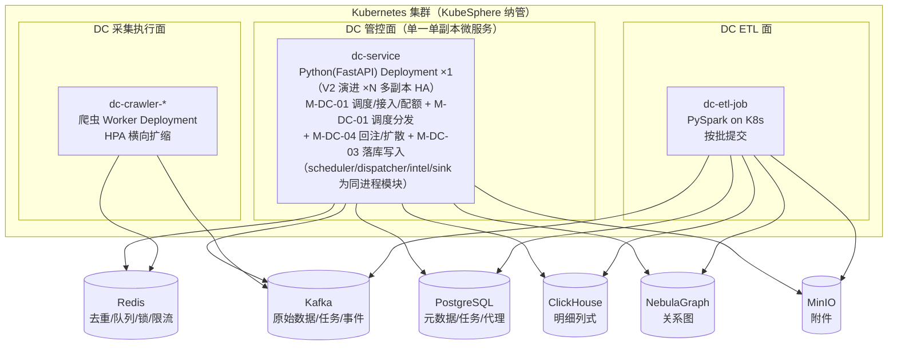
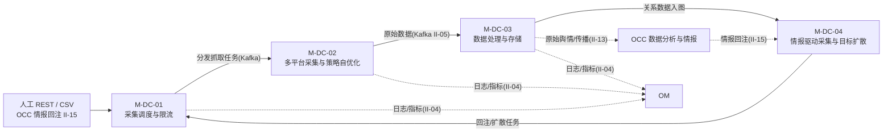
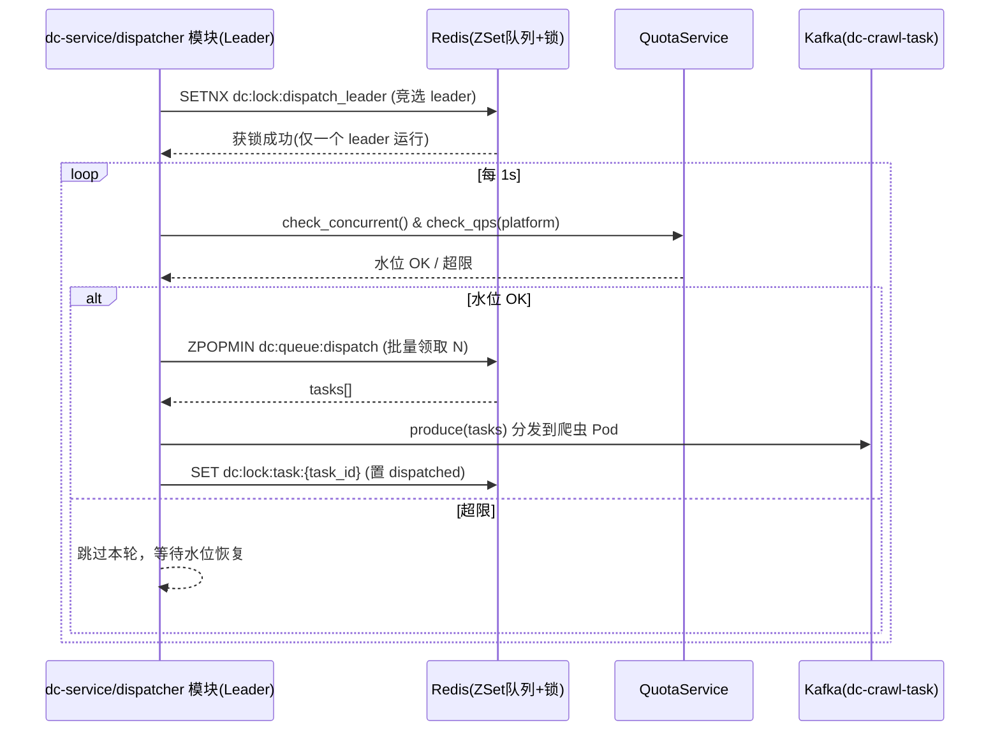
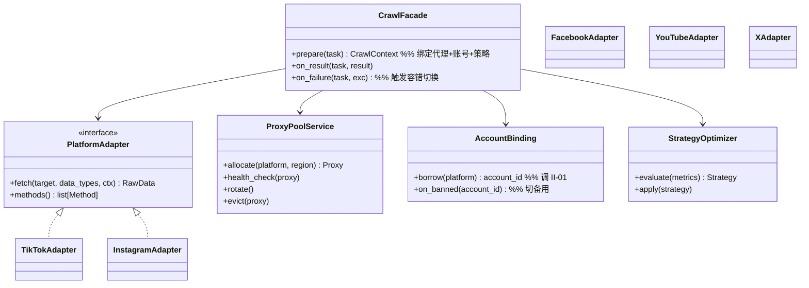
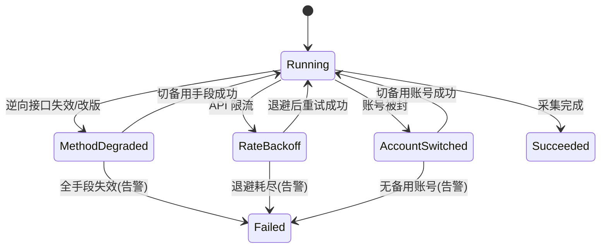
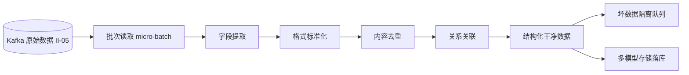
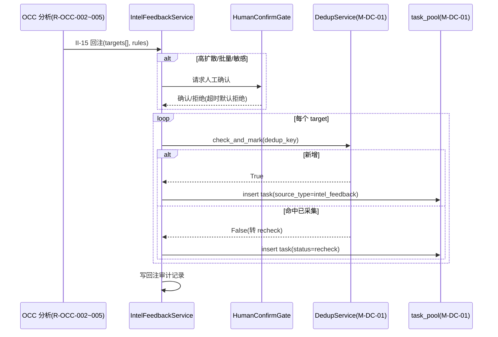

# 软件详细设计说明 - DC 子系统

| 项目 | 内容 |
| --- | --- |
| 项目名称 | 认知作战平台（v1.0） |
| 文档版本 | V1.2 |
| 密级 | 内部使用 |
| 编制 | 石建国 |
| 编制日期 | 2026-07-13 |

---

## 1 引言

### 1.1 标识

本文件为「认知作战平台」（以下简称"系统"或"平台"）数据爬取子系统（DC，软部件标识 M-DC-00）的软件详细设计说明（SDD）。它是《软件需求规格说明》V3.4 功能需求 R-DC-001~008 与《软件概要设计说明》V2.3 模块 M-DC-01~04 的详细设计下沉，描述 DC 子系统各模块的内部结构、类与接口、数据结构、算法、状态机与部署单元，作为编码实现与单元测试的依据。

### 1.2 系统概述

数据爬取子系统（DC）是基础设施层的数据采集与 ETL 处理底座，采用「任务驱动采集」范式：采集任务由人工配置或 OCC 情报回注（经 II-15）注入任务池，爬虫作为执行器消费任务、按目标定向抓取，原始数据经 Kafka 总线流转，由 PySpark ETL 清洗加工后持久化到 ClickHouse（明细）/关系库（元数据索引）/NebulaGraph（关系数据）；加工后数据经 II-13 供 OCC 分析，OCC 分析产出经 II-15 反向回注 DC，形成「OCC 分析→DC 采集」跨子系统情报驱动闭环。

DC 子系统由四个模块组成（对应 8 项功能需求与 13 个功能点）：

| 模块 | 标识 | 对应需求 | 功能点 |
| --- | --- | --- | --- |
| 采集调度与限流 | M-DC-01 | R-DC-003 | F-DC-01-01~04 |
| 多平台数据采集与策略自优化 | M-DC-02 | R-DC-001/002/004 | F-DC-02-01~05 |
| 数据处理与存储 | M-DC-03 | R-DC-005/006 | F-DC-03-01~02 |
| 情报驱动采集与目标扩散 | M-DC-04 | R-DC-007/008 | F-DC-04-01~02 |

### 1.3 文档概述

本文件章节安排如下：第 2 章引用文件；第 3 章总体设计，给出 DC 技术栈、部署单元、模块间调用关系与数据流；第 4 章数据结构设计，给出核心数据模型与存储表结构；第 5 章按模块给出详细设计（类/接口/算法/状态机）；第 6 章接口详细设计；第 7 章错误处理与可靠性设计；第 8 章部署与运维设计。需求追溯以《软件需求跟踪矩阵.xlsx》为唯一权威源，本文件第 9 章仅做概要引用。

### 1.4 术语和缩略语

沿用《软件需求规格说明》第 1.4 节术语与缩略语，本文件补充以下技术术语：

| 术语 | 说明 |
| --- | --- |
| Pod | Kubernetes 中可调度的最小计算单元，DC 爬虫以 Deployment/Pod 形式运行 |
| ZSet | Redis 有序集合，用于优先级调度队列 |
| 令牌桶 | 限流算法，按固定速率向桶中放令牌，请求消耗令牌，桶空则限流 |
| BFS | 广度优先搜索，目标扩散采集的图遍历策略 |
| nGQL | NebulaGraph Query Language，NebulaGraph 图查询语言 |
| CDC | ClickHouse 中物化视图/变更数据捕获机制（本设计用于实时汇总） |
| recheck | 复查类任务，命中已采集目标时触发而非新增采集 |
| 幂等键 | 使重复请求产生相同结果而不重复执行的标识 |

---

## 2 引用文件

| 文件 | 说明 |
| --- | --- |
| 《软件需求规格说明》V3.4 | DC 功能需求 R-DC-001~008、非功能需求、接口（EI-01/02、II-01/04/05/13/15）、数据 DR-06/08、约束 CON-03/05 的直接输入 |
| 《软件概要设计说明》V2.3 | DC 模块划分 M-DC-01~04、§3.7 环境部署、§4.1 DC 模块组成与关键设计 |
| 《软件概要设计-模块功能拆分-v2.xlsx》 | DC 4 模块 13 功能点的权威依据 |
| 《软件需求跟踪矩阵.xlsx》 | DC 需求双向追溯唯一权威源 |

---

## 3 总体设计

### 3.1 技术选型

DC 子系统技术栈遵循《软件需求规格说明》V3.4 运行环境与 CON-03 约束：

| 维度        | 选型                            | 说明                                                     |
| --------- | ----------------------------- | ------------------------------------------------------ |
| 管控面/调度面语言 | **Python 3.11 + FastAPI**     | M-DC-01/02（管控面）/04 用 Python 实现 REST 服务、调度器、限流器、回注与扩散引擎 |
| ETL 引擎    | **PySpark 3.5**               | M-DC-03 分布式批处理清洗（字段提取/标准化/去重/关联），Spark on K8s 提交作业     |
| 采集 Worker | **Python（httpx/playwright）**  | M-DC-02 的平台逆向采集执行器，K8s Pod 编排，经 Kafka 任务/结果总线与管控面解耦    |
| 列式存储      | **ClickHouse**                | 明细数据列式存储（替代 HBase），高压缩比、列式扫描、适合大规模采集明细的 OLAP 查询        |
| 关系库       | **PostgreSQL**                | 元数据、索引、任务主数据、代理池台账、采集配置（OLTP 点查与事务）                    |
| 图库        | **NebulaGraph**               | 关系数据存储，支撑 R-DC-008 BFS 目标扩散与 OCC 关联网络分析                |
| 消息总线      | **Kafka**                     | 原始采集数据流转（II-05）、任务分发、事件总线                              |
| 缓存与调度     | **Redis**                     | 任务去重（目标级去重键）、ZSet 优先级队列、分布式锁、限流计数器/令牌桶                 |
| 对象存储      | **MinIO**                     | 采集附件（图片/视频/原始 HTML 快照）                                 |
| 容器编排      | **Kubernetes（KubeSphere 纳管）** | DC 全部服务 Pod 化部署、爬虫 Deployment 横向扩缩容与节点故障自愈             |

### 3.2 部署单元

DC 子系统在 K8s（KubeSphere 管理）上部署为以下独立可扩缩容的单元，遵循「子系统可独立部署升级」（NR-M-01）：



> 部署形态说明：DC 管控面遵循「一个子系统一个微服务、内部不拆分」原则，合并为 **dc-service** 单一单副本微服务——原 dc-scheduler-api / dc-worker-dispatcher / dc-intel-engine / dc-storage-sink 四个常驻 Python 进程降为 dc-service 内的模块（scheduler / dispatcher / intel / sink），同进程内调用。采集执行面（dc-crawler-*）因 HPA 弹性扩缩、ETL 面（dc-etl-job）因 Spark 运行时形态，保持独立部署单元，不并入微服务。当前版本 dc-service 单副本（NR-R-01/04 为 V2 目标，见 SRS V3.5）；V2 演进多副本 HA 时，dispatcher 模块经 Redis 分布式锁选主避免调度重复，sink 模块按 Kafka 分区 consumer group 分摊写入。

各部署单元职责：

| 部署单元         | 实现                                                            | 对应模块                                                   | 扩缩容                                    |
| ------------ | ------------------------------------------------------------- | ------------------------------------------------------ | -------------------------------------- |
| dc-service   | Python(FastAPI) 单一微服务（scheduler/dispatcher/intel/sink 为同进程模块） | M-DC-01 任务接入/查询/配额/调度分发 + M-DC-04 回注/扩散 + M-DC-03 落库写入 | ×1（V2 演进 ×N 多副本 HA，NR-R-01/04 为 V2 目标） |
| dc-crawler-* | Python 爬虫 Worker（按平台分组）                                       | M-DC-02 采集执行                                           | HPA 按 Kafka lag 横向扩缩                   |
| dc-etl-job   | PySpark 批作业                                                   | M-DC-03 清洗                                             | Spark on K8s 动态分配 executor             |

### 3.3 模块间调用关系



### 3.4 数据流设计

DC 主数据流为「任务池 → 采集 → Kafka → ETL → 多存储」，并存在两条反向/迭代流：

1. **正向采集流**：任务入池（M-DC-01）→ 爬虫执行（M-DC-02）→ Kafka 原始数据 → ETL 清洗（M-DC-03）→ 多存储落库。
2. **情报回注反向流**：OCC 分析产出（R-OCC-002~005）→ II-15 → M-DC-04 → 回注任务入 M-DC-01 任务池。
3. **扩散迭代闭环**：M-DC-04 以已采集目标为起点 BFS 扩散（M-DC-03 的 NebulaGraph 关系数据）→ 新任务入 M-DC-01 → 采集 → ETL → 存储 → 再触发回注/扩散。

---

## 4 数据结构设计

### 4.1 核心数据模型（PostgreSQL）

#### 4.1.1 采集任务表 `crawl_task`（F-DC-01-01 任务池主表）

| 字段                      | 类型           | 说明                                                              |
| ----------------------- | ------------ | --------------------------------------------------------------- |
| task_id                 | UUID PK      | 任务唯一标识                                                          |
| source_type             | ENUM         | `manual`/`csv_import`/`intel_feedback`（回注）/`diffusion`（扩散）      |
| platform                | ENUM         | `tiktok`/`instagram`/`facebook`/`youtube`/`x`                   |
| target_type             | ENUM         | `account`/`keyword`/`url_list`/`hashtag`                        |
| target_value            | TEXT         | 目标值（账号名/关键词/URL 列表 JSON）                                        |
| data_types              | JSONB        | 采集数据类型数组，如 `["profile","posts","reels","interactions"]`         |
| dedup_key               | VARCHAR(128) | 目标级去重键（见 5.1.2），唯一索引                                            |
| priority                | INT          | 优先级（ZSet score，默认 100）                                          |
| status                  | ENUM         | `pending`/`dispatched`/`running`/`succeeded`/`failed`/`recheck` |
| quota_scope             | VARCHAR      | 配额作用域（平台:地区）                                                    |
| account_id              | VARCHAR      | 关联采集账号（引用 MC account_id）                                        |
| proxy_id                | VARCHAR      | 关联代理 IP 标识                                                      |
| source_intel_id         | VARCHAR      | 来源情报标识（source_type=intel_feedback 时）                            |
| retry_count             | INT          | 重试次数                                                            |
| created_at / updated_at | TIMESTAMPTZ  | 时间戳                                                             |

#### 4.1.2 代理 IP 池表 `proxy_pool`（F-DC-02-04）

| 字段             | 类型          | 说明                                         |
| -------------- | ----------- | ------------------------------------------ |
| proxy_id       | VARCHAR PK  | 代理标识                                       |
| ip             | VARCHAR     | 代理 IP                                      |
| port           | INT         | 端口                                         |
| credential_enc | BYTEA       | 加密凭据（NR-S-03，AES-GCM）                      |
| platform       | ENUM        | 绑定平台                                       |
| region         | VARCHAR     | 绑定地区                                       |
| status         | ENUM        | `available`/`in_use`/`unhealthy`/`evicted` |
| last_check_at  | TIMESTAMPTZ | 最后可用性检测时间                                  |
| fail_count     | INT         | 连续失败次数                                     |
| rotated_at     | TIMESTAMPTZ | 最后轮换时间                                     |

#### 4.1.3 采集指标表 `crawl_metric`（F-DC-02-05 策略自优化输入）

| 字段                 | 类型           | 说明                                                           |
| ------------------ | ------------ | ------------------------------------------------------------ |
| metric_id          | BIGSERIAL PK | 指标 ID                                                        |
| platform           | ENUM         | 平台                                                           |
| method             | ENUM         | 采集手段（`reverse_api`/`official_api`/`playwright`/`html_parse`） |
| window_start       | TIMESTAMPTZ  | 统计窗口起点                                                       |
| total_requests     | INT          | 总请求数                                                         |
| success_count      | INT          | 成功数                                                          |
| ban_count          | INT          | 封禁数                                                          |
| block_signal_count | INT          | 反爬信号数                                                        |
| avg_latency_ms     | INT          | 平均延迟                                                         |

### 4.2 去重与调度结构（Redis，在定义，根据实际情况）

| Redis Key 模式                                 | 类型                 | 用途                         |
| -------------------------------------------- | ------------------ | -------------------------- |
| `dc:dedup:{platform}:{target_type}:{digest}` | STRING（NX，TTL 可配）  | 目标级去重键（Q10 决策：去重键=目标×数据类型） |
| `dc:queue:dispatch`                          | ZSET               | 调度优先级队列（score=priority）    |
| `dc:lock:dispatch_leader`                    | STRING（NX，TTL 10s） | 调度器 leader 分布式锁            |
| `dc:lock:task:{task_id}`                     | STRING（NX，TTL 60s） | 任务执行分布式锁                   |
| `dc:quota:global_concurrent`                 | STRING（计数）         | 全局并发计数                     |
| `dc:quota:qps:{platform}`                    | SORTED SET（滑动窗口）   | 单平台 QPS 限流                 |
| `dc:quota:freq:{account_id}` / `{proxy_id}`  | SORTED SET（滑动窗口）   | 单账号/单IP 频率限流               |
| `dc:strategy:current`                        | HASH               | 当前生效策略（手段优先级/频率/并发）        |

### 4.3 明细数据存储（ClickHouse）

#### 4.3.1 采集明细表 `crawl_raw`（F-DC-03-02 明细落库）

按平台分区、按时间排序的 MergeTree，高压缩列式存储：

```sql
CREATE TABLE crawl_raw (
    task_id        UUID,
    platform       LowCardinality(String),
    target_id      String,           -- 平台侧目标 ID（规范化后）
    data_type      LowCardinality(String),  -- profile/posts/reels/...
    fetched_at     DateTime64(3),
    raw_payload    String,           -- 原始 JSON（LZ4 压缩）
    clean_payload  String,           -- ETL 清洗后 JSON
    account_id     String,
    proxy_id       String,
    ingest_batch   String
) ENGINE = MergeTree
PARTITION BY (platform, toYYYYMM(fetched_at))
ORDER BY (platform, target_id, data_type, fetched_at)
TTL fetched_at + INTERVAL 18 MONTH;
```

### 4.4 关系数据存储（NebulaGraph）

#### 4.4.1 图空间与 Tag/Edge（F-DC-03-02 关系落库 / F-DC-04-02 BFS 扩散）

图空间 `dc_relation`，Tag（点）与 Edge（关系类型对齐 R-DC-008）：

- **Tag**：`Account`（platform、target_id、nickname、fetched_at）
- **Edge 类型**（BFS 扩散遍历的关系）：
  - `follows`（关注）
  - `followed_by`（粉丝）
  - `interacts`（互动：点赞/评论）
  - `reposts`（转发链）
  - `comments`（评论链）

---

## 5 模块详细设计

### 5.1 M-DC-01 采集调度与限流模块（R-DC-003）

#### 5.1.1 模块组成与类图

```mermaid
classDiagram
    class TaskIngestService {
        +ingest_rest(tasks) list[task_id]
        +ingest_csv(file) int
        +ingest_intel_callback(payload)  %% 来自 II-15
    }
    class DedupService {
        +compute_key(platform, target_type, target_value, data_types) digest
        +check_and_mark(dedup_key) bool  %% 命中转 recheck
    }
    class QuotaService {
        +check_concurrent() bool
        +check_qps(platform) bool
        +check_freq(account_id, proxy_id) bool
        +acquire(scope) token
        +release(token)
    }
    class DispatchScheduler {
        +run_loop()
        +pop_batch(size) list[task]
        +dispatch_to_kafka(tasks)
    }
    class TaskIngestService ..> DedupService : 入池去重
    class TaskIngestService ..> QuotaService : 配额校验
    class DispatchScheduler ..> QuotaService : 消费并发水位
```

#### 5.1.2 目标级去重算法（F-DC-01-02，Q10 决策：目标×数据类型）

去重键计算与命中处理伪代码（决策 B：去重键 = 目标 × 数据类型，手段走重试/降级而非新维度）：

```python
def compute_dedup_key(platform, target_type, target_value, data_types):
    # 1. 目标规范化：URL 去参数/小写、账号去@/小写、hashtag 去#
    norm = normalize(target_type, target_value)
    # 2. 数据类型集合排序后拼入键（与采集手段无关）
    types_canon = ",".join(sorted(set(data_types)))
    raw = f"{platform}:{target_type}:{norm}:{types_canon}"
    return sha1(raw)  # 作为 dedup_key 与 Redis key digest

def check_and_mark(dedup_key, ttl):
    # 目标级去重：SET NX，首次入池成功，重复命中转 recheck
    ok = redis.set(f"dc:dedup:{dedup_key}", "1", nx=True, ex=ttl)
    return ok  # True=新增可入池；False=命中已采集，调用方置 status=recheck
```

**说明**：手段切换（失效切备选）不另开去重维度，走任务重试路径（retry_count+1、method 降级），与去重解耦。

#### 5.1.3 配额限流设计（F-DC-01-04，Q11 决策：三维配额）

三维配额（决策 A：全局并发 + 单平台 QPS + 单账号/单IP 频率），用 Redis 滑动窗口 + 令牌桶实现：

| 维度         | 实现                 | Redis 机制                                             |
| ---------- | ------------------ | ---------------------------------------------------- |
| 全局并发上限     | 令牌桶（容量=全局并发数）      | `dc:quota:global_concurrent` 计数，acquire/release      |
| 单平台 QPS    | 滑动窗口（每平台每秒上限）      | ZSET `dc:quota:qps:{platform}`，按 timestamp 去除过期成员后计数 |
| 单账号/单IP 频率 | 滑动窗口（每账号/IP 每分钟上限） | ZSET `dc:quota:freq:{account_id}` / `{proxy_id}`     |

调度分发前先三维校验，任一超限则任务留队（不 dispatch），并发水位由账号池/IP 池健康度动态调节（M-DC-02 代理与账号应用反馈水位）。

#### 5.1.4 调度分发流程（F-DC-01-03）



队列积压（ZSet 长度 > 阈值）时经 II-04 上报 OM 告警（R-DC-003 异常场景）。

---

### 5.2 M-DC-02 多平台数据采集与策略自优化模块（R-DC-001/002/004）

#### 5.2.1 模块分层（管控面 + 采集 Worker）

本模块分两层（C/C 决策：Python 管控面 + Python 采集 Worker，经 Kafka 解耦）：

- **管控面（dc-service 内 scheduler / dispatcher 模块）**：采集手段门面、代理与账号应用、容错切换、策略自优化。
- **采集 Worker（dc-crawler Pod）**：按平台分组的逆向采集适配器，消费 Kafka 任务、产出原始数据到 Kafka。



#### 5.2.2 平台采集适配契约（F-DC-02-01）

各平台适配器实现统一接口 `PlatformAdapter`，按平台采用不同手段（对接 EI-01）：

| 平台 | 采集手段 | 采集数据 |
| --- | --- | --- |
| Instagram | 逆向采集 | 推荐、人物资料、Reels |
| TikTok | 逆向采集 | 用户、内容、互动 |
| Facebook | 逆向采集 | 用户、页面、互动 |
| YouTube | 官方 API / 逆向 | 频道、视频、评论 |
| X | 逆向采集 | 用户、推文、互动 |

适配器输入为 `(target, data_types, CrawlContext)`，输出 `RawData`（经 Kafka II-05 流转）。各平台逆向详细接口规格随研发进展补充（SRS 附录待补事项）。

#### 5.2.3 容错切换状态机（F-DC-02-02）

采集异常按交互点分类应对（对齐 SRS 第④步异常表）：



- **手段降级**：`reverse_api` → `playwright` → `html_parse`（按平台可用手段链）。
- **限流退避**：指数退避（base 2s，max 60s，抖动 ±20%），按限额重试。
- **账号切换**：调 II-01 取备用 account_id；被封账号经 II-01a 事件总线广播 account.status.changed，全网即时失效。

#### 5.2.4 代理 IP 池管理（F-DC-02-04，R-DC-002）

`ProxyPoolService` 管理代理池全生命周期（对接 EI-02 VPS 链路）：

| 能力       | 说明                                                            |
| -------- | ------------------------------------------------------------- |
| 按平台与地区分配 | 对接 VPS 链路，按 platform × region 从 `proxy_pool` 取 `available` 代理 |
| 定时轮换     | 定时任务（Cron，周期可配）轮换在用代理，降低单 IP 被风控概率                            |
| 可用性检测    | 周期性探活（HTTP 探针 + 目标平台连通性），更新 `last_check_at` 与 `status`        |
| 失效剔除     | 连续失败 `fail_count` 超阈值则置 `evicted` 并补充新代理                      |
| 全失效告警    | 某 platform×region 全部 `unhealthy/evicted` 时告警并暂停受影响采集任务        |

#### 5.2.5 采集策略自适应优化（F-DC-02-05，R-DC-004）

`StrategyOptimizer` 基于历史采集指标（`crawl_metric` 表：封禁率/成功率/反爬信号/各手段有效率）主动调整策略，区别于被动容错：

```python
def evaluate(metrics_window):
    ban_rate = sum(ban) / sum(total)
    success_rate = sum(success) / sum(total)
    # 指标不足或波动过大防抖动（R-DC-004 稳定保障）
    if sample_too_small(metrics_window) or variance_too_high(metrics_window):
        alert(II_04, "策略指标不足/波动，维持稳定策略")
        return current_strategy  # 维持上一稳定策略
    new_strategy = Strategy(
        method_priority=rank_by_effectiveness(metrics_window),
        qps_limit=adjust_qps(success_rate, ban_rate),
        concurrency=adjust_concurrency(watermark),
    )
    return new_strategy

def apply(strategy):
    redis.hset("dc:strategy:current", mapping=strategy.as_dict())
    # 下发后 CrawlFacade.prepare 读取最新策略
```

策略经 II-04 上报 OM 记录调整决策与效果对比。

---

### 5.3 M-DC-03 数据处理与存储模块（R-DC-005/006）

#### 5.3.1 ETL 流水线（F-DC-03-01）

PySpark 批作业（Spark on K8s）消费 Kafka 原始数据，五步清洗：



清洗步骤伪代码（PySpark）：

```python
def run_etl(spark, kafka_batch):
    df = spark.read.format("kafka").option("subscribe","dc-raw").load()
    raw = df.selectExpr("CAST(value AS STRING) as json").select(from_json("json", schema).alias("r")).select("r.*")
    # 1. 字段提取：从各平台异构 payload 抽取标准字段
    extracted = raw.transform(extract_standard_fields())
    # 2. 格式标准化：时间戳统一UTC、ID规范化、文本清洗
    standardized = extracted.transform(standardize())
    # 3. 内容去重：按 (platform,target_id,data_type,content_digest) 去重
    deduped = standardized.dropDuplicates(["platform","target_id","data_type","content_digest"])
    # 4. 关系关联：抽取 follow/interact/repost/comment 边
    relations = standardized.transform(extract_relations())
    # 坏数据隔离：解析失败/字段缺失的记录
    bad = raw.filter("r IS NULL OR r.platform IS NULL")
    return deduped, relations, bad
```

**可靠性**：计算节点失败时 Spark 任务自动重试或转移（task retry / speculative）；坏数据进入隔离队列并记录（对齐 R-DC-005 异常场景）。

#### 5.3.2 多模型持久化存储（F-DC-03-02）

清洗后数据按特征分流落库（对齐 R-DC-006，存储选型见 §3.1）：

| 数据特征 | 目标存储 | 写入方式 |
| --- | --- | --- |
| 明细数据（用户/内容/互动原始+清洗） | ClickHouse `crawl_raw` | 批量 INSERT（MergeTree，高压缩列式） |
| 元数据与索引（target_id↔平台ID映射、采集批次索引） | PostgreSQL | 事务 INSERT/UPSERT |
| 关系数据（关注/粉丝/互动/转发/评论边） | NebulaGraph `dc_relation` | nGQL INSERT VERTEX/EDGE |
| 附件（图片/视频/HTML 快照） | MinIO | 对象上传 + 路径回写 PG |

**写入失败处理**：ClickHouse/PG 写入失败时数据进入重试队列（Kafka `dc-storage-retry` topic），由 dc-service 的 sink 模块重试；NebulaGraph 写入失败同样重试（对齐 R-DC-006 异常场景与 NR-F-04 死信处理）。

---

### 5.4 M-DC-04 情报驱动采集与目标扩散模块（R-DC-007/008）

#### 5.4.1 情报回注采集（F-DC-04-01，R-DC-007）

`IntelFeedbackService` 接收 OCC 分析产出（经 II-15），生成回注任务回注 M-DC-01 任务池：



**业务规则**（对齐 R-DC-005 业务规则表）：
- 自动/人工确认：按回注规则（`rules.auto`）决定是否经人工闸门。
- 人工确认闸门：高扩散层数、大规模批量、敏感目标回注须经分析员确认；超时默认不入池并记录。
- 可审计标识：回注任务携带 `source_type=intel_feedback` 与 `source_intel_id`。
- 目标级去重：复用 M-DC-01 同一去重约束，命中已采集转 recheck（不重复采集）。

#### 5.4.2 目标扩散采集（F-DC-04-02，R-DC-008）

`DiffusionEngine` 以已采集目标为起点，按关系类型与层数 BFS 图扩展式采集（遍历 NebulaGraph）：

```python
def bfs_diffusion(seed_target, relation_types, max_depth, max_nodes_per_layer, max_total):
    visited = {seed_target}          # 去重集合
    frontier = [seed_target]
    total_new = 0
    for depth in range(1, max_depth + 1):
        if total_new >= max_total:
            alert("扩散达总目标上限，停止"); break
        # 从 NebulaGraph 取当前层节点的邻居边（按 relation_types）
        neighbors = nebula.fetch_neighbors(frontier, relation_types, limit=max_nodes_per_layer)
        new_nodes = [n for n in neighbors if n not in visited]
        new_nodes = new_nodes[: max(0, max_total - total_new)]  # 总数上限
        # 新节点经去重生成采集任务回注 M-DC-01
        for n in new_nodes:
            task = build_diffusion_task(n, source_type="diffusion", depth=depth)
            dispatch_to_pool(task)   # 受 R-DC-003 配额约束
        visited.update(new_nodes)
        frontier = new_nodes
        total_new += len(new_nodes)
        if not new_nodes:
            break  # 无新节点，自然终止
    write_diffusion_audit(seed_target, depth, total_new)
```

**可控终止**（对齐 R-DC-008 业务规则）：
- 层数上限 `max_depth`、单层节点数 `max_nodes_per_layer`、总目标数 `max_total` 三重上限。
- 去重命中率阈值：连续多层无新节点或命中率低于阈值时停止并告警。
- 人工停止：分析员可随时停止扩散任务。
- 配额约束：扩散任务受 R-DC-003 配额限流约束（不超配额）。

**迭代闭环**：扩散采集的新目标经 M-DC-03 加工存储后，OCC 再次分析（R-OCC-002~005）→ 经 II-15 再次回注 → 进一步扩散，形成迭代。

**异常**：扩散关系数据缺失/不完整时降级为已采集层的部分结果；层数/目标数超限自动停止并告警（对齐 R-DC-008 异常场景）。

---

## 6 接口详细设计

### 6.1 外部接口（DC 侧实现）

#### 6.1.1 EI-01 社交平台交互（采集侧）

DC 经 `PlatformAdapter` 对接 TikTok/IG/FB/YouTube/X。各平台采集请求/响应契约见 §5.2.2，详细逆向接口规格随研发补充。

#### 6.1.2 EI-02 代理 IP 服务

`ProxyPoolService` 对接 VPS 代理链路供应商：

- 输入：代理分配请求（platform、region、quantity）。
- 输出：可用代理 IP 列表、可用性状态、轮换日志。

### 6.2 内部接口（DC 侧实现/消费）

#### 6.2.1 II-01 账号服务（DC 为消费方）

DC 调 MC 取采集账号（`account_id` → 凭据），并订阅 II-01a `account.status.changed` 事件切换被封账号。DC 仅引用 account_id，不复制账号主数据（CON-11 权威源唯一）。

#### 6.2.2 II-04 日志与指标上报

DC 各模块向 OM 上报：调度器日志、采集成功率/封禁率/吞吐量指标、队列积压、代理健康度、策略调整记录。

#### 6.2.3 II-05 Kafka 总线（DC 内部）

| Topic | 方向 | 内容 |
| --- | --- | --- |
| `dc-crawl-task` | M-DC-01 → M-DC-02 | 分发的采集任务 |
| `dc-raw` | M-DC-02 → M-DC-03 | 原始采集数据（II-05 核心） |
| `dc-storage-retry` | M-DC-03 内部 | 落库失败重试 |
| `dc-intel-feedback` | II-15 → M-DC-04 | OCC 情报回注 |

#### 6.2.4 II-13 分析数据与情报（DC 为提供方）

DC 经 REST 向 OCC 提供采集与 ETL 加工后的原始舆情/传播/关系数据（ClickHouse 明细查询 + NebulaGraph 关系导出）。

#### 6.2.5 II-15 情报回注采集接口（DC 为消费方）

`IntelFeedbackService` 暴露回注回调，接收 OCC 分析产出：

```json
{
  "intel_id": "intel_2026_001",
  "targets": [
    {"platform": "tiktok", "target_type": "account", "target_value": "@user1",
     "data_types": ["profile","posts"], "relation_hint": ["follows","interacts"]}
  ],
  "rules": {"auto": false, "priority": 200, "confirm_required": true},
  "diffusion": {"enabled": true, "relation_types": ["follows","interacts"],
                "max_depth": 3, "max_nodes_per_layer": 50, "max_total": 500}
}
```

---

## 7 错误处理与可靠性设计

### 7.1 重试与熔断（NR-R-02 / NR-F-01/04）

| 故障点 | 处理 |
| --- | --- |
| 采集异常（接口失效/限流/被封） | §5.2.3 容错切换状态机，手段降级/退避/换账号 |
| 任务异常 | retry_count 上限后置 failed，自动熔断停止后续（NR-F-01） |
| ETL 节点失败 | Spark 任务自动重试/转移（speculative） |
| 存储写入失败 | 进入 `dc-storage-retry` 重试队列，耗尽转死信（NR-F-04） |
| 代理全部失效 | 告警并暂停受影响采集任务（R-DC-002 异常） |
| 回注人工确认超时 | 默认不入池并记录（R-DC-007 异常） |

### 7.2 数据采集补偿与断点续采（NR-R-05）

任务 status 回 `pending` 回池重排，爬虫 Pod 重启后续跑（已 dispatched 未完成的任务经任务锁超时回收）。

### 7.3 幂等性

- 采集任务以 `dedup_key` 幂等（重复入池被去重）。
- ETL 以 `(platform,target_id,data_type,content_digest)` 幂等（dropDuplicates）。
- 落库以 UPSERT/INSERT...ON CONFLICT 幂等（PG）、ClickHouse ReplacingMergeTree 去重。

---

## 8 部署与运维设计

### 8.1 K8s 部署架构（KubeSphere 纳管）

#### 8.1.1 部署架构图

DC 子系统部署于一个 Kubernetes 集群，由 KubeSphere 作为统一容器管理平台（PaaS）纳管，按职责划分命名空间与节点池，存储组件以独立命名空间或专用节点部署，采集出口经 VPS 代理链路访问海外社交平台。

```mermaid
flowchart TB
    subgraph KS["KubeSphere 管理面（PaaS）"]
        KSUI["多集群/多租户控制台<br/>应用负载 / 监控告警 / 扩缩容 / 灰度 / 日志"]
    end

    subgraph K8S["Kubernetes 集群"]
        KS -.纳管.-> K8S

        subgraph NS_APP["Namespace: dc-app（DC 计算服务）"]
            direction TB
            subgraph CTRL["管控面（单一单副本微服务，V2 演进多副本 NR-R-04）"]
                SCHED["dc-service<br/>Python(FastAPI) Deployment ×1<br/>（V2 演进 ×N 多副本 HA）<br/>scheduler/dispatcher/intel/sink 同进程模块<br/>M-DC-01 接入/配额/调度 + M-DC-04 回注扩散 + M-DC-03 落库"]
            end
            subgraph EXEC["采集执行面（弹性扩缩）"]
                CRAWL["dc-crawler-tiktok / ig / fb / yt / x<br/>Deployment + HPA<br/>M-DC-02 平台采集 Worker"]
            end
            subgraph ETL_SINK["ETL 面"]
                ETLJ["dc-etl-job<br/>Spark on K8s（动态 executor）<br/>M-DC-03 清洗"]
            end
        end

        subgraph NS_DATA["Namespace: dc-data（数据组件）"]
            PG[("PostgreSQL<br/>StatefulSet + PVC<br/>元数据/任务/代理/指标")]
            RD[("Redis<br/>StatefulSet 哨兵<br/>去重/队列/锁/限流")]
            KF[("Kafka<br/>StatefulSet / 或外置<br/>原始数据/任务/事件")]
            CH[("ClickHouse<br/>StatefulSet 分片副本<br/>明细列式")]
            NG[("NebulaGraph<br/>graphd+metad+storaged<br/>关系图")]
            MN[("MinIO<br/>StatefulSet + PVC<br/>采集附件")]
        end

        subgraph NS_OBS["Namespace: dc-obs（可观测 Agent）"]
            PROM["Prometheus / Grafana"]
            LOGA["日志采集 Agent<br/>→ OM (ELK/Loki)"]
        end

        subgraph NP["节点池（NodePool）"]
            N1["管控节点池<br/>dc-service（scheduler/dispatcher/intel/sink）"]
            N2["采集节点池<br/>dc-crawler-*（按 lag 扩缩）"]
            N3["计算节点池<br/>Spark executor"]
            N4["数据节点池<br/>PG/CH/NG/MN（本地盘）"]
        end
        CTRL --> N1
        EXEC --> N2
        ETL_SINK --> N3
        NS_DATA --> N4
    end

    subgraph EXT_OUT["外部出口与平台"]
        VPS["VPS 代理链路<br/>(EI-02)"]
        SOC["海外社交平台<br/>TikTok/IG/FB/YT/X<br/>(EI-01)"]
    end

    subgraph EXT_DEP["跨子系统依赖"]
        MC["MC 账号服务 (II-01)<br/>account_id 凭据/事件"]
        OCC["OCC 数据分析与情报<br/>II-13(出) / II-15(入)"]
        OM["OM 运维监控 (II-04)<br/>日志/指标汇聚"]
    end

    SCHED --> RD & KF & PG & CH & NG & MN
    CRAWL --> KF & RD
    CRAWL -->|"经代理采集"| VPS --> SOC
    CRAWL -.->|"取账号 (II-01)"| MC
    ETLJ --> KF & CH & PG & NG & MN
    SCHED -.->|"情报回注 (II-15)"| OCC
    ETL_SINK -.->|"原始数据 (II-13)"| OCC
    SCHED & CRAWL & ETL_SINK -.->|"日志/指标 (II-04)"| OM
    PROM & LOGA -.->|"上报"| OM
```

#### 8.1.2 命名空间与节点池

| 命名空间 | 内容 | 节点池 | 调度策略 |
| --- | --- | --- | --- |
| `dc-app` | DC 计算服务（管控面/采集执行面/ETL 落库面） | 管控/采集/计算节点池 | 按 nodeSelector + 资源 request 分配 |
| `dc-data` | PG/Redis/Kafka/ClickHouse/NebulaGraph/MinIO | 数据节点池（本地盘） | 数据组件亲和本地存储，避免跨节点 IO |
| `dc-obs` | Prometheus/Grafana、日志采集 Agent | 与被采集节点共存 | DaemonSet 日志采集 |

节点池按工作负载特征隔离：管控节点池求稳（低弹性）、采集节点池求弹性（HPA 按 Kafka lag 扩缩，对齐 NR-P-03）、计算节点池按 Spark 作业峰值分配（动态 executor）、数据节点池求 IO（本地盘 + PVC）。

#### 8.1.3 部署单元规格与高可用

| 部署单元                 | 工作负载                               | 副本/规格       | 高可用机制                           | 对应模块     |
| -------------------- | ---------------------------------- | ----------- | ------------------------------- | -------- |
| dc-service           | Deployment                         | ×1（V2 演进 ×N）          | 当前单副本；V2 多副本 HA，dispatcher 模块经 Redis 分布式锁选主避免调度重复，sink 模块按 Kafka 分区 consumer group 分摊写入（NR-R-01/04 为 V2 目标） | M-DC-01/03/04  |
| dc-crawler-*         | Deployment + HPA                   | 按 lag 2~50  | HPA 横向扩缩，Pod 故障自愈               | M-DC-02  |
| dc-etl-job           | SparkApplication（Spark on K8s）     | 动态 executor | 任务级重试/speculative，坏数据隔离         | M-DC-03  |
| PostgreSQL           | StatefulSet + PVC                  | 主从          | 主从复制 + 定期备份（NR-C-04）            | 元数据      |
| Redis                | StatefulSet + 哨兵                   | 主+哨兵        | 哨兵自动故障转移                        | 去重/调度/限流 |
| Kafka                | StatefulSet / 外置                   | 分区多副本       | 分区副本保证可回溯消费（II-05）              | 总线       |
| ClickHouse           | StatefulSet                        | 分片+副本       | 分布式表 + 副本容错                     | 明细列式     |
| NebulaGraph          | StatefulSet（graphd/metad/storaged） | 多副本         | metad/storaged 副本               | 关系图      |
| MinIO                | StatefulSet + PVC                  | 分布式         | 纠删码冗余                           | 附件       |

#### 8.1.4 网络与出口

- **集群内**：命名空间间经 K8s Service（ClusterIP）互通，DC 服务经 Service 名互访；Kafka topic 为内部总线（II-05）。
- **采集出口**：`dc-crawler-*` Pod 经 VPS 代理链路（EI-02）访问海外社交平台（EI-01），代理由 M-DC-02 代理池按 platform×region 分配，一终端/Profile 一 IP（CON-13 精神在采集侧体现为按任务绑定代理）。
- **跨子系统**：经 Service/Ingress 调用 MC（II-01 取账号）、OCC（II-13 出 / II-15 入）；日志指标经 II-04 上报 OM。
- **安全**：全部 API 经 COM 鉴权（NR-S-01），传输 HTTPS/TLS（NR-S-02），代理凭据加密存储（NR-S-03）。

#### 8.1.5 扩缩容与自愈

- 采集 Worker `dc-crawler-*` 配 HPA：按 Kafka `dc-crawl-task` consumer lag 阈值自动扩缩（lag>阈值扩、idle 缩），节点故障由 K8s 自动重调度自愈（NR-P-03）。
- 管控面当前版本单副本（NR-R-01/04 为 V2 目标，见 SRS V3.5）；V2 演进多副本保证无单点，dispatcher leader 故障由哨兵/锁超时切换备节点。
- Spark executor 动态分配，按批次规模弹性；作业失败自动重试/转移。
- KubeSphere 提供可视化扩缩容、灰度发布与告警闭环（NR-M-04）。

### 8.2 配置化（NR-M-02）

采集、调度、频率、代理、扩散上限等关键策略存于 PG 配置表 + Redis `dc:strategy:current`，运行时热加载，无需改代码。

### 8.3 可观测（NR-M-03/04）

全链路日志经 II-04 上报 OM（ELK/Loki），指标经 Prometheus 采集（爬虫吞吐量/队列积压/成功率/封禁率/代理健康度），trace 贯穿 task_id。

---

## 9 需求追溯（概要引用）

DC 子系统需求双向追溯的明细以《软件需求跟踪矩阵.xlsx》（RTM，GJB 438C）为唯一权威源。本文件设计对需求的覆盖概要如下：

| 需求 | 模块/功能点 | 设计章节 |
| --- | --- | --- |
| R-DC-001 多平台数据采集 | M-DC-02 / F-DC-02-01~03 | §5.2.1~5.2.3 |
| R-DC-002 代理 IP 池管理 | M-DC-02 / F-DC-02-04 | §5.2.4 |
| R-DC-003 采集任务调度与限流 | M-DC-01 / F-DC-01-01~04 | §5.1 |
| R-DC-004 采集策略自适应优化 | M-DC-02 / F-DC-02-05 | §5.2.5 |
| R-DC-005 数据清洗加工 | M-DC-03 / F-DC-03-01 | §5.3.1 |
| R-DC-006 多模型持久化存储 | M-DC-03 / F-DC-03-02 | §5.3.2 |
| R-DC-007 情报回注采集 | M-DC-04 / F-DC-04-01 | §5.4.1 |
| R-DC-008 目标扩散采集 | M-DC-04 / F-DC-04-02 | §5.4.2 |

非功能需求覆盖：NR-P-03（§8.1 HPA 扩缩）、NR-P-04（§5.1.4 调度 ≤2s）、NR-R-02/05（§7.1/7.2）、NR-M-02/03/04（§8.2/8.3）、NR-F-01/04（§7.1）。约束覆盖：CON-03（§3.1 技术选型）、CON-05（§5.2 海外平台代理）。

---

## 10 待后续补充事项

1. 各目标平台（TikTok/IG/FB/YouTube/X）逆向采集的详细接口规格、签名算法与字段映射，随研发进展补充（SRS 附录待补事项二）。
2. ClickHouse 分区/TTL 策略与冷热数据分层，待数据量预估后细化。
3. NebulaGraph 图空间 partition 数与索引，待关系数据规模评估后细化。
4. 策略自优化的具体阈值（封禁率/波动判定门槛），待线上指标基线建立后标定。
5. 扩散采集有效性抽检的样本量与门槛（R-DC-008 验收 80%/20%），待业务侧确认。
