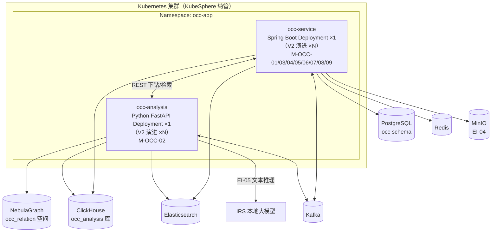
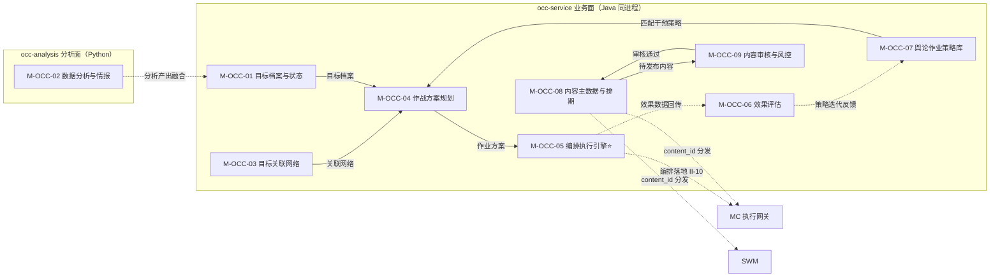

# 软件详细设计说明 - OCC 子系统

| 项目 | 内容 |
| --- | --- |
| 项目名称 | 认知作战平台（v1.0） |
| 文档版本 | V1.0 |
| 密级 | 内部使用 |
| 编制 | 石建国 |
| 编制日期 | 2026-07-15 |

---

## 1 引言

### 1.1 标识

本文件为「认知作战平台」（以下简称"系统"或"平台"）舆情作战业务子系统（OCC，软部件标识 M-OCC-00）的软件详细设计说明（SDD）。它是《软件需求规格说明》V3.7 功能需求 R-OCC-001 ~ R-OCC-009（共 9 项）与《软件概要设计说明》V2.6 模块 M-OCC-01 ~ M-OCC-09（共 9 模块 / 31 功能点）的详细设计下沉，描述 OCC 子系统各模块的内部结构、类与接口、数据结构、算法、状态机与部署单元，作为编码实现与单元测试的依据。

### 1.2 系统概述

舆情作战业务子系统（OCC）是系统的**作战指挥大脑与内容资源权威源**，构建「目标识别 → 数据分析与情报 → 作战编排 → 效果评估」作战闭环，并承担内容资源的统一管理（作为内容主数据唯一权威源，CON-11）。基于 DC 采集的原始舆情 / 传播数据（经 II-13）与 IRS 推理能力，在本子系统内完成数据分析与情报研判（V3.3 起由 DC 移入）。

OCC 承担四类职责：

1. **情报研判**：对 DC 采集与 ETL 加工的数据（经 II-13）分析，提供群体到个体下钻筛选（自研规则树 + 轻量评分模型）、关系图谱与图查询、实体检索与全维度档案、文本智能分析（调 IRS 文本模型 EI-05，不可用回退关键词）。分析产出供目标识别融合，并经 II-15 反向驱动 DC 情报回注（R-DC-007）。
2. **作战指挥**：识别舆情事件目标要素并建档为数据对象（目标档案 / 状态生命周期 / 多维信息融合 / 变更事件）；根据目标档案的干预切入点匹配策略、生成作业方案；以 Flowable BPMN 将作业方案编排为执行流程（DAG），逐节点下发 MC 统一执行网关落地（CON-07 动作收口），OCC 持编排图状态、可中途改编排或转人工。
3. **效果闭环**：基于 DC 舆情差值与 MC 作业执行数据（不重复采集，经 occ_analysis 分析仓聚合）完成单轮成效统计、舆论走势修正、策略迭代反馈、作业复盘与中短期 / 长期效果评估，反馈策略库迭代优化。
4. **内容资源权威源**：唯一维护内容主数据（素材入库 / 分类 / 审核 / 发布排期），向 SWM / MC 主动分发 `content_id`；使用方只维护平台适配版本等扩展数据并引用标识，变更经 `content.changed`（II-12a）事件通知（CON-11 权威源唯一）。

OCC 采用「**一 Java 业务微服务（occ-service）+ 一 Python 分析面（occ-analysis）**」双边界形态：

- **occ-service**：Java / Spring Boot 单一微服务，承载 M-OCC-01 / 03 / 04 / 05 / 06 / 07 / 08 / 09 八个业务模块（同进程 Java 包划分，遵循全平台"一子系统一微服务、内部不拆分"原则，与 OM / COM 一致）。承担目标档案、关联网络、方案规划、编排执行引擎、效果评估、策略库、内容主数据与审核等全部业务逻辑。
- **occ-analysis**：Python 服务，承载 M-OCC-02 数据分析与情报（V3.3 由 DC 移入，与其母体 DC 同属 Python 采集 / 分析域）。承担群体下钻（规则树 + sklearn 评分模型）、关系图谱与图查询编排、实体检索与档案装配、文本智能分析（调 IRS）。与 occ-service 经 REST（下钻 / 检索请求）与 Kafka（II-13 流入 / II-15 回注）解耦。

> 拆分依据：统一技术栈原则第 7 条「管控 / 业务微服务统一用 Java；数据采集与分析用 Python」。M-OCC-02 带硬指标（召回率 ≥ 70%、准确率 ≥ 80%、F1 ≥ 0.75）与 ML 设施（sklearn），属分析域而非业务管控域，故 Python 单独承载，与 MC（mc-service + agent-runtime + mc-sfu）、SWM（coze-loop + Java 主服务）异构先例一致。

OCC 子系统由 9 个模块组成（共 31 功能点）：

| 模块 | 标识 | 对应需求 | 功能点数 | 承载 |
| --- | --- | --- | --- | --- |
| 目标档案与状态管理 | M-OCC-01 | R-OCC-001 | 5 | occ-service |
| 数据分析与情报 | M-OCC-02 | R-OCC-002~005 | 4 | occ-analysis |
| 目标关联网络 | M-OCC-03 | R-OCC-001 | 2 | occ-service |
| 作战方案规划 | M-OCC-04 | R-OCC-006 | 2 | occ-service |
| 编排执行引擎 | M-OCC-05 | R-OCC-006 | 3 | occ-service |
| 效果评估 | M-OCC-06 | R-OCC-007 | 5 | occ-service |
| 舆论作业策略库 | M-OCC-07 | R-OCC-008 | 4 | occ-service |
| 内容主数据与排期（权威源） | M-OCC-08 | R-OCC-009 | 4 | occ-service |
| 内容审核与敏感词风控 | M-OCC-09 | R-OCC-009 | 2 | occ-service |

### 1.3 文档概述

本文件章节安排如下：第 2 章引用文件；第 3 章总体设计，给出 OCC 技术栈、部署单元、模块间调用关系与数据流；第 4 章数据结构设计，给出核心数据模型与存储表结构（PostgreSQL `occ` schema、ClickHouse `occ_analysis` 库、NebulaGraph `occ_relation` 空间、Redis、Kafka）；第 5 章按部署承载分两域（occ-service 业务面 / occ-analysis 分析面）给出各模块详细设计（类 / 接口 / 算法 / 状态机）；第 6 章接口详细设计；第 7 章错误处理与可靠性设计；第 8 章部署与运维设计；第 9 章需求追溯（概要引用）；第 10 章待后续补充事项。

### 1.4 术语和缩略语

沿用《软件需求规格说明》第 1.4 节术语与缩略语，本文件补充以下技术术语：

| 术语 | 说明 |
| --- | --- |
| 作战闭环 | 「目标识别 → 数据分析与情报 → 作战编排 → 效果评估 → 策略迭代」的循环链路，OCC 是其指挥大脑 |
| 目标档案 | 识别出的舆情事件目标要素建档为一条数据对象（含事件主体、传播源头、核心争议点、干预目标、传播线索、多维画像、切入点与薄弱点），赋予全局唯一 `target_id` |
| 目标状态生命周期 | 目标数据的五态流转：待核实 / 已确认 / 已锁定 / 已处置 / 已归档 |
| 编排流程（图） | 作战作业方案编排成的 DAG，节点为 MC 智能体节点（来源 R-MC-014）与自动化脚本节点，按内容 / 账号 / 时间 / 节奏组织前后序、并行与分支关系 |
| 逐步驱动 | II-10 交互模式：OCC 持编排图状态，调度器按拓扑序逐节点下发 MC 网关 → MC 执行回传 → OCC 推进状态机选下一节点；OCC 可中途改编排或转人工 |
| 评分模型 | M-OCC-02 群体下钻中，对分层规则树过滤后的候选个体用 scikit-learn 轻量分类器（如逻辑回归）打分排序，召回率 / 准确率由 occ-analysis 自控可测 |
| occ_analysis | OCC 独立 ClickHouse 库（复用集群），存经 II-13 抽取的 DC 舆情明细与 MC 作业成效，供效果评估 OLAP 聚合（不重复采集） |
| occ_relation | OCC 独立 NebulaGraph 图空间，存目标关联网络；DC 采集关系数据经 II-13 导入为原料 |
| 权威源 | 平台级主数据的唯一维护方，使用方仅引用标识不复制主数据（CON-11）；账号主数据由 MC 唯一维护，内容主数据由 OCC 唯一维护 |
| 抓手 | 干预切入点与传播薄弱点的统称（本期自动挖掘暂不实现，由人工录入融合进目标档案） |

---

## 2 引用文件

| 文件 | 说明 |
| --- | --- |
| 《软件需求规格说明》V3.7 | OCC 功能需求 R-OCC-001 ~ R-OCC-009、非功能需求、外部接口 EI-04/05、内部接口 II-01/01a/10/12/12a/13/15/18 的直接输入 |
| 《软件概要设计说明》V2.6 | OCC 模块划分 M-OCC-01 ~ M-OCC-09（§4.7）、§5 接口设计、§6 数据清单（DR-03M 内容主数据 / 03E 扩展数据 / 11 舆情作战数据归 OCC）、约束 CON-04/06/07/11/13 |
| 《软件概要设计-架构图.md》V1.4 | OCC 模块架构图与模块内功能架构图（§4），31 功能点权威依据 |
| 《软件概要设计-模块功能拆分-v2.xlsx》 | OCC 9 模块 31 功能点的权威依据 |
| 《软件需求跟踪矩阵.xlsx》 | OCC 需求双向追溯唯一权威源 |
| 《软件详细设计说明-MC子系统.md》V1.0 | II-10 作战编排下发与效果回传对端契约（MC 侧 R-MC-005 执行网关收口）、`mc_analysis` 独立库模式参照、动作收口（CON-07）对端实现 |
| 《软件详细设计说明-DC子系统.md》V1.2 | II-13 / II-15 数据契约（DC 侧 ClickHouse `crawl_raw` + NebulaGraph `dc_relation` 经 REST 供 OCC）、复用 PostgreSQL/Redis/Kafka/ClickHouse/MinIO 实例约定 |
| 《软件详细设计说明-SWM子系统.md》V1.0 | II-12 内容服务调用方（SWM 养号文案）、II-18 用户画像对端（SWM R-SWM-005 提示词自动生成）、coze-loop 异构集成模式参照 |
| 《软件详细设计说明-OM子系统.md》V1.0 | II-04 日志上报 OM、Java/Spring Boot 同栈微服务形态与四段式模块设计模式参照 |
| 《软件详细设计说明-COM子系统.md》V1.0 | com-auth-lib 本地验签 + org_id 注入鉴权约定参照 |

---

## 3 总体设计

### 3.1 技术选型

OCC 子系统技术栈遵循全平台「**管控 / 业务微服务统一 Java（Spring Boot）；数据采集与分析用 Python；两者经 Kafka/REST 解耦**」原则。occ-service 为 Java / Spring Boot 栈（与 OM / COM / MC mc-service 一致）；occ-analysis 为 Python 栈（与 DC / 其母体一致）。

| 维度 | 选型 | 说明 |
| --- | --- | --- |
| 业务微服务语言 / 框架 | **Java 17 + Spring Boot 3.x** | occ-service 单一微服务，M-OCC-01/03/04/05/06/07/08/09 八模块同进程 Java 包；Spring Security + com-auth-lib 鉴权 |
| 分析面语言 / 框架 | **Python 3.11 + FastAPI** | occ-analysis 单一服务，承载 M-OCC-02；scikit-learn 评分模型、Nebula-Python 图客户端 |
| 工作流引擎 | **Flowable（嵌入式 BPMN）** | M-OCC-05 编排执行引擎，BPMN 流程定义建模 DAG，获成熟状态机 / 网关 / 回退 / 超时；适配层落地 MC 网关 |
| 全文检索 | **Elasticsearch** | M-OCC-02 实体检索（按账号 / 昵称 / 标识检索），检索超时降级返回部分结果 |
| 微服务治理 | **KubeSphere 微服务治理**（Spring Cloud Kubernetes） | 服务注册 / 发现 / 配置复用 KubeSphere，不另起注册中心，与 OM / COM / MC 一致 |
| 元数据库 | **PostgreSQL**（复用 DC 实例，独立 schema `occ`） | 目标档案、关联关系元数据、编排流程定义与实例、策略库、内容主数据、效果评估结果（OLTP 事务） |
| 关系图谱 | **NebulaGraph**（复用集群，独立图空间 `occ_relation`） | 目标关联网络（目标 - 目标关联、关联拓扑、情报标签）；DC 采集关系经 II-13 导入为原料 |
| 分析数据仓 | **ClickHouse**（复用集群，独立库 `occ_analysis`） | 经 II-13 抽取的 DC 舆情明细 + MC 作业成效同步入库，供效果评估 OLAP 聚合（完成率 / 触达 / 互动 / 立场偏移） |
| 缓存与队列 | **Redis**（复用 DC 实例，Key 前缀 `occ:`） | 编排调度队列、内容素材签名 URL 缓存、策略库热点缓存、分布式锁 |
| 业务数据总线 | **Kafka**（复用 DC 集群，topic 前缀 `occ-`） | II-01a 账号状态变更订阅、II-12a content.changed 广播、II-13 数据流入（DC 推送 / OCC 拉取触发）、II-15 情报回注、II-04 日志上报 OM |
| 对象存储 | **MinIO（EI-04）** | 内容素材（图片 / 视频 / 文案）存储，签名 URL 分发 |
| 容器编排 | **Kubernetes（KubeSphere 纳管）** | occ-service / occ-analysis Pod 化部署 |

> PostgreSQL / Redis / Kafka / ClickHouse / MinIO / NebulaGraph 由 DC 部署或为 KubeSphere 基础设施，OCC 仅消费（独立 schema `occ`、独立 ClickHouse 库 `occ_analysis`、独立 NebulaGraph 空间 `occ_relation`、独立 Redis Key 前缀 `occ:`、独立 Kafka topic 前缀 `occ-`）。

### 3.2 部署单元

OCC 部署为「**一 Java 业务微服务 + 一 Python 分析面**」双边界。当前版本 occ-service **单副本**、occ-analysis **单副本**（V2 演进多副本 HA，对应 NR-R-01 的 V2 目标）。



各部署单元职责：

| 部署单元 | 语言 / 形态 | 副本 | 承载模块 | 职责 |
| --- | --- | --- | --- | --- |
| occ-service | Java / Spring Boot 单一微服务（8 模块同进程 Java 包） | ×1（V2 演进 ×N） | M-OCC-01/03/04/05/06/07/08/09 | 业务逻辑：目标档案、关联网络、方案规划、编排引擎（Flowable）、效果评估、策略库、内容主数据与审核 |
| occ-analysis | Python / FastAPI 单一服务 | ×1（V2 演进 ×N） | M-OCC-02 | 数据分析与情报：群体下钻（规则树 + sklearn）、关系图谱与图查询编排、实体检索与档案装配、文本智能分析（调 IRS） |

### 3.3 模块间调用关系

OCC 内部分双部署承载两类协作关系。occ-service 内 8 模块同进程调用；occ-service 与 occ-analysis 跨进程经 REST / Kafka。



**四类协作关系**：

1. **情报研判流**：occ-analysis M-OCC-02 消费 II-13 数据 → 分析产出（目标个体 / 关联实体 / 传播节点 / 文本标签）→ 经 REST 回写融合进 occ-service M-OCC-01 目标档案（M-OCC-01 F-OCC-01-04 多维信息融合）→ 并经 II-15 回注 DC 任务池。
2. **作战指挥流（核心）**：M-OCC-01（目标档案）+ M-OCC-03（关联网络）+ M-OCC-07（匹配策略）→ M-OCC-04（生成作业方案）→ M-OCC-05（编排执行引擎，Flowable BPMN 建模 DAG）→ II-10 逐节点下发 MC 执行网关（CON-07 收口）。
3. **效果闭环流**：M-MC-10 效果数据经 II-10 回传 → M-OCC-06（occ_analysis 仓聚合评估）→ 策略迭代反馈 → M-OCC-07 策略库状态机推进（连续 3 轮未达标 → low_efficiency → 淘汰候选）。
4. **内容管理流（权威源）**：M-OCC-08（入库 / 分类 / 排期 / 主数据）→ M-OCC-09（审核与敏感词）→ 审核通过回 M-OCC-08 → content.changed（II-12a）广播 → SWM / MC 引用 content_id。

### 3.4 数据流设计

OCC 数据流分五类：

1. **情报输入与研判流**：DC 采集 + ETL 加工数据经 II-13（REST，DC 代查 ClickHouse `crawl_raw` + NebulaGraph `dc_relation`）→ occ-analysis M-OCC-02 分析（下钻 / 图谱 / 检索 / 文本）→ 产出经 REST 回写 M-OCC-01 融合目标档案；高价值目标 / 关联实体经 II-15 回注 DC 任务池（R-DC-007），构成「OCC 分析 → DC 采集」反向驱动闭环。
2. **作战编排流（核心）**：目标档案 + 关联网络 + 策略匹配 → 作业方案 → Flowable BPMN 编排为 DAG → II-10 逐步驱动（OCC 持编排图状态，调度器逐节点下发 → MC 网关执行 → 回传节点结果 → OCC 推进状态机选下一节点，可中途改编排 / 转人工）→ 落地动作经 MC 统一执行网关收口（CON-07）。
3. **效果评估流**：DC 舆情差值（经 II-13 抽取入 occ_analysis）+ MC 作业成效（经 II-10 回传同步入 occ_analysis）→ M-OCC-06 SQL 聚合 + 定时批计算（触达率 / 互动率 / 立场情感偏移 / 走势修正）→ 评估结果写 occ PostgreSQL → 策略迭代反馈 M-OCC-07。
4. **内容权威流**：内容运营上传素材 → MinIO（EI-04）存储 + occ PostgreSQL 记主数据 → M-OCC-09 审核与敏感词检测 → 审核通过发布排期 → content.changed（II-12a）广播 → SWM / MC 经 II-12 REST 引用 content_id + 签名 URL，各自维护平台适配版本（DR-03E）。
5. **账号事件流**：MC 账号状态变更经 II-01a（Kafka）→ OCC 订阅响应（被封账号「移除目标」/ 停止编排引用）；OCC 各模块经 II-01 查询 account_id 主数据（使用方，不复制）。

---

## 4 数据结构设计

OCC 数据按存储介质分层：元数据（PostgreSQL `occ` schema）、分析仓（ClickHouse `occ_analysis` 库）、关系图谱（NebulaGraph `occ_relation` 空间）、缓存与队列（Redis）、消息总线（Kafka）、对象存储（MinIO）。各存储归属模块与 DR 编号对照见《概要设计》§6.2（DR-03M 内容主数据 / 03E 扩展数据 / 11 舆情作战数据归 OCC）。

### 4.1 元数据库（PostgreSQL `occ` schema）

#### 4.1.1 目标档案表 `occ_target`（M-OCC-01，DR-11，★ 核心实体）

```sql
CREATE TABLE occ.occ_target (
    target_id       UUID PRIMARY KEY,
    target_name     VARCHAR(256) NOT NULL,              -- 目标名称/事件主体
    event_subject   TEXT,                               -- 事件主体
    spread_source   TEXT,                               -- 传播源头
    core_dispute    TEXT,                               -- 核心争议点
    intervention_obj TEXT,                              -- 干预目标对象
    spread_clue     JSONB,                              -- 传播线索(链路)
    profile_attrs   JSONB,                              -- 多维画像属性(融合M-OCC-02产出)
    entry_point     TEXT,                               -- 干预切入点(本期人工录入)
    weak_point      TEXT,                               -- 薄弱点(本期人工录入)
    status          VARCHAR(16) NOT NULL,               -- 目标状态(五态): pending_verify/confirmed/locked/disposed/archived
    org_id          UUID NOT NULL,                      -- 所属组织(COM数据隔离)
    created_by      UUID,                               -- 创建人(情报分析人员)
    created_at      TIMESTAMPTZ NOT NULL DEFAULT now(),
    updated_at      TIMESTAMPTZ NOT NULL DEFAULT now()
);
CREATE INDEX idx_occ_target_status ON occ.occ_target(status);
CREATE INDEX idx_occ_target_org ON occ.occ_target(org_id);
```

> 目标「即数据对象」：每条建档为一条记录，赋予全局唯一 `target_id`，属性可增改删，状态可流转，变更经事件总线广播 `target.changed`（F-OCC-01-05）。

#### 4.1.2 目标关联关系表 `occ_target_relation`（M-OCC-03，DR-11）

```sql
CREATE TABLE occ.occ_target_relation (
    relation_id   UUID PRIMARY KEY,
    src_target_id UUID NOT NULL REFERENCES occ.occ_target(target_id),
    dst_target_id UUID NOT NULL REFERENCES occ.occ_target(target_id),
    relation_type VARCHAR(32) NOT NULL,                 -- 关联类型(同源/转发/提及/组织关联...)
    confidence    REAL,                                 -- 置信度
    broken        BOOLEAN NOT NULL DEFAULT false,       -- 关联断裂标注断点
    org_id        UUID NOT NULL,
    created_at    TIMESTAMPTZ NOT NULL DEFAULT now()
);
CREATE INDEX idx_occ_target_relation_src ON occ.occ_target_relation(src_target_id);
CREATE INDEX idx_occ_target_relation_dst ON occ.occ_target_relation(dst_target_id);
```

> 关系网络的图结构同步落 NebulaGraph `occ_relation` 空间供图查询；本表为关系元数据与断裂标注的关系型镜像。

#### 4.1.3 编排流程定义表 `occ_proc_def` 与实例表 `occ_proc_inst`（M-OCC-05，DR-11）

```sql
-- Flowable BPMN 流程定义(OCC侧登记,与Flowable ACT_RE_*表对应)
CREATE TABLE occ.occ_proc_def (
    proc_def_id    UUID PRIMARY KEY,
    proc_key       VARCHAR(128) NOT NULL,               -- BPMN process key
    plan_id        UUID,                                -- 来源作业方案(M-OCC-04)
    target_id      UUID REFERENCES occ.occ_target(target_id),
    bpmn_xml       TEXT NOT NULL,                       -- BPMN XML(智能体节点+脚本节点DAG)
    version        INT NOT NULL,
    org_id         UUID NOT NULL,
    created_at     TIMESTAMPTZ NOT NULL DEFAULT now()
);

-- 编排实例(OCC持编排图状态,逐步驱动)
CREATE TABLE occ.occ_proc_inst (
    proc_inst_id   UUID PRIMARY KEY,
    proc_def_id    UUID NOT NULL REFERENCES occ.occ_proc_def(proc_def_id),
    flowable_inst_id VARCHAR(64),                       -- Flowable ACT_RU_EXECUTION对应
    status         VARCHAR(16) NOT NULL,                -- running/paused/completed/rolled_back/manual
    current_node   VARCHAR(64),                         -- 当前节点(拓扑序推进)
    org_id         UUID NOT NULL,
    created_at     TIMESTAMPTZ NOT NULL DEFAULT now(),
    updated_at     TIMESTAMPTZ NOT NULL DEFAULT now()
);
CREATE INDEX idx_occ_proc_inst_status ON occ.occ_proc_inst(status);
```

#### 4.1.4 效果评估结果表 `occ_eval_result`（M-OCC-06，DR-11）

```sql
CREATE TABLE occ.occ_eval_result (
    eval_id         UUID PRIMARY KEY,
    proc_inst_id    UUID REFERENCES occ.occ_proc_inst(proc_inst_id),
    target_id       UUID REFERENCES occ.occ_target(target_id),
    eval_type       VARCHAR(32) NOT NULL,               -- single_round/trend_correct/strategy_feedback/review/mid_short/long_term
    reach_rate      REAL,                               -- 触达率(DC干预前后差值)
    interact_rate   REAL,                               -- 互动率
    stance_shift    REAL,                               -- 立场/情感正向偏移量
    trend_deviation REAL,                               -- 走势修正偏差(人工复核一致率≥80%达标)
    summary         JSONB,                              -- 成效统计/复盘报告结构化摘要
    eval_period     DATERANGE,                          -- 评估周期
    org_id          UUID NOT NULL,
    created_at      TIMESTAMPTZ NOT NULL DEFAULT now()
);
CREATE INDEX idx_occ_eval_target ON occ.occ_eval_result(target_id, eval_type);
```

#### 4.1.5 策略库表 `occ_strategy` 与版本表 `occ_strategy_version`（M-OCC-07，DR-11）

```sql
-- 策略主表
CREATE TABLE occ.occ_strategy (
    strategy_id   UUID PRIMARY KEY,
    name          VARCHAR(128) NOT NULL,
    languages     VARCHAR(64)[] NOT NULL,               -- 多语种
    scenarios     VARCHAR(64)[] NOT NULL,               -- 多场景
    styles        VARCHAR(64)[] NOT NULL,               -- 多风格
    current_ver   INT NOT NULL,                         -- 当前生效版本号
    status        VARCHAR(16) NOT NULL,                 -- active/low_efficiency/deprecated
    fail_streak   INT NOT NULL DEFAULT 0,               -- 连续未达标轮次(达3轮→low_efficiency)
    org_id        UUID NOT NULL,
    created_at    TIMESTAMPTZ NOT NULL DEFAULT now(),
    updated_at    TIMESTAMPTZ NOT NULL DEFAULT now()
);
CREATE INDEX idx_occ_strategy_status ON occ.occ_strategy(status);

-- 策略版本表(版本控制)
CREATE TABLE occ.occ_strategy_version (
    strategy_id   UUID NOT NULL REFERENCES occ.occ_strategy(strategy_id),
    version       INT NOT NULL,
    definition    JSONB NOT NULL,                       -- 策略定义(适用条件/内容模板/节奏)
    change_log    TEXT,                                 -- 迭代变更说明
    created_by    UUID,
    created_at    TIMESTAMPTZ NOT NULL DEFAULT now(),
    PRIMARY KEY (strategy_id, version)
);
```

#### 4.1.6 内容主数据表 `occ_content` 与排期表 `occ_content_schedule`（M-OCC-08，DR-03M，★ 权威源）

```sql
-- 内容主数据(权威源)
CREATE TABLE occ.occ_content (
    content_id    UUID PRIMARY KEY,
    content_type  VARCHAR(16) NOT NULL,                 -- image/video/text
    object_key    VARCHAR(256) NOT NULL,                -- MinIO对象键(EI-04)
    title         VARCHAR(256),
    tags          VARCHAR(64)[],                        -- 素材标签
    platforms     VARCHAR(64)[],                        -- 平台分类与账号适配
    audit_status  VARCHAR(16) NOT NULL,                 -- draft/pending_review/approved/rejected
    source        VARCHAR(64),                          -- 来源
    org_id        UUID NOT NULL,
    created_by    UUID,
    created_at    TIMESTAMPTZ NOT NULL DEFAULT now(),
    updated_at    TIMESTAMPTZ NOT NULL DEFAULT now()
);
CREATE INDEX idx_occ_content_audit ON occ.occ_content(audit_status);
CREATE INDEX idx_occ_content_org ON occ.occ_content(org_id);

-- 发布排期
CREATE TABLE occ.occ_content_schedule (
    schedule_id   UUID PRIMARY KEY,
    content_id    UUID NOT NULL REFERENCES occ.occ_content(content_id),
    account_id    UUID,                                 -- 关联账号(引用MC account_id)
    scheduled_at  TIMESTAMPTZ NOT NULL,                 -- 定时发布时间
    status        VARCHAR(16) NOT NULL,                 -- pending/published/conflict
    org_id        UUID NOT NULL,
    created_at    TIMESTAMPTZ NOT NULL DEFAULT now()
);
CREATE INDEX idx_occ_sched_time ON occ.occ_content_schedule(scheduled_at, status);
```

#### 4.1.7 敏感词库表 `occ_sensitive_word`（M-OCC-09）

```sql
CREATE TABLE occ.occ_sensitive_word (
    word_id     UUID PRIMARY KEY,
    word        VARCHAR(128) NOT NULL,
    category    VARCHAR(32),                             -- 政治/色情/暴恐/广告...
    action      VARCHAR(16) NOT NULL,                   -- block/review(命中拦截或转人工复核)
    org_id      UUID NOT NULL,
    created_at  TIMESTAMPTZ NOT NULL DEFAULT now(),
    UNIQUE(word, org_id)
);
```

### 4.2 分析数据仓（ClickHouse `occ_analysis` 库）

OCC 独立 ClickHouse 库（复用集群，与 DC `crawl_raw` / MC `mc_analysis` 同集群不同库），存经 II-13 抽取的 DC 舆情明细与 MC 作业成效同步数据，供效果评估 OLAP 聚合。**不重复采集**原始数据，仅做抽取入仓供分析。

```sql
-- 舆情明细(从DC经II-13抽取入库,供立场/情感差值与走势分析)
CREATE TABLE occ_analysis.occ_sentiment_detail (
    event_id      String,
    platform      LowCardinality(String),
    account_id    String,
    content_id    String,
    stance        LowCardinality(String),               -- 立场(干预前后差值量化)
    sentiment     Float32,                              -- 情感值
    fetched_at    DateTime64(3),
    ingest_batch  String
) ENGINE = MergeTree()
PARTITION BY (platform, toYYYYMM(fetched_at))
ORDER BY (event_id, account_id, fetched_at)
TTL fetched_at + INTERVAL 18 MONTH;

-- 作业成效(从MC mc_analysis同步入库,供触达率/互动率聚合)
CREATE TABLE occ_analysis.occ_op_effect (
    stat_date     Date,
    proc_inst_id  String,
    org_id        UUID,
    task_type     String,
    content_total UInt32,                               -- 投放内容总数(触达率分母)
    content_reach UInt32,                               -- 触达数(分子)
    interact_total UInt32,                              -- 互动基数(互动率分母)
    interact_done  UInt32                               -- 互动完成数(分子)
) ENGINE = SummingMergeTree()
PARTITION BY toYYYYMM(stat_date)
ORDER BY (stat_date, proc_inst_id, org_id);
```

### 4.3 关系图谱（NebulaGraph `occ_relation` 空间）

OCC 独立图空间（复用集群，与 DC `dc_relation` 同集群不同空间），存目标关联网络。DC 采集关系数据经 II-13 导入为原料，OCC 在其上建模目标关联网络。

```ngql
-- 目标顶点(对应occ_target)
CREATE TAG occ_relation.target(
    target_id string,
    target_name string,
    status string
);

-- 目标关联边(对应occ_target_relation)
CREATE EDGE occ_relation.related(
    relation_type string,
    confidence double,
    broken bool
);
```

> DC 的 `dc_relation` 空间存采集原始关系（关注 / 粉丝 / 互动 / 转发边），为「原料」；OCC 的 `occ_relation` 存目标关联网络（分析建模产物），职责清晰分离。

### 4.4 缓存与队列（Redis）

| Redis Key 模式 | 类型 | 用途 | TTL |
| --- | --- | --- | --- |
| `occ:target:{target_id}` | String | 目标档案热点缓存 | 10min |
| `occ:strategy:active` | ZSet | 生效策略集（按语种 / 场景排序） | 30min |
| `occ:content:url:{content_id}` | String | 内容素材签名 URL 缓存（II-12 返回） | 与签名有效期对齐 |
| `occ:proc:sched:queue` | ZSet | 编排调度队列（逐步驱动待下发节点） | 持久 |
| `occ:lock:{resource}` | String | 分布式锁（目标档案并发修改 / 策略迭代） | 30s |

### 4.5 消息总线（Kafka）

| Topic | 方向 | 内容 | 生产方 | 消费方 |
| --- | --- | --- | --- | --- |
| `occ-target-changed` | 出 | `target.changed` 事件（目标建档 / 属性修改 / 状态流转） | occ-service（M-OCC-01） | 作战编排 / 效果评估订阅 |
| `occ-content-changed` | 出 | `content.changed` 事件（II-12a，内容新增 / 审核状态变更） | occ-service（M-OCC-08） | SWM / MC |
| `occ-intel-feedback` | 出 | II-15 情报回注（目标个体 / 关联实体 / 传播节点 → DC 任务池） | occ-analysis（M-OCC-02） | DC（R-DC-007） |
| `occ-account-status` | 入 | II-01a 账号状态变更（订阅 MC） | MC | occ-service（被封账号移除目标） |
| `occ-data-inflow` | 入 | II-13 数据流入触发（DC 推送通知 / OCC 拉取） | DC | occ-analysis（M-OCC-02） |
| `occ-eval-effect` | 入 | II-10 MC 作业成效回传 | MC（M-MC-10） | occ-service（M-OCC-06 入 occ_analysis） |

### 4.6 对象存储（MinIO / EI-04）

| 对象键前缀 | 用途 | 归属模块 |
| --- | --- | --- |
| `occ/content/{content_id}/` | 内容素材原文件（图片 / 视频 / 文案） | M-OCC-08 |
| `occ/eval/report/{eval_id}/` | 评估复盘报告附件 | M-OCC-06 |
