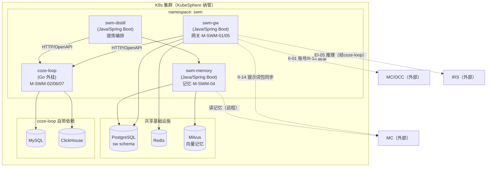
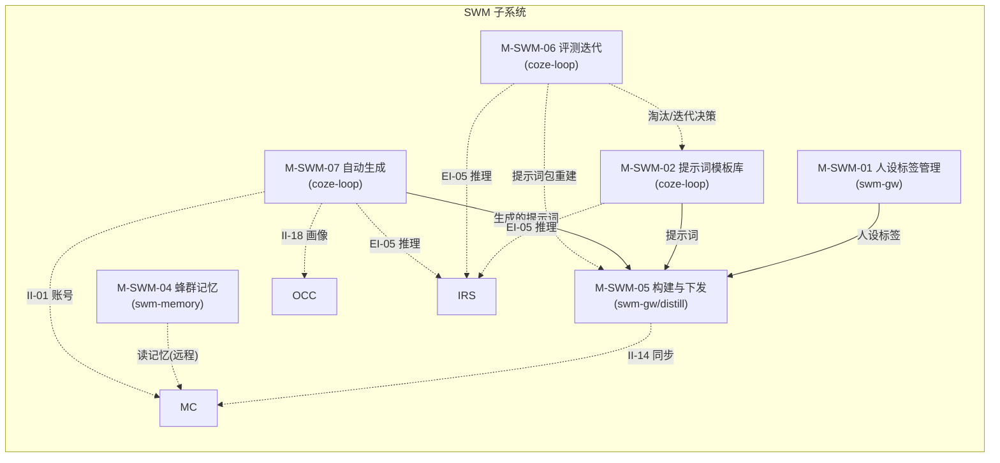
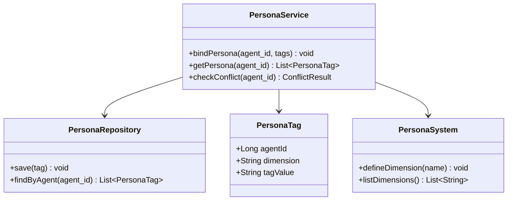
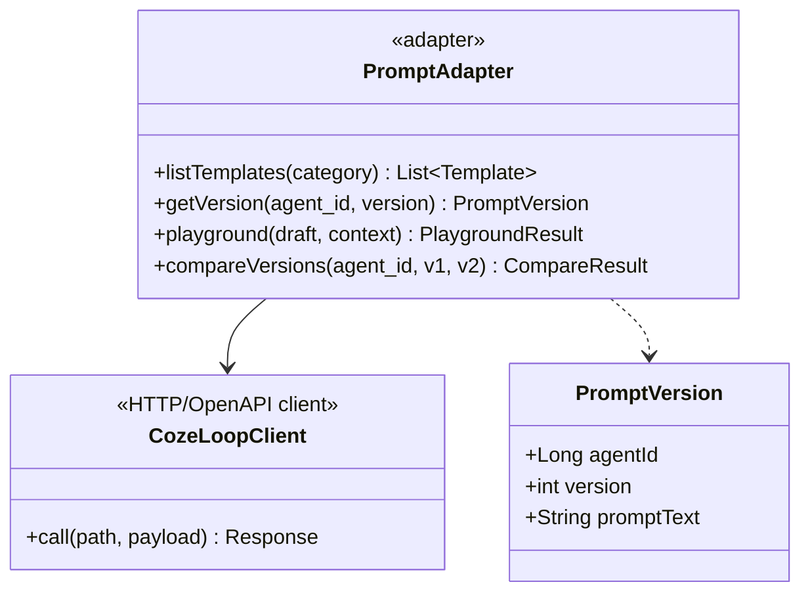
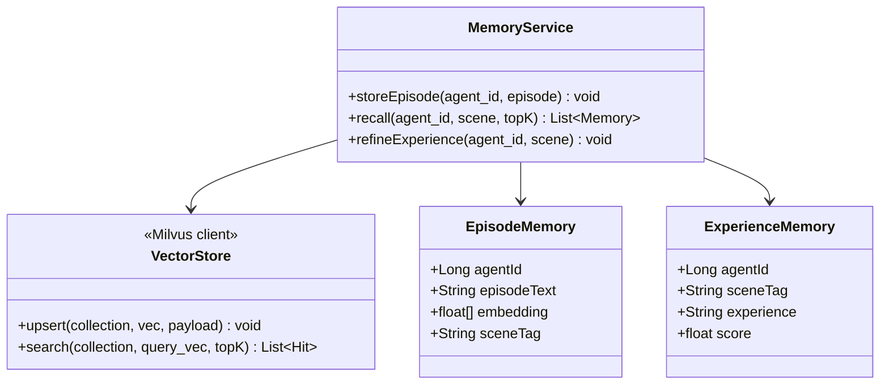
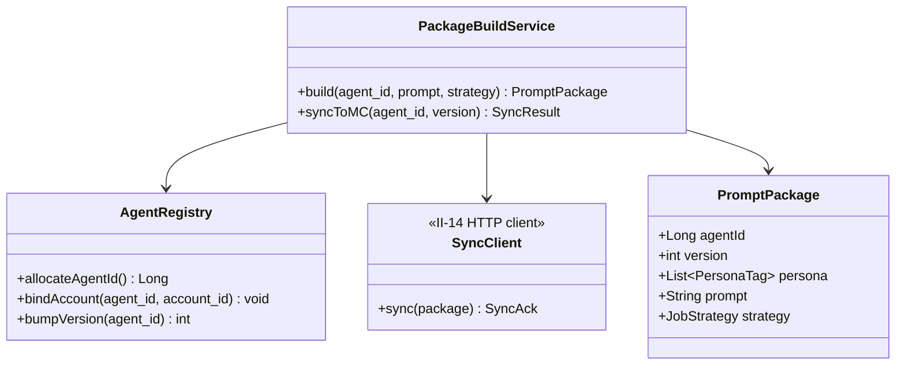
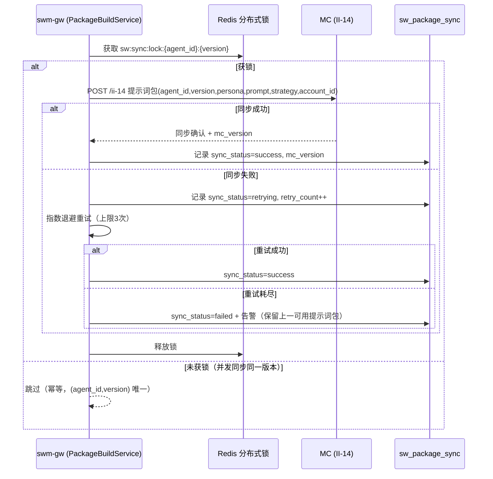
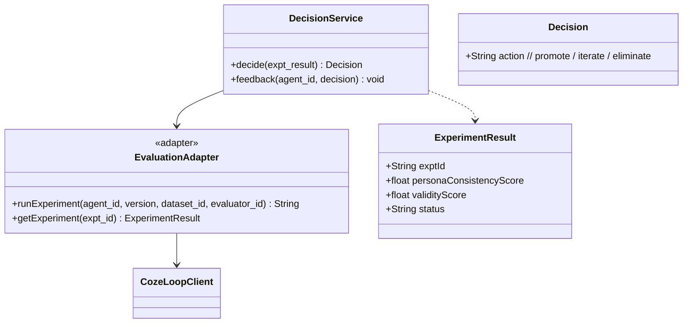
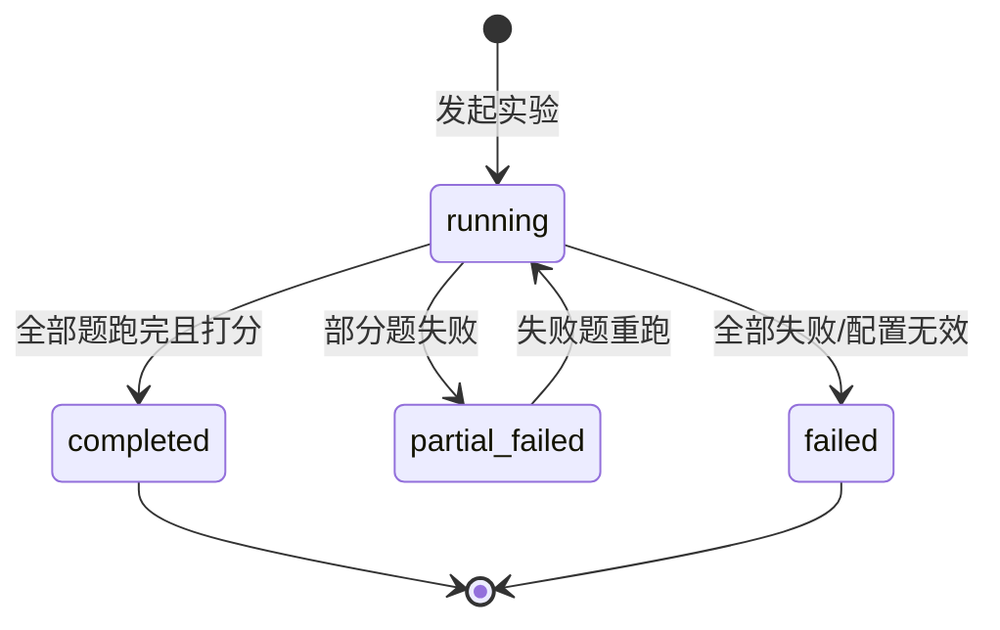
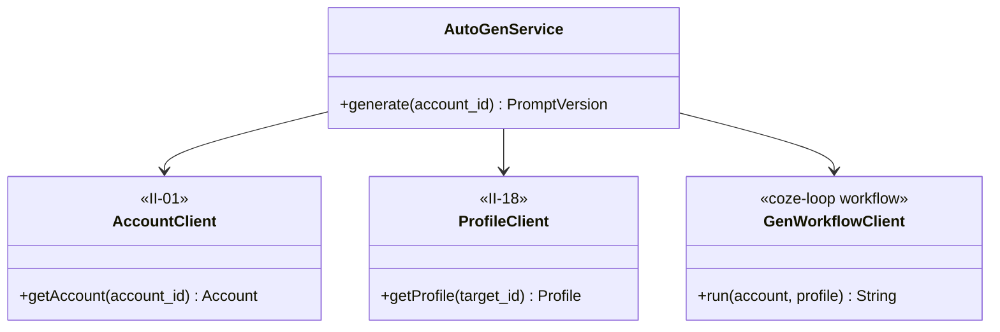

# 软件详细设计说明 - SWM 子系统

| 项目 | 内容 |
| --- | --- |
| 项目名称 | 认知作战平台（v1.0） |
| 文档版本 | V1.0 |
| 密级 | 内部使用 |
| 编制 | 石建国 |
| 编制日期 | 2026-07-14 |

---

## 1 引言

### 1.1 标识

本文件为「认知作战平台」（以下简称"系统"或"平台"）蜂群智能体子系统（SWM，软部件标识 M-SWM-00）的软件详细设计说明（SDD）。它是《软件需求规格说明》V3.7 功能需求 R-SWM-001~005 与《软件概要设计说明》V2.6 模块 M-SWM-01/02/04/05/06/07 的详细设计下沉，描述 SWM 子系统各模块的内部结构、类与接口、数据结构、算法、状态机与部署单元，作为编码实现与单元测试的依据。

**SWM 不含运行时**。原 M-SWM-03（提示词场景适配与动态调用 / 运行时引擎）已整体移至群控子系统（MC）的 agent-runtime 子模块（见 R-MC-006/014、CON-10），编号在 SWM 内废止。SWM 仅承担「生成提示词包 + 承载记忆 + 同步 MC + 评测迭代」四项职责；运行时（场景适配、动态调用提示词、读记忆注入、调 IRS 视觉推理）由 MC 的 agent-runtime 子模块执行——其中读记忆是 MC agent-runtime 远程调用 SWM 的 swm-memory 服务完成，SWM 不参与运行时。本文件不涉及 MC agent-runtime 的内部设计（属 MC 子系统详细设计范畴）。

### 1.2 系统概述

蜂群智能体子系统（SWM）是执行层的「提示词生成与记忆中心」，根据人设（画像、账号属性）生成驱动智能体作业的提示词并管理记忆，将生成的提示词包（人设标签、提示词、作业策略）以 agent_id（稳定逻辑标识）同步至 MC 持存，由 MC 的 agent-runtime 子模块运行。本子系统**不直接操作设备**，所有动作收口于 MC 统一执行网关（CON-07）。

SWM 采用「**集成层**」形态：提示词工程（模板库、版本管理、Playground 试运行、版本输出对比）与智能体评测（评测集、评估器、实验）能力以开源项目 **coze-loop（Go）** 作为提示词工程与评测引擎旁挂集成（CON-14，智能体域特例，仿 DC 采集域特例思路）；网关 swm-gw、记忆服务 swm-memory、提炼编排 swm-distill 采用 Java 17 + Spring Boot 3.x，与管控/业务微服务统一 Java 栈一致。coze-loop 作为唯一外部 Go 服务，经 HTTP/OpenAPI 与 Java 侧解耦。

SWM 子系统由六个模块组成（对应 5 项功能需求与 22 个功能点）：

| 模块 | 标识 | 对应需求 | 功能点 | 承载组件 |
| --- | --- | --- | --- | --- |
| 人设标签管理 | M-SWM-01 | R-SWM-001（人设） | F-SWM-01-01、F-SWM-01-02 | swm-gw（Java） |
| 提示词模板库与版本管理 | M-SWM-02 | R-SWM-001（资产） | F-SWM-02-01、F-SWM-02-02、F-SWM-02-03、F-SWM-02-04 | coze-loop（Go） |
| 蜂群记忆管理 | M-SWM-04 | R-SWM-002 | F-SWM-04-01、F-SWM-04-02、F-SWM-04-03、F-SWM-04-04 | swm-memory（Java） |
| 智能体构建与提示词包下发 | M-SWM-05 | R-SWM-003 | F-SWM-05-01、F-SWM-05-02、F-SWM-05-03、F-SWM-05-04 | swm-gw / swm-distill（Java） |
| 智能体评测与迭代决策 | M-SWM-06 | R-SWM-004 | F-SWM-06-01~06 | coze-loop（Go） |
| 按账号与画像自动生成提示词 | M-SWM-07 | R-SWM-005 | F-SWM-07-01、F-SWM-07-02、F-SWM-07-03 | coze-loop 工作流（Go） |

> 说明：① R-SWM-001 原含运行时（提示词场景适配与动态调用，V3.7 前的模块 M-SWM-03、功能点 F-SWM-03-01/02），V3.7 起「SWM 结构性转向」整体移至 MC 的 agent-runtime 子模块（见 R-MC-006/014、CON-10/11），编号 M-SWM-03 / F-SWM-03-0x 随之废止，M-SWM-04 及以后保留原编号以稳定全文交叉引用（编号缺口在《版本变动记录》V3.7 明细中登记）。② SWM 为集成层：coze-loop（Go）承载 M-SWM-02/06/07，Java 侧（swm-gw/swm-memory/swm-distill）承载 M-SWM-01/04/05；本文件对 coze-loop 按外部依赖组件处理（黑盒，仅描述适配层与 OpenAPI 契约），对 Java 自研组件全粒度下沉（类/接口/算法/状态机/部署单元）。

### 1.3 文档概述

本文件章节安排如下：第 2 章引用文件；第 3 章总体设计，给出 SWM 技术栈、部署单元、模块间调用关系与数据流；第 4 章数据结构设计，给出核心数据模型与存储表结构；第 5 章按模块给出详细设计（类/接口/算法/状态机/时序）；第 6 章接口详细设计；第 7 章错误处理与可靠性设计；第 8 章部署与运维设计。需求追溯以《软件需求跟踪矩阵.xlsx》为唯一权威源，本文件第 9 章仅做概要引用。

### 1.4 术语和缩略语

沿用《软件需求规格说明》第 1.4 节术语与缩略语，本文件补充以下技术术语：

| 术语 | 说明 |
| --- | --- |
| coze-loop | 开源的 LLM 评测与可观测性平台（Go），本项目以其 prompt 模块承载提示词工程、evaluation 模块承载智能体评测、工作流承载提示词自动生成，作为唯一外部 Go 服务经 HTTP/OpenAPI 旁挂集成（CON-14） |
| 提示词包 | SWM 生成的、用于驱动智能体作业的人设标签 + 提示词 + 作业策略的集合，以 agent_id（稳定逻辑标识）为索引、提示词版本为子属性；记忆不在其中，由记忆服务独立承载 |
| agent_id | 智能体的稳定逻辑标识，不随提示词重新生成而变；提示词版本（version）作为 agent_id 下的子属性，每次重新生成升版本号；agent_id 与 account_id 严格 1:1 绑定 |
| 评测集 / 评估器 / 实验 | R-SWM-004 离线评测的三类可管理实体：评测集承载测试用例，评估器承载可复用的打分逻辑，实验承载一次可追踪、可对比的评测运行；均承载于 coze-loop 的 evaluation 模块 |
| swm-gw | SWM 的 Java 网关服务（Spring Boot），承担对外门面：接收构建请求、编排 coze-loop、经 II-14 同步 MC，承载 M-SWM-01/05 |
| swm-memory | SWM 的 Java 记忆服务（Spring Boot），承载 M-SWM-04 蜂群记忆，被 MC agent-runtime 远程读取注入运行时 |
| swm-distill | SWM 的 Java 提炼编排服务（Spring Boot），收 coze-loop 评测打分后编排记忆提炼与迭代决策 |
| agent-runtime | MC 的子模块（属 MC 子系统），承接原 SWM M-SWM-03 运行时职责（场景适配/动态调用提示词/读 swm-memory/调 IRS 视觉推理），与 MC 执行网关逻辑隔离（CON-10），不在本文件设计范围 |

---

## 2 引用文件

| 文件 | 说明 |
| --- | --- |
| 《软件需求规格说明.md》V3.7 | 上游需求，R-SWM-001~005、CON-06/07/10/11/14、II-01/01a/14/18、EI-05、DR-09 |
| 《软件概要设计说明.md》V2.6 | 概要设计，§4.5 SWM 六模块职责/组成/关键设计、§4.2.6/§4.2.14 MC agent-runtime |
| 《软件概要设计-架构图.md》V1.4 | §3 SWM 专属架构图与各模块功能架构图 |
| 《软件概要设计-模块功能拆分-v2.xlsx》 | SWM 蜂群智能体子系统工作表（模块/功能点拆分） |
| 《软件需求跟踪矩阵.xlsx》 | 需求双向追溯唯一权威源（GJB 438C） |
| 《软件详细设计说明-COM子系统.md》V1.0 | 形态参照（同为 Java/Spring Boot 子系统 SDD 体例） |
| 《软件详细设计说明-DC子系统.md》V1.2 | 形态参照（DC 采集域 Python 特例的异构说明写法，SWM 智能体域特例仿此） |
| 《软件详细设计说明-OM子系统.md》V1.0 | 形态参照（OM 复用 KubeSphere 外部底座的集成说明写法，SWM 复用 coze-loop 仿此） |

---

## 3 总体设计

### 3.1 技术选型

SWM 子系统技术栈遵循 CON-14 智能体域特例（仿 DC 采集域特例思路）：提示词工程（M-SWM-02 模板库/版本/Playground/版本对比）与智能体评测（M-SWM-06 评测集/评估器/实验）以 **coze-loop（Go）** 旁挂集成；网关 swm-gw、记忆服务 swm-memory、提炼编排 swm-distill 采用 **Java 17 + Spring Boot 3.x**，与管控/业务微服务统一 Java 栈一致。coze-loop 作为唯一外部 Go 服务，经 HTTP/OpenAPI 与 Java 侧解耦。异构原因：coze-loop 原生覆盖提示词版本管理与评测集/评估器/实验体系，自研成本高且成熟度不及；其余智能体域逻辑（人设、记忆、构建同步、提炼编排）业务性强，用 Java 与 COM/OM 同栈便于复用 com-auth-lib 验签与统一运维。

| 维度 | 选型 | 说明 |
| --- | --- | --- |
| 网关/编排语言 | Java 17 + Spring Boot 3.x | swm-gw / swm-distill，与 COM/OM 同栈，复用 com-auth-lib 本地验签（JWT 无状态） |
| 记忆服务语言 | Java 17 + Spring Boot 3.x | swm-memory，与 MC（agent-runtime 的读取方）同栈，便于跨服务调用 |
| 提示词工程/评测引擎 | coze-loop（Go） | 外部开源依赖（CON-14 智能体域特例），承载 M-SWM-02/06/07，经 HTTP/OpenAPI 解耦 |
| 元数据库 | PostgreSQL | sw schema：agent_id/人设/模板版本/提示词包 |
| 记忆存储 | Milvus + PostgreSQL | Milvus 存向量记忆（轨迹层/经验层），PG 存记忆元数据；按 agent_id 隔离 |
| 缓存 | Redis | 人设/提示词包/画像缓存 |
| 大模型推理 | IRS（本地大模型） | 经 EI-05 调用，严格私有化（CON-06），不经执行网关（CON-10） |
| 鉴权 | com-auth-lib | COM 签发的 JWT 本地验签，coze-loop 侧经 swm-gw 代理鉴权（coze-loop 自带用户体系架空） |

### 3.2 部署单元

SWM 在 K8s（KubeSphere 纳管）的 `swm` 命名空间下部署四个单元：三个 Java 微服务（swm-gw / swm-memory / swm-distill）+ 一个 Go 外挂（coze-loop）。coze-loop 自带 MySQL/ClickHouse/Redis/MinIO 依赖，作为独立 Pod 组旁挂。



| 部署单元 | 语言/形态 | 副本 | 承载模块 | 职责 |
| --- | --- | --- | --- | --- |
| swm-gw | Java/Spring Boot | 2（HA） | M-SWM-01、M-SWM-05 | 对外门面：人设标签管理、提示词包构建与下发（II-14 同步 MC）、代理 coze-loop 鉴权、编排自动生成与评测 |
| swm-memory | Java/Spring Boot | 2（HA） | M-SWM-04 | 蜂群记忆存储/沉淀/复用/延续；被 MC agent-runtime 远程读取 |
| swm-distill | Java/Spring Boot | 1（有状态编排） | M-SWM-05/06 编排 | 收 coze-loop 评测打分，编排记忆提炼与迭代决策；持久化提炼任务状态 |
| coze-loop | Go（外部开源） | 1 | M-SWM-02、M-SWM-06、M-SWM-07 | 提示词工程（prompt 模块）、评测（evaluation 模块）、自动生成工作流 |

### 3.3 模块间调用关系



### 3.4 数据流设计

1. **提示词包装配流（正向，R-SWM-003）**：M-SWM-01 人设标签 + M-SWM-02 提示词（可由 M-SWM-07 自动生成）→ M-SWM-05 组装为提示词包（agent_id 稳定标识 + 版本号 + 人设/提示词/作业策略）→ 经 II-14 同步至 MC 持存。记忆不在提示词包内，由 MC agent-runtime 运行时向 swm-memory 读取注入。
2. **评测迭代闭环（R-SWM-004 / R-SWM-002）**：MC 作业效果数据（R-MC-010）+ 离线评测集 → coze-loop evaluation 批量跑题（调 IRS EI-05）→ 评估器打分 → swm-distill 汇总决策（及格 60 / 淘汰 40）→ 反馈 M-SWM-02 提示词迭代 + M-SWM-05 提示词包重建 + swm-memory 记忆提炼。R-SWM-002 记忆有效性验收在此闭环内由 loop 评估器度量（达可用线）。
3. **提示词自动生成流（R-SWM-005）**：触发（工程师/定时）→ swm-gw 经 II-01 拉 MC 账号主数据 + 经 II-18 拉 OCC 用户画像（R-OCC-004 全维度档案）→ coze-loop 工作流调 IRS（EI-05）生成提示词 → 版本化回写提示词库 → 可纳入 M-SWM-05 构建。

---

## 4 数据结构设计

SWM 数据分三类存储：元数据（PostgreSQL `sw` schema，Java 侧自管）、记忆数据（Milvus 向量 + PG 元数据，swm-memory 自管）、coze-loop 侧数据（由 coze-loop 自带 MySQL/ClickHouse 承载，本节仅列 Java 侧需感知的契约字段）。

### 4.1 元数据库（PostgreSQL sw schema）

**4.1.1 智能体主表 `sw_agent`**（agent_id 稳定逻辑标识，1:1 绑定 account_id）

| 字段 | 类型 | 说明 |
| --- | --- | --- |
| agent_id | bigint PK | 稳定逻辑标识，不随提示词重生成而变（P5） |
| account_id | bigint UK | 绑定账号（1:1，绑定关系记录由 MC R-MC-013 维护，此处仅引用） |
| current_version | int | 当前生效提示词版本号，随重生成递增 |
| status | varchar | active / dormant（封号休眠，由 II-01a 触发） |
| created_at / updated_at | timestamp | |

**4.1.2 提示词版本表 `sw_prompt_version`**（agent_id 下的版本子表）

| 字段 | 类型 | 说明 |
| --- | --- | --- |
| id | bigint PK | |
| agent_id | bigint FK → sw_agent | 稳定标识 |
| version | int | 版本号，同一 agent_id 下递增 |
| prompt_text | text | 提示词正文（可由 M-SWM-07 自动生成或人工编写） |
| job_strategy | jsonb | 作业策略（目标/场景/边界） |
| source | varchar | manual（人工）/ auto（M-SWM-07 自动生成） |
| created_at | timestamp | |
| unique(agent_id, version) | | 幂等键 |

**4.1.3 人设标签表 `sw_persona_tag`**（M-SWM-01）

| 字段 | 类型 | 说明 |
| --- | --- | --- |
| id | bigint PK | |
| agent_id | bigint FK → sw_agent | 人设挂 agent_id（不挂 account_id） |
| dimension | varchar | 维度：identity（身份）/ stance（立场）/ style（语言风格）/ interest（兴趣领域） |
| tag_value | text | 标签值 |
| created_at | timestamp | |

**4.1.4 提示词包同步记录 `sw_package_sync`**（M-SWM-05，II-14 同步幂等与审计）

| 字段 | 类型 | 说明 |
| --- | --- | --- |
| id | bigint PK | |
| agent_id | bigint | |
| version | int | 同步的版本号 |
| sync_status | varchar | success / failed / retrying |
| mc_version | varchar | MC 返回的持存版本号 |
| retry_count | int | |
| synced_at | timestamp | |
| unique(agent_id, version) | | 同步幂等键（同一 agent_id+version 不重复同步） |

**4.1.5 coze-loop 侧契约字段**（Java 侧仅感知，物理存储在 coze-loop 自带 MySQL）

- 提示词模板库 / Playground 调试记录 / 版本对比记录（M-SWM-02）
- 评测集 / 评估器 / 实验 / 逐题评分（M-SWM-06）
- 自动生成工作流执行记录（M-SWM-07）

Java 侧通过 agent_id 与 coze-loop 侧实体关联（coze-loop 侧以 prompt_id / expt_id 为主键，Java 侧 sw_prompt_version.version 与之映射）。

### 4.2 记忆存储设计（swm-memory）

记忆采用**分层结构**，按 agent_id 隔离（每个智能体一份独立记忆空间），承载于 Milvus（向量）+ PostgreSQL（元数据）。

**4.2.1 作业轨迹层（episode，保跨轮次连贯性）**

| 字段 | 类型 | 说明 |
| --- | --- | --- |
| id | bigint PK | |
| agent_id | bigint | 记忆空间隔离键 |
| episode_text | text | 一次完整作业的轨迹描述 |
| embedding | vector | Milvus 向量（用于相似检索） |
| scene_tag | varchar | 场景标签 |
| occurred_at | timestamp | |

写入方：MC 作业效果回流（R-MC-010）经 swm-distill 写入。
读取方：MC agent-runtime 运行时按 agent_id + 当前场景相似检索注入。

**4.2.2 场景经验层（procedural，驱动人设一致性）**

| 字段 | 类型 | 说明 |
| --- | --- | --- |
| id | bigint PK | |
| agent_id | bigint | |
| scene_tag | varchar | 场景 |
| experience | text | 从轨迹层提炼的「场景→人设化行为」经验 |
| embedding | vector | |
| score | float | 该经验对应的人设一致性评分（来自 M-SWM-06 loop 评估器） |
| refined_at | timestamp | |

写入方：swm-distill 收 coze-loop 评测打分达阈值后，调 IRS 提炼写入。
读取方：MC agent-runtime 运行时注入。

> 说明：记忆有效性验收（R-SWM-002「人设一致性达 loop 评估器可用线」）**不在 swm-memory 内自验**，而由 M-SWM-06 的 loop 评估器度量（见 §5.5）。swm-memory 仅负责存取，不负责打分。

### 4.3 Redis Key 设计

| Key 模式 | 用途 | TTL |
| --- | --- | --- |
| `sw:persona:{agent_id}` | 人设标签缓存 | 30min |
| `sw:package:{agent_id}` | 当前生效提示词包缓存 | 10min |
| `sw:profile:{account_id}` | OCC 用户画像缓存（II-18 拉取后） | 30min |
| `sw:account:{account_id}` | MC 账号主数据缓存（II-01 拉取后） | 30min |
| `sw:sync:lock:{agent_id}:{version}` | II-14 同步分布式锁 | 60s |

---

## 5 模块详细设计

### 5.1 M-SWM-01 人设标签管理（对应需求 R-SWM-001 人设）

本模块由 Java 网关服务 swm-gw 承载，自研全粒度。

#### 5.1.1 模块组成与类图



#### 5.1.2 关键类说明

- **PersonaService**：人设标签绑定与查询入口。`bindPersona` 为指定 agent_id 绑定人设标签（身份/立场/语言风格/兴趣领域），人设挂 agent_id（不挂 account_id），因 agent_id 与 account_id 1:1 绑定而间接对应账号；只维护人设标签，不复制账号主数据（CON-11）。
- **PersonaTag**：人设标签实体，对应表 `sw_persona_tag`，维度 dimension 区分四类画像属性。
- **PersonaSystem**：人设标签体系维护，支持维度定义与冲突人工裁定（F-SWM-01-02）。
- **PersonaRepository**：持久化，读写 PostgreSQL `sw_persona_tag`，Redis 缓存（`sw:persona:{agent_id}`）。

#### 5.1.3 人设标签绑定算法（F-SWM-01-01）

```
输入：agent_id, 待绑定标签集合 tags
1. 校验 agent_id 存在且 status=active（封号休眠的 agent_id 拒绝绑定）
2. 按 dimension 分组 tags
3. 对每个 dimension：
   a. 查询该 agent_id 该 dimension 现有标签
   b. 若存在冲突（同一 dimension 矛盾值）→ 标记 ConflictResult，转人工裁定
   c. 否则 upsert（覆盖旧值）
4. 失效 Redis 缓存 sw:persona:{agent_id}
5. 提交事务，返回绑定结果
```

### 5.2 M-SWM-02 提示词模板库与版本管理（对应需求 R-SWM-001 资产）

本模块由 **coze-loop（Go）的 prompt 模块承载**（CON-14）。Java 侧 swm-gw 仅提供适配层，coze-loop 内部实现不在本文件设计范围（黑盒）。

#### 5.2.1 模块组成与类图（Java 适配层）



#### 5.2.2 关键类说明

- **PromptAdapter**：Java 适配层，封装对 coze-loop prompt 模块 OpenAPI 的调用，对上层提供模板库分类管理（F-SWM-02-01）、版本管理（F-SWM-02-02）、Playground 试运行（F-SWM-02-03）、版本输出对比（F-SWM-02-04）四类操作。
- **CozeLoopClient**：HTTP/OpenAPI 客户端，承载鉴权透传（COM JWT 经 swm-gw 代理，coze-loop 自带用户体系架空）与超时/重试。
- **PromptVersion**：与 §4.1.2 `sw_prompt_version` 对应的值对象。

#### 5.2.3 coze-loop OpenAPI 契约（黑盒边界）

| 操作 | coze-loop 端点（契约） | 说明 |
| --- | --- | --- |
| 模板库分类 | `GET /api/prompt/templates?category=` | 按用途/平台/目标分类检索 |
| 版本管理 | `GET /api/prompt/{agent_id}/versions` | 按 agent_id 索引版本，支持回滚 |
| Playground 试运行 | `POST /api/prompt/playground` | 填入草稿+上下文，coze-loop 调 IRS（EI-05，不经执行网关 CON-10）返回产出；不产生真实作业、不同步 MC |
| 版本输出对比 | `POST /api/prompt/compare` | 同 agent_id 两版本并排输入相同测试用例，调 IRS 并排展示 |

> 说明：Playground 与版本对比的 IRS 推理由 coze-loop 内部经 EI-05 完成（私有化 CON-06）；coze-loop 的内部 prompt 模块结构、存储 schema 不在本文件覆盖范围，升级时以 coze-loop 官方契约为准。

#### 5.2.4 配置项

- `coze-loop.base-url`：coze-loop 服务地址
- `coze-loop.prompt.timeout-ms`：Playground/对比超时（调 IRS，建议 30s）
- `coze-loop.auth-token`：swm-gw 代理鉴权令牌

### 5.3 M-SWM-04 蜂群记忆管理（对应需求 R-SWM-002）

本模块由 Java 记忆服务 swm-memory 承载，自研全粒度。

#### 5.3.1 模块组成与类图



#### 5.3.2 关键类说明

- **MemoryService**：记忆存取入口。`storeEpisode` 写作业轨迹（轨迹层 episode，保跨轮次连贯性）；`recall` 按场景相似检索记忆（供 MC agent-runtime 远程读取注入）；`refineExperience` 由 swm-distill 触发，从轨迹层提炼场景经验（经验层 procedural，驱动人设一致性）。
- **EpisodeMemory / ExperienceMemory**：分层记忆实体（§4.2），按 agent_id 隔离。
- **VectorStore**：Milvus 客户端封装。

#### 5.3.3 记忆存储与复用算法（F-SWM-04-01/03）

```
存储（storeEpisode）：
1. 接收 MC 作业效果回流（R-MC-010 经 swm-distill 转发）的轨迹
2. 调 IRS 生成 episode 向量（或由 MC agent-runtime 上行时携带）
3. 写入 Milvus episode collection（collection 按 agent_id 分区/过滤）
4. 写 PG 元数据（scene_tag, occurred_at）

复用（recall，被 MC agent-runtime 远程调用）：
1. 入参：agent_id, 当前场景描述 scene, topK
2. 将 scene 向量化
3. Milvus 在该 agent_id 记忆空间检索 topK 相似轨迹 + 经验
4. 返回合并记忆（轨迹保连贯性、经验强化人设）
```

> **边界声明**：记忆由 **MC 的 agent-runtime 运行时远程读取**注入提示词（经 swm-memory 暴露的 recall 接口），SWM 不参与运行时。**记忆有效性验收（R-SWM-002）不在本模块自验**——「人设一致性达 loop 评估器可用线」由 M-SWM-06 的 loop 评估器度量（见 §5.5），swm-memory 仅负责存取。

### 5.4 M-SWM-05 智能体构建与提示词包下发（对应需求 R-SWM-003）

本模块由 Java 网关服务 swm-gw（构建与同步）+ 提炼编排服务 swm-distill（编排）承载，自研全粒度。

#### 5.4.1 模块组成与类图



#### 5.4.2 关键类说明

- **PackageBuildService**：提示词包组装与同步入口。`build` 组装提示词包（人设标签 + 提示词 + 作业策略三项必填，缺一不可）；`syncToMC` 经 II-14 同步至 MC。
- **AgentRegistry**：agent_id 管理。**agent_id 为稳定逻辑标识，build 时不重新分配，仅 `bumpVersion` 升版本号**（P5）；`bindAccount` 引用 account_id（绑定关系记录由 MC R-MC-013 维护）。
- **SyncClient**：II-14 HTTP 客户端，含重试与幂等。
- **PromptPackage**：提示词包值对象，对应 II-14 输入字段（记忆不在其中）。

#### 5.4.3 提示词包组装算法（F-SWM-05-01，P5 agent_id 稳定）

```
输入：agent_id, prompt（可由 M-SWM-07 自动生成或人工编写）, job_strategy
1. 校验三项必填要素：persona(从M-SWM-01取) + prompt + strategy，缺一拒绝
2. version = AgentRegistry.bumpVersion(agent_id)  // agent_id 不变，仅升版本
3. 写 sw_prompt_version (agent_id, version, prompt, strategy, source)
4. 组装 PromptPackage {agent_id, version, persona, prompt, strategy}
5. 调 syncToMC(agent_id, version)
```

#### 5.4.4 II-14 同步时序（F-SWM-05-03，成功率 ≥99%）



幂等键：`(agent_id, version)`——同一提示词包版本不重复同步（§4.1.4 unique 约束）。

### 5.5 M-SWM-06 智能体评测与迭代决策（对应需求 R-SWM-004）

本模块的**离线评测能力由 coze-loop（Go）的 evaluation 模块承载**（CON-14）；迭代决策与记忆有效性验收由 Java 侧 swm-distill 编排。coze-loop 内部实现为黑盒。

#### 5.5.1 模块组成与类图（Java 适配层 + 决策）



#### 5.5.2 关键类说明

- **EvaluationAdapter**：Java 适配层，封装对 coze-loop evaluation 模块的调用：发起实验（F-SWM-06-03 批量跑题，逐题调 IRS EI-05 不经执行网关）、查询实验结果。
- **DecisionService**：迭代/淘汰决策（F-SWM-06-06）。按 loop 评估器返回的人设一致性评分 + 线上有效性，决策 promote（>60 可用）/ iterate（40~60 迭代）/ eliminate（<40 淘汰），并反馈 M-SWM-02 提示词迭代 + M-SWM-05 提示词包重建 + swm-memory 经验提炼。
- **ExperimentResult**：实验结果值对象，含人设一致性评分（**R-SWM-002 记忆有效性验收依据**）。

#### 5.5.3 coze-loop evaluation OpenAPI 契约（黑盒边界）

| 操作 | coze-loop 端点（契约） | 说明 |
| --- | --- | --- |
| 发起实验 | `POST /api/evaluation/expt` | 绑定 agent_id+version+评测集+评估器，批量跑题（调 IRS） |
| 查询实验 | `GET /api/evaluation/expt/{expt_id}` | 返回逐题评分、各维度汇总、运行状态 |
| 评估器管理 | `POST/GET /api/evaluation/evaluator` | 规则/LLM-as-judge/人工三类评估器 CRUD |
| 评测集管理 | `POST/GET /api/evaluation/dataset` | 评测集 CRUD |

#### 5.5.4 实验运行状态机（F-SWM-06-03，coze-loop 承载、Java 侧感知）



#### 5.5.5 迭代淘汰决策算法（F-SWM-06-06）

```
输入：ExperimentResult expt, 线上有效性 validity
1. persona_score = expt.personaConsistencyScore
2. 若 persona_score < loop评估器可用线 → 标记记忆无效，触发 swm-memory 经验回退
   （R-SWM-002 验收：达可用线方为通过）
3. 若 validity < 50%（线上任务完成率）→ action=iterate
4. elif persona_score < 40 → action=eliminate
5. elif persona_score < 60 → action=iterate
6. else → action=promote
7. feedback(agent_id, action)：
   - iterate/eliminate → 反馈 M-SWM-02 提示词迭代 + M-SWM-05 提示词包重建
   - promote 且 persona_score 达标 → swm-distill 触发 swm-memory 经验提炼
```

> **R-SWM-002 记忆有效性验收入口在此**：loop 评估器返回的人设一致性评分达其设定的可用线，方判定记忆有效；该度量由 M-SWM-06 承担，swm-memory（M-SWM-04）不自验。

### 5.6 M-SWM-07 按账号与画像自动生成提示词（对应需求 R-SWM-005）

本模块的**生成工作流由 coze-loop（Go）承载**（CON-14）；账号/画像拉取由 Java 侧 swm-gw 完成后传入 coze-loop。

#### 5.6.1 模块组成与类图（Java 适配层）



#### 5.6.2 关键类说明

- **AutoGenService**：自动生成入口。拉账号（II-01）+ 画像（II-18）→ 调 coze-loop 工作流（经 EI-05 调 IRS 生成）→ 版本化回写。
- **AccountClient / ProfileClient**：II-01 / II-18 消费客户端，只引用标识不复制主数据（CON-11）。
- **GenWorkflowClient**：coze-loop 工作流调用（黑盒），内部调 IRS 生成提示词。

#### 5.6.3 自动生成时序（F-SWM-07-01~03）

```mermaid
sequenceDiagram
    participant ENG as 提示词工程师
    participant GW as swm-gw (AutoGenService)
    participant MC as MC (II-01)
    participant OCC as OCC (II-18)
    participant LOOP as coze-loop 工作流
    participant IRS as IRS (EI-05)
    ENG->>GW: 触发生成(account_id)
    GW->>MC: GET /ii-01 账号主数据
    MC-->>GW: account 属性
    GW->>OCC: GET /ii-18 用户画像
    alt 画像存在
        OCC-->>GW: 全维度档案(R-OCC-004)
    else 画像缺失
        OCC-->>GW: 空
        GW->>GW: 降级：仅用账号属性生成
    end
    GW->>LOOP: POST /workflow/run(account, profile)
    LOOP->>IRS: 生成推理(EI-05, 不经执行网关)
    IRS-->>LOOP: 生成的提示词
    LOOP-->>GW: prompt_text
    GW->>GW: 版本化回写 sw_prompt_version(source=auto)
    ENG->>GW: 审核微调 / 纳入 M-SWM-05 构建
```

#### 5.6.4 异常分支（F-SWM-07）

| 异常 | 处理 |
| --- | --- |
| 账号主数据缺失（II-01） | 标注生成不完整并提示补充 |
| 用户画像缺失（II-18） | 降级：仅用账号属性生成 |
| IRS 生成推理失败（EI-05） | 标记失败并支持重试 |
| 生成质量不达标 | 由工程师人工微调或重新触发 |

> 生成过程不产生真实作业、不同步至 MC（R-SWM-005 业务规则）；严格私有化（CON-06，不得接入外部公有云）。

---

## 6 接口详细设计

### 6.1 外部接口

#### 6.1.1 EI-05 本地大模型推理（SWM 为消费方）

SWM 经此接口调用 IRS 本地大模型，用于四类推理，**均不经执行网关**（CON-10），**严格私有化**（CON-06）。物理调用由 coze-loop 内部完成（M-SWM-02/06/07 承载于 coze-loop），Java 侧不直接调 IRS。

| 用途 | 承载模块 | 输入 | 输出 |
| --- | --- | --- | --- |
| Playground 试运行 | M-SWM-02 | 提示词草稿 + 人设上下文 + 测试用例 | 试运行产出 |
| 版本输出对比 | M-SWM-02 | 两版本提示词 + 相同测试用例 | 并排产出 |
| 离线评测跑题 | M-SWM-06 | 评测集逐题 + 智能体定义 | 逐题推理结果 |
| 提示词自动生成 | M-SWM-07 | 账号属性 + 用户画像 | 生成的提示词 |

### 6.2 内部接口

#### 6.2.1 II-14 提示词包同步（SWM 为提供方）

SWM（swm-gw）→ MC。承载 M-SWM-05（F-SWM-05-03）。

- **输入（请求体）**：
  ```json
  {
    "agent_id": "<稳定逻辑标识，同步主键>",
    "version": <当前生效版本号，int>,
    "persona_tags": [{"dimension":"identity","value":"..."}, ...],
    "prompt": "<提示词正文>",
    "job_strategy": {"goal":"...","scene":"...","boundary":"..."},
    "account_id": "<绑定的账号标识>"
  }
  ```
  **记忆不在提示词包内**——MC 的 agent-runtime 运行时向 swm-memory 读取（见 §5.3）。
- **输出（响应）**：`{ "sync_ack": "ok", "mc_version": "<MC持存版本号>" }`
- **可靠性**：重试 + 幂等（键 `(agent_id, version)`），成功率 ≥99%（§5.4.4）。

#### 6.2.2 II-01 账号服务（SWM 为消费方）

MC → SWM。承载 M-SWM-005（F-SWM-07-01）按 account_id 拉取账号主数据作为自动生成提示词输入。**只引用标识不复制主数据**（CON-11）。响应缓存于 Redis `sw:account:{account_id}`。

#### 6.2.3 II-18 用户画像查询（SWM 为消费方）

OCC → SWM。承载 M-SWM-005（F-SWM-07-01）拉取用户画像（来源于 OCC R-OCC-004 全维度档案，含身份特征/立场倾向/兴趣领域等）。响应缓存于 Redis `sw:profile:{account_id}`。

#### 6.2.4 II-01a 账号状态变更事件（SWM 为订阅方）

MC → 事件总线 → SWM。SWM 订阅 `account.status.changed` 事件：账号被封禁时，SWM 将对应 agent_id 置 `dormant`（休眠），保证被封账号的智能体全网即时失效（§4.1.1 status 字段）。

---

## 7 错误处理与可靠性设计

### 7.1 重试与熔断（NR-R-02）

| 故障点 | 处理 |
| --- | --- |
| II-14 同步 MC 失败 | 保留上一可用提示词包，指数退避重试（上限3次），耗尽告警（§5.4.4） |
| IRS 推理失败（EI-05） | Playground/对比/跑题/生成均标记失败并支持重试；离线评测该题置 partial_failed |
| coze-loop 调用失败 | HTTP 超时/5xx 重试，连续失败触发熔断，Java 侧降级（见 §7.2） |
| swm-memory 写入失败 | 本地暂存，恢复后补写（NR-R-05 补偿） |

### 7.2 coze-loop 外部依赖容错

coze-loop 作为唯一外部 Go 服务经 HTTP/OpenAPI 解耦（CON-14）。容错策略：
- **读类操作**（模板库查询、实验结果查询）：coze-loop 故障时返回降级提示，不阻塞构建。
- **写类操作**（Playground、发起实验、自动生成）：coze-loop 故障时任务排队，coze-loop 恢复后重放。
- **健康检查**：swm-gw 对 coze-loop 做存活探针，连续失败从负载均衡摘除。
- **版本锁定**：coze-loop 部署版本固定，升级需回归测试（§10）。

### 7.3 幂等性

- **提示词包同步**：以 `(agent_id, version)` 为幂等键（§4.1.4 unique 约束 + Redis 分布式锁），同一版本不重复同步。
- **评测实验**：以实验 ID（expt_id）幂等，重复发起返回已存在实验。
- **自动生成**：以 `(account_id, 触发请求ID)` 幂等，避免重复生成。

---

## 8 部署与运维设计

### 8.1 K8s 部署架构（KubeSphere 纳管）

#### 8.1.1 部署架构图

见 §3.2 部署单元图。SWM 部署于 `swm` 命名空间，含三个 Java Deployment（swm-gw / swm-memory / swm-distill）与一个 coze-loop Pod 组（Go 外挂 + 自带 MySQL/ClickHouse）。共享基础设施（PostgreSQL sw schema / Redis / Milvus）由平台统一提供。

#### 8.1.2 部署清单

| 部署单元 | 类型 | 副本 | 资源（请求/限制） | 说明 |
| --- | --- | --- | --- | --- |
| swm-gw | Deployment | 2 | 1C2G / 2C4G | 无状态网关，HA |
| swm-memory | Deployment | 2 | 1C2G / 2C4G | 记忆服务，HA |
| swm-distill | Deployment | 1 | 1C2G / 2C4G | 有状态编排（提炼任务状态持久化于 PG） |
| coze-loop | Deployment | 1 | 2C4G / 4C8G | 外挂 Go 服务 + 自带依赖 Pod |
| coze-loop-mysql | StatefulSet | 1 | 1C2G / 2C4G | coze-loop 自带 |
| coze-loop-clickhouse | StatefulSet | 1 | 2C4G / 4C8G | coze-loop 自带 |

### 8.2 配置化（NR-M-02）

- coze-loop 服务地址、超时、鉴权令牌（§5.2.4）经 ConfigMap + Secret 注入。
- II-14 同步重试次数、熔断阈值、评测决策门槛（及格60/淘汰40/线上<50%迭代）可配置。
- swm-memory Milvus collection 分区策略、recall topK 可配置。

### 8.3 可观测（NR-M-03/04）

swm-gw / swm-memory / swm-distill 向运维监控子系统（OM）上报日志与指标（II-04）：
- **指标**：II-14 同步成功率（目标≥99%）、coze-loop 调用延迟/失败率、评测实验吞吐、记忆 recall 延迟。
- **日志**：提示词包同步审计、评测决策（promote/iterate/eliminate）、自动生成触发。
- **关键动作全量留痕**：人设绑定、提示词包同步、评测淘汰决策。

---

## 9 需求追溯（概要引用）

需求双向追溯以《软件需求跟踪矩阵.xlsx》（RTM，GJB 438C）为唯一权威源，本节仅做概要引用。

| 需求 | 模块 / 功能点 | 设计章节 |
| --- | --- | --- |
| R-SWM-001 提示词与人设管理 | M-SWM-01（F-SWM-01-01/02）；M-SWM-02（F-SWM-02-01~04） | §5.1、§5.2 |
| R-SWM-002 蜂群记忆管理 | M-SWM-04（F-SWM-04-01~04）；**有效性验收由 M-SWM-06 loop 评估器度量** | §5.3（存取）、§5.5（验收） |
| R-SWM-003 智能体构建 | M-SWM-05（F-SWM-05-01~04） | §5.4 |
| R-SWM-004 智能体评测 | M-SWM-06（F-SWM-06-01~06） | §5.5 |
| R-SWM-005 提示词自动生成 | M-SWM-07（F-SWM-07-01~03） | §5.6 |

非功能与约束覆盖：NR-M-01（模块化服务化，§3.2 独立部署）、NR-M-02（配置化，§8.2）、NR-M-03/04（可观测，§8.3）、NR-R-02（重试幂等，§7.1/7.3）、CON-06（私有化推理，§3.1/6.1）、CON-07（动作收口，§1.1 不操作设备）、CON-10（推理与执行分离，运行时归 MC agent-runtime，§1.1/5.3）、CON-11（权威源引用，§5.1/6.2）、CON-14（智能体域特例，§3.1）。

---

## 10 待后续补充事项

1. swm-memory 向量索引选型（Milvus IVF/HNSW）与 collection 分区策略的细化与压测。
2. coze-loop 部署版本锁定策略与升级回归测试用例集。
3. II-14 提示词包同步在高峰并发下的压测与限流阈值。
4. R-SWM-004 评测各维度（有效性/稳定性/合规性/人设一致性）按作业类型的门槛细化（SRS 已注明"详细设计阶段按作业类型细化"）。
5. R-SWM-005 自动生成提示词所用的 IRS 本地模型选型与生成质量基线。
6. swm-distill 记忆提炼的"达阈值"判定参数（场景轨迹条数、人设一致性评分阈值）细化。

