# 软件需求规格说明

| 项目 | 内容 |
| --- | --- |
| 项目名称 | 认知作战平台（v1.0） |
| 文档版本 | V3.6 |
| 密级 | 内部使用 |
| 编制 | 石建国 |
| 编制日期 | 2026-07-14 |

---

## 引言

### 标识

本软件命名为"认知作战平台"（以下简称"系统"或"平台"）。系统由私有化大模型部署（IRS）作为底层推理基础设施，五个业务子系统与一组公共功能构成：数据爬取子系统（DC）、多设备矩阵自动化群控子系统（MC）、运维监控子系统（OM）、蜂群智能体子系统（SWM）、舆情作战业务子系统（OCC），以及公共功能（COM）。

### 软件概述

平台面向社交媒体，构建"**数据采集 → 分析研判 → 智能体编队 → 编队执行 → 效果评估 → 运维保障**"的完整需求能力闭环。

系统按职责分为三层。底层为基础设施层，包括私有化大模型部署、数据爬取子系统与运维监控子系统。私有化大模型部署（IRS）提供本地大模型的私有化部署与推理调用，使全系统的 AI 推理不依赖外部公有云；数据爬取子系统负责爬取工程底座与社交媒体数据的采集与 ETL 处理；运维监控子系统汇聚全系统日志与指标，完成常态化运维。

中层为执行层，包括多设备矩阵自动化群控子系统与蜂群智能体子系统。
群控子系统（MC）定位为"统一自动化执行引擎与多终端执行网关"，统一管理四类执行终端——移动端（真机、云手机、ARM 板卡、虚拟化真机）与桌面端（指纹浏览器 Profile）——提供终端接入、远程控制、指纹与代理隔离，承担账号资源（注册、凭据、验证、风险评估、生命周期、账号分类）的统一维护，并作为智能体的执行宿主。无论动作来自自动化脚本（移动端 ADB/无障碍、桌面端 CDP 等通道）还是智能体，所有落到任何执行终端的动作均经群控子系统的统一执行网关落地，从而保证每一个动作可观测、可审计、可熔断。
账号按终端类型遵循差异化的绑定规则：真机、云手机、虚拟化真机出于风控要求执行"一设备一账号一 IP"（一个终端仅绑定一个账号与一个固定代理 IP），指纹浏览器 Profile 执行"一 Profile 一账号一 IP"（浏览器实例可多开，每个 Profile 绑定一个账号身份与一个固定代理 IP）；账号与智能体定义（agent_id）严格 1:1 绑定，叠加账号-终端绑定与终端-代理 IP 绑定，移动端形成 agent_id:account_id:终端:代理 IP = 1:1:1:1 的作战单元，桌面端每个 Profile 内部同样形成 1:1:1:1；
蜂群智能体子系统（SWM）定位为"智能体定义与记忆中心"，根据人设（画像、账号属性）编写驱动智能体作业的提示词与记忆，并将智能体定义（以 agent_id 为标识，含人设标签、提示词、记忆、作业策略）同步下发至群控子系统持存；群控子系统在任务执行时以 agent_id 调用这些智能体定义，并在执行前校验人设一致性。人设标签挂在 agent_id 上由蜂群智能体子系统维护，因 agent_id 与 account_id 1:1 绑定而间接对应账号。蜂群智能体子系统不直接操作设备，所有动作收口于群控子系统的执行网关。
执行层支持两种执行模式：脚本模式由固定流程驱动（含 ADB 脚本、CDP 等自动化通道），智能体模式由大模型实时决策驱动，两者均收口于群控子系统的统一执行网关。

上层为业务层，舆情作战业务子系统构建"目标识别 → 作战编排 → 效果评估"的作战闭环，并承担内容资源的统一管理。公共功能（COM）为各层提供统一的认证、权限与组织管理。

各子系统之间存在密切的协作关系。账号与内容是平台级的两类核心资源：账号资源由群控子系统（MC）统一管理（MC 既是账号权威源也是账号执行方），内容资源由舆情作战业务子系统（OCC）担任权威源；遵循"权威源唯一、使用方引用、变更经事件通知"的原则。

账号资源由群控子系统（MC）担任权威源，负责注册、验证、养护策略与生命周期等主数据的维护，并经事件总线向各子系统共享分发账号标识（account_id）。账号按用途分为两类：爬虫账号以桌面端指纹浏览器 Profile 为执行终端，承担数据采集兜底；认知作战账号以移动端设备为执行终端，承担认知作战养号。两类账号的注册、验证、生命周期主数据均由 MC 维护，养护（养号）动作均经 MC 的统一执行网关落地（爬虫账号经 CDP 通道、认知作战账号经 ADB/无障碍通道）、拟人化节奏由群控子系统的账号操作编排与养号能力（R-MC-009）内置。数据爬取（DC）、蜂群智能体（SWM）、舆情作战（OCC）作为账号使用方，仅引用账号标识并维护各自的扩展属性（如采集关联、人设标签、目标标注）。账号状态变更经事件总线广播 account.status.changed 事件，使用方订阅响应，确保被封禁等状态全网即时生效。

内容资源由舆情作战业务子系统（OCC）担任权威源，负责素材入库、分类、审核与发布排期，并向使用方主动分发内容标识（content_id）；蜂群智能体（养号文案）、群控（内容投放）与未来 AI 素材制作为使用方，通过引用内容标识获取内容，并在其上维护各自的平台适配版本与使用记录。

舆情作战子系统是全链路的指挥大脑：它基于数据爬取子系统的分析结果与本地大模型的推理能力，产出作战方案，并以"作战编排"的方式直接编排群控子系统中的智能体节点与自动化脚本节点形成执行流程（蜂群智能体子系统作为智能体节点的供给方之一参与编排），最终由群控子系统的设备矩阵执行落地，并将执行效果回传至舆情作战子系统进行评估闭环。

本地大模型部署为数据爬取的文本分析、蜂群智能体的行为决策、舆情作战的判别与策略生成提供统一的推理能力支撑。各子系统均向运维监控子系统上报日志与指标。

### 文档概述

功能需求编号采用 `R-XX-NNN`，其中 XX 为子系统代号（DC/MC/OM/COM/SWM/IRS/OCC）；非功能需求编号采用 `NR-类-N`。编号用于需求追踪与测试覆盖。

### 术语和缩略语

本节给出文档中使用的术语与缩略语，按基础术语、蜂群与作战术语、缩略语三组列出。

#### 术语

| 术语          | 含义                                                                                        |
| ----------- | ----------------------------------------------------------------------------------------- |
| 群控          | 对多台设备进行集中、同步、批量控制                                                                               |
| 智能体控制       | 在设备端部署 Agent，按服务端下发的策略自主决策并执行任务                                                           |
| 执行网关        | 群控子系统中收口所有终端动作的统一执行通道，负责鉴权、记录、熔断与转发                                                       |
| 执行模式        | 驱动终端动作的决策方式，分脚本模式与智能体模式两种                                                                 |
| 脚本模式        | 由预先编写的固定流程驱动终端动作的执行模式                                                                     |
| 智能体模式       | 由大模型实时视觉推理与规划驱动终端动作的执行模式                                                                  |
| 控制通道        | 落地执行终端动作的技术通道，如 ADB、无障碍服务、硬件注入、CDP 等                                                  |
| 养号          | 通过模拟真人行为（发帖、关注、浏览等）维持社交账号的活跃度与可信度                                                         |
| 逆向          | 对目标 App 的网络协议或界面结构进行分析，以获取数据或实现自动化                                                        |
| 风控          | 社交平台对异常或自动化行为的检测与处置机制                                                                     |
| 设备指纹        | 标识移动端设备身份的硬件与软件特征集合                                                                       |
| 浏览器指纹       | 标识浏览器环境身份的渲染层特征集合，如 Canvas、WebGL、字体、时区等                                                   |
| 指纹固化        | 浏览器 Profile 创建时生成一套指纹并固定不变，使该 Profile 长期呈现一致的设备身份                                         |
| 设备风控分级      | 按设备硬件指纹真实度对设备划分的风控敏感度等级                                                                   |
| 云手机         | 云端虚拟化或容器化的安卓实例                                                                            |
| ARM 板卡      | 集成 ARM 芯片的安卓主板设备                                                                          |
| 虚拟化真机       | 基于虚拟化技术运行的安卓实例，硬件指纹真实度介于云手机与真机之间，控制通道采用 ADB                                              |
| Agent       | 部署在终端设备上、负责视觉感知与动作决策的智能代理程序                                                               |
| 执行终端        | 系统控制的操作客体，分为移动端（真机、云手机、ARM 板卡、虚拟化真机）与桌面端（指纹浏览器 Profile），均由群控子系统（MC）统一管理                |
| 指纹浏览器      | 通过伪装与定制浏览器指纹（Canvas/WebGL/字体/时区等 20+ 维度）使每个浏览器 Profile 呈现独立设备身份的浏览器，本系统对接商用指纹浏览器产品（经其 API 管理 Profile、配置指纹与代理），不自建浏览器内核 |
| 浏览器 Profile | 指纹浏览器中一个独立的浏览器环境实例，拥有独立指纹、Cookie、缓存与代理，对应一个账号身份                                          |
| CDP         | Chrome DevTools Protocol，Chromium 浏览器的远程调试与自动化协议；指纹浏览器 Profile 启动后由商用产品返回调试端口，MC 经 CDP 控制页面动作（点击/输入等）                       |
| 账号-终端-代理绑定规则  | 出于风控要求，真机、云手机、虚拟化真机执行"一设备一账号一 IP"，指纹浏览器 Profile 执行"一 Profile 一账号一 IP"（实例可多开）；每个终端/Profile 绑定一个固定代理 IP，仅在该 IP 失效时才切换并重新固定 |
| agent_id    | 智能体定义的全局唯一标识，作为蜂群智能体子系统（SWM）同步、群控子系统（MC）持存与编排、舆情作战子系统（OCC）编排引用的统一主键，与 account_id、终端标识、代理 IP 构成四元绑定 |
| 智能体-账号绑定     | 智能体定义（agent_id）与账号（account_id）严格 1:1 绑定，叠加账号-终端-代理绑定规则，移动端形成 agent_id:account_id:终端:代理 IP = 1:1:1:1 的作战单元；桌面端每个 Profile 内部同样 1:1:1:1 |
| 智能体定义       | 蜂群智能体子系统根据人设（画像、账号属性）编写的、用于驱动智能体作业的人设标签、提示词、记忆与作业策略的集合，以 agent_id 为标识                                     |
| 智能体同步       | 蜂群智能体子系统将智能体定义下发至群控子系统持存的过程，群控子系统据此在任务执行时调用                                               |
| 智能体节点       | 作战编排中代表一个可调度智能体的执行节点，其智能体定义来源于蜂群智能体子系统                                                    |
| 自动化节点       | 作战编排中代表一段自动化脚本（移动端 ADB/无障碍、桌面端 CDP 等通道）的执行节点                                                      |
| 作战编排        | 舆情作战子系统将群控子系统中的智能体节点、自动化节点等编排为执行流程（图）的能力，节点类型后续可扩充                                          |
| 权威源         | 资源主数据的唯一拥有与维护方，使用方只能读取，变更须经权威源                                                            |
| 主数据         | 定义资源核心身份的数据（如账号凭据、状态、生命周期），仅存于权威源                                                         |
| 扩展数据        | 使用方在资源之上附加的自有属性（如人设标签、绑定关系），引用资源标识                                                        |
| 事件通知        | 权威源变更主数据后经事件总线广播，使用方订阅响应，保证全网状态一致                                                         |

#### 蜂群与作战术语

| 术语 | 含义 |
| --- | --- |
| 蜂群 | 大量智能体账号组成的协同作业集群 |
| 智能体账号 | 一个智能体定义（agent_id）与其绑定的账号（account_id）构成的作战单元，具备人设标签与行为记忆，由系统驱动自主作业；agent_id 与 account_id 严格 1:1 绑定 |
| 人设标签 | 赋予智能体账号的身份特征、立场倾向、语言风格等画像标签，挂在 agent_id 上由蜂群智能体子系统维护 |
| 提示词管理 | 对驱动智能体作业的提示词模板进行分类、版本管理、场景适配与动态调用 |
| 记忆管理 | 对智能体作业记忆进行存储、沉淀、复用与个性化延续 |
| 抓手 | 舆情事件中可用于舆论干预的切入点、薄弱点或博弈支点 |
| 舆情对冲 | 以正向内容铺垫或稀释负面舆论的策略动作 |
| 立场倾向判别 | 识别文本在特定议题上的立场取向 |
| 情感极性分析 | 识别文本的情感正负倾向与强度 |
| 核心观点抽取 | 从文本中提取主要观点与论据 |

#### 缩略语

| 缩略语    | 全称                          | 含义                      |
| ------ | --------------------------- | ----------------------- |
| ADB    | Android Debug Bridge        | 安卓调试桥                   |
| WebRTC | Web Real-Time Communication | 支持实时音视频通信的协议，用于远程控制画面传输 |
| SFU    | Selective Forwarding Unit   | WebRTC 媒体转发单元           |
| ETL    | Extract-Transform-Load      | 数据抽取-转换-加载              |
| RBAC   | Role-Based Access Control   | 基于角色的访问控制               |
| K8s    | Kubernetes                  | 容器编排平台                  |
| KubeSphere | —                      | 基于 K8s 的容器管理平台（PaaS）     |
| Kafka  | —                           | 消息中间件                   |
| Redis  | —                           | 缓存与键值存储                 |
| ClickHouse | —                       | 列式分析型数据库（明细数据存储）        |
| NebulaGraph | —                      | 分布式图数据库（关系数据存储）         |
| PySpark | —                          | 基于 Python 的 Spark 分布式计算 |

---

## 引用文件

暂无引用

---

## 需求

### 功能需求

本节给出系统的功能需求，按子系统组织。依次给出数据爬取子系统（DC）、多设备矩阵自动化群控子系统（MC）、运维监控子系统（OM）、跨子系统的公共功能（COM）、蜂群智能体子系统（SWM）、私有化大模型部署（IRS）、舆情作战业务子系统（OCC）的功能需求，随后给出接口与数据需求。每个用户需求先经"目标澄清、梳理场景、理清流程、理清流程-异常、列出规则"五步分析，并按"足够小、端到端、独立性、可测性"四原则重新划分为若干编号需求，每个编号需求按"需求目的、使用角色、前置条件、输入、输出、业务规则、异常场景、验收标准、关联接口"描述，并给出需求编号以便追踪。

#### 数据爬取子系统（DC）

##### 社交媒体数据采集

**用户需求概述**：从目标社交平台采集原始数据，覆盖 TikTok、Instagram、Facebook、YouTube、X 等海外社交平台，作为后续分析的数据来源。本需求同时承担采集的执行调度（管理采集任务池、URL 与任务去重、调度队列与配额限流）以及面向海外社交平台的代理网络出口（代理 IP 池按平台与地区分配、定时轮换、可用性检测与失效剔除），保证采集动作稳定、不重复、不失控。爬虫集群的容器化部署与 Kafka、Redis 等基础组件的运行见"运行环境需求"。

以下按"目标澄清 → 梳理场景 → 理清流程 → 列出规则"对用户需求进行分析，分析完成后重新划分需求编号。

---

**第①步 目标澄清**（工具：干系人多角度分析 ｜ 产物：子目标清单 ｜ 验收：是否穷举所有干系人的价值诉求）

从不同干系人/角度分析"为什么要做这个需求"，每个子目标是一个独立的"为什么"：

| 序   | 子目标                                          | 干系人      |
| --- | -------------------------------------------- | -------- |
| 1   | 情报分析人员能拿到所需的海外社媒原始数据，作为后续分析研判（找人、看关系、判立场）的原料 | 数据消费方    |
| 2   | 采集调度员能把数据真正采回来，能配置和管理覆盖各平台的采集任务              | 采集执行方    |
| 3   | 采集过程能持续稳定，不被平台反爬和风控中断（采两三天就全被封则没有意义）         | 稳定性诉求    |
| 4   | 采集不重复、不失控、资源可控，不因无序采浪费代理/账号资源、不触发更大规模风控      | 可控性/成本诉求 |
| 5   | 采集策略能随平台反爬升级自适应优化，长周期内采集有效率不持续下滑             | 长期有效性诉求  |

---

**第②步 梳理场景**（工具：用例图 ｜ 产物：场景 ｜ 验收：是否穷举所有用户操作）

各角色的操作穷举：

| 角色     | 操作                                               |
| ------ | ------------------------------------------------ |
| 采集调度员  | 配置采集任务（平台/对象/范围/频率/采集方式）、查看/管理任务状态、查看采集结果、处理采集异常 |
| 策略配置员  | 配置采集方式与范围、查看/调整采集策略、查看策略优化效果                     |
| 运维人员   | 配置代理资源（VPS 链路）、配置平台与地区代理分配策略、监控代理健康、处理代理失效       |
| 系统（自动） | 执行采集调度、代理分配与轮换、代理可用性检测、策略自优化                     |

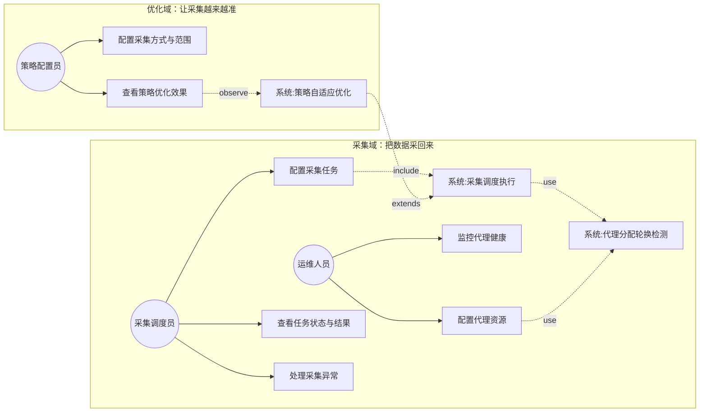
```mermaid
flowchart LR
  subgraph 采集域["采集域：把数据采回来"]
    A1((采集调度员))
    A3((运维人员))
    UC1[配置采集任务]
    UC2[查看任务状态与结果]
    UC3[处理采集异常]
    UC4[配置代理资源]
    UC5[监控代理健康]
    UC9[系统:采集调度执行]
    UC10[系统:代理分配轮换检测]
    A1 --> UC1 & UC2 & UC3
    A3 --> UC4 & UC5
    UC1 -. include .-> UC9
    UC9 -. use .-> UC10
    UC4 -. use .-> UC10
  end
  subgraph 优化域["优化域：让采集越来越准"]
    A2((策略配置员))
    UC6[配置采集方式与范围]
    UC7[查看策略优化效果]
    UC8[系统:策略自适应优化]
    A2 --> UC6 & UC7
    UC7 -. observe .-> UC8
  end
  UC8 -. extends .-> UC9
```

---

**第③步 理清流程**（工具：时序图 ｜ 产物：需求范围 ｜ 验收：是否穷举相关子系统）

采集执行的正常流程涉及 6 个子系统/组件，每个都是流程的必要参与者：

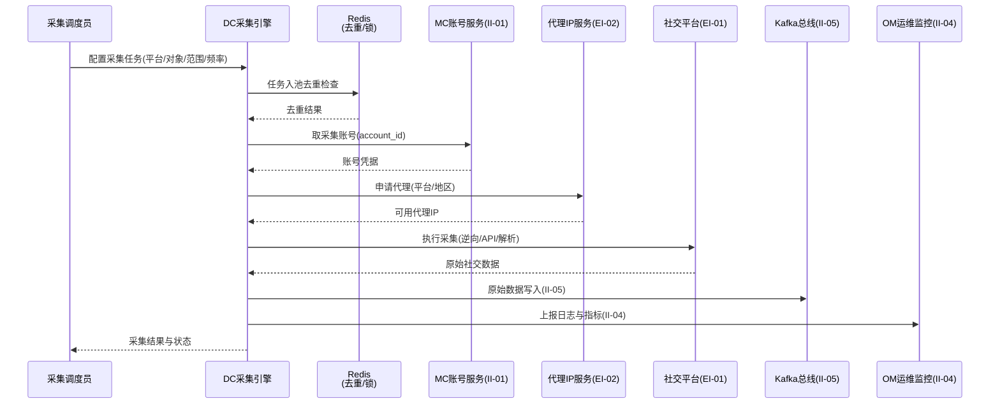
```mermaid
sequenceDiagram
  participant 调度员 as 采集调度员
  participant DC as DC采集引擎
  participant Redis as Redis<br/>(去重/锁)
  participant MC as MC账号服务(II-01)
  participant 代理 as 代理IP服务(EI-02)
  participant 平台 as 社交平台(EI-01)
  participant Kafka as Kafka总线(II-05)
  participant OM as OM运维监控(II-04)
  调度员->>DC: 配置采集任务(平台/对象/范围/频率)
  DC->>Redis: 任务入池去重检查
  Redis-->>DC: 去重结果
  DC->>MC: 取采集账号(account_id)
  MC-->>DC: 账号凭据
  DC->>代理: 申请代理(平台/地区)
  代理-->>DC: 可用代理IP
  DC->>平台: 执行采集(逆向/API/解析)
  平台-->>DC: 原始社交数据
  DC->>Kafka: 原始数据写入(II-05)
  DC->>OM: 上报日志与指标(II-04)
  DC-->>调度员: 采集结果与状态
```

注：任务池的另一个任务来源是情报回注（II-15，来自后续"情报驱动闭环采集"需求），它复用同一条调度链路与同一套去重、配额约束。

---

**第④步 理清流程-异常**（工具：流程图 ｜ 产物：异常场景 ｜ 验收：每个交互点是否都有异常分支）

按交互点穷举异常分支，其中前 5 项全部服务于"让采集继续"，是采集域内部的健壮性保障；第 6 项属优化域自身的健壮性问题：

| 交互点 | 异常分支 | 应对 |
|--------|---------|------|
| DC ↔ 社交平台 | 逆向接口失效或改版 | 告警 + 切换备用采集方式 |
| DC ↔ 社交平台 | API 限流 | 按限额退避重试 |
| DC ↔ 代理 | 单个代理失效/检测超时 | 剔除该代理 + 补充新代理 |
| DC ↔ 代理 | 代理全部失效 | 告警 + 暂停受影响采集任务 |
| DC ↔ MC 账号 | 账号被封 | 切换备用账号 |
| DC ↔ 策略优化 | 指标不足或波动过大 | 维持上一稳定策略 + 告警（防抖动） |

---

**第⑤步 列出规则**（工具：表格 ｜ 产物：验证点 ｜ 验收：规则是否可测、是否落到具体需求内）

| 规则                  | 可测的验证点            | 归属子目标  |
| ------------------- | ----------------- | ------ |
| IG 逆向采集推荐/人物/Reels  | 给定 IG 目标，能采到这三类数据 | ①②采到数据 |
| TikTok/FB/X 逆向采集    | 给定目标，能采到数据        | ①②采到数据 |
| 采集用代理 + 维护账号应对限制    | 无代理/账号时采集失败，有则成功  | ③采得稳   |
| 代理按平台地区分配 + 定时轮换    | 代理分配符合策略、按周期轮换    | ③采得稳   |
| 代理可用性检测 + 失效剔除      | 注入失效代理，被剔除且补新     | ③采得稳   |
| 任务池 Redis 去重 + 分布式锁 | 重复任务不入池、并发不冲突     | ④有序可控  |
| 范围/频率/并发配额限流        | 超配额任务被限流          | ④有序可控  |
| 支撑情报回注入池去重（II-15）   | 回注任务经同一去重与配额约束    | ④有序可控  |
| 基于封禁率/成功率/反爬信号主动调策略 | 指标变化后策略优先级/频率被调整  | ⑤越采越准  |
| 指标不足/波动维持稳定 + 告警    | 指标不足时策略不变且告警      | ⑤越采越准  |

---

**拆分结论（含四原则校验）**

五步分析的产物共同指向：子目标 ①②③④ 构成一条端到端价值链——"采集调度员下发任务 → 经账号/代理/去重/限流 → 采到数据进 Kafka → 上报 OM"；子目标 ⑤ 是独立价值——使用角色不同（策略配置员）、验收独立（策略能否基于指标主动调整）、独立性满足（策略优化失效时基本采集仍能运行）。

初步按"采集价值链(①②③④) + 策略优化(⑤)"拆为 2 个需求后，用拆分四原则（足够小、端到端、独立性、可测性）逐一校验，发现采集侧需求在"足够小"上不达标——它把多平台逆向采集、代理池全生命周期、任务调度去重限流、多类异常应对塞进同一个需求，范围与复杂度过大，无法独立交付与验收。

一个端到端价值可拆成多个端到端可用的增量，每个增量都让用户感知到价值提升。据此把采集价值链进一步拆为 3 个端到端增量，连同策略优化共 4 个需求。校验结果如下：

| 需求                 | 足够小                | 端到端                 | 独立性                | 可测性            |
| ------------------ | ------------------ | ------------------- | ------------------ | -------------- |
| R-DC-001 多平台数据采集   | ✅ 聚焦平台×采集方式与基本异常应对 | ✅ 下发任务→采到数据→进 Kafka | ✅ 无依赖（MVP）         | ✅ 各平台可采到数据     |
| R-DC-002 代理 IP 池管理 | ✅ 聚焦代理池全生命周期       | ✅ 配置代理→代理可用且持续健康    | ✅ 建立在 001 之上，可单独交付 | ✅ 代理分配/轮换/剔除可验 |
| R-DC-003 采集任务调度与限流 | ✅ 聚焦任务池/去重/调度/限流   | ✅ 任务入池→有序调度→不重复不失控  | ✅ 建立在 001 之上，可单独交付 | ✅ 去重/配额可验      |
| R-DC-004 采集策略自适应优化 | ✅ 聚焦策略主动调整         | ✅ 看指标→调策略→成功率不退化    | ✅ 建立在 001 之上       | ✅ 策略随指标调整可验    |

依赖关系：R-DC-002、R-DC-003、R-DC-004 均建立在 R-DC-001 之上（R-DC-001 含采集时的基本代理使用与账号使用，R-DC-002 专门管理代理池的分配/轮换/检测/剔除）。三者之间相互独立，可并行推进。

###### R-DC-001 多平台数据采集

**需求目的**：从 TikTok、Instagram、Facebook、YouTube、X 等海外社交平台采集原始社交数据（用户信息、内容、互动数据、关系数据），作为后续分析与情报的数据来源。采集时使用代理 IP 与维护账号应对平台反爬与风控，并把采集到的原始数据经 Kafka 总线流转。

**使用角色**：数据采集调度员（配置与管理采集任务）。

**前置条件**：目标平台采集手段（逆向、模拟点击、官方 API、网页解析）已就绪；代理 IP 与维护账号可用（账号由 MC 账号权威源提供，见 II-01，代理池由 R-DC-002 管理）；爬虫集群与 Kafka 等基础组件已按运行环境需求部署可用。

**输入**：目标平台标识与采集任务（采集对象、范围、频率、使用的采集方式）。

**输出**：采集到的原始社交数据（经 Kafka 总线 II-05 流转）。

**业务规则**：

| 规则     | 说明                                                      |
| ------ | ------------------------------------------------------- |
| 平台采集方式 | Instagram 逆向采集推荐、人物、Reels；TikTok、Facebook 逆向采集；X 逆向采集   |
| 防封手段   | 采集时使用代理 IP 与维护账号，应对平台访问限制（代理来自 R-DC-002 代理池，账号来自 II-01） |

**异常场景**：逆向接口失效或改版时告警并切换备用采集方式；API 限流时按限额退避重试；账号被封时切换备用账号。

**验收标准**：各平台可通过对应采集手段获取数据；采集过程可使用代理与账号应对访问限制；采集异常可告警并切换备选手段。

**关联接口**：EI-01 社交平台交互、II-01 账号服务（入，取采集账号）、II-04 日志指标上报（至 OM）、II-05 Kafka 总线（出）。

###### R-DC-002 代理 IP 池管理

**需求目的**：面向海外社交平台采集提供代理网络出口，管理代理 IP 池的分配、轮换、可用性检测与失效剔除，保证采集出口持续稳定可用、降低单 IP 被风控概率。

**使用角色**：系统运维人员（配置代理资源、监控代理健康）。

**前置条件**：VPS 代理链路对接可用（EI-02）；R-DC-001 采集已运行、对代理有实际使用。

**输入**：代理 IP 与 VPS 代理链路配置、平台与地区代理分配策略。

**输出**：可用代理 IP 列表（供 R-DC-001 采集使用）、代理可用性状态、轮换日志。

**业务规则**：

| 规则       | 说明                      |
| -------- | ----------------------- |
| 按平台与地区分配 | 代理池对接 VPS 链路，按平台与地区分配代理 |
| 定时轮换     | 代理定时轮换，降低单 IP 被风控概率     |
| 可用性检测    | 对代理进行可用性检测              |
| 失效剔除     | 检测失败/超时的代理剔除并补充新代理      |

**异常场景**：代理全部失效时告警并暂停受影响的采集任务；代理检测超时时剔除该代理并补充新代理。

**验收标准**：代理按策略分配、定时轮换并自动剔除失效节点；全部失效可告警并暂停受影响采集任务。

**关联接口**：EI-02 代理 IP 服务、II-04 日志指标上报（至 OM）。

###### R-DC-003 采集任务调度与限流

**需求目的**：对采集任务进行有序调度，保证采得不重复、不丢失、不失控——基于 Redis 实现任务与 URL 去重、调度队列与分布式锁，并对采集范围、频率、并发设配额上限超限自动限流，支撑情报回注入池去重与配额约束（II-15）。

**使用角色**：数据采集调度员（查看与管理任务调度状态与队列）。

**前置条件**：R-DC-001 采集已运行；Redis 基础组件已按运行环境需求部署可用。

**输入**：采集任务（来自 R-DC-001 任务配置与 II-15 情报回注）、采集配额参数（范围/频率/并发上限）。

**输出**：调度指令与去重结果、任务队列状态。

**业务规则**：

| 规则   | 说明                                          |
| ---- | ------------------------------------------- |
| 任务去重 | 维护采集任务池，基于 Redis 实现 URL 与任务去重、调度队列与分布式锁     |
| 配额限流 | 对采集范围、频率、并发设配额上限，超限自动限流                     |
| 回注约束 | 支撑情报回注入池去重与配额约束（II-15），回注任务与常规任务受同一套去重与配额约束 |

**异常场景**：任务队列积压时告警。

**验收标准**：任务调度与去重功能生效且配额限流可对采集范围、频率、并发设上限；情报回注任务经同一去重与配额约束。

**关联接口**：II-05 Kafka 总线（入，消费原始数据协同）、II-15 情报回注采集接口（入，回注任务来源）。

###### R-DC-004 采集策略自适应优化

**需求目的**：基于历史采集指标（封禁率、采集成功率、反爬升级信号、各采集手段的有效率）对采集策略进行主动调整，使采集策略随平台反爬强度变化自适应演进，而非仅被动应对单次异常，保证长周期内采集成功率不退化。

**使用角色**：采集策略配置人员（查看策略优化效果、设定优化边界）。

**前置条件**：R-DC-001 采集已运行并持续产出历史采集指标。

**输入**：历史采集指标（封禁率、采集成功率、反爬升级信号、各采集手段有效率）、优化边界参数。

**输出**：策略调整决策（采集手段优先级排序、请求频率与并发调节、代理与账号选择策略优化）、策略调整记录与效果对比。

**业务规则**：

| 规则 | 说明 |
|------|------|
| 主动优化 | 基于历史采集指标主动调整采集手段优先级排序、请求频率与并发调节、代理与账号选择策略 |
| 自适应演进 | 策略随平台反爬强度变化自适应演进，非仅被动应对单次异常 |
| 稳定保障 | 指标不足或波动过大时维持上一稳定策略并告警，避免策略频繁抖动 |

**异常场景**：策略自优化指标不足或波动过大时维持上一稳定策略并告警，避免策略频繁抖动。

**验收标准**：采集策略可基于历史采集指标进行主动调整；策略调整可在指标不足或波动过大时维持稳定并告警。

**关联接口**：II-04 日志指标上报（至 OM）。

> 说明：DC 子系统的三项用户需求（社交媒体数据采集、数据处理与存储、情报驱动采集与目标扩散）均已按"目标澄清 → 梳理场景 → 理清流程 → 理清流程-异常 → 列出规则"五步分析，并按"足够小、端到端、独立性、可测性"四原则重新划分为 R-DC-001 ~ R-DC-008 共 8 个需求（原「数据分析与情报」R-DC-007~010 已移至 OCC 子系统「目标识别与维护」下，重编号为 R-OCC-002~005；原 R-DC-011/012 情报回注与目标扩散顺延为 R-DC-007/008）。

##### 数据处理与存储

**用户需求概述**：对采集到的原始数据进行清洗加工并持久化存储，提供标准的大数据 ETL 链路，完成数据的抽取、转换与加载。处理结果写入 ClickHouse 列式库（明细）、关系库（元数据/索引）与 NebulaGraph 图库（关系数据），供后续分析与检索使用。

---

**第①步 目标澄清**（工具：干系人多角度分析 ｜ 产物：子目标清单 ｜ 验收：是否穷举所有干系人的价值诉求）

| 序 | 子目标 | 干系人 |
|----|--------|--------|
| 1 | 系统能把原始数据清洗成结构化、标准化的干净数据 | 数据生产方（系统自动）|
| 2 | 清洗后的数据能可靠地落入不同的存储（ClickHouse/关系库/NebulaGraph），供下游按需读取 | 数据消费方（分析人员、后续分析需求）|

---

**第②步 梳理场景**（工具：用例图 ｜ 产物：场景 ｜ 验收：是否穷举所有用户操作）

| 角色 | 操作 |
|------|------|
| 系统（自动） | 消费 Kafka 原始数据、执行 ETL 清洗加工、写入多模型存储、隔离坏数据 |
| 数据分析人员 | 查询/读取加工后的结构化数据（本需求中仅作为消费方，具体分析操作见下一需求）|

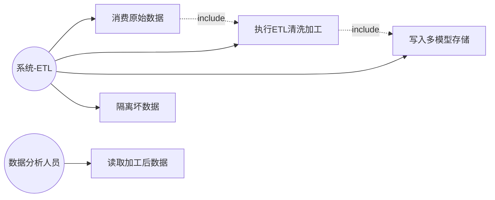
```mermaid
flowchart LR
  A1((系统-ETL))
  A2((数据分析人员))
  UC1[消费原始数据]
  UC2[执行ETL清洗加工]
  UC3[写入多模型存储]
  UC4[隔离坏数据]
  UC5[读取加工后数据]
  A1 --> UC1 & UC2 & UC3 & UC4
  A2 --> UC5
  UC1 -. include .-> UC2
  UC2 -. include .-> UC3
```

---

**第③步 理清流程**（工具：时序图 ｜ 产物：需求范围 ｜ 验收：是否穷举相关子系统）

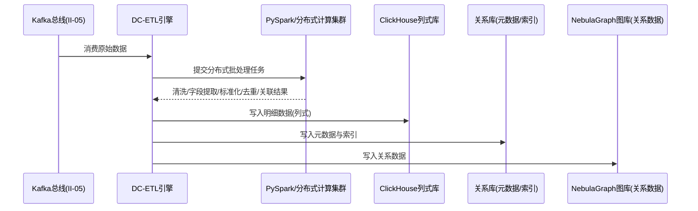
```mermaid
sequenceDiagram
  participant Kafka as Kafka总线(II-05)
  participant ETL as DC-ETL引擎
  participant Spark as PySpark/分布式计算集群
  participant HB as ClickHouse列式库
  participant RL as 关系库(元数据/索引)
  participant GB as NebulaGraph图库(关系数据)
  Kafka->>ETL: 消费原始数据
  ETL->>Spark: 提交分布式批处理任务
  Spark-->>ETL: 清洗/字段提取/标准化/去重/关联结果
  ETL->>HB: 写入明细数据(列式)
  ETL->>RL: 写入元数据与索引
  ETL->>GB: 写入关系数据
```

---

**第④步 理清流程-异常**（工具：流程图 ｜ 产物：异常场景 ｜ 验收：每个交互点是否都有异常分支）

| 交互点 | 异常分支 | 应对 |
|--------|---------|------|
| ETL ↔ Spark | 计算节点失败 | 任务自动重试或转移 |
| ETL ↔ 原始数据 | 数据格式异常 | 隔离坏数据并记录 |
| ETL ↔ ClickHouse/关系库 | 写入失败 | 数据进入重试队列 |

---

**第⑤步 列出规则**（工具：表格 ｜ 产物：验证点 ｜ 验收：规则是否可测、是否落到具体需求内）

| 规则 | 可测的验证点 | 归属子目标 |
|------|------------|-----------|
| 分布式批处理（PySpark） | 给定批量原始数据，经分布式计算完成清洗 | ①清洗成干净数据 |
| 清洗内容（字段提取/格式标准化/去重/关联） | 输出数据字段完整、格式统一、无重复 | ①清洗成干净数据 |
| 结果写 ClickHouse 列式库 | 明细数据可从 ClickHouse 读回 | ②落入多存储 |
| 元数据/索引写关系库 | 可按关系库索引检索到对应明细 | ②落入多存储 |
| 关系数据写图库 | 关系数据可在图库中查询 | ②落入多存储 |

---

**拆分结论（含四原则校验）**

子目标 ①（清洗）与 ②（落库）是串行但各自端到端可验收的两个环节：清洗的产物（干净数据）本身可验证（字段/格式/去重是否达标），落库的产物（多模型存储可读）本身也可验证。两者异常分支独立（节点失败重试 vs 写入重试）。校验如下：

| 需求                | 足够小         | 端到端         | 独立性          | 可测性      |
| ----------------- | ----------- | ----------- | ------------ | -------- |
| R-DC-005 数据清洗加工   | ✅ 聚焦 ETL 清洗 | ✅ 原始数据→干净数据 | ✅ 独立         | ✅ 清洗结果可验 |
| R-DC-006 多模型持久化存储 | ✅ 聚焦多存储落库   | ✅ 干净数据→可读存储 | ✅ 建立在 005 之上 | ✅ 各库可读可验 |
|                   |             |             |              |          |

###### R-DC-005 数据清洗加工

**需求目的**：对经 Kafka 总线流入的采集原始数据进行分布式批处理清洗，完成字段提取、格式标准化、去重与关联，产出结构化的干净数据，作为持久化存储与分析的输入。

**使用角色**：系统（自动执行 ETL 流程）。

**前置条件**：PySpark 分布式计算集群可用；R-DC-001 采集已产出原始数据并经 Kafka 总线（II-05）流转。

**输入**：采集到的原始数据（经 Kafka 总线 II-05 消费）。

**输出**：清洗加工后的结构化数据。

**业务规则**：

| 规则 | 说明 |
|------|------|
| 分布式批处理 | 基于 PySpark 进行分布式批处理计算 |
| 清洗内容 | 完成数据清洗、字段提取、格式标准化、去重与关联 |

**异常场景**：计算节点失败时任务自动重试或转移；数据格式异常时隔离坏数据并记录。

**验收标准**：原始数据可经分布式计算完成清洗与标准化；处理过程对节点失败具备重试能力；坏数据被隔离并记录。

**关联接口**：II-05 Kafka 总线（入，消费原始数据）。

###### R-DC-006 多模型持久化存储

**需求目的**：将清洗后的结构化数据按数据特征持久化到不同的存储模型——明细数据入 ClickHouse 列式库、元数据与索引入关系库、关系数据入 NebulaGraph 图库，供后续分析与检索按需读取。

**使用角色**：系统（自动写入）、数据分析人员（消费加工后的数据）。

**前置条件**：R-DC-005 清洗加工已产出结构化数据；ClickHouse、关系型数据库与 NebulaGraph 图库可写入。

**输入**：R-DC-005 产出的清洗加工后结构化数据。

**输出**：持久化于 ClickHouse（明细）、关系库（元数据/索引）、NebulaGraph 图库（关系数据）的可读数据。

**业务规则**：

| 规则 | 说明 |
|------|------|
| 列式存储 | 处理结果写入 ClickHouse 列式数据库 |
| 元数据与索引 | 元数据与索引写入关系型数据库 |
| 关系数据 | 关系数据写入 NebulaGraph 图库 |

**异常场景**：写入 ClickHouse 或关系库失败时数据进入重试队列。

**验收标准**：清洗后结果可正确写入 ClickHouse、关系库与 NebulaGraph 图库；写入失败可进入重试队列重试。

**关联接口**：无外部接口，为 DC 内部存储层。

##### 情报驱动采集与目标扩散

**用户需求概述**：打通"分析→采集"反向驱动链路，使 OCC 数据分析与情报（R-OCC-002~005）产出的目标个体、关联实体与传播节点能够自动或经人工确认后回注 DC 采集任务池（经 II-15 接口），并支持以已采集目标为起点按关系（关注/粉丝/互动/转发链/评论链）逐层扩散采集，形成"发现线索→定向扩散采集→锁定目标"的情报驱动闭环。本能力区分两类扩散：DC 侧的"目标扩散采集"（图扩展式爬取，本期实现）与 OCC 侧的"扩散趋势预判"（传播预测分析，见附录"本期暂不实现的 OCC 能力"，本期不做）。

---

**第①步 目标澄清**（工具：干系人多角度分析 ｜ 产物：子目标清单 ｜ 验收：是否穷举所有干系人的价值诉求）

| 序 | 子目标 | 干系人 |
|----|--------|--------|
| 1 | 分析产出的高价值目标能自动回流成采集任务（把"分析→采集"链路打通，让情报驱动采集） | 情报分析人员、系统下游 |
| 2 | 回注的采集不重复采已采过的目标，避免浪费 | 成本/可控性诉求 |
| 3 | 高风险（高扩散/批量/敏感）回注有人把闸，防止采集范围失控 | 情报分析人员、可控性诉求 |
| 4 | 能以已采集目标为起点，按关系逐层扩散采集新目标，把目标网络的边采全 | 情报分析人员 |
| 5 | 扩散可控、可终止，达到上限自动停，不无限蔓延 | 可控性诉求 |

---

**第②步 梳理场景**（工具：用例图 ｜ 产物：场景 ｜ 验收：是否穷举所有用户操作）

| 角色 | 操作 |
|------|------|
| 情报分析人员 | 确认回注策略（自动/人工确认）、审批高风险回注（人工确认闸门）、配置扩散参数（关系类型/层数/去重范围）、启动/停止扩散、查看扩散进度 |
| 系统（自动） | 按规则自动生成回注任务、回注入池去重、触发复查任务、执行 BFS 扩散调度、迭代扩散、达到上限自动停止 |

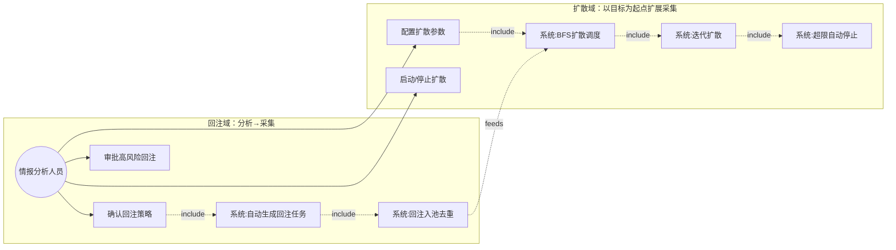
```mermaid
flowchart LR
  subgraph 回注域["回注域：分析→采集"]
    A1((情报分析人员))
    UC1[确认回注策略]
    UC2[审批高风险回注]
    UC3[系统:自动生成回注任务]
    UC4[系统:回注入池去重]
    A1 --> UC1 & UC2
    UC1 -. include .-> UC3
    UC3 -. include .-> UC4
  end
  subgraph 扩散域["扩散域：以目标为起点扩展采集"]
    UC5[配置扩散参数]
    UC6[启动/停止扩散]
    UC7[系统:BFS扩散调度]
    UC8[系统:迭代扩散]
    UC9[系统:超限自动停止]
    A1 --> UC5 & UC6
    UC5 -. include .-> UC7
    UC7 -. include .-> UC8
    UC8 -. include .-> UC9
  end
  UC4 -. feeds .-> UC7
```

---

**第③步 理清流程**（工具：时序图 ｜ 产物：需求范围 ｜ 验收：是否穷举相关子系统）

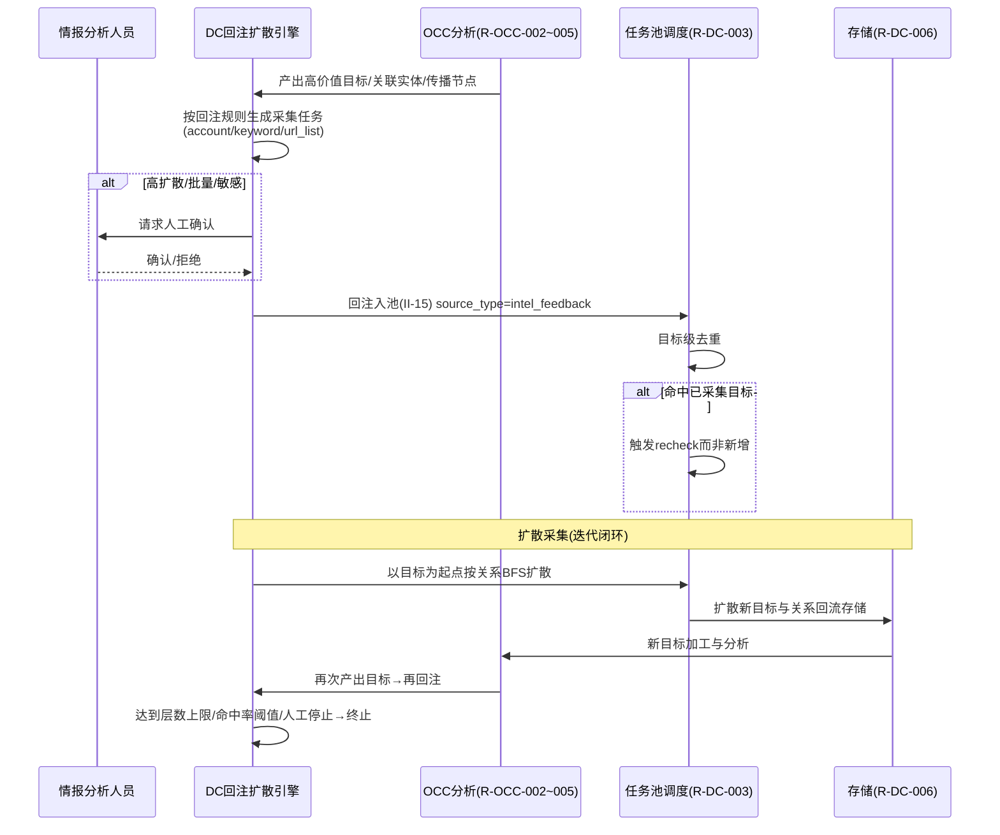
```mermaid
sequenceDiagram
  participant 分析员 as 情报分析人员
  participant DC as DC回注扩散引擎
  participant 分析 as OCC分析(R-OCC-002~005)
  participant 任务池 as 任务池调度(R-DC-003)
  participant 存储 as 存储(R-DC-006)
  分析->>DC: 产出高价值目标/关联实体/传播节点
  DC->>DC: 按回注规则生成采集任务<br/>(account/keyword/url_list)
  alt 高扩散/批量/敏感
    DC->>分析员: 请求人工确认
    分析员-->>DC: 确认/拒绝
  end
  DC->>任务池: 回注入池(II-15) source_type=intel_feedback
  任务池->>任务池: 目标级去重
  alt 命中已采集目标
    任务池->>任务池: 触发recheck而非新增
  end
  Note over DC,存储: 扩散采集(迭代闭环)
  DC->>任务池: 以目标为起点按关系BFS扩散
  任务池->>存储: 扩散新目标与关系回流存储
  存储->>分析: 新目标加工与分析
  分析->>DC: 再次产出目标→再回注
  DC->>DC: 达到层数上限/命中率阈值/人工停止→终止
```

---

**第④步 理清流程-异常**（工具：流程图 ｜ 产物：异常场景 ｜ 验收：每个交互点是否都有异常分支）

| 交互点 | 异常分支 | 应对 |
|--------|---------|------|
| 回注入池去重 | 去重后无新增目标 | 记录并跳过 |
| 人工确认闸门 | 确认超时未响应 | 按默认策略（不入池）处理并记录 |
| 扩散层数/目标数 | 超限或超阈值 | 自动停止并告警 |
| 扩散关系数据 | 缺失或不完整 | 降级为已采集层的部分结果 |

---

**第⑤步 列出规则**（工具：表格 ｜ 产物：验证点 ｜ 验收：规则是否可测、是否落到具体需求内）

| 规则 | 可测的验证点 | 归属子目标 |
|------|------------|-----------|
| 按规则自动生成定向采集任务（account/keyword/url_list） | 分析产出能生成对应类型任务 | ①回注打通 |
| 回注任务携带 source_type=intel_feedback 与来源情报标识 | 任务元数据含来源标识（可审计） | ①回注打通 |
| 回注入池目标级去重 | 重复目标不入池 | ②不重复 |
| 命中已采集触发 recheck 而非新增 | 已采目标触发复查类任务 | ②不重复 |
| 高扩散/批量/敏感回注经人工确认闸门 | 高风险回注未经确认不入池 | ③有人把闸 |
| 以目标为起点按关系类型+层数 BFS 图扩展 | 能扩散采集到新目标 | ④扩散采全 |
| 每层新节点去重后生成新任务 | 扩散新节点不重复采集 | ④扩散采全 |
| 层数/单层节点数/总目标数上限超限停止告警 | 超上限扩散自动停止 | ⑤可控终止 |
| 受 R-DC-003 配额限流约束 | 扩散任务不超配额 | ⑤可控终止 |

---

**拆分结论（含四原则校验）**

本需求含两条流程不同的价值链：① 情报回注（分析产出→生成任务→回注入池→去重，单向驱动，把"分析→采集"打通）；② 目标扩散采集（以已采集目标为起点按关系 BFS 图扩展，经存储→分析→再回注形成迭代闭环）。回注是扩散的前提与触发源（II-15 接口先回注入池，扩散再以目标为起点展开），但两者异常分支独立（回注去重/确认超时 vs 扩散超限/关系缺失），可分别独立交付与验收。校验如下：

| 需求 | 足够小 | 端到端 | 独立性 | 可测性 |
|------|--------|--------|--------|--------|
| R-DC-007 情报回注采集 | ✅ 聚焦回注打通 | ✅ 分析产出→入池任务 | ✅ 独立（单向驱动） | ✅ 回注/去重/闸门可验 |
| R-DC-008 目标扩散采集 | ✅ 聚焦 BFS 扩散闭环 | ✅ 起点→扩散→回流→再回注 | ✅ 建立在 007 之上 | ✅ 扩散/超限/迭代可验 |

> 区分说明：本需求的"目标扩散采集"是 DC 侧图扩展采集（把目标网络的边采全）；OCC 侧的"扩散趋势预判"是传播预测分析（预判传播会怎么扩散），本期不做（见附录）。

###### R-DC-007 情报回注采集

**需求目的**：打通"分析→采集"反向驱动链路，使分析产出的高价值目标个体、关联实体与传播节点能按回注规则自动生成定向采集任务回注任务池，经目标级去重避免重复采集，高风险回注经人工确认闸门，形成可审计的情报驱动采集入口。

**使用角色**：情报分析人员（确认回注策略、审批高风险回注）、系统（自动生成回注任务与去重）。

**前置条件**：OCC 分析结果可读（R-OCC-002~005，经 II-15 接口提供）；R-DC-003 任务池与调度可用。

**输入**：分析产出的目标个体集合与关联实体（来自 OCC 分析 R-OCC-002~005，经 II-15 接口）、回注规则（自动/人工确认、优先级）。

**输出**：回注生成的采集任务（写入 task_pool，携带 source_type=intel_feedback 与来源情报标识）、回注审计记录。

**业务规则**：

| 规则 | 说明 |
|------|------|
| 自动生成回注任务 | 分析产出的高价值目标个体、关联实体、传播节点，按回注规则自动生成定向采集任务（account/keyword/url_list 类型） |
| 可审计标识 | 回注任务携带 source_type=intel_feedback 与来源情报标识，满足情报可审计性 |
| 入池目标级去重 | 回注任务经 R-DC-003 的入池目标级去重，避免对已采集目标重复下发 |
| 命中触发复查 | 命中已采集目标时触发复查类任务（recheck）而非新增采集 |
| 人工确认闸门 | 对高扩散层数、大规模批量或敏感目标的回注，须经情报分析人员确认后方可入池 |

**异常场景**：回注任务入池去重后无新增目标时记录并跳过；人工确认超时未响应时按默认策略（不入池）处理并记录。

**验收标准**：分析产出的目标可回注生成采集任务并写入任务池；回注任务经目标级去重后不重复采集已采集目标；高扩散/批量/敏感回注经人工确认闸门。

**关联接口**：II-15 情报回注采集接口（OCC 分析 R-OCC-002~005 → DC 任务池，跨子系统回注闭环）。

###### R-DC-008 目标扩散采集

**需求目的**：以已采集目标为起点，按指定关系类型（关注/粉丝/互动/转发链/评论链）与扩散层数进行图扩展式采集，每层发现的新节点经去重后生成新采集任务，形成广度优先的目标网络扩展；扩散新目标经存储与分析后可再次触发回注与进一步扩散，直至达到上限或人工停止，形成可控的迭代扩散闭环。

**使用角色**：情报分析人员（配置扩散参数、启动/停止扩散）、系统（自动 BFS 扩散调度与迭代）。

**前置条件**：R-DC-007 情报回注已可入池；R-DC-006 关系数据已入图数据库；R-DC-003 配额限流可用。

**输入**：扩散起点目标与扩散参数（关系类型、层数、去重范围）。

**输出**：扩散采集的新目标与关系数据（回流至 R-DC-006 存储）、扩散审计记录。

**业务规则**：

| 规则 | 说明 |
|------|------|
| 图扩展采集 | 以已采集目标为起点，按指定关系类型（关注/粉丝/互动/转发链/评论链）与扩散层数进行图扩展式采集 |
| 逐层去重 | 每层发现的新节点经去重后生成新采集任务，形成广度优先的目标网络扩展 |
| 迭代扩散闭环 | 扩散采集的新目标经 R-DC-005 加工与 R-DC-006 存储及 OCC 分析（R-OCC-002~005）后，可再次触发回注与进一步扩散 |
| 可控终止 | 直至达到扩散层数上限、去重命中率阈值或人工停止，形成可控的迭代扩散 |
| 配额约束 | 扩散任务受 R-DC-003 配额限流约束，扩散层数、单层节点数、总目标数设上限 |

**异常场景**：扩散层数超限或目标数超阈值时自动停止并告警；扩散关系数据缺失或不完整时降级为已采集层的部分结果。

**验收标准**：以目标为起点可按关系类型与层数扩散采集新目标；扩散采集受配额与层数上限约束，超限自动停止并告警；扩散新目标可回流存储并再次触发回注，形成迭代扩散闭环；以人工抽检方式核验，扩散采集的新目标有效率（经核验确属目标网络有效节点的比例）不低于 80%，噪声率（无效/不相关节点占比）不高于 20%（抽检样本量与门槛在详细设计阶段确定）。

**关联接口**：II-15 情报回注采集接口（迭代回流）、II-05 Kafka 总线（扩散新数据流转）。

#### 多设备矩阵自动化群控子系统（MC）

本子系统定位为"统一自动化执行引擎与多终端执行网关"，是所有执行终端动作的唯一收口，并承担账号资源管理与智能体执行宿主两项职责。子系统核心职责为：统一管理四类执行终端——移动端（真机、云手机、ARM 板卡、虚拟化真机）与桌面端（指纹浏览器 Profile）的接入、远程控制、指纹与代理隔离；承担账号资源（注册、凭据、验证、风险评估、生命周期、账号分类）的统一维护与共享分发；作为智能体的执行宿主，持存蜂群智能体子系统同步来的智能体定义并在任务执行时调用；提供脚本模式与智能体模式两种执行引擎；以统一执行网关的形式收口所有落到任何执行终端的动作，保证每一个动作可观测、可审计、可熔断。

本子系统是账号资源的平台级权威源，负责注册、验证、养护策略与生命周期等主数据的维护，并经事件总线向数据爬取（DC）、蜂群智能体（SWM）、舆情作战（OCC）等使用方共享分发账号标识（account_id）。账号按终端类型遵循差异化的绑定规则：真机、云手机、虚拟化真机出于风控要求执行"一设备一账号一 IP"，指纹浏览器 Profile 执行"一 Profile 一账号一 IP"（浏览器实例可多开）。内容资源由舆情作战业务子系统（OCC）统一管理（见 R-OCC-009），本子系统仅作为内容使用方引用内容标识（content_id）进行内容投放。

子系统遵循两条基本原则。其一，动作收口原则：无论动作来自脚本引擎还是智能体引擎，所有执行终端动作（点击、输入、滑动、安装、发布、养号动作等）均经执行网关落地，执行网关负责鉴权、记录、熔断与转发，动作日志全量上报运维监控子系统。其二，推理与执行分离原则：智能体模式下的视觉推理由智能体调用底层私有化大模型部署（IRS）的本地大模型完成，不经执行网关；推理产出的动作指令再经执行网关落地，从而兼顾推理的低延迟与执行的可观测。

##### 执行终端与环境管理

**用户需求概述**：统一管理四类执行终端（移动端：真机、云手机、ARM 板卡、虚拟化真机；桌面端：指纹浏览器 Profile）的接入、创建、分组、状态监控、风控分级与基础操作，并管理终端环境与应对平台风控——通过终端指纹管理、风控信号识别、代理分配与环境隔离降低账号与终端被处置的风险，为远控、群控与任务执行提供终端资源池。

---

**第①步 目标澄清**（工具：干系人多角度分析 ｜ 产物：子目标清单 ｜ 验收：是否穷举所有干系人的价值诉求）

| 序 | 子目标 | 干系人 |
|----|--------|--------|
| 1 | 设备运维人员能把移动端设备和浏览器 Profile 注册接入系统、统一管理，并实时掌握终端状态 | 设备运维人员 |
| 2 | 运营人员能对一组终端做批量操作（安装、重启、截图、创建/启停 Profile），提高管理效率 | 运营人员 |
| 3 | 每个终端有可信、稳定、独特的设备身份（指纹固化），像真人，降低被风控识别的概率 | 设备运维人员、风控诉求 |
| 4 | 终端之间环境相互隔离（指纹/网络/账号/Cookie），避免关联被一锅端 | 风控诉求 |
| 5 | 任务调度能按终端风控分级选终端，养号等高敏感场景优先用高真实度终端 | 任务调度 |
| 6 | 系统能识别平台风控信号并主动规避，风控持续时降级该终端，避免账号被处置 | 系统、风控诉求 |
| 7 | 每个终端绑定独立固定代理 IP，保证长期稳定的网络身份，代理失效时才切换 | 风控诉求 |

---

**第②步 梳理场景**（工具：用例图 ｜ 产物：场景 ｜ 验收：是否穷举所有用户操作）

| 角色 | 操作 |
|------|------|
| 设备运维人员 | 注册移动端终端（装 Agent）、创建/配置浏览器 Profile（指纹+代理）、查看终端台账与实时状态、配置指纹、分组与标签 |
| 运营人员 | 批量安装/卸载 App、批量重启、批量截图、批量创建/启停/关闭 Profile |
| 任务调度 | 按风控分级选用终端 |
| 系统（自动） | 采集终端状态与指标心跳、识别风控信号与规避、分配并固定绑定代理 IP、执行环境隔离 |

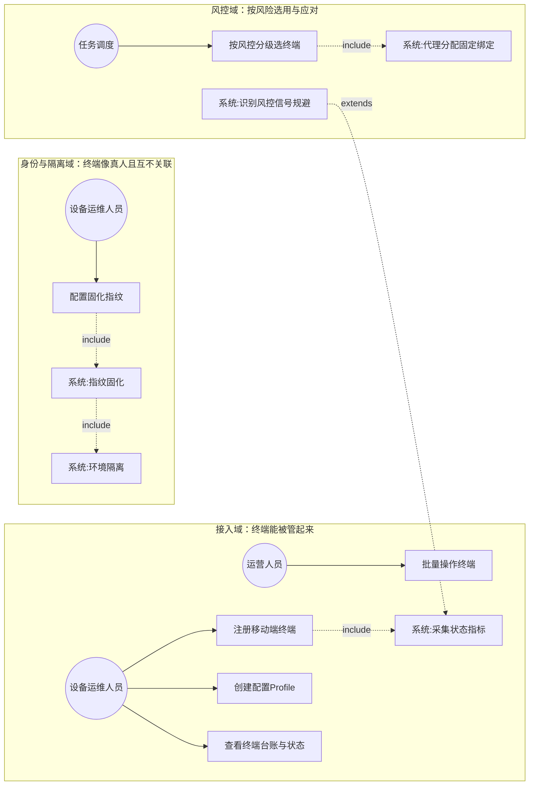
```mermaid
flowchart LR
  subgraph 接入域["接入域：终端能被管起来"]
    A1((设备运维人员))
    A2((运营人员))
    UC1[注册移动端终端]
    UC2[创建配置Profile]
    UC3[查看终端台账与状态]
    UC4[批量操作终端]
    UC5[系统:采集状态指标]
    A1 --> UC1 & UC2 & UC3
    A2 --> UC4
    UC1 -. include .-> UC5
  end
  subgraph 身份与隔离域["身份与隔离域：终端像真人且互不关联"]
    A1b((设备运维人员))
    UC6[配置固化指纹]
    UC7[系统:环境隔离]
    UC8[系统:指纹固化]
    A1b --> UC6
    UC6 -. include .-> UC8
    UC8 -. include .-> UC7
  end
  subgraph 风控域["风控域：按风险选用与应对"]
    A3((任务调度))
    UC9[按风控分级选终端]
    UC10[系统:识别风控信号规避]
    UC11[系统:代理分配固定绑定]
    A3 --> UC9
    UC9 -. include .-> UC11
    UC10 -. extends .-> UC5
  end
```

---

**第③步 理清流程**（工具：时序图 ｜ 产物：需求范围 ｜ 验收：是否穷举相关子系统）

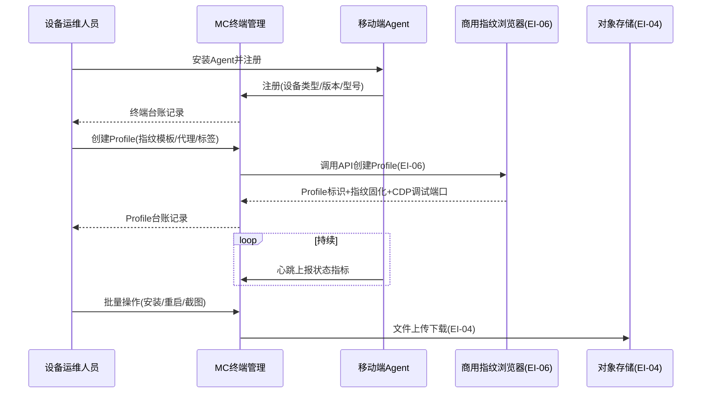
```mermaid
sequenceDiagram
  participant 运维 as 设备运维人员
  participant MC as MC终端管理
  participant Agent as 移动端Agent
  participant 商用 as 商用指纹浏览器(EI-06)
  participant 对象 as 对象存储(EI-04)
  运维->>Agent: 安装Agent并注册
  Agent->>MC: 注册(设备类型/版本/型号)
  MC-->>运维: 终端台账记录
  运维->>MC: 创建Profile(指纹模板/代理/标签)
  MC->>商用: 调用API创建Profile(EI-06)
  商用-->>MC: Profile标识+指纹固化+CDP调试端口
  MC-->>运维: Profile台账记录
  loop 持续
    Agent->>MC: 心跳上报状态指标
  end
  运维->>MC: 批量操作(安装/重启/截图)
  MC->>对象: 文件上传下载(EI-04)
```

---

**第④步 理清流程-异常**（工具：流程图 ｜ 产物：异常场景 ｜ 验收：每个交互点是否都有异常分支）

| 交互点 | 异常分支 | 应对 |
|--------|---------|------|
| Agent/Profile 连接 | 掉线 | 标记离线并告警 |
| Profile 启动 | 启动失败 | 记录错误码并重试 |
| 指纹配置 | 校验失败或配置冲突 | 拒绝启动并告警提示 |
| 终端指标 | 过热/存储满/内存超限 | 隔离并停止派发任务 |
| 风控信号 | 持续触发 | 降级或暂停该终端任务 |
| 代理 | 失效 | 切换备用代理并重新固定绑定 |
| 批量操作 | 部分失败 | 记录失败项并支持重试 |

---

**第⑤步 列出规则**（工具：表格 ｜ 产物：验证点 ｜ 验收：规则是否可测、是否落到具体需求内）

| 规则 | 可测的验证点 | 归属子目标 |
|------|------------|-----------|
| Agent 注册记录设备类型(真机/云手机/ARM/虚拟化真机) | 注册后台账含设备类型 | ①接入管理 |
| Profile 经商用 API 创建+指纹模板下发+CDP 返回 | Profile 创建后返回标识与调试端口 | ①接入管理 |
| 持续监控在线/离线/电量/CPU/内存/存储/网络 | 状态视图实时可见 | ①接入管理 |
| 批量安装卸载 App/重启/截图/创建启停 Profile | 批量指令可执行返回结果 | ②批量操作 |
| Canvas/WebGL/字体/时区/Audio/UA 等 20+ 维度指纹固化 | Profile 长期呈现一致指纹 | ③可信身份 |
| 移动端硬件与软件指纹可按需配置 | 指纹可配置 | ③可信身份 |
| Profile 间 Cookie/LocalStorage/缓存相互独立隔离 | 不同 Profile 环境互不关联 | ④环境隔离 |
| 终端间指纹/网络/账号环境相互隔离 | 终端间不关联 | ④环境隔离 |
| 按指纹真实度风控分级(真机/ARM 高/虚拟化真机中高/云手机中/Profile 中) | 分级标签正确 | ⑤按分级选终端 |
| 养号优先选用高真实度终端 | 选型符合优先级 | ⑤按分级选终端 |
| 识别平台风控信号并规避 | 风控信号被识别并触发应对 | ⑥风控规避 |
| 风控持续触发时降级或暂停终端任务 | 持续触发后任务被降级 | ⑥风控规避 |
| 每终端分配独立代理 IP 固定绑定(一终端一 IP) | 每终端绑定独立固定代理 | ⑦代理绑定 |
| 代理失效时切换新代理并重新固定绑定 | 失效后自动切换并重新固定 | ⑦代理绑定 |

---

**拆分结论（含四原则校验）**

七个子目标可归为三组端到端价值：①②"终端能被管起来"（接入、台账、状态、批量操作）；③④"终端像真人且互不关联"（指纹固化、环境隔离）；⑤⑥⑦"按风险选用终端并应对风控"（分级选型、风控识别、代理绑定）。三组各自有独立的用户价值与验收点。校验如下：

| 需求 | 足够小 | 端到端 | 独立性 | 可测性 |
|------|--------|--------|--------|--------|
| R-MC-001 执行终端接入与管理 | ✅ 聚焦接入/台账/状态/批量操作 | ✅ 注册终端→可管可用 | ✅ 独立 | ✅ 接入/状态/批量可验 |
| R-MC-002 终端身份与环境隔离 | ✅ 聚焦指纹固化与隔离 | ✅ 配置指纹→终端像真人且互不关联 | ✅ 建立在 001 之上 | ✅ 指纹/隔离可验 |
| R-MC-003 终端风控分级与代理绑定 | ✅ 聚焦分级/风控/代理 | ✅ 分级→选型→风控应对→代理稳定 | ✅ 建立在 001 之上 | ✅ 分级/风控/代理可验 |

###### R-MC-001 执行终端接入与管理

**需求目的**：统一管理四类执行终端（移动端：真机、云手机、ARM 板卡、虚拟化真机；桌面端：指纹浏览器 Profile）的接入注册、台账维护、分组标签、实时状态监控与批量操作，为远控、群控与任务执行提供终端资源池。

**使用角色**：设备运维人员（注册与维护执行终端）、运营人员（批量操作）。

**前置条件**：移动端可安装 Agent 或可被接入；商用指纹浏览器产品已部署且其 API 可用（EI-06）；对象存储可用（EI-04）。

**输入**：移动端执行终端标识与 Agent 信息、浏览器 Profile 创建请求（分组、标签）、分组与标签规则、终端指标心跳、针对终端集合的批量操作指令。

**输出**：执行终端台账（含移动端与桌面端 Profile）、终端分组关系、终端实时状态视图、批量操作执行结果。

**业务规则**：

| 规则         | 说明                                                                                       |
| ---------- | ---------------------------------------------------------------------------------------- |
| 移动端注册      | 移动端 Agent 启动后向服务端注册并建立长连接，系统记录设备类型（真机/云手机/ARM 板卡/虚拟化真机，区分虚拟与实体）、版本、型号、分组与标签              |
| Profile 创建 | 浏览器 Profile 经商用指纹浏览器 API（EI-06）创建与配置，启动后由商用产品返回调试端口（CDP），系统记录 Profile 标识、内核版本、调试端口、分组与标签 |
| 状态监控       | 系统持续采集并监控移动端设备的在线与离线状态、电量、CPU、内存、存储与网络状态，以及浏览器 Profile 的运行状态与资源占用                        |
| 批量操作       | 移动端支持批量安装与卸载 App、批量重启、批量截图；浏览器 Profile 支持批量创建、启动、关闭、批量截图；均可通过对象存储（EI-04）临时链接进行文件上传与下载    |

**异常场景**：移动端 Agent 掉线或浏览器 Profile 掉线时标记离线并告警；Profile 启动失败时记录错误码并重试；终端指标异常（过热、存储满、内存超限）时隔离并停止派发任务；批量操作部分失败时记录失败项并支持重试。

**验收标准**：移动端设备与浏览器 Profile 均可注册接入；执行终端状态与指标可实时监控；移动端与桌面端的批量操作均可执行并返回结果。

**关联接口**：EI-04 对象存储、EI-06 指纹浏览器服务、II-02 Agent 指令与日志、II-04 日志指标上报（至 OM）。

###### R-MC-002 终端身份与环境隔离

**需求目的**：通过终端指纹固化（移动端硬件/软件指纹配置、桌面端 Profile 渲染层指纹固化）使终端长期呈现一致的、像真人的设备身份，降低被风控识别为异常的概率；并对终端间环境（指纹、网络、账号、Cookie/缓存）进行相互隔离，避免关联被一锅端。

**使用角色**：设备运维人员（配置指纹）。

**前置条件**：R-MC-001 执行终端已接入；商用指纹浏览器 API 可用（EI-06）。

**输入**：指纹配置（移动端硬件/软件指纹参数、Profile 指纹模板含 Canvas/WebGL/字体/时区/Audio/UA 等 20+ 维度）、终端环境隔离要求。

**输出**：终端指纹配置、固化后的渲染层指纹、终端环境隔离配置。

**业务规则**：

| 规则 | 说明 |
|------|------|
| 移动端指纹管理 | 系统管理真机、云手机、ARM 板卡、虚拟化真机等移动端设备的硬件与软件指纹，支持按需配置 |
| Profile 指纹固化 | 系统调用商用产品 API（EI-06）下发指纹模板，由商用产品生成并固化一套渲染层指纹（20+ 维度），使该 Profile 长期呈现一致的设备身份；一个 Profile 对应一套固化指纹与一个账号身份 |
| 环境隔离 | 系统对终端间的环境（指纹、网络、账号、Cookie/缓存）进行相互隔离，浏览器 Profile 间的 Cookie、LocalStorage、缓存相互独立隔离 |

**异常场景**：指纹校验失败或配置冲突时拒绝启动并告警提示。

**验收标准**：移动端设备指纹与桌面端浏览器 Profile 指纹均可按需配置（含固化）；终端间环境（指纹/网络/账号/Cookie 缓存）可相互隔离。

**关联接口**：EI-06 指纹浏览器服务。

###### R-MC-003 终端风控分级与代理绑定

**需求目的**：按终端指纹真实度对执行终端风控分级，使任务调度能为养号等风控敏感场景优先选用高真实度终端；识别平台风控信号并主动规避，风控持续时降级该终端，避免账号被处置；为每个终端分配独立固定代理 IP，保证长期稳定的网络身份，代理失效时才切换。

**使用角色**：任务调度（按风控分级选用终端）、系统（识别风控、分配与固定绑定代理）。

**前置条件**：R-MC-001 执行终端已接入；风控分级规则与风控信号识别规则已配置；代理资源可用。

**输入**：终端风控分级规则、风控信号、代理分配策略。

**输出**：终端风控分级标签、风控规避策略、代理绑定关系。

**业务规则**：

| 规则 | 说明 |
|------|------|
| 风控分级 | 系统按指纹真实度对执行终端风控分级：真机与 ARM 板卡为高真实度等级，虚拟化真机为中高等级，云手机为中等级，浏览器 Profile 为中等级；养号等风控敏感场景优先选用高真实度等级终端 |
| 风控识别与规避 | 系统识别平台风控信号并采取规避与应对策略，覆盖移动端与桌面端；风控信号持续触发时降级或暂停该终端任务 |
| 代理固定绑定 | 系统为每个执行终端分配独立代理 IP 并固定绑定（一终端一 IP），实现网络环境隔离；代理 IP 默认随终端固定不变，仅在该 IP 失效（被封禁、不可用）时才切换到新代理 IP 并重新固定绑定 |

**异常场景**：风控信号持续触发时降级或暂停该终端任务；代理失效时切换备用代理并重新固定绑定。

**验收标准**：风控分级可按规则打标且养号优先选用高真实度终端；风控信号可识别并触发规避策略；各执行终端可绑定独立代理；代理失效时自动切换并重新固定绑定。

**关联接口**：II-04 日志指标上报（至 OM）。

##### 远程控制

**用户需求概述**：对单台及多台执行终端提供低延迟的实时画面预览与输入控制，并支持多终端同屏监控，用于人工介入与终端操作。移动端采用 WebRTC 通道，桌面端指纹浏览器 Profile 采用商用指纹浏览器产品的画面预览接口。

---

**第①步 目标澄清**（工具：干系人多角度分析 ｜ 产物：子目标清单 ｜ 验收：是否穷举所有干系人的价值诉求）

| 序 | 子目标 | 干系人 |
|----|--------|--------|
| 1 | 运营人员能实时看到终端画面并操控，用于人工介入 | 运营人员 |
| 2 | 监控人员能同时同屏看多台终端，掌握群控整体状态 | 监控人员 |

---

**第②步 梳理场景**（工具：用例图 ｜ 产物：场景 ｜ 验收：是否穷举所有用户操作）

| 角色 | 操作 |
|------|------|
| 运营人员 | 发起远控、鼠标键盘操控终端、截图录屏、剪贴板同步 |
| 监控人员 | 多终端宫格同屏监控 |

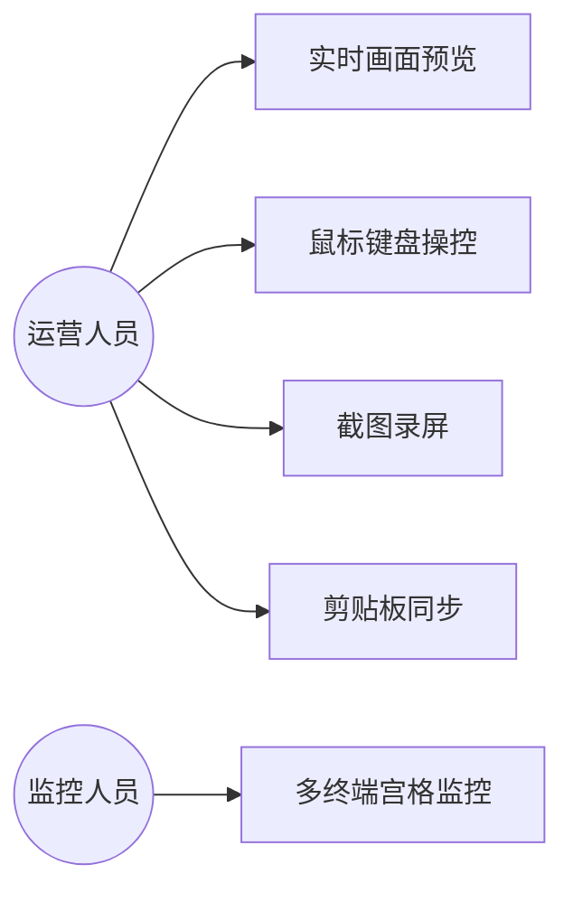
```mermaid
flowchart LR
  A1((运营人员))
  A2((监控人员))
  UC1[实时画面预览]
  UC2[鼠标键盘操控]
  UC3[截图录屏]
  UC4[剪贴板同步]
  UC5[多终端宫格监控]
  A1 --> UC1 & UC2 & UC3 & UC4
  A2 --> UC5
```

---

**第③步 理清流程**（工具：时序图 ｜ 产物：需求范围 ｜ 验收：是否穷举相关子系统）

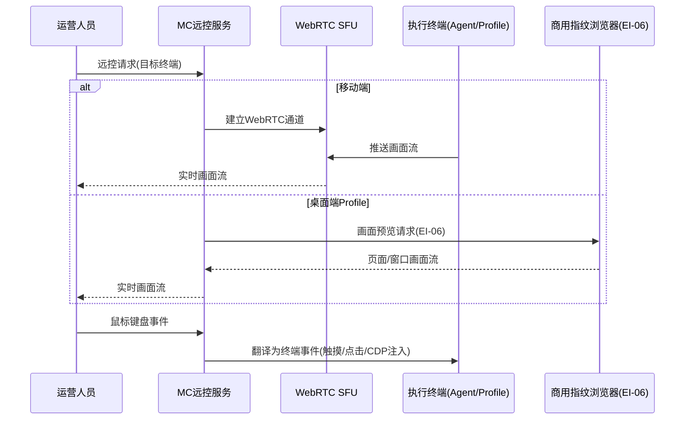
```mermaid
sequenceDiagram
  participant 运营 as 运营人员
  participant MC as MC远控服务
  participant SFU as WebRTC SFU
  participant 终端 as 执行终端(Agent/Profile)
  participant 商用 as 商用指纹浏览器(EI-06)
  运营->>MC: 远控请求(目标终端)
  alt 移动端
    MC->>SFU: 建立WebRTC通道
    终端->>SFU: 推送画面流
    SFU-->>运营: 实时画面流
  else 桌面端Profile
    MC->>商用: 画面预览请求(EI-06)
    商用-->>MC: 页面/窗口画面流
    MC-->>运营: 实时画面流
  end
  运营->>MC: 鼠标键盘事件
  MC->>终端: 翻译为终端事件(触摸/点击/CDP注入)
```

---

**第④步 理清流程-异常**（工具：流程图 ｜ 产物：异常场景 ｜ 验收：每个交互点是否都有异常分支）

| 交互点 | 异常分支 | 应对 |
|--------|---------|------|
| WebRTC/商用 API 画面流 | 断流 | 自动重连或降级 |
| 商用 API | 不可用 | 降级为截图轮询 |
| 输入事件 | 丢失 | 补传 |
| 网络 | 弱网 | 自动降帧保证可用 |

---

**第⑤步 列出规则**（工具：表格 ｜ 产物：验证点 ｜ 验收：规则是否可测、是否落到具体需求内）

| 规则 | 可测的验证点 | 归属子目标 |
|------|------------|-----------|
| 移动端 WebRTC 画面+桌面端商用 API 画面 | 两类终端均能获取画面 | ①远控 |
| 远控通道与任务执行通道分离 | 远控不影响任务执行稳定性 | ①远控 |
| 鼠标键盘映射为终端事件(触摸/返回/Home/多任务/CDP注入) | 操作被正确翻译执行 | ①远控 |
| Agent 采集截图录屏可保存回看 | 截图录屏可存取 | ①远控 |
| 宫格低码率同屏预览多终端 | 多终端可同屏 | ②宫格监控 |
| 剪贴板操作端与终端双向同步 | 剪贴板内容双向同步 | ①远控 |

---

**拆分结论（含四原则校验）**

子目标 ①② 都围绕"实时画面与操控"这一价值，异常分支统一（断流/降级），不拆分，作为一个需求。编号 R-MC-004。

###### R-MC-004 远程控制

**需求目的**：对单台及多台执行终端提供低延迟的实时画面预览与输入控制，并支持多终端同屏监控，用于人工介入与终端操作。移动端采用 WebRTC 通道，桌面端指纹浏览器 Profile 采用商用指纹浏览器产品的画面预览接口。

**使用角色**：运营人员（远程操作终端）、监控人员（宫格监控）。

**前置条件**：目标终端在线且 Agent 正常（移动端）或 Profile 已启动（桌面端）；WebRTC SFU 可用（移动端）；商用指纹浏览器 API 可用且 Profile 已启动（桌面端）；远控权限已授权。

**输入**：远控请求、目标终端标识、操作人员的鼠标与键盘输入事件。

**输出**：终端实时画面流、被翻译并执行的终端事件、截图与录屏文件、多终端宫格预览画面。

**业务规则**：

| 规则 | 说明 |
|------|------|
| 双通道画面 | 移动端屏幕画面基于 WebRTC 传输，桌面端 Profile 经商用产品 API 获取画面预览流；远控通道与任务执行通道相互分离 |
| 事件映射 | 鼠标键盘事件映射为终端触摸、点击、滑动、输入及返回键、Home 键、多任务键（移动端），或经 CDP 注入为页面鼠标点击与键盘输入（桌面端） |
| 截图录屏 | 系统支持由 Agent 采集的截图与录屏，并支持保存与回看 |
| 宫格监控 | 多终端宫格监控以低码率同屏预览多台终端 |
| 剪贴板同步 | 剪贴板在操作端与终端间双向同步 |

**异常场景**：WebRTC 断流或商用 API 画面流中断时自动重连或降级；输入事件丢失时补传；弱网下自动降帧以保证可用性；商用 API 不可用时降级为截图轮询。

**验收标准**：单终端远控端到端延迟不大于 300 毫秒；鼠标键盘事件可正确映射为终端事件；截图录屏可采集保存；多终端宫格可同屏预览；剪贴板可双向同步；桌面端可经商用 API 获取画面预览并注入操作。

**关联接口**：II-03 远控画面传输、EI-06 指纹浏览器服务。

##### 执行网关与双执行模式

**用户需求概述**：以统一执行网关作为所有执行终端动作的唯一收口，提供脚本模式与智能体模式两种执行引擎，覆盖移动端与桌面端，支持群控、养号与内容投放三类执行目标。

---

**第①步 目标澄清**（工具：干系人多角度分析 ｜ 产物：子目标清单 ｜ 验收：是否穷举所有干系人的价值诉求）

| 序   | 子目标                              | 干系人     |
| --- | -------------------------------- | ------- |
| 1   | 所有终端动作经统一网关收口，可鉴权、可记录、可熔断（动作不裸奔） | 审计/安全诉求 |
| 2   | 脚本模式能驱动固定流程、高频批量作业               | 任务调度    |
| 3   | 智能体模式能由大模型实时决策驱动复杂作业             | 智能体引擎   |
| 4   | 群控、养号、投放三类执行目标都能经网关闭环落地          | 作战/运营   |

> 分析：①②③④ 均围绕"动作经网关落地执行"这一价值，脚本/智能体是两种执行引擎（如两种车道），群控/养号/投放是三类执行目标（如三类车辆），都是同一网关的不同侧面，不构成可独立交付的端到端价值。作为一个需求。

---

**第②步 梳理场景**（工具：用例图 ｜ 产物：场景 ｜ 验收：是否穷举所有用户操作）

| 角色 | 操作 |
|------|------|
| 任务调度 | 下发作业指令（脚本/智能体）、经网关转发动作到终端 |
| 脚本引擎 | 按固定流程驱动终端动作 |
| 智能体引擎 | 调用 IRS 视觉推理、自主决策动作 |
| 审计与安全 | 查阅动作日志与熔断记录 |

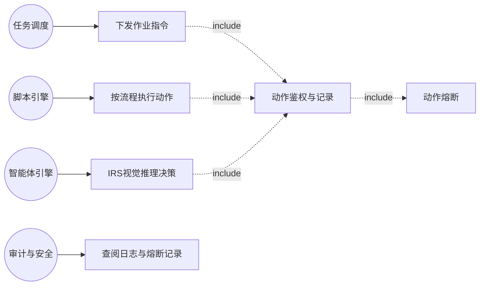
```mermaid
flowchart LR
  A1((任务调度))
  A2((脚本引擎))
  A3((智能体引擎))
  A4((审计与安全))
  UC1[下发作业指令]
  UC2[按流程执行动作]
  UC3[IRS视觉推理决策]
  UC4[动作鉴权与记录]
  UC5[动作熔断]
  UC6[查阅日志与熔断记录]
  A1 --> UC1
  A2 --> UC2
  A3 --> UC3
  A4 --> UC6
  UC1 -. include .-> UC4
  UC2 -. include .-> UC4
  UC3 -. include .-> UC4
  UC4 -. include .-> UC5
```

---

**第③步 理清流程**（工具：时序图 ｜ 产物：需求范围 ｜ 验收：是否穷举相关子系统）

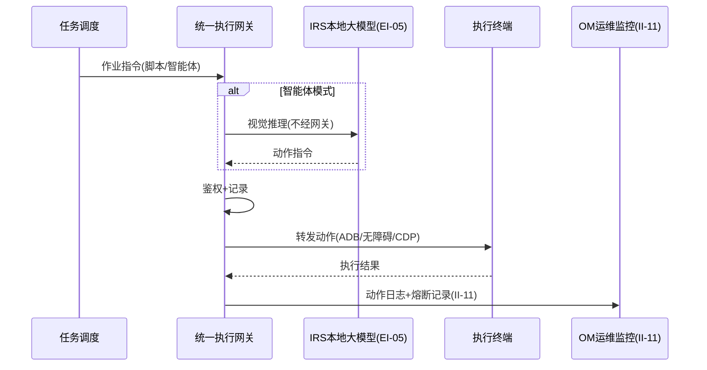
```mermaid
sequenceDiagram
  participant 调度 as 任务调度
  participant 网关 as 统一执行网关
  participant IRS as IRS本地大模型(EI-05)
  participant 终端 as 执行终端
  participant OM as OM运维监控(II-11)
  调度->>网关: 作业指令(脚本/智能体)
  alt 智能体模式
    网关->>IRS: 视觉推理(不经网关)
    IRS-->>网关: 动作指令
  end
  网关->>网关: 鉴权+记录
  网关->>终端: 转发动作(ADB/无障碍/CDP)
  终端-->>网关: 执行结果
  网关->>OM: 动作日志+熔断记录(II-11)
```

---

**第④步 理清流程-异常**（工具：流程图 ｜ 产物：异常场景 ｜ 验收：每个交互点是否都有异常分支）

| 交互点 | 异常分支 | 应对 |
|--------|---------|------|
| 执行网关 | 过载 | 按优先级限流 |
| 智能体推理 | 失败 | 降级脚本模式或人工介入 |
| 动作 | 触发风控信号 | 熔断并告警 |
| 终端/CDP | 掉线/断开 | 挂起任务待恢复续接 |

---

**第⑤步 列出规则**（工具：表格 ｜ 产物：验证点 ｜ 验收：规则是否可测、是否落到具体需求内）

| 规则 | 可测的验证点 | 归属子目标 |
|------|------------|-----------|
| 动作鉴权（校验来源与目标合法性） | 非法来源动作被拒绝 | ①动作不裸奔 |
| 动作记录（写日志并全量上报 OM） | 动作日志可在 OM 检索 | ①动作不裸奔 |
| 动作熔断（检测风控信号或异常频率时停止） | 风控信号触发后后续动作停止 | ①动作不裸奔 |
| 脚本模式驱动固定流程作业 | 脚本模式可驱动终端 | ②③双执行模式 |
| 智能体模式调用 IRS 实时决策 | 智能体模式可驱动终端 | ②③双执行模式 |
| 推理不经网关、动作指令经网关 | 推理直连 IRS、动作经网关 | ②③双执行模式 |
| 通道适配（移动端 ADB/无障碍、桌面端 CDP） | 两类终端动作可落地 | ②③双执行模式 |
| 群控/养号/投放三类目标 | 三类均可闭环 | ④三类执行目标 |

---

**拆分结论（含四原则校验）**：子目标 ①（动作经网关收口：鉴权/记录/熔断）与 ②③（双执行模式：脚本引擎/智能体引擎）+ ④（三类执行目标）是两组不同的端到端价值——网关的使用角色偏审计/安全（关注动作不裸奔、可观测可熔断），双执行模式的使用角色偏任务调度与引擎（关注作业怎么驱动、目标怎么落地）。两者验收点不同（网关验收鉴权/记录/熔断；双执行模式验收模式驱动与三类目标闭环）。校验如下：

| 需求 | 足够小 | 端到端 | 独立性 | 可测性 |
|------|--------|--------|--------|--------|
| R-MC-005 统一执行网关 | ✅ 聚焦动作收口 | ✅ 动作→鉴权/记录/熔断→转发 | ✅ 独立 | ✅ 鉴权/记录/熔断可验 |
| R-MC-006 双执行模式与执行目标 | ✅ 聚焦双引擎与三类目标 | ✅ 作业指令→模式驱动→三类目标落地 | ✅ 建立在 005 之上 | ✅ 模式/目标可验 |

###### R-MC-005 统一执行网关

**需求目的**：以统一执行网关作为所有执行终端动作的唯一收口，对动作鉴权（校验来源与目标合法性）、记录（写动作日志并全量上报 OM）、熔断（检测风控信号或异常频率时停止后续动作），保证每一个动作可观测、可审计、可熔断，动作不裸奔。

**使用角色**：审计与安全（动作可观测可审计可熔断）、任务调度（动作经网关转发落地）。

**前置条件**：执行网关服务可用；控制通道（移动端 ADB/无障碍、桌面端 CDP）已就绪。

**输入**：动作指令（动作类型、坐标/元素、参数、目标执行终端、账号标识、终端类型）。

**输出**：动作执行结果、动作日志记录、熔断记录。

**业务规则**：

| 规则 | 说明 |
|------|------|
| 动作收口 | 所有执行终端动作（移动端与桌面端）均经统一执行网关落地，禁止绕过 |
| 动作鉴权 | 执行网关对动作鉴权，校验动作来源与目标终端的合法性 |
| 动作记录 | 执行网关对动作记录，写入动作日志并全量上报运维监控子系统（II-11） |
| 动作熔断 | 执行网关对异常动作熔断，在检测到风控信号或异常频率时停止后续动作 |
| 通道适配 | 移动端终端采用 ADB、无障碍服务通道，桌面端 Profile 采用 CDP 通道；控制通道对上层透明 |

**异常场景**：执行网关过载时按优先级限流；动作触发风控信号时熔断并告警；终端掉线或 CDP 连接断开时挂起任务待恢复续接。

**验收标准**：所有执行终端动作均经统一执行网关鉴权、记录、转发，禁止绕过；执行网关可对异常动作熔断；动作日志全量上报 OM；移动端与桌面端控制通道均可适配。

**关联接口**：II-07 执行网关动作接口、II-11 执行网关日志上报（至 OM）。

###### R-MC-006 双执行模式与执行目标

**需求目的**：提供脚本模式与智能体模式两种执行引擎，分别承载固定流程驱动与大模型实时决策驱动的作业，覆盖移动端终端与桌面端浏览器 Profile，并支持群控、养号与内容投放三类执行目标。所有动作经 R-MC-005 统一执行网关落地。

**使用角色**：任务调度（下发作业指令）、智能体引擎（自主决策动作）、脚本引擎（按流程执行动作）。

**前置条件**：R-MC-005 执行网关可用；智能体模式下 IRS 本地大模型可用；目标执行终端与账号已绑定。

**输入**：作业指令（来自脚本模式或智能体模式）、目标执行终端组、内容素材、目标账号与终端。

**输出**：脚本模式执行结果、智能体模式执行结果、养号执行记录、内容投放执行记录。

**业务规则**：

| 规则 | 说明 |
|------|------|
| 脚本模式 | 脚本模式由预先编写的固定流程驱动终端动作，适用于流程确定、高频、批量的作业 |
| 智能体模式 | 智能体模式由终端 Agent 调用 IRS 本地大模型进行视觉推理与规划，自主决策下一步动作，适用于流程复杂、需理解界面、抗界面变化的作业 |
| 推理执行分离 | 智能体模式下的视觉推理由 Agent 调用 IRS 完成，不经执行网关；推理产出的动作指令再经执行网关落地 |
| 三类执行目标 | 群控对多台终端同步控制并统一投放内容；养号按拟人化节奏模拟真人行为（认知作战账号经移动端 ADB/无障碍、爬虫账号经桌面端 CDP，拟人化节奏由 R-MC-009 内置）；内容投放下发并发布内容素材到目标账号 |

**异常场景**：智能体推理失败时降级为脚本模式或人工介入。

**验收标准**：脚本模式与智能体模式均可驱动移动端设备与桌面端 Profile 动作；智能体推理调用 IRS 且不经执行网关；三类执行目标（群控、养号、投放）均可闭环。

**关联接口**：II-07 执行网关动作接口、II-08 本地大模型推理调用、EI-05 本地大模型推理。

##### 任务管理

**用户需求概述**：把操作意图转换为设备可执行的任务并进行调度，支撑各类作业的排队、分发、重试与定时执行。

---

**第①步 目标澄清**（工具：干系人多角度分析 ｜ 产物：子目标清单 ｜ 验收：是否穷举所有干系人的价值诉求）：①运营人员能把意图变成可执行的任务并交给系统（创建任务）；②任务能排队分发到设备并可靠执行（含重试与定时）。

---

**第②步 梳理场景**（工具：用例图 ｜ 产物：场景 ｜ 验收：是否穷举所有用户操作）

| 角色 | 操作 |
|------|------|
| 运营人员 | 创建任务、查看任务状态、配置计划任务 |
| 系统（自动） | 生成任务实例、入消息队列、调度分发到设备 Agent、状态流转、失败重试 |

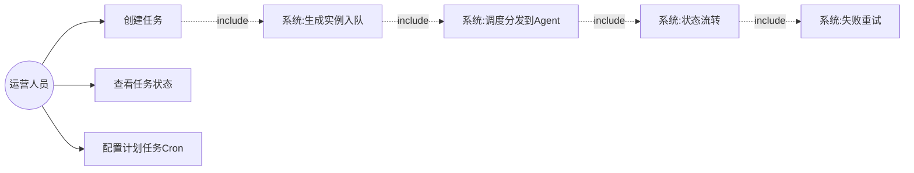
```mermaid
flowchart LR
  A1((运营人员))
  UC1[创建任务]
  UC2[查看任务状态]
  UC3[配置计划任务Cron]
  UC4[系统:生成实例入队]
  UC5[系统:调度分发到Agent]
  UC6[系统:状态流转]
  UC7[系统:失败重试]
  A1 --> UC1 & UC2 & UC3
  UC1 -. include .-> UC4
  UC4 -. include .-> UC5
  UC5 -. include .-> UC6
  UC6 -. include .-> UC7
```

---

**第③步 理清流程**（工具：时序图 ｜ 产物：需求范围 ｜ 验收：是否穷举相关子系统）

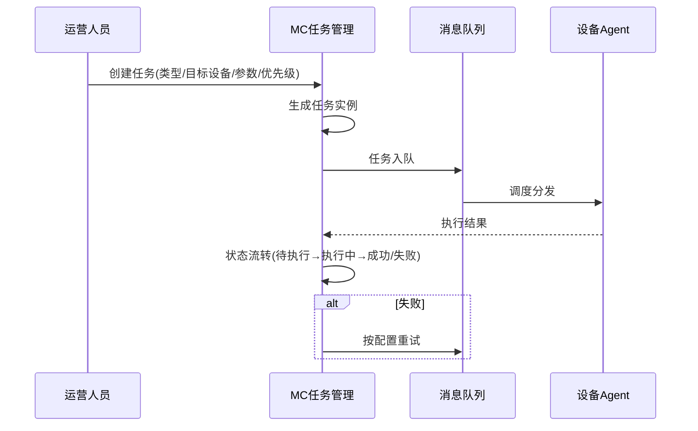
```mermaid
sequenceDiagram
  participant 运营 as 运营人员
  participant MC as MC任务管理
  participant 队列 as 消息队列
  participant Agent as 设备Agent
  运营->>MC: 创建任务(类型/目标设备/参数/优先级)
  MC->>MC: 生成任务实例
  MC->>队列: 任务入队
  队列->>Agent: 调度分发
  Agent-->>MC: 执行结果
  MC->>MC: 状态流转(待执行→执行中→成功/失败)
  alt 失败
    MC->>队列: 按配置重试
  end
```

---

**第④步 理清流程-异常**（工具：流程图 ｜ 产物：异常场景 ｜ 验收：每个交互点是否都有异常分支）

| 交互点 | 异常分支 | 应对 |
|--------|---------|------|
| 任务执行 | 失败 | 按配置重试 |
| 任务执行 | 超时 | 标记超时并告警 |
| 消息队列 | 积压 | 按优先级调度并告警 |

---

**第⑤步 列出规则**（工具：表格 ｜ 产物：验证点 ｜ 验收：规则是否可测、是否落到具体需求内）

| 规则 | 可测的验证点 | 归属子目标 |
|------|------------|-----------|
| 实例化调度（选设备/设备组→生成实例→入队→分发） | 任务可创建入队分发 | ①意图转任务 |
| 八种任务类型（安装/分发/发布/截图/采集/脚本/巡检/检查） | 各类型可创建执行 | ①意图转任务 |
| 八种状态流转（待执行/排队/执行中/成功/失败/取消/超时/部分成功） | 状态可正确流转 | ②可靠执行 |
| 失败重试与超时配置 | 失败可重试、超时可配 | ②可靠执行 |
| 计划任务（一次性/每日/每周/Cron+并发+优先级） | 计划任务可定时触发 | ②可靠执行 |

**拆分结论**：两子目标围绕"任务调度执行"这一价值，作为一个需求。编号 R-MC-007。

###### R-MC-007 任务管理

**需求目的**：把操作意图转换为设备可执行的任务并进行调度，支撑各类作业的排队、分发、重试与定时执行。

**使用角色**：运营人员（创建任务）、任务调度（自动分发）、系统（状态流转）。

**前置条件**：消息队列可用；目标设备或设备组已就绪。

**输入**：任务定义（任务类型、目标设备或设备组、参数、优先级）、计划任务的 Cron 表达式、任务状态变更事件。

**输出**：任务实例、任务调度分发结果、任务执行结果、任务最新状态。

**业务规则**：

| 规则 | 说明 |
|------|------|
| 实例化调度 | 系统按任务定义选择设备或设备组，生成任务实例并入消息队列，由调度器分发到设备 Agent 执行 |
| 任务类型 | 包括 App 安装与启动、文件分发、内容发布、截图、数据采集、自动化脚本、设备巡检与账号状态检查 |
| 状态流转 | 任务在待执行、排队中、执行中、成功、失败、已取消、超时、部分成功等状态间流转 |
| 重试与超时 | 系统支持失败重试、重试次数与超时配置 |
| 计划任务 | 支持一次性、每日、每周与自定义 Cron，并支持最大并发数与任务优先级控制 |

**异常场景**：任务执行失败时按配置重试；任务超时时标记超时并告警；队列积压时按优先级调度并告警。

**验收标准**：任务可创建并生成实例入队分发；八种任务状态可正确流转；失败可重试且超时可配置；计划任务可按 Cron 定时触发并支持并发与优先级。

**关联接口**：II-02 Agent 指令与日志、II-04 日志指标上报（至 OM）。

##### 自动化管理与编排

**用户需求概述**：提供自动化能力的中枢，覆盖从模板任务到可视化工作流再到脚本开发的递进式自动化编排能力，并承载养号、账号-终端绑定、登录状态维护等可自动化的账号操作执行编排，以及养号拟人化节奏策略（内置）。所有产出动作均经执行网关落地。

---

**第①步 目标澄清**（工具：干系人多角度分析 ｜ 产物：子目标清单 ｜ 验收：是否穷举所有干系人的价值诉求）

| 序 | 子目标 | 干系人 |
|----|--------|--------|
| 1 | 运营/开发者能用模板/工作流/脚本把操作流程编排成可自动执行的自动化能力 | 运营人员、脚本开发者 |
| 2 | 账号运营人员能把账号绑到终端、按拟人化节奏自动养号、维护登录状态 | 账号运营人员 |

---

**第②步 梳理场景**（工具：用例图 ｜ 产物：场景 ｜ 验收：是否穷举所有用户操作）

| 角色 | 操作 |
|------|------|
| 脚本开发者 | 编写调试脚本（编辑/调试/截图回放/版本管理） |
| 运营人员 | 选用模板任务、编排可视化工作流 |
| 账号运营人员 | 绑定账号与终端、配置养号任务 |
| 系统 | 执行编排、自动养号、维护登录状态、响应状态变更 |

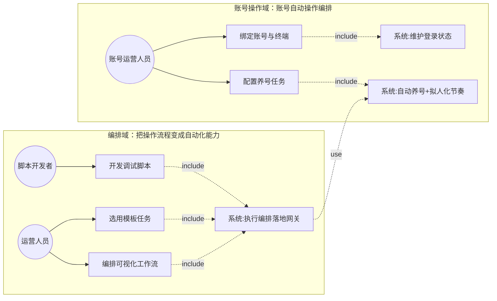
```mermaid
flowchart LR
  subgraph 编排域["编排域：把操作流程变成自动化能力"]
    A1((脚本开发者))
    A2((运营人员))
    UC1[选用模板任务]
    UC2[编排可视化工作流]
    UC3[开发调试脚本]
    UC4[系统:执行编排落地网关]
    A1 --> UC3
    A2 --> UC1 & UC2
    UC1 & UC2 & UC3 -. include .-> UC4
  end
  subgraph 账号操作域["账号操作域：账号自动操作编排"]
    A3((账号运营人员))
    UC5[绑定账号与终端]
    UC6[配置养号任务]
    UC7[系统:自动养号+拟人化节奏]
    UC8[系统:维护登录状态]
    A3 --> UC5 & UC6
    UC6 -. include .-> UC7
    UC5 -. include .-> UC8
  end
  UC4 -. use .-> UC7
```

---

**第③步 理清流程**（工具：时序图 ｜ 产物：需求范围 ｜ 验收：是否穷举相关子系统）

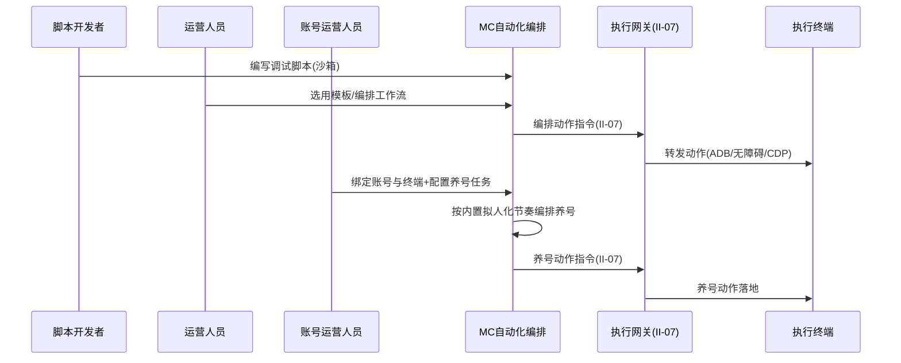
```mermaid
sequenceDiagram
  participant 开发者 as 脚本开发者
  participant 运营 as 运营人员
  participant 账号运营 as 账号运营人员
  participant MC as MC自动化编排
  participant 网关 as 执行网关(II-07)
  participant 终端 as 执行终端
  开发者->>MC: 编写调试脚本(沙箱)
  运营->>MC: 选用模板/编排工作流
  MC->>网关: 编排动作指令(II-07)
  网关->>终端: 转发动作(ADB/无障碍/CDP)
  账号运营->>MC: 绑定账号与终端+配置养号任务
  MC->>MC: 按内置拟人化节奏编排养号
  MC->>网关: 养号动作指令(II-07)
  网关->>终端: 养号动作落地
```

---

**第④步 理清流程-异常**（工具：流程图 ｜ 产物：异常场景 ｜ 验收：每个交互点是否都有异常分支）

| 交互点 | 异常分支 | 应对 |
|--------|---------|------|
| 脚本执行 | 异常 | 捕获错误并记录 |
| 脚本 | 越权访问敏感路径 | 沙箱拦截 |
| 调试设备 | 掉线 | 暂停调试 |
| 账号 | 被封禁/受限 | 停止该账号任务并解绑 |
| 养号 | 触发平台验证 | 暂停并告警 |
| 账号登录 | 失败 | 记录原因并标记 |

---

**第⑤步 列出规则**（工具：表格 ｜ 产物：验证点 ｜ 验收：规则是否可测、是否落到具体需求内）

| 规则 | 可测的验证点 | 归属子目标 |
|------|------------|-----------|
| 三阶段(模板/工作流/脚本开发) | 三阶段均可用 | ①编排 |
| TikTok/Facebook 等平台模拟点击 | 模拟点击可执行 | ①编排 |
| 动作经执行网关落地不直接操作设备 | 动作收口网关 | ①编排 |
| 养号按内置拟人化节奏(随机浏览/停留/互动/打散时间) | 养号节奏拟人化 | ②养号 |
| 认知作战账号经 ADB/无障碍、爬虫账号经 CDP | 两类账号分通道养号 | ②养号 |
| 一设备一账号一 IP / 一 Profile 一账号一 IP（未解绑不可再绑） | 绑定规则正确 | ②绑定 |
| 记录账号在终端登录状态及变化 | 登录状态可记录 | ②登录状态 |
| 账号状态变更时停止养号并解绑 | 变更联动生效 | ②养号 |

---

**拆分结论（含四原则校验）**：子目标 ①（编排能力）与 ②（账号操作编排）是两条价值链——前者面向运营/开发者构建通用自动化能力，后者面向账号运营人员做账号绑定/养号/登录维护。两者角色不同、验收点不同。校验如下：

| 需求 | 足够小 | 端到端 | 独立性 | 可测性 |
|------|--------|--------|--------|--------|
| R-MC-008 自动化编排能力 | ✅ 聚焦三阶段编排 | ✅ 操作流程→可自动执行 | ✅ 独立 | ✅ 三阶段可验 |
| R-MC-009 账号操作编排与养号 | ✅ 聚焦账号绑定/养号/登录 | ✅ 绑定账号→自动养号→状态维护 | ✅ 建立在 008 之上 | ✅ 养号/绑定可验 |

###### R-MC-008 自动化编排能力

**需求目的**：提供自动化能力的中枢，覆盖从模板任务到可视化工作流再到脚本开发的递进式自动化编排能力，支持 ADB、CDP 等多种自动化通道，针对 TikTok、Facebook 等平台实现模拟点击自动化。所有产出动作均经执行网关落地，不直接操作设备。

**使用角色**：脚本开发者（编写与调试脚本）、运营人员（选用模板或工作流）。

**前置条件**：执行网关可用；调试设备已接入；脚本沙箱已配置。

**输入**：模板任务选择、工作流流程定义、脚本代码与调试设备、平台界面与操作序列。

**输出**：模板任务执行结果、工作流执行编排结果、脚本调试结果、模拟点击自动化执行结果。

**业务规则**：

| 规则 | 说明 |
|------|------|
| 模板化任务 | 第一阶段提供模板化任务，包括打开 App、等待页面、点击、输入文本、上传文件、截图、返回、滑动、关闭 App、设备巡检与 App 状态检测 |
| 可视化工作流 | 第二阶段提供可视化工作流编排，节点包括开始、设备选择、启动 App、等待、点击、输入、滑动、截图、文件上传、条件判断、循环、HTTP 请求、日志、审批与结束 |
| 脚本开发调试 | 第三阶段支持脚本开发与调试，提供脚本编辑、调试设备、执行日志、截图回放与版本管理 |
| 模拟点击 | 系统针对 TikTok、Facebook 等平台实现模拟点击自动化 |
| 动作收口 | 本功能编排产出的所有动作指令均经执行网关鉴权、记录与转发，不直接操作设备 |

**异常场景**：脚本执行异常时捕获错误并记录；脚本越权访问敏感路径时沙箱拦截；调试设备掉线时暂停调试。

**验收标准**：三阶段能力（模板、工作流、脚本开发）均可用；编排动作均经执行网关落地且不直接操作设备；模拟点击可在目标平台执行。

**关联接口**：II-07 执行网关动作接口。

###### R-MC-009 账号操作编排与养号

**需求目的**：承载养号、账号-终端-代理绑定、登录状态维护等可自动化的账号操作的执行编排，以及养号拟人化节奏策略（内置）。认知作战账号经移动端 ADB/无障碍通道养号、爬虫账号经桌面端 CDP 通道养护。养号等风控敏感场景可优先采用脚本模式编排。

**使用角色**：账号运营人员（绑定账号与终端、配置养号任务）、系统（执行编排、自动执行养号、维护登录状态、响应状态变更）。

**前置条件**：执行网关可用；账号已在本子系统注册并取得 account_id（见账号资源管理需求）；目标执行终端已注册。

**输入**：账号标识、终端标识、养号任务（发帖、关注、浏览）、账号登录事件、账号绑定请求、拟人化节奏参数。

**输出**：账号与终端的绑定关系记录、登录状态记录、养号执行记录。

**业务规则**：

| 规则 | 说明 |
|------|------|
| 账号-终端-代理绑定 | 真机、云手机、虚拟化真机执行"一设备一账号一 IP"（一个终端仅可绑定一个账号与一个固定代理 IP，已绑定账号未解绑前不可再绑定其他账号）；指纹浏览器 Profile 执行"一 Profile 一账号一 IP"（浏览器实例可多开，每个 Profile 绑定一个账号身份与一个固定代理 IP）；系统据此将认知作战账号绑定到移动端设备、爬虫账号绑定到浏览器 Profile，并联动终端-代理绑定记录 |
| 养号自动化 | 养号动作（发帖、关注、浏览等拟人化行为）由本功能编排并经执行网关落地执行——认知作战账号经 ADB/无障碍通道在移动端执行、爬虫账号经 CDP 通道在浏览器 Profile 执行 |
| 拟人化节奏 | 养号的拟人化节奏由本功能内置（注入随机浏览、停留、互动等行为、打散时间间隔与频率），不再依赖蜂群智能体子系统 |
| 登录状态维护 | 系统记录账号在终端上的登录状态及其变化 |
| 状态变更联动 | 账号状态变更（封禁、受限等）时停止该账号的养号任务并解绑 |

**异常场景**：账号被封禁或受限时停止该账号相关任务并解绑；养号行为触发平台验证时暂停并告警；账号登录失败时记录原因并标记；账号在终端上被封时解绑并告警。

**验收标准**：养号动作可按内置拟人化节奏经执行网关在移动端（ADB/无障碍）与桌面端（CDP）执行；账号-终端-代理绑定规则（一设备一账号一 IP / 一 Profile 一账号一 IP，含未解绑前不可再绑）可正确执行并记录绑定关系；登录状态变化可记录；账号状态变更后可联动停止被封账号任务。

**关联接口**：II-07 执行网关动作接口、II-01a 账号状态变更事件、II-04 日志指标上报（至 OM）。

##### 可观测性与作业统计复盘

**用户需求概述**：满足集群控制对可观测性的硬性要求，使终端、账号、任务的每一个动作都可知、可追溯，支撑记录、回传、告警、审计，并在此基础上完成蜂群作业的数据统计与任务复盘、将投送效果联动回传上游供效果评估闭环使用。

---

**第①步 目标澄清**（工具：干系人多角度分析 ｜ 产物：子目标清单 ｜ 验收：是否穷举所有干系人的价值诉求）：①每个终端动作都可知可追溯（留痕、日志、告警、审计）；②蜂群作业可统计、可复盘、效果可回传上游。

---

**第②步 梳理场景**（工具：用例图 ｜ 产物：场景 ｜ 验收：是否穷举所有用户操作）

| 角色 | 操作 |
|------|------|
| 运维与审计人员 | 检索/查阅动作日志、查阅审计记录（谁何时对哪台终端或账号做了什么）、接收与处理异常告警 |
| 作战指挥与运营人员 | 查看蜂群作业多维统计（任务完成率/内容触达/互动表现/账号健康度）、发起/查看任务复盘归因、查阅效果回传情况 |
| 系统（自动） | 动作留痕（时间/终端/账号/结果）、经 Agent 回传任务日志与截图、异常事件触发告警、用户与系统操作写审计日志、作业多维统计、任务复盘归因、效果数据回调回传 OCC |

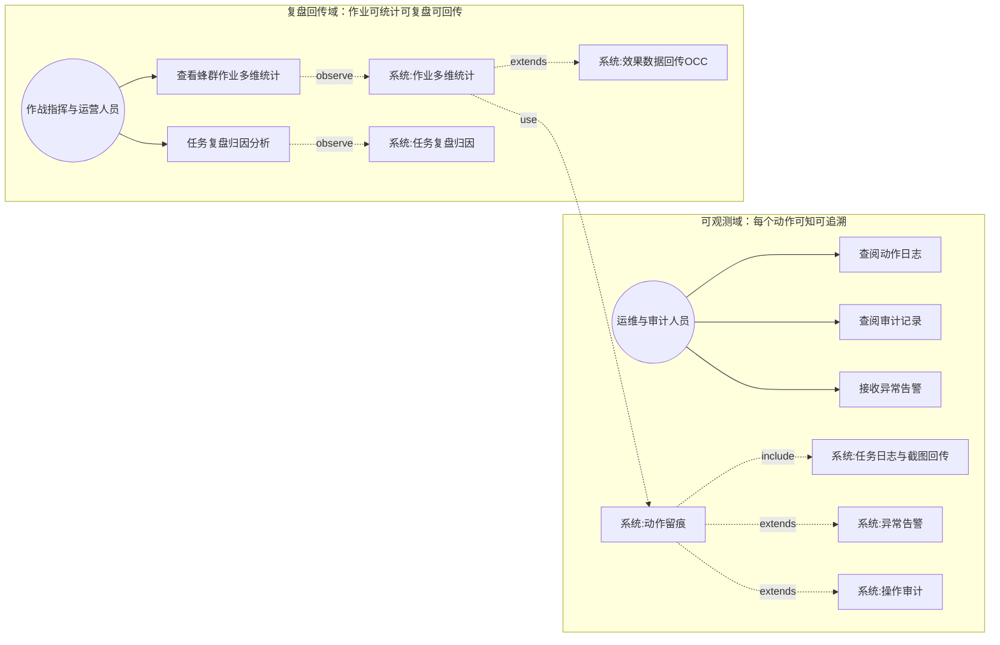
```mermaid
flowchart LR
  subgraph 可观测域["可观测域：每个动作可知可追溯"]
    A1((运维与审计人员))
    UC1[查阅动作日志]
    UC2[查阅审计记录]
    UC3[接收异常告警]
    UC4[系统:动作留痕]
    UC5[系统:任务日志与截图回传]
    UC6[系统:异常告警]
    UC7[系统:操作审计]
    A1 --> UC1 & UC2 & UC3
    UC4 -. include .-> UC5
    UC4 -. extends .-> UC6
    UC4 -. extends .-> UC7
  end
  subgraph 复盘回传域["复盘回传域：作业可统计可复盘可回传"]
    A2((作战指挥与运营人员))
    UC8[查看蜂群作业多维统计]
    UC9[任务复盘归因分析]
    UC10[系统:作业多维统计]
    UC11[系统:任务复盘归因]
    UC12[系统:效果数据回传OCC]
    A2 --> UC8 & UC9
    UC8 -. observe .-> UC10
    UC9 -. observe .-> UC11
    UC10 -. use .-> UC4
    UC10 -. extends .-> UC12
  end
```

---

**第③步 理清流程**（工具：时序图 ｜ 产物：需求范围 ｜ 验收：是否穷举相关子系统）

正常流程涉及 4 个子系统/组件：终端 Agent（II-02）、统一执行网关（II-07）、运维监控 OM（II-04）、舆情作战 OCC（II-10 效果回传）。可观测性统一收口于 MC，动作留痕是统计复盘与效果回传的同源数据底座（不重复采集）。

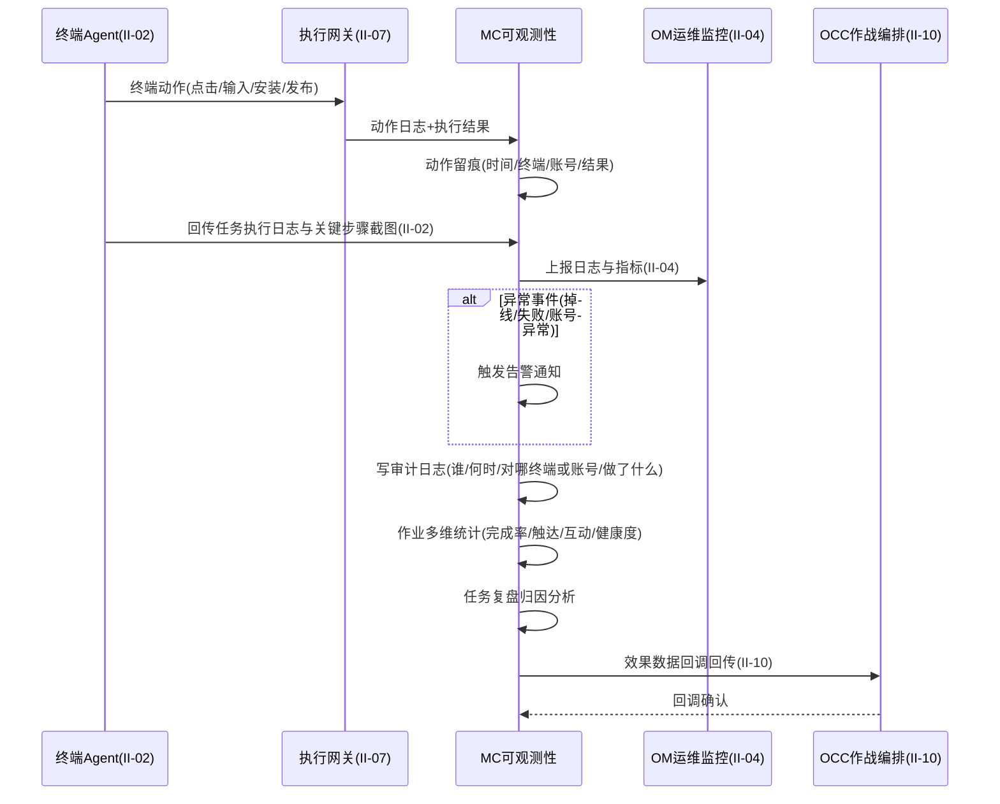
```mermaid
sequenceDiagram
  participant Agent as 终端Agent(II-02)
  participant 网关 as 执行网关(II-07)
  participant MC as MC可观测性
  participant OM as OM运维监控(II-04)
  participant OCC as OCC作战编排(II-10)
  Agent->>网关: 终端动作(点击/输入/安装/发布)
  网关->>MC: 动作日志+执行结果
  MC->>MC: 动作留痕(时间/终端/账号/结果)
  Agent->>MC: 回传任务执行日志与关键步骤截图(II-02)
  MC->>OM: 上报日志与指标(II-04)
  alt 异常事件(掉线/失败/账号异常)
    MC->>MC: 触发告警通知
  end
  MC->>MC: 写审计日志(谁/何时/对哪终端或账号/做了什么)
  MC->>MC: 作业多维统计(完成率/触达/互动/健康度)
  MC->>MC: 任务复盘归因分析
  MC->>OCC: 效果数据回调回传(II-10)
  OCC-->>MC: 回调确认
```

---

**第④步 理清流程-异常**（工具：流程图 ｜ 产物：异常场景 ｜ 验收：每个交互点是否都有异常分支）

| 交互点 | 异常分支 | 应对 |
|--------|---------|------|
| MC ↔ OM（日志上报 II-04） | 上报失败 | 本地暂存待重试，不丢动作记录 |
| MC 告警通道 | 告警通道失效 | 降级为本地记录 |
| 审计日志写入 | 写入失败 | 阻塞相关操作以保证不丢审计 |
| 作业统计数据源 | 数据源缺失 | 标注统计不完整 |
| 任务复盘归因 | 归因无解 | 标记待人工分析 |
| MC ↔ OCC（效果回传 II-10） | 回调上游失败 | 暂存重试 |

---

**第⑤步 列出规则**（工具：表格 ｜ 产物：验证点 ｜ 验收：规则是否可测、是否落到具体需求内）

| 规则 | 可测的验证点 | 归属子目标 |
|------|------------|-----------|
| 动作留痕（记录时间、终端、账号、结果） | 任一终端动作均可在留痕中查到时间/终端/账号/结果四要素 | ①可观测 |
| Agent 回传任务执行日志与关键步骤截图 | 任务执行后日志与截图可在 MC 检索 | ①可观测 |
| 异常事件触发告警通知 | 掉线/失败/账号异常事件触发后可收到告警 | ①可观测 |
| 用户与系统操作记录审计日志 | 任一用户或系统操作可在审计日志追溯 | ①可观测 |
| 作业统计基于本功能同源数据、不重复采集 | 统计数据来源单一可溯、无重复采集 | ②统计复盘 |
| 蜂群作业多维统计（任务完成率/内容触达率/互动率/账号健康度） | 四项基础指标均可产出 | ②统计复盘 |
| 任务复盘对失败任务/异常账号/低效作业归因分析 | 失败任务可产出归因结论 | ②统计复盘 |
| 效果数据经回调联动回传 OCC | 效果数据可在 OCC 侧形成评估闭环 | ②统计复盘 |

---

**拆分结论**：两子目标围绕"可观测与作业数据闭环"这一价值，动作留痕是统计复盘的数据源（同源不重复采集），作为一个需求。编号 R-MC-010。

###### R-MC-010 可观测性与作业统计复盘

**需求目的**：满足集群控制对可观测性的硬性要求，使终端、账号、任务的每一个动作都可知、可追溯，支撑记录、回传、告警、审计，并在此基础上完成蜂群作业的数据统计与任务复盘、将投送效果联动回传上游供效果评估闭环使用。动作留痕与作业统计复盘统一收口于本功能，避免原始动作数据在多个子系统间重复采集。

**使用角色**：运维与审计人员（查阅日志与审计）、作战指挥与运营人员（查阅作业统计与复盘）、系统（自动记录、统计与回传）。

**前置条件**：日志采集与上报通道可用；告警通道已配置；效果回调接口已对接上游（OCC）。

**输入**：终端动作事件、任务执行过程、异常事件、用户与系统的操作、投放内容表现数据。

**输出**：动作日志、任务执行日志与截图、异常告警通知、可追溯的审计记录、蜂群作业统计报表、任务复盘结果、回传上游的效果回调数据。

**业务规则**：

| 规则 | 说明 |
|------|------|
| 动作留痕 | 每一个终端动作（点击、输入、安装、发布等）均留痕，记录时间、终端、账号与结果 |
| 任务日志回传 | Agent 回传任务执行日志与关键步骤截图 |
| 异常告警 | 任务失败、终端掉线、账号异常等异常事件触发告警通知 |
| 审计日志 | 系统对用户与系统操作记录审计日志，记录谁在何时对哪台终端或账号做了什么 |
| 作业统计 | 作业统计复盘基于本功能采集上报的动作日志与任务日志进行，不重复采集原始动作数据；系统对蜂群作业进行多维统计（任务完成率、内容触达、互动表现、账号健康度等） |
| 任务复盘 | 系统支持任务复盘，对失败任务、异常账号、低效作业进行归因分析 |
| 效果回调 | 系统将投送效果数据通过回调机制联动回传至舆情作战子系统（OCC），供效果评估闭环使用 |

**异常场景**：日志上报失败时本地暂存待重试；告警通道失效时降级为本地记录；审计日志写入失败时阻塞相关操作以保证不丢审计；数据源缺失时标注统计不完整；复盘归因无解时标记待人工分析；回调上游失败时暂存重试。

**验收标准**：每个终端动作可留痕并记录时间、终端、账号、结果；任务日志与截图可回传；异常可触发告警；用户与系统操作可审计追溯；蜂群作业可基于本功能数据进行多维统计（统计维度须含：任务完成率、内容触达率、互动率、账号健康度四项基础指标）；失败任务可归因复盘；效果数据可回调回传上游形成闭环。

**关联接口**：II-04 日志指标上报（至 OM）、II-10 作战编排下发与执行回传（效果回传 OCC）。

##### 账号资源管理

**用户需求概述**：作为账号资源的平台级权威源，唯一维护社交媒体账号的主数据（注册、凭据、验证、风险评估、生命周期、账号分类），并承担智能体账号的分层分组与作业生命周期管理、账号与智能体定义（agent_id）的绑定关系维护、封号资产迁移。账号按用途分为两类：爬虫账号以桌面端指纹浏览器 Profile 为执行终端，认知作战账号以移动端设备为执行终端。

---

**第①步 目标澄清**（工具：干系人多角度分析 ｜ 产物：子目标清单 ｜ 验收：是否穷举所有干系人的价值诉求）

| 序 | 子目标 | 干系人 |
|----|--------|--------|
| 1 | 各子系统能拿到统一、权威、加密的账号主数据（注册、凭据、验证、风险、生命周期、分类），全网一致不复制 | 各使用子系统（DC/SWM/OCC）、安全诉求 |
| 2 | 智能体账号能被分层分组管理、按作业生命周期流转，形成可控的账号层级结构 | 账号运营人员、作战指挥 |
| 3 | 账号与智能体（agent_id）能 1:1 绑定，封号后能整体迁移资产到新账号延续人格 | 账号运营人员 |

---

**第②步 梳理场景**（工具：用例图 ｜ 产物：场景 ｜ 验收：是否穷举所有用户操作）

| 角色 | 操作 |
|------|------|
| 账号运营人员 | 注册账号、维护账号、配置分层分组、发起封号资产迁移 |
| 各使用子系统 | 经账号服务接口引用 account_id |
| 系统 | 自动验证、状态流转、事件广播、维护绑定关系 |

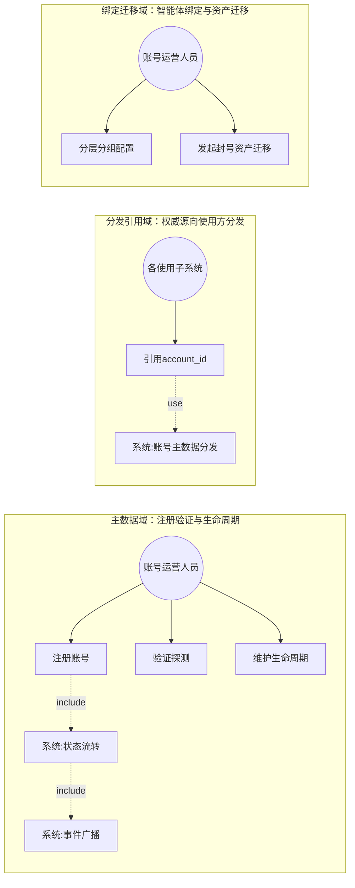
```mermaid
flowchart LR
  subgraph 主数据域["主数据域：注册验证与生命周期"]
    A1((账号运营人员))
    UC1[注册账号]
    UC2[验证探测]
    UC3[维护生命周期]
    UC4[系统:状态流转]
    UC5[系统:事件广播]
    A1 --> UC1 & UC2 & UC3
    UC1 -. include .-> UC4
    UC4 -. include .-> UC5
  end
  subgraph 分发引用域["分发引用域：权威源向使用方分发"]
    A2((各使用子系统))
    UC6[引用account_id]
    UC7[系统:账号主数据分发]
    A2 --> UC6
    UC6 -. use .-> UC7
  end
  subgraph 绑定迁移域["绑定迁移域：智能体绑定与资产迁移"]
    A1B((账号运营人员))
    UC8[分层分组配置]
    UC9[发起封号资产迁移]
    A1B --> UC8 & UC9
  end
```

---

**第③步 理清流程**（工具：时序图 ｜ 产物：需求范围 ｜ 验收：是否穷举相关子系统）

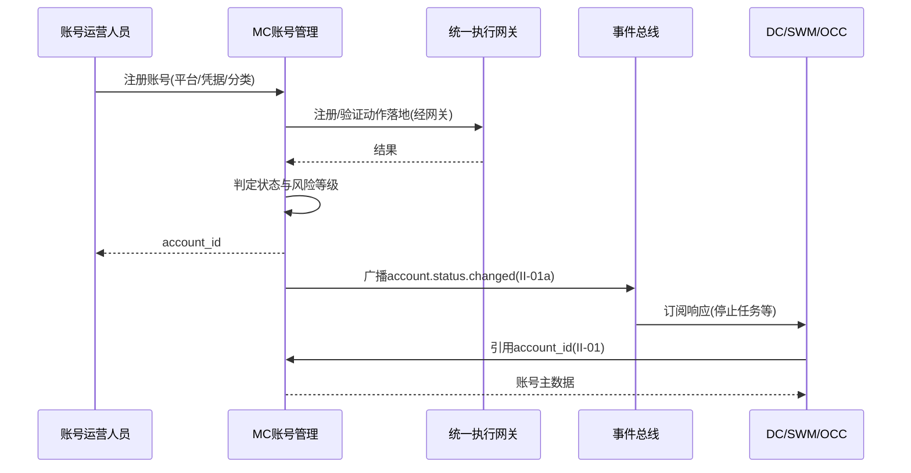
```mermaid
sequenceDiagram
  participant 运营 as 账号运营人员
  participant MC as MC账号管理
  participant 网关 as 统一执行网关
  participant 总线 as 事件总线
  participant 使用方 as DC/SWM/OCC
  运营->>MC: 注册账号(平台/凭据/分类)
  MC->>网关: 注册/验证动作落地(经网关)
  网关-->>MC: 结果
  MC->>MC: 判定状态与风险等级
  MC-->>运营: account_id
  MC->>总线: 广播account.status.changed(II-01a)
  总线->>使用方: 订阅响应(停止任务等)
  使用方->>MC: 引用account_id(II-01)
  MC-->>使用方: 账号主数据
```

---

**第④步 理清流程-异常**（工具：流程图 ｜ 产物：异常场景 ｜ 验收：每个交互点是否都有异常分支）

| 交互点 | 异常分支 | 应对 |
|--------|---------|------|
| 账号状态 | 被封禁/受限 | 自动标记状态并停止该账号相关任务 |
| 验证探测 | 失败 | 记录异常并重试 |
| 注册流程 | 接码/验证失败 | 回滚并记录 |
| 账号服务接口 | 不可用 | 使用方降级为本地缓存只读并告警 |
| agent_id 绑定 | 冲突（目标账号已绑其他 agent_id） | 拒绝迁移并提示 |

---

**第⑤步 列出规则**（工具：表格 ｜ 产物：验证点 ｜ 验收：规则是否可测、是否落到具体需求内）

| 规则 | 可测的验证点 | 归属子目标 |
|------|------------|-----------|
| 主数据唯一维护+凭据加密+使用方不复制 | 主数据权威且加密 | ①主数据 |
| 注册支持邮箱/手机接码/虚拟号 | 三种注册方式可走通 | ①主数据 |
| 注册/验证动作经执行网关落地 | 动作收口网关 | ①主数据 |
| 验证探测识别封禁/限制/需验证+输出风险等级 | 风险等级可识别 | ①主数据 |
| 生命周期状态流转(待登录/正常/受限/需验证/封禁/归档) | 状态可流转 | ①主数据 |
| 两类分类(爬虫=Profile/认知作战=移动端) | 分类正确归口 | ①主数据 |
| account_id 全局唯一贯穿 DC/MC/SWM/OCC | 全局可引用 | ①主数据 |
| account.status.changed 事件广播全网即时失效 | 事件广播生效 | ①主数据 |
| 按业务目标/平台/地区/风险等级分层分组 | 分层分组可配 | ②分组 |
| 作业生命周期(待激活/活跃/休眠/受限/封禁/回收)可流转 | 状态可流转 | ②分组 |
| agent_id↔account_id 1:1 绑定 | 绑定可记录查询 | ③绑定迁移 |
| 封号资产迁移(人设/提示词/记忆整体继承到新账号) | 迁移可执行延续人格 | ③绑定迁移 |

---

**拆分结论（含四原则校验）**：三子目标可归为三组端到端价值：①账号主数据权威维护与分发（注册/验证/生命周期/分类/事件）；②智能体账号分层分组与作业生命周期；③智能体-账号绑定与封号资产迁移。三者角色操作与验收点可分离。校验如下：

| 需求 | 足够小 | 端到端 | 独立性 | 可测性 |
|------|--------|--------|--------|--------|
| R-MC-011 账号主数据管理 | ✅ 聚焦主数据与生命周期 | ✅ 注册→验证→状态→事件分发 | ✅ 独立（权威源） | ✅ 注册/验证/状态/事件可验 |
| R-MC-012 智能体账号分层分组 | ✅ 聚焦分组与作业生命周期 | ✅ 分组→作业生命周期流转 | ✅ 建立在 010 之上 | ✅ 分组/生命周期可验 |
| R-MC-013 智能体账号绑定与资产迁移 | ✅ 聚焦绑定与迁移 | ✅ 绑定→封号→资产迁移延续人格 | ✅ 建立在 010/011 之上 | ✅ 绑定/迁移可验 |

###### R-MC-011 账号主数据管理

**需求目的**：作为账号资源的平台级权威源，唯一维护社交媒体账号的主数据（注册、凭据、验证、风险评估、生命周期、账号分类），并经事件总线向 DC、SWM、OCC 等使用方共享分发账号标识（account_id），保证全网账号数据一致、凭据加密、被封账号全网即时失效。

**使用角色**：账号运营人员（注册与维护账号）、各使用子系统（经账号服务接口引用账号）、系统（自动验证、状态流转、事件广播）。

**前置条件**：账号凭据加密存储机制可用；邮箱、手机接码、虚拟号等注册渠道已对接（EI-03）；账号状态规则与事件总线已配置；账号服务接口已就绪。

**输入**：待提交的账号注册信息（平台、账号名、凭据、标签、归属、账号分类）、平台注册方式（邮箱、手机接码、虚拟号）、验证探测请求与回传结果、账号状态变更请求、各使用方的账号引用请求。

**输出**：账号主数据记录、注册成功的账号标识（account_id）、账号可用性与风险评估结果、账号最新生命周期状态、账号服务接口（查询/变更）、account.status.changed 事件。

**业务规则**：

| 规则 | 说明 |
|------|------|
| 主数据权威 | 账号主数据（凭据、平台、全局状态、生命周期、风险评估、账号分类，凭据须加密存储）由本子系统唯一维护，其它子系统（DC/SWM/OCC）不复制主数据，仅引用 account_id |
| 注册入口 | 账号注册由本子系统承担入口与主数据落地，支持邮箱注册、手机号接码注册（EI-03）与虚拟号注册流程；注册/验证落到执行终端的动作由统一执行网关执行（爬虫账号在浏览器 Profile 经 CDP、认知作战账号在移动端经 ADB/无障碍）并回传结果 |
| 验证探测 | 账号验证通过登录探测与状态识别，检测可用性并识别封禁、限制、需验证等风险点，输出风险等级 |
| 生命周期 | 账号生命周期在待登录、正常、受限、需验证、封禁、归档等状态间流转，由本子系统判定与维护 |
| 账号分类 | 爬虫账号以桌面端指纹浏览器 Profile 为执行终端；认知作战账号以移动端设备为执行终端；两类账号的注册、验证与生命周期主数据均由本子系统维护 |
| 全局引用 | account_id 为全局唯一引用，贯穿 DC（采集）、MC（养号执行、分层分组、agent_id 绑定）、SWM（人设）、OCC（目标） |
| 事件广播 | 账号状态变更（封禁、受限等）经事件总线广播 account.status.changed 事件，使用方订阅后立即响应（停止任务、停止养号、休眠智能体、移除目标），保证被封账号全网即时失效 |

**异常场景**：账号被封禁或受限时自动标记状态并停止该账号相关任务；验证探测失败时记录异常并重试；注册流程接码或验证失败时回滚并记录；账号服务接口不可用时使用方降级为本地缓存只读并告警；事件广播失败时重试。

**验收标准**：账号主数据由本子系统唯一维护且使用方不复制；account_id 全局唯一可被各子系统引用；账号注册流程可走通且凭据加密存储不落明文；账号可用性与风险等级可自动识别；账号状态可按生命周期规则流转并经事件全网即时生效；两类分类可分别归口到桌面端与移动端执行终端。

**关联接口**：II-01 账号服务接口、II-01a 账号状态变更事件、EI-03 接码与虚拟号服务、II-07 执行网关动作接口。

###### R-MC-012 智能体账号分层分组

**需求目的**：对智能体账号按业务目标、平台、地区、风险等级等维度分层分组，形成可控的账号层级结构，并管理智能体账号的作业生命周期（待激活、活跃、休眠、受限、封禁、回收），支持状态间的自动与人工流转。

**使用角色**：账号运营人员（配置分层分组）、作战指挥人员（管理作业生命周期）、系统（自动流转）。

**前置条件**：R-MC-011 账号主数据已维护；分层分组规则已配置。

**输入**：分层与层级结构定义、智能体账号、作业生命周期变更请求。

**输出**：智能体账号的层级分组结构、账号作业生命周期状态。

**业务规则**：

| 规则 | 说明 |
|------|------|
| 分层分组 | 系统对智能体账号按业务目标、平台、地区、风险等级等维度分层分组，形成可控的账号层级结构 |
| 作业生命周期 | 系统管理智能体账号的作业生命周期（待激活、活跃、休眠、受限、封禁、回收），支持状态间的自动与人工流转 |

**异常场景**：分组调整失败时回滚；作业生命周期流转冲突时按账号标识加锁。

**验收标准**：智能体账号可按多维度分层分组且作业生命周期状态可自动与人工流转。

**关联接口**：II-01 账号服务接口。

###### R-MC-013 智能体账号绑定与资产迁移

**需求目的**：维护账号与智能体定义（agent_id）的严格 1:1 绑定关系，叠加账号-终端-代理绑定规则形成四元作战单元（agent_id:account_id:终端:代理 IP = 1:1:1:1）；并在账号被封禁后支持运营人员发起资产迁移，将原 agent_id 的人设标签、提示词版本与记忆整体继承到新账号，保证人格连贯性。

**使用角色**：账号运营人员（发起封号资产迁移）、系统（维护绑定关系）。

**前置条件**：R-MC-011 账号主数据已维护；agent_id 由 SWM 分配并以 II-14 接口同步至本子系统；账号-终端-代理绑定已建立。

**输入**：agent_id 绑定关系（来自 SWM 同步）、封号资产迁移请求（源 agent_id、目标账号）。

**输出**：agent_id↔account_id 绑定关系记录、四元绑定关系（agent_id↔account_id↔终端↔代理 IP）、资产迁移执行结果。

**业务规则**：

| 规则 | 说明 |
|------|------|
| 1:1 绑定 | 账号与智能体定义（agent_id）严格 1:1 绑定，由本子系统记录并维护 agent_id↔account_id 绑定关系 |
| 四元作战单元 | 叠加账号-终端-代理绑定规则（含终端与固定代理 IP 的绑定），移动端形成 agent_id:account_id:终端:代理 IP = 1:1:1:1 的作战单元，桌面端每个 Profile 内部同样 1:1:1:1；agent_id 由 SWM 分配并以 II-14 同步至本子系统持存 |
| 资产迁移 | 账号被封禁后，运营人员可对该账号绑定的智能体发起资产迁移——将原 agent_id 的人设标签、提示词版本与记忆整体继承到一个新注册且未绑定 agent_id 的目标账号，旧 agent_id↔旧账号解绑并休眠、新绑定激活；目标账号须满足账号-终端绑定规则（移动端须有可用终端或后续绑定）；迁移由人工触发、内容整体继承，保证人格连贯性、避免误迁 |

**异常场景**：agent_id 绑定冲突（如目标账号已绑定其他 agent_id）时拒绝迁移并提示；资产迁移目标账号不满足绑定规则时拒绝并提示；多使用方并发变更扩展属性时按账号标识加锁。

**验收标准**：agent_id↔account_id 1:1 绑定关系可记录与查询；四元作战单元可形成；封号资产可经人工触发整体迁移到新账号并延续人格。

**关联接口**：II-01 账号服务接口、II-14 智能体定义同步接口。

##### 智能体执行宿主与同步

**用户需求概述**：作为智能体的执行宿主，接收并持存 SWM 同步来的智能体定义（以 agent_id 为标识），在任务执行时调用这些定义驱动设备作业，并在执行前校验人设一致性，作为最后一道闸。

---

**第①步 目标澄清**（工具：干系人多角度分析 ｜ 产物：子目标清单 ｜ 验收：是否穷举所有干系人的价值诉求）：①MC 能持存 SWM 同步来的智能体定义并作为 OCC 编排节点来源；②执行前校验人设一致性（最后一道闸）；③执行时按定义调用 IRS 推理并经网关落地。

---

**第②步 梳理场景**（工具：用例图 ｜ 产物：场景 ｜ 验收：是否穷举所有用户操作）

本需求主体为系统（接收同步/持存/校验/调用），无终端用户直接操作，按三组子目标穷举系统操作：

| 角色 | 操作 |
|------|------|
| 系统（接收同步） | 经 II-14 接收 SWM 同步的智能体定义（agent_id/人设/提示词/记忆/策略）、以 agent_id 为主键持存、定义更新时取最新版本、记录四元绑定关系 |
| 系统（执行前校验） | 任务执行前校验"当前 account_id 绑定人设标签"与"agent_id 定义人设标签"一致性，作为最后一道闸 |
| 系统（执行调用） | 按定义调用 IRS 推理产出动作指令、动作经执行网关落地、作为 OCC 编排节点来源（以 agent_id 引用） |

```mermaid
flowchart LR
  subgraph 接收持存域["接收持存域：智能体定义落得住"]
    UC1[系统:接收SWM同步定义]
    UC2[系统:以agent_id持存]
    UC3[系统:定义更新取最新版本]
    UC4[系统:记录四元绑定]
    UC1 -. include .-> UC2
    UC2 -. extends .-> UC3
    UC2 -. extends .-> UC4
  end
  subgraph 校验域["校验域：执行前最后一道闸"]
    UC5[系统:人设一致性校验]
    UC5 -. use .-> UC2
  end
  subgraph 调用执行域["调用执行域：按定义落地作业"]
    UC6[系统:按定义调用IRS推理]
    UC7[系统:动作经执行网关落地]
    UC8[系统:作为OCC节点来源]
    UC5 -. include .-> UC6
    UC6 -. include .-> UC7
    UC2 -. use .-> UC8
  end
```

---

**第③步 理清流程**（工具：时序图 ｜ 产物：需求范围 ｜ 验收：是否穷举相关子系统）

正常流程涉及 4 个子系统/组件：蜂群智能体 SWM（II-14 同步）、私有化大模型 IRS（EI-05/II-08 推理）、统一执行网关（II-07 落地）、舆情作战 OCC（以 agent_id 引用作智能体节点来源）。

```mermaid
sequenceDiagram
  participant SWM as SWM蜂群智能体
  participant MC as MC智能体执行宿主
  participant OCC as OCC作战编排
  participant IRS as IRS本地大模型(EI-05)
  participant 网关 as 执行网关(II-07)
  participant 终端 as 执行终端
  SWM->>MC: 同步智能体定义(agent_id/人设/提示词/记忆/策略, II-14)
  MC->>MC: 以agent_id持存+记录四元绑定
  MC-->>SWM: 同步确认+持存版本号
  OCC->>MC: 作战编排引用agent_id(智能体节点)
  MC->>MC: 任务执行前人设一致性校验
  alt 人设一致
    MC->>IRS: 视觉推理与规划(II-08,不经网关)
    IRS-->>MC: 动作指令
    MC->>网关: 动作指令(II-07)
    网关->>终端: 转发动作(ADB/无障碍/CDP)
    终端-->>网关: 执行结果
  else 人设不一致
    MC->>MC: 拒绝执行并告警
  end
```

---

**第④步 理清流程-异常**（工具：流程图 ｜ 产物：异常场景 ｜ 验收：每个交互点是否都有异常分支）

| 交互点 | 异常分支 | 应对 |
|--------|---------|------|
| SWM ↔ MC（定义同步 II-14） | 同步失败 | 保留上一可用定义并告警 |
| MC 智能体定义 | 定义缺失 | 降级为脚本模式或人工介入 |
| MC ↔ IRS（推理 II-08） | 推理失败 | 降级处理 |
| MC 人设一致性校验 | 校验不通过（人设标签不一致） | 拒绝执行并告警 |
| 四元绑定关系 | 缺失或冲突 | 挂起任务并提示 |

---

**第⑤步 列出规则**（工具：表格 ｜ 产物：验证点 ｜ 验收：规则是否可测、是否落到具体需求内）

| 规则 | 可测的验证点 | 归属子目标 |
|------|------------|-----------|
| 以 agent_id 为主键持存 SWM 同步的智能体定义 | 给定 agent_id 可取回持存定义 | ①持存定义 |
| 记录 agent_id↔account_id↔终端↔代理 IP 四元绑定 | 四元绑定关系可记录与查询 | ①持存定义 |
| 定义更新（同一 agent_id 重新同步）时取最新版本 | 更新后执行使用最新定义 | ①持存定义 |
| 执行前校验人设一致性，不一致拒绝执行并告警 | 注入不一致人设后任务被拒绝且告警 | ②校验（最后一道闸） |
| 执行时按定义调用 IRS 推理、动作指令经执行网关落地 | 智能体模式下可驱动终端动作且动作经网关收口 | ③调用执行 |
| 作为 OCC 作战编排智能体节点来源，以 agent_id 引用 | OCC 编排中的智能体节点可引用 MC 持存定义 | ①持存定义/③调用执行 |

---

**拆分结论**：三子目标围绕"智能体执行宿主"这一价值（持存→校验→调用），作为一条端到端链路，作为一个需求。编号 R-MC-014。

###### R-MC-014 智能体执行宿主与同步

**需求目的**：作为智能体的执行宿主，接收并持存蜂群智能体子系统（SWM）同步来的智能体定义（以 agent_id 为标识，含人设标签、提示词、记忆、作业策略），在任务执行时调用这些定义驱动设备作业，并在执行前校验人设一致性。本功能确立"SWM 为智能体定义与记忆中心、MC 为智能体执行宿主"的分工。

**使用角色**：系统（接收同步、持存、校验、调用）。

**前置条件**：SWM 智能体定义同步接口（II-14）可用；执行网关可用；智能体已与账号建立 agent_id↔account_id 1:1 绑定（R-MC-013）。

**输入**：来自 SWM 的智能体定义（agent_id、人设标签、提示词、记忆、作业策略）、任务执行请求（含目标 agent_id 与 account_id）。

**输出**：持存的智能体定义（按 agent_id 索引）、四元绑定关系（agent_id↔account_id↔终端↔代理 IP）、智能体执行调用结果、人设一致性校验结果、执行网关的动作日志。

**业务规则**：

| 规则 | 说明 |
|------|------|
| 定义持存 | 本子系统以 agent_id 为主键接收 SWM 同步的智能体定义并持存，作为任务执行时调用智能体的依据 |
| 四元绑定记录 | 本子系统记录并维护 agent_id↔account_id↔终端↔代理 IP 的四元绑定关系（与 R-MC-013 的 agent_id↔account_id 绑定、R-MC-009 的账号-终端绑定、R-MC-003 的终端-代理 IP 绑定联动），形成 1:1:1:1 作战单元 |
| 人设一致性校验 | 智能体模式下任务执行前，本子系统校验"当前 account_id 绑定的人设标签"与"agent_id 智能体定义中的人设标签"是否一致，一致方可调用 IRS 推理并经执行网关落地动作，不一致则拒绝执行并告警；一致性收口于执行宿主，作为最后一道闸 |
| 执行调用 | 任务执行时本子系统按智能体定义中的提示词、记忆与作业策略，调用 IRS 本地大模型进行视觉推理与规划，产出的动作指令再经执行网关落地 |
| 定义更新 | 智能体定义更新时（SWM 以同一 agent_id 重新同步）本子系统更新持存版本，保证执行使用最新定义 |
| OCC 节点来源 | 本子系统可作为 OCC 作战编排的执行节点来源——编排中的智能体节点即以 agent_id 引用本子系统持存的智能体 |

**异常场景**：SWM 同步失败时保留上一可用定义并告警；智能体定义缺失时降级为脚本模式或人工介入；推理调用 IRS 失败时降级处理；人设一致性校验不通过时拒绝执行并告警；四元绑定关系缺失或冲突时挂起任务并提示。

**验收标准**：可以 agent_id 接收并持存 SWM 同步的智能体定义；四元绑定关系（agent_id↔account_id↔终端↔代理 IP）可记录与查询；任务执行前可校验人设一致性且不一致时拒绝执行；任务执行时可按定义调用并经执行网关落地动作；智能体定义更新后可使用最新版本执行；可作为 OCC 作战编排的智能体节点来源（以 agent_id 引用）。

**关联接口**：II-08 本地大模型推理调用、II-14 智能体定义同步接口、II-07 执行网关动作接口、EI-05 本地大模型推理。

> 说明：MC 子系统的八项用户需求均已按"目标澄清 → 梳理场景 → 理清流程 → 理清流程-异常 → 列出规则"五步分析，并按"足够小、端到端、独立性、可测性"四原则重新划分为 R-MC-001 ~ R-MC-014 共 14 个需求。

#### 运维监控子系统（OM）

##### 日志与指标汇聚

**用户需求概述**：汇聚数据爬取子系统、群控子系统及平台自身的日志与指标，形成统一的运维数据底座，支撑全系统可观测。

**第①步 目标澄清**（工具：干系人多角度分析 ｜ 产物：子目标清单 ｜ 验收：是否穷举所有干系人的价值诉求）：①运维人员能检索各子系统日志、查看运行指标（可观测底座）；②指标可形成时序数据供告警与分析。
**第②步 梳理场景**（工具：用例图 ｜ 产物：场景 ｜ 验收：是否穷举所有用户操作）

各角色的操作穷举：

| 角色 | 操作 |
|------|------|
| 运维人员 | 检索各子系统日志（全文检索）、查看运行指标 |
| 系统（自动） | 采集各子系统日志与指标、汇聚至日志库与时序库、Agent 本地暂存与补传 |

```mermaid
flowchart LR
  subgraph 采集域["采集域：把日志指标汇聚起来"]
    A1((运维人员))
    A2((系统-采集))
    UC1[检索子系统日志]
    UC2[查看运行指标]
    UC3[系统:采集各子系统日志]
    UC4[系统:采集运行指标]
    UC5[系统:汇聚写入日志库与时序库]
    A1 --> UC1 & UC2
    A2 --> UC3 & UC4 & UC5
    UC3 -. include .-> UC5
    UC4 -. include .-> UC5
  end
```

---

**第③步 理清流程**（工具：时序图 ｜ 产物：需求范围 ｜ 验收：是否穷举相关子系统）

```mermaid
sequenceDiagram
  participant 各子系统 as 各子系统(DC/MC/平台)
  participant Agent as 日志采集Agent
  participant 日志库 as 日志库
  participant 采集器 as 指标采集器
  participant TSDB as 时序数据库
  participant OM as OM运维监控
  participant 运维 as 运维人员
  各子系统->>Agent: 产出日志(II-04)
  Agent->>日志库: 汇聚写入(全文索引)
  各子系统->>采集器: 暴露运行指标(II-04)
  采集器->>TSDB: 采集设备在线率/任务成功率/爬虫吞吐量/队列积压
  运维->>OM: 全文检索日志/查看指标
  OM->>日志库: 检索日志
  OM->>TSDB: 查询时序指标
  日志库-->>运维: 日志结果
  TSDB-->>运维: 时序指标
```

---

**第④步 理清流程-异常**（工具：流程图 ｜ 产物：异常场景 ｜ 验收：每个交互点是否都有异常分支）

| 交互点 | 异常分支 | 应对 |
|--------|---------|------|
| Agent ↔ 各子系统 | Agent 离线 | 本地暂存，恢复后补传 |
| Agent ↔ 日志库 | 采集超时 | 降级采样 |
| 采集器/Agent ↔ 日志库/TSDB | 写入失败 | 进入重试队列重试 |

---

**第⑤步 列出规则**（工具：表格 ｜ 产物：验证点 ｜ 验收：规则是否可测、是否落到具体需求内）

| 规则 | 可测的验证点 | 归属子目标 |
|------|------------|-----------|
| 日志汇聚至统一日志库 | 各子系统日志可统一检索 | ①日志可检索 |
| 日志全文检索 | 给定关键词，近 7 日日志 ≤3s 返回结果 | ①日志可检索 |
| 关键指标采集时序化 | 设备在线率/任务成功率/爬虫吞吐量/队列积压可查时序曲线 | ②指标时序化 |

---

**拆分结论**：一个端到端价值（可观测底座），不拆。编号 R-OM-001。四原则自检：足够小✓（日志汇聚+指标时序化单一职责）｜端到端✓（各子系统日志→统一可检索）｜独立性✓（独立）｜可测性✓（≤3s 检索响应可度量）。

###### R-OM-001 日志与指标汇聚

**需求目的**：汇聚数据爬取子系统、群控子系统及平台自身的日志与指标，形成统一的运维数据底座，支撑全系统可观测。

**使用角色**：运维人员（检索日志与查看指标）、系统（自动采集与汇聚）。

**前置条件**：各子系统日志采集 Agent 与指标采集器已部署；日志库与时序数据库可用。

**输入**：各子系统产生的日志与系统运行指标。

**输出**：统一日志库与时序指标数据。

**业务规则**：

| 规则 | 说明 |
|------|------|
| 日志汇聚检索 | 系统通过日志采集将各子系统日志汇聚至统一日志库，支持全文检索 |
| 指标时序化 | 系统通过指标采集器采集设备在线率、任务成功率、爬虫吞吐量、队列积压等指标，形成时序数据 |

**异常场景**：日志采集 Agent 离线时本地暂存待恢复上报；指标采集超时时降级采样；日志库写入失败时进入重试队列。

**验收标准**：各子系统日志可汇聚至统一日志库并支持全文检索；关键指标可采集为时序数据；近 7 日日志检索响应不大于 3 秒。

**关联接口**：II-04 日志与指标上报接口。

##### 告警与运维

**用户需求概述**：基于指标与规则产生告警，并通过仪表盘与运维操作支持常态化运维。

**第①步 目标澄清**（工具：干系人多角度分析 ｜ 产物：子目标清单 ｜ 验收：是否穷举所有干系人的价值诉求）：①指标与规则触发的异常能被及时发现并通知运维人员（告警）；②运维人员能通过看板与运维操作做常态化运维。
**第②步 梳理场景**（工具：用例图 ｜ 产物：场景 ｜ 验收：是否穷举所有用户操作）

各角色的操作穷举：

| 角色 | 操作 |
|------|------|
| 运维人员 | 配置告警规则（阈值/异常检测）、查看看板（总览/设备/任务/爬虫/异常）、执行运维操作（日志查询/故障定位/巡检/容量观测） |
| 系统（自动） | 指标与规则触发异常检测、告警多渠道通知、告警风暴聚合去重 |

```mermaid
flowchart LR
  subgraph 告警域["告警域：异常能被发现并通知"]
    A1((运维人员))
    A2((系统-告警))
    UC1[配置告警规则]
    UC2[系统:指标规则触发检测]
    UC3[系统:多渠道通知]
    UC4[系统:告警风暴聚合去重]
    A1 --> UC1
    A2 --> UC2 & UC3 & UC4
    UC1 -. use .-> UC2
    UC2 -. include .-> UC3
  end
  subgraph 运维域["运维域：常态化运维"]
    A1b((运维人员))
    UC5[查看看板]
    UC6[日志查询/故障定位]
    UC7[巡检/容量观测]
    A1b --> UC5 & UC6 & UC7
  end
```

---

**第③步 理清流程**（工具：时序图 ｜ 产物：需求范围 ｜ 验收：是否穷举相关子系统）

```mermaid
sequenceDiagram
  participant TSDB as 时序数据库(R-OM-001)
  participant 告警 as OM告警引擎
  participant 渠道 as 通知渠道
  participant 运维 as 运维人员
  participant 看板 as OM看板
  运维->>告警: 配置告警规则(阈值/异常检测)
  TSDB->>告警: 时序指标(II-04)
  告警->>告警: 规则触发异常检测
  告警->>渠道: 多渠道通知(风暴聚合去重)
  渠道-->>运维: 告警通知
  运维->>看板: 查看多维看板(总览/设备/任务/爬虫/异常)
  看板->>TSDB: 查询指标
  运维->>看板: 日志查询/故障定位/巡检/容量观测
  看板-->>运维: 运维结果
```

---

**第④步 理清流程-异常**（工具：流程图 ｜ 产物：异常场景 ｜ 验收：每个交互点是否都有异常分支）

| 交互点 | 异常分支 | 应对 |
|--------|---------|------|
| 告警引擎 ↔ 规则/指标 | 告警风暴 | 聚合去重 |
| 告警引擎 ↔ 通知渠道 | 通知渠道失效 | 降级至备用渠道 |
| 看板 ↔ 时序数据库 | 看板查询超时 | 降级（缓存/抽样展示） |

---

**第⑤步 列出规则**（工具：表格 ｜ 产物：验证点 ｜ 验收：规则是否可测、是否落到具体需求内）

| 规则 | 可测的验证点 | 归属子目标 |
|------|------------|-----------|
| 阈值/异常检测告警 | 指标越阈值或异常时触发告警 | ①异常及时发现通知 |
| 多渠道通知 | 告警可经多渠道送达运维人员 | ①异常及时发现通知 |
| 告警风暴聚合去重 | 短时大量同类告警聚合为一条 | ①异常及时发现通知 |
| 多维看板（总览/设备/任务/爬虫/异常） | 各维度看板可展示对应指标 | ②常态化运维 |
| 运维操作（日志查询/故障定位/巡检/容量观测） | 运维人员可执行各项运维操作 | ②常态化运维 |

---

**拆分结论**：一个端到端价值（常态化运维），不拆。编号 R-OM-002。四原则自检：足够小✓（告警+看板+运维操作单一职责）｜端到端✓（指标→告警通知→看板运维）｜独立性✓（依赖 R-OM-001）｜可测性✓（告警触发/看板展示/运维操作可验）。

###### R-OM-002 告警与运维

**需求目的**：基于指标与规则产生告警，并通过仪表盘与运维操作支持常态化运维。

**使用角色**：运维人员（配置告警规则、查看看板、执行运维操作）。

**前置条件**：时序指标数据可用（R-OM-001）；告警规则与通知渠道已配置。

**输入**：告警规则与指标、运维操作请求。

**输出**：告警事件、可视化看板、运维操作记录。

**业务规则**：

| 规则 | 说明 |
|------|------|
| 告警 | 系统支持阈值告警与异常检测告警，并通过多渠道通知 |
| 可视化看板 | 系统提供总览、设备、任务、爬虫、异常等多维可视化看板 |
| 运维操作 | 系统支持日志查询、故障定位、巡检与容量观测等常态化运维操作 |

**异常场景**：告警风暴时按规则聚合去重；通知渠道失效时降级为备用渠道；看板数据加载超时时降级展示缓存。

**验收标准**：阈值与异常检测告警可触发并多渠道通知；多维看板可可视化展示；日志查询、故障定位、巡检、容量观测等运维操作可执行。

**关联接口**：无（依赖 R-OM-001 时序指标数据）。

> 实现说明（V3.5 补充）：OM 采用「复用 KubeSphere 开源版可观测底座 + 只读观测」定位。告警规则（阈值/异常检测）与通知渠道的**配置**由运维人员经 KubeSphere 控制台操作（在 Alertmanager / Prometheus Rule CRD 中定义）；OM 提供告警规则与告警事件的**只读观测**及告警事件归档，不提供配置下发接口。多渠道通知由 Alertmanager 原生接收器（邮件/IM webhook/通用 webhook）承担。看板由 KubeSphere 内置 Grafana 渲染，OM 镜像看板元数据。详见《软件详细设计说明-OM子系统》。

> 说明：OM 子系统的两项用户需求均已按"目标澄清 → 梳理场景 → 理清流程 → 理清流程-异常 → 列出规则"五步分析，并按"足够小、端到端、独立性、可测性"四原则校验，划分为 R-OM-001 ~ R-OM-002 共 2 个需求。

#### 公共功能（COM）

##### 用户认证与权限

**用户需求概述**：为各子系统提供统一的用户认证、基于角色的访问控制与组织管理，支持多组织的数据隔离。

**第①步 目标澄清**（工具：干系人多角度分析 ｜ 产物：子目标清单 ｜ 验收：是否穷举所有干系人的价值诉求）：①各子系统用户能统一登录认证；②按角色做权限控制（RBAC）；③多组织/多租户数据隔离。
**第②步 梳理场景**（工具：用例图 ｜ 产物：场景 ｜ 验收：是否穷举所有用户操作）

各角色的操作穷举：

| 角色 | 操作 |
|------|------|
| 超级管理员 | 管理组织、管理角色（超级管理员/运营主管/运营人员/脚本开发者/审核人员/只读观察员）、分配用户角色 |
| 各角色用户 | 账号密码登录、按角色权限操作业务功能 |

```mermaid
flowchart LR
  subgraph 认证域["认证域：统一登录"]
    A1((各角色用户))
    UC1[账号密码登录]
    A1 --> UC1
  end
  subgraph 权限域["权限域：RBAC 与组织隔离"]
    A2((超级管理员))
    A1b((各角色用户))
    UC3[管理组织]
    UC4[管理角色与分配]
    UC5[按角色权限操作]
    UC6[多组织数据隔离]
    A2 --> UC3 & UC4
    A1b --> UC5
    UC5 -. use .-> UC6
  end
```

---

**第③步 理清流程**（工具：时序图 ｜ 产物：需求范围 ｜ 验收：是否穷举相关子系统）

```mermaid
sequenceDiagram
  participant 用户 as 各角色用户
  participant 认证 as COM认证服务
  participant 权限 as COM权限服务
  participant 业务 as 各业务子系统
  用户->>认证: 账号密码登录
  认证->>认证: 校验密码
  认证-->>用户: 登录令牌(含角色与组织)
  用户->>业务: 访问业务功能
  业务->>权限: 权限决策(RBAC 角色 + 组织隔离)
  权限-->>业务: 允许/拒绝
  业务-->>用户: 业务结果
```

---

**第④步 理清流程-异常**（工具：流程图 ｜ 产物：异常场景 ｜ 验收：每个交互点是否都有异常分支）

| 交互点 | 异常分支 | 应对 |
|--------|---------|------|
| 用户 ↔ 认证服务 | 密码错误超限 | 锁定账号 |
| 业务 ↔ 权限服务 | 越权访问 | 拦截并审计 |

---

**第⑤步 列出规则**（工具：表格 ｜ 产物：验证点 ｜ 验收：规则是否可测、是否落到具体需求内）

| 规则 | 可测的验证点 | 归属子目标 |
|------|------------|-----------|
| 账号密码登录 | 用户以账号密码通过登录认证 | ①统一登录认证 |
| RBAC 角色（超级管理员/运营主管/运营人员/脚本开发者/审核人员/只读观察员） | 不同角色可见可操作的功能不同 | ②按角色权限控制 |
| 多组织数据隔离 | A 组织用户不可见 B 组织数据 | ③多组织隔离 |
| 密码错误超限锁定 | 连续错误达上限后账号被锁定 | ①统一登录认证 |
| 越权访问拦截审计 | 越权请求被拦截且留有审计记录 | ②按角色权限控制 |

---

**拆分结论**：一个端到端价值（统一认证与权限），不拆。编号 R-COM-001。四原则自检：足够小✓（认证+RBAC+组织隔离单一职责）｜端到端✓（登录→权限决策→数据隔离）｜独立性✓（独立）｜可测性✓（登录认证/RBAC/隔离可验）。

###### R-COM-001 用户认证与权限

**使用角色**：超级管理员（管理组织与角色）、各角色用户（登录与操作）。

**前置条件**：用户与角色数据已初始化。

**输入**：用户账号与密码、角色与权限配置、组织与成员信息。

**输出**：认证令牌、权限决策结果、组织结构。

**业务规则**：

| 规则 | 说明 |
|------|------|
| 登录认证 | 系统进行账号密码登录认证 |
| RBAC 权限 | 系统基于角色的访问控制进行权限决策，角色包括超级管理员、运营主管、运营人员、脚本开发者、审核人员与只读观察员等 |
| 多组织隔离 | 系统对多组织或多租户进行数据隔离 |

**异常场景**：登录密码错误超限时锁定账号；越权访问时拦截并审计。

**验收标准**：登录认证可用；RBAC 权限决策可按角色控制；多组织数据可隔离且禁止跨组织访问。

**关联接口**：II-16 COM 认证服务（M-COM-01）、II-17 COM 权限与组织管理（M-COM-02）；各子系统统一调用。

> 说明：COM 子系统的一项用户需求已按"目标澄清 → 梳理场景 → 理清流程 → 理清流程-异常 → 列出规则"五步分析，并按"足够小、端到端、独立性、可测性"四原则校验，划分为 R-COM-001 共 1 个需求。

#### 蜂群智能体子系统（SWM）

蜂群智能体子系统是执行层的"智能体定义与记忆中心"，核心职责是根据人设（画像、账号属性）编写驱动智能体作业的提示词与记忆，并将智能体定义（人设标签、提示词、记忆、作业策略）同步下发至群控子系统（MC）持存，由 MC 在任务执行时调用。子系统承担智能体构建、智能体评测、提示词与人设管理和记忆管理。账号主数据、智能体账号的分层分组与作业生命周期由 MC 统一维护（账号主数据 R-MC-011、分层分组 R-MC-012）；作业效果统计与复盘由 MC 的可观测性能力（R-MC-010）承担。SWM 与 MC 的分工为：SWM 为智能体定义与记忆中心（构建、评测、编写与同步），MC 为智能体执行宿主（持存与调用，见 R-MC-014）。

本子系统不直接操作设备，所有动作均收口于群控子系统的统一执行网关。在智能体模式下，本子系统将智能体定义同步至 MC，MC 据此在任务执行时调用（视觉推理调用底层 IRS 本地大模型），产出的动作指令再经执行网关落地。养号的拟人化节奏由群控子系统的自动化管理能力（R-MC-009）内置。本子系统也是 OCC 作战编排中智能体节点的供给方之一——OCC 编排 MC 中的智能体节点时，其智能体定义来源于本子系统同步至 MC 的内容。

##### 提示词与人设管理

**用户需求概述**：管理驱动智能体作业的提示词与智能体人设标签，支持人设标签绑定、提示词模板库分类、版本管理、场景适配、动态调用与迭代优化，并提供 Playground 试运行调试与版本输出对比能力以加速提示词的编写与调优，最终以 agent_id 为标识将完整的智能体定义（人设标签、提示词、记忆、作业策略）同步至 MC 持存。

**第①步 目标澄清**（工具：干系人多角度分析 ｜ 产物：子目标清单 ｜ 验收：是否穷举所有干系人的价值诉求）：①提示词工程师能管理提示词模板库（分类/版本/场景适配/动态调用/迭代）；②账号运营人员能配置人设标签并绑定到 agent_id；③提示词工程师能在 Playground 中试运行调试提示词并对比不同版本的输出；④智能体定义能以 agent_id 同步至 MC 持存。
**第②步 梳理场景**（工具：用例图 ｜ 产物：场景 ｜ 验收：是否穷举所有用户操作）

各角色的操作穷举：

| 角色 | 操作 |
|------|------|
| 提示词工程师 | 管理提示词模板库（分类/版本/场景适配）、Playground 试运行调试、版本输出对比、迭代优化 |
| 账号运营人员 | 配置人设标签并绑定 agent_id |
| 系统（自动） | 动态调用模板、按 MC 作业效果反馈迭代、以 agent_id 同步 MC（II-14） |

```mermaid
flowchart LR
  subgraph 模板域["模板域：提示词模板管理"]
    A1((提示词工程师))
    UC1[管理模板库分类]
    UC2[版本管理]
    UC3[场景适配]
    UC4[Playground 试运行调试]
    UC5[版本输出对比]
    UC6[迭代优化]
    A1 --> UC1 & UC2 & UC3 & UC4 & UC5 & UC6
  end
  subgraph 人设域["人设域：人设标签与同步"]
    A2((账号运营人员))
    A3((系统-同步))
    UC7[配置人设标签绑定agent_id]
    UC8[系统:动态调用模板]
    UC9[系统:按效果反馈迭代]
    UC10[系统:agent_id同步MC(II-14)]
    A2 --> UC7
    A3 --> UC8 & UC9 & UC10
    UC7 -. use .-> UC8
    UC8 -. include .-> UC10
  end
```

---

**第③步 理清流程**（工具：时序图 ｜ 产物：需求范围 ｜ 验收：是否穷举相关子系统）

```mermaid
sequenceDiagram
  participant 工程师 as 提示词工程师
  participant SWM as SWM提示词管理
  participant IRS as IRS本地大模型(EI-05)
  participant 运营 as 账号运营人员
  participant MC as MC智能体服务(II-14)
  participant 效果 as MC作业效果(R-MC-010)
  工程师->>SWM: 编写/维护模板(分类/版本/场景适配)
  工程师->>IRS: Playground 试运行推理(EI-05)
  IRS-->>工程师: 试运行输出
  工程师->>SWM: 版本输出对比/迭代优化
  运营->>SWM: 配置人设标签绑定agent_id
  SWM->>MC: 以agent_id同步智能体定义(II-14)
  MC-->>SWM: 同步确认
  效果->>SWM: 作业效果反馈(驱动迭代)
```

---

**第④步 理清流程-异常**（工具：流程图 ｜ 产物：异常场景 ｜ 验收：每个交互点是否都有异常分支）

| 交互点 | 异常分支 | 应对 |
|--------|---------|------|
| 运营 ↔ SWM（人设标签） | 人设标签冲突 | 人工裁定 |
| SWM（动态调用） | 模板填充失败 | 降级使用默认模板 |
| SWM（版本管理） | 版本回滚失败 | 告警 |
| 工程师 ↔ IRS（Playground） | 试运行推理失败 | 展示错误并支持重试 |
| 效果 ↔ SWM（反馈迭代） | 反馈数据缺失 | 暂停迭代 |
| SWM ↔ MC（同步） | 同步失败 | 暂存并重试 |

---

**第⑤步 列出规则**（工具：表格 ｜ 产物：验证点 ｜ 验收：规则是否可测、是否落到具体需求内）

| 规则 | 可测的验证点 | 归属子目标 |
|------|------------|-----------|
| 人设标签挂 agent_id（不复制账号主数据） | 人设标签以 agent_id 关联，账号主数据不被复制 | ③定义同步 |
| 模板库分类 | 模板可按分类组织检索 | ①模板管理 |
| 版本管理 | 模板有版本号，可回溯历史版本 | ①模板管理 |
| 场景适配 | 模板可按场景适配不同调用语境 | ①模板管理 |
| 动态调用 | 运行时可按场景动态选用模板填充 | ①模板管理 |
| Playground 试运行调试/版本输出对比 | 试运行输出可在版本间对比 | ②调试对比 |
| 迭代优化（按 MC 作业效果反馈） | 效果反馈可驱动模板迭代 | ②迭代 |
| 定义同步（以 agent_id 同步 MC，II-14） | 智能体定义以 agent_id 同步至 MC | ③定义同步 |

**拆分结论**：四子目标围绕"提示词与人设管理"这一价值，作为一个需求。编号 R-SWM-001。四原则自检：足够小✓（提示词+人设单一职责）｜端到端✓（模板→适配→调用→调试对比→同步）｜独立性✓（独立）｜可测性✓（绑定/版本/试运行/同步可验）。

###### R-SWM-001 提示词与人设管理

**需求目的**：管理驱动智能体作业的提示词与智能体人设标签，支持人设标签绑定、提示词模板库分类、版本管理、场景适配、动态调用、Playground 试运行调试、版本输出对比与迭代优化，并以 agent_id 为标识将完整的智能体定义同步至 MC 持存。人设标签挂在 agent_id 上（不直接挂 account_id），随智能体定义同步；账号主数据由 MC 统一维护（R-MC-011）。

**使用角色**：提示词工程师（编写与维护模板、Playground 调试与版本对比）、账号运营人员（配置人设标签）、系统（动态调用、迭代与同步）。

**前置条件**：提示词模板库已建立；人设标签体系已定义；agent_id 已分配；MC 智能体定义同步接口（II-14）可用；作业上下文与效果反馈可采集；IRS 本地大模型可用（用于 Playground 试运行推理）。

**输入**：提示词模板、分类规则、适用场景标签、agent_id、人设标签定义、作业上下文、效果反馈数据、Playground 调试输入（提示词草稿、测试用例、人设上下文）、待对比的提示词版本。

**输出**：以 agent_id 为标识的人设标签绑定关系、提示词模板库、版本记录（按 agent_id 索引）、场景适配结果、动态填充的提示词、Playground 试运行产出与调试记录、版本输出对比结果、迭代优化记录、同步至 MC 的智能体定义。

**业务规则**：

| 规则 | 说明 |
|------|------|
| 人设标签绑定 | 系统为每个 agent_id 绑定人设标签，标签涵盖身份特征、立场倾向、语言风格、兴趣领域等画像属性；人设标签挂在 agent_id 上，因 agent_id 与 account_id 严格 1:1 绑定，故人设通过 agent_id 间接对应唯一账号；本功能只维护人设标签，不复制账号主数据 |
| 模板库分类 | 系统建立提示词模板库并按用途、平台、目标进行分类管理 |
| 版本管理 | 系统对提示词进行版本管理，以 agent_id 为主键索引，支持版本对比、回滚与变更记录 |
| 场景适配 | 系统按作业场景适配提示词，根据人设标签、目标受众、当前态势选择合适模板 |
| 动态调用 | 系统在智能体作业时动态调用并填充提示词，生成最终作业指令 |
| Playground 试运行调试 | 系统提供提示词试运行调试工作台：提示词工程师在 Playground 中填入提示词草稿（可指定人设上下文、测试用例、目标平台等上下文）即时调用 IRS 本地大模型推理（经 EI-05，不经执行网关）并查看产出，支持参数调整后反复试跑；试运行不产生真实作业、不同步至 MC、不影响线上智能体定义 |
| 版本输出对比 | 系统支持将同一 agent_id 下不同版本的提示词（或草稿与历史版本）并排输入相同测试用例，调用 IRS 推理后并排展示各版本产出，供提示词工程师对比调优效果，辅助版本择优与迭代决策 |
| 迭代优化 | 系统结合作业效果反馈与 Playground/对比调优结果对提示词进行迭代优化，淘汰低效模板 |
| 定义同步 | 系统将 agent_id 对应的人设标签、提示词、记忆、作业策略组装为完整智能体定义，经 II-14 接口同步至 MC 持存（见 R-MC-014）；定义更新时以同一 agent_id 重新同步 |

**异常场景**：人设标签冲突时提示人工裁定；模板填充失败时降级为默认模板；版本回滚失败时告警；Playground 试运行推理调用 IRS 失败时展示错误并支持重试，不影响线上定义；效果反馈缺失时暂停迭代；同步至 MC 失败时暂存重试。

**验收标准**：人设标签可绑定到 agent_id 且涵盖画像属性（不复制账号主数据）；提示词模板库可分类管理；版本可按 agent_id 对比回滚；可按场景适配模板；可动态调用填充生成指令；可在 Playground 中填入提示词草稿即时调用 IRS 试运行并查看产出；可将不同版本提示词并排对比输出；可结合反馈与调优结果迭代优化；智能体定义可以 agent_id 同步至 MC 持存。

**关联接口**：EI-05 本地大模型推理（Playground 试运行与版本对比推理）、II-14 智能体定义同步接口。

##### 蜂群记忆管理

**用户需求概述**：实现智能体作业记忆的存储、场景沉淀、历史复用与个性化状态延续，使智能体长期行为符合人设且不断演进。

**第①步 目标澄清**（工具：干系人多角度分析 ｜ 产物：子目标清单 ｜ 验收：是否穷举所有干系人的价值诉求）：①智能体能存储作业关键信息并沉淀场景模式；②智能体能复用历史记忆维持个性化延续。
**第②步 梳理场景**（工具：用例图 ｜ 产物：场景 ｜ 验收：是否穷举所有用户操作）

各角色的操作穷举（记忆为系统内部存储，无人工操作）：

| 角色 | 操作 |
|------|------|
| 系统（自动） | 存储作业关键信息、沉淀场景模式、复用历史记忆、维持个性化延续 |

```mermaid
flowchart LR
  subgraph 记忆域["记忆域：智能体蜂群记忆"]
    A1((系统-记忆))
    UC1[存储作业关键信息]
    UC2[沉淀场景模式]
    UC3[复用历史记忆]
    UC4[维持个性化延续]
    A1 --> UC1 & UC2 & UC3 & UC4
    UC1 -. include .-> UC2
    UC3 -. use .-> UC4
  end
```

---

**第③步 理清流程**（工具：时序图 ｜ 产物：需求范围 ｜ 验收：是否穷举相关子系统）

```mermaid
sequenceDiagram
  participant MC as MC可观测性(作业过程回传)
  participant 记忆 as SWM蜂群记忆
  participant 智能体 as 智能体(人设)
  MC->>记忆: 作业关键信息(已完成任务/互动对象/立场表达)
  记忆->>记忆: 存储并沉淀场景模式
  智能体->>记忆: 复用历史记忆
  记忆-->>智能体: 历史/场景记忆
  智能体->>MC: 维持个性化延续的作业输出
```

---

**第④步 理清流程-异常**（工具：流程图 ｜ 产物：异常场景 ｜ 验收：每个交互点是否都有异常分支）

| 交互点 | 异常分支 | 应对 |
|--------|---------|------|
| MC ↔ 记忆（存储） | 存储失败 | 本地暂存，恢复后补写 |
| 记忆内部（多源写入） | 记忆冲突 | 以最新记忆为准 |
| 智能体 ↔ 记忆（复用） | 复用偏离人设 | 纠正回人设基线 |

---

**第⑤步 列出规则**（工具：表格 ｜ 产物：验证点 ｜ 验收：规则是否可测、是否落到具体需求内）

| 规则 | 可测的验证点 | 归属子目标 |
|------|------------|-----------|
| 记忆存储 | 作业关键信息可写入记忆并被读回 | ①存储沉淀 |
| 场景沉淀 | 相似作业模式可被归纳沉淀 | ①存储沉淀 |
| 历史复用 | 智能体可复用历史记忆完成作业 | ②复用延续 |
| 个性化延续 | 跨作业维持人设一致性（人设一致性评分不退化） | ②复用延续 |

**拆分结论**：两子目标围绕"智能体记忆"这一价值，作为一个需求。编号 R-SWM-002。四原则自检：足够小✓（记忆存储/沉淀/复用单一职责）｜端到端✓（作业过程→记忆→复用延续）｜独立性✓（独立）｜可测性✓（人设一致性评分提升可度量）。

###### R-SWM-002 蜂群记忆管理

**需求目的**：实现智能体作业记忆的存储、场景沉淀、历史复用与个性化状态延续，使智能体长期行为符合人设且不断演进。

**使用角色**：系统（自动存储与复用记忆）。

**前置条件**：记忆存储库可用；智能体已绑定人设。

**输入**：智能体作业过程数据、交互上下文、人设标签、历史记忆库。

**输出**：智能体作业记忆库、场景沉淀的模式、历史复用结果、个性化状态延续的智能体画像。

**业务规则**：

| 规则 | 说明 |
|------|------|
| 记忆存储 | 系统对智能体作业过程中的关键信息进行记忆存储，包括已完成任务、互动对象、立场表达等 |
| 场景沉淀 | 系统将重复场景下的经验沉淀为场景记忆，形成可复用的行为模式 |
| 历史复用 | 系统在相似作业中复用历史记忆，提升作业连贯性与效率 |
| 个性化延续 | 系统基于记忆维持智能体的个性化状态延续，使其长期行为符合人设且不断演进 |

**异常场景**：记忆存储失败时暂存待重试；记忆冲突时以最新记忆为准；复用记忆偏离人设时纠正。

**验收标准**：作业关键信息可记忆存储；重复场景经验可沉淀为模式；相似作业可复用历史记忆；智能体可基于记忆维持个性化延续；以人设一致性评测（R-SWM-004）为度量，启用记忆后智能体的人设一致性评分较无记忆基线提升不低于 5 分（百分制），且跨轮次作业的行为连贯性不退化。

**关联接口**：无（记忆为 SWM 内部存储）。

##### 智能体构建

**用户需求概述**：根据人设标签构建可作业的智能体——编写驱动智能体作业的提示词与记忆初值、配置作业策略，形成完整的智能体定义并以 agent_id 为标识，经 II-14 同步至 MC 持存、供 OCC 作战编排引用。

**第①步 目标澄清**（工具：干系人多角度分析 ｜ 产物：子目标清单 ｜ 验收：是否穷举所有干系人的价值诉求）：①构建侧能按人设组装出完整智能体定义并以 agent_id 标识；②定义能与 account_id 1:1 绑定并同步至 MC、作为 OCC 节点来源。
**第②步 梳理场景**（工具：用例图 ｜ 产物：场景 ｜ 验收：是否穷举所有用户操作）

各角色的操作穷举：

| 角色 | 操作 |
|------|------|
| 提示词工程师 | 按人设组装智能体定义（提示词/记忆/工具等要素） |
| 账号运营人员 | 配置人设与 account_id 绑定 |
| 系统（自动） | 分配 agent_id、以 agent_id 同步 MC（II-14）、作为 OCC 节点来源 |

```mermaid
flowchart LR
  subgraph 构建域["构建域：组装智能体定义"]
    A1((提示词工程师))
    A2((账号运营人员))
    UC1[按人设组装智能体定义]
    UC2[配置人设与account_id绑定]
    A1 --> UC1
    A2 --> UC2
  end
  subgraph 同步域["同步域：标识绑定与分发"]
    A3((系统-构建))
    UC3[系统:分配agent_id]
    UC4[系统:1:1绑定account_id]
    UC5[系统:agent_id同步MC(II-14)]
    UC6[系统:作为OCC节点来源]
    A3 --> UC3 & UC4 & UC5 & UC6
    UC1 -. use .-> UC3
    UC2 -. use .-> UC4
    UC3 -. include .-> UC5
    UC5 -. extends .-> UC6
  end
```

---

**第③步 理清流程**（工具：时序图 ｜ 产物：需求范围 ｜ 验收：是否穷举相关子系统）

```mermaid
sequenceDiagram
  participant 工程师 as 提示词工程师
  participant 运营 as 账号运营人员
  participant SWM as SWM智能体构建
  participant MC as MC智能体服务(II-14/R-MC-013)
  participant OCC as OCC作战编排
  工程师->>SWM: 按人设组装智能体定义
  运营->>SWM: 配置人设与account_id绑定
  SWM->>SWM: 分配agent_id并1:1绑定account_id
  SWM->>MC: 以agent_id同步智能体定义(II-14)
  MC-->>SWM: 同步确认(R-MC-013绑定)
  OCC->>MC: 引用agent_id作为智能体节点来源
  MC-->>OCC: 节点定义
```

---

**第④步 理清流程-异常**（工具：流程图 ｜ 产物：异常场景 ｜ 验收：每个交互点是否都有异常分支）

| 交互点 | 异常分支 | 应对 |
|--------|---------|------|
| SWM（定义组装） | 定义冲突 | 人工裁定 |
| SWM ↔ MC（1:1 绑定） | 绑定冲突 | 告警 |
| SWM ↔ MC（同步） | 同步失败 | 保留上一可用定义并重试 |

---

**第⑤步 列出规则**（工具：表格 ｜ 产物：验证点 ｜ 验收：规则是否可测、是否落到具体需求内）

| 规则 | 可测的验证点 | 归属子目标 |
|------|------------|-----------|
| 按人设组装定义 | 组装出的定义四要素完整且可执行 | ①组装定义 |
| agent_id ↔ account_id 1:1 绑定 | 一个 agent_id 唯一对应一个 account_id | ②绑定 |
| 以 agent_id 同步 MC（II-14） | 定义可经 II-14 同步至 MC 持存 | ②同步 MC |
| 作为 OCC 节点来源 | OCC 编排可按 agent_id 引用智能体节点 | ②节点来源 |

**拆分结论**：两子目标围绕"智能体构建"这一价值，作为一个需求。编号 R-SWM-003。四原则自检：足够小✓（定义组装+绑定+同步单一职责）｜端到端✓（人设→定义→绑定→同步MC）｜独立性✓（独立）｜可测性✓（四要素完整/同步成功率可度量）。

###### R-SWM-003 智能体构建

**需求目的**：根据人设标签（画像、账号属性）构建可作业的智能体——编写驱动智能体作业的提示词与记忆初值、配置作业策略（目标、场景、边界），形成完整的智能体定义并以 agent_id 为标识，经内部接口 II-14 同步至群控子系统（MC）持存、供舆情作战子系统（OCC）作战编排引用。本功能确立"SWM 构建定义、MC 持存调用、OCC 编排引用"的分工。

**使用角色**：提示词工程师与账号运营人员（构建与配置）、系统（分配 agent_id 与同步）。

**前置条件**：人设标签体系已定义（R-SWM-001）；记忆初值与作业策略规范已制定；MC 账号服务接口与 II-14 可用。

**输入**：人设标签、提示词初值、记忆初值、作业策略（目标、场景、边界）、绑定的账号标识（account_id）。

**输出**：完整的智能体定义（以 agent_id 为标识）、同步确认与 MC 持存版本号。

**业务规则**：

| 规则 | 说明 |
|------|------|
| 定义组装 | 系统按人设标签编写提示词与记忆初值并配置作业策略，组装为完整的智能体定义，以全局唯一的 agent_id 为标识 |
| 1:1 绑定 | 智能体定义与账号严格 1:1 绑定（agent_id↔account_id），绑定关系记录由 MC 的 R-MC-013 维护，本子系统在构建时引用 account_id |
| 定义同步 | 构建完成的智能体定义经内部接口 II-14 同步至 MC 持存，作为 MC 在任务执行时调用智能体的依据 |
| OCC 节点来源 | 构建出的智能体定义是 OCC 作战编排中智能体节点的定义来源（OCC 编排 MC 中已持存的智能体） |

**异常场景**：智能体定义内部冲突（人设与作业策略不一致）时提示人工裁定；与 account_id 绑定冲突时告警；同步失败时保留上一可用定义并重试。

**验收标准**：可按人设标签构建完整智能体定义并以 agent_id 为标识；定义须包含人设标签、提示词初值、记忆初值、作业策略四项必填要素，缺一不可构建；可与 account_id 严格 1:1 绑定；定义可经 II-14 同步至 MC 持存并取得版本号且同步成功率不低于 99%；构建出的智能体可作为 OCC 作战编排的智能体节点来源。

**关联接口**：II-01 账号服务接口、II-14 智能体定义同步接口。

##### 智能体评测

**用户需求概述**：对构建出的智能体进行质量评测，采用「线上效果 + 离线数据集」双轨评测范式评估智能体的有效性、稳定性与合规性；离线评测以"评测集 + 评估器 + 实验"三类可管理实体组织，支持评估器复用、实验可追踪与版本对比，淘汰低效定义、迭代优化高价值定义，形成"构建→评测→迭代"的闭环。

**第①步 目标澄清**（工具：干系人多角度分析 ｜ 产物：子目标清单 ｜ 验收：是否穷举所有干系人的价值诉求）：①能基于 MC 作业效果数据评测智能体线上有效性（真实表现）；②能基于标准评测数据集做离线 benchmark 评测（受控可复现可对比）；③能将打分逻辑管理为可复用、可配置、跨实验引用的评估器实体；④能以"实验"为单位追踪每一次评测运行（输入快照、跑题结果、评分），并跨版本对比实验结果；⑤评测结论能反馈驱动迭代。
**第②步 梳理场景**（工具：用例图 ｜ 产物：场景 ｜ 验收：是否穷举所有用户操作）

各角色的操作穷举：

| 角色 | 操作 |
|------|------|
| 提示词工程师 | 编辑标准数据集、管理评估器、发起实验、查看评分汇总、迭代优化、人工评判 |
| 系统（自动） | 采集 MC 线上作业效果、离线跑题推理打分、记录实验、反馈驱动决策 |

```mermaid
flowchart LR
  subgraph 线上域["线上域：线上有效性评测"]
    A1((系统-采集))
    UC1[系统:采集MC作业效果(R-MC-010)]
    UC2[系统:统计线上有效性]
    A1 --> UC1 & UC2
    UC1 -. include .-> UC2
  end
  subgraph 离线域["离线域：标准数据集 benchmark"]
    A2((提示词工程师))
    A3((系统-跑题))
    UC3[编辑标准数据集]
    UC4[系统:IRS跑题推理打分]
    UC5[系统:汇总评分]
    UC6[管理评估器]
    UC7[发起实验/记录实验]
    UC8[人工评判]
    A2 --> UC3 & UC6 & UC7 & UC8
    A3 --> UC4 & UC5
    UC3 -. use .-> UC4
    UC4 -. include .-> UC5
  end
  UC2 -. feedback .-> UC7
```

---

**第③步 理清流程**（工具：时序图 ｜ 产物：需求范围 ｜ 验收：是否穷举相关子系统）

```mermaid
sequenceDiagram
  participant 工程师 as 提示词工程师
  participant SWM as SWM智能体评测
  participant MC as MC可观测性(R-MC-010)
  participant IRS as IRS本地大模型(跑题推理)
  工程师->>SWM: 编辑标准数据集/管理评估器
  工程师->>SWM: 发起离线实验
  SWM->>IRS: 跑题推理(EI-05)
  IRS-->>SWM: 推理结果
  SWM->>SWM: 评估器打分→汇总评分
  SWM->>MC: 采集线上作业效果(R-MC-010)
  MC-->>SWM: 作业效果数据
  SWM->>SWM: 线上有效性统计
  SWM-->>工程师: 双轨评分对比(可复现可对比)
  工程师->>SWM: 淘汰/优化决策、人工评判
  SWM->>SWM: 反馈闭环(反馈写入驱动迭代)
```

---

**第④步 理清流程-异常**（工具：流程图 ｜ 产物：异常场景 ｜ 验收：每个交互点是否都有异常分支）

| 交互点 | 异常分支 | 应对 |
|--------|---------|------|
| SWM ↔ MC（采集效果） | MC 数据不足 | 标注评测不完整 |
| SWM ↔ IRS（跑题推理） | 跑题 IRS 失败 | 标记失败并支持重跑 |
| SWM（LLM 裁判打分） | 裁判置信度低 | 标记转人工评判 |
| SWM（反馈写入） | 反馈写入失败 | 暂存并重试 |

---

**第⑤步 列出规则**（工具：表格 ｜ 产物：验证点 ｜ 验收：规则是否可测、是否落到具体需求内）

| 规则 | 可测的验证点 | 归属子目标 |
|------|------------|-----------|
| 线上有效性评测 | 基于 MC 作业效果可统计线上有效性指标 | ①线上有效性 |
| 离线数据集评测（录入→跑题→打分→汇总） | 数据集可录入→IRS 跑题→评估器打分→汇总 | ②离线 benchmark |
| 可复现可对比 | 同一数据集/评估器多次实验结果可复现可对比 | ②离线 benchmark |
| 淘汰/优化决策（及格 60/淘汰 40 分） | 评分低于淘汰线被淘汰、高于及格线可上线 | ③决策 |
| 反馈闭环 | 评测结论可反馈驱动智能体迭代 | ③反馈闭环 |

**拆分结论**：五子目标围绕"智能体评测"这一价值（双轨互补印证，离线评测以评测集+评估器+实验三实体组织），作为一个需求。编号 R-SWM-004。四原则自检：足够小✓（双轨评测单一职责）｜端到端✓（线上效果+离线数据集→实验→评分→淘汰/迭代）｜独立性✓（依赖 R-MC-010/IRS）｜可测性✓（及格60/淘汰40分/完成率50%可度量）。

###### R-SWM-004 智能体评测

**需求目的**：对构建出的智能体（R-SWM-003）进行质量评测，采用「线上效果 + 离线数据集」双轨评测范式评估智能体的有效性、稳定性与合规性；离线评测以"评测集、评估器、实验"三类可管理实体组织——评测集承载测试用例，评估器承载可复用的打分逻辑，实验承载一次可追踪、可对比的评测运行，淘汰低效定义、迭代优化高价值定义，形成"构建→评测→迭代"的闭环，使智能体定义随作业实践持续演进。双轨评测互补印证：线上效果反映真实作战表现，离线数据集提供受控、可复现、可对比的质量基准，避免单一维度误判。

**使用角色**：提示词工程师（编辑评测数据集、管理评估器、发起与复盘实验、迭代决策、人工评判）、系统（自动采集线上效果、执行离线跑题评测与打分、记录与持久化实验）。

**前置条件**：智能体已构建（R-SWM-003）；线上有效性评测需智能体已执行过作业且 MC 作业效果数据可获取（R-MC-010）；离线数据集评测需 IRS 本地大模型可用（用于跑题推理）。

**输入**：线上有效性评测输入——智能体作业效果反馈（触达、互动、完成情况，来自 MC 可观测性）；离线数据集评测输入——评测数据集（测试用例集，每条含问题、预期答案、评分标准与所属评分维度）、评估器配置（打分模式与判定参数）、智能体定义（提示词+人设+记忆）、历史实验基线。

**输出**：智能体评测报告（含线上有效性统计与离线数据集得分）、各维度评分（有效性/稳定性/合规性/人设一致性）、实验记录（输入快照、跑题结果、逐题评分与汇总）、跨版本实验对比结果、迭代建议、淘汰/优化决策。

**业务规则**：

| 规则 | 说明 |
|------|------|
| 线上有效性评测 | 系统基于 MC 可观测性（R-MC-010）上报的作业效果数据评测智能体的有效性（触达、互动、任务完成率等），反映真实作战表现 |
| 离线数据集评测 | 系统基于标准评测数据集对智能体进行受控 benchmark 评测，流程为「录入数据集 → 配置评估器 → 发起实验 → 批量跑题 → 对比预期答案打分 → 汇总报告」：数据集录入（每条含问题、预期答案、评分标准、权重与评分维度）、批量跑题（逐题交 IRS 本地大模型推理，不经执行网关）、答案对比与打分（由所选评估器按其打分模式执行）、评分汇总（按维度汇总得分、通过率、人设漂移维度） |
| 评估器管理 | 系统将打分逻辑管理为可独立管理、可复用的"评估器"实体，每个评估器封装一种打分模式及其判定参数（规则匹配的匹配规则与容差、LLM 裁判的裁判提示词与置信度阈值、人工评判的评判表单）；评估器可创建、编辑、版本化并跨实验引用，逐题可指定不同评估器 |
| 实验管理 | 系统将一次评测运行管理为可追踪的"实验"实体：实验绑定被测智能体定义版本、评测集、所用的评估器集合，记录输入快照、逐题跑题结果与评分、各维度汇总得分、运行状态（运行中/完成/失败/部分失败）；实验持久化保存，可查询、可追溯 |
| 可复现可对比 | 离线数据集评测支持以同一数据集对不同版本智能体反复发起实验，对比迭代前后得分变化；实验间可横向对比（同一智能体不同版本、不同智能体同一评测集），作为智能体是否真实提升的客观基准 |
| 评测决策 | 系统对低效定义提出淘汰、对高价值定义提出迭代优化，综合线上效果与离线数据集实验双轨结论形成评测决策 |
| 反馈闭环 | 评测结果反馈至 R-SWM-001（驱动提示词迭代）与 R-SWM-003（驱动智能体定义重建），形成"构建→作业→评测→迭代"闭环 |

**异常场景**：MC 作业效果数据不足时标注线上评测不完整并提示补充；离线跑题推理调用 IRS 失败时该题标记失败并支持重跑，实验状态置为部分失败并支持失败题重跑；LLM 裁判评估器置信度低或评测归因无解时标记待人工分析；评估器配置无效时拒绝运行并提示修正；反馈写入构建侧失败时暂存重试。

**验收标准**：可基于 MC 作业效果数据评测智能体线上有效性；可基于标准评测数据集完成离线跑题、答案对比打分与评分汇总；可创建/编辑/版本化评估器并跨实验引用；可发起实验并持久化记录其输入快照、逐题结果、各维度评分与运行状态；可对同一数据集多次发起实验并横向对比版本演进；可产出各维度评分与迭代/淘汰决策并反馈至 R-SWM-001 与 R-SWM-003 形成闭环。离线评测各维度采用百分制，及格线 60 分、淘汰线 40 分（低于 40 分直接淘汰、40~60 分进入迭代优化、60 分以上为可用），线上有效性评测的任务完成率低于 50% 触发迭代（具体门槛在详细设计阶段按作业类型细化）。

**关联接口**：EI-05 本地大模型推理（离线跑题）、II-10 作战编排下发与执行回传（MC 作业效果数据来源）。

> 说明：SWM 子系统的四项用户需求均已按"目标澄清 → 梳理场景 → 理清流程 → 理清流程-异常 → 列出规则"五步分析，并按"足够小、端到端、独立性、可测性"四原则重新划分为 R-SWM-001 ~ R-SWM-004 共 4 个需求。

#### 私有化大模型部署（IRS）

私有化大模型部署是系统的底层推理基础设施（非业务子系统），职责是部署本地大模型并提供推理调用，使全系统的 AI 推理不依赖外部公有云。它向上为舆情作战、蜂群智能体、数据爬取等子系统提供统一的本地大模型推理能力，本身不参与业务编排。

##### 本地大模型部署

**用户需求概述**：在私有化环境中部署本地大模型，构建系统的底座推理能力，使全系统的 AI 推理不依赖外部公有云，供各子系统统一调用。

**第①步 目标澄清**（工具：干系人多角度分析 ｜ 产物：子目标清单 ｜ 验收：是否穷举所有干系人的价值诉求）：①大模型能在私有化环境部署并对外提供推理调用；②部署不依赖外部公有云。
**第②步 梳理场景**（工具：用例图 ｜ 产物：场景 ｜ 验收：是否穷举所有用户操作）

各角色的操作穷举：

| 角色 | 操作 |
|------|------|
| 推理服务运维人员 | 部署本地大模型、加载/更新模型、监控推理服务健康 |
| 各子系统 | 通过统一接口调用本地推理（EI-05） |

```mermaid
flowchart LR
  subgraph 部署域["部署域：私有化部署加载"]
    A1((推理服务运维人员))
    UC1[部署本地大模型]
    UC2[加载/更新模型]
    UC3[监控推理服务健康]
    A1 --> UC1 & UC2 & UC3
  end
  subgraph 调用域["调用域：统一推理接口"]
    A2((各子系统))
    UC4[系统:提供统一推理接口(EI-05)]
    UC5[系统:不依赖外部公有云]
    A2 --> UC4
    UC4 -. use .-> UC5
  end
```

---

**第③步 理清流程**（工具：时序图 ｜ 产物：需求范围 ｜ 验收：是否穷举相关子系统）

```mermaid
sequenceDiagram
  participant 运维 as 推理服务运维人员
  participant IRS as IRS本地大模型(EI-05)
  participant 各子系统 as 各子系统(SWM/MC/DC)
  运维->>IRS: 部署并加载本地大模型(私有化)
  IRS->>IRS: 模型加载与服务实例化
  IRS-->>运维: 推理服务就绪(不依赖公有云)
  各子系统->>IRS: 调用统一推理接口(EI-05)
  IRS-->>各子系统: 推理结果
```

---

**第④步 理清流程-异常**（工具：流程图 ｜ 产物：异常场景 ｜ 验收：每个交互点是否都有异常分支）

| 交互点 | 异常分支 | 应对 |
|--------|---------|------|
| 运维 ↔ IRS（加载） | 模型加载失败 | 回退至上一可用版本 |
| 运维 ↔ IRS（实例化） | 服务实例化失败 | 告警并重试 |
| 各子系统 ↔ IRS（推理） | 算力不足 | 拒绝请求并排队 |

---

**第⑤步 列出规则**（工具：表格 ｜ 产物：验证点 ｜ 验收：规则是否可测、是否落到具体需求内）

| 规则 | 可测的验证点 | 归属子目标 |
|------|------------|-----------|
| 私有化部署加载 | 大模型可在私有化环境加载并实例化 | ①部署提供推理 |
| 统一推理接口（EI-05） | 各子系统经统一接口调用得到推理结果 | ①部署提供推理 |
| 不依赖公有云 | 部署与推理全程不调用外部公有云 | ②不依赖公有云 |

**拆分结论**：一个端到端价值（底座推理能力），不拆。编号 R-IRS-001。四原则自检：足够小✓（私有化部署+推理接口单一职责）｜端到端✓（部署→加载→推理接口可用）｜独立性✓（独立）｜可测性✓（部署不依赖公有云/接口可调用可验）。

###### R-IRS-001 本地大模型部署

**需求目的**：在私有化环境中部署本地大模型，构建系统的底座推理能力，使全系统的 AI 推理不依赖外部公有云，供各子系统统一调用。

**使用角色**：推理服务运维人员（部署与维护模型）、各子系统（调用本地大模型推理）。

**前置条件**：私有化 GPU 算力环境可用；大模型权重与配置已就位。

**输入**：大模型权重与配置、部署环境资源（算力、显存、网络）。

**输出**：运行中的本地大模型实例及可调用的推理接口。

**业务规则**：

| 规则 | 说明 |
|------|------|
| 私有化部署 | 系统在私有化环境中部署本地大模型，完成模型加载与服务实例化 |
| 统一推理接口 | 系统对外提供统一的推理调用接口，供数据爬取、蜂群智能体、舆情作战等子系统调用 |
| 不依赖公有云 | 部署不依赖外部公有云模型服务 |

**异常场景**：模型加载失败时回退至上一可用版本；服务实例化失败时告警并重试；算力资源不足时拒绝新请求并排队。

**验收标准**：本地大模型可在私有化环境部署并加载实例化；可对外提供推理调用接口；部署不依赖外部公有云。

**关联接口**：EI-05 本地大模型推理接口。

> 说明：IRS 子系统的一项用户需求已按"目标澄清 → 梳理场景 → 理清流程 → 理清流程-异常 → 列出规则"五步分析，并按"足够小、端到端、独立性、可测性"四原则校验，划分为 R-IRS-001 共 1 个需求。

#### 舆情作战业务子系统（OCC）

舆情作战业务子系统是全链路的指挥大脑，构建"目标识别 → 分析研判 → 作战编排 → 效果评估"的作战闭环，并承担内容资源的统一管理（作为内容资源的唯一权威源，向各使用方分发内容）。本子系统基于数据爬取子系统（DC）采集与 ETL 加工的原始舆情/传播数据（经 II-13 接口）与私有化推理服务的本地大模型推理能力，对舆情目标进行识别与维护，并在本子系统内完成数据分析与情报研判（V3.3 起「数据分析与情报」由 DC 移入 OCC，对应 R-OCC-002~005），以"作战编排"的方式直接编排群控子系统（MC）中的智能体节点与自动化脚本节点形成执行流程并落地，最终对作战效果进行评估与迭代。本期实现目标识别（含目标数据维护）、数据分析与情报、作战编排、效果评估、策略库与内容资源管理九项能力；情报线索侦察、全维度画像分析、抓手挖掘、舆情风险定级与对冲策略匹配、仿真舆论发声与观点博弈、全媒体投送适配与舆论对冲、线下态势联动研判等能力本期暂不实现（见附录"本期暂不实现的 OCC 能力"），相关环节现阶段由人工承担，后续逐步程序化。

##### 目标识别与维护

**用户需求概述**：识别舆情事件的目标要素并对其进行全生命周期维护。目标在系统中即数据对象——支持建档、修改、关联、状态流转与删除。本能力融合情报侦察、多维画像与抓手挖掘中"识别目标"的部分，形成可持续维护的目标档案，为后续作战提供靶向。

**第①步 目标澄清**（工具：干系人多角度分析 ｜ 产物：子目标清单 ｜ 验收：是否穷举所有干系人的价值诉求）：①情报分析人员能识别目标要素并建档为可维护的数据对象（target_id）；②目标能全生命周期维护（修改、关联、状态流转、变更通知）。
**第②步 梳理场景**（工具：用例图 ｜ 产物：场景 ｜ 验收：是否穷举所有用户操作）

各角色的操作穷举：

| 角色 | 操作 |
|------|------|
| 情报分析人员 | 识别目标要素、建档为 target_id、修改属性、关联目标、维护状态流转 |
| 作战指挥人员 | 确认干预目标与切入点 |
| 系统（自动） | 数据维护支撑、融合多维数据、IRS 辅助识别、target.changed 事件广播 |

```mermaid
flowchart LR
  subgraph 识别域["识别域：目标建档"]
    A1((情报分析人员))
    UC1[识别目标要素]
    UC2[建档为target_id]
    UC3[IRS:辅助识别(EI-05)]
    A1 --> UC1 & UC2
    UC1 -. use .-> UC3
  end
  subgraph 维护域["维护域：全生命周期维护"]
    A2((情报分析人员))
    A3((作战指挥人员))
    A4((系统-维护))
    UC4[修改目标属性]
    UC5[关联目标]
    UC6[状态流转]
    UC7[系统:融合多维数据(II-13)]
    UC8[系统:target.changed事件广播]
    UC9[确认干预目标与切入点]
    A2 --> UC4 & UC5 & UC6
    A3 --> UC9
    A4 --> UC7 & UC8
    UC6 -. use .-> UC8
  end
```

---

**第③步 理清流程**（工具：时序图 ｜ 产物：需求范围 ｜ 验收：是否穷举相关子系统）

```mermaid
sequenceDiagram
  participant 分析 as 情报分析人员
  participant IRS as IRS辅助识别(EI-05)
  participant OCC as OCC目标维护
  participant DC as DC舆情传播数据(II-13)
  participant 指挥 as 作战指挥人员
  participant 总线 as 事件总线
  分析->>DC: 获取舆情/传播数据(II-13)
  分析->>IRS: 辅助识别(EI-05)
  IRS-->>分析: 辅助识别结果
  分析->>OCC: 识别要素并建档(target_id)
  分析->>OCC: 修改属性/关联目标/状态流转
  OCC->>OCC: 融合多维数据
  指挥->>OCC: 确认干预目标与切入点
  OCC->>总线: target.changed 事件广播
  总线-->>OCC: 订阅方收到变更
```

---

**第④步 理清流程-异常**（工具：流程图 ｜ 产物：异常场景 ｜ 验收：每个交互点是否都有异常分支）

| 交互点 | 异常分支 | 应对 |
|--------|---------|------|
| 分析 ↔ OCC（建档） | 识别数据不足 | 建档为"待核实" |
| 分析 ↔ OCC（属性修改） | 属性修改冲突 | 加锁 |
| OCC（关联） | 关联断裂 | 标注断点 |
| OCC ↔ 总线（事件广播） | 广播失败 | 重试 |

---

**第⑤步 列出规则**（工具：表格 ｜ 产物：验证点 ｜ 验收：规则是否可测、是否落到具体需求内）

| 规则 | 可测的验证点 | 归属子目标 |
|------|------------|-----------|
| 目标即数据（target_id） | 目标以 target_id 标识为可维护数据对象 | ①识别建档 |
| 可修改 | 目标属性可被修改且留痕 | ②全生命周期维护 |
| 可关联 | 目标之间可建立关联关系 | ②全生命周期维护 |
| 有状态 | 目标状态可流转 | ②全生命周期维护 |
| 融合多维（DC 舆情/传播数据） | 目标可融合 DC 多维数据 | ②全生命周期维护 |
| 人工识别为主 | 本期以人工识别为主、IRS 辅助 | ①识别建档 |
| target.changed 事件广播 | 目标变更可触发 target.changed 事件通知 | ②全生命周期维护 |

**拆分结论**：两子目标围绕"目标识别与维护"这一价值，作为一个需求。编号 R-OCC-001。四原则自检：足够小✓（目标建档+全生命周期维护单一职责）｜端到端✓（识别→建档→维护→事件通知）｜独立性✓（依赖 DC/IRS）｜可测性✓（建档/修改/关联/状态流转可验）。

###### R-OCC-001 目标识别与维护

**需求目的**：识别舆情事件的目标要素并对其进行全生命周期维护。目标在系统中即数据对象——支持建档、修改、关联、状态流转与删除，而非一次识别即定型的只读结果。本能力融合情报侦察、多维画像与抓手挖掘中"识别目标"的部分：从舆情事件与传播数据中识别事件主体、传播源头、核心争议点、干预目标对象，并补充传播线索、事件/群体/账号/传播画像、干预切入点与薄弱点等目标属性，形成可持续维护的目标档案，为后续作战提供靶向。

**使用角色**：情报分析人员（识别、确认识别结果、维护目标数据）、作战指挥人员（确认干预目标与切入点）、系统（辅助识别，本期以人工识别为主、系统提供数据维护支撑）。

**前置条件**：舆情事件数据与传播数据已采集；IRS 本地大模型可用；目标数据存储与维护接口可用。

**输入**：舆情事件数据、传播数据、相关账号与内容、人工或系统产出的识别结果、目标属性修改请求、目标关联与状态变更请求。

**输出**：目标档案（含事件主体、传播源头、核心争议点、干预目标对象、传播线索、多维画像属性、干预切入点与薄弱点）、目标标识（target_id）、目标变更事件。

**业务规则**：

| 规则 | 说明 |
|------|------|
| 目标即数据 | 每个识别出的目标建档为一条目标数据，赋予全局唯一的目标标识 target_id，作为后续作战、评估与统计的引用 |
| 目标可修改 | 目标档案的各属性（事件主体、争议点、画像属性、干预切入点等）支持新增、修改与删除，识别结果不是只读终态，可随事件演进而更新 |
| 目标可关联 | 目标之间可建立关联关系（如一个事件主体关联多个传播源头、一个干预目标关联多个薄弱点），形成目标关系网络 |
| 目标有状态 | 目标具备状态生命周期（如待核实、已确认、已锁定、已处置、已归档），支持状态流转 |
| 融合多维信息 | 识别过程综合事件主体、传播源头与链路、事件/群体/账号/传播画像、干预切入点与传播薄弱点，形成完整目标档案 |
| 人工识别为主 | 本期识别判断由情报分析人员完成并录入系统，系统负责目标数据的存储、关联、状态管理与变更通知；后续逐步接入自动识别与画像建模能力 |
| 事件广播 | 目标变更经事件总线广播 target.changed 事件，使用方（作战编排、效果评估）订阅响应 |

**异常场景**：识别数据不足时目标建档为"待核实"并提示补充；目标属性修改冲突时按目标标识加锁或提示人工裁定；目标关联断裂时标注断点；事件总线广播失败时重试。

**验收标准**：目标可建档并赋予 target_id；目标各属性可新增、修改、删除；目标间可建立关联关系；目标状态可流转；目标档案可融合事件主体、传播、画像、切入点等多维信息；目标变更可经事件通知使用方；本期支持人工识别录入与系统数据维护。

**关联接口**：II-13 分析数据与情报接口（DC 原始舆情/传播数据→OCC，经 R-OCC-002~005 分析后供目标识别融合）、EI-05 本地大模型推理（辅助识别）。

##### 数据分析与情报

**用户需求概述**：对加工后的数据进行分析，提供从群体到个体的筛选、关系图谱、情报检索、可视化与文本智能分析能力，支撑目标识别与内容研判。分析能力现归属 OCC 子系统，其分析产出（目标个体、关系、情报、文本分类）直接供本子系统「目标识别与维护」（R-OCC-001）使用，并作为情报驱动闭环采集（DC 子系统 R-DC-007/012，经 II-15）的输入。原始舆情/传播数据经 II-13 接口从 DC 获取。

---

**第①步 目标澄清**（工具：干系人多角度分析 ｜ 产物：子目标清单 ｜ 验收：是否穷举所有干系人的价值诉求）

| 序 | 子目标 | 干系人 |
|----|--------|--------|
| 1 | 分析人员能从大范围群体中逐层下钻定位到目标个体（从面到点） | 情报分析人员 |
| 2 | 分析人员能看清目标实体的关系网络（谁和谁有关联、什么关系） | 情报分析人员 |
| 3 | 分析人员能按标识快速检索实体并查看其全维度档案 | 情报分析人员 |
| 4 | 分析人员能对文本内容自动研判（分类、立场、是否值得关注） | 情报分析人员 |
| 5 | 下游（OCC、情报驱动采集）能拿到结构化的情报产出 | 系统下游（OCC、闭环采集）|

---

**第②步 梳理场景**（工具：用例图 ｜ 产物：场景 ｜ 验收：是否穷举所有用户操作）

| 角色 | 操作 |
|------|------|
| 情报分析人员 | 设定群体特征条件下钻筛选、查看关系图谱与图查询、按标识检索实体、查看实体档案与关联拓扑、提交文本进行智能分析研判 |
| 系统（自动） | 执行 AI 算法下钻、维护图查询、聚合档案、执行文本模型分类 |

```mermaid
flowchart LR
  A1((情报分析人员))
  UC1[群体-个体下钻筛选]
  UC2[关系图谱与图查询]
  UC3[实体检索与档案]
  UC4[文本智能分析]
  UC5[系统:AI下钻算法]
  UC6[系统:图谱构建查询]
  UC7[系统:档案聚合]
  UC8[系统:文本模型分类]
  A1 --> UC1 & UC2 & UC3 & UC4
  UC1 -. include .-> UC5
  UC2 -. include .-> UC6
  UC3 -. include .-> UC7
  UC4 -. include .-> UC8
```

---

**第③步 理清流程**（工具：时序图 ｜ 产物：需求范围 ｜ 验收：是否穷举相关子系统）

```mermaid
sequenceDiagram
  participant 分析员 as 情报分析人员
  participant OCC分析 as OCC分析引擎
  participant GB as NebulaGraph图库(R-DC-006)
  participant HB as ClickHouse(R-DC-006)
  participant RL as 关系库(R-DC-006)
  participant IRS as IRS文本模型(EI-05)
  participant DC as DC原始数据(II-13)
  分析员->>OCC分析: 下钻筛选(群体特征条件)
  OCC分析->>DC: 读取加工数据(II-13)
  OCC分析->>OCC分析: AI算法逐层下钻
  OCC分析-->>分析员: 目标个体集合
  分析员->>OCC分析: 图查询(实体/关系)
  OCC分析->>DC: 读取关系数据(II-13)
  OCC分析-->>分析员: 关系图谱/关联拓扑
  分析员->>OCC分析: 检索实体(标识)
  OCC分析->>DC: 按索引检索(II-13)
  OCC分析->>DC: 读取多来源档案(II-13)
  OCC分析-->>分析员: 实体档案
  分析员->>OCC分析: 文本研判
  OCC分析->>IRS: 文本分类/立场分析(EI-05)
  IRS-->>OCC分析: 分类筛选结果
  OCC分析-->>分析员: 文本分析结果
```

---

**第④步 理清流程-异常**（工具：流程图 ｜ 产物：异常场景 ｜ 验收：每个交互点是否都有异常分支）

| 交互点 | 异常分支 | 应对 |
|--------|---------|------|
| DC ↔ AI 下钻算法 | 算法推理超时或失败 | 降级返回部分结果并告警 |
| DC ↔ 图库 | 图谱查询数据量过大 | 分页或限流 |
| DC ↔ IRS 文本模型 | 文本模型不可用 | 回退到关键词规则匹配 |

---

**第⑤步 列出规则**（工具：表格 ｜ 产物：验证点 ｜ 验收：规则是否可测、是否落到具体需求内）

| 规则 | 可测的验证点 | 归属子目标 |
|------|------------|-----------|
| AI 算法群体→个体逐层下钻 | 给定群体特征，能定位到目标个体 | ①从面到点 |
| 基于实体与关联数据绘制关系图谱 | 给定实体，能展示关系图谱 | ②关系网络 |
| 关系图谱支持图查询 | 能按关系类型图查询 | ②关系网络 |
| 对实体输出关联拓扑与情报标签 | 给定实体，输出关联网络与标签 | ②关系网络 |
| 按账号/昵称/标识检索实体 | 给定标识，能检索到实体信息 | ③检索档案 |
| 聚合多来源信息形成全维度档案 | 实体档案含多来源数据 | ③检索档案 |
| 文本模型+关键词库规则匹配分类 | 给定文本，能输出分类筛选结果 | ④文本研判 |
| 文本分析结果用于内容研判与目标识别 | 文本分类支撑研判 | ④文本研判 |

---

**拆分结论（含四原则校验）**

子目标 ①②③④ 是四种不同的分析能力，用户操作场景各不相同（下钻、看图、检索、提交文本），异常分支各自独立（算法降级、图查询限流、文本模型回退），可各自独立交付与验收。校验如下：

| 需求 | 足够小 | 端到端 | 独立性 | 可测性 |
|------|--------|--------|--------|--------|
| R-OCC-002 群体-个体下钻筛选 | ✅ 聚焦 AI 下钻 | ✅ 群体条件→目标个体 | ✅ 独立 | ✅ 能定位目标 |
| R-OCC-003 关系图谱与图查询 | ✅ 聚焦图谱 | ✅ 实体→关系网络 | ✅ 独立 | ✅ 图谱/图查询可验 |
| R-OCC-004 实体检索与档案 | ✅ 聚焦检索与档案 | ✅ 标识→实体全维档案 | ✅ 独立 | ✅ 检索/档案可验 |
| R-OCC-005 文本智能分析 | ✅ 聚焦文本研判 | ✅ 文本→分类筛选结果 | ✅ 独立（依赖 IRS） | ✅ 分类结果可验 |

###### R-OCC-002 群体-个体下钻筛选

**需求目的**：结合人工智能算法实现从群体到个体的逐层下钻筛选，使情报分析人员能从大范围群体中按特征条件逐步缩小范围、定位到目标个体，支撑目标识别。

**使用角色**：情报分析人员（设定群体特征条件、逐层下钻）、系统（自动执行 AI 算法建模与筛选）。

**前置条件**：R-DC-005 加工并经 R-DC-006 存储的数据已就绪；AI 算法已配置。

**输入**：群体特征条件（分层筛选条件）。

**输出**：目标个体集合。

**业务规则**：

| 规则 | 说明 |
|------|------|
| 逐层下钻 | 结合人工智能算法实现从群体到个体的逐层下钻筛选 |
| 定位目标 | 从大范围群体中定位目标个体 |

**异常场景**：算法推理超时或失败时降级返回部分结果并告警。

**验收标准**：给定群体特征条件，能经 AI 算法逐层下钻定位到目标个体；以人工标注的目标个体集合为基准，下钻结果的召回率不低于 70%、准确率不低于 80%（基准集规模与门槛在详细设计阶段确定）；算法异常时降级返回部分结果并告警。

**关联接口**：II-13 分析数据与情报接口（入，从 DC 取原始舆情/传播数据）。

###### R-OCC-003 关系图谱与图查询

**需求目的**：基于实体与关联数据绘制关系图谱并支持图查询，对给定实体输出关联拓扑与情报标签形成关联网络，使情报分析人员能看清目标实体的关系网络。

**使用角色**：情报分析人员（查看关系图谱、发起图查询）。

**前置条件**：R-DC-006 关系数据已入图数据库；图数据库可用。

**输入**：实体标识、图查询条件（关系类型、深度）。

**输出**：关系图谱、关联拓扑与情报标签、关联网络。

**业务规则**：

| 规则 | 说明 |
|------|------|
| 关系图谱 | 基于实体与关联数据绘制关系图谱 |
| 图查询 | 关系图谱支持图查询 |
| 关联拓扑与标签 | 对给定实体输出关联拓扑与情报标签，形成关联网络 |

**异常场景**：图谱查询数据量过大时分页或限流。

**验收标准**：给定实体能展示关系图谱并支持图查询；能输出关联拓扑与情报标签；查询数据量过大时分页或限流。

**关联接口**：II-13 分析数据与情报接口（入，从 DC 取原始舆情/传播数据）。

###### R-OCC-004 实体检索与档案

**需求目的**：提供基础信息检索（按账号、昵称、标识检索实体信息），并聚合多来源信息形成实体的全维度档案，使情报分析人员能快速定位实体并查看其完整画像。

**使用角色**：情报分析人员（检索实体、查看实体档案）。

**前置条件**：R-DC-005 加工后数据与元数据/索引经 R-DC-006 存储已就绪。

**输入**：检索条件（账号/昵称/标识）。

**输出**：实体信息列表、实体全维度档案视图。

**业务规则**：

| 规则 | 说明 |
|------|------|
| 实体检索 | 提供基础信息检索，按账号、昵称、标识等检索实体信息 |
| 全维度档案 | 聚合多来源信息形成实体的全维度档案 |

**异常场景**：检索超时时降级返回部分结果。

**验收标准**：给定账号/昵称/标识能检索到实体信息；能聚合多来源信息形成全维度档案。

**关联接口**：II-13 分析数据与情报接口（入，从 DC 取原始舆情/传播数据）。

###### R-OCC-005 文本智能分析

**需求目的**：对文本内容结合文本模型与关键词库进行规则匹配与分类筛选，用于内容研判与目标识别。文本模型调用底层 IRS 本地大模型，模型不可用时回退到关键词规则匹配。

**使用角色**：情报分析人员（提交待分析文本、查看分类筛选结果）。

**前置条件**：IRS 本地文本模型已部署可用（EI-05）；关键词库已配置。

**输入**：待分析的文本内容、关键词库。

**输出**：文本分类与筛选结果（立场/情感/分类标签）。

**业务规则**：

| 规则 | 说明 |
|------|------|
| 文本模型分析 | 结合文本模型对文本内容进行分析 |
| 关键词规则匹配 | 结合关键词库进行规则匹配 |
| 分类筛选 | 对文本进行分类筛选，用于内容研判与目标识别 |

**异常场景**：文本模型不可用时回退到关键词规则匹配。

**验收标准**：给定文本能结合文本模型与关键词库输出分类筛选结果；以人工标注的测试文本集为基准，文本分类的宏平均 F1 不低于 0.75（基准集与门槛在详细设计阶段确定）；文本模型不可用时能回退到关键词规则匹配。

**关联接口**：EI-05 本地大模型推理（调用 IRS 文本模型）、II-13 分析数据与情报接口（入，从 DC 取原始舆情/传播数据）、II-15 情报回注采集接口（出，向 DC 任务池 R-DC-007 提供分析产出）。

##### 作战编排

**用户需求概述**：根据目标档案与干预切入点匹配干预策略、生成作业方案，并以"作战编排"的方式直接编排 MC 中的执行节点形成执行流程（图）落地，形成"目标→编排→执行"的闭环。

**第①步 目标澄清**（工具：干系人多角度分析 ｜ 产物：子目标清单 ｜ 验收：是否穷举所有干系人的价值诉求）：①作战指挥能匹配干预策略并生成作业方案；②作业方案能编排为可执行流程并经 MC 网关落地执行。
**第②步 梳理场景**（工具：用例图 ｜ 产物：场景 ｜ 验收：是否穷举所有用户操作）

各角色的操作穷举：

| 角色 | 操作 |
|------|------|
| 作战指挥人员 | 确认切入点、确认匹配策略、审核作业方案与编排 |
| 系统（自动） | 策略匹配、生成作业方案、编排为执行流程（智能体节点+脚本节点）、经 MC 网关落地 |

```mermaid
flowchart LR
  subgraph 方案域["方案域：策略匹配与方案生成"]
    A1((作战指挥人员))
    A2((系统-编排))
    UC1[系统:策略匹配(R-OCC-008)]
    UC2[系统:生成作业方案]
    UC3[确认切入点/策略]
    UC4[审核作业方案]
    A1 --> UC3 & UC4
    A2 --> UC1 & UC2
    UC1 -. include .-> UC2
  end
  subgraph 编排域["编排域：执行流程编排落地"]
    A3((系统-编排))
    UC5[编排为执行流程:智能体节点+脚本节点]
    UC6[系统:MC网关收口(II-10)]
    UC7[节点类型可扩充]
    A3 --> UC5 & UC6 & UC7
    UC5 -. use .-> UC6
  end
  UC4 -. approve .-> UC5
```

---

**第③步 理清流程**（工具：时序图 ｜ 产物：需求范围 ｜ 验收：是否穷举相关子系统）

```mermaid
sequenceDiagram
  participant 指挥 as 作战指挥人员
  participant OCC as OCC作战编排
  participant 策略库 as 策略库(R-OCC-008)
  participant MC as MC执行网关(II-10)
  指挥->>OCC: 确认切入点
  OCC->>策略库: 策略匹配
  策略库-->>OCC: 匹配干预策略
  OCC->>OCC: 生成作业方案
  指挥->>OCC: 审核作业方案与编排
  OCC->>OCC: 编排为执行流程(智能体节点R-MC-014 + 脚本节点R-MC-008)
  OCC->>MC: 编排下发与执行回传(II-10)
  MC-->>OCC: 执行结果回传
```

---

**第④步 理清流程-异常**（工具：流程图 ｜ 产物：异常场景 ｜ 验收：每个交互点是否都有异常分支）

| 交互点 | 异常分支 | 应对 |
|--------|---------|------|
| OCC ↔ 策略库（匹配） | 策略匹配失败 | 降级转人工 |
| OCC（编排） | 节点资源不足 | 排队或缩减 |
| OCC ↔ MC（节点执行） | 节点失败 | 回滚/跳过/转人工 |
| OCC ↔ MC（落地） | 落地失败 | 回滚并告警 |

---

**第⑤步 列出规则**（工具：表格 ｜ 产物：验证点 ｜ 验收：规则是否可测、是否落到具体需求内）

| 规则 | 可测的验证点 | 归属子目标 |
|------|------------|-----------|
| 策略匹配（R-OCC-008） | 给定切入点能从策略库匹配到干预策略 | ①匹配生成方案 |
| 作业方案生成 | 可生成可审核的作业方案 | ①匹配生成方案 |
| 编排为执行流程（智能体节点 R-MC-014 + 脚本节点 R-MC-008） | 方案可编排为含两类节点的执行流程 | ②编排落地 |
| MC 网关收口（II-10） | 执行流程经 MC 网关统一落地并回传 | ②编排落地 |
| 节点类型可扩充 | 编排节点类型可后续扩充 | ②编排落地 |

**拆分结论**：两子目标围绕"作战编排"这一价值，作为一个需求。编号 R-OCC-006。四原则自检：足够小✓（策略匹配+方案生成+执行流程编排单一职责）｜端到端✓（目标→策略→方案→编排落地）｜独立性✓（依赖 R-OCC-001/004/MC）｜可测性✓（策略匹配/编排流程/网关收口可验）。

###### R-OCC-006 作战编排

**需求目的**：根据目标档案与干预切入点匹配干预策略、生成作业方案，并以"作战编排"的方式直接编排群控子系统（MC）中的执行节点形成执行流程（图）落地，形成"目标→编排→执行"的闭环。OCC 直接编排 MC 中的节点，蜂群智能体子系统（SWM）作为"智能体节点的供给方之一"参与编排。编排的节点类型本期为两类——智能体节点（其智能体定义来源于 SWM 同步至 MC 的内容，见 R-MC-014）与自动化脚本节点。本期干预切入点与策略匹配以人工为主，系统提供方案生成与编排支撑。

**使用角色**：作战指挥人员（确认切入点与策略、审核编排方案）、系统（生成方案与编排执行）。

**前置条件**：目标档案已建档（R-OCC-001）；策略库可用（R-OCC-008）；MC 中可用的智能体定义与执行终端状态可查询。

**输入**：目标档案（含干预切入点）、策略库、MC 执行节点资源状态（可用智能体、可用终端、可用脚本）、执行约束。

**输出**：匹配的干预策略、生成的作业方案、编排形成的执行流程（图）、调度执行落地的结果。

**业务规则**：

| 规则 | 说明 |
|------|------|
| 策略匹配 | 系统根据目标档案中的干预切入点匹配干预策略（本期以人工匹配为主） |
| 作业方案生成 | 系统生成具体的作业方案（含内容、账号、时间、节奏） |
| 执行流程编排 | 系统将作业方案编排为执行流程：以 MC 中的智能体节点、自动化脚本节点为编排实体，按内容、账号、时间、节奏组织节点间的前后序、并行与分支关系，形成可执行的流程（图）；节点类型后续可扩充（如内容生成节点、评估节点等） |
| MC 网关收口 | 编排落地后由 MC 的统一执行网关（R-MC-005）收口所有节点动作——认知作战账号的养号与投放动作经移动端 ADB/无障碍通道、爬虫账号的相关动作经桌面端 CDP 通道 |
| 智能体节点引用 | 智能体节点对应的智能体定义由 SWM 编写并同步至 MC 持存（见 R-MC-014），OCC 编排时引用 MC 中已持存的智能体 |

**异常场景**：策略匹配失败时降级为人工选择；MC 执行节点资源不足时排队或缩减规模；编排流程中某节点执行失败时按编排定义回滚、跳过或转人工；执行落地失败时回滚并告警。

**验收标准**：可根据目标档案匹配干预策略；可生成含内容、账号、时间、节奏的作业方案；可将 MC 中的智能体节点与自动化脚本节点编排为执行流程（图）；编排落地后动作经 MC 统一执行网关收口；节点类型后续可扩充。

**关联接口**：II-10 作战编排下发与执行回传接口。

##### 效果评估

**用户需求概述**：完成单轮干预成效统计、舆论走势修正、策略迭代反馈与作业复盘，并支持中短期与长期效果评估，形成作战闭环。数据来源为 DC 采集的原始舆情/传播数据（经 II-13，由 OCC 本子系统 R-OCC-002~005 进行分析）与 MC 可观测性的作业执行数据，OCC 不自行重复采集。

**第①步 目标澄清**（工具：干系人多角度分析 ｜ 产物：子目标清单 ｜ 验收：是否穷举所有干系人的价值诉求）：①能基于 DC 与 MC 数据完成干预成效统计与走势修正评估；②评估结论能反馈策略库迭代并支持中短期与长期效果评估。
**第②步 梳理场景**（工具：用例图 ｜ 产物：场景 ｜ 验收：是否穷举所有用户操作）

各角色的操作穷举：

| 角色 | 操作 |
|------|------|
| 作战指挥与评估人员 | 查阅成效统计、查阅走势修正评估、作业复盘、查看中长期评估 |
| 系统（自动） | 汇聚 DC/MC 数据（不重复采集）、成效统计、走势修正、反馈写入策略库 |

```mermaid
flowchart LR
  subgraph 统计域["统计域：成效统计与走势修正"]
    A1((系统-评估))
    UC1[系统:汇聚DC/MC数据(不重复采集)]
    UC2[系统:成效统计]
    UC3[系统:走势修正]
    A1 --> UC1 & UC2 & UC3
    UC1 -. include .-> UC2
  end
  subgraph 反馈域["反馈域：反馈迭代与复盘"]
    A2((作战指挥与评估人员))
    A3((系统-反馈))
    UC4[查阅评估]
    UC5[作业复盘]
    UC6[查看中长期评估]
    UC7[系统:反馈策略库(R-OCC-008)]
    A2 --> UC4 & UC5 & UC6
    A3 --> UC7
    UC4 -. observe .-> UC7
  end
```

---

**第③步 理清流程**（工具：时序图 ｜ 产物：需求范围 ｜ 验收：是否穷举相关子系统）

```mermaid
sequenceDiagram
  participant 评估 as 作战指挥与评估人员
  participant OCC as OCC效果评估
  participant DC as DC舆情数据(II-13)
  participant MC as MC作业数据(R-MC-010)
  participant 策略库 as 策略库(R-OCC-008)
  OCC->>DC: 获取舆情数据(II-13,不重复采集)
  OCC->>MC: 获取作业效果数据(R-MC-010)
  OCC->>OCC: 成效统计 + 走势修正
  评估->>OCC: 查阅评估/作业复盘/中长期评估
  OCC-->>评估: 成效与走势评估结果
  OCC->>策略库: 反馈写入(驱动迭代, R-OCC-008)
```

---

**第④步 理清流程-异常**（工具：流程图 ｜ 产物：异常场景 ｜ 验收：每个交互点是否都有异常分支）

| 交互点 | 异常分支 | 应对 |
|--------|---------|------|
| OCC ↔ DC/MC（数据获取） | DC/MC 数据缺失 | 标注评估不完整 |
| OCC（走势修正） | 走势修正偏差大 | 提示人工复核 |
| OCC ↔ 策略库（反馈写入） | 反馈写入失败 | 暂存并重试 |

---

**第⑤步 列出规则**（工具：表格 ｜ 产物：验证点 ｜ 验收：规则是否可测、是否落到具体需求内）

| 规则 | 可测的验证点 | 归属子目标 |
|------|------------|-----------|
| 不重复采集 | 复用 DC/MC 既有数据，不重复采集 | ①成效统计修正 |
| 成效统计 | 基于 DC/MC 数据可计算干预成效指标 | ①成效统计修正 |
| 走势修正 | 评估可对走势进行修正（一致率≥80%） | ①成效统计修正 |
| 反馈策略库（R-OCC-008） | 评估结论可反馈写入策略库驱动迭代 | ②反馈迭代 |
| 作业复盘 | 支持单次作业复盘 | ②反馈迭代 |
| 中短期/长期评估接口 | 提供中短期与长期评估能力 | ②反馈迭代 |

**拆分结论**：两子目标围绕"效果评估"这一价值，作为一个需求。编号 R-OCC-007。四原则自检：足够小✓（成效统计+走势修正+反馈迭代单一职责）｜端到端✓（DC/MC数据→成效统计→反馈策略库）｜独立性✓（依赖 DC/MC/R-OCC-008）｜可测性✓（成效指标可计算/走势一致率≥80%可度量）。

###### R-OCC-007 效果评估

**需求目的**：完成单轮干预成效统计、舆论走势修正、策略迭代反馈与作业复盘，并支持中短期与长期效果评估，形成作战闭环。本节的数据来源为两条：其一，数据爬取子系统（DC）的采集与分析结果（干预前后的舆情数据、传播数据、立场与情感变化）；其二，群控子系统（MC）可观测性能力（R-MC-010）上报的作业执行动作日志、任务日志与截图（投放触达、互动执行、账号行为记录）。OCC 基于这两类数据进行效果分析，不自行重复采集。

**使用角色**：作战指挥与评估人员（查阅评估）、系统（自动统计与反馈）。

**前置条件**：干预已执行；DC 采集的原始舆情/传播数据可获取（经 II-13）；MC 可观测性的动作日志与任务日志可获取；效果指标与历史基线可获取；长周期观察数据可积累。

**输入**：来自 DC 的干预前后原始舆情数据与传播数据（经 II-13，由本子系统 R-OCC-002~005 分析得出立场/情感/观点变化）；来自 MC 可观测性的作业执行记录（投放触达、互动执行、账号行为、任务完成情况）；效果指标与历史基线、长周期观察数据。

**输出**：单轮成效统计、舆论走势修正评估、策略迭代反馈、作业复盘报告、中短期与长期效果评估结果。

**业务规则**：

| 规则 | 说明 |
|------|------|
| 不重复采集 | 本子系统不重复采集原始数据，效果分析所需的舆情数据来源于 DC、作业执行数据来源于 MC 可观测性 |
| 成效统计 | 系统基于 DC 舆情数据与 MC 作业数据完成单轮干预的成效统计（触达、互动、立场变化等） |
| 走势修正评估 | 系统基于 DC 前后舆情对比对舆论走势进行修正评估 |
| 策略反馈 | 系统将评估结果反馈至策略库（R-OCC-008）以迭代优化 |
| 作业复盘 | 系统结合 MC 作业执行记录进行作业复盘总结经验 |
| 效果评估接口 | 系统提供中短期实网绩效评估与长期舆论塑造效果评估接口，实现效果联动 |

**异常场景**：DC 数据源或 MC 数据源缺失时标注评估不完整；走势修正偏差大时提示人工复核；反馈写入策略库失败时暂存重试。

**验收标准**：可基于 DC 舆情数据与 MC 作业数据进行单轮干预成效统计（成效定义为可计算指标：投放触达率、互动率、目标群体立场/情感正向偏移量，均以干预前后 DC 采集数据差值量化）；可修正评估舆论走势（走势修正偏差以人工复核一致率不低于 80% 为达标）；可将评估反馈策略库迭代；可结合 MC 作业记录作业复盘；可提供中短期与长期效果评估接口（各项指标的具体达标线在详细设计阶段按作战类型细化）。

**关联接口**：II-13 分析数据与情报接口（DC 原始舆情/传播数据→OCC，供 R-OCC-002~005 分析）、II-10 作战编排下发与执行回传（MC 作业数据来源）。

##### 舆论作业策略库

**用户需求概述**：搭建并迭代多语种、多场景、多风格的舆论作业策略库，为作战提供可复用、可演进的策略资产。

**第①步 目标澄清**（工具：干系人多角度分析 ｜ 产物：子目标清单 ｜ 验收：是否穷举所有干系人的价值诉求）：①作战策略工程师能维护可复用的多语种多场景多风格策略库；②策略能按效果反馈迭代演进并支持场景适配与动态调用。
**第②步 梳理场景**（工具：用例图 ｜ 产物：场景 ｜ 验收：是否穷举所有用户操作）

各角色的操作穷举：

| 角色 | 操作 |
|------|------|
| 作战策略工程师 | 维护策略库（多语种/多场景/多风格）、分类与版本控制、查看策略效果 |
| 系统（自动） | 按效果反馈迭代策略、按场景适配动态调用策略 |

```mermaid
flowchart LR
  subgraph 维护域["维护域：策略库管理"]
    A1((作战策略工程师))
    UC1[维护多语种/多场景/多风格策略]
    UC2[分类与版本控制]
    UC3[查看策略效果]
    A1 --> UC1 & UC2 & UC3
  end
  subgraph 迭代域["迭代域：反馈迭代与动态调用"]
    A2((系统-策略))
    UC4[系统:按效果反馈迭代(R-OCC-007)]
    UC5[系统:场景适配与动态调用]
    A2 --> UC4 & UC5
    UC4 -. use .-> UC5
  end
  UC3 -. observe .-> UC4
```

---

**第③步 理清流程**（工具：时序图 ｜ 产物：需求范围 ｜ 验收：是否穷举相关子系统）

```mermaid
sequenceDiagram
  participant 工程师 as 作战策略工程师
  participant OCC as OCC策略库
  participant 评估 as 效果评估(R-OCC-007)
  participant 编排 as OCC作战编排(R-OCC-006)
  工程师->>OCC: 维护策略(多语种/多场景/多风格)
  工程师->>OCC: 分类与版本控制
  评估->>OCC: 效果反馈(驱动迭代, R-OCC-007)
  OCC->>OCC: 按反馈迭代策略
  编排->>OCC: 场景适配动态调用
  OCC-->>编排: 匹配策略
```

---

**第④步 理清流程-异常**（工具：流程图 ｜ 产物：异常场景 ｜ 验收：每个交互点是否都有异常分支）

| 交互点 | 异常分支 | 应对 |
|--------|---------|------|
| 工程师 ↔ OCC（维护） | 策略冲突 | 人工裁定 |
| OCC（版本控制） | 版本回滚失败 | 告警 |
| 评估 ↔ OCC（反馈迭代） | 反馈数据不足 | 暂停迭代 |

---

**第⑤步 列出规则**（工具：表格 ｜ 产物：验证点 ｜ 验收：规则是否可测、是否落到具体需求内）

| 规则 | 可测的验证点 | 归属子目标 |
|------|------------|-----------|
| 多语种/多场景/多风格 | 策略库可按语种/场景/风格组织 | ①策略库维护 |
| 分类与版本控制 | 策略有分类与版本，可回溯 | ①策略库维护 |
| 效果反馈迭代（R-OCC-007） | 策略可基于效果反馈迭代演进 | ②反馈迭代 |
| 场景适配与动态调用 | 编排时可按场景动态选用合适策略 | ②动态调用 |

**拆分结论**：两子目标围绕"策略库"这一价值，作为一个需求。编号 R-OCC-008。四原则自检：足够小✓（策略组织+版本控制+迭代单一职责）｜端到端✓（策略定义→分类管理→效果反馈迭代）｜独立性✓（依赖 R-OCC-007 反馈）｜可测性✓（分类/版本/连续3轮未达标淘汰可验）。

###### R-OCC-008 舆论作业策略库

**需求目的**：搭建并迭代多语种、多场景、多风格的舆论作业策略库，为作战提供可复用、可演进的策略资产。

**使用角色**：作战策略工程师（维护策略库）、系统（自动迭代与调用）。

**前置条件**：策略定义规范已制定；历史作业效果可采集。

**输入**：策略定义（语种、场景、风格、适用条件）、历史作业效果、迭代反馈。

**输出**：多语种多场景多风格的舆论作业策略库、策略版本记录、迭代优化结果。

**业务规则**：

| 规则 | 说明 |
|------|------|
| 策略库组织 | 系统按多语种、多场景、多风格组织舆论作业策略库 |
| 分类与版本控制 | 系统对策略进行分类管理与版本控制 |
| 效果反馈迭代 | 系统根据作业效果反馈对策略进行迭代优化 |
| 场景适配与动态调用 | 系统支持策略的场景适配与动态调用 |

**异常场景**：策略冲突时人工裁定；版本回滚失败时告警；迭代反馈不足时暂停该策略迭代。

**验收标准**：策略库可按多语种多场景多风格组织；策略可分类管理与版本控制；可按效果反馈迭代优化（策略有效性以关联作业的效果评估结果 R-OCC-007 为判定依据，连续 3 轮作业成效未达标的策略标记为低效并进入淘汰候选）；可场景适配与动态调用。

**关联接口**：无（策略库为 OCC 内部资产，供 R-OCC-006 编排调用）。

##### 内容资源管理

**用户需求概述**：承担内容资源的统一管理，作为内容主数据的唯一权威源，管理内容素材的入库、分类、审核与发布排期，并向各使用方主动分发内容标识（content_id）。

**第①步 目标澄清**（工具：干系人多角度分析 ｜ 产物：子目标清单 ｜ 验收：是否穷举所有干系人的价值诉求）：①内容运营与审核人员能管理内容素材（入库/分类/审核/排期）；②内容主数据能作为权威源向 SWM、MC 等使用方分发（content_id 全局引用、事件通知）。
**第②步 梳理场景**（工具：用例图 ｜ 产物：场景 ｜ 验收：是否穷举所有用户操作）

各角色的操作穷举：

| 角色 | 操作 |
|------|------|
| 内容运营人员 | 上传内容素材、入库分类、发布排期 |
| 审核人员 | 发布前审核、敏感词复核 |
| 各使用子系统 | 以 content_id 引用内容主数据（SWM/MC 等） |
| 系统（自动） | 自动审核（敏感词检测）、排期调度、content.changed 事件广播 |

```mermaid
flowchart LR
  subgraph 管理域["管理域：内容入库分类审核"]
    A1((内容运营人员))
    A2((审核人员))
    UC1[上传内容素材(EI-04)]
    UC2[入库分类]
    UC3[发布排期]
    UC4[系统:审核与敏感词检测]
    UC5[发布前审核/敏感词复核]
    A1 --> UC1 & UC2 & UC3
    A2 --> UC5
    UC1 -. include .-> UC4
  end
  subgraph 分发域["分发域：权威源分发"]
    A3((各使用子系统))
    A4((系统-分发))
    UC6[引用content_id]
    UC7[系统:content.changed事件广播(II-12a)]
    A3 --> UC6
    A4 --> UC7
  end
  UC3 -. use .-> UC7
```

---

**第③步 理清流程**（工具：时序图 ｜ 产物：需求范围 ｜ 验收：是否穷举相关子系统）

```mermaid
sequenceDiagram
  participant 运营 as 内容运营人员
  participant 审核 as 审核人员
  participant OCC as OCC内容资源管理
  participant 对象存储 as 对象存储(EI-04)
  participant 总线 as 事件总线
  participant 使用方 as 各使用子系统(SWM/MC)
  运营->>OCC: 上传内容素材
  OCC->>对象存储: 存储素材(EI-04)
  OCC->>OCC: 入库分类
  OCC->>OCC: 自动审核(敏感词检测)
  审核->>OCC: 发布前审核
  运营->>OCC: 发布排期
  OCC->>总线: content.changed 事件广播(II-12a)
  使用方->>OCC: 以 content_id 引用主数据
  OCC-->>使用方: 内容主数据(权威源,不复制)
```

---

**第④步 理清流程-异常**（工具：流程图 ｜ 产物：异常场景 ｜ 验收：每个交互点是否都有异常分支）

| 交互点 | 异常分支 | 应对 |
|--------|---------|------|
| 使用方 ↔ OCC（引用） | 内容接口不可用 | 降级为只读 |
| 运营 ↔ OCC/对象存储（上传） | 上传失败 | 断点续传 |
| OCC（敏感词检测） | 敏感词命中 | 拦截并标记待复核 |
| 运营 ↔ OCC（排期） | 排期冲突 | 提示冲突 |
| OCC ↔ 总线（事件广播） | 广播失败 | 重试 |

---

**第⑤步 列出规则**（工具：表格 ｜ 产物：验证点 ｜ 验收：规则是否可测、是否落到具体需求内）

| 规则 | 可测的验证点 | 归属子目标 |
|------|------------|-----------|
| 主数据权威不复制 | 内容以权威源对外，使用方不复制主数据 | ②权威源分发 |
| content_id 全局引用 | 使用方可全局以 content_id 引用内容 | ②权威源分发 |
| 分类管理 | 内容可按分类组织检索 | ①内容管理 |
| 发布排期 | 内容可按排期发布 | ①内容管理 |
| 审核与敏感词检测 | 发布前经审核且敏感词命中被拦截 | ①内容管理 |
| content.changed 事件（II-12a） | 内容变更可触发 content.changed 事件通知 | ②权威源分发 |

**拆分结论**：两子目标围绕"内容资源管理"这一价值，作为一个需求。编号 R-OCC-009。四原则自检：足够小✓（内容入库+分类审核+排期分发单一职责）｜端到端✓（素材→分类审核→排期→content_id分发）｜独立性✓（权威源）｜可测性✓（主数据权威/审核/排期/事件可验）。

###### R-OCC-009 内容资源管理

**需求目的**：承担内容资源的统一管理，作为内容主数据的唯一权威源，管理内容素材的入库、分类、审核与发布排期，并向各使用方主动分发内容标识（content_id）。蜂群智能体（SWM，养号文案）、群控（MC，内容投放）与未来 AI 素材制作为使用方，通过引用内容标识获取内容并维护各自的平台适配版本与使用记录。

**使用角色**：内容运营人员（上传与排期素材）、审核人员（发布前审核）、各使用子系统（经内容服务接口引用内容）、系统（自动审核、排期与事件广播）。

**前置条件**：对象存储可用（EI-04）；敏感词库已配置；目标平台规格已知；内容服务接口与事件总线已就绪。

**输入**：图片、视频、文案等素材，素材的标签与平台分类信息，发布排期，待审核内容，各使用方的内容引用请求。

**输出**：内容主数据记录、入库的内容记录、发布排期、内容审核结果、内容服务接口（查询/获取素材）、content.changed 事件、内容标识（content_id）。

**业务规则**：

| 规则 | 说明 |
|------|------|
| 主数据权威 | 内容主数据（原始素材、分类、审核状态、来源）由本子系统唯一维护，其它子系统不复制主数据 |
| 全局引用 | 内容标识 content_id 为全局唯一引用，贯穿 SWM（养号文案）、MC（内容投放）、未来 AI 生成，使用方只维护各自的扩展属性并引用 content_id（如平台适配版本、使用记录、投放记录） |
| 分类管理 | 系统对素材分类管理，支持标签、平台分类与账号适配 |
| 发布排期 | 系统支持按素材、账号与时间制定定时发布排期 |
| 审核与敏感词 | 发布前对内容进行审核与敏感词检测 |
| 事件分发 | 内容新增或状态变更经事件总线广播 content.changed 事件，使用方订阅响应；本子系统作为权威源向使用方主动分发内容标识 |

**异常场景**：内容服务接口不可用时使用方降级为本地缓存只读；素材上传失败时支持断点续传；敏感词命中时拦截并标记待人工复核；排期冲突时提示调整；事件广播失败时重试。

**验收标准**：内容主数据由本子系统唯一维护且使用方不复制；content_id 全局唯一可被各子系统引用；素材可分类管理与平台适配；发布排期可定时触发；内容可经审核与敏感词检测后发布；内容变更可经事件通知使用方并主动分发。

**关联接口**：II-12 内容服务接口、II-12a 内容变更事件、EI-04 对象存储。

> 说明：OCC 子系统的用户需求均已按"目标澄清 → 梳理场景 → 理清流程 → 理清流程-异常 → 列出规则"五步分析，并按"足够小、端到端、独立性、可测性"四原则校验，划分为 R-OCC-001 ~ R-OCC-009 共 9 个需求。

#### 外部接口需求

系统应提供与外部系统交互的接口。所有外部接口均应使用鉴权与传输加密。各接口如下：

**社交平台交互接口 EI-01**

对接对象：TikTok、Instagram、Facebook、YouTube、X 等社交平台。

输入：采集请求（平台、目标、范围、采集方式）、投放内容、账号操作指令。

输出：采集到的原始社交数据、投放/操作执行结果。

**代理 IP 服务接口 EI-02**

对接对象：VPS 代理链路与代理 IP 供应商。

输入：代理分配请求（平台、地区、数量）。

输出：可用代理 IP 列表、代理可用性状态、轮换日志。

**接码与虚拟号服务接口 EI-03**

对接对象：手机号接码与虚拟号服务。

输入：注册请求（平台、手机号或虚拟号标识）、验证码获取请求。

输出：接收的验证码、注册结果、虚拟号凭据。

**对象存储接口 EI-04**

对接对象：MinIO 或阿里云 OSS 等对象存储。

输入：上传文件（素材、截图、录屏）、下载请求、签名 URL 请求。

输出：文件存储路径、下载链接（限时签名）、存储结果。

**本地大模型推理接口 EI-05**

对接对象：底层私有化大模型部署（IRS）。

输入：推理请求（文本/截图、任务类型、上下文、人设参数）。

输出：推理结果（分类标签、立场、情感、观点、规划动作）。

**指纹浏览器服务接口 EI-06**

对接对象：商用指纹浏览器产品（提供 Profile 管理、指纹与代理配置、启动与调试端口返回、画面预览等能力的 HTTP API）。

输入：Profile 创建请求（指纹模板、代理、分组、标签）、Profile 启动/关闭请求、指纹与代理更新请求、画面预览请求、Profile 状态查询请求。

输出：Profile 标识、指纹配置结果、启动后返回的调试端口（CDP）、Profile 运行状态、页面预览画面流。MC 经该接口管理桌面端 Profile（创建/指纹固化/代理/启停），并经返回的调试端口用 CDP 控制页面动作（点击/输入等）。

#### 内部接口需求

子系统间及子系统内部应通过明确的接口交互。各接口如下：

**账号服务接口 II-01**

提供方 → 调用方：群控子系统（MC） → 数据爬取（DC）、蜂群智能体（SWM）、舆情作战（OCC）。

输入：账号查询请求（account_id）、账号变更请求（状态、风险评估）。

输出：账号主数据（凭据、平台、状态、生命周期、风险等级、账号分类）。

**账号状态变更事件 II-01a**

提供方 → 事件总线 → 订阅方：群控子系统（MC） → 事件总线 → DC/SWM/OCC。

输入：account.status.changed 事件（account_id、旧状态、新状态、变更原因）。

输出：使用方订阅后执行响应（停止任务、停止养号、休眠智能体、移除目标），保证被封账号全网即时失效。

**Agent 指令与日志接口 II-02**

提供方 ↔ 调用方：群控子系统（MC）服务端 ↔ 设备端 Agent。

输入：下发指令（动作类型、参数、目标设备）、回传日志（执行结果、截图）。

输出：指令下发确认、日志与截图回传结果。

**远控画面传输接口 II-03**

提供方 → 调用方：MC 设备 → WebRTC SFU → 操作端。

输入：设备画面流、操作端输入事件（鼠标、键盘）。

输出：实时画面流（低延迟）、输入事件执行确认。

**日志与指标上报接口 II-04**

提供方 → 调用方：各子系统 → 运维监控子系统（OM）。

输入：子系统日志、运行指标（设备在线率、任务成功率、爬虫吞吐量、队列积压）。

输出：上报确认、入库结果。

**Kafka 数据总线接口 II-05**

提供方 → 调用方：数据爬取子系统（DC）内部采集 → 处理与存储环节。

输入：原始采集数据、共享资源状态变更事件。

输出：Kafka 消息流（分区分组、可回溯消费）。

**管理 REST 接口 II-06**

提供方 → 调用方：各子系统 → 前端与外部。

输入：设备/任务/内容/账号/审计的管理请求（CRUD 操作）。

输出：管理操作结果（数据列表、操作状态）。

**执行网关动作接口 II-07**

提供方 ← 调用方：群控子系统（MC）统一执行网关 ← 脚本引擎/智能体引擎。

输入：动作指令（动作类型、坐标/元素、参数、目标执行终端、账号标识、终端类型）。

输出：动作执行结果、动作日志记录、熔断记录。本接口统一收口移动端终端（真机/云手机/ARM 板卡/虚拟化真机，经 ADB/无障碍通道）与桌面端浏览器 Profile（经 CDP 通道）的所有动作。

**本地大模型推理调用接口 II-08**

提供方 → 调用方：设备端 Agent → 私有化大模型部署（IRS）。

输入：推理请求（截图、任务类型、人设上下文）。

输出：推理结果（视觉理解、下一步动作规划）。此接口不经执行网关，以保证低延迟。

**策略下发接口 II-09**

提供方 → 调用方：蜂群智能体子系统（SWM） → 设备端 Agent。

输入：人设标签、提示词、作业策略（任务目标、场景、边界，来自智能体构建 R-SWM-003）。

输出：策略下发确认。

**作战编排下发与执行回传接口 II-10**

提供方 ↔ 调用方：舆情作战子系统（OCC） ↔ 群控子系统（MC）。

输入：下发——作战编排流程（目标、策略、内容、账号、时间、节点编排关系：智能体节点引用的智能体定义、自动化脚本节点及其前后序/并行/分支）；回传——作业执行效果数据（触达、互动、完成情况、节点执行结果）。

输出：编排下发确认、效果数据回传结果，形成作战执行闭环。OCC 直接编排 MC 中的智能体节点与自动化脚本节点落地，蜂群智能体子系统（SWM）作为智能体定义的供给方经 II-14 同步至 MC，作业执行效果经 MC 可观测性（R-MC-010）采集后回传 OCC 评估。

**执行网关日志上报接口 II-11**

提供方 → 调用方：群控子系统（MC）统一执行网关 → 运维监控子系统（OM）。

输入：全量动作日志、熔断记录（含移动端终端与桌面端浏览器 Profile 的动作）。

输出：上报确认、入库结果。

**内容服务接口 II-12**

提供方 → 调用方：舆情作战业务子系统（OCC） → 蜂群智能体（SWM）、群控（MC）。

输入：内容查询请求（content_id）、素材获取请求。

输出：内容主数据（素材、分类、审核状态）、素材文件或下载链接。

**内容变更事件 II-12a**

提供方 → 事件总线 → 订阅方：舆情作战业务子系统（OCC） → 事件总线 → SWM/MC。

输入：content.changed 事件（content_id、变更类型、新状态）。

输出：使用方订阅后执行响应（刷新缓存、更新平台适配）。

**分析数据与情报接口 II-13**

提供方 → 调用方：数据爬取子系统（DC） → 舆情作战子系统（OCC）。

输入：分析数据请求（舆情事件、目标、时间范围）。

输出：DC 采集与 ETL 加工后的原始舆情数据、传播数据、关系数据（供 OCC 内部 R-OCC-002~005 分析能力消费；文本分析结果、关系图谱等分析产物现由 OCC 内部产出，不再作为本接口输出）。

**智能体定义同步接口 II-14**

提供方 → 调用方：蜂群智能体子系统（SWM） → 群控子系统（MC）。

输入：智能体定义（agent_id 作为同步主键、人设标签、提示词、记忆、作业策略、绑定的 account_id）。

输出：同步确认、持存版本号。MC 以 agent_id 为主键持存，记录 agent_id↔account_id 绑定关系，作为智能体执行宿主在任务执行时调用与校验（见 R-MC-014），并作为 OCC 作战编排中智能体节点的定义来源（以 agent_id 引用）。

**情报回注采集接口 II-15**

提供方 → 调用方：舆情作战子系统 OCC 分析（R-OCC-002 ~ R-OCC-005） → 数据爬取子系统 DC 情报回注（R-DC-007）与任务池调度（R-DC-003）。

输入：分析产出的高价值目标个体、关联实体与传播节点（来自 OCC 分析 R-OCC-002 ~ R-OCC-005），以及回注规则（自动回注或人工确认、优先级、来源情报标识）；扩散场景下另含扩散起点目标与扩散参数（关系类型、扩散层数、去重范围）。

输出：回注生成的采集任务（写入 task_pool，携带 source_type=intel_feedback 与来源情报标识）、回注与扩散的审计记录。该接口与 II-13（DC 原始数据→OCC）方向相反，构成"OCC 分析→DC 采集"跨子系统反向驱动闭环。

资源遵循统一约束：使用方只引用资源标识（account_id、content_id），不复制主数据；账号主数据由群控子系统（MC）担任权威源（R-MC-011），内容主数据由舆情作战业务子系统（OCC）担任权威源；状态变更一律经事件总线通知。

#### 数据需求

系统应维护以下数据。账号与内容作为平台级资源按权威源模式分层存储：账号主数据（凭据、平台、状态、生命周期、风险评估、账号分类，凭据须加密存储）由群控子系统（MC）担任权威源统一维护（DR-02M）；账号扩展数据由使用方各自维护并引用账号标识，包括数据爬取侧的采集关联、群控侧的账号-终端绑定与登录状态（由 R-MC-009 维护）、智能体账号分层分组与作业生命周期（亦归 MC）、蜂群侧挂 agent_id 的人设标签（DR-02E2，见 DR-09）；账号标识（account_id）作为全局唯一引用贯穿各子系统。内容主数据（原始素材、分类、审核状态、来源）由舆情作战业务子系统（OCC）担任权威源统一维护（DR-03M）；内容扩展数据由使用方维护并引用内容标识，包括平台适配版本与使用记录（DR-03E）；内容标识（content_id）作为全局唯一引用。

其它数据包括：执行终端数据，包括移动端终端（真机/云手机/ARM 板卡/虚拟化真机）、桌面端浏览器 Profile、终端分组与终端指标（DR-01）；任务数据，包括任务、任务实例与任务日志（DR-04）；脚本与工作流数据，包括脚本、脚本版本与工作流定义（DR-05）；采集与 ETL 加工数据，其中 ETL 明细结果存于 ClickHouse，关系数据存于 NebulaGraph 图库（DR-06，限 DC 采集与清洗存储；分析能力 V3.3 起移至 OCC，其数据归 DR-11）；审计与风险数据，包括审计日志与风险事件（DR-07）；代理与指纹数据，包括代理 IP 池、移动端设备指纹配置与桌面端浏览器 Profile 指纹配置（DR-08，移动端与桌面端 Profile 指纹均归 MC）。

蜂群智能体数据，包括以 agent_id 为标识的智能体定义（人设标签、提示词、记忆、作业策略）及其与 account_id 的 1:1 绑定关系、作业记忆与提示词模板版本（DR-09）；智能体定义由 SWM 编写并同步至 MC 持存（见 R-MC-014），人设标签挂在 agent_id 上。智能体账号的分层分组关系与作业生命周期状态归 MC 维护（见 DR-02E2、R-MC-012）。本地大模型数据，包括本地大模型配置与推理调用日志（DR-10）。舆情作战数据，包括目标识别结果、传播链路、多维画像、抓手挖掘结果、作战编排流程（节点编排关系）、策略库版本与效果评估记录（DR-11）。

平台级资源数据的统一约束：主数据只存于权威源且唯一一份；使用方只存"资源标识 + 自有扩展属性"，不复制主数据；资源标识在全系统唯一；主数据状态变更经事件总线广播。

### 非功能需求

本节给出系统的非功能需求，包括性能、安全性、保密性、可靠性、可维护性、易用性、运行环境、故障处理与约束条件。

#### 性能需求

系统应满足以下性能要求。
单设备远程控制端到端延迟应不大于 300 毫秒，多设备宫格预览可适当放宽（NR-P-01）。
单租户应支持不少于 200 台设备的并发接入与控制（NR-P-02）。
数据爬取子系统的爬虫集群应满足业务采集量的日处理能力，并支持水平扩展（NR-P-03）。
任务从入队到分发应不超过 2 秒，并支持任务优先级与最大并发控制（NR-P-04）。
WebRTC SFU 应支持单节点并发多路远控流，并在弱网下自动降帧（NR-P-05）。
运维监控的日志检索响应应不超过 3 秒，覆盖近 7 日数据（NR-P-06）。

#### 安全性需求

系统应满足以下安全性要求。
系统应提供用户认证，并对全部 API 进行鉴权（NR-S-01）。
系统传输应全程使用 HTTPS 或 TLS，远程控制通道应加密（NR-S-02）。
账号凭据、代理凭据等敏感字段应加密存储，不得明文落库（NR-S-03）。
Agent 应进行签名校验以防止伪造设备接入，指令应签名（NR-S-04）。
脚本应运行于沙箱并配置权限白名单，禁止越权访问与读取敏感路径（NR-S-05）。
所有账号、设备、任务操作应留存审计日志，可追溯（NR-S-06）。
文件访问应使用签名 URL，限时有效（NR-S-07）。

#### 保密性需求

系统应满足以下保密性要求。
多组织或多租户的数据应严格隔离，禁止跨组织访问（NR-C-01）。
数据访问应遵循最小权限原则，按角色与数据范围控制（NR-C-02）。
手机号、凭据等敏感数据应脱敏展示（NR-C-03）。数据库应定期备份，
数据导出操作应审计留痕（NR-C-04）。

#### 可靠性需求

系统应满足以下可靠性要求。
核心服务可用性应不低于 99.5%（NR-R-01，**V2 目标**：当前版本各微服务单副本部署，可用性目标在 V2 多副本 HA 演进后强制达标）。
任务应支持幂等与失败重试，异常任务应自动熔断（NR-R-02）。
Agent 掉线应自动重连，设备重启后 Agent 应自启动（NR-R-03）。
关键服务应高可用部署，无单点故障（NR-R-04，**V2 目标**：当前版本各微服务单副本部署，存在单点；V2 演进多副本 HA 后达标）。
数据采集应具备补偿与断点续采能力（NR-R-05）。

#### 可维护性需求

系统应满足以下可维护性要求。
系统应采用模块化、服务化设计，子系统可独立部署升级（NR-M-01）。
采集、调度、频率控制、代理等关键策略应可配置，无需修改代码（NR-M-02）。
系统应提供全链路日志与追踪，故障可定位（NR-M-03）。
系统应提供运维仪表盘与告警，支持常态化运维（NR-M-04）。

#### 易用性需求

系统应满足以下易用性要求。
Web 管理后台界面应清晰，设备、任务、账号、内容分区明确（NR-U-01）。
批量操作应支持选择设备组并一键下发（NR-U-02）。
远程控制画面与任务日志应同屏可见（NR-U-03）。
关键操作应有确认与风险提示（NR-U-04）。

#### 运行环境需求

服务端应运行于 Linux 操作系统，采用 Docker 与 Kubernetes 进行容器编排、并以 KubeSphere 作为统一容器管理平台（PaaS），后端采用 Python（FastAPI）。
数据存储应包括 PostgreSQL 或 MySQL、Redis、Kafka、ClickHouse、NebulaGraph 与 MinIO 或 OSS。
数据爬取子系统应基于 Kubernetes 容器化部署爬虫集群，支持横向扩缩容与节点故障自愈；原始采集数据经 Kafka 分区分组流转并支持回溯消费，任务去重与调度队列基于 Redis 实现。上述爬虫集群、Kafka 数据流转与 Redis 调度构成数据采集的资源底座。
前端应基于现代浏览器，采用 Vue3 或 React 与 TypeScript。
移动端应提供 Android Agent，兼容主流 Android 版本，设备类型包括真机、云手机、ARM 板卡与虚拟化真机，由群控子系统（MC）统一接入管理。桌面端指纹浏览器应对接商用指纹浏览器产品（经其 HTTP API 管理 Profile、配置指纹与代理，不自建浏览器内核）；商用产品在 Profile 启动后返回调试端口，MC 经 CDP 接入控制页面动作；Profile 数据由商用产品独立隔离存储，亦由群控子系统（MC）统一接入管理。移动端（含虚拟化真机）远程控制采用 WebRTC 通道，桌面端浏览器 Profile 远程控制采用商用指纹浏览器 API 画面预览。监控应采用 Prometheus、Grafana 与 ELK 或 Loki。

私有化推理服务应部署于配备 GPU 算力的私有化服务器或算力集群，用于本地大模型的加载与推理；部署不依赖外部公有云模型服务。

#### 故障处理需求

系统应满足以下故障处理要求。
任务异常应自动熔断，停止后续执行并告警（NR-F-01）。
设备或 Agent 异常应自动隔离，不再派发任务，待恢复后重新接入（NR-F-02）。
账号发生封禁或受限等异常时，应自动停止该账号相关任务并告警（NR-F-03）。
消息中间件或数据库故障应具备重试与死信处理（NR-F-04）。
服务异常应具备降级能力，优先保障远程控制与日志通道（NR-F-05）。

#### 约束条件

群控子系统最小可行产品优先接入云手机与真机、实现远程控制与基础任务（CON-01）。
第一阶段不自研云手机内核，优先接入第三方云手机 API（CON-02）。
爬虫与 ETL 应复用现有大数据与基础设施组件，包括 Kubernetes（由 KubeSphere 管理，爬虫集群容器编排）、Kafka、Redis、PySpark 与 ClickHouse（CON-03）。
蜂群智能体（SWM）、私有化大模型部署（IRS）、舆情作战（OCC）应优先实现核心闭环链路：本地大模型可用、蜂群可调度执行、舆情作战可形成识别到评估的闭环（CON-04）。
目标平台为海外社交平台，需考虑网络代理与合规边界（CON-05）。
大模型推理应采用私有化部署，不依赖外部公有云模型服务；多模型接入亦严格限于本地/私有化模型，系统应拒绝接入外部公有云模型（CON-06）。

所有执行终端动作均应经执行网关落地，禁止任何子系统或 Agent 绕过执行网关直接操作终端，以保证动作可观测、可审计、可熔断：移动端终端（真机/云手机/ARM 板卡/虚拟化真机）动作经 ADB/无障碍通道收口，桌面端指纹浏览器 Profile 动作经 CDP 通道收口，两类终端动作均经群控子系统（MC）的统一执行网关收口（CON-07）。
系统应同时支持脚本模式与智能体模式两种执行引擎，养号等风控敏感场景可优先采用脚本模式，内容投放与自适应场景可采用智能体模式（CON-08）。
执行终端应按指纹真实度进行风控分级，认知作战账号养号等高敏感场景应优先选用真机与 ARM 板卡，云手机与指纹浏览器 Profile 用于爬虫账号养护与规模化采集，模拟器仅用于测试（CON-09）。
智能体模式下的视觉推理应调用 IRS 本地大模型，不经执行网关；推理产出的动作指令再经执行网关落地（CON-10）。
执行层职责应按"统一执行网关 + 内容权威源"两类归属：指纹浏览器 Profile 的管理（创建、指纹固化、接入、监控）与桌面端 CDP 执行网关、移动端终端管理与 ADB/无障碍执行网关、账号主数据（注册、凭据、验证、风险评估、生命周期、账号分类）的唯一维护与共享分发、智能体执行宿主，均归群控子系统（MC）；内容资源（素材入库、分类、审核、排期、分发）唯一权威源归舆情作战业务子系统（OCC）。蜂群智能体子系统（SWM）作为智能体定义与记忆中心，将智能体定义同步至 MC 持存；舆情作战子系统（OCC）以作战编排方式直接编排 MC 中的智能体节点与自动化脚本节点，使执行终端管理、账号主数据与动作执行统一收口（CON-11）。
指纹浏览器应对接商用指纹浏览器产品（经其 HTTP API），不自建浏览器内核；MC 经商用产品 API 创建/管理 Profile、配置指纹与代理，商用产品在 Profile 启动后返回调试端口，MC 经 CDP（Chrome DevTools Protocol）控制页面动作；浏览器 Profile 创建时由商用产品生成并固化指纹，一个 Profile 对应一套固定指纹与一个账号身份（CON-12）。
账号应按用途分类管理：爬虫账号以桌面端指纹浏览器 Profile 为执行终端、其养护（养号）动作执行经 MC 统一执行网关的 CDP 通道，认知作战账号以移动端设备为执行终端、经 MC 统一执行网关的 ADB/无障碍通道执行养号动作；两类账号的注册、验证与生命周期等主数据均由群控子系统（MC）统一维护并向各子系统分发 account_id。账号-终端-代理绑定遵循差异化规则：真机、云手机、虚拟化真机执行"一设备一账号一 IP"，指纹浏览器 Profile 执行"一 Profile 一账号一 IP"（实例可多开），每个终端/Profile 绑定一个固定代理 IP（CON-13）。

---

## 合格性规定

### 验证方法

系统应采用评审、演示、测试与分析相结合的方法进行合格性验证。评审用于对需求与设计文档进行相关方确认。演示用于对设备接入、远程控制、群控、采集与可视化等能力进行现场展示。测试用于对功能、接口、性能与安全进行验证。分析用于对日志、指标与审计记录进行分析确认。

### 验证条件

合格性验证应在部署完整的各子系统及其依赖组件的测试环境中进行。环境应接入不少于规定数量的测试设备，包括云手机与真机，以及测试账号。应准备目标平台的测试数据与代理 IP 资源。私有化推理服务应部署配备 GPU 算力的环境并加载本地大模型。蜂群智能体与舆情作战子系统应接入测试智能体账号与作战场景数据。

### 验证准则

验证应以本文件的需求为准则。功能需求应逐项验证通过。非功能需求应达标，其中性能指标应经实测满足，安全项应无高危问题。各子系统接口应联通，日志与指标应正常上报至运维监控子系统。验证应无遗留的致命与严重缺陷。

---
## 附录

### 需求编号说明

R-DC-NNN 表示数据爬取子系统功能需求，R-MC-NNN 表示多设备矩阵自动化群控子系统功能需求，R-OM-NNN 表示运维监控子系统功能需求，R-COM-NNN 表示公共功能需求，R-SWM-NNN 表示蜂群智能体子系统功能需求，R-IRS-NNN 表示私有化大模型部署功能需求，R-OCC-NNN 表示舆情作战业务子系统功能需求。NR-P、NR-S、NR-C、NR-R、NR-M、NR-U、NR-F 分别表示性能、安全、保密、可靠性、可维护性、易用性与故障处理的非功能需求。EI、II、DR、CON 分别表示外部接口、内部接口、数据与约束。

子系统代号对照：
DC（Data Crawler，数据爬取）、MC（Multi-device Control，多设备群控，统一自动化执行引擎与多终端执行网关，含账号资源管理与智能体执行宿主）、OM（Ops Monitor，运维监控）、COM（Common，公共功能）、SWM（Swarm，蜂群智能体，智能体定义与记忆中心）、IRS（Inference Service，私有化大模型部署，底层推理基础设施）、OCC（Opinion Combat Command，舆情作战业务，作战编排并承担内容资源权威源）。

### 待后续补充事项

以下事项待后续阶段补充。其一，智能体控制的端侧 Agent 协议与策略 schema，待详细设计阶段补充。其二，各目标平台采集与逆向能力的详细接口规格，随研发进展补充。其三，详细数据库设计与 API 设计，见概要设计与详细设计文档。其四，舆情作战子系统策略库的初始内容与作战场景库，待业务侧补充。其五，软件概要设计说明.md 待后续同步至本文件的五子系统架构。

### 本期暂不实现的 OCC 能力

舆情作战业务子系统（OCC）本期实现目标识别与维护（R-OCC-001）、数据分析与情报（R-OCC-002~005，V3.3 起由 DC 移入）、作战编排（R-OCC-006）、效果评估（R-OCC-007）、舆论作业策略库（R-OCC-008）与内容资源管理（R-OCC-009）九项能力。以下能力本期暂不实现，相关环节现阶段由人工承担，后续逐步程序化：

| 暂不实现的能力       | 说明                                       |
| ------------- | ---------------------------------------- |
| 情报线索侦察        | 传播线索抓取、链路溯源、扩散趋势预判；本期目标识别中的人工侦察替代        |
| 全维度画像分析       | 事件/群体/账号/传播画像自动建模；本期目标档案中的人工画像录入替代       |
| 抓手挖掘          | 干预切入点、传播薄弱点、观点博弈抓手自动挖掘；本期目标档案中的人工切入点录入替代 |
| 舆情风险定级与对冲策略匹配 | 风险自动定级与对冲策略智能匹配、热点快速响应                   |
| 仿真舆论发声与观点博弈   | 智能体仿真发声、观点博弈、话题节奏干预                      |
| 全媒体投送适配与舆论对冲  | 全媒体素材适配、正向铺垫、负面稀释对冲                      |
| 线下态势联动研判      | 线上线下联动研判、阵地运营复盘                          |

说明：情报侦察、多维画像、抓手挖掘三项中"识别目标"的部分已融合进"目标识别与维护"（R-OCC-001），作为目标档案的属性由人工识别录入、系统维护；其自动化能力（自动抓取、自动建模、自动挖掘）本期不做，后续逐步程序化。

补充说明（区分两类"扩散"）：上表"情报线索侦察"中暂不实现的"扩散趋势预判"指 OCC 侧的传播预测分析（预判舆情传播会如何扩散），本期不做；DC 侧的"目标扩散采集"（以已采集目标为起点按关系逐层图扩展采集新目标）已纳入数据爬取子系统 R-DC-008 本期实现，二者职责不同，不应混淆。

