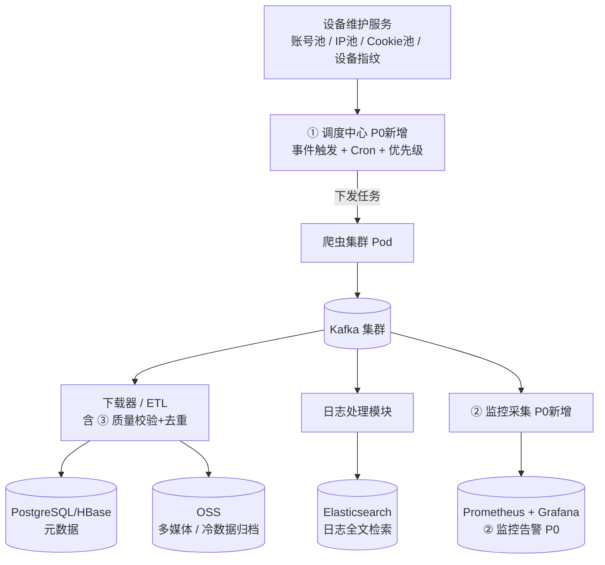
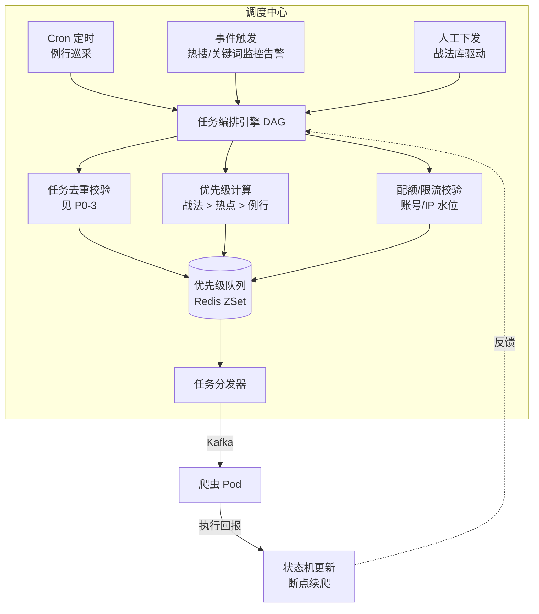
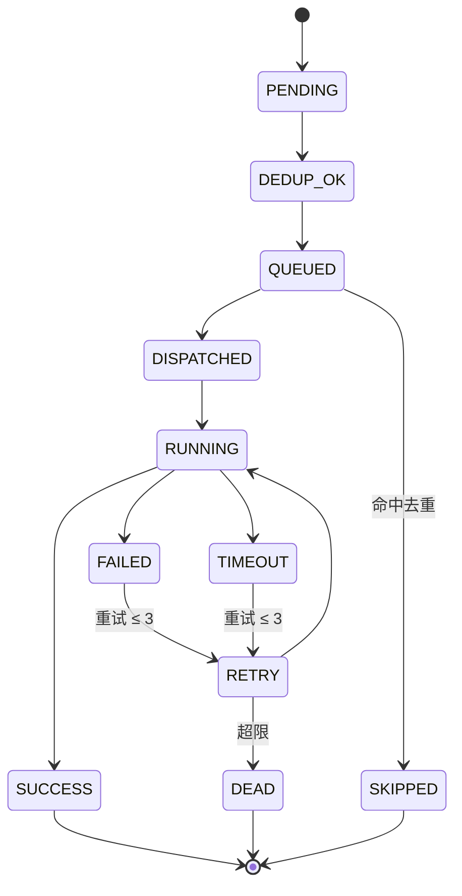
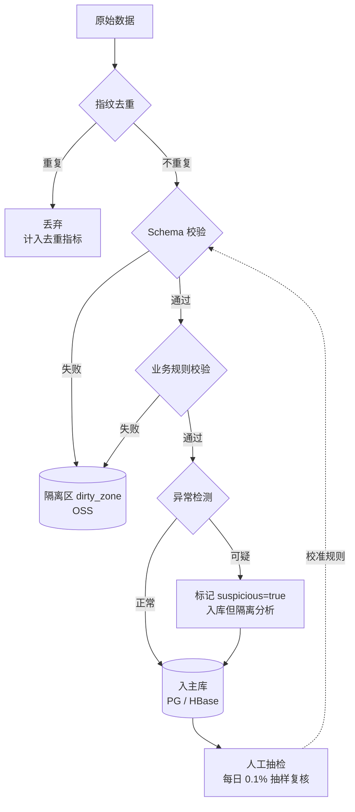
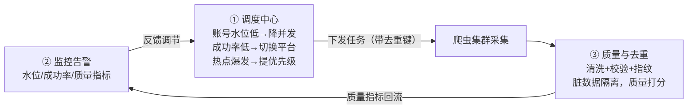

# 软件概要设计简述（认知作战 · 数据采集子系统）

> 本文档聚焦**数据爬取子系统**的概要设计，重点解决架构评审中识别的 **P0 级薄弱环节**：
> 1. 任务调度中心缺失
> 2. 监控告警体系缺失
> 3. 数据质量与去重机制缺失
>
> 底层架构沿用既有设计：**爬虫集群 + Kafka 消息中枢 + 多存储分库（PG / HBase / OSS / ES）**，
> 基础设施使用 **Rancher 管理 K3s**。

---

## 0. 系统总体定位



**设计原则：**
```text
1. 调度驱动：一切采集任务由调度中心统一编排，禁止散落式定时器
2. 可观测优先：没有监控的模块不允许上线
3. 质量内建：去重与校验嵌入 ETL 管道，脏数据不落库
4. 弹性解耦：Kafka 作为唯一中枢，采集与处理彻底异步
```

---

## 爬虫系统设计

使用技术栈使用 Rancher 管理 K3s。

---

## ① P0-1：任务调度中心设计

### 1.1 问题与目标

| 现状问题 | 带来的风险 |
|---|---|
| 仅有"任务队列"，无调度大脑 | 爬虫不知何时、按何策略采集 |
| 无事件触发能力 | 认知战场景热搜/话题爆发时无法实时响应 |
| 无任务去重与断点续爬 | 重复采集浪费资源，故障后无法续跑 |
| 无优先级 | 关键采集被低价值任务阻塞 |

**目标：** 提供统一的任务编排能力，支持 **Cron 定时 + 事件触发 + 优先级队列**，并具备去重、续爬、限流能力。

### 1.2 技术选型

```text
推荐：Apache DolphinScheduler（可视化 DAG + 多租户 + 事件网关）
备选：XXL-JOB（轻量定时） / Airflow（Python 生态强）
任务队列：Redis ZSet（优先级）+ Kafka（任务分发）
状态存储：PostgreSQL（任务元数据 + 执行记录）
```

选型理由：DolphinScheduler 原生支持 DAG 可视化编排、多租户隔离、失败重试与补数，契合"认知战"多话题、多平台并行采集的复杂编排需求。

### 1.3 调度模型



### 1.4 任务状态机



### 1.5 优先级策略

```text
P0  战法库驱动任务（指挥集群下发）       权重 100
P1  事件触发任务（热搜/关键词命中）       权重 80
P2  关键账号定向采集                     权重 60
P3  例行全量巡采                         权重 40
P4  历史回溯 / 补数                      权重 20
```

### 1.6 关键能力清单

```text
1. Cron + 事件双触发模式
2. 优先级队列（抢占式调度）
3. 任务去重（URL/ID + 内容指纹，详见 P0-3）
4. 断点续爬（任务携带 checkpoint，重启从中断处继续）
5. 失败重试（指数退避，最多 3 次，超限进死信）
6. 配额限流（基于账号池/IP 池水位动态调节并发）
7. 任务依赖编排（DAG：先采列表页，再采详情页）
8. 补数能力（指定时间窗口回溯采集）
```

---

## ② P0-2：监控告警体系设计

### 2.1 问题与目标

原架构**零监控**：账号池耗尽、Kafka 积压、爬虫被封、磁盘写满——全部要等业务投诉才能发现。对认知战场景，数据时效性与连续性是生命线，必须做到**分钟级感知**。

### 2.2 技术选型

```text
指标采集：Prometheus（Pull 模型）+ node_exporter / kafka_exporter / postgres_exporter
日志采集：Filebeat → Kafka → Logstash → Elasticsearch（复用现有 ES）
链路追踪：OpenTelemetry（爬虫任务级 trace，用于断点续爬定位）
可视化：  Grafana（大盘）+ Alertmanager（告警路由）
告警通道：企业微信 / 钉钉 / 电话语音（P0 级）
```

### 2.3 指标体系（系统指标 + 业务指标）

#### 系统指标（基础设施健康度）

```text
节点：CPU / 内存 / 磁盘 / 网络 IO / Pod 重启次数
Kafka：消费 Lag / 生产速率 / 分区均衡度 / ISR 缩减
存储：PG 连接数 / 慢查询 / HBase Region 热点 / ES Heap / OSS 写入速率
调度：任务积压数 / 调度延迟 / DAG 执行耗时
```

#### 业务指标（数据采集健康度）⭐ 认知战场景核心

```text
采集侧：
  - 各平台爬虫成功率 / 封禁率（4xx/5xx/验证码占比）
  - 账号池可用水位 / IP 池可用水位 / Cookie 失效率
  - 单平台 QPS / 采集覆盖率（目标账号命中比例）

流转侧：
  - Kafka 端到端延迟（采集→入库）
  - ETL 处理吞吐 / 积压条数

质量侧：
  - 去重命中率（过高=重复抓取，过低=漏采）
  - 数据质量校验失败率（见 P0-3）
  - 死信队列积压量

时效侧：
  - 热点事件触发→首条数据落地 时延（认知战 SLA：< 5 分钟）
```

### 2.4 告警分级与路由

| 级别 | 触发条件示例 | 响应时效 | 通知方式 |
|---|---|---|---|
| P0 致命 | Kafka 积压>10万、账号池水位<10%、调度中心宕机 | < 5 分钟 | 电话 + IM + 邮件 |
| P1 严重 | 某平台成功率<70%、ES 磁盘>85% | < 15 分钟 | IM + 邮件 |
| P2 警告 | 单平台成功率<90%、Lag 持续上升 | < 1 小时 | IM |
| P3 提示 | 慢查询增多、Pod 偶发重启 | 日报 | 日报汇总 |

### 2.5 核心监控大盘

```text
大盘1 总览仪表盘：全平台采集 QPS / 成功率 / 端到端延迟 / 资源水位
大盘2 平台维度盘：按 TikTok / X / FB / TG 拆分的成功率与封禁率
大盘3 资源池盘：  账号/IP/Cookie 三池水位曲线 + 预警线
大盘4 质量看板：  去重命中率 / 校验失败率 / 死信积压
大盘5 调度看板：  任务积压 / 优先级分布 / DAG 执行耗时
```

### 2.6 关键能力清单

```text
1. 系统指标 + 业务指标双覆盖（业务指标优先）
2. P0~P3 四级告警分级与差异化路由
3. 告警抑制与聚合（避免风暴）
4. SLO 定义（如端到端延迟 P99 < 10min）
5. 历史指标长期存储（用于容量规划与复盘）
```

---

## ③ P0-3：数据质量与去重机制设计

### 3.1 问题与目标

ETL 仅"清洗+入库"过于粗糙。认知战场景对**数据真实性**极度敏感——脏数据、重复数据、伪造数据会直接污染情报结论。必须建立**多层质量防线**。

**目标：** 实现"**采集去重 → 入库校验 → 异常识别 → 人工抽检**"四层质量闭环，脏数据零落库。

### 3.2 去重策略（三层指纹）

```text
第一层：精确去重（URL / 平台主键 ID）
  存储：Redis Set / BloomFilter（高频判断）
  粒度：同一条内容绝对去重

第二层：内容指纹去重（SimHash，64 位）
  适用：转载、搬运、轻微改写的近似内容
  规则：Hamming 距离 ≤ 3 视为重复，仅保留首发版本
  存储：HBase（指纹倒排索引）

第三层：语义去重（MinHash + LSH，可选）
  适用：跨语言、跨平台的同源情报聚合
  规则：Jaccard 相似度 ≥ 0.85 聚合为同一事件
```

### 3.3 数据质量校验规则

校验在 ETL 管道内**串行执行**，任一规则失败则数据进入隔离区（不入主库）：

```text
1. Schema 校验：字段完整性、类型、必填项（如 platform / author_id / content / timestamp）
2. 时间合理性：发布时间不早于平台成立日、不晚于当前时间
3. 内容有效性：正文非空、长度在合理区间、非纯表情/乱码
4. 数值边界：转发/评论/点赞数 ≥ 0 且不超过合理上限
5. 平台一致性：账号 ID 格式符合该平台规范
6. 异常检测（统计模型）：
   - 单账号短时高频发布 → 疑似机器人/水军
   - 内容相似度突增 → 疑似协同行动（认知战关键信号）
   - 地理/语言分布异常 → 疑似伪造
```

### 3.4 质量处理流水线



### 3.5 数据血缘与可追溯

```text
每条数据必带字段：
  - source_platform    来源平台
  - crawl_task_id      采集任务 ID（关联调度中心）
  - crawl_pod          采集节点
  - crawl_account_id   使用的账号（关联账号池）
  - crawl_proxy_ip     使用的代理 IP
  - raw_payload_url    原始报文存档地址（OSS）
  - quality_score      质量评分
  - dedup_fingerprint  去重指纹
```

出现情报争议时，可凭上述字段**完整回溯**一条数据从采集到入库的全链路。

### 3.6 关键能力清单

```text
1. 三层去重（精确 + SimHash + 语义）
2. 六类质量校验规则（Schema + 业务 + 异常检测）
3. 脏数据隔离区（不污染主库，可复盘）
4. 人工抽检闭环（规则持续校准）
5. 全字段数据血缘（采集→入库可追溯）
6. 质量指标上报监控大盘（与 P0-2 联动）
```

---

## 4. P0 三件套协同关系

三个 P0 模块不是孤立的，构成一个**自我调节的闭环**：



**协同价值：**
- 调度中心根据**监控指标**动态调节采集策略（如封禁率升高则降速）
- 质量模块把**去重命中率、校验失败率**上报监控，异常时触发告警
- 监控告警为调度提供**反馈信号**，形成自适应系统

---

## 5. 落地优先级与里程碑

| 阶段 | 周期 | 交付内容 | 验收标准 |
|---|---|---|---|
| 阶段 0 | 第 1-2 周 | 调度中心 MVP（Cron + 队列 + 状态机） | 任务可编排、可重试、可续爬 |
| 阶段 1 | 第 3-4 周 | 监控告警 MVP（Prometheus + 核心业务指标） | P0 告警 5 分钟内触达 |
| 阶段 2 | 第 5-6 周 | 去重 + Schema 校验 + 隔离区 | 脏数据零落库，重复率<1% |
| 阶段 3 | 第 7-8 周 | 三模块联动 + 异常检测 + 数据血缘 | 闭环可用，可追溯 |

---

## 6. 一句话总结

> P0 三件套的本质，是给原有"采集→Kafka→分库"的**主干**装上**大脑（调度）、眼睛（监控）、免疫系统（质量）**。
> 没有它们，系统只是"能跑"；有了它们，系统才"扛打、可信、可控"——这正是认知作战数据底座的基本要求。
