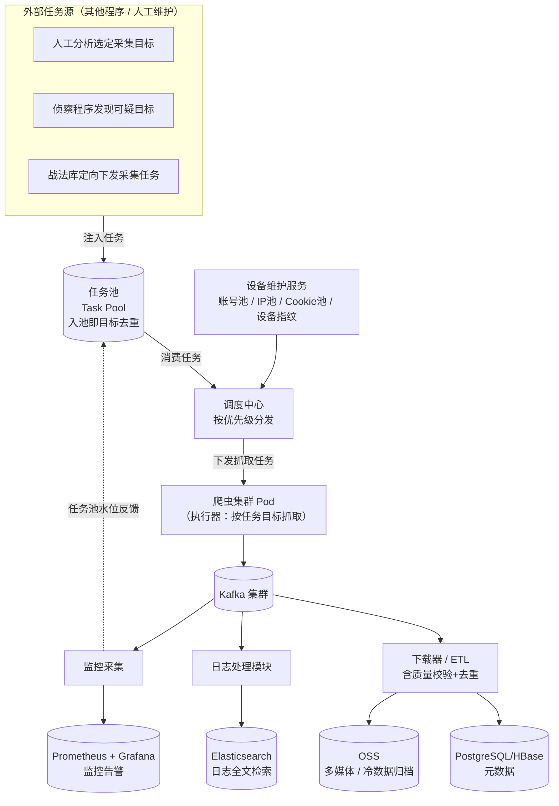
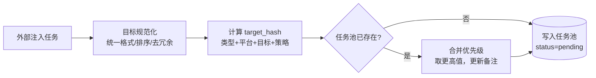
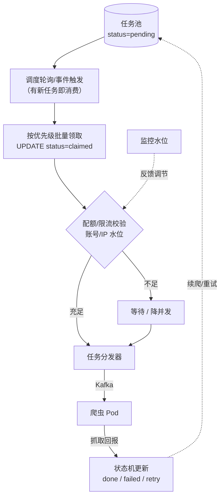
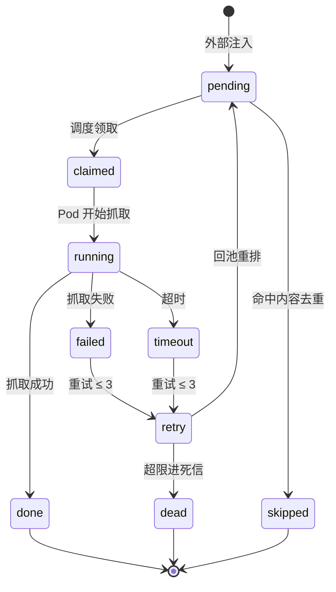
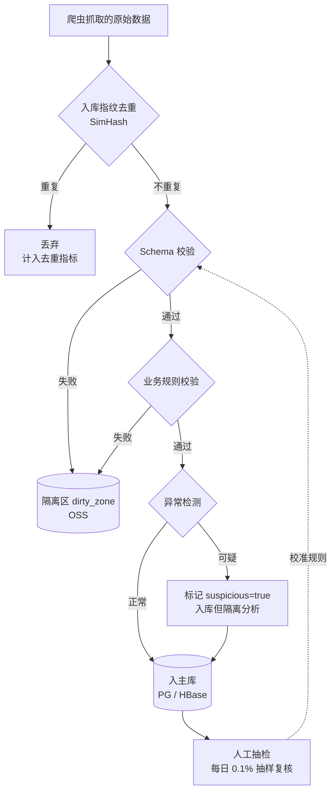
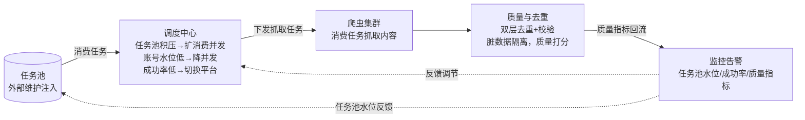

# 软件概要设计简述（认知作战 · 数据采集子系统）

> 本文档为**数据爬取子系统**的概要设计。
>
> **采集模式采用「任务驱动」**：采集任务由**外部程序 / 人工维护**注入「任务池」，
> 爬虫作为执行器消费任务池，领取任务后按任务指定的目标与策略执行抓取——而非定时自动巡采。
>
> 底层架构沿用既有设计：**爬虫集群 + Kafka 消息中枢 + 多存储分库（PG / HBase / OSS / ES）**，
> 基础设施使用 **Rancher 管理 K3s**。

---

## 0. 系统总体定位

**核心范式：任务驱动采集（Pull from Task Pool）**



**设计原则：**
```text
1. 任务驱动：采集任务由外部维护并注入任务池，爬虫只消费、不主动发现目标
2. 调度编排：调度中心消费任务池，按优先级分发，禁止散落式定时器
3. 可观测优先：没有监控的模块不允许上线
4. 质量内建：去重与校验嵌入管道，脏数据不落库（入池去重 + 入库去重双层）
5. 弹性解耦：Kafka 作为唯一中枢，采集与处理彻底异步
```

---

## 爬虫系统设计

使用技术栈使用 Rancher 管理 K3s。

---

## 1. 任务池与任务调度设计

### 1.1 采集模式：任务驱动 vs 定时驱动

| 维度 | 定时驱动 | **任务驱动（采用）** |
|---|---|---|
| 触发方式 | Cron 定时巡采平台 | **外部注入任务 → 消费任务池** |
| 采集目标 | 爬虫自己发现/翻页 | **任务明确指定（账号/话题/关键词/URL 列表）** |
| 爬虫角色 | 主动探索者 | **被动执行器（按任务目标抓取）** |
| 资源消耗 | 大量浪费在无目标巡采 | **定向采集，资源精准投放** |
| 反爬风险 | 高（漫无目的易触发风控） | **低（有目的、可节制）** |
| 灵活度 | 低（只能定时全量） | **高（任务可携带目标、策略、深度等参数）** |
| 适用场景 | 全量舆情监测 | **认知战定向情报采集** ⭐ |

**采用任务驱动的理由：** 认知作战强调**定向、精准、可追溯**的情报采集，采集目标（账号、话题、关键词、可疑帖文等）由分析师或侦察程序预先确定并以任务形式下发，爬虫无需（也不应）自行泛化探索。

### 1.2 任务类型设计

任务是比单个 URL 更上层的抽象，一个任务可承载**一类采集意图**及其目标与策略：

```text
任务类型（task_type）
  - account定向    指定账号，采集其全部/最新帖文
  - topic话题      指定话题标签/话题词，采集相关内容
  - keyword关键词  指定关键词，监控匹配内容
  - url_list       指定一批 URL，定向抓取（最细粒度）
  - backfill回溯   指定时间窗口，历史数据补采
  - recheck复查    已采集目标的增量更新（如帖文新评论、新互动）
```

### 1.3 任务池设计

任务池是整个系统的**输入闸门**，由外部程序/人工维护。

#### 任务数据结构

```text
task_pool
  - task_id            主键
  - task_type          任务类型（见 1.2）
  - target             目标参数 JSON（账号ID / 话题词 / 关键词 / URL 列表 等）
  - target_hash        目标规范化哈希（入池去重键）
  - crawl_strategy     采集策略 JSON（深度、时间范围、字段、分页上限等）
  - source_type        来源：manual（人工）/ recon（侦察程序）/ tactic（战法库）
  - source_ref         来源标识（如战法 ID、分析师账号）
  - platform           平台（TikTok / X / FB / TG ...）
  - priority           优先级（见 1.6）
  - status             状态：pending / claimed / running / done / failed / skipped
  - dedup_at_pool      入池时是否已去重
  - injected_at        入池时间
  - claimed_at         被调度领取时间
  - finished_at        完成时间
  - retry_count        重试次数
  - remark             备注（如采集意图）
```

#### 入池流程（含目标级去重）



**目标规范化规则（保证去重有效）：**
```text
1. URL 类目标：统一协议、域名小写、去跟踪参数（utm_* 等）、去 fragment、排序 query
2. 账号类目标：统一平台 + 账号唯一标识（uid），大小写规范化
3. 话题/关键词类目标：统一大小写、去首尾空格、去重、排序
4. 时间范围：统一时区为 UTC，起止边界对齐
5. 采集策略：排序字段、统一枚举值，剔除无影响字段后参与 hash
```

#### 任务来源接入方式

```text
1. REST API：POST /api/tasks/batch  （人工/程序批量注入）
2. 战法库回调：战法执行时自动下发采集任务
3. 侦察程序推送：MQ/Kafka  topic=task-inject
4. 文件导入：CSV/Excel 批量导入（分析师常用）
```

### 1.4 技术选型

```text
任务池存储：PostgreSQL（结构化、可查询、可审计）+ Redis（待消费队列）
调度引擎：  Apache DolphinScheduler（消费任务池 → 编排分发）
任务队列：  Redis ZSet（按优先级）+ Kafka（分发到爬虫 Pod）
状态存储：  复用任务池表（status 字段驱动状态机）
```

### 1.5 调度模型

调度中心从"定时触发"转为"**消费任务池**"：



> **注：** Cron 定时仅用于一个轻量场景——**周期性自动生成复查类任务**（如对已采集账号每日生成一次增量复查任务）。主采集模式始终是任务驱动，不存在"定时全量巡采"。

### 1.6 任务优先级策略

优先级在**任务入池时**由来源决定，调度按权重消费：

```text
P0  战法库下发任务（指挥集群定向）         权重 100
P1  人工分析师标注高价值任务               权重 80
P2  侦察程序发现的可疑目标                 权重 60
P3  常规采集任务                           权重 40
P4  历史回溯 / 复查任务                     权重 20
```

### 1.7 任务状态机



### 1.8 关键能力清单

```text
1. 任务池：外部 API/MQ/文件 多方式注入
2. 多任务类型（账号/话题/关键词/URL列表/回溯/复查）
3. 入池目标规范化去重（避免相同采集任务重复下发）
4. 优先级队列（抢占式调度，战法优先）
5. 配额限流（基于账号池/IP 池水位动态调节并发）
6. 断点续爬（任务 status 回 pending，重启续跑）
7. 失败重试（指数退避，最多 3 次，超限进死信）
8. 周期复查（Cron 仅自动生成复查任务，非全量巡采）
9. 任务审计（谁、何时、为何注入该任务，全程留痕）
```

---

## 2. 监控告警体系设计

### 2.1 设计目标

数据时效性与连续性是认知战采集的生命线，必须做到**分钟级感知**：任务池积压、账号池耗尽、Kafka 积压、爬虫被封、磁盘写满等异常不能等业务投诉才发现。

### 2.2 技术选型

```text
指标采集：Prometheus（Pull 模型）+ node_exporter / kafka_exporter / postgres_exporter
日志采集：Filebeat → Kafka → Logstash → Elasticsearch（复用现有 ES）
链路追踪：OpenTelemetry（任务级 trace，从入池到入库全链路）
可视化：  Grafana（大盘）+ Alertmanager（告警路由）
告警通道：企业微信 / 钉钉 / 电话语音（高等级）
```

### 2.3 指标体系（系统指标 + 业务指标）

#### 系统指标（基础设施健康度）

```text
节点：CPU / 内存 / 磁盘 / 网络 IO / Pod 重启次数
Kafka：消费 Lag / 生产速率 / 分区均衡度 / ISR 缩减
存储：PG 连接数 / 慢查询 / HBase Region 热点 / ES Heap / OSS 写入速率
调度：任务池积压数 / 调度领取延迟 / 分发耗时
```

#### 业务指标（数据采集健康度）⭐ 认知战场景核心

```text
任务池侧：
  - 任务池水位（pending / claimed / running / done / failed 分布）
  - 任务注入速率（按来源：manual/recon/tactic 拆分）
  - 任务消费速率 / 消费延迟（入池→抓取完成）
  - 入池去重命中率（过高=重复下发，需提示来源方）
  - 按任务类型分布（account/topic/keyword/url_list/backfill/recheck）

采集侧：
  - 各平台爬虫成功率 / 封禁率（4xx/5xx/验证码占比）
  - 账号池可用水位 / IP 池可用水位 / Cookie 失效率
  - 单平台 QPS

流转侧：
  - Kafka 端到端延迟（采集→入库）
  - ETL 处理吞吐 / 积压条数

质量侧：
  - 内容去重命中率（入库时，见第 3 章）
  - 数据质量校验失败率
  - 死信队列积压量

时效侧：
  - 任务入池→首条数据落地 时延（认知战 SLA：< 5 分钟）
```

### 2.4 告警分级与路由

| 级别 | 触发条件示例 | 响应时效 | 通知方式 |
|---|---|---|---|
| 致命 | 任务池积压>1万、Kafka 积压>10万、账号池水位<10%、调度中心宕机 | < 5 分钟 | 电话 + IM + 邮件 |
| 严重 | 某平台成功率<70%、ES 磁盘>85%、任务消费停滞 | < 15 分钟 | IM + 邮件 |
| 警告 | 单平台成功率<90%、Lag 持续上升、入池去重率异常 | < 1 小时 | IM |
| 提示 | 慢查询增多、Pod 偶发重启 | 日报 | 日报汇总 |

### 2.5 核心监控大盘

```text
大盘1 总览仪表盘：任务池水位 / 全平台成功率 / 端到端延迟 / 资源水位
大盘2 任务池盘：  入池/消费速率、按来源分布、按类型分布、消费延迟、积压趋势 ⭐
大盘3 平台维度盘：按 TikTok / X / FB / TG 拆分的成功率与封禁率
大盘4 资源池盘：  账号/IP/Cookie 三池水位曲线 + 预警线
大盘5 质量看板：  去重命中率（入池+入库双层）/ 校验失败率 / 死信积压
大盘6 调度看板：  任务领取延迟 / 优先级分布 / 重试率
```

### 2.6 关键能力清单

```text
1. 系统指标 + 业务指标双覆盖（任务池指标 + 业务指标优先）
2. 四级告警分级与差异化路由
3. 告警抑制与聚合（避免风暴）
4. SLO 定义（如任务入池→落地 P99 < 10min）
5. 历史指标长期存储（用于容量规划与复盘）
6. 任务级全链路 trace（入池→调度→抓取→入库可追踪）
```

---

## 3. 数据质量与去重机制设计

### 3.1 双层去重架构

任务驱动模式下，去重分**两层**执行，互相补充：

```text
第一层：入池去重（目标级）—— 在任务池环节，见 1.3
  作用：相同采集任务不重复下发，从源头节省资源
  粒度：任务的目标参数（账号/话题/关键词/URL列表 + 策略）
  时机：任务注入任务池时

第二层：入库去重（内容指纹级）—— 在 ETL 环节，见 3.2
  作用：不同任务可能采到相同/近似内容（如同一帖文被多个任务命中），需按内容去重
  时机：抓取内容入库时
```

> **为何需要双层：** 任务级去重解决"重复劳动"，内容级去重解决"多任务交叉命中"——账号采集任务与话题采集任务可能采到同一条帖文，必须在入库时按内容去重。

### 3.2 入库去重策略（三层指纹）

```text
第一层：精确去重（URL / 平台主键 ID）
  存储：Redis Set / BloomFilter（高频判断）
  粒度：同一条内容绝对去重

第二层：内容指纹去重（SimHash，64 位）
  适用：转载、搬运、轻微改写的近似内容
  规则：Hamming 距离 ≤ 3 视为重复，仅保留首发版本
  存储：HBase（指纹倒排索引）

第三层：语义去重（MinHash + LSH，可选）
  适用：跨语言、跨平台的同源情报聚合
  规则：Jaccard 相似度 ≥ 0.85 聚合为同一事件
```

### 3.3 数据质量校验规则

校验在 ETL 管道内**串行执行**，任一规则失败则数据进入隔离区（不入主库）：

```text
1. Schema 校验：字段完整性、类型、必填项（如 platform / author_id / content / timestamp）
2. 时间合理性：发布时间不早于平台成立日、不晚于当前时间
3. 内容有效性：正文非空、长度在合理区间、非纯表情/乱码
4. 数值边界：转发/评论/点赞数 ≥ 0 且不超过合理上限
5. 平台一致性：账号 ID 格式符合该平台规范
6. 异常检测（统计模型）：
   - 单账号短时高频发布 → 疑似机器人/水军
   - 内容相似度突增 → 疑似协同行动（认知战关键信号）
   - 地理/语言分布异常 → 疑似伪造
```

### 3.4 质量处理流水线



### 3.5 数据血缘与可追溯

任务驱动模式下，血缘追溯**天然完整**——每条数据都能回溯到注入的任务：

```text
每条数据必带字段：
  - source_task_id     来源任务 ID（关联任务池）
  - task_type          任务类型（account/topic/keyword/...）
  - task_target        任务目标摘要（账号ID/话题词/关键词等）
  - task_source_type   任务来源（manual/recon/tactic）
  - task_source_ref    任务注入方（战法ID/分析师账号）
  - crawl_task_id      采集执行 ID（关联调度中心）
  - crawl_pod          采集节点
  - crawl_account_id   使用的账号（关联账号池）
  - crawl_proxy_ip     使用的代理 IP
  - raw_payload_url    原始报文存档地址（OSS）
  - quality_score      质量评分
  - dedup_fingerprint  去重指纹
```

出现情报争议时，可凭上述字段**完整回溯**：谁注入了任务 → 任务目标是什么 → 何时调度 → 哪个节点/账号抓取 → 如何入库——满足认知战情报的**可审计性**要求。

### 3.6 关键能力清单

```text
1. 双层去重（入池目标级 + 入库内容指纹级）
2. 三层入库指纹（精确 + SimHash + 语义）
3. 六类质量校验规则（Schema + 业务 + 异常检测）
4. 脏数据隔离区（不污染主库，可复盘）
5. 人工抽检闭环（规则持续校准）
6. 任务到入库全字段血缘（满足情报可审计性）
7. 质量指标上报监控大盘（与第 2 章联动）
```

---

## 4. 系统协同关系

三大模块以**任务池**为枢纽，构成自我调节的闭环：



**协同价值：**
- **任务池**是输入闸门，由外部维护，爬虫只消费
- 调度中心根据**监控指标**动态调节消费速率（如封禁率升高则降速）
- 质量模块把**去重命中率、校验失败率**上报监控，异常时触发告警
- 监控告警为调度提供**反馈信号**，形成自适应系统

---

## 5. 落地优先级与里程碑

| 阶段 | 周期 | 交付内容 | 验收标准 |
|---|---|---|---|
| 阶段 0 | 第 1-2 周 | 任务池 + 调度 MVP（注入 API + 多任务类型 + 优先级消费 + 状态机） | 任务可注入、可去重、可续爬 |
| 阶段 1 | 第 3-4 周 | 监控告警 MVP（Prometheus + 任务池/业务指标） | 高等级告警 5 分钟内触达 |
| 阶段 2 | 第 5-6 周 | 入库去重 + Schema 校验 + 隔离区 | 脏数据零落库，重复率<1% |
| 阶段 3 | 第 7-8 周 | 三模块联动 + 异常检测 + 数据血缘 | 闭环可用，任务→入库可追溯 |

---

## 6. 一句话总结

> 采集范式采用**"任务驱动"**：采集任务由外部程序/人工维护并注入**任务池**，爬虫作为执行器消费任务、按任务目标定向抓取。
> **任务池+调度（大脑）、监控（眼睛）、质量去重（免疫系统）**三者协同——让系统"扛打、可信、可控、可审计"，这正是认知作战定向情报采集的基本要求。
