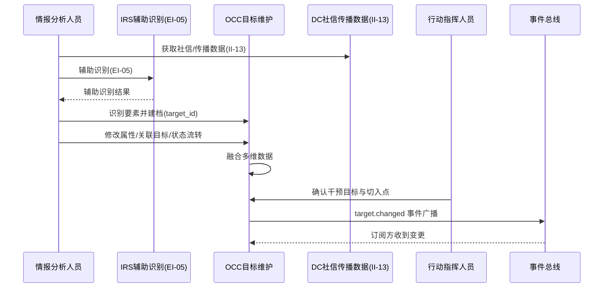
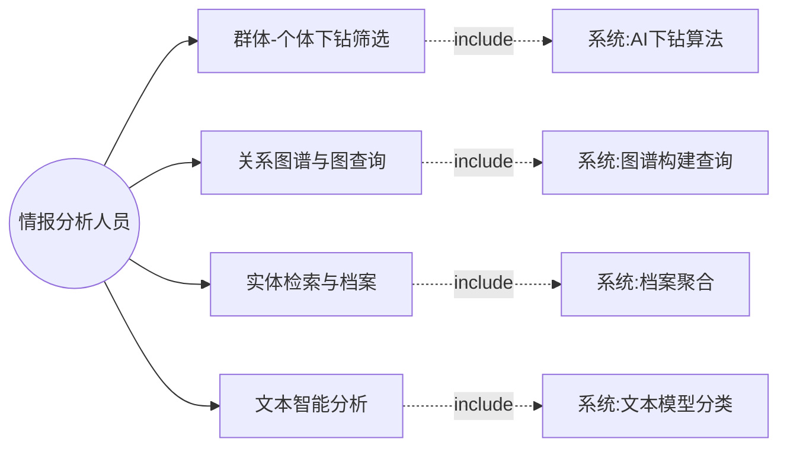
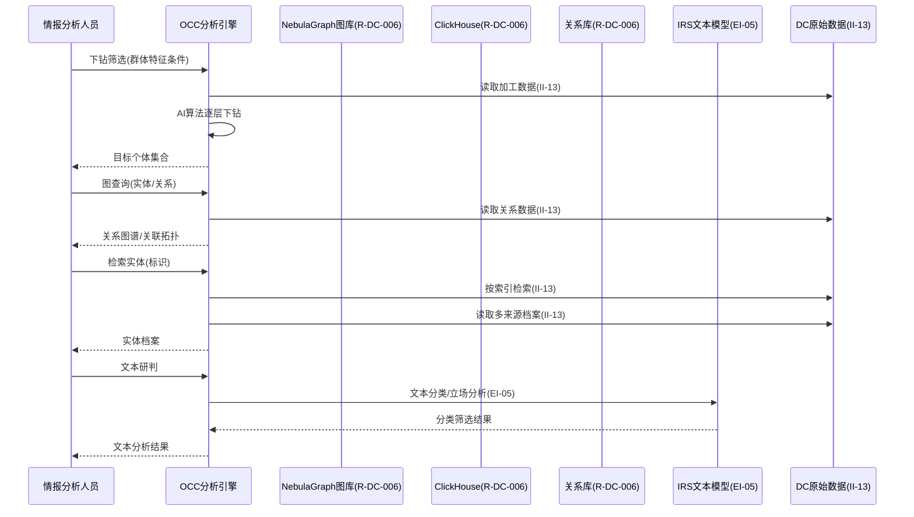
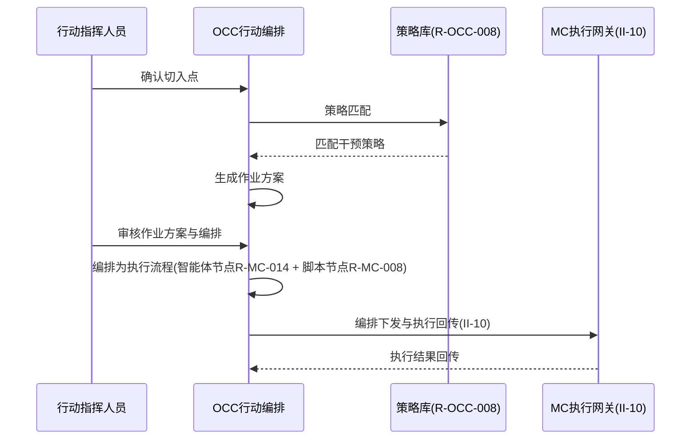
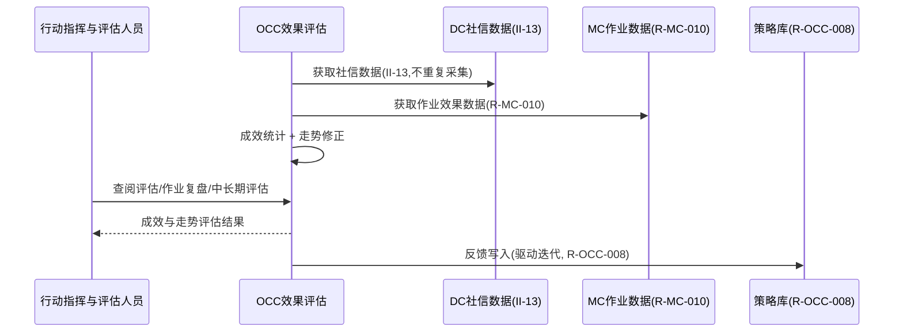
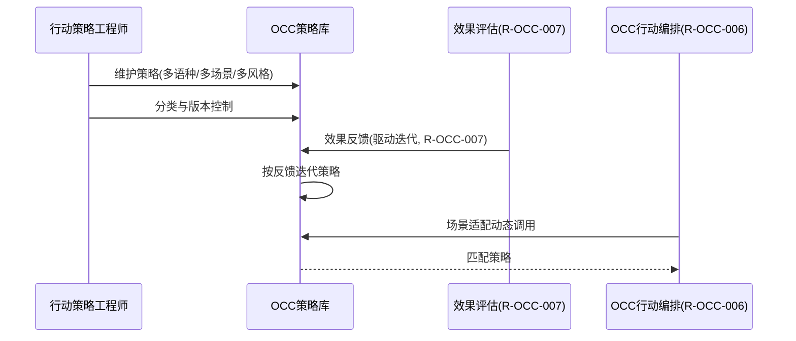
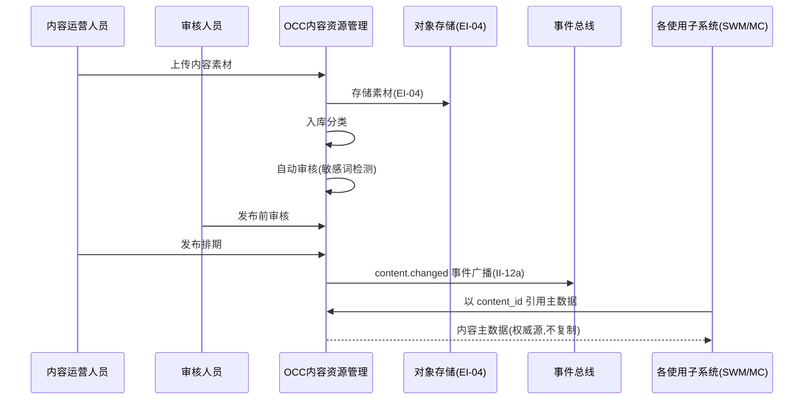

# 软件需求规格说明 - 社信行动业务子系统（OCC）分册

| 项目 | 内容 |
| --- | --- |
| 项目名称 | 认知行动平台（v1.0） |
| 文档版本 | V3.9 |
| 密级 | 内部使用 |
| 编制 | 石建国 |
| 编制日期 | 2026-07-17 |

---

## 1 引言

### 1.1 标识

本文件为「认知行动平台」社信行动业务子系统（OCC，OCC（Opinion Combat Command））的**软件需求规格说明分册**。它是《软件需求规格说明》总册（V4.3）按子系统拆分的组成部分，承载 社信行动业务子系统 的全部功能需求（R-OCC-001 ~ R-OCC-009（9 项））。需求编号 `R-OCC-NNN` 与总册一致，全程不变，作为需求双向追溯的依据。

### 1.2 文档概述

本分册章节安排：第 1 章引言；第 2 章引用文件；第 3 章 社信行动业务子系统 功能需求（按子区域给出各 `R-OCC-NNN` 需求块）。系统级共性内容（引言概述、术语缩略语、接口 EI/II、数据 DR、非功能 NR、约束 CON、合格性规定、附录）见《软件需求规格说明-总册》。

### 1.3 术语和缩略语

沿用《软件需求规格说明-总册》第 1.4 节术语与缩略语，本分册不再重复。

---

## 2 引用文件

| 文件 | 说明 |
| --- | --- |
| 《软件需求规格说明-总册》V4.3 | 系统级共性需求（引言/术语/接口/数据/非功能/约束/合格性/附录） |
| 《软件需求跟踪矩阵.xlsx》 | 需求双向追溯唯一权威源（`R-OCC-NNN` 追溯链） |
| 《软件概要设计说明》V3.2 | OCC 子系统功能模块设计（M-OCC-NN） |
| 《软件详细设计说明-OCC子系统》 | OCC 子系统详细设计 |

---

## 3 社信行动业务子系统（OCC）功能需求

> 本节为 社信行动业务子系统（OCC）的全部功能需求，对应 R-OCC-001 ~ R-OCC-009（9 项）。需求编号 `R-OCC-NNN` 不变，逐字搬迁自原《软件需求规格说明》。

---


社信行动业务子系统是全链路的指挥大脑，构建"目标识别 → 分析研判 → 行动编排 → 效果评估"的行动闭环，并承担内容资源的统一管理（作为内容资源的唯一权威源，向各使用方分发内容）。本子系统基于数据爬取子系统（DC）采集与 ETL 加工的原始社信/传播数据（经 II-13 接口）与私有化推理服务的本地大模型推理能力，对社信目标进行识别与维护，并在本子系统内完成数据分析与情报研判（V3.3 起「数据分析与情报」由 DC 移入 OCC，对应 R-OCC-002~005），以"行动编排"的方式直接编排群控子系统（MC）中的智能体节点与自动化脚本节点形成执行流程并落地，最终对行动效果进行评估与迭代。本期实现目标识别（含目标数据维护）、数据分析与情报、行动编排、效果评估、策略库与内容资源管理九项能力；情报线索侦察、全维度画像分析、抓手挖掘、社信风险定级与对冲策略匹配、仿真舆论发声与观点博弈、全媒体投送适配与舆论对冲、线下态势联动研判等能力本期暂不实现（见附录"本期暂不实现的 OCC 能力"），相关环节现阶段由人工承担，后续逐步程序化。

### 目标识别与维护

**用户需求概述**：识别社信事件的目标要素并对其进行全生命周期维护。目标在系统中即数据对象——支持建档、修改、关联、状态流转与删除。本能力融合情报侦察、多维画像与抓手挖掘中"识别目标"的部分，形成可持续维护的目标档案，为后续行动提供靶向。

**第①步 目标澄清**（工具：干系人多角度分析 ｜ 产物：子目标清单 ｜ 验收：是否穷举所有干系人的价值诉求）：①情报分析人员能识别目标要素并建档为可维护的数据对象（target_id）；②目标能全生命周期维护（修改、关联、状态流转、变更通知）。
**第②步 梳理场景**（工具：用例图 ｜ 产物：场景 ｜ 验收：是否穷举所有用户操作）

各角色的操作穷举：

| 角色 | 操作 |
|------|------|
| 情报分析人员 | 识别目标要素、建档为 target_id、修改属性、关联目标、维护状态流转 |
| 行动指挥人员 | 确认干预目标与切入点 |
| 系统（自动） | 数据维护支撑、融合多维数据、IRS 辅助识别、target.changed 事件广播 |

```mermaid
flowchart LR
  subgraph 识别域["识别域：目标建档"]
    A1((情报分析人员))
    UC1[识别目标要素]
    UC2[建档为target_id]
    UC3[IRS:辅助识别(EI-05)]
    A1 --> UC1 & UC2
    UC1 -. use .-> UC3
  end
  subgraph 维护域["维护域：全生命周期维护"]
    A2((情报分析人员))
    A3((行动指挥人员))
    A4((系统-维护))
    UC4[修改目标属性]
    UC5[关联目标]
    UC6[状态流转]
    UC7[系统:融合多维数据(II-13)]
    UC8[系统:target.changed事件广播]
    UC9[确认干预目标与切入点]
    A2 --> UC4 & UC5 & UC6
    A3 --> UC9
    A4 --> UC7 & UC8
    UC6 -. use .-> UC8
  end
```

---

**第③步 理清流程**（工具：时序图 ｜ 产物：需求范围 ｜ 验收：是否穷举相关子系统）



---

**第④步 理清流程-异常**（工具：流程图 ｜ 产物：异常场景 ｜ 验收：每个交互点是否都有异常分支）

| 交互点 | 异常分支 | 应对 |
|--------|---------|------|
| 分析 ↔ OCC（建档） | 识别数据不足 | 建档为"待核实" |
| 分析 ↔ OCC（属性修改） | 属性修改冲突 | 加锁 |
| OCC（关联） | 关联断裂 | 标注断点 |
| OCC ↔ 总线（事件广播） | 广播失败 | 重试 |

---

**第⑤步 列出规则**（工具：表格 ｜ 产物：验证点 ｜ 验收：规则是否可测、是否落到具体需求内）

| 规则 | 可测的验证点 | 归属子目标 |
|------|------------|-----------|
| 目标即数据（target_id） | 目标以 target_id 标识为可维护数据对象 | ①识别建档 |
| 可修改 | 目标属性可被修改且留痕 | ②全生命周期维护 |
| 可关联 | 目标之间可建立关联关系 | ②全生命周期维护 |
| 有状态 | 目标状态可流转 | ②全生命周期维护 |
| 融合多维（DC 社信/传播数据） | 目标可融合 DC 多维数据 | ②全生命周期维护 |
| 人工识别为主 | 本期以人工识别为主、IRS 辅助 | ①识别建档 |
| target.changed 事件广播 | 目标变更可触发 target.changed 事件通知 | ②全生命周期维护 |

**拆分结论**：两子目标围绕"目标识别与维护"这一价值，作为一个需求。编号 R-OCC-001。四原则自检：足够小✓（目标建档+全生命周期维护单一职责）｜端到端✓（识别→建档→维护→事件通知）｜独立性✓（依赖 DC/IRS）｜可测性✓（建档/修改/关联/状态流转可验）。

#### R-OCC-001 目标识别与维护

**需求目的**：识别社信事件的目标要素并对其进行全生命周期维护。目标在系统中即数据对象——支持建档、修改、关联、状态流转与删除，而非一次识别即定型的只读结果。本能力融合情报侦察、多维画像与抓手挖掘中"识别目标"的部分：从社信事件与传播数据中识别事件主体、传播源头、核心争议点、干预目标对象，并补充传播线索、事件/群体/账号/传播画像、干预切入点与薄弱点等目标属性，形成可持续维护的目标档案，为后续行动提供靶向。

**使用角色**：情报分析人员（识别、确认识别结果、维护目标数据）、行动指挥人员（确认干预目标与切入点）、系统（辅助识别，本期以人工识别为主、系统提供数据维护支撑）。

**前置条件**：社信事件数据与传播数据已采集；IRS 本地大模型可用；目标数据存储与维护接口可用。

**输入**：社信事件数据、传播数据、相关账号与内容、人工或系统产出的识别结果、目标属性修改请求、目标关联与状态变更请求。

**输出**：目标档案（含事件主体、传播源头、核心争议点、干预目标对象、传播线索、多维画像属性、干预切入点与薄弱点）、目标标识（target_id）、目标变更事件。

**业务规则**：

| 规则 | 说明 |
|------|------|
| 目标即数据 | 每个识别出的目标建档为一条目标数据，赋予全局唯一的目标标识 target_id，作为后续行动、评估与统计的引用 |
| 目标可修改 | 目标档案的各属性（事件主体、争议点、画像属性、干预切入点等）支持新增、修改与删除，识别结果不是只读终态，可随事件演进而更新 |
| 目标可关联 | 目标之间可建立关联关系（如一个事件主体关联多个传播源头、一个干预目标关联多个薄弱点），形成目标关系网络 |
| 目标有状态 | 目标具备状态生命周期（如待核实、已确认、已锁定、已处置、已归档），支持状态流转 |
| 融合多维信息 | 识别过程综合事件主体、传播源头与链路、事件/群体/账号/传播画像、干预切入点与传播薄弱点，形成完整目标档案 |
| 人工识别为主 | 本期识别判断由情报分析人员完成并录入系统，系统负责目标数据的存储、关联、状态管理与变更通知；后续逐步接入自动识别与画像建模能力 |
| 事件广播 | 目标变更经事件总线广播 target.changed 事件，使用方（行动编排、效果评估）订阅响应 |

**异常场景**：识别数据不足时目标建档为"待核实"并提示补充；目标属性修改冲突时按目标标识加锁或提示人工裁定；目标关联断裂时标注断点；事件总线广播失败时重试。

**验收标准**：目标可建档并赋予 target_id；目标各属性可新增、修改、删除；目标间可建立关联关系；目标状态可流转；目标档案可融合事件主体、传播、画像、切入点等多维信息；目标变更可经事件通知使用方；本期支持人工识别录入与系统数据维护。

**关联接口**：II-13 分析数据与情报接口（DC 原始社信/传播数据→OCC，经 R-OCC-002~005 分析后供目标识别融合）、EI-05 本地大模型推理（辅助识别）。

### 数据分析与情报

**用户需求概述**：对加工后的数据进行分析，提供从群体到个体的筛选、关系图谱、情报检索、可视化与文本智能分析能力，支撑目标识别与内容研判。分析能力现归属 OCC 子系统，其分析产出（目标个体、关系、情报、文本分类）直接供本子系统「目标识别与维护」（R-OCC-001）使用，并作为情报驱动闭环采集（DC 子系统 R-DC-007/012，经 II-15）的输入。原始社信/传播数据经 II-13 接口从 DC 获取。

> V3.9（ADR-003）：情报分析组前端页 OCC-02~05 已删（后台行为），需求留阶段二评估。

---

**第①步 目标澄清**（工具：干系人多角度分析 ｜ 产物：子目标清单 ｜ 验收：是否穷举所有干系人的价值诉求）

| 序 | 子目标 | 干系人 |
|----|--------|--------|
| 1 | 分析人员能从大范围群体中逐层下钻定位到目标个体（从面到点） | 情报分析人员 |
| 2 | 分析人员能看清目标实体的关系网络（谁和谁有关联、什么关系） | 情报分析人员 |
| 3 | 分析人员能按标识快速检索实体并查看其全维度档案 | 情报分析人员 |
| 4 | 分析人员能对文本内容自动研判（分类、立场、是否值得关注） | 情报分析人员 |
| 5 | 下游（OCC、情报驱动采集）能拿到结构化的情报产出 | 系统下游（OCC、闭环采集）|

---

**第②步 梳理场景**（工具：用例图 ｜ 产物：场景 ｜ 验收：是否穷举所有用户操作）

| 角色 | 操作 |
|------|------|
| 情报分析人员 | 设定群体特征条件下钻筛选、查看关系图谱与图查询、按标识检索实体、查看实体档案与关联拓扑、提交文本进行智能分析研判 |
| 系统（自动） | 执行 AI 算法下钻、维护图查询、聚合档案、执行文本模型分类 |



---

**第③步 理清流程**（工具：时序图 ｜ 产物：需求范围 ｜ 验收：是否穷举相关子系统）



---

**第④步 理清流程-异常**（工具：流程图 ｜ 产物：异常场景 ｜ 验收：每个交互点是否都有异常分支）

| 交互点 | 异常分支 | 应对 |
|--------|---------|------|
| DC ↔ AI 下钻算法 | 算法推理超时或失败 | 降级返回部分结果并告警 |
| DC ↔ 图库 | 图谱查询数据量过大 | 分页或限流 |
| DC ↔ IRS 文本模型 | 文本模型不可用 | 回退到关键词规则匹配 |

---

**第⑤步 列出规则**（工具：表格 ｜ 产物：验证点 ｜ 验收：规则是否可测、是否落到具体需求内）

| 规则 | 可测的验证点 | 归属子目标 |
|------|------------|-----------|
| AI 算法群体→个体逐层下钻 | 给定群体特征，能定位到目标个体 | ①从面到点 |
| 基于实体与关联数据绘制关系图谱 | 给定实体，能展示关系图谱 | ②关系网络 |
| 关系图谱支持图查询 | 能按关系类型图查询 | ②关系网络 |
| 对实体输出关联拓扑与情报标签 | 给定实体，输出关联网络与标签 | ②关系网络 |
| 按账号/昵称/标识检索实体 | 给定标识，能检索到实体信息 | ③检索档案 |
| 聚合多来源信息形成全维度档案 | 实体档案含多来源数据 | ③检索档案 |
| 文本模型+关键词库规则匹配分类 | 给定文本，能输出分类筛选结果 | ④文本研判 |
| 文本分析结果用于内容研判与目标识别 | 文本分类支撑研判 | ④文本研判 |

---

**拆分结论（含四原则校验）**

子目标 ①②③④ 是四种不同的分析能力，用户操作场景各不相同（下钻、看图、检索、提交文本），异常分支各自独立（算法降级、图查询限流、文本模型回退），可各自独立交付与验收。校验如下：

| 需求 | 足够小 | 端到端 | 独立性 | 可测性 |
|------|--------|--------|--------|--------|
| R-OCC-002 群体-个体下钻筛选 | ✅ 聚焦 AI 下钻 | ✅ 群体条件→目标个体 | ✅ 独立 | ✅ 能定位目标 |
| R-OCC-003 关系图谱与图查询 | ✅ 聚焦图谱 | ✅ 实体→关系网络 | ✅ 独立 | ✅ 图谱/图查询可验 |
| R-OCC-004 实体检索与档案 | ✅ 聚焦检索与档案 | ✅ 标识→实体全维档案 | ✅ 独立 | ✅ 检索/档案可验 |
| R-OCC-005 文本智能分析 | ✅ 聚焦文本研判 | ✅ 文本→分类筛选结果 | ✅ 独立（依赖 IRS） | ✅ 分类结果可验 |

#### R-OCC-002 群体-个体下钻筛选

**需求目的**：结合人工智能算法实现从群体到个体的逐层下钻筛选，使情报分析人员能从大范围群体中按特征条件逐步缩小范围、定位到目标个体，支撑目标识别。

**使用角色**：情报分析人员（设定群体特征条件、逐层下钻）、系统（自动执行 AI 算法建模与筛选）。

**前置条件**：R-DC-005 加工并经 R-DC-006 存储的数据已就绪；AI 算法已配置。

**输入**：群体特征条件（分层筛选条件）。

**输出**：目标个体集合。

**业务规则**：

| 规则 | 说明 |
|------|------|
| 逐层下钻 | 结合人工智能算法实现从群体到个体的逐层下钻筛选 |
| 定位目标 | 从大范围群体中定位目标个体 |

**异常场景**：算法推理超时或失败时降级返回部分结果并告警。

**验收标准**：给定群体特征条件，能经 AI 算法逐层下钻定位到目标个体；以人工标注的目标个体集合为基准，下钻结果的召回率不低于 70%、准确率不低于 80%（基准集规模与门槛在详细设计阶段确定）；算法异常时降级返回部分结果并告警。

**关联接口**：II-13 分析数据与情报接口（入，从 DC 取原始社信/传播数据）。

#### R-OCC-003 关系图谱与图查询

**需求目的**：基于实体与关联数据绘制关系图谱并支持图查询，对给定实体输出关联拓扑与情报标签形成关联网络，使情报分析人员能看清目标实体的关系网络。

**使用角色**：情报分析人员（查看关系图谱、发起图查询）。

**前置条件**：R-DC-006 关系数据已入图数据库；图数据库可用。

**输入**：实体标识、图查询条件（关系类型、深度）。

**输出**：关系图谱、关联拓扑与情报标签、关联网络。

**业务规则**：

| 规则 | 说明 |
|------|------|
| 关系图谱 | 基于实体与关联数据绘制关系图谱 |
| 图查询 | 关系图谱支持图查询 |
| 关联拓扑与标签 | 对给定实体输出关联拓扑与情报标签，形成关联网络 |

**异常场景**：图谱查询数据量过大时分页或限流。

**验收标准**：给定实体能展示关系图谱并支持图查询；能输出关联拓扑与情报标签；查询数据量过大时分页或限流。

**关联接口**：II-13 分析数据与情报接口（入，从 DC 取原始社信/传播数据）。

> V3.9（ADR-003）：前端页 OCC-07 关联网络已并入 OCC-06 目标档案（需求 R-OCC-003 不变，关系图谱与关联网络能力作为后台行为并入目标档案页展示）。

#### R-OCC-004 实体检索与档案

**需求目的**：提供基础信息检索（按账号、昵称、标识检索实体信息），并聚合多来源信息形成实体的全维度档案，使情报分析人员能快速定位实体并查看其完整画像。

**使用角色**：情报分析人员（检索实体、查看实体档案）。

**前置条件**：R-DC-005 加工后数据与元数据/索引经 R-DC-006 存储已就绪。

**输入**：检索条件（账号/昵称/标识）。

**输出**：实体信息列表、实体全维度档案视图。

**业务规则**：

| 规则 | 说明 |
|------|------|
| 实体检索 | 提供基础信息检索，按账号、昵称、标识等检索实体信息 |
| 全维度档案 | 聚合多来源信息形成实体的全维度档案 |

**异常场景**：检索超时时降级返回部分结果。

**验收标准**：给定账号/昵称/标识能检索到实体信息；能聚合多来源信息形成全维度档案。

**关联接口**：II-13 分析数据与情报接口（入，从 DC 取原始社信/传播数据）。

#### R-OCC-005 文本智能分析

**需求目的**：对文本内容结合文本模型与关键词库进行规则匹配与分类筛选，用于内容研判与目标识别。文本模型调用底层 IRS 本地大模型，模型不可用时回退到关键词规则匹配。

**使用角色**：情报分析人员（提交待分析文本、查看分类筛选结果）。

**前置条件**：IRS 本地文本模型已部署可用（EI-05）；关键词库已配置。

**输入**：待分析的文本内容、关键词库。

**输出**：文本分类与筛选结果（立场/情感/分类标签）。

**业务规则**：

| 规则 | 说明 |
|------|------|
| 文本模型分析 | 结合文本模型对文本内容进行分析 |
| 关键词规则匹配 | 结合关键词库进行规则匹配 |
| 分类筛选 | 对文本进行分类筛选，用于内容研判与目标识别 |

**异常场景**：文本模型不可用时回退到关键词规则匹配。

**验收标准**：给定文本能结合文本模型与关键词库输出分类筛选结果；以人工标注的测试文本集为基准，文本分类的宏平均 F1 不低于 0.75（基准集与门槛在详细设计阶段确定）；文本模型不可用时能回退到关键词规则匹配。

**关联接口**：EI-05 本地大模型推理（调用 IRS 文本模型）、II-13 分析数据与情报接口（入，从 DC 取原始社信/传播数据）、II-15 情报回注采集接口（出，向 DC 任务池 R-DC-007 提供分析产出）。

### 行动编排

**用户需求概述**：根据目标档案与干预切入点匹配干预策略、生成作业方案，并以"行动编排"的方式直接编排 MC 中的执行节点形成执行流程（图）落地，形成"目标→编排→执行"的闭环。

**第①步 目标澄清**（工具：干系人多角度分析 ｜ 产物：子目标清单 ｜ 验收：是否穷举所有干系人的价值诉求）：①行动指挥能匹配干预策略并生成作业方案；②作业方案能编排为可执行流程并经 MC 网关落地执行。
**第②步 梳理场景**（工具：用例图 ｜ 产物：场景 ｜ 验收：是否穷举所有用户操作）

各角色的操作穷举：

| 角色 | 操作 |
|------|------|
| 行动指挥人员 | 确认切入点、确认匹配策略、审核作业方案与编排 |
| 系统（自动） | 策略匹配、生成作业方案、编排为执行流程（智能体节点+脚本节点）、经 MC 网关落地 |

```mermaid
flowchart LR
  subgraph 方案域["方案域：策略匹配与方案生成"]
    A1((行动指挥人员))
    A2((系统-编排))
    UC1[系统:策略匹配(R-OCC-008)]
    UC2[系统:生成作业方案]
    UC3[确认切入点/策略]
    UC4[审核作业方案]
    A1 --> UC3 & UC4
    A2 --> UC1 & UC2
    UC1 -. include .-> UC2
  end
  subgraph 编排域["编排域：执行流程编排落地"]
    A3((系统-编排))
    UC5[编排为执行流程:智能体节点+脚本节点]
    UC6[系统:MC网关收口(II-10)]
    UC7[节点类型可扩充]
    A3 --> UC5 & UC6 & UC7
    UC5 -. use .-> UC6
  end
  UC4 -. approve .-> UC5
```

---

**第③步 理清流程**（工具：时序图 ｜ 产物：需求范围 ｜ 验收：是否穷举相关子系统）



---

**第④步 理清流程-异常**（工具：流程图 ｜ 产物：异常场景 ｜ 验收：每个交互点是否都有异常分支）

| 交互点 | 异常分支 | 应对 |
|--------|---------|------|
| OCC ↔ 策略库（匹配） | 策略匹配失败 | 降级转人工 |
| OCC（编排） | 节点资源不足 | 排队或缩减 |
| OCC ↔ MC（节点执行） | 节点失败 | 回滚/跳过/转人工 |
| OCC ↔ MC（落地） | 落地失败 | 回滚并告警 |

---

**第⑤步 列出规则**（工具：表格 ｜ 产物：验证点 ｜ 验收：规则是否可测、是否落到具体需求内）

| 规则 | 可测的验证点 | 归属子目标 |
|------|------------|-----------|
| 策略匹配（R-OCC-008） | 给定切入点能从策略库匹配到干预策略 | ①匹配生成方案 |
| 作业方案生成 | 可生成可审核的作业方案 | ①匹配生成方案 |
| 编排为执行流程（智能体节点 R-MC-014 + 脚本节点 R-MC-008） | 方案可编排为含两类节点的执行流程 | ②编排落地 |
| MC 网关收口（II-10） | 执行流程经 MC 网关统一落地并回传 | ②编排落地 |
| 节点类型可扩充 | 编排节点类型可后续扩充 | ②编排落地 |

**拆分结论**：两子目标围绕"行动编排"这一价值，作为一个需求。编号 R-OCC-006。四原则自检：足够小✓（策略匹配+方案生成+执行流程编排单一职责）｜端到端✓（目标→策略→方案→编排落地）｜独立性✓（依赖 R-OCC-001/004/MC）｜可测性✓（策略匹配/编排流程/网关收口可验）。

#### R-OCC-006 行动编排

**需求目的**：根据目标档案与干预切入点匹配干预策略、生成作业方案，并以"行动编排"的方式直接编排群控子系统（MC）中的执行节点形成执行流程（图）落地，形成"目标→编排→执行"的闭环。OCC 直接编排 MC 中的节点，蜂群智能体子系统（SWM）作为"智能体节点的供给方之一"参与编排。编排的节点类型本期为两类——智能体节点（其智能体定义来源于 SWM 同步至 MC 的内容，见 R-MC-014）与自动化脚本节点。本期干预切入点与策略匹配以人工为主，系统提供方案生成与编排支撑。

**使用角色**：行动指挥人员（确认切入点与策略、审核编排方案）、系统（生成方案与编排执行）。

**前置条件**：目标档案已建档（R-OCC-001）；策略库可用（R-OCC-008）；MC 中可用的智能体定义与执行终端状态可查询。

**输入**：目标档案（含干预切入点）、策略库、MC 执行节点资源状态（可用智能体、可用终端、可用脚本）、执行约束。

**输出**：匹配的干预策略、生成的作业方案、编排形成的执行流程（图）、调度执行落地的结果。

**业务规则**：

| 规则 | 说明 |
|------|------|
| 策略匹配 | 系统根据目标档案中的干预切入点匹配干预策略（本期以人工匹配为主） |
| 作业方案生成 | 系统生成具体的作业方案（含内容、账号、时间、节奏） |
| 执行流程编排 | 系统将作业方案编排为执行流程：以 MC 中的智能体节点、自动化脚本节点为编排实体，按内容、账号、时间、节奏组织节点间的前后序、并行与分支关系，形成可执行的流程（图）；节点类型后续可扩充（如内容生成节点、评估节点等） |
| MC 网关收口 | 编排落地后由 MC 的统一执行网关（R-MC-005）收口所有节点动作——认知行动账号的养号与投放动作经移动端 ADB/无障碍通道、爬虫账号的相关动作经桌面端 CDP 通道 |
| 智能体节点引用 | 智能体节点对应的智能体定义由 SWM 编写并同步至 MC 持存（见 R-MC-014），OCC 编排时引用 MC 中已持存的智能体 |

**异常场景**：策略匹配失败时降级为人工选择；MC 执行节点资源不足时排队或缩减规模；编排流程中某节点执行失败时按编排定义回滚、跳过或转人工；执行落地失败时回滚并告警。

**验收标准**：可根据目标档案匹配干预策略；可生成含内容、账号、时间、节奏的作业方案；可将 MC 中的智能体节点与自动化脚本节点编排为执行流程（图）；编排落地后动作经 MC 统一执行网关收口；节点类型后续可扩充。

**关联接口**：II-10 行动编排下发与执行回传接口。

> V3.9（ADR-003）：前端页 OCC-08 方案规划页已删（需求 R-OCC-006 不变，方案规划作为后台行为并入行动编排）。

### 效果评估

**用户需求概述**：完成单轮干预成效统计、舆论走势修正、策略迭代反馈与作业复盘，并支持中短期与长期效果评估，形成行动闭环。数据来源为 DC 采集的原始社信/传播数据（经 II-13，由 OCC 本子系统 R-OCC-002~005 进行分析）与 MC 可观测性的作业执行数据，OCC 不自行重复采集。

**第①步 目标澄清**（工具：干系人多角度分析 ｜ 产物：子目标清单 ｜ 验收：是否穷举所有干系人的价值诉求）：①能基于 DC 与 MC 数据完成干预成效统计与走势修正评估；②评估结论能反馈策略库迭代并支持中短期与长期效果评估。
**第②步 梳理场景**（工具：用例图 ｜ 产物：场景 ｜ 验收：是否穷举所有用户操作）

各角色的操作穷举：

| 角色 | 操作 |
|------|------|
| 行动指挥与评估人员 | 查阅成效统计、查阅走势修正评估、作业复盘、查看中长期评估 |
| 系统（自动） | 汇聚 DC/MC 数据（不重复采集）、成效统计、走势修正、反馈写入策略库 |

```mermaid
flowchart LR
  subgraph 统计域["统计域：成效统计与走势修正"]
    A1((系统-评估))
    UC1[系统:汇聚DC/MC数据(不重复采集)]
    UC2[系统:成效统计]
    UC3[系统:走势修正]
    A1 --> UC1 & UC2 & UC3
    UC1 -. include .-> UC2
  end
  subgraph 反馈域["反馈域：反馈迭代与复盘"]
    A2((行动指挥与评估人员))
    A3((系统-反馈))
    UC4[查阅评估]
    UC5[作业复盘]
    UC6[查看中长期评估]
    UC7[系统:反馈策略库(R-OCC-008)]
    A2 --> UC4 & UC5 & UC6
    A3 --> UC7
    UC4 -. observe .-> UC7
  end
```

---

**第③步 理清流程**（工具：时序图 ｜ 产物：需求范围 ｜ 验收：是否穷举相关子系统）



---

**第④步 理清流程-异常**（工具：流程图 ｜ 产物：异常场景 ｜ 验收：每个交互点是否都有异常分支）

| 交互点 | 异常分支 | 应对 |
|--------|---------|------|
| OCC ↔ DC/MC（数据获取） | DC/MC 数据缺失 | 标注评估不完整 |
| OCC（走势修正） | 走势修正偏差大 | 提示人工复核 |
| OCC ↔ 策略库（反馈写入） | 反馈写入失败 | 暂存并重试 |

---

**第⑤步 列出规则**（工具：表格 ｜ 产物：验证点 ｜ 验收：规则是否可测、是否落到具体需求内）

| 规则 | 可测的验证点 | 归属子目标 |
|------|------------|-----------|
| 不重复采集 | 复用 DC/MC 既有数据，不重复采集 | ①成效统计修正 |
| 成效统计 | 基于 DC/MC 数据可计算干预成效指标 | ①成效统计修正 |
| 走势修正 | 评估可对走势进行修正（一致率≥80%） | ①成效统计修正 |
| 反馈策略库（R-OCC-008） | 评估结论可反馈写入策略库驱动迭代 | ②反馈迭代 |
| 作业复盘 | 支持单次作业复盘 | ②反馈迭代 |
| 中短期/长期评估接口 | 提供中短期与长期评估能力 | ②反馈迭代 |

**拆分结论**：两子目标围绕"效果评估"这一价值，作为一个需求。编号 R-OCC-007。四原则自检：足够小✓（成效统计+走势修正+反馈迭代单一职责）｜端到端✓（DC/MC数据→成效统计→反馈策略库）｜独立性✓（依赖 DC/MC/R-OCC-008）｜可测性✓（成效指标可计算/走势一致率≥80%可度量）。

#### R-OCC-007 效果评估

**需求目的**：完成单轮干预成效统计、舆论走势修正、策略迭代反馈与作业复盘，并支持中短期与长期效果评估，形成行动闭环。本节的数据来源为两条：其一，数据爬取子系统（DC）的采集与分析结果（干预前后的社信数据、传播数据、立场与情感变化）；其二，群控子系统（MC）可观测性能力（R-MC-010）上报的作业执行动作日志、任务日志与截图（投放触达、互动执行、账号行为记录）。OCC 基于这两类数据进行效果分析，不自行重复采集。

**使用角色**：行动指挥与评估人员（查阅评估）、系统（自动统计与反馈）。

**前置条件**：干预已执行；DC 采集的原始社信/传播数据可获取（经 II-13）；MC 可观测性的动作日志与任务日志可获取；效果指标与历史基线可获取；长周期观察数据可积累。

**输入**：来自 DC 的干预前后原始社信数据与传播数据（经 II-13，由本子系统 R-OCC-002~005 分析得出立场/情感/观点变化）；来自 MC 可观测性的作业执行记录（投放触达、互动执行、账号行为、任务完成情况）；效果指标与历史基线、长周期观察数据。

**输出**：单轮成效统计、舆论走势修正评估、策略迭代反馈、作业复盘报告、中短期与长期效果评估结果。

**业务规则**：

| 规则 | 说明 |
|------|------|
| 不重复采集 | 本子系统不重复采集原始数据，效果分析所需的社信数据来源于 DC、作业执行数据来源于 MC 可观测性 |
| 成效统计 | 系统基于 DC 社信数据与 MC 作业数据完成单轮干预的成效统计（触达、互动、立场变化等） |
| 走势修正评估 | 系统基于 DC 前后社信对比对舆论走势进行修正评估 |
| 策略反馈 | 系统将评估结果反馈至策略库（R-OCC-008）以迭代优化 |
| 作业复盘 | 系统结合 MC 作业执行记录进行作业复盘总结经验 |
| 效果评估接口 | 系统提供中短期实网绩效评估与长期舆论塑造效果评估接口，实现效果联动 |

**异常场景**：DC 数据源或 MC 数据源缺失时标注评估不完整；走势修正偏差大时提示人工复核；反馈写入策略库失败时暂存重试。

**验收标准**：可基于 DC 社信数据与 MC 作业数据进行单轮干预成效统计（成效定义为可计算指标：投放触达率、互动率、目标群体立场/情感正向偏移量，均以干预前后 DC 采集数据差值量化）；可修正评估舆论走势（走势修正偏差以人工复核一致率不低于 80% 为达标）；可将评估反馈策略库迭代；可结合 MC 作业记录作业复盘；可提供中短期与长期效果评估接口（各项指标的具体达标线在详细设计阶段按行动类型细化）。

**关联接口**：II-13 分析数据与情报接口（DC 原始社信/传播数据→OCC，供 R-OCC-002~005 分析）、II-10 行动编排下发与执行回传（MC 作业数据来源）。

> V3.9（ADR-003）：前端页 OCC-11、OCC-12 已删，OCC-13 改名「评估」（需求 R-OCC-007 不变，效果评估能力前端归并至评估页）。

### 舆论作业策略库

**用户需求概述**：搭建并迭代多语种、多场景、多风格的舆论作业策略库，为行动提供可复用、可演进的策略资产。

**第①步 目标澄清**（工具：干系人多角度分析 ｜ 产物：子目标清单 ｜ 验收：是否穷举所有干系人的价值诉求）：①行动策略工程师能维护可复用的多语种多场景多风格策略库；②策略能按效果反馈迭代演进并支持场景适配与动态调用。
**第②步 梳理场景**（工具：用例图 ｜ 产物：场景 ｜ 验收：是否穷举所有用户操作）

各角色的操作穷举：

| 角色 | 操作 |
|------|------|
| 行动策略工程师 | 维护策略库（多语种/多场景/多风格）、分类与版本控制、查看策略效果 |
| 系统（自动） | 按效果反馈迭代策略、按场景适配动态调用策略 |

```mermaid
flowchart LR
  subgraph 维护域["维护域：策略库管理"]
    A1((行动策略工程师))
    UC1[维护多语种/多场景/多风格策略]
    UC2[分类与版本控制]
    UC3[查看策略效果]
    A1 --> UC1 & UC2 & UC3
  end
  subgraph 迭代域["迭代域：反馈迭代与动态调用"]
    A2((系统-策略))
    UC4[系统:按效果反馈迭代(R-OCC-007)]
    UC5[系统:场景适配与动态调用]
    A2 --> UC4 & UC5
    UC4 -. use .-> UC5
  end
  UC3 -. observe .-> UC4
```

---

**第③步 理清流程**（工具：时序图 ｜ 产物：需求范围 ｜ 验收：是否穷举相关子系统）



---

**第④步 理清流程-异常**（工具：流程图 ｜ 产物：异常场景 ｜ 验收：每个交互点是否都有异常分支）

| 交互点 | 异常分支 | 应对 |
|--------|---------|------|
| 工程师 ↔ OCC（维护） | 策略冲突 | 人工裁定 |
| OCC（版本控制） | 版本回滚失败 | 告警 |
| 评估 ↔ OCC（反馈迭代） | 反馈数据不足 | 暂停迭代 |

---

**第⑤步 列出规则**（工具：表格 ｜ 产物：验证点 ｜ 验收：规则是否可测、是否落到具体需求内）

| 规则 | 可测的验证点 | 归属子目标 |
|------|------------|-----------|
| 多语种/多场景/多风格 | 策略库可按语种/场景/风格组织 | ①策略库维护 |
| 分类与版本控制 | 策略有分类与版本，可回溯 | ①策略库维护 |
| 效果反馈迭代（R-OCC-007） | 策略可基于效果反馈迭代演进 | ②反馈迭代 |
| 场景适配与动态调用 | 编排时可按场景动态选用合适策略 | ②动态调用 |

**拆分结论**：两子目标围绕"策略库"这一价值，作为一个需求。编号 R-OCC-008。四原则自检：足够小✓（策略组织+版本控制+迭代单一职责）｜端到端✓（策略定义→分类管理→效果反馈迭代）｜独立性✓（依赖 R-OCC-007 反馈）｜可测性✓（分类/版本/连续3轮未达标淘汰可验）。

#### R-OCC-008 舆论作业策略库

**需求目的**：搭建并迭代多语种、多场景、多风格的舆论作业策略库，为行动提供可复用、可演进的策略资产。

**使用角色**：行动策略工程师（维护策略库）、系统（自动迭代与调用）。

**前置条件**：策略定义规范已制定；历史作业效果可采集。

**输入**：策略定义（语种、场景、风格、适用条件）、历史作业效果、迭代反馈。

**输出**：多语种多场景多风格的舆论作业策略库、策略版本记录、迭代优化结果。

**业务规则**：

| 规则 | 说明 |
|------|------|
| 策略库组织 | 系统按多语种、多场景、多风格组织舆论作业策略库 |
| 分类与版本控制 | 系统对策略进行分类管理与版本控制 |
| 效果反馈迭代 | 系统根据作业效果反馈对策略进行迭代优化 |
| 场景适配与动态调用 | 系统支持策略的场景适配与动态调用 |

**异常场景**：策略冲突时人工裁定；版本回滚失败时告警；迭代反馈不足时暂停该策略迭代。

**验收标准**：策略库可按多语种多场景多风格组织；策略可分类管理与版本控制；可按效果反馈迭代优化（策略有效性以关联作业的效果评估结果 R-OCC-007 为判定依据，连续 3 轮作业成效未达标的策略标记为低效并进入淘汰候选）；可场景适配与动态调用。

**关联接口**：无（策略库为 OCC 内部资产，供 R-OCC-006 编排调用）。

### 内容资源管理

**用户需求概述**：承担内容资源的统一管理，作为内容主数据的唯一权威源，管理内容素材的入库、分类、审核与发布排期，并向各使用方主动分发内容标识（content_id）。

**第①步 目标澄清**（工具：干系人多角度分析 ｜ 产物：子目标清单 ｜ 验收：是否穷举所有干系人的价值诉求）：①内容运营与审核人员能管理内容素材（入库/分类/审核/排期）；②内容主数据能作为权威源向 SWM、MC 等使用方分发（content_id 全局引用、事件通知）。
**第②步 梳理场景**（工具：用例图 ｜ 产物：场景 ｜ 验收：是否穷举所有用户操作）

各角色的操作穷举：

| 角色 | 操作 |
|------|------|
| 内容运营人员 | 上传内容素材、入库分类、发布排期 |
| 审核人员 | 发布前审核、敏感词复核 |
| 各使用子系统 | 以 content_id 引用内容主数据（SWM/MC 等） |
| 系统（自动） | 自动审核（敏感词检测）、排期调度、content.changed 事件广播 |

```mermaid
flowchart LR
  subgraph 管理域["管理域：内容入库分类审核"]
    A1((内容运营人员))
    A2((审核人员))
    UC1[上传内容素材(EI-04)]
    UC2[入库分类]
    UC3[发布排期]
    UC4[系统:审核与敏感词检测]
    UC5[发布前审核/敏感词复核]
    A1 --> UC1 & UC2 & UC3
    A2 --> UC5
    UC1 -. include .-> UC4
  end
  subgraph 分发域["分发域：权威源分发"]
    A3((各使用子系统))
    A4((系统-分发))
    UC6[引用content_id]
    UC7[系统:content.changed事件广播(II-12a)]
    A3 --> UC6
    A4 --> UC7
  end
  UC3 -. use .-> UC7
```

---

**第③步 理清流程**（工具：时序图 ｜ 产物：需求范围 ｜ 验收：是否穷举相关子系统）



---

**第④步 理清流程-异常**（工具：流程图 ｜ 产物：异常场景 ｜ 验收：每个交互点是否都有异常分支）

| 交互点 | 异常分支 | 应对 |
|--------|---------|------|
| 使用方 ↔ OCC（引用） | 内容接口不可用 | 降级为只读 |
| 运营 ↔ OCC/对象存储（上传） | 上传失败 | 断点续传 |
| OCC（敏感词检测） | 敏感词命中 | 拦截并标记待复核 |
| 运营 ↔ OCC（排期） | 排期冲突 | 提示冲突 |
| OCC ↔ 总线（事件广播） | 广播失败 | 重试 |

---

**第⑤步 列出规则**（工具：表格 ｜ 产物：验证点 ｜ 验收：规则是否可测、是否落到具体需求内）

| 规则 | 可测的验证点 | 归属子目标 |
|------|------------|-----------|
| 主数据权威不复制 | 内容以权威源对外，使用方不复制主数据 | ②权威源分发 |
| content_id 全局引用 | 使用方可全局以 content_id 引用内容 | ②权威源分发 |
| 分类管理 | 内容可按分类组织检索 | ①内容管理 |
| 发布排期 | 内容可按排期发布 | ①内容管理 |
| 审核与敏感词检测 | 发布前经审核且敏感词命中被拦截 | ①内容管理 |
| content.changed 事件（II-12a） | 内容变更可触发 content.changed 事件通知 | ②权威源分发 |

**拆分结论**：两子目标围绕"内容资源管理"这一价值，作为一个需求。编号 R-OCC-009。四原则自检：足够小✓（内容入库+分类审核+排期分发单一职责）｜端到端✓（素材→分类审核→排期→content_id分发）｜独立性✓（权威源）｜可测性✓（主数据权威/审核/排期/事件可验）。

#### R-OCC-009 内容资源管理

**需求目的**：承担内容资源的统一管理，作为内容主数据的唯一权威源，管理内容素材的入库、分类、审核与发布排期，并向各使用方主动分发内容标识（content_id）。蜂群智能体（SWM，养号文案）、群控（MC，内容投放）与未来 AI 素材制作为使用方，通过引用内容标识获取内容并维护各自的平台适配版本与使用记录。

**使用角色**：内容运营人员（上传与排期素材）、审核人员（发布前审核）、各使用子系统（经内容服务接口引用内容）、系统（自动审核、排期与事件广播）。

**前置条件**：对象存储可用（EI-04）；敏感词库已配置；目标平台规格已知；内容服务接口与事件总线已就绪。

**输入**：图片、视频、文案等素材，素材的标签与平台分类信息，发布排期，待审核内容，各使用方的内容引用请求。

**输出**：内容主数据记录、入库的内容记录、发布排期、内容审核结果、内容服务接口（查询/获取素材）、content.changed 事件、内容标识（content_id）。

**业务规则**：

| 规则 | 说明 |
|------|------|
| 主数据权威 | 内容主数据（原始素材、分类、审核状态、来源）由本子系统唯一维护，其它子系统不复制主数据 |
| 全局引用 | 内容标识 content_id 为全局唯一引用，贯穿 SWM（养号文案）、MC（内容投放）、未来 AI 生成，使用方只维护各自的扩展属性并引用 content_id（如平台适配版本、使用记录、投放记录） |
| 分类管理 | 系统对素材分类管理，支持标签、平台分类与账号适配 |
| 发布排期 | 系统支持按素材、账号与时间制定定时发布排期 |
| 审核与敏感词 | 发布前对内容进行审核与敏感词检测 |
| 事件分发 | 内容新增或状态变更经事件总线广播 content.changed 事件，使用方订阅响应；本子系统作为权威源向使用方主动分发内容标识 |

**异常场景**：内容服务接口不可用时使用方降级为本地缓存只读；素材上传失败时支持断点续传；敏感词命中时拦截并标记待人工复核；排期冲突时提示调整；事件广播失败时重试。

**验收标准**：内容主数据由本子系统唯一维护且使用方不复制；content_id 全局唯一可被各子系统引用；素材可分类管理与平台适配；发布排期可定时触发；内容可经审核与敏感词检测后发布；内容变更可经事件通知使用方并主动分发。

**关联接口**：II-12 内容服务接口、II-12a 内容变更事件、EI-04 对象存储。

> 说明：OCC 子系统的用户需求均已按"目标澄清 → 梳理场景 → 理清流程 → 理清流程-异常 → 列出规则"五步分析，并按"足够小、端到端、独立性、可测性"四原则校验，划分为 R-OCC-001 ~ R-OCC-009 共 9 个需求。

