# 软件概要设计说明

| 项目 | 内容 |
| --- | --- |
| 项目名称 | 认知行动平台（v1.0） |
| 文档版本 | V3.2 |
| 密级 | 内部使用 |
| 编制 | 石建国 |
| 编制日期 | 2026-07-22 |

---

## 1 引言

### 1.1 标识

本文件为"认知行动平台"（以下简称"系统"或"平台"）的软件概要设计说明。它是《软件需求规格说明》（V4.2，拆分为总册 + 7 子系统分册，位于 `SRS/` 目录）的设计映射，描述系统的总体结构、子系统划分、功能模块、接口、数据、安全与性能设计，作为详细设计与编码实现的依据。

系统由私有化大模型部署（IRS）作为底层推理基础设施，五个业务子系统与一组公共功能构成：数据爬取子系统（DC）、多设备矩阵自动化群控子系统（MC）、运维监控子系统（OM）、蜂群智能体子系统（SWM）、社信行动业务子系统（OCC），以及公共功能（COM）。

### 1.2 系统概述

平台面向社交媒体，构建"**数据采集 → 分析研判 → 智能体编队 → 编队执行 → 效果评估 → 运维保障**"的完整需求能力闭环。系统按职责分为三层：

- **基础设施层**：私有化大模型部署（IRS）提供本地大模型私有化部署与推理调用，使全系统 AI 推理不依赖外部公有云；数据爬取子系统（DC）负责爬取工程底座与社交媒体数据的采集与 ETL 处理；运维监控子系统（OM）汇聚全系统日志与指标，完成常态化运维。
- **执行层**：多设备矩阵自动化群控子系统（MC）定位为"统一自动化执行引擎与多终端执行网关"，统一管理移动端（真机/云手机/ARM 板卡/虚拟化真机）与桌面端（指纹浏览器 Profile）两类执行终端，收口所有落到执行终端的动作，并承担账号资源平台级权威源与智能体执行宿主两项职责；蜂群智能体子系统（SWM）作为提示词生成与记忆中心，提供账号人格与作业策略。执行层支持脚本模式与智能体模式两种执行引擎。
- **业务层**：社信行动业务子系统（OCC）构建"目标识别 → 数据分析与情报 → 行动编排 → 效果评估"的行动闭环，并承担内容资源的统一管理（唯一权威源）。公共功能（COM）提供统一认证、权限与组织管理。

账号资源由群控子系统（MC）作为平台级权威源统一维护账号主数据并向各子系统分发 account_id；内容资源由社信行动业务子系统（OCC）担任权威源。两者遵循"权威源唯一、使用方引用、变更经事件通知"原则。

### 1.3 文档概述

本文件章节安排如下：第 2 章引用文件；第 3 章软件结构设计，给出总体架构、层次结构、模块划分与数据流/控制流；第 4 章按子系统给出功能模块设计；第 5 章接口概要设计；第 6 章数据概要设计；第 7 章安全设计；第 8 章性能设计；第 9 章需求追踪；第 10 章附录。

需求编号沿用《软件需求规格说明》：功能需求 `R-XX-NNN`、非功能需求 `NR-类-N`、外部接口 `EI-NN`、内部接口 `II-NN`、数据 `DR-NN`、约束 `CON-NN`。子系统代号见附录术语表。

本设计遵循 GJB 438C《军用软件开发文档通用要求》，对每个软部件（功能模块）赋予唯一标识编号。模块标识采用 `M-XX-NN`：`M` 表示软部件（Module），`XX` 为子系统代号（DC/MC/OM/COM/SWM/IRS/OCC），`NN` 为模块在该子系统内的两位顺序号，序号与对应功能需求编号末位对齐，以便配置项管理与需求双向追溯。子系统本身作为一级软部件，编号为 `M-XX-00`。

### 1.4 术语和缩略语

沿用《软件需求规格说明-总册》第 1.4 节术语与缩略语，本文件不再重复。关键术语包括：执行网关、执行模式（脚本模式/智能体模式）、控制通道（ADB/无障碍/CDP）、指纹浏览器、浏览器 Profile、指纹固化、设备风控分级、权威源、主数据、扩展数据、事件通知、蜂群、提示词、抓手、社信对冲等。

---

## 2 引用文件

| 文件                      | 说明                             |
| ----------------------- | ------------------------------ |
| 《软件需求规格说明》V4.2（总册 + 7 子系统分册，`SRS/` 目录）          | 本设计的直接输入，提供功能/非功能需求、接口与数据需求    |
| 《软件概要设计-模块功能拆分-v2.xlsx》 | 模块功能拆分（V3.3，40 模块/146 功能），本设计模块划分的权威依据 |
| 《软件概要设计-架构图.md》V1.4     | 各子系统模块架构图与功能架构图，本设计的图示支撑 |
| 《多设备矩阵自动化运营系统开发方案 V1.1》 | 设备、远控、账号、内容、任务、脚本等模块的早期设计与阶段规划 |

---

## 3 软件结构设计

### 3.1 总体架构

系统采用**分层 + 子系统**架构。底层基础设施向上提供推理、数据与运维能力；中层执行层（MC 统一收口移动端与桌面端所有执行终端动作）并提供智能体策略；上层业务层指挥行动闭环并管理内容资源。账号主数据由群控子系统（MC）统一维护、内容主数据由社信行动业务子系统（OCC）担任权威源，状态变更经事件总线广播。

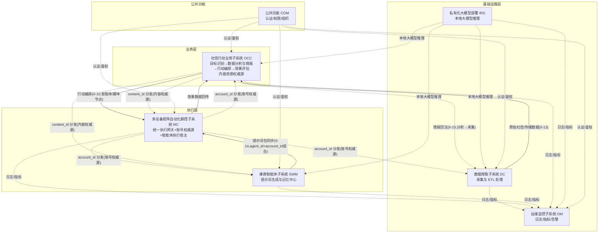

#### 设计原则

系统设计遵循以下源自需求约束（CON-01～CON-16）的核心原则：

1. **动作收口**（CON-07）：所有执行终端动作（无论脚本引擎还是智能体引擎，无论移动端 ADB/无障碍还是桌面端 CDP）均经群控子系统统一执行网关落地，禁止任何子系统或 Agent 绕过，保证可观测、可审计、可熔断。
2. **推理与执行分离**（CON-10）：智能体模式下由群控子系统（MC）的 agent-runtime 子模块调用 IRS 本地大模型完成视觉推理，不经执行网关；推理产出的动作指令再经执行网关落地。agent-runtime 与执行网关逻辑隔离。
3. **双执行模式**（CON-08）：同时支持脚本模式与智能体模式，共用底层控制通道，均收口于执行网关。
4. **权威源唯一**（CON-11）：账号主数据由群控子系统（MC）唯一维护（R-MC-011）、内容主数据由社信行动业务子系统（OCC）唯一维护，使用方只引用标识，变更经事件总线通知。指纹浏览器 Profile 管理与桌面端 CDP 执行网关、移动端终端管理与 ADB/无障碍执行网关、智能体执行宿主（含运行时 agent-runtime）均归 MC。蜂群智能体子系统（SWM）作为提示词生成与记忆中心，将生成的提示词包同步至 MC 持存，运行时归 MC 的 agent-runtime。
5. **私有化推理**（CON-06）：大模型推理采用私有化部署，不依赖外部公有云。
6. **可观测优先**：各子系统向运维监控子系统上报日志与指标，关键动作全量留痕。
7. **智能体域特例**（CON-14）：SWM 的提示词工程与评测以**魔改 coze-loop 作为 SWM 主体内核**（在开源 coze-loop 基础上定制开发，UI 层自研并与全平台统一控制台体验对齐，不再是旁挂外部黑盒），其余智能体域组件用 Java（Spring Boot），与统一 Java 栈一致。
8. **真机 Agent 独立部署单元**（CON-15，V3.0 / V3.10 新增）：真机 Agent 是 MC 内**唯一触碰真机的进程**，作为独立部署单元（每台插真机的主机一台 Spring Boot 进程，不嵌入 mc-service）；mc-service 不直接调 ADB / uiautomator2 / scrcpy，所有真机操作经 II-02 长连接由 Agent 落地。这样 mc-service 重启不影响设备连接、Agent 可横向扩展到多主机。Agent 运行时与中心侧编排器统一归 M-MC-15（R-MC-015），借鉴 SonicCloudOrg（已 archived，Apache 2.0 fork 自维护）。
9. **认证框架对齐若依**（CON-16，V3.1 / V4.2 新增）：公共功能（COM）的认证与权限体系以 **若依（RuoYi-Vue-Plus）原生框架为底座**，不自研鉴权组件。① 认证——若依原生**有状态令牌**（uuid + Base64 用户信息存共享 Redis `login_tokens:{uuid}`），各子系统查共享 Redis 校验，**不引入 JWT 无状态令牌、不引入 com-auth-lib 共享验签库**；跨 4 控制台 SSO、5 次锁定 + 令牌黑名单由若依原生承载。② 权限——若依原生完整 RBAC（多角色 + role_key + 菜单/按钮权限点 + `@PreAuthorize` 注解）；**废弃 org_id 多组织隔离**，改用 `@DataScope` 注解按 `dept_id` 做数据范围隔离（全部/本部门/本部门及以下/仅本人）。③ 系统管理控制台 11 页（用户/角色/部门/登录策略/登录日志/菜单/岗位/字典/参数/通知/操作日志）由若依原生承载。

### 3.2 软件层次结构

系统自下而上分为四层，每层只依赖其下层，不反向依赖：

| 层次 | 组成 | 职责 |
| --- | --- | --- |
| 基础设施层 | IRS、DC、OM | 提供私有化推理、数据采集与 ETL 处理、运维监控底座 |
| 执行层 | MC、SWM | MC 统一收口移动端与桌面端所有执行终端动作、承担账号权威源与智能体执行宿主（SWM 提供提示词生成与记忆中心） |
| 业务层 | OCC | 行动指挥大脑，目标识别→数据分析与情报→行动编排→效果评估；并承担内容资源权威源 |
| 公共 | COM | 跨层认证授权、权限与部门（数据权限）管理 |

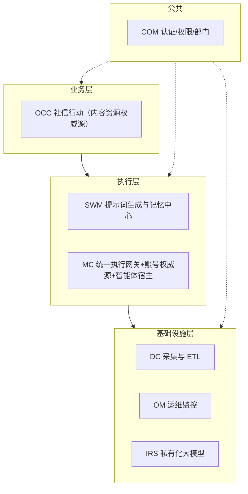

### 3.3 模块划分

系统按子系统划分一级软部件，每个子系统内再按功能需求划分二级软部件（功能模块）。一条功能需求可对应一个或多个模块（按职责内聚程度拆分，不硬拆），每个软部件赋予唯一标识编号（`M-XX-NN`），详见第 4 章。软部件清单如下：

| 子系统（一级软部件） | 代号 | 二级软部件（功能模块） |
| --- | --- | --- |
| 数据爬取子系统（M-DC-00） | DC | M-DC-01 采集调度与限流、M-DC-02 多平台数据采集与策略自优化、M-DC-03 数据处理与存储、M-DC-04 情报驱动采集与目标扩散 |
| 多设备矩阵自动化群控子系统（M-MC-00） | MC | M-MC-01 执行终端接入与台账、M-MC-02 终端身份与环境隔离、M-MC-03 终端风控分级与代理绑定、M-MC-04 远程控制、M-MC-05 统一执行网关、M-MC-06 双执行模式与执行目标、M-MC-07 任务管理、M-MC-08 自动化编排能力、M-MC-09 账号操作编排与养号、M-MC-10 可观测性与作业统计复盘、M-MC-11 账号主数据管理（账号资源权威源）、M-MC-12 智能体账号分层分组、M-MC-13 智能体账号绑定与资产迁移、M-MC-14 智能体执行宿主与同步、**M-MC-15 真机 Agent 运行时与编排（V3.0 / V3.10 新增，CON-15）** |
| 运维监控子系统（M-OM-00） | OM | M-OM-01 日志汇聚与检索、M-OM-02 指标采集与时序存储、M-OM-03 告警引擎、M-OM-04 运维可视化与作业 |
| 公共功能（M-COM-00） | COM | M-COM-01 身份认证、M-COM-02 权限与组织管理 |
| 蜂群智能体子系统（M-SWM-00） | SWM | M-SWM-01 提示词管理、M-SWM-02 提示词模板库与版本管理、M-SWM-04 蜂群记忆管理、M-SWM-05 智能体构建与提示词包下发、M-SWM-06 智能体评测与迭代决策、M-SWM-07 对话编写提示词 |
| 私有化大模型部署（M-IRS-00） | IRS | M-IRS-01 本地大模型部署 |
| 社信行动业务子系统（M-OCC-00） | OCC | M-OCC-01 目标档案与状态管理、M-OCC-02 目标关联网络、M-OCC-03 数据分析与情报、M-OCC-04 行动方案规划、M-OCC-05 编排执行引擎、M-OCC-06 效果评估、M-OCC-07 舆论作业策略库、M-OCC-08 内容主数据与排期（内容资源权威源）、M-OCC-09 内容审核与敏感词风控 |

> **编号说明（跳号与对齐）**：
> - **M-SWM-03 跳号**：M-SWM-03「运行时引擎」已于 V3.7 删除（运行时移至 MC agent-runtime，见版本变动记录 V3.7），编号空置不重排，SWM 现为 6 模块（M-SWM-01/02/04/05/06/07）。
> - **M-OCC 需求↔模块对齐**：OCC 因需求拆分/聚合，模块号与需求号末位按"业务能力域"靠拢——R-OCC-001（目标识别）拆为 M-OCC-01（实体）+ M-OCC-02（关联网络图结构）；R-OCC-002~005（数据分析与情报，四项分析能力内聚）对应 M-OCC-03；R-OCC-006（行动编排）拆为 M-OCC-04（方案规划/决策）+ M-OCC-05（编排引擎/建模运行）；R-OCC-007→M-OCC-06、R-OCC-008→M-OCC-07；R-OCC-009（内容管理）拆为 M-OCC-08（主数据）+ M-OCC-09（审核）。R↔M 完整明细映射以《软件需求跟踪矩阵.xlsx》为唯一权威源（CON-11 单一权威源原则）。

### 3.4 模块间关系

子系统之间存在五类关键协作关系：

**（1）行动指挥链（DC 采集 → OCC 分析/目标/编排 → MC 执行）**

社信行动是全链路指挥大脑：DC 采集与 ETL 加工的原始社信/传播数据经 II-13 输入 OCC，OCC 在本子系统内完成数据分析与情报研判（R-OCC-002~005）、目标识别与行动编排，以行动编排方式直接编排 MC 中智能体节点与自动化脚本节点形成执行流程落地，效果回传 OCC 评估闭环。

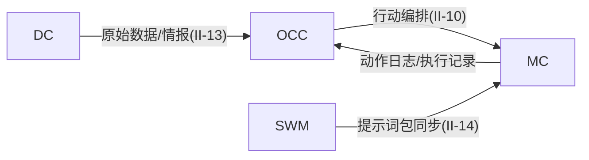

**（2）动作收口（所有动作 → MC 统一执行网关）**

无论脚本引擎还是智能体引擎，所有终端动作均经 MC 统一执行网关鉴权、记录、熔断、转发——移动端终端（真机/云手机/ARM 板卡/虚拟化真机）动作经 ADB/无障碍通道收口，桌面端指纹浏览器 Profile 动作经 CDP 通道收口，两类终端动作均经 MC 统一执行网关落地。智能体视觉推理直接调用 IRS，不经网关；推理产出的动作指令再经网关落地。

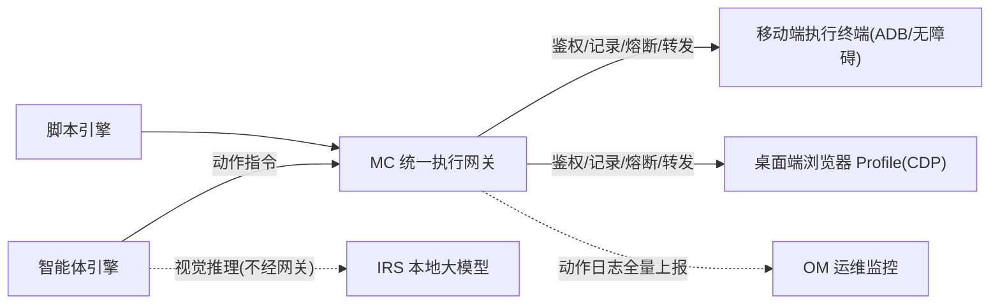

**（3）权威源协作（MC 账号 + OCC 内容：权威源 + 事件通知）**

账号主数据由群控子系统（MC）维护，内容主数据由社信行动业务子系统（OCC）维护；DC/SWM/OCC 作为使用方只引用 account_id / content_id 并维护各自扩展属性。状态变更经事件总线广播，使用方订阅响应。

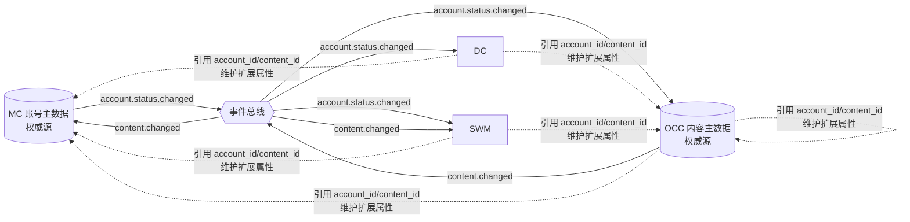

**（4）推理支撑（IRS → DC/SWM/OCC）**

IRS 向上为 DC（文本分析）、SWM（行为决策）、OCC（判别与策略生成）提供统一的本地大模型推理能力，不经外部公有云。

**（5）情报驱动反向闭环（OCC 分析 → DC 采集）**

OCC 数据分析与情报（R-OCC-002~005）产出的高价值目标经 II-15 接口反向回注 DC 任务池，由 M-DC-04 情报驱动采集回注 M-DC-01 任务池并按关系扩散采集，新目标回流 M-DC-03 存储后供 OCC 再次分析，使系统从单向采集管道升级为"OCC 分析→DC 采集"跨子系统情报驱动闭环（R-DC-007/008）。该反向闭环区别于 OCC"扩散趋势预判"——本闭环是 DC 侧图扩展式采集，OCC 扩散趋势预判是传播预测分析（本期暂不实现）。

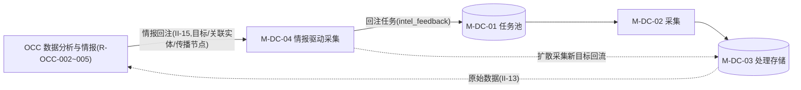

### 3.5 数据流设计

系统主数据流贯穿"采集→分析→行动→执行→评估"闭环：

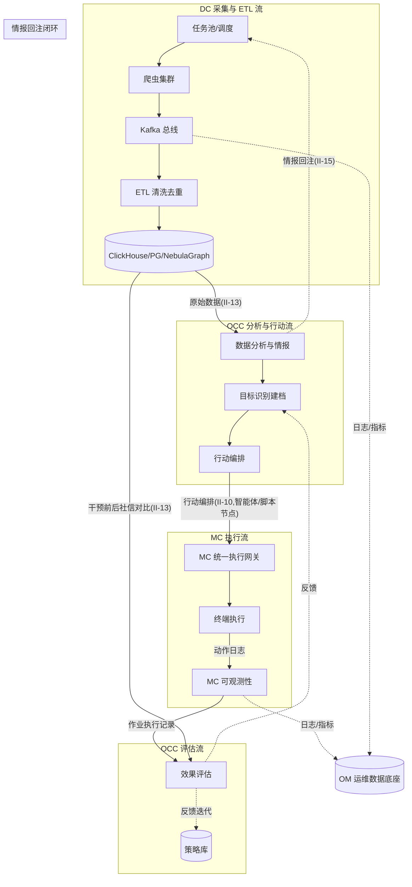

关键数据流要点：
- **采集流**：任务驱动，爬虫消费任务池 → Kafka → ETL（双层去重）→ 多存储（ClickHouse/PG/NebulaGraph），产出原始社信/传播数据经 II-13 输入 OCC。
- **分析与行动流**：OCC 数据分析与情报（R-OCC-002~005）消费 DC 原始数据 → 目标识别 → 行动编排。分析产出经 II-15 情报回注反向驱动 DC 任务池，形成跨子系统情报驱动闭环。
- **执行流**：OCC 行动编排 → MC 统一执行网关 → 终端执行 → 动作日志上报。
- **评估流**：MC 作业执行记录 + DC 社信对比 → OCC 效果评估 → 反馈策略库与目标，形成闭环。
- **运维流**：各子系统日志与指标汇聚至 OM，形成统一运维数据底座。

### 3.6 控制流设计

系统的控制流围绕"MC 统一执行网关"这一唯一动作收口展开，并区分脚本模式与智能体模式：

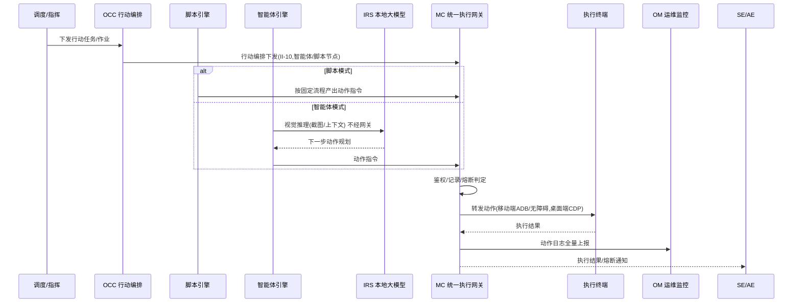

控制流要点：
- **两种模式共用控制通道**：移动端采用 ADB/无障碍服务，桌面端指纹浏览器 Profile 采用 CDP，控制通道对上层透明，MC 统一执行网关按终端类型路由。
- **网关统一控制**：动作经网关鉴权（校验来源与目标终端合法性）、记录（写入动作日志）、熔断（风控信号或异常频率时停止后续动作）、转发。
- **推理旁路**：智能体视觉推理直接调用 IRS 以保证低延迟，不经网关；只有推理产出的动作指令经网关落地。

### 3.7 环境部署架构图

爬虫集群容器化部署于 Kubernetes（由 KubeSphere 统一纳管），Kafka、Redis、PySpark、ClickHouse、NebulaGraph 等大数据组件复用现有基础设施；群控服务端、蜂群服务端、社信行动服务端与运维监控按微服务部署；**真机 Agent 主机进程**（M-MC-15.a，独立部署单元，CON-15）部署在插真机的 Linux/Mac 主机上、经 II-02 WS 连 mc-service 注册接入，桌面端指纹浏览器 Profile 经商用产品 API 创建接入。具体部署拓扑待详细设计阶段补充。

> 部署副本说明（V2.4 补充）：当前版本各微服务（含 DC/MC/OM 等）均**单副本部署**，对应 NR-R-01/04 降级为 V2 目标（见 SRS V3.5）。OM 子系统采用「复用 KubeSphere 开源版可观测底座 + 单一微服务（Java/Spring Boot）」定位，M-OM-01~04 为同进程内模块划分，详见《软件详细设计说明-OM子系统》。V2 演进多副本 HA（NR-R-01/04 达标）。

---

## 4 功能模块设计

本章按子系统给出功能模块设计。每个模块（二级软部件）标注其软部件标识编号，描述其职责、组成与关键设计。模块与《软件需求规格说明》V4.2（总册 + 各子系统分册）功能需求的对应关系见第 9 章需求追踪。子系统作为一级软部件（M-XX-00），其下二级软部件编号 M-XX-NN 见各小节。模块划分的权威依据为《软件概要设计-模块功能拆分-v2.xlsx》。

### 4.1 数据爬取子系统（M-DC-00）

数据爬取子系统（软部件标识 M-DC-00）是基础设施层的数据采集与 ETL 处理底座，采用"任务驱动采集"范式：采集任务由人工/OCC 情报回注注入任务池，爬虫作为执行器消费任务、按目标定向抓取。V3.3 起「数据分析与情报」（R-OCC-002~005）移至 OCC 子系统，DC 聚焦采集、ETL 与情报回注/扩散，并通过情报回注与目标扩散形成"OCC 分析→DC 采集"跨子系统反向闭环。系统级监控收口至 OM（R-OM-001），DC 采集健康度指标经 II-04 上报 OM。

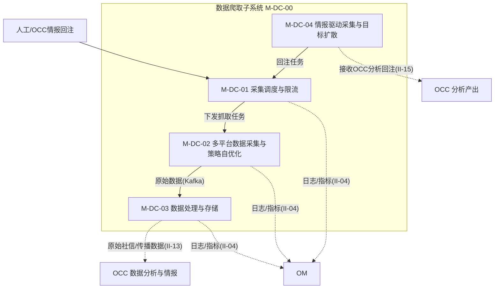

#### 4.1.1 采集调度与限流模块（M-DC-01）

- **职责**：消费人工与 OCC 情报回注注入的采集任务，管理任务池、目标级去重、调度队列与配额限流，使采得不重复、不丢失、不失控。
- **组成**：采集任务池与多来源接入（REST/CSV/情报回注回调）、入池目标级去重（Redis 调度队列+分布式锁，双层去重第一层）、调度队列分发（Redis ZSet 优先级队列、Kafka 分发）、配额限流（范围/频率/并发上限、账号/IP 水位动态调节）。
- **关键设计**：回注任务与常规任务受同一套去重与配额约束（II-15）；任务队列积压时告警。

#### 4.1.2 多平台数据采集与策略自优化模块（M-DC-02）

- **职责**：消费任务池下发的任务，按目标从 TikTok/Instagram/Facebook/YouTube/X 等海外社交平台采集原始数据；面向海外社交平台提供代理网络出口；基于历史指标自适应优化采集策略。
- **组成**：多平台采集适配（逆向采集/官方 API/模拟点击/网页解析）、采集手段切换与容错（失效切换、限流退避、被封切换备用账号）、代理与维护账号应用、代理 IP 池管理（按平台/地区分配、定时轮换、可用性检测、失效剔除）、采集策略自优化（基于封禁率/成功率/反爬信号主动调整手段优先级与频率并发）。
- **关键设计**：代理池是采集执行的网络出口（执行器直接消费代理），紧耦合故内聚进本模块；策略自优化是执行器的学习闭环能力（区别于被动容错）；对接 EI-01 社交平台、EI-02 代理 IP 服务。

#### 4.1.3 数据处理与存储模块（M-DC-03）

- **职责**：对经 Kafka 流入的原始数据做分布式批处理清洗（字段提取、格式标准化、去重、关联），产出结构化干净数据，并按数据特征持久化到不同存储模型。
- **组成**：分布式 ETL 加工（PySpark，清洗/提取/标准化/去重/关联，失败重试转移、坏数据隔离）、多模型持久化存储（明细入 ClickHouse、元数据/索引入关系库、关系数据入 NebulaGraph 图库，写入失败重试队列）。
- **关键设计**：清洗与存储是 ETL 流水线前后两环，紧耦合故合并；加工后的原始社信/传播数据经 II-13 输出供 OCC 分析。

#### 4.1.4 情报驱动采集与目标扩散模块（M-DC-04）

- **职责**：打通"OCC 分析→DC 采集"跨子系统反向驱动链路，使 OCC 数据分析与情报（R-OCC-002~005）产出的目标个体/关联实体/传播节点回注任务池并按关系扩散采集，形成"发现线索→定向扩散采集→锁定目标"的情报驱动闭环。
- **组成**：情报回注采集（OCC 分析产出经 II-15 自动/人工回注，目标级去重、人工确认闸门、全程审计）、目标扩散采集（以已采集目标为起点按关系类型与扩散层数 BFS 图扩展式采集，新节点去重生成任务，受配额与层数上限约束，迭代扩散回流）。
- **关键设计**：回注入池经 M-DC-01 同一去重与配额约束；区别于 OCC 侧"扩散趋势预判"（传播预测分析，本期暂不实现）。

### 4.2 多设备矩阵自动化群控子系统（M-MC-00）

MC（软部件标识 M-MC-00）是统一自动化执行引擎与多终端执行网关，统一管理移动端（真机/云手机/ARM 板卡/虚拟化真机）与桌面端（指纹浏览器 Profile）两类执行终端，收口所有终端动作，并承担账号资源平台级权威源（M-MC-11/12/13）与智能体执行宿主（M-MC-14）两项职责。V3.3 起原指纹浏览器管理子系统（FB）与共享资源管理子系统（SR）的职责已并入本子系统。

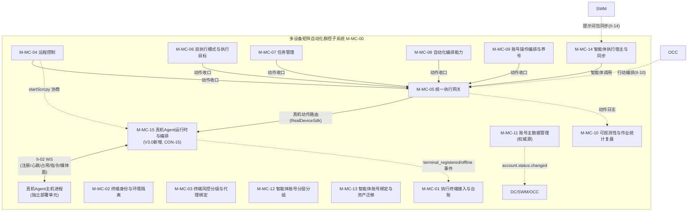

#### 4.2.1 执行终端接入与台账模块（M-MC-01）

- **职责**：统一管理四类执行终端（移动端真机/云手机/ARM 板卡/虚拟化真机、桌面端指纹浏览器 Profile）的**台账数据库与状态查询**——元数据 CRUD、分组标签、批量操作编排、REST 查询。**V3.0（V3.10）边界调整**：原"Agent 接入注册 + 心跳判定在线"语义经 CON-15 划归 M-MC-15（M-MC-15 持 II-02 endpoint，全权管 Agent 生命周期）；本模块回归**纯台账持有方**——订阅 M-MC-15 设备上下线事件写库与更新状态，不再持 WS endpoint、不主动判定在线。
- **组成**：移动端终端台账（订阅 M-MC-15 注册事件写库，设备类型区分）、浏览器 Profile 创建与 CDP 接入（经商用指纹浏览器 API 创建 Profile、下发指纹模板/代理、返回调试端口 CDP）、终端分组与标签（按业务目标/平台/地区）、终端批量操作（动作经 M-MC-05 网关 → M-MC-15 落地；Profile 创建/启动/关闭/截图；对象存储临时链接）。
- **关键设计**：与 M-MC-15 是事件驱动边界（M-MC-15 生产设备上下线事件，本模块消费写台账）；对接 EI-06 指纹浏览器服务接口（经商用产品 API 管理 Profile）、EI-04 对象存储。

#### 4.2.2 终端身份与环境隔离模块（M-MC-02）

- **职责**：通过终端指纹固化（移动端硬件/软件指纹、桌面端 Profile 渲染层指纹 20+ 维），使终端长期呈现一致真人设备身份；终端间环境相互隔离。
- **组成**：浏览器 Profile 指纹固化（经商用 API 配置 Canvas/WebGL/字体/时区/Audio/UA 等 20+ 维，商用产品生成固化）、移动端设备指纹管理、终端间环境隔离（指纹/网络/账号/Cookie/缓存，Profile 间独立隔离）。
- **关键设计**：一 Profile 对应一套固化指纹与一账号身份；指纹生成与固化由商用产品负责（CON-12）。

#### 4.2.3 终端风控分级与代理绑定模块（M-MC-03）

- **职责**：按指纹真实度对终端风控分级（养号优先选高真实度）；识别平台风控信号主动规避、持续触发时降级；为每终端/Profile 分配独立固定代理 IP。
- **组成**：终端状态与指标监控、设备风控分级（真机/ARM 板卡=高、虚拟化真机=中高、云手机/Profile=中）、风控信号识别与规避（持续触发降级/暂停）、代理分配与固定绑定（一终端/Profile 一 IP，失效切换重新固定）。
- **关键设计**：养号等高敏感场景优先选用高真实度终端（CON-09）；对接 EI-02 代理 IP 服务。

#### 4.2.4 远程控制模块（M-MC-04）

- **职责**：对单台及多台终端提供低延迟实时画面预览与输入控制，支持多终端同屏监控；远控通道与任务执行通道分离。
- **组成**：移动端 WebRTC 远控（画面传输、事件映射、截图录屏、端到端≤300ms、弱网降帧）、桌面端商用 API 画面远控（经商用产品 API 画面预览流、CDP 注入页面事件）、多终端宫格监控（低码率同屏）、剪贴板双向同步。
- **关键设计**：远控通道与任务执行通道相互分离（CON-07）；对接 II-03 远控画面传输、EI-06 指纹浏览器。

#### 4.2.5 统一执行网关模块（M-MC-05）⭐ 核心

- **职责**：作为所有执行终端动作的唯一收口，对动作鉴权、记录、熔断、转发落地；保证每一个动作可观测、可审计、可熔断。
- **组成**：动作收口与转发（唯一收口、禁止绕过）、动作鉴权（来源/目标合法性）、动作记录与上报（写动作日志全量上报 OM）、异常熔断（风控信号/异常频率停止后续、过载优先级限流）、**控制通道适配（V3.0 / V3.10 接口/实现分离：本模块只持 `DeviceSdk` 统一接口 + `DeviceChannelRouter` 按 terminal_type 路由，F-MC-05-05 收缩为接口薄层；真机 `RealDeviceSdk` 实现下沉 M-MC-15，桌面端 ProfileSdk 留 V1.2；移动端 ADB/无障碍、桌面端 CDP 对上层透明）**。
- **关键设计**：动作收口（CON-07）的落地；动作日志经 II-11 全量上报 OM；与 R-MC-006 双执行模式是"收口通道"与"执行引擎"两类职责；**接口/实现分离**——网关面向 `DeviceSdk` 抽象编程，真机通道复杂度封装在 M-MC-15，未来增加 iOS / 云手机等实现不影响网关。

#### 4.2.6 双执行模式与执行目标模块（M-MC-06）

- **职责**：提供脚本模式与智能体模式两种执行引擎，分别承载固定流程驱动与大模型实时决策驱动的作业，覆盖移动端与桌面端，支持群控、养号与内容投放三类执行目标。
- **组成**：脚本模式执行引擎（固定流程驱动）、智能体模式执行引擎（由 MC 的 **agent-runtime 子模块**按持存的提示词包运行：场景适配/动态调用提示词/读 SWM 记忆服务/调 IRS 视觉推理决策，推理不经网关、动作经网关落地）、三类执行目标（群控/养号/内容投放）。
- **关键设计**：推理执行分离（CON-10）——agent-runtime（推理者）与执行网关（执行者）逻辑隔离；agent-runtime 承接原 SWM M-SWM-03 运行时职责；养号拟人化节奏由 R-MC-009 内置；对接 EI-05/II-08 推理、II-14 提示词包同步。

#### 4.2.7 任务管理模块（M-MC-07）

- **职责**：把操作意图转换为设备可执行任务并调度，支撑排队、分发、重试与定时执行。
- **组成**：任务创建与实例化、多任务类型（八类）、任务状态机流转（八态）、失败重试与超时配置、计划任务与定时调度（Cron/最大并发/优先级）。
- **关键设计**：任务入队到分发≤2s（NR-P-04）；队列积压按优先级调度并告警。

#### 4.2.8 自动化编排能力模块（M-MC-08）

- **职责**：提供自动化能力中枢，覆盖模板任务→可视化工作流→脚本开发的递进式编排，支持 ADB/CDP 多通道，针对目标平台实现模拟点击自动化。
- **组成**：模板化任务（第一阶段）、可视化工作流编排（第二阶段）、脚本开发与调试（第三阶段，沙箱+权限白名单）、模拟点击自动化。
- **关键设计**：产出动作均经 R-MC-005 网关落地，不直接操作设备；脚本越权沙箱拦截（NR-S-05）。

#### 4.2.9 账号操作编排与养号模块（M-MC-09）

- **职责**：承载养号、账号-终端-代理绑定、登录状态维护等可自动化账号操作的执行编排，以及养号拟人化节奏策略（内置）。
- **组成**：养号自动化与拟人化节奏（认知行动账号 ADB/无障碍、爬虫账号 CDP，拟人化节奏内置不依赖蜂群）、账号-终端-代理绑定自动化（一设备一账号一 IP / 一 Profile 一账号一 IP）、终端侧登录状态维护、状态变更联动（封禁停止任务解绑）。
- **关键设计**：差异化绑定规则（CON-13）；动作均经 R-MC-005 网关落地。

#### 4.2.10 可观测性与作业统计复盘模块（M-MC-10）

- **职责**：使终端、账号、任务的每个动作可知可追溯，支撑记录、回传、告警、审计，并完成蜂群作业数据统计与任务复盘、将投送效果联动回传上游供效果评估闭环。
- **组成**：动作留痕、任务日志与截图回传、异常告警、审计日志、任务完成率统计、内容触达与互动统计、账号健康度统计、任务复盘归因、效果回调回传上游（回传 OCC）。
- **关键设计**：动作留痕与作业统计同源避免重复采集；Agent 任务日志与截图经 M-MC-15 II-02 回传后入本模块；效果数据经 II-10 回传 OCC；动作日志与熔断记录一并上报（II-11）。

#### 4.2.11 账号主数据管理模块（M-MC-11）权威源

- **职责**：平台级权威源，唯一维护社交媒体账号主数据（注册、凭据、验证、风险评估、生命周期、账号分类），经事件总线向 DC/SWM/OCC 分发 account_id。账号分爬虫账号（桌面端）与认知行动账号（移动端）两类。
- **组成**：账号主数据维护（凭据加密）、注册方式与流程编排（邮箱/接码/虚拟号，注册动作经网关执行）、注册结果判定与状态落地、账号验证与风险识别、账号生命周期状态机（六态）、账号状态变更事件广播（account.status.changed）。
- **关键设计**：权威源主数据唯一维护，使用方仅引用 account_id 不复制主数据（凭据加密 NR-S-03）；对接 II-01/II-01a、EI-03 接码。

#### 4.2.12 智能体账号分层分组模块（M-MC-12）

- **职责**：对智能体账号按业务目标/平台/地区/风险等级分层分组，形成可控账号层级结构，并管理智能体账号作业生命周期。
- **组成**：智能体账号分层分组（多维度）、智能体账号作业生命周期（待激活/活跃/休眠/受限/封禁/回收，自动与人工流转）。

#### 4.2.13 智能体账号绑定与资产迁移模块（M-MC-13）

- **职责**：维护智能体定义（agent_id）与账号（account_id）的 1:N 绑定关系（一个智能体可绑多个账号），账号级记忆与动态提示词实例按 account_id 1:1 归属；叠加账号-终端-代理绑定（account_id:终端:代理 IP=1:1:1）形成行动关系（agent_id:account_id:终端:代理 IP=1:N:1:1）；账号被封后支持账号资产迁移（账号级记忆+动态提示词迁移到新账号，agent 不变）。
- **组成**：智能体-账号 1:N 绑定维护、账号级记忆/动态提示词归属维护（account_id 1:1）、行动关系维护、迁移资产抽取（账号级记忆/动态提示词实例）、迁移目标账号校验、继承写入与绑定切换。
- **关键设计**：绑定关系归 MC；记忆与动态提示词按 account_id 归属（提示词模板按 agent_id）；对接 II-14 接收 agent_id+account_id 组合。

#### 4.2.14 智能体执行宿主与同步模块（M-MC-14）

- **职责**：作为智能体执行宿主，接收并持存 SWM 同步来的提示词包（agent_id+account_id 组合标识，含提示词模板/账号级动态提示词实例/作业策略），任务执行时由 agent-runtime 子模块运行，执行前校验行为风格一致性。
- **组成**：提示词包接收与持存（经 II-14，agent_id+account_id 组合主键）、行为风格一致性校验（account_id 动态实例 vs agent_id 模板，不一致拒绝并告警）、提示词包调用执行（agent-runtime 按 account_id 读记忆+场景适配/动态调用+调 IRS 推理、动作经网关落地）、提示词包更新生效、OCC 编排智能体节点来源。
- **关键设计**：确立"SWM 提示词生成与记忆中心、MC 执行宿主（含运行时 agent-runtime）"分工；记忆不在提示词包内，agent-runtime 运行时按 account_id 向 SWM 记忆服务读取；对接 II-14 同步、II-10 OCC 编排引用。

#### 4.2.15 真机 Agent 运行时与编排模块（M-MC-15）⭐ V3.0 / V3.10 新增（CON-15）

- **职责**：作为所有真机动作的**物理落地单元**和 Agent 连接的生命周期管理者。双形态——**M-MC-15.c 中心侧编排器**（mc-service 同进程 Java 包）：持 II-02 WebSocket endpoint，全权管 Agent 注册/心跳/占用锁/媒体面协商；作为 `RealDeviceSdk` 的实现方接收 M-MC-05 网关下发的动作，经 II-02 路由到对应 Agent；同时是设备上下线事件的生产者（推 M-MC-01 写台账）。**M-MC-15.a 设备主机侧 Agent 运行时**（独立部署单元，每个插真机的 Linux/Mac 主机一台的 Spring Boot 进程）：MC 体系内**唯一触碰真机的进程**，承载 ddmlib（ADB 通道）、uiautomator2-server 客户端（无障碍通道，引 sonic-driver-core）、scrcpy 客户端（远控画面源，抄 Sonic）。
- **组成**：Agent 注册与鉴权握手（F-MC-15-01，agentKey 配置文件校验+版本/能力上报）、心跳保活与在线状态判定（F-MC-15-02，30s 心跳+90s 超时判离线+推 M-MC-01）、设备占用锁（F-MC-15-03，内存锁远控/自动化互斥）、ADB 控制通道（F-MC-15-04，ddmlib 封装 install/pressKey/reboot/screenshot 子集）、无障碍控制通道（F-MC-15-05，sonic-driver-core 封装 uia2 find/click/sendKeys/swipe）、远控画面源 scrcpy（F-MC-15-06，H.264 推流到 mc-sfu 指定端口）。
- **关键设计**：**Agent 独立部署单元**（CON-15）——mc-service 不直接调 ADB/uia2/scrcpy，所有真机操作经 II-02 由 M-MC-15.a 落地，mc-service 重启不影响设备连接；**接口/实现分离**——M-MC-05 持 `DeviceSdk` 接口，本模块持 `RealDeviceSdkImpl` 实现；**借鉴 Sonic 架构**（已 archived，Apache 2.0 fork 自维护）——scrcpy 集成、ddmlib 用法、uia2 协议封装直接抄 Sonic `ScrcpyInputSocketThread` / `AndroidDeviceBridgeTool` / `AndroidStepHandler`；**远控画面源与转发分离**——本模块只产画面源，WebRTC 转发由 M-MC-04 / mc-sfu 承担；**V1.2 待补**：iOS（WDA+sib）、热插拔、设备保护、远程升级。

### 4.3 运维监控子系统（M-OM-00）

OM（软部件标识 M-OM-00）是基础设施层的运维数据底座，汇聚全系统日志与指标，支撑常态化运维与告警。

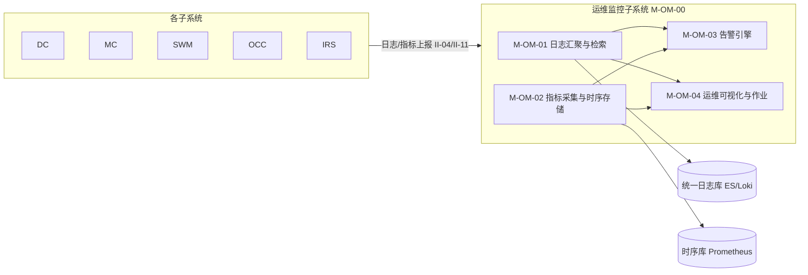

#### 4.3.1 日志汇聚与检索模块（M-OM-01）

- **职责**：通过日志采集将各子系统日志汇聚至统一日志库，支持全文检索。
- **组成**：日志采集与汇聚（统一日志库）、全文检索（近 7 日检索≤3s，NR-P-06）。
- **关键设计**：日志采集 Agent 离线本地暂存待恢复上报；对接 II-04/II-11。

#### 4.3.2 指标采集与时序存储模块（M-OM-02）

- **职责**：通过指标采集器采集设备在线率、任务成功率、爬虫吞吐量、队列积压等指标，形成时序数据存储。
- **组成**：多维指标采集器、时序数据库存储（供告警与看板消费）。

#### 4.3.3 告警引擎模块（M-OM-03）

- **职责**：**告警观测**——基于指标与规则产生告警（由 KubeSphere Alertmanager 承担），支持阈值告警与异常检测告警，多渠道通知，含告警风暴聚合去重；OM 提供告警规则与事件的只读观测及告警事件归档，不提供配置下发接口（V2.4 按只读观测定位修订，对齐 SRS V3.5 R-OM-002 实现说明）。
- **组成**：阈值与异常检测告警（多渠道通知）、告警风暴聚合去重（备用渠道降级）、告警事件归档与处置追踪。

#### 4.3.4 运维可视化与作业模块（M-OM-04）

- **职责**：提供多维可视化看板，并支持日志查询、故障定位、巡检与容量观测等常态化运维操作。
- **组成**：可视化看板（总览/设备/任务/爬虫/异常，缓存降级展示）、常态化运维操作（日志查询/故障定位/巡检/容量观测）。

### 4.4 公共功能（M-COM-00）

COM（软部件标识 M-COM-00）为各子系统提供统一的认证、权限与部门（数据权限）管理。技术栈为 **Java 17 + Spring Boot 3.x**（管控/业务微服务统一 Java 栈），与 OM 同栈；**以若依（RuoYi-Vue-Plus）原生框架为底座**（CON-16，V3.1/V4.2 新增）——登录采用若依原生**有状态令牌**（uuid + Base64 用户信息存共享 Redis `login_tokens:{uuid}`），各子系统查共享 Redis 校验令牌有效性（**不引入 JWT 无状态令牌、不引入 com-auth-lib 共享验签库**）；跨 4 控制台（MC/OCC/SWM/系统管理）SSO 令牌共享；功能权限用 `@PreAuthorize` 注解（按 role_key 控制菜单/按钮权限点），数据权限用 `@DataScope` 注解（按 `dept_id` 做全部/本部门/本部门及以下/仅本人四级行级过滤，替代原 org_id 多组织隔离）。详见《软件详细设计说明-COM子系统》。

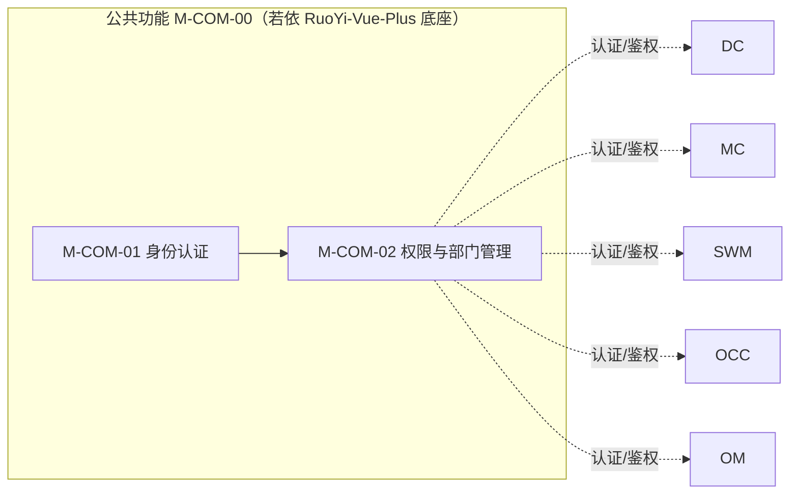

#### 4.4.1 身份认证模块（M-COM-01）

- **职责**：基于若依（RuoYi-Vue-Plus）原生提供统一登录认证，签发**有状态令牌**（uuid + Base64 用户信息存共享 Redis `login_tokens:{uuid}`，V3.1/V4.2 改写——原"JWT 无状态令牌"作废）。
- **组成**：若依原生登录认证（/login 校验 + /getInfo 取用户信息 + /getRouters 取动态菜单；账号密码校验，连续 5 次错误锁定，需超管手动解锁）、有状态令牌签发（uuid + Base64 用户信息，含 user_id/dept_id/roles，写入共享 Redis；各子系统查共享 Redis 校验，不本地验签）、跨控制台 SSO（令牌跨 MC/OCC/SWM/系统管理 4 控制台共享，前端 localStorage 存令牌）、令牌黑名单与登出吊销。

#### 4.4.2 权限与部门管理模块（M-COM-02）

- **职责**：基于若依原生完整 RBAC 进行功能权限决策（@PreAuthorize），基于 @DataScope 注解按部门 `dept_id` 做数据范围隔离（V3.1/V4.2 改写——原"组织管理 + 多组织/多租户隔离"作废）。
- **组成**：完整 RBAC 权限决策（若依 sys_role/sys_role_menu/role_key；超级管理员/运营主管/运营人员/脚本开发者/审核人员/只读观察员等多角色，按菜单/按钮权限点 + @PreAuthorize 注解决策，越权拦截审计）、部门与成员管理（若依 sys_dept 部门树 + sys_user 成员管理）、部门数据权限隔离（@DataScope 注解按 dept_id 注入行级过滤——全部/本部门/本部门及以下/仅本人四级；替代原 org_id 多组织模型，NR-C-01/02）、系统管理控制台 11 页（用户/角色/部门/登录策略/登录日志/菜单/岗位/字典/参数/通知/操作日志，由若依原生 sys_user/sys_role/sys_dept/sys_menu/sys_dict 等表与配套服务承载）。

### 4.5 蜂群智能体子系统（M-SWM-00）

SWM（软部件标识 M-SWM-00）是执行层的"提示词生成与记忆中心"，生成驱动智能体作业的提示词并管理记忆，将生成的提示词包（提示词模板/账号级动态提示词实例/作业策略）以 agent_id（模板共性，稳定逻辑标识）+ account_id（动态实例个性）组合同步至 MC 持存，由 MC 的 agent-runtime 子模块运行。本子系统**不直接操作设备**，所有动作收口于 MC 统一执行网关。技术栈：提示词工程（模板库/版本/Playground/版本对比）与智能体评测（评测集/评估器/实验）以 **魔改 coze-loop 作为 SWM 提示词工程与评测主体内核**（在开源 coze-loop 基础上定制开发，UI 层自研并与全平台统一控制台体验对齐，不再是旁挂外部黑盒）；网关、编排提炼、记忆服务采用 **Java（Spring Boot）**，与管控/业务微服务统一 Java 栈一致（CON-14，智能体域特例，仿 DC 采集域特例思路）。

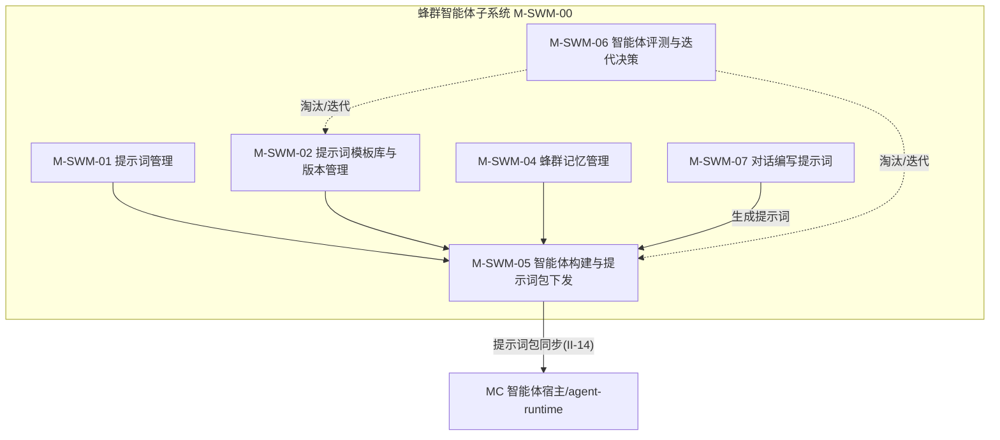

#### 4.5.1 提示词管理模块（M-SWM-01）

- **职责**：管理提示词模板库（分类/版本）、Playground 试运行调试、版本输出对比与迭代优化，以 agent_id（模板）+ account_id（动态实例）组合为标识组装提示词包同步至 MC。
- **组成**：提示词模板库分类管理、提示词模板版本管理（agent_id 索引，模板共性）、账号级动态提示词实例版本管理（account_id 索引，账号个性）、Playground 试运行调试、版本输出对比、迭代优化。
- **关键设计**：agent_id 为稳定逻辑标识，不随提示词模板重新生成而变；提示词模板版本为 agent_id 下子属性；账号级动态提示词实例按 account_id 1:1 归属。

#### 4.5.2 提示词模板库与版本管理模块（M-SWM-02）

- **职责**：建立提示词模板库并按用途/平台/目标分类管理；对提示词模板进行版本管理（agent_id 主键索引，模板共性；账号级动态实例按 account_id 索引），支持版本对比/回滚/变更记录。
- **组成**：提示词模板库分类管理、提示词版本管理、Playground 试运行调试、版本输出对比。
- **关键设计**：Playground 试运行与版本对比调用 IRS 本地大模型（EI-05，不经执行网关，CON-10）；该模块以 coze-loop 的 prompt 模块承载。

#### 4.5.3 蜂群记忆管理模块（M-SWM-04）

- **职责**：实现智能体作业记忆的存储、场景沉淀、历史复用与个性化状态延续，记忆按 account_id 1:1 归属（账号级独立）。
- **组成**：作业记忆存储（account_id 主键）、场景记忆沉淀、历史记忆复用、个性化状态延续。
- **关键设计**：记忆为 SWM 内部存储，载体为 Java 记忆服务 swm-memory；记忆按 account_id 索引（同一 agent 下不同账号各自独立）；记忆有效性由 R-SWM-004 的 loop 评估器度量。

#### 4.5.4 智能体构建与提示词包下发模块（M-SWM-05）

- **职责**：配置提示词模板与作业策略，组装为提示词包（提示词模板/账号级动态提示词实例/作业策略）并以 agent_id（模板共性，稳定逻辑标识）+ account_id（动态实例个性）组合标识，经 II-14 同步至 MC 持存、供 OCC 行动编排引用。一个 agent_id 可绑 N 个 account_id，每账号独立动态实例。记忆不在提示词包内，由记忆服务（按 account_id 索引）独立承载。
- **组成**：提示词包构建（agent_id 模板标识+版本子属性、account_id 动态实例）、账号绑定引用（agent_id↔account_id 1:N，绑定关系归 MC R-MC-013）、同步至 MC 持存、OCC 智能体节点定义来源。
- **关键设计**：提示词可手动编写或由 M-SWM-07 自动生成；运行时（场景适配/动态调用/调 IRS）归 MC 的 agent-runtime 子模块（见 §4.2.6/§4.2.14），不在 SWM。

#### 4.5.5 智能体评测与迭代决策模块（M-SWM-06）

- **职责**：对构建出的智能体采用"线上效果+离线数据集"双轨评测，淘汰低效定义、迭代优化高价值定义，形成"构建→评测→迭代"闭环。
- **组成**：有效性评测（基于 MC 作业效果 R-MC-010）、评测数据集管理、批量跑题执行（逐题调 IRS 推理不经执行网关）、答案对比与打分（规则/LLM-as-judge/人工）、评分汇总与报告、迭代/淘汰决策与反馈闭环。
- **关键设计**：离线评测以 coze-loop 的 evaluation（评测集/评估器/实验）承载。

#### 4.5.6 对话编写提示词模块（M-SWM-07）

- **职责**：用户上传画像素材或描述需求，经 IRS 本地大模型对话式辅助编写提示词，降低人工编写成本；生成结果版本化并可作为 M-SWM-05 智能体构建的提示词来源。
- **组成**：画像素材上传与对话上下文、对话式提示词编写（调 IRS EI-05，不经执行网关，CON-10；私有化 CON-06）、生成结果版本化与纳入构建。
- **关键设计**：生成流程以 coze-loop 工作流承载；画像来源于 OCC R-OCC-004 全维度档案。

### 4.6 私有化大模型部署（M-IRS-00）

IRS（软部件标识 M-IRS-00）是系统底层推理基础设施（非业务子系统），部署本地大模型并提供推理调用，使全系统 AI 推理不依赖外部公有云。

#### 4.6.1 本地大模型部署模块（M-IRS-01）

- **职责**：在私有化环境中部署本地大模型（含 Qwen2-VL/InternVL 等多模态视觉模型），构建底座推理能力，对外提供统一推理接口供 DC/SWM/OCC/MC agent-runtime 调用。
- **组成**：私有化部署与模型加载（GPU 算力环境，含多模态视觉模型与纯文本 LLM；加载失败回退上一可用版本）、统一推理调用接口（EI-05，供各子系统调用，算力不足排队）、部署独立性（不依赖公有云，CON-06）；**V1.3 深化能力**——多模型管理与切换（多模型部署/注册/运行状态管理/按需切换）、完整推理监控（调用次数/延迟/吞吐量/错误率/GPU 利用率等指标采集与可视化）、多租户配额（按调用方配置 QPS/日总量配额，超限排队或拒绝）、模型版本回退（版本管理与异常回退）。
- **关键设计**：对接 EI-05/II-08 推理调用；V1.0 部署 1 个多模态视觉模型（演示灵魂），V1.3 扩展为多模型管理。

### 4.7 社信行动业务子系统（M-OCC-00）

OCC（软部件标识 M-OCC-00）是全链路指挥大脑，构建"目标识别→数据分析与情报→行动编排→效果评估"行动闭环，并承担内容资源的统一管理（作为内容资源唯一权威源）。基于 DC 采集的原始社信/传播数据（经 II-13）与 IRS 推理能力，在本子系统内完成数据分析与情报研判（V3.3 起由 DC 移入），以行动编排直接编排 MC 中智能体节点与自动化脚本节点形成执行流程落地，最终评估效果迭代。本期实现目标识别、数据分析与情报、行动编排、效果评估、策略库与内容资源管理九项能力。

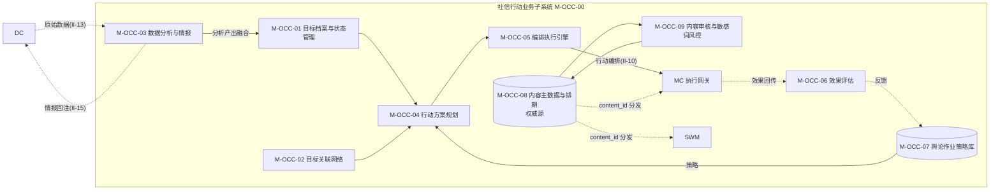

#### 4.7.1 目标档案与状态管理模块（M-OCC-01）

- **职责**：识别社信事件目标要素并建档为数据对象，支持建档、属性修改、状态流转与删除；目标即数据，可随事件演进更新。
- **组成**：目标建档（target_id）、目标属性维护、目标状态生命周期（待核实/已确认/已锁定/已处置/已归档）、目标多维信息融合（融合本子系统 M-OCC-03 分析产出）、目标变更事件广播（target.changed）。

#### 4.7.2 目标关联网络模块（M-OCC-02）

- **职责**：目标之间建立关联关系，形成目标关系网络，支持关系网络查询。
- **组成**：目标关联关系建模、关系网络查询（关联断裂标注断点）。

#### 4.7.3 数据分析与情报模块（M-OCC-03）

- **职责**：V3.3 起由 DC 移入。对 DC 采集与 ETL 加工的数据（经 II-13）进行分析，提供从群体到个体的下钻筛选、关系图谱与图查询、实体检索与全维度档案、文本智能分析能力，支撑目标识别与内容研判。
- **组成**：群体-个体下钻筛选（AI 算法）、关系图谱与图查询、实体检索与档案、文本智能分析（调 IRS 文本模型 EI-05，模型不可用回退关键词）。
- **关键设计**：分析产出供 M-OCC-01 目标识别融合，并经 II-15 反向驱动 DC 情报回注（R-DC-007）。

#### 4.7.4 行动方案规划模块（M-OCC-04）

- **职责**：根据目标档案中的干预切入点匹配干预策略，生成具体作业方案（内容/账号/时间/节奏）；本期以人工匹配为主。
- **组成**：干预策略匹配、作业方案生成。

#### 4.7.5 编排执行引擎模块（M-OCC-05）

- **职责**：将作业方案编排为执行流程（DAG），以 MC 中智能体节点/自动化脚本节点为编排实体；编排落地由 MC 统一执行网关收口。
- **组成**：编排建模（DAG，智能体节点+脚本节点，节点类型可扩充）、节点参数填充（agent_id/通道/内容账号时间节奏）、编排落地与执行跟踪（失败回滚/跳过/转人工）。
- **关键设计**：对接 II-10 行动编排下发与效果回传。

#### 4.7.6 效果评估模块（M-OCC-06）

- **职责**：完成单轮干预成效统计、舆论走势修正、策略迭代反馈与作业复盘，支持中短期与长期效果评估。数据来源于 DC 原始数据（经 II-13，由本子系统分析）与 MC 可观测性（R-MC-010），不自行重复采集。
- **组成**：单轮成效统计、舆论走势修正评估、策略迭代反馈、作业复盘、中短期与长期效果评估。

#### 4.7.7 舆论作业策略库模块（M-OCC-07）

- **职责**：搭建并迭代多语种/多场景/多风格舆论作业策略库，为行动提供可复用、可演进的策略资产。
- **组成**：多语种多场景多风格策略库、策略分类管理与版本控制、策略迭代优化、策略场景适配与动态调用。

#### 4.7.8 内容主数据与排期模块（M-OCC-08）权威源

- **职责**：承担内容资源统一管理，作为内容主数据唯一权威源，管理素材入库、分类、审核与发布排期，向各使用方主动分发 content_id。
- **组成**：内容主数据维护（content_id 全局唯一，使用方不复制主数据）、素材分类与平台适配、发布排期、内容变更事件与分发（content.changed，对接 II-12a）。

#### 4.7.9 内容审核与敏感词风控模块（M-OCC-09）

- **职责**：发布前对内容进行审核与敏感词检测；敏感词命中拦截并标记待人工复核。
- **组成**：发布前内容审核、敏感词检测与拦截（命中待复核，断点续传）。

---

## 5 接口概要设计

所有外部接口使用鉴权与传输加密。接口编号对应《软件需求规格说明-总册》第 4 章（接口需求）。

### 5.1 外部接口

| 编号 | 接口 | 对接对象 | 输入 | 输出 |
| --- | --- | --- | --- | --- |
| EI-01 | 社交平台交互 | TikTok/Instagram/Facebook/YouTube/X | 采集请求、投放内容、账号操作指令 | 原始社交数据、投放/操作执行结果 |
| EI-02 | 代理 IP 服务 | VPS 代理链路与代理 IP 供应商 | 代理分配请求（平台/地区/数量） | 可用代理 IP 列表、可用性状态、轮换日志 |
| EI-03 | 接码与虚拟号服务 | 手机号接码与虚拟号服务 | 注册请求、验证码获取请求 | 验证码、注册结果、虚拟号凭据 |
| EI-04 | 对象存储 | MinIO 或阿里云 OSS | 上传文件、下载请求、签名 URL 请求 | 文件存储路径、限时签名下载链接、存储结果 |
| EI-05 | 本地大模型推理 | 底层 IRS | 推理请求（文本/截图、任务类型、上下文） | 推理结果（分类标签、立场、情感、观点、规划动作） |
| EI-06 | 指纹浏览器服务 | 商用指纹浏览器产品 | Profile 创建/管理、指纹与代理配置、启动调试端口请求 | Profile 标识、调试端口（CDP）、画面预览 HTTP API |

### 5.2 内部接口

| 编号 | 接口 | 提供方 → 调用方 | 说明 |
| --- | --- | --- | --- |
| II-01 | 账号服务 | MC → DC/SWM/OCC | 账号查询/变更，返回主数据 |
| II-01a | 账号状态变更事件 | MC → 事件总线 → DC/SWM/OCC | account.status.changed，使用方订阅响应 |
| II-02 | Agent 长连接协议（V3.0 / V3.10 提供方调整） | MC R-MC-015（M-MC-15.c 中心侧编排器）↔ M-MC-15.a 设备主机侧 Agent | 注册/心跳/占用锁、控制动作下发（ADB/无障碍）、日志截图回传、scrcpy 媒体面协商 |
| II-03 | 远控画面传输 | MC 设备 → WebRTC SFU → 操作端 | 实时画面流（低延迟）、输入事件 |
| II-04 | 日志与指标上报 | 各子系统 → OM | 子系统日志、运行指标上报 |
| II-05 | Kafka 数据总线 | DC 内部采集 → 处理存储 | 原始采集数据流转 |
| II-06 | 管理 REST | 各子系统 → 前端与外部 | 设备/任务/内容/账号/审计 CRUD |
| II-07 | 执行网关动作 | MC 统一执行网关 ← 脚本引擎/智能体引擎 | 动作指令（移动端 ADB/无障碍、桌面端 CDP）→ 执行结果、动作日志、熔断记录 |
| II-08 | 本地大模型推理调用 | MC 的 agent-runtime 子模块 → IRS | 推理请求 → 视觉理解、动作规划；**不经执行网关** |
| II-10 | 行动编排下发与执行回传 | OCC ↔ MC | 编排流程下发（智能体节点/脚本节点）↔ 效果数据回传 |
| II-11 | 执行网关日志上报 | MC 统一执行网关 → OM | 全量动作日志、熔断记录 |
| II-12 | 内容服务 | OCC → SWM/MC | 内容查询、素材获取 |
| II-12a | 内容变更事件 | OCC → 事件总线 → SWM/MC | content.changed，使用方订阅响应 |
| II-13 | 分析数据与情报 | DC → OCC | DC 采集与 ETL 加工后的原始社信/传播数据（供 OCC R-OCC-002~005 分析消费） |
| II-14 | 提示词包同步 | SWM → MC | agent_id+account_id 组合为主键同步提示词包（提示词模板按 agent_id 共性/账号级动态提示词实例按 account_id 个性/作业策略+版本号；记忆不在包内，由 MC agent-runtime 运行时按 account_id 向 SWM 记忆服务读取） |
| II-15 | 情报回注采集 | OCC 分析（R-OCC-002~005）→ DC 任务池（R-DC-003/007） | 分析产出的高价值目标/关联实体/传播节点回注生成采集任务；与 II-13 方向相反，构成 OCC→DC 跨子系统"分析→采集"反向驱动闭环 |
| II-16 | COM 认证服务 | COM（M-COM-01）→ 各子系统/前端 | 若依原生登录认证（账号密码 + /login + /getInfo + /getRouters）、有状态令牌签发（uuid + Base64 用户信息存共享 Redis `login_tokens:{uuid}`，含 user_id/dept_id/roles）、跨控制台 SSO（MC/OCC/SWM/系统管理 4 控制台令牌共享）、5 次密码错误锁定 + 令牌黑名单、登出吊销；对应 R-COM-001（V3.1 改写——原"JWT 令牌签发与刷新"作废，CON-16） |
| II-17 | COM 权限与部门管理 | COM（M-COM-02）→ 各子系统/前端 | 完整 RBAC（@PreAuthorize：多角色 + role_key + 菜单/按钮权限点）、部门数据权限（@DataScope + dept_id：全部/本部门/本部门及以下/仅本人四级）、系统管理控制台 11 页 CRUD（用户/角色/部门/登录策略/登录日志/菜单/岗位/字典/参数/通知/操作日志，若依原生 sys_user/sys_role/sys_dept/sys_menu/sys_dict 等）；对应 R-COM-001（V3.1 改写——原"权限与组织管理/org_id"作废，CON-16） |

### 5.3 接口约束

1. **执行网关收口**（CON-07）：所有执行终端动作（移动端 ADB/无障碍、桌面端 CDP）必须经 II-07（执行网关动作接口）落地，禁止任何子系统或 Agent 绕过。
2. **推理旁路**（CON-10）：智能体视觉推理经 II-08 直接调用 IRS，不经执行网关，保证低延迟；推理产出的动作指令再经 II-07 落地。
3. **权威源引用**：使用方只引用资源标识（account_id/content_id），不复制主数据；账号主数据由 MC 维护（R-MC-011）、内容主数据由 OCC 维护；状态变更一律经事件总线（II-01a/II-12a）通知。
4. **鉴权与加密**：所有接口使用鉴权与传输加密（HTTPS/TLS），远程控制通道加密（NR-S-02）；文件访问使用签名 URL 限时有效（NR-S-07）。

---

## 6 数据概要设计

### 6.1 数据总体组织

系统数据按权威源模式分层存储。账号与内容作为平台级资源，主数据只存于权威源且唯一一份——账号主数据权威源为群控子系统（MC，R-MC-011）、内容主数据权威源为社信行动业务子系统（OCC）；使用方只存"资源标识 + 自有扩展属性"，不复制主数据；资源标识（account_id/content_id）在全系统唯一；主数据状态变更经事件总线广播。

### 6.2 数据清单

| 编号 | 数据类别 | 归属 | 存储说明 |
| --- | --- | --- | --- |
| DR-01 | 执行终端数据 | MC | 移动端终端、桌面端 Profile、终端分组、终端指标 |
| DR-02M | 账号主数据 | MC | 凭据（加密）、平台、状态、生命周期、风险评估、账号分类 |
| DR-02E | 账号扩展数据 | DC/SWM/OCC | 采集关联（DC）、作业生命周期（SWM，见 DR-09）、目标标注（OCC） |
| DR-03M | 内容主数据 | OCC | 原始素材、分类、审核状态、来源 |
| DR-03E | 内容扩展数据 | SWM/MC | 平台适配版本、使用记录 |
| DR-04 | 任务数据 | MC | 任务、任务实例、任务日志 |
| DR-05 | 脚本与工作流数据 | MC | 脚本、脚本版本、工作流定义 |
| DR-06 | 采集与 ETL 数据 | DC | ETL 明细结果存 ClickHouse，关系数据存 NebulaGraph 图库（V3.3 起限采集与清洗存储，分析移 OCC） |
| DR-07 | 审计与风险数据 | COM/MC | 审计日志、风险事件 |
| DR-08 | 代理与指纹数据 | MC | 代理 IP 池、移动端设备指纹配置、桌面端 Profile 指纹配置（移动端与桌面端 Profile 指纹均归 MC） |
| DR-09 | 蜂群智能体数据 | SWM | 以 agent_id 标识的提示词模板及 agent_id↔account_id 1:N 绑定、按 account_id 1:1 归属的账号级动态提示词实例与作业记忆、提示词模板版本 |
| DR-10 | 本地大模型数据 | IRS | 本地大模型配置、推理调用日志 |
| DR-11 | 社信行动数据 | OCC | 目标识别结果、传播链路、多维画像、抓手挖掘结果、数据分析与情报产出、行动编排流程节点编排关系、策略库版本、效果评估记录 |

### 6.3 数据存储选型

| 存储组件 | 用途 |
| --- | --- |
| PostgreSQL / MySQL | 元数据、索引、关系型业务数据（设备/任务/账号/内容主数据等） |
| Redis | 缓存与键值、任务去重、调度队列、分布式锁 |
| Kafka | 消息中枢（DC 采集数据流转、事件总线） |
| ClickHouse | 列式分析型存储，ETL 明细结果、大规模采集数据 |
| NebulaGraph | 分布式图数据库，关系数据、关系图谱、关联拓扑、BFS 目标扩散 |
| MinIO / OSS | 对象存储，多媒体素材、截图、录屏、冷数据归档 |
| Elasticsearch / Loki | 日志全文检索 |
| Prometheus + Grafana | 时序指标与可视化 |

### 6.4 权威源数据约束

- 主数据只存于权威源且唯一一份（账号主数据权威源为 MC、内容主数据权威源为 OCC）；
- 使用方只存"资源标识 + 自有扩展属性"，不复制主数据；
- account_id 与 content_id 在全系统唯一，贯穿各子系统；
- 主数据状态变更经事件总线广播，使用方订阅响应保证全网一致。

---

## 7 安全设计

依据《软件需求规格说明-总册》第 6 章（安全性 NR-S 与保密性 NR-C 需求）设计。

### 7.1 安全性设计（NR-S）

| 编号 | 需求 | 设计措施 |
| --- | --- | --- |
| NR-S-01 | 用户认证，全部 API 鉴权 | COM 统一认证服务（M-COM-01）基于若依原生签发**有状态令牌**（uuid + Base64 用户信息存共享 Redis `login_tokens:{uuid}`）；各子系统查共享 Redis 校验令牌有效性（**不经 com-auth-lib 本地验签**，CON-16）；功能鉴权用 `@PreAuthorize` 注解（按 role_key 控制菜单/按钮权限点）；跨 4 控制台 SSO 令牌共享 |
| NR-S-02 | 全程 HTTPS/TLS，远控通道加密 | 全站 TLS；WebRTC 远控通道加密传输 |
| NR-S-03 | 凭据加密存储不得明文 | 账号凭据、代理凭据等敏感字段加密落库（DR-02M/DR-08） |
| NR-S-04 | Agent 签名校验防伪造，指令签名 | 设备接入签名校验；下发指令签名 |
| NR-S-05 | 脚本沙箱与权限白名单 | 脚本引擎沙箱执行，越权访问敏感路径拦截 |
| NR-S-06 | 操作审计可追溯 | MC 可观测性模块全量审计日志（R-MC-010） |
| NR-S-07 | 文件签名 URL 限时有效 | 对象存储接口（EI-04）下发限时签名 URL |

### 7.2 保密性设计（NR-C）

| 编号 | 需求 | 设计措施 |
| --- | --- | --- |
| NR-C-01 | 部门数据范围隔离（按 @DataScope + dept_id） | COM 部门数据权限：若依 @DataScope 注解按 dept_id 注入行级过滤（全部/本部门/本部门及以下/仅本人四级，M-COM-02，V3.1/V4.2 改写——原"JWT/org_id 多组织隔离"作废，CON-16） |
| NR-C-02 | 最小权限，按角色与数据范围控制 | COM 完整 RBAC 权限决策（@PreAuthorize 菜单/按钮权限点 + 多角色），结合 @DataScope 部门数据范围（M-COM-02） |
| NR-C-03 | 敏感数据脱敏展示 | 手机号、凭据等展示脱敏 |
| NR-C-04 | 数据库定期备份，导出审计留痕 | 定期备份策略；导出操作记录审计 |

---

## 8 性能设计

### 8.1 性能指标设计（NR-P）

| 编号 | 指标 | 设计措施 |
| --- | --- | --- |
| NR-P-01 | 单设备远控端到端延迟 ≤ 300ms | WebRTC SFU 单节点并发多路；弱网自动降帧；远控通道与任务执行通道分离 |
| NR-P-02 | 单租户 ≥ 200 台设备并发接入 | MC 服务端高可用部署，无单点故障；连接层水平扩展 |
| NR-P-03 | 爬虫集群日处理能力可水平扩展 | DC 爬虫 K8s 容器化，横向扩缩容与节点自愈 |
| NR-P-04 | 任务入队到分发 ≤ 2 秒，支持优先级与最大并发 | MC 任务管理基于 Redis ZSet 优先级队列与 Kafka 分发 |
| NR-P-05 | WebRTC SFU 单节点并发多路，弱网降帧 | SFU 部署与降帧策略 |
| NR-P-06 | 日志检索 ≤ 3 秒，覆盖近 7 日 | OM 统一日志库（ES/Loki）索引与分页 |

### 8.2 可靠性设计（NR-R）

- 核心服务可用性 ≥ 99.5%（NR-R-01）：关键服务高可用部署，无单点故障（NR-R-04）。
- 任务幂等与失败重试，异常自动熔断（NR-R-02）：MC 任务管理状态机 + 执行网关熔断。
- Agent 掉线自动重连，设备重启 Agent 自启动（NR-R-03）。
- 数据采集补偿与断点续采（NR-R-05）：DC 任务回池重排（status 回 pending，重启续跑）。

### 8.3 可维护性设计（NR-M）

- 模块化、服务化设计，子系统可独立部署升级（NR-M-01）。
- 采集、调度、频率控制、代理等关键策略可配置，无需修改代码（NR-M-02）。
- 全链路日志与追踪，故障可定位（NR-M-03）：OM 统一日志 + 任务级 trace。
- 运维仪表盘与告警，常态化运维（NR-M-04）。

### 8.4 故障处理设计（NR-F）

- 任务异常自动熔断、停止后续执行并告警（NR-F-01）。
- 设备/Agent 异常自动隔离，不再派发任务，待恢复重新接入（NR-F-02）。
- 账号封禁/受限自动停止相关任务并告警（NR-F-03）。
- 消息中间件/数据库故障重试与死信处理（NR-F-04）。
- 服务异常降级，优先保障远程控制与日志通道（NR-F-05）。

---
## 9附录

### 9.1 子系统代号对照

| 代号  | 全称                     | 含义                                       |
| --- | ---------------------- | ---------------------------------------- |
| DC  | Data Crawler           | 数据爬取（采集与 ETL 处理）                         |
| MC  | Multi-device Control   | 多设备群控（统一自动化执行引擎与多终端执行网关，含账号资源管理与智能体执行宿主） |
| OM  | Ops Monitor            | 运维监控                                     |
| COM | Common                 | 公共功能                                     |
| SWM | Swarm                  | 蜂群智能体（提示词生成与记忆中心）                        |
| IRS | Inference Service      | 私有化大模型部署（底层推理基础设施）                       |
| OCC | Opinion Combat Command | 社信行动业务（行动编排并承担内容资源权威源）                   |

### 9.2 需求与软部件编号说明

- `R-XX-NNN`：功能需求，XX 为子系统代号（DC/MC/OM/COM/SWM/IRS/OCC）。
- `NR-P/S/C/R/M/U/F-N`：性能/安全/保密/可靠/可维护/易用/故障处理非功能需求。
- `EI-NN`：外部接口；`II-NN`：内部接口；`DR-NN`：数据；`CON-NN`：约束条件。
- `M-XX-NN`：软部件（功能模块）标识编号，遵循 GJB 438C。`M-XX-00` 为一级软部件（子系统本身），`M-XX-NN`（NN=01,02,…）为该子系统下的二级软部件（功能模块）。一条功能需求可对应一个或多个模块（按职责内聚程度拆分），功能需求与模块的对应关系见第 9.1 节追踪表。XX 取值同子系统代号。

### 9.3 待后续补充事项

1. 智能体控制的端侧 Agent 协议与策略 schema，待详细设计阶段补充。
2. 各目标平台采集与逆向能力的详细接口规格，随研发进展补充。
3. 详细数据库设计与 API 设计，见详细设计文档。
4. 社信行动子系统策略库的初始内容与行动场景库，待业务侧补充。
5. 数据爬取子系统的任务驱动采集与数据质量的更细化设计（任务池表结构、告警阈值矩阵、指纹算法参数等）待详细设计阶段补充，本文档给出模块级设计。
