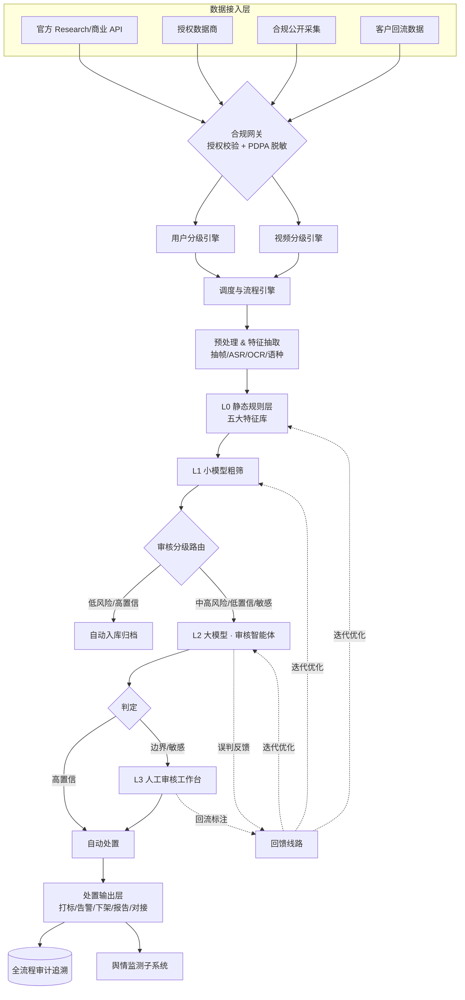
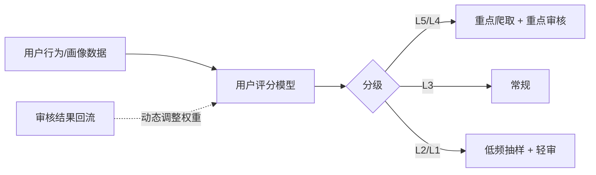
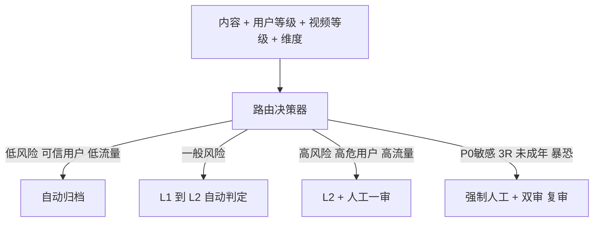
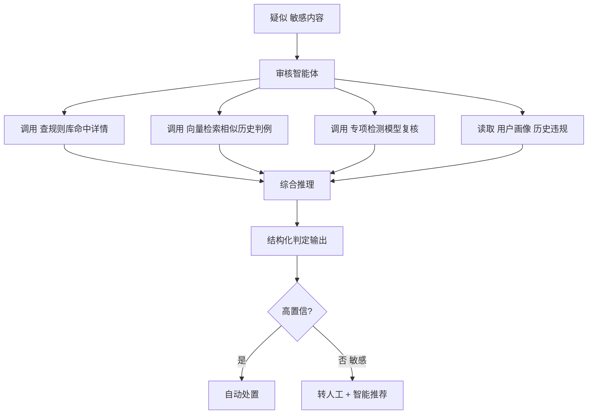
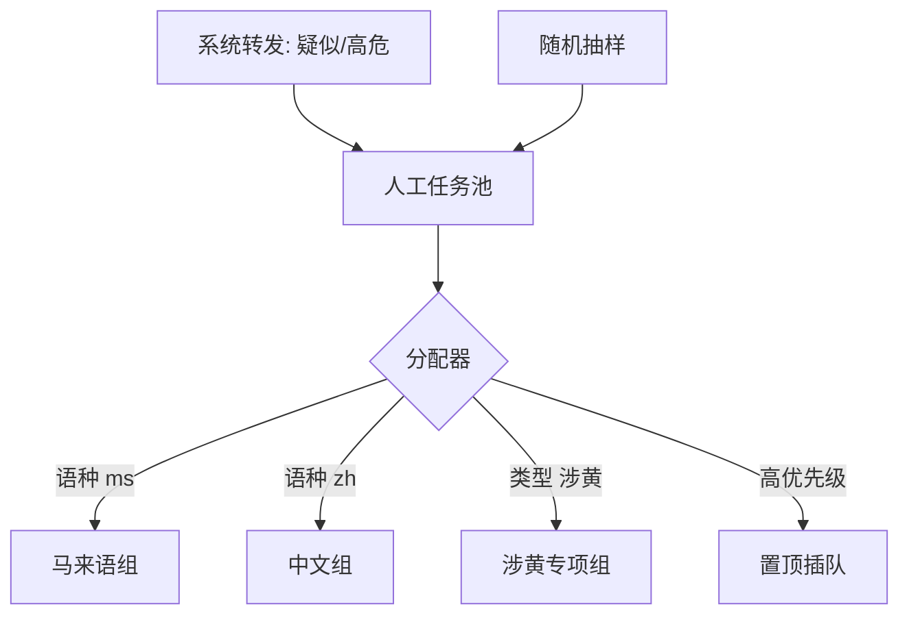
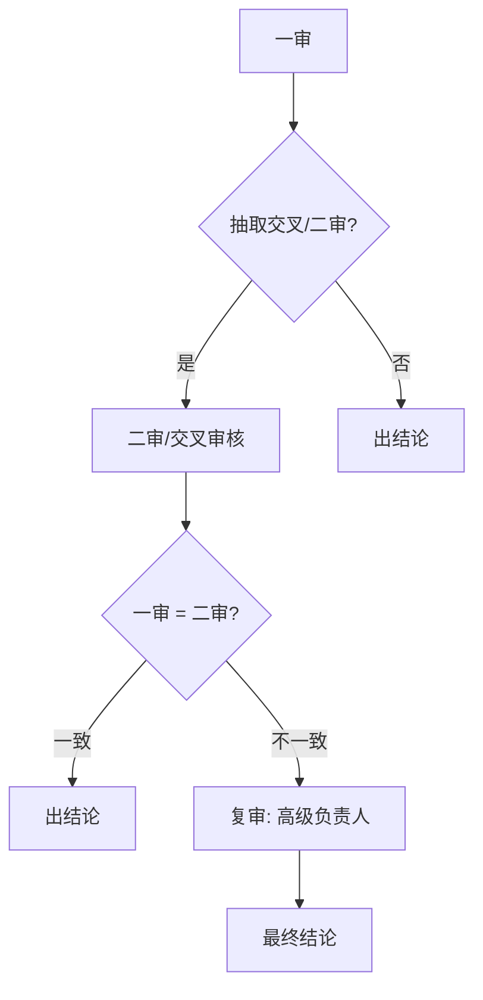
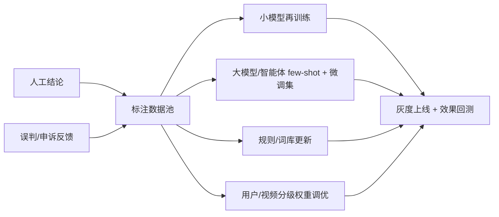

# TikTok 内容审核系统 · 完整设计方案

> 场景：合规风控 + 舆情监测 ｜ 落地某地区｜ 日处理百万级 ｜ 分钟级时效
> 混合数据源 ｜ 开源模型优先 ｜ 私有化部署 ｜ 人工复审 ｜ 全流程可追溯（月级存储）

---
## 1. 总体架构



**核心思想：四级漏斗（L0 规则 → L1 小模型 → L2 大模型/智能体 → L3 人工）**，
用低成本层拦截绝大多数明确样本，仅把灰区/高风险/敏感样本逐级上送，
在百万级吞吐下兼顾成本、精度与合规可解释性。

---

## 2. 数据接入层 & 合规网关

### 2.1 混合数据源
| 来源 | 用途 | 优先级 | 合规等级 |
|------|------|--------|----------|
| 官方 Research / 商业 API | 主数据源 | P0 | 高 |
| 授权第三方数据商 | 补量 / 历史回溯 | P1 | 高 |
| 合规公开页面采集 | 边缘补充 | P2 | 需法务审核 |
| 客户回流数据 | 定向监测 | P0 | 依授权 |

### 2.2 采集工程
- 代理 IP 池 + 账号池 + 指纹隔离 + 速率自适应。
- 调度：分布式任务队列（Temporal / Celery），按地域、话题、账号、**用户等级**分片。
- **合规网关（强制）**：robots/ToS 校验、PDPA 脱敏、来源与授权标记；无授权标记数据不得进入处置流程。

### 2.3 规模规划（百万/天）
- 均值约 12 条/秒，峰值按 3–5x 冗余弹性扩缩容。
- 视频不全量落盘：命中样本 + 抽样 + 证据帧存原片，其余存元数据 + 缩略 + 特征向量，控成本。

---

## 3. 用户分级（用户权重 / 重点爬取 / 重点审核）

### 3.1 分级维度
- **历史违规率、违规严重度、账号画像**（粉丝量、影响力、注册时长、实名/认证）。
- **行为特征**：发布频率、突发爆量、协同/水军特征、敏感话题参与度。
- **舆情权重**：高影响力账号、敏感领域 KOL。

### 3.2 用户等级与策略
| 等级 | 定义 | 爬取策略 | 审核策略 |
|------|------|----------|----------|
| L5 高危 | 屡犯/诈骗/敏感煽动 | 高频重点爬取 | 全量审核 + 强制人工 |
| L4 重点 | 高影响力/敏感领域 KOL | 高频爬取 | 全量过 L2 |
| L3 普通 | 正常活跃账号 | 常规爬取 | 漏斗常规处理 |
| L2 可信 | 长期合规/认证号 | 低频抽样 | 降低抽检比例 |
| L1 白名单 | 官方/权威机构 | 最低频 | 仅规则轻审 |


> 用户等级随审核结果**动态升降级**，形成闭环。

---

## 4. 视频分级（按流量等因素）

### 4.1 分级因子
- **流量热度**：播放量、点赞、评论、转发、增速（爆款优先）。
- **传播风险**：敏感话题标签、负面情感、被举报数。
- **发布者等级**：继承用户分级权重。

### 4.2 等级与处理深度
| 等级 | 触发条件 | 处理策略 |
|------|----------|----------|
| V1 极高 | 爆量/高增速/敏感话题 | 实时优先，全链路 L0→L2，命中即人工 |
| V2 高 | 较高流量或高危用户发布 | 优先队列，全量过 L2 |
| V3 中 | 一般流量 | 漏斗常规 |
| V4 低 | 长尾低流量 | 规则 + 小模型，抽样过 L2 |

> 资源有限时按等级配额：高等级保 SLA，低等级降频/批处理。

---

## 5. 审核分级路由（用户 × 流量 × 违规类别）

综合三要素决定**走多深、谁来审、几审几核**。



**路由权重示例**：`风险路由分 = w1·内容风险 + w2·用户等级 + w3·视频等级 + w4·维度敏感系数`
- 超阈值 → 升级处理深度；P0 维度无视分数，直接强制人工。

---

## 6. 预处理 & 特征抽取层

| 模块    | 开源选型           | 说明                      |
| ----- | -------------- | ----------------------- |
| 转码/抽帧 | FFmpeg         | 关键帧 + 间隔抽帧，按视频等级动态调 fps |
| 去重    | pHash / 视频指纹   | 命中复用历史结论，省算力            |
| ASR   | faster-whisper | 马来语/英语/华语/淡米尔语          |
| OCR   | PaddleOCR      | 字幕、画面文字、导流号             |
| 语种识别  | fastText       | ms/en/zh/ta 路由          |
| 音频特征  | wav2vec2       | 辅助音频违规                  |

> **多语种是某地区关键难点**：马来语+英语+中文+淡米尔语+方言混杂，需分语种路由 + 大模型兜底。

---

## 7. L0 静态规则层 · 五大特征库策略引擎

| 特征库  | 实现                         | 作用          |
| ---- | -------------------------- | ----------- |
| 关键词库 | Aho-Corasick 多模式 + 多语种变体词典 | 敏感词/谐音/变形匹配 |
| 规则引擎 | 规则 DSL / Drools / OPA + 正则 | 导流、模式、行为规则  |
| 黑白名单 | Redis + 布隆过滤器              | 哈希/URL/账号指纹 |
| 语义模型 | XLM-R / BERT + 大模型         | 语义级判定       |
| 图像特征 | CLIP/ViT 向量 + 向量库          | 相似违规召回、图像分类 |

**策略组合**：各库输出「命中信号 + 分数」，由策略编排器加权聚合成综合风险分与维度。
后台可视化配置、热加载、灰度发布、命中统计。

**规则原则**：仅在高确定性场景终判（CSAM 哈希、确认违规指纹）；其余只做"加权信号"，避免误杀。

---

## 8. L1 小模型粗筛层

目标：拦截 85%+ 流量，单条数十毫秒，GPU 批处理。

| 维度          | 任务            | 开源基座                   |
| ----------- | ------------- | ---------------------- |
| 色情低俗        | 帧分类           | NSFW / EfficientNet 微调 |
| 暴力血腥        | 图像分类          | ConvNeXt / ViT         |
| 暴恐/武器/旗帜    | 目标检测          | YOLOv8/v10             |
| 导流/二维码/联系方式 | 检测 + OCR + 正则 | YOLO + PaddleOCR       |
| 多语言文本违规     | 文本分类          | XLM-R / mBERT          |
| 仇恨/辱骂       | 文本分类          | 分语种头                   |
| 图文相关性       | 图文匹配          | 多语言 CLIP               |

输出 `{维度: 分数, 置信度}` → 进入审核分级路由（§5）。

---

## 9. L2 大模型精审 · 审核智能体模块（CMA Agent）

### 9.1 选型（私有化）
| 类型      | 候选                             | 用途             |
| ------- | ------------------------------ | -------------- |
| 多模态 VLM | Qwen2.5-VL / InternVL2.5       | 看帧+读字幕+听转写综合判定 |
| 文本 LLM  | Qwen2.5 / Llama-3.x / DeepSeek | 长文本/评论/上下文     |
| 推理框架    | vLLM / SGLang / TensorRT-LLM   | 高并发 + 量化降本     |

### 9.2 智能体工作机制
不是单次分类，而是 **LLM + 工具调用 + 多步推理** 的 Agent：



**能力**：AI 预审、智能推荐（建议动作+理由+相似判例）、辅助决策；
AI 处理确定性违规，人工专注边界案例。

### 9.3 输出结构（可解释，对齐监管留存）
```json
{
  "content_id": "xxx",
  "decision": "VIOLATION | SUSPECT | PASS",
  "dimensions": [
    {"type": "政治敏感(3R)", "level": "高", "confidence": 0.92,
     "reason": "画面+字幕涉及…",
     "evidence": {"frames": ["t=12.4s"], "text_span": "..."}}
  ],
  "suggested_action": "下架建议 | 告警 | 归档",
  "similar_cases": ["case_123", "case_456"],
  "model_version": "qwen2.5-vl-xxx",
  "reviewed_at": "2026-06-16T10:00:00+08:00"
}
```

---

## 10. 审核维度与优先级

| 优先级 | 维度          | 某地区重点        |
| --- | ----------- | ------------ |
| P0  | 3R：种族/宗教/王室 | 高压线，零容忍，强制双审 |
| P0  | 未成年人保护      | Act 866 法定义务 |
| P0  | 色情低俗        | 含宗教文化尺度      |
| P0  | 暴恐/极端主义     | 旗帜、武器、煽动     |
| P1  | 暴力血腥        |              |
| P1  | 仇恨/网络霸凌     | 多语种          |
| P1  | 虚假信息/谣言     | 舆情联动         |
| P2  | 导流/诈骗/赌博    | 二维码、联系方式     |
| P2  | 版权          | 指纹比对         |

---

## 11. 人工审核机制

### 11.1 入口来源
- **系统转发**：AI 判定为疑似、检测为高危用户、P0 敏感维度命中。
- **随机抽样**：对自动通过内容按比例抽检，监控漏判。

### 11.2 任务分配机制（按语种/类型）
- **按内容类型分发**：图片、文字、音频、视频分流给对应组；某些专项（如涉黄）由专人负责。
- **按语种分发**：ms/en/zh/ta 路由到对应语种审核员。
- **按时间/在线状态**：审核员非 24h 在线，离线时段内容次日优先处理；高危发布者内容优先。
- **优先级队列**：P0 敏感 + 高危用户 + 高流量内容插队置顶。



---

## 12. 人工审核系统

### 12.1 账号管理
- 超级管理员开通/删除账号、分配角色与权限（审核员/二审/质检/管理员）。

### 12.2 监管平台（质量监控）
- **抽样观察 + 操作日志留痕**。
- **交叉审核 / 二审**：内容被一审后，部分进入交叉审核或专门二审部门（KPI 不同，重质量）。
- **复审机制**：两次结果不一致 → 自动升级复审，由更高级负责人裁定。
- **投毒质检**：任务流中混入已知答案金标样本，实时评估审核员准确率与状态。



### 12.3 人工审核平台
- 图/文/音/视频分别定制前端样式与交互。
- 配套：倍速浏览、自动播放、关键帧跳转、命中片段高亮、AI 理由与证据并排、键盘快捷键、一键改判。

---

## 13. 全流程可追溯（机器审核 + 人工审核）

每条内容保留**完整链路**，不可篡改（追加式日志 + 校验和）：


- 记录"谁/哪个模型版本/依据什么/何时/做了什么"，满足 Act 866 监管复核与导出报告。

---

## 14. 回馈线路（闭环优化）


- 人工标注、申诉、误判持续回流，驱动各层迭代；阈值按漏判率/误判率/成本周期调优。

---

## 15. 处置 & 输出层

| 动作 | 说明 |
|------|------|
| 打标入库 | 结构化结果全量入库（维度/分数/理由/证据/版本） |
| 告警 | 分级（即时/汇总），渠道：邮件/IM/Webhook |
| 下架建议 | 含理由与证据，供决策 |
| 报告生成 | 监管合规报告 + 舆情报告（定期+按需） |
| 客户系统对接 | 开放 API / 回调 / 消息队列 |
| 审计日志 | 全链路留痕 |

---

## 16. 舆情监测子系统

与审核共用数据与特征，叠加分析层：
- **事件聚类**：话题/标签/关键词聚合，识别热点与异常增长。
- **情感分析**：多语言情感模型，监测负面走势。
- **传播分析**：账号网络、转发链路、协同行为识别。
- **预警**：增速/负面占比/敏感命中量超阈值触发分级告警。
- **看板**：趋势、热词、Top 内容、地域分布，导出报告。

---

## 17. 实时统计与监控大屏

- **流式统计**：Kafka + Flink 实时聚合（命中量、维度分布、各级吞吐、人工占比、误判率）。
- **存储**：明细写 ClickHouse / OpenSearch（OLAP 多维聚合）。
- **大屏**：Grafana / 自研 BI + WebSocket 实时推送，自定义看板、下钻、阈值告警。

---

## 18. 数据存储与审计

| 用途 | 选型 |
|------|------|
| 元数据/结论 | PostgreSQL |
| 原片/证据帧/缩略图 | MinIO（私有化对象存储） |
| 特征向量/相似检索 | Milvus |
| 全文检索/审计日志 | OpenSearch |
| 流式主干 | Kafka |
| OLAP 统计 | ClickHouse |

- **存储周期**：以月为单位（命中样本 6–12 月、普通元数据 3 月），到期自动归档/清理，可配置。
- **审计追溯**：追加式 + 校验和，不可篡改。

---

## 19. 部署与算力（私有化）

- **编排**：Kubernetes，推理 GPU 节点与流处理 CPU 节点分离。
- **GPU 分配**：L1 小模型少量 GPU 即可支撑百万级；L2 大模型为主要算力点，按 L2 流量与 SLA 配置 + 量化 + 批处理降本。
- **分钟级时效**：Kafka 流式 + 自动扩缩容 + 优先级队列（V1/P0 插队）。
- **高可用**：多副本、限流降级（高峰大模型降级为小模型 + 提高人工抽检）。

---

## 20. 人力规划（百万/天参考）

- L0+L1 拦截后约 10–15% 进 L2，其中约 1–3% 转人工 ≈ 1–3 万条/天。
- 按人均 800–1200 条/天，需 **约 15–30 人**（分语种、含二审/质检、三班倒），按实际命中率调整。

---

## 21. 关键风险与缓解

| 风险 | 缓解 |
|------|------|
| 爬取合规/法律风险 | 官方/授权优先，合规网关强制，法务定期评估 |
| 多语种漏判 | 分语种模型 + 大模型兜底 + 本地审核员 |
| 大模型成本失控 | 四级漏斗、量化、动态阈值、降级策略 |
| 3R/未成年误判代价高 | 强制人工 + 保守阈值 + 双审复审 |
| PDPA/数据出境 | 全私有化、PII 脱敏、用途最小化 |
| 规则被绕过 | OCR/ASR 转文本再匹配 + 变体词库持续维护 |
