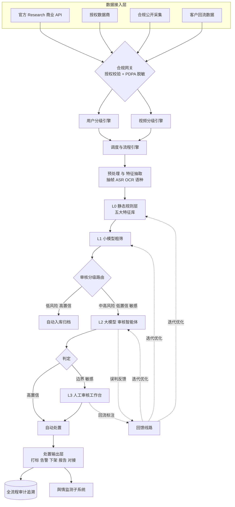
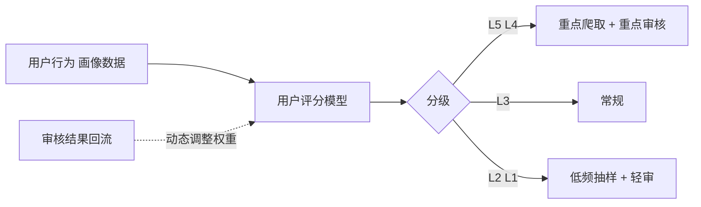
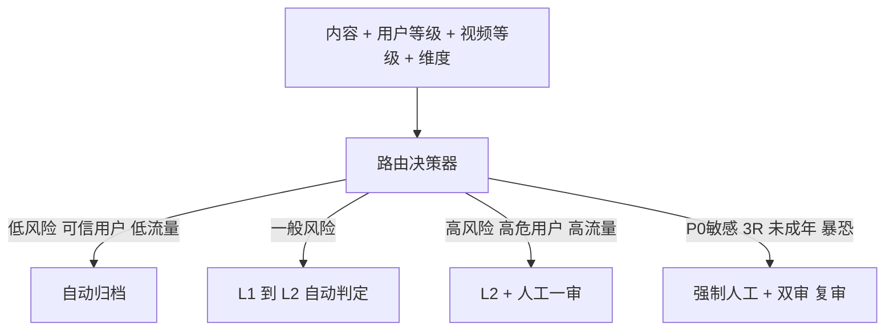
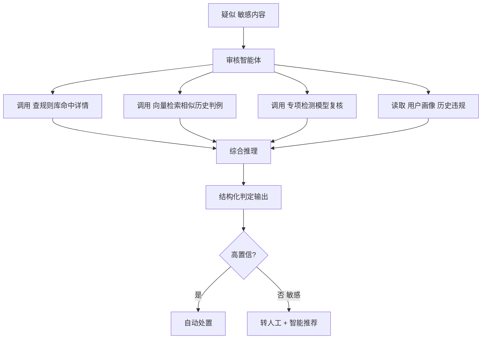
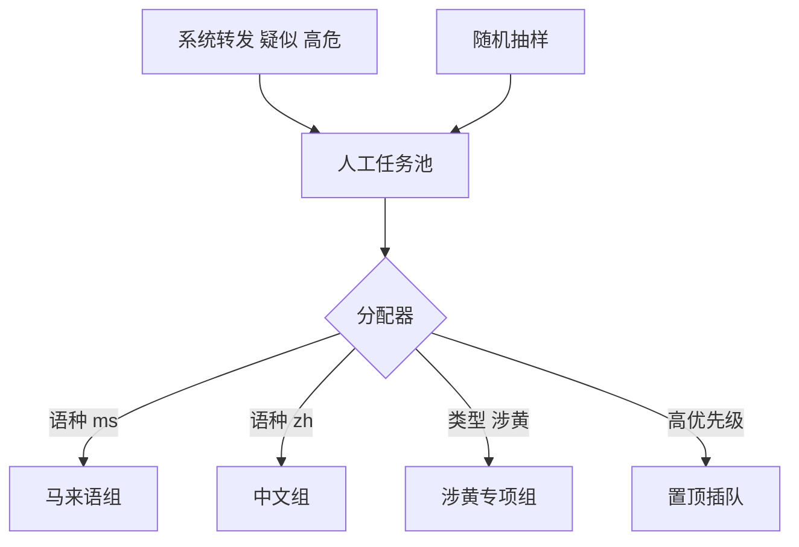
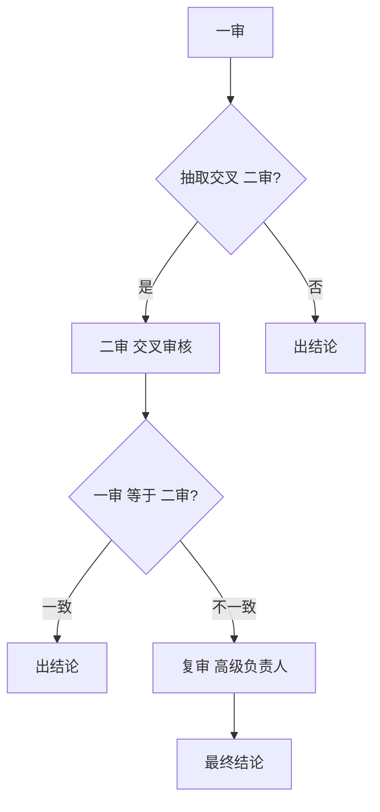
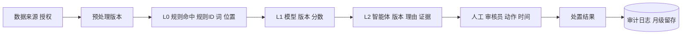
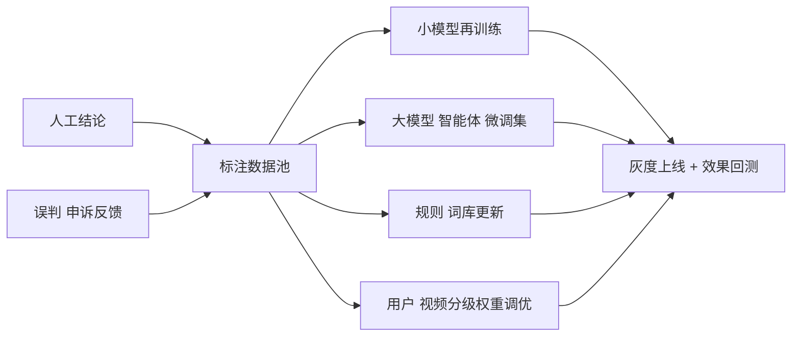

## 图 1 · 总体架构

```mermaid
flowchart TD
    subgraph IN[数据接入层]
        A1[官方 Research 商业 API]
        A2[授权数据商]
        A3[合规公开采集]
        A4[客户回流数据]
    end
    A1 & A2 & A3 & A4 --> GW{合规网关<br/>授权校验 + PDPA 脱敏}

    GW --> UC[用户分级引擎]
    GW --> VC[视频分级引擎]

    UC --> SCH[调度与流程引擎]
    VC --> SCH

    SCH --> PRE[预处理 与 特征抽取<br/>抽帧 ASR OCR 语种]
    PRE --> L0[L0 静态规则层<br/>五大特征库]
    L0 --> L1[L1 小模型粗筛]
    L1 --> RT{审核分级路由}

    RT -->|低风险 高置信| ARCH[自动入库归档]
    RT -->|中高风险 低置信 敏感| L2[L2 大模型 审核智能体]

    L2 --> DEC{判定}
    DEC -->|高置信| ACT[自动处置]
    DEC -->|边界 敏感| HUM[L3 人工审核工作台]

    HUM --> ACT
    ACT --> OUT[处置输出层<br/>打标 告警 下架 报告 对接]

    HUM -.回流标注.-> FB[回馈线路]
    L2 -.误判反馈.-> FB
    FB -.迭代优化.-> L0
    FB -.迭代优化.-> L1
    FB -.迭代优化.-> L2

    OUT --> AUDIT[(全流程审计追溯)]
    OUT --> OPI[舆情监测子系统]
```

## 图 2 · 用户分级

```mermaid
flowchart LR
    U[用户行为 画像数据] --> S[用户评分模型]
    S --> G{分级}
    G -->|L5 L4| HI[重点爬取 + 重点审核]
    G -->|L3| MID[常规]
    G -->|L2 L1| LO[低频抽样 + 轻审]
    F[审核结果回流] -.动态调整权重.-> S
```

## 图 3 · 审核分级路由

```mermaid
flowchart TD
    IN[内容 + 用户等级 + 视频等级 + 维度] --> R[路由决策器]
    R -->|低风险 可信用户 低流量| A1[自动归档]
    R -->|一般风险| A2[L1 到 L2 自动判定]
    R -->|高风险 高危用户 高流量| A3[L2 + 人工一审]
    R -->|P0敏感 3R 未成年 暴恐| A4[强制人工 + 双审 复审]
```

## 图 4 · 审核智能体

```mermaid
flowchart TD
    C[疑似 敏感内容] --> AG[审核智能体]
    AG --> T1[调用 查规则库命中详情]
    AG --> T2[调用 向量检索相似历史判例]
    AG --> T3[调用 专项检测模型复核]
    AG --> T4[读取 用户画像 历史违规]
    T1 & T2 & T3 & T4 --> RZ[综合推理]
    RZ --> O[结构化判定输出]
    O --> AUTO{高置信?}
    AUTO -->|是| ACT[自动处置]
    AUTO -->|否 敏感| HUM[转人工 + 智能推荐]
```

## 图 5 · 人工任务分配

```mermaid
flowchart TD
    SRC1[系统转发 疑似 高危] --> Q[人工任务池]
    SRC2[随机抽样] --> Q
    Q --> D{分配器}
    D -->|语种 ms| TM[马来语组]
    D -->|语种 zh| TZ[中文组]
    D -->|类型 涉黄| TP[涉黄专项组]
    D -->|高优先级| TT[置顶插队]
```

## 图 6 · 交叉审核与复审

```mermaid
flowchart TD
    A[一审] --> X{抽取交叉 二审?}
    X -->|是| B[二审 交叉审核]
    X -->|否| OK1[出结论]
    B --> C{一审 等于 二审?}
    C -->|一致| OK2[出结论]
    C -->|不一致| RV[复审 高级负责人]
    RV --> OK3[最终结论]
```

## 图 7 · 全流程可追溯

```mermaid
flowchart LR
    S1[数据来源 授权] --> S2[预处理版本]
    S2 --> S3[L0 规则命中 规则ID 词 位置]
    S3 --> S4[L1 模型 版本 分数]
    S4 --> S5[L2 智能体 版本 理由 证据]
    S5 --> S6[人工 审核员 动作 时间]
    S6 --> S7[处置结果]
    S7 --> LOG[(审计日志 月级留存)]
```

## 图 8 · 回馈线路

```mermaid
flowchart LR
    HUM[人工结论] --> POOL[标注数据池]
    MIS[误判 申诉反馈] --> POOL
    POOL --> R1[小模型再训练]
    POOL --> R2[大模型 智能体 微调集]
    POOL --> R3[规则 词库更新]
    POOL --> R4[用户 视频分级权重调优]
    R1 & R2 & R3 & R4 --> ONLINE[灰度上线 + 效果回测]
```