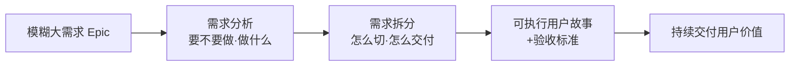
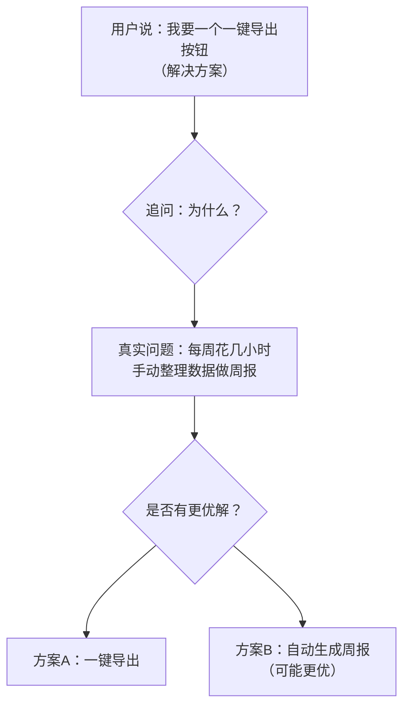
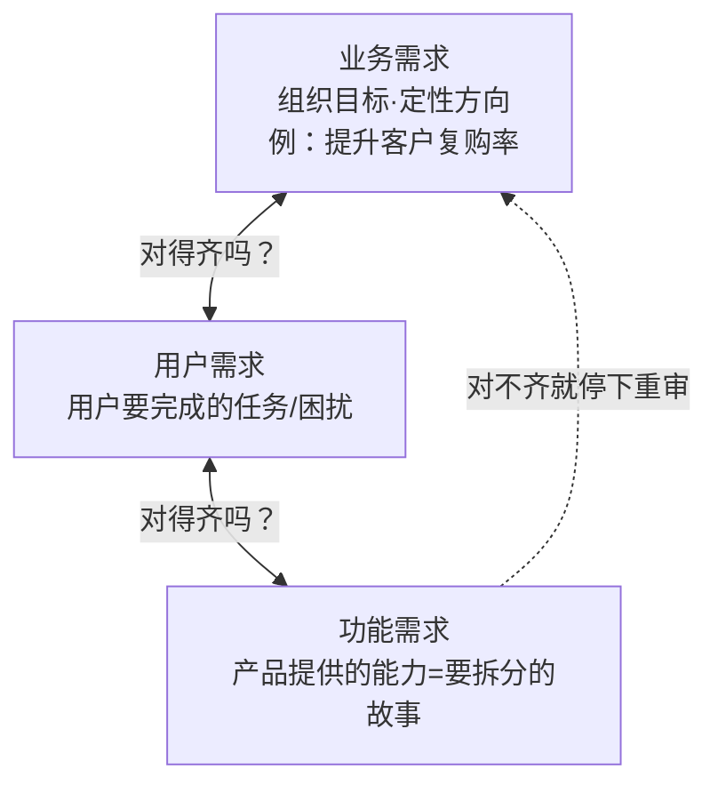
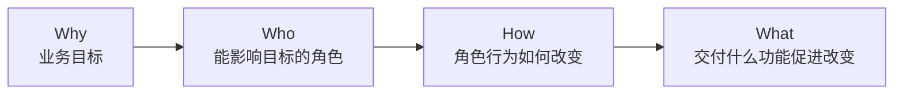
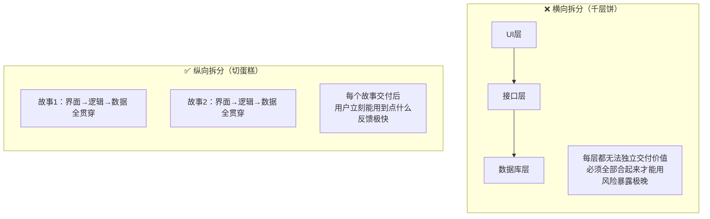
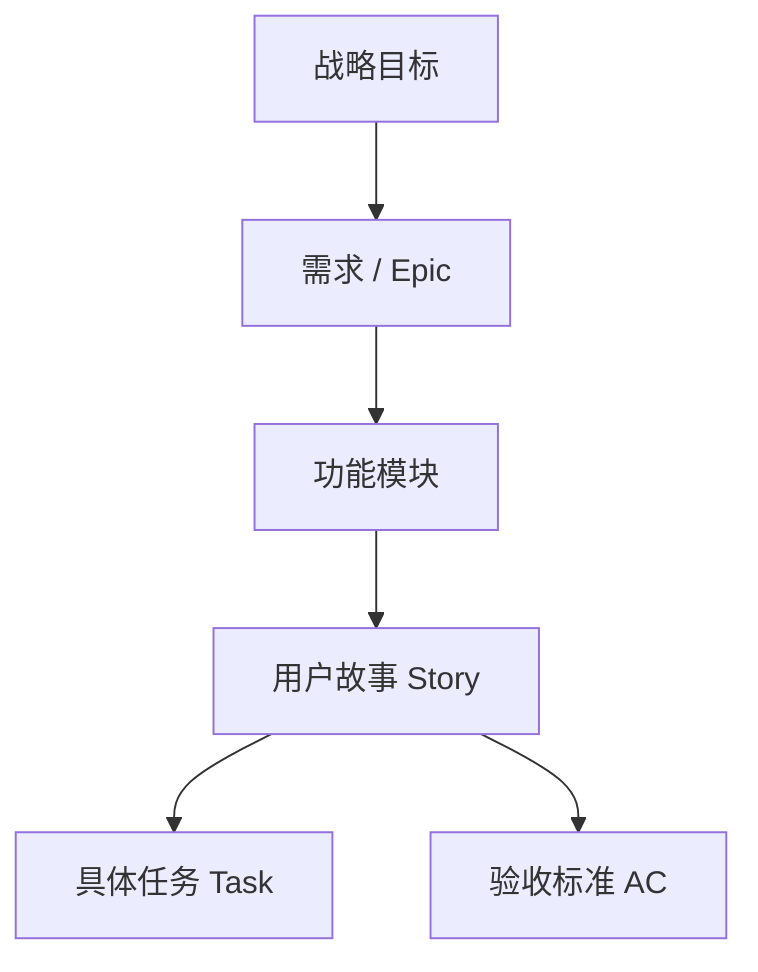
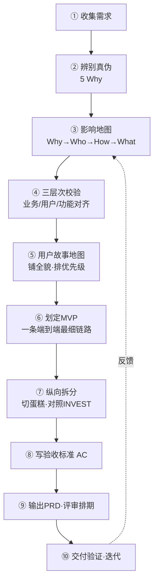
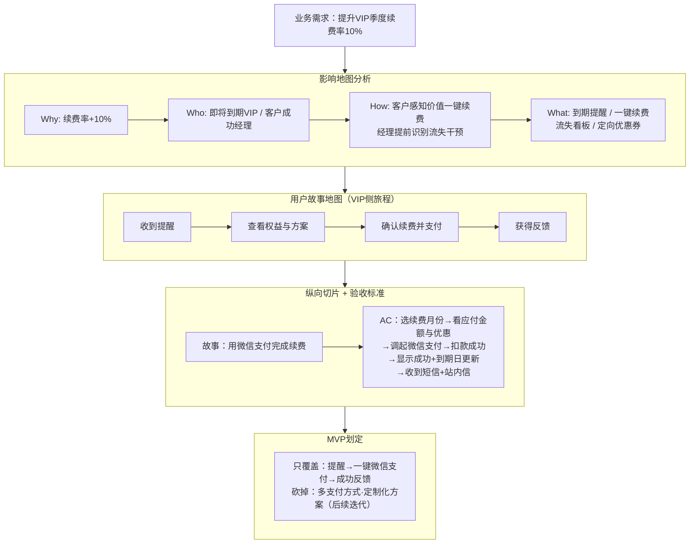

# 需求拆分与需求分析：产品经理完整方法论

> **核心心法**：拆分是手段，持续交付用户价值是目的；分析是过程，清晰定义问题与验收标准是结果。
>
> **两个灵魂反问**
> - 拆分时问：*"这个故事交付后，用户能立刻用到什么？"*
> - 分析时问：*"我们到底在解决什么问题，凭什么说做完了？"*

---

## 目录总览

---

# 一、需求分析：从"想要什么"到"解决什么问题"

> 需求分析的核心不是记录需求，而是**挖掘问题，并定义解决方案的价值边界**。

## 1. 辨别需求真伪（第一道关卡）

拿到需求先问四件事：

| 追问         | 目的                    |
| ---------- | --------------------- |
| 谁提的？       | 判断代表多少用户/多大价值         |
| 真需求还是伪需求？  | 用户要的不是"更快的马"，而是"更快到达" |
| 场景是什么？     | 什么人、什么情境、解决什么问题       |
| 为什么？（连问5次） | **5 Why** 挖到根因        |

## 2. 三段论锁定需求本质

> **作为【谁】，我想要【什么】，以便【价值】**

这个格式隐含分析骨架：**用户角色 → 痛点/场景 → 期望价值**

**关键动作：分离"解决方案"与"问题"**

## 3. 三层次纵深穿梭

> 分析过程就是不断在三层间穿梭校验，**任一层对不齐，砍掉伪需求或重新审视**。

## 4. 价值与优先级评估

| 模型 | 用途 |
|------|------|
| **KANO** | 区分基本型/期望型/兴奋型需求 |
| **RICE** | Reach × Impact × Confidence ÷ Effort 打分排序 |
| **四象限** | 重要/紧急程度分类 |
| **投入产出比** | 价值 vs 成本 |

## 5. 可行性评估

- **技术可行性**：与研发对齐实现难度
- **商业可行性**：是否符合商业模式
- **合规/资源**：法律、成本、人力

## 6. 两大串联工具

### 影响地图（Why → Who → How → What）
确保每个功能都能**向上回溯到业务价值**，砍掉价值不明确的伪需求。

### 用户故事地图（User Story Mapping）
- **横轴**：用户旅程骨架（从左到右）
- **纵轴**：每个活动下按优先级罗列故事
- **作用**：看全局 + 划 MVP + 自然完成优先级排序

## 7. 分析的真正交付物 —— 验收标准（AC）

> 分析不是写完故事就结束，**验收标准才是交付物**。

必须想清楚：
- 正常流程每一步具体怎样？
- 边界条件与异常情况如何处理？
- 性能、安全、体验的硬要求？

> ⚠️ 没有 AC，开发与测试对"做完"的理解会严重偏差。

---

# 二、需求拆分：从"史诗"到可交付的用户故事

> 不拆分的需求就是"黑盒"，极易导致范围蔓延、交付周期失控。
> 拆分本质：把笼统大需求（Epic）→ 一系列**小粒度、可独立交付验证的用户价值单元**。

## 1. 检验标尺 —— INVEST 原则

| 字母 | 含义 | 一句话检验 |
|------|------|-----------|
| **I**ndependent | 独立 | 能单独开发/测试/发布吗？ |
| **N**egotiable | 可协商 | 是"讨论邀请"还是"死合同"？ |
| **V**aluable | 有价值 | 用户/业务感知得到吗？ |
| **E**stimable | 可估算 | 团队能报出工作量吗？ |
| **S**mall | 小 | 一个迭代能做完吗？ |
| **T**estable | 可测试 | 有明确验收标准吗？ |

## 2. 切法：坚决"切蛋糕"，反对"千层饼"

> **记忆点：宁可功能少，不可链路断。**

## 3. 四大纵向拆分维度

| 维度 | 拆分思路 | 例子 |
|------|---------|------|
| 按**用户角色/权限** | 先做哪个角色核心链路 | 先普通用户，后管理员 |
| 按**操作流程** | 先主流程，再分支/异常 | 先跑通下单，再补退款 |
| 按**业务规则/数据变体** | 先简单规则，再叠加复杂 | 先微信支付，再多支付方式 |
| 按**体验质量** | 先可用，再优化非功能需求 | 先能用，再优化性能/交互 |

## 4. 拆分层级结构

---

# 三、完整工作流程（一图流）

| 阶段  | 动作          | 产出物            |
| --- | ----------- | -------------- |
| ①   | 收集需求        | 需求池            |
| ②   | 辨别真伪（5 Why） | 真实问题定义         |
| ③   | 影响地图        | 高价值功能候选 + 砍伪需求 |
| ④   | 三层次校验       | 需求对齐确认         |
| ⑤   | 用户故事地图      | 用户旅程 + 优先级     |
| ⑥   | 划定 MVP      | 首个可发布范围        |
| ⑦   | 纵向拆分（切蛋糕）   | 一批小故事          |
| ⑧   | 写验收标准       | 每个故事的 AC       |
| ⑨   | 输出 PRD      | 评审文档 + 排期      |
| ⑩   | 交付验证        | 上线 + 数据反馈      |

---

# 四、串联实战示例：提升 VIP 续费率

**结论**：一个模糊的"提升续费"大需求，经分析找到高价值干预点，再经纵向拆分，变成**首个迭代即可交付、可验证的用户故事**。

---

# 五、常见误区提醒

| 误区 | 正确做法 |
|------|---------|
| 把"解决方案"当需求 | 先挖清楚**问题**本身 |
| 横向拆分（千层饼） | 坚持纵向"切蛋糕"，端到端交付 |
| 需求拆得过大/过细 | 一个 Story 控制在一个迭代内完成 |
| 不写验收标准 | 每个需求明确"做成什么样算完成" |
| 一次想做全 | 坚持 MVP，小步快跑 |
| 功能不回溯业务价值 | 用影响地图向上追溯，砍伪需求 |

---

> **一句话收尾**：用这套逻辑，可以把任何一个模糊的大需求，解构成团队马上能动手、且每一步都对准用户价值的清晰任务。