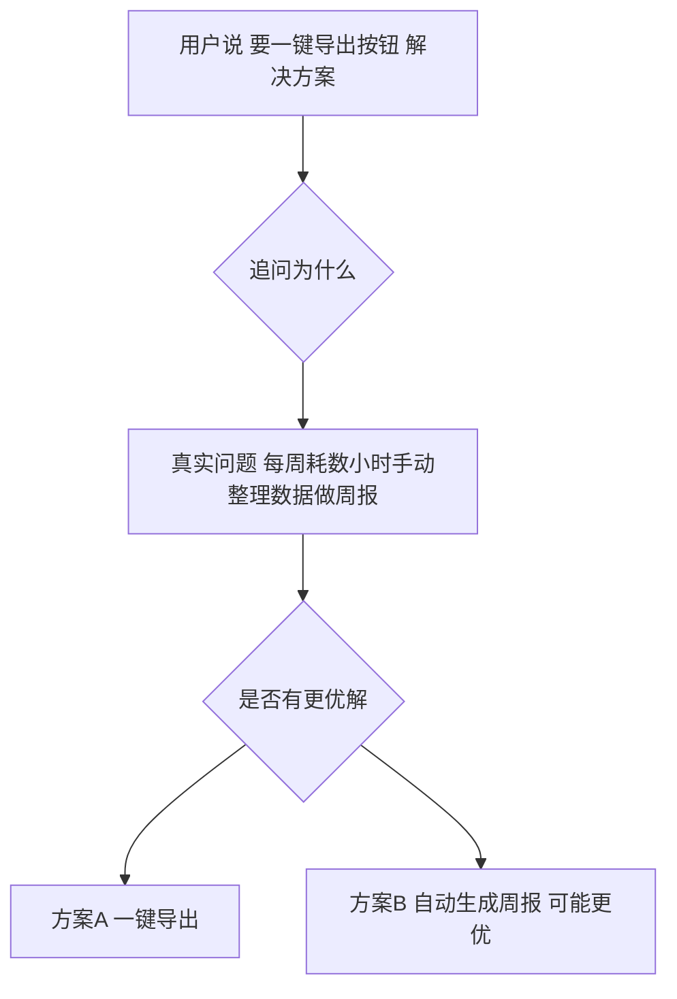
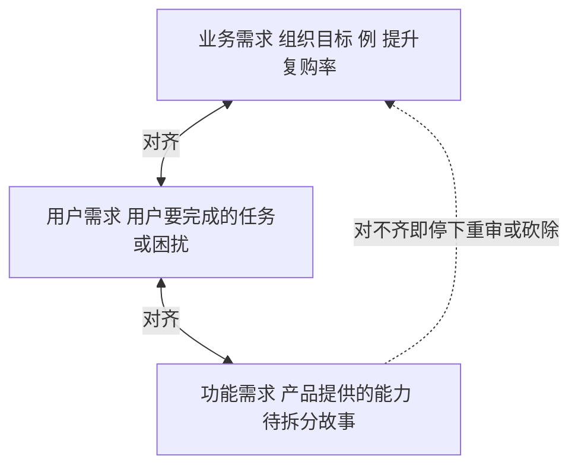
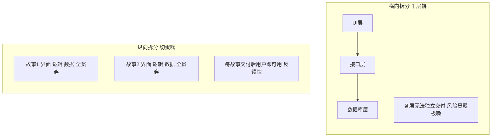
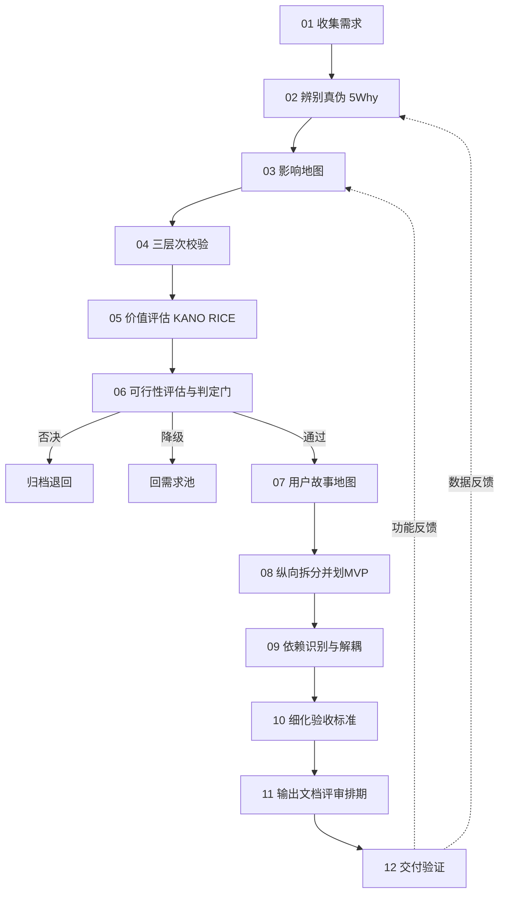
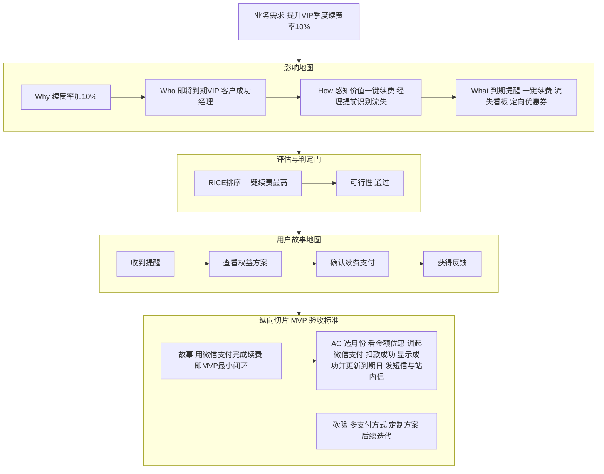

# 需求分析与需求拆分过程规程

## 文档标识

| 项目 | 内容 |
|------|------|
| 文档名称 | 需求分析与需求拆分过程规程 |
| 编制依据 | GJB 438C《军用软件开发文档通用要求》 |
| 文档类别 | 软件开发过程规程（供智能体执行的提示词规范） |
| 密级 | 内部 |
| 版本 | V1.0 |

## 1 范围

### 1.1 标识
本规程标识为“需求分析与需求拆分过程规程”，版本 V1.0。

### 1.2 系统概述
本规程规定从模糊大需求（Epic）到可独立交付、可验证用户故事的分析、评估、拆分、解耦与反馈过程，明确各阶段输入、活动、判定准则与产出物，供承接需求解构任务的智能体作为执行提示词使用。

### 1.3 文档概述
本规程按活动顺序组织，含需求分析（第 4 章）、拆分标尺（第 5 章）、纵向拆分（第 6 章）、依赖处理（第 7 章）、验收标准与产出（第 8 章）、示例（第 9 章）、误区（第 10 章）及执行约束（第 11 章）。

### 1.4 适用范围
本规程适用于面向用户的功能需求；对技术债治理、架构重构、数据迁移等无直接用户可感知价值的需求，其切分依据按 6.3 条执行。

## 2 引用文件
- GJB 438C《军用软件开发文档通用要求》
- INVEST 用户故事质量准则
- 影响地图（Impact Mapping）
- 用户故事地图（User Story Mapping）
- KANO、RICE 需求价值评估模型

## 3 术语和定义

| 术语    | 定义                       |
| ----- | ------------------------ |
| Epic  | 粒度过大、无法在单一迭代内交付的大需求      |
| Story | 小粒度、可独立交付并验证的用户价值单元      |
| AC    | 验收标准，判定“完成”的客观依据         |
| MVP   | 最小可行产品，首个可发布并验证核心假设的最小闭环 |
| 判定门   | 输出“通过/降级/否决”三态之一的决策节点    |
| 5 Why | 连续追问根因的分析方法              |

## 4 需求分析

### 4.1 需求真伪辨别
拿到需求先追问四项。

| 追问 | 目的 |
|------|------|
| 谁提的 | 判断代表的用户规模与价值 |
| 真需求还是伪需求 | 用户要的不是更快的马，而是更快到达 |
| 场景是什么 | 什么人、什么情境、解决什么问题 |
| 为什么（连问五次） | 用 5 Why 挖到根因 |

### 4.2 需求本质锁定
采用三段论：作为【谁】，我想要【什么】，以便【价值】。
分析骨架为：用户角色、痛点场景、期望价值。
关键活动为分离“解决方案”与“问题”，见图 4-1。

图 4-1 解决方案与问题的分离

### 4.3 三层次校验
在业务、用户、功能三层间穿梭校验，见图 4-2。任一层对不齐，砍除伪需求或重新审视。

图 4-2 三层次校验

### 4.4 价值评估
价值评估为进入拆分前的强制环节，不得跳过。

| 模型 | 用途 | 流程位置 |
|------|------|----------|
| KANO | 区分基本型、期望型、兴奋型 | 校验后、可行性前 |
| RICE | 触达×影响×信心÷成本 排序 | 校验后、可行性前 |
| 四象限 | 重要与紧急分类 | 辅助 |
| 投入产出比 | 价值对比成本 | 辅助 |

### 4.5 可行性评估与判定门
评估维度包括技术可行性、商业可行性、合规与资源。评估后必须输出三态之一。

| 结果 | 处理 |
|------|------|
| 通过 | 进入用户故事地图（4.7） |
| 降级 | 退回需求池并标注触发条件 |
| 否决 | 归档并记录否决理由 |

本条为决定需求存废的显式决策门，禁止无判定直接推进。

### 4.6 影响地图
按 Why、Who、How、What 保证每个功能可回溯到业务价值，见图 4-3。

图 4-3 影响地图

### 4.7 用户故事地图
横轴为用户旅程骨架，纵轴为各活动下按优先级罗列的故事。纵轴仅解决同一活动内优先级；跨活动全局排序以 4.4 条结果为准，二者不得相互替代。

### 4.8 验收标准
验收标准为分析活动的交付物，须覆盖正常流程、边界与异常、性能安全体验硬要求。
验收标准采用渐进精化：拆分阶段仅确定边界，进入迭代排期前再细化为可测试条目。禁止在故事刚拆出时锁死全部验收标准，以保持可协商性。

## 5 需求拆分标尺

### 5.1 INVEST 准则

| 字母 | 含义 | 检验问句 |
|------|------|----------|
| Independent | 独立 | 能单独开发测试发布吗 |
| Negotiable | 可协商 | 是讨论邀请还是死合同 |
| Valuable | 有价值 | 用户或业务感知得到吗 |
| Estimable | 可估算 | 团队能报出工作量吗 |
| Small | 小 | 一个迭代能做完吗 |
| Testable | 可测试 | 有明确验收标准吗 |

Independent 为理想态，存在依赖时按第 7 章处理，不得为追求绝对独立而过度拆分。

### 5.2 拆分粒度判定信号
出现下列任一信号判定为过大，应继续拆分：
- 单个故事含三个以上不同价值点；
- 验收标准预计超过八条；
- 故事描述以“和”或“并且”连接多个动词；
- 预估工作量超过单一迭代容量。

出现下列信号判定为过细，应合并：
- 交付后用户无任何可感知变化；
- 单独发布无独立价值，必须依附其他故事方可使用。

## 6 纵向拆分

### 6.1 纵向拆分原则
坚持纵向拆分（切蛋糕），反对横向拆分（千层饼），见图 6-1。MVP 划定与纵向拆分为同一活动的两面：拆分产生候选故事，MVP 即取其最小可发布闭环，二者同步完成。

图 6-1 横向与纵向拆分对比

### 6.2 纵向拆分维度

| 维度       | 思路         | 示例        |
| -------- | ---------- | --------- |
| 用户角色权限   | 先做核心角色链路   | 先普通用户后管理员 |
| 操作流程     | 先主流程再分支异常  | 先下单后退款    |
| 业务规则数据变体 | 先简单后复杂     | 先微信支付后多方式 |
| 体验质量     | 先可用后优化非功能项 | 先能用后优化性能  |

### 6.3 非用户型需求切分依据
对无直接用户可感知价值的需求，不适用切蛋糕，应按下列依据切分：
- 按风险降低程度切分，先降最高风险；
- 按技术价值与可复用能力切分；
- 按可回滚的最小变更单元切分。

### 6.4 拆分层级结构
拆分层级见图 6-2。

图 6-2 拆分层级结构

## 7 依赖识别与解耦

### 7.1 处理活动

| 活动 | 说明 |
|------|------|
| 识别依赖 | 标注技术、数据、业务前置关系 |
| 依赖排序 | 被依赖故事优先形成交付序列 |
| 解耦 | 用桩数据、Mock、特性开关切断硬依赖 |
| 无法解耦 | 合并为较大故事或标注同迭代绑定交付 |

### 7.2 判定规则
- 两故事必须同时上线才有价值时视为一个交付单元；
- 依赖可通过 Mock 打断时保留拆分并分别交付。

## 8 验收标准细化与产出物

### 8.1 细化时机
进入迭代排期前，将 4.8 条的边界验收标准细化为覆盖正常流、边界、异常、非功能要求的可测试条目。

### 8.2 各阶段产出物

| 序号 | 活动 | 产出物 |
|------|------|--------|
| 01 | 收集需求 | 需求池 |
| 02 | 辨别真伪 | 真实问题定义 |
| 03 | 影响地图 | 高价值功能候选 |
| 04 | 三层次校验 | 需求对齐确认 |
| 05 | 价值评估 | 优先级排序 |
| 06 | 可行性评估 | 判定门三态结论 |
| 07 | 用户故事地图 | 用户旅程与活动内优先级 |
| 08 | 纵向拆分与划 MVP | 故事清单与首发范围 |
| 09 | 依赖识别与解耦 | 交付序列与解耦方案 |
| 10 | 细化验收标准 | 每故事可测试验收标准 |
| 11 | 输出需求文档 | 评审文档与排期 |
| 12 | 交付验证 | 上线与数据反馈 |

### 8.3 总体流程
总体流程见图 8-1。

图 8-1 总体流程

## 9 应用示例：提升 VIP 续费率
应用示例见图 9-1。一个模糊的“提升续费”大需求，经真伪辨别、价值评估、可行性判定门筛选，再经纵向拆分与依赖处理，收敛为首个迭代即可交付并验证的用户故事。

图 9-1 提升 VIP 续费率示例

## 10 常见误区与纠正

| 误区 | 正确做法 | 对应条款 |
|------|----------|----------|
| 把解决方案当需求 | 先挖清问题本身 | 4.2 |
| 横向拆分千层饼 | 坚持纵向切蛋糕 | 6.1 |
| 跳过价值与可行性评估 | 强制作为判定门 | 4.4 4.5 |
| 故事刚拆出即锁死验收标准 | 渐进精化 | 4.8 |
| 忽视故事间依赖 | 识别排序解耦 | 第 7 章 |
| 技术需求硬套切蛋糕 | 按风险与技术价值切分 | 6.3 |
| 拆分过大或过细 | 用量化信号判定 | 5.2 |
| 一次想做全 | 坚持 MVP 小步快跑 | 6.1 |
| 功能不回溯业务价值 | 用影响地图向上追溯 | 4.6 |
| 反馈只改功能不验假设 | 数据反馈回溯至问题定义 | 8.3 |

## 11 智能体执行约束
执行本规程的智能体须遵守：
1. 未通过 4.5 条判定门，不得进入拆分环节；
2. 每个输出的故事须逐条通过 5.1 与 5.2 自检并附结论；
3. 每个故事须携带验收标准，并标明为边界验收标准或细化验收标准；
4. 输出故事清单时须同时给出依赖关系或“无依赖”声明；
5. 面向用户功能按 6.2 条切分，非用户型按 6.3 条切分；
6. 交付验证反馈须显式回答问题假设是否成立，而非仅描述功能表现；
7. 任何砍除的需求须记录理由并可追溯。